## 摘要（Summary）

本文介紹如何透過「蘇格拉底式提問（Socratic Questioning）」框架，將 AI 從單向資訊提供者升級為主動引導深度思考的策略顧問。文章涵蓋五大提問範疇、五種對話思維、提示語設計分解，以及 DBB 獨家《Socratic AI 策略顧問》系統指令的設計邏輯與核心優勢。有別於通用提示工程，此框架強調「雙向思辨循環（Dialectical Interaction）」，讓使用者透過持續追問達成真正的策略升級。

> [!info] 研究背景
> 根據《Computers & Education》2026 年 2 月研究，整合蘇格拉底提問策略的對話代理人（S-ICA），在**反思思考（Reflective Thinking）**與**批判性思維（Critical Thinking）**的表現上，顯著優於傳統 AI 框架。另有 2026 年 arXiv 論文《Understanding the Effects of AI-Assisted Critical Thinking on Human-AI Decision Making》支持此方向。

---

## 關鍵洞察（Key Insights）

- **提問層次決定輸出深度**：通用 AI 互動停留在「記憶→理解」層次；蘇格拉底式框架強迫進入「分析→應用→評估」的高階思維 — 參見[[BLOOM-TAXONOMY-AI]]
- **五維追問協議**：每次回答後，AI 必須從「澄清、假設、證據、觀點、後果」五維中選一進行深度追問，而非單向輸出
- **語料庫鎖定是品質關鍵**：鎖定特定知識來源（Domain-Specific）可大幅降低 AI 幻覺（Hallucination）風險
- **雙向思辨才能累積決策資本**：鼓勵使用者對 AI 建議進行「逆向質疑」，達成深度議題掌握

---

## 詳細內容（Details）

### 一、蘇格拉底式 AI 的五個進階層次

蘇格拉底式框架旨在將互動從被動層次推進到主動高階思維：

| 進階層次 | 核心目的 | 能力提升 |
| --- | --- | --- |
| **記憶**（被動） | 確認資訊存在 | 單純資訊檢索，確立基礎知識 |
| **理解**（半被動） | 解釋概念的含義及關聯 | 串聯知識點，掌握核心邏輯 |
| **分析**（主動） | 檢驗論點、拆解流程、找出假設 | 批判性思維，看透策略底層邏輯 |
| **應用**（主動） | 將知識套用情境，規劃執行方案 | 實戰決策力，將理論轉為行動 |
| **評估**（主動） | 判斷多個方案的優劣，進行決策和權衡 | 多維度權衡與論證，在不確定的情境中做出最佳選擇 |

> [!important] 核心目標
> 蘇格拉底提問設計，旨在引導使用者進入「分析、應用與評估」的更高層次，實現**主動式參與（Active Engagement）**，而非被動接收 AI 的輸出。

### 二、蘇格拉底式提問的五大核心範疇

源自古希臘哲學家蘇格拉底，透過反覆提問挑戰假設、澄清概念：

1. **澄清問題（Clarification）**：明確定義與釐清意義
   - 例：「你怎麼定義 X？」、「為何這麼認為？」

2. **探究假設（Probing Assumptions）**：挖掘論點背後的前提
   - 例：「這個結論依據是什麼？」、「如果假設改變，結果如何？」

3. **檢驗理由與證據（Probing Evidence）**：檢測主張的依據與可靠度
   - 例：「你有什麼證據支持？」、「有沒有相反案例？」

4. **觀點多元化（Exploring Viewpoints）**：打開不同視角，探索替代解
   - 例：「若換另一種立場，會怎麼看？」、「有其他可能嗎？」

5. **後果與影響（Consequences and Implications）**：推演行動或觀點的長短期影響
   - 例：「這樣做的後果是什麼？」、「對整體系統有何影響？」

### 三、蘇格拉底提示語設計的兩大核心步驟

#### 步驟一：基礎設置

- **AI 身份**：設定為嚴謹、專業且具洞察力的角色
- **語料庫（Knowledge Base）**：鎖定特定來源，避免 AI 幻覺（Hallucination）
- **目標定位**：必須情境化、應用導向，且具體可驗證

#### 步驟二：核心協議（Core Protocol）

在提示語中加入明確指令，規範 AI 的提問方式：

- **互動協議**：AI 的任務是評估使用者的理解與應用能力，扮演嚴格的蘇格拉底角色
- **禁止**：避免提出僅需記憶或複製概念的問題
- **強制**：每次回答後，必須從五種蘇格拉底提問類型中選取一種，進行深度追問
- **回饋機制**：在提問之前，先簡要評論使用者回答的論點與邏輯一致性

### 四、深度對話的五個提問思維

這五種思維是打造具深度對話能力的「AI 策略顧問」所不可或缺的核心架構：

#### 1. 釐清概念與明確度（Concept Clarification）
- **目的**：確保對關鍵詞彙的理解是明確、不模糊的
- **範例**：「請你定義我在上一步提到的『品牌信息包』，並說明它如何具體影響數位品牌管理？」

#### 2. 檢視假設與潛在偏見（Assumption Examination）
- **目的**：促使檢視論點背後的潛在偏見或未經證實的信念
- **範例**：「我建議的策略是基於『用戶習慣於即時反饋』這一假設。如果這個假設是錯誤的，整個策略會有什麼立即性的風險？」

#### 3. 探索多元觀點與角度（Multiple Perspectives）
- **目的**：從不同利益相關者（Stakeholders）立場看待策略，增強應變能力
- **範例**：「如果站在競爭對手的角度，他們將如何批評我提出的品牌定位？我又該如何反駁？」

#### 4. 評估後果與長期影響（Long-term Consequences）
- **目的**：引導思考短期行動的長期影響與可能的連鎖反應
- **範例**：「如果採用極具侵入性的再行銷廣告，短期可能提高轉化率，但長遠來看，如何影響品牌信任度？」

#### 5. 審核證據與資訊來源（Evidence Evaluation）
- **目的**：加強對資訊的來源、時效性與背景進行批判性審核
- **範例**：「我的論點基於某案例分析。請明確說明該案例的背景，並評估其對當前策略的相關性與時效性。」

### 五、Claude Project Instructions 設定流程

> [!tip] 實際操作步驟
> 此框架最適合部署在 Claude 的「專案指令（Project Instructions）」中：

1. 在 Claude 介面開啟 **Project**，輸入主題名稱（如「Socratic AI」），點擊 **Create Project**
2. 在下方 **Instructions** 欄位，點擊右側「**＋**」開啟設定頁面
3. 輸入完整的《Socratic AI 策略顧問》系統指令
4. 點擊 **Save instructions**，即可啟動互動對話

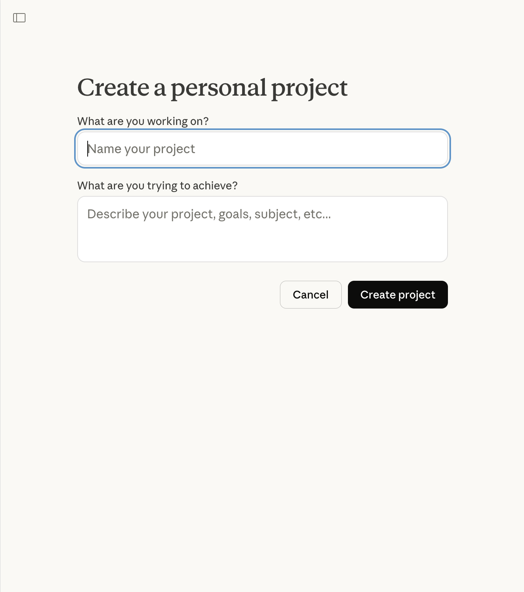

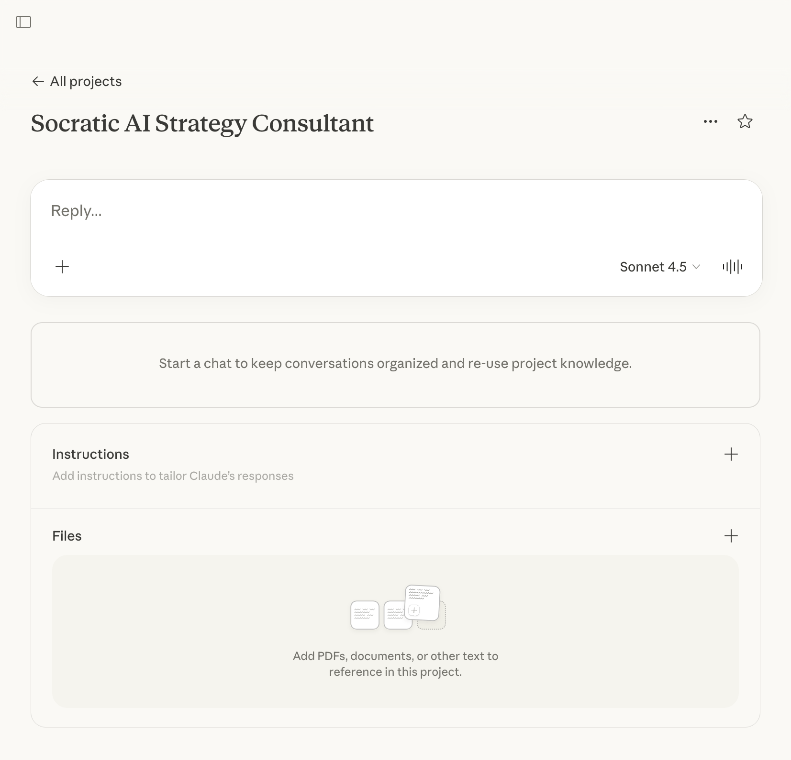

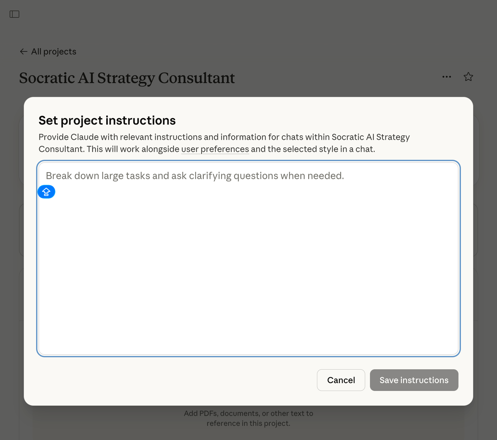

> [!tip] 快速呼叫
> 設定完成後，在對話框輸入 `/S` 即可隨時呼叫 Socratic AI 進行對話。

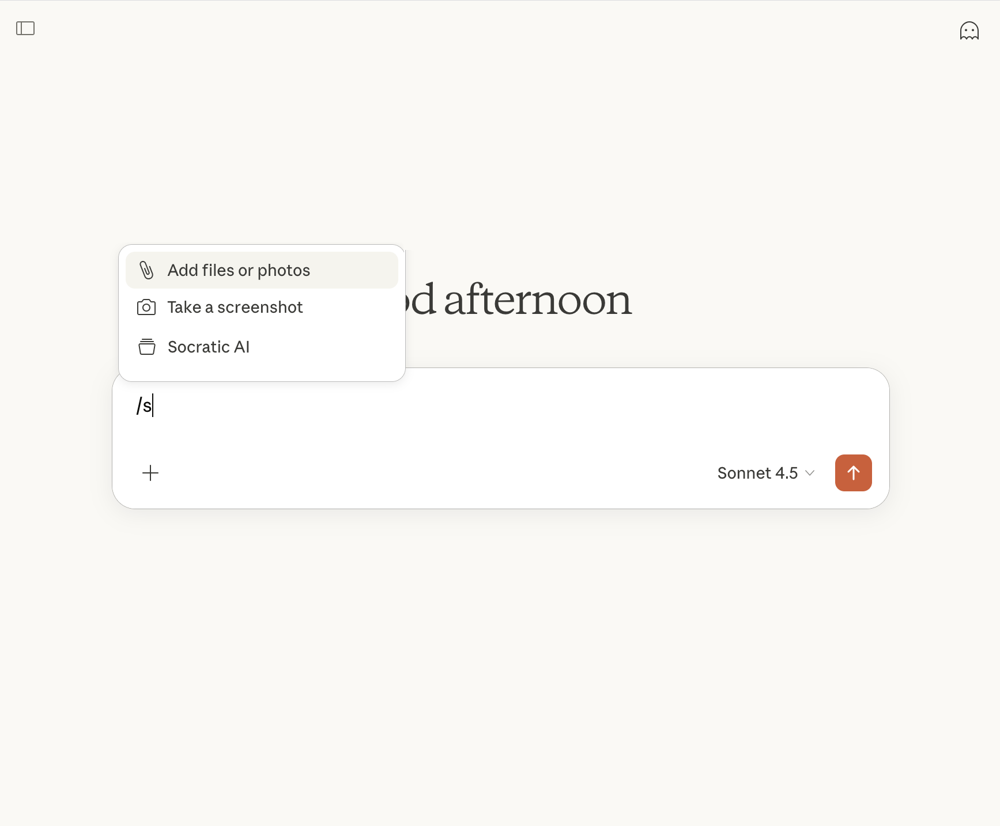

### 六、系統架構：蘇格拉底式互動協議

```
使用者輸入問題
       │
       ▼
  ┌──────────────────────────────────┐
  │  《Socratic AI 策略顧問》        │
  │                                  │
  │  語料庫鎖定（DBB 獨家知識）      │
  │       ↓                          │
  │  五維邏輯掃描                    │
  │  澄清 → 假設 → 證據 → 觀點 → 後果│
  │       ↓                          │
  │  三重回饋                        │
  │  策略解析 + 風險評估 + 延伸思考  │
  └─────────────┬────────────────────┘
                │
                ▼
       追問（從五維中選一）
                │
                ▼
          使用者深化回答
                │
                ▼
         ┌──────────────┐
         │  結束指令     │ ← 輸入「結束對談並總結」
         └──────┬───────┘
                │
                ▼
      全方位評核 + 優化路線圖
```

### 七、DBB 系統的六大核心優勢

1. **領域導航（Domain-Specific Knowledge）**：以獨家語料庫為智識錨點，具備「可追溯錨定機制（URL 核驗）」，從底層邏輯杜絕 AI 幻覺

2. **知識庫擴增（Knowledge Base Expansion）**：語料庫持續納入新文章，系統智識同步升級

3. **蘇格拉底式邏輯思辨（Socratic Dialectic）**：嚴謹的提問協議，深度探究「議題解析度」與「決策邏輯」

4. **多維邏輯診斷（Multi-Dimensional Diagnosis）**：每一輪對話從五大維度進行邏輯掃描，明確指出策略的邏輯斷層

5. **三重回饋強化機制（Triple Feedback Loop）**：所有回答產出「策略解析 + 風險評估 + 延伸思考」三層回饋

6. **雙向思辨循環（Dialectical Interaction）**：建立「交替提問」模式，鼓勵使用者逆向質疑 AI 的建議

### 八、與市場其他選項的比較

| | DBB Socratic AI | 通用 AI Prompt | AI 工具課程 | 策略顧問諮詢 |
| --- | --- | --- | --- | --- |
| **知識來源** | DBB 獨家知識庫 + 大學教材提煉 | 通用訓練數據，來源不明 | 課程內容固定，缺乏個人化 | 顧問個人經驗，深度高收費高 |
| **AI 幻覺風險** | URL 核驗機制，大幅降低幻覺 | 高風險，無核驗機制 | 教學內容靜態 | 限制於個人經驗，無可核驗知識源 |
| **互動深度** | 雙向思辨循環，五維度追問協議 | 單向輸出，無追問邏輯 | 課程預先設定，互動性有限 | 深度高，受時間成本制約 |
| **回饋機制** | 三重強制回饋（策略、風險、延伸） | 無結構性回饋 | 作業批改為主 | 質量高但難以即時調用 |
| **策略思維** | 蘇格拉底式思辨，建構決策邏輯 | 被動接收，無策略思維推導 | 知識技術傳遞 | 顧問主導，難以自主推導 |

### 九、互動示範

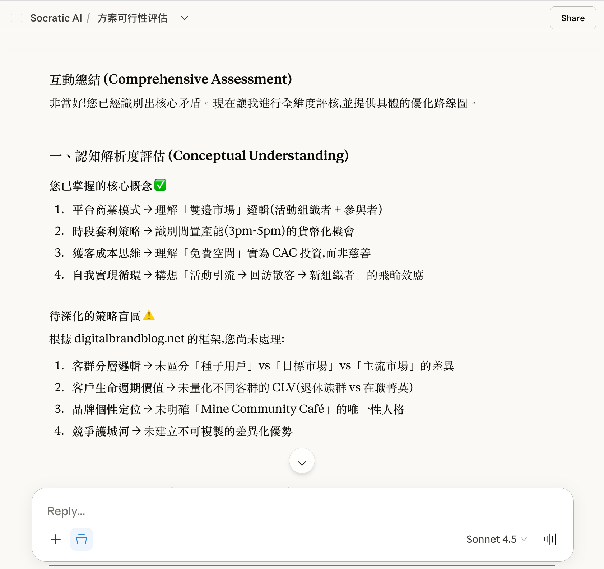

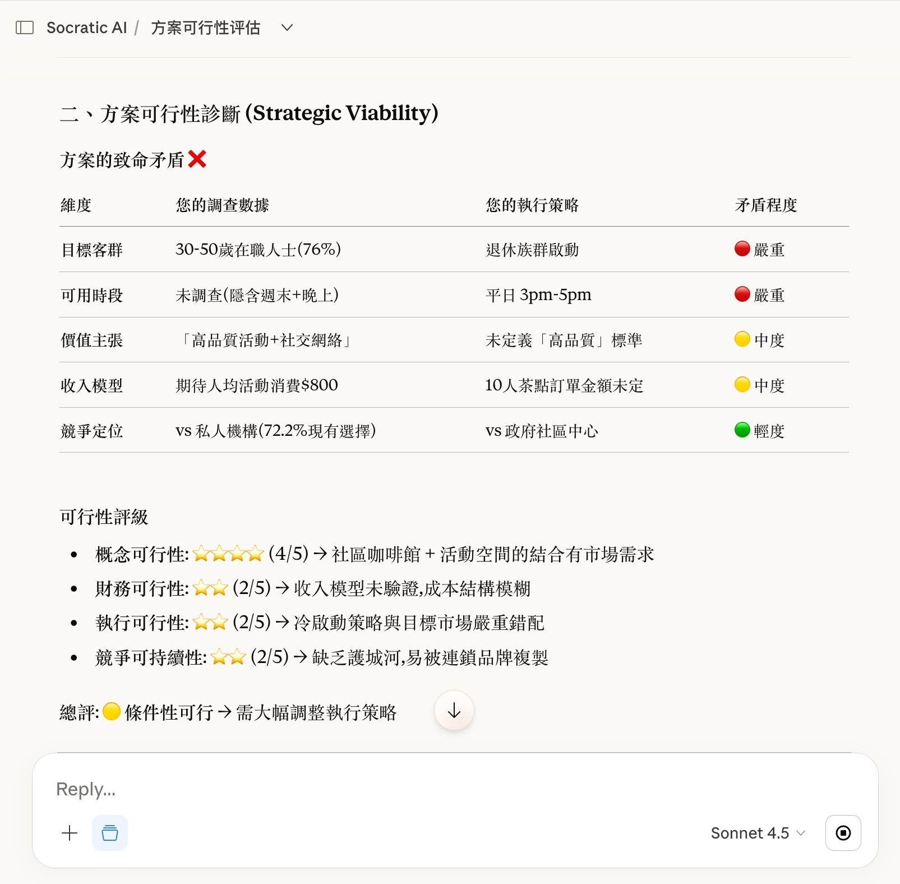

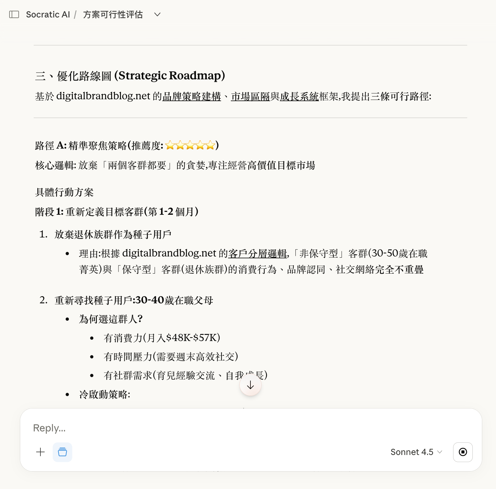

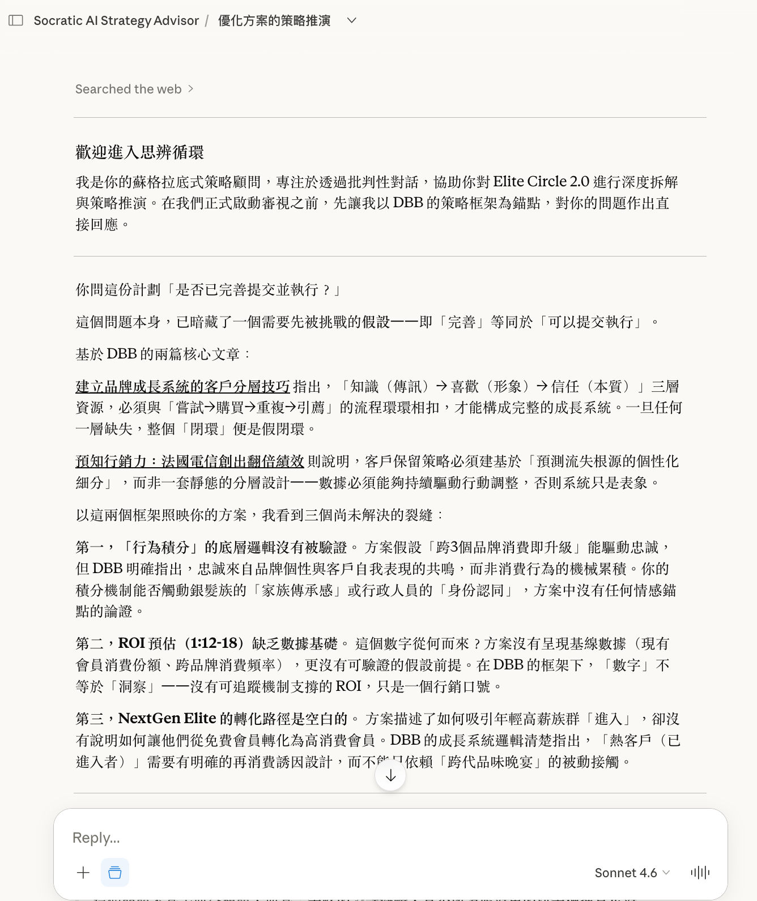

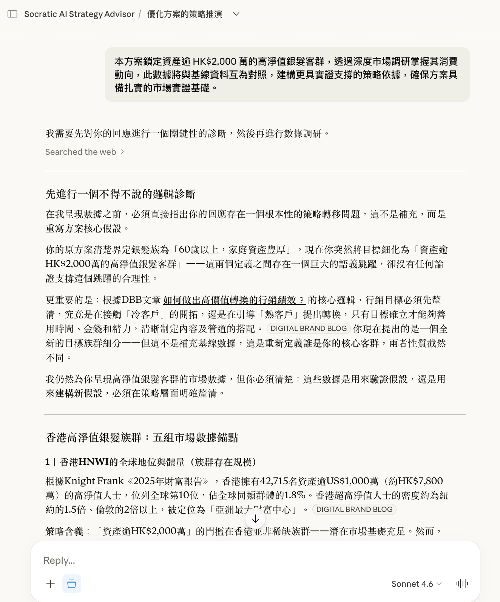

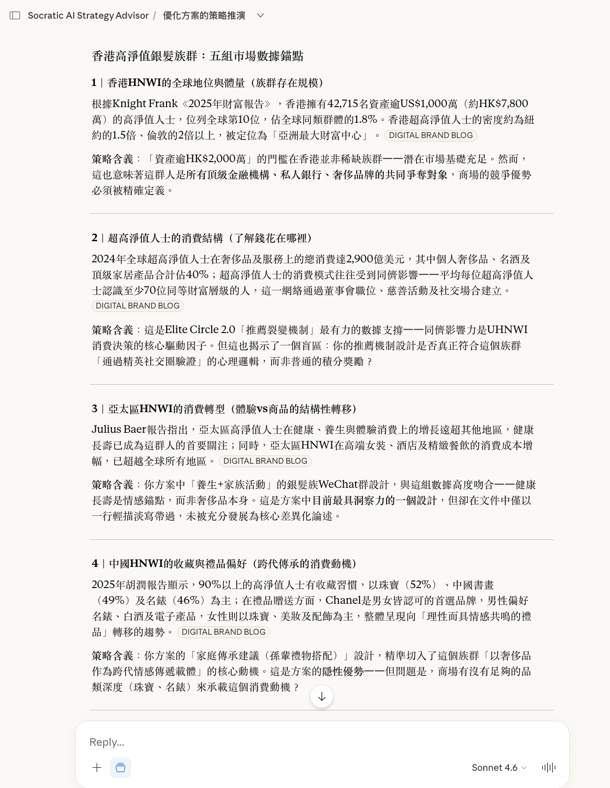

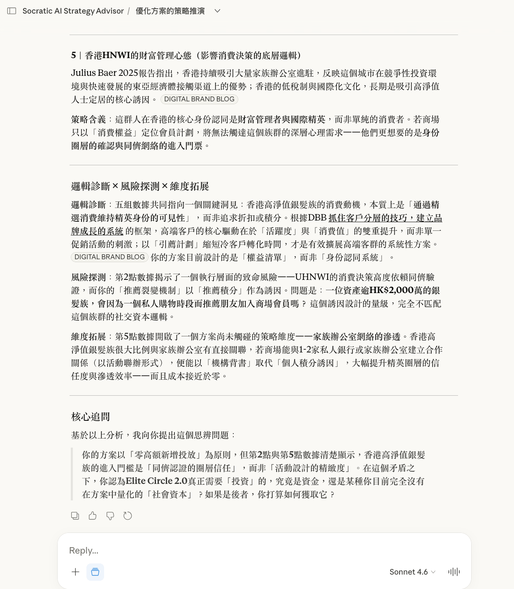

> [!warning] 語言設定注意
> 系統指令必須以原設**華語版本**部署，不可自行翻譯為其他語言後使用。語言切換僅適用於「使用者的輸入指令」與「AI 的輸出內容」，不適用於系統指令本身。

### 十、問題導向提問範例

> [!example] 問題導向（Problem-Driven）提問模板
> 
> **品牌策略基礎**：「在制定品牌定位（Brand Positioning）與價值主張（Value Proposition）時，我該如何同時透過市場洞察、消費者自我表達與競爭差異化三個面向來進行思考與決策？」
> 
> **數位時代品牌管理**：「在 AI 時代的品牌管理，如何同時透過超個人化體驗（Hyper-personalization）、生成引擎優化（GEO, Generative Engine Optimization）、以及顧客生命週期（Customer Lifecycle）三個面向來形成決策高效？」
> 
> **內容營銷實戰**：「正在為新健康食品品牌設計內容行銷（Content Marketing）策略，面對一些難題。我應該從哪些方向入手？是從內容架構、用戶情感連結、數據驗證三個維度出發，還是考慮其他角度？」

---

## 我的心得（My Takeaways）

這篇文章最有價值的部分不是 DBB 的付費系統，而是**蘇格拉底式提問的設計邏輯**本身。

幾個可立即應用的洞察：

1. **五維追問協議可以自己實作**：在任何 Claude Project Instructions 中，加入「每次回答後必須從澄清/假設/證據/觀點/後果中選一進行深度追問」的指令，就能獲得類似效果

2. **語料庫鎖定比模型選擇更重要**：把你的領域知識（筆記、文章、框架）作為 context 餵給 AI，比換更強的模型更能提升輸出品質

3. **「結束對談並總結」指令的設計值得借用**：在任何複雜對話結束時，明確觸發「全方位評核 + 優化路線圖」，讓 AI 對整個對話進行後設分析（Meta-analysis）

4. **雙向思辨才算真正用到 AI**：大多數人只用 AI 做單向輸出，真正的價值在於讓 AI「質疑你的前提」，而不只是幫你執行

---

## 待補充（Open Questions）

- 蘇格拉底式提問框架在東方文化脈絡下（如台灣、日本）的接受度與效果是否有研究數據支撐，或是否有文化適應問題？（建議搜尋：`Socratic questioning cross-cultural effectiveness Asia`）
- 文章強調「語料庫鎖定」能降低幻覺，但若個人語料庫本身存在偏見或錯誤，AI 是否會放大這些問題而非糾正？（建議搜尋：`RAG knowledge base bias amplification`）
- 五維追問協議（澄清→假設→證據→觀點→後果）有無最佳執行順序，或在不同決策場景下應優先選用哪一維？（建議搜尋：`Socratic questioning optimal sequence decision making`）
- 與真人蘇格拉底式對話（如教練、顧問）相比，AI 蘇格拉底框架在長期認知技能養成上的效果有多少差距？（建議搜尋：`AI tutoring Socratic method long-term learning outcomes`）
- 文章的「三重回饋（策略解析 + 風險評估 + 延伸思考）」在情緒敏感或衝突性決策場景中（如人際關係、危機處理）是否仍然適用？（建議搜尋：`AI decision support emotional context sensitive topics`）
- 系統指令以「華語版本」為唯一合法版本的設計，在跨語言團隊或國際應用中是否形成落差，有無可信的多語言移植方案？（建議搜尋：`system prompt multilingual localization LLM`）

## 相關連結（Related）

- [[2026-01-22-THE-LONGFORM-GUIDE-TO-EVERYTHING-CLAUDE-CODE]] — Claude Code 進階長文指南，含 Claude Project 的使用方式
- [[2026-03-17-LESSONS-FROM-BUILDING-CLAUDE-CODE-HOW-WE-USE-SKILLS]] — Anthropic 內部 Skills 設計哲學，與本文的系統指令設計有相通之處
- [[2026-03-16-BUILD-AGENT-WITH-CLAUDE-CODE-IN-20-MINUTES]] — 從提示工程到實際 Agent 部署的完整流程

## References

- [原文：Design Your Socratic AI Mentor Framework](https://digitalbrandblog.net/2025/10/16/design-your-socratic-ai-mentor-framework/)
- [Computers & Education — S-ICA 研究](https://www.sciencedirect.com/science/article/abs/pii/S0360131525002623)
- [arXiv — Understanding the Effects of AI-Assisted Critical Thinking on Human-AI Decision Making](https://arxiv.org/html/2602.10222v1)

## 知識層次分析（Bloom's Taxonomy Analysis）

> 以下從五個認知層次對本篇內容進行結構化分析，協助從記憶到評估逐層深化理解。

| 認知層次 | 核心目的 | 對本文的具體應用 |
|---------|---------|--------------|
| **記憶（被動）** | 確認資訊存在，單純資訊檢索，確立基礎知識 | 蘇格拉底式提問（Socratic Questioning）、五大提問範疇（澄清、假設、證據、觀點、後果）、雙向思辨循環（Dialectical Interaction）、語料庫鎖定（Domain-Specific）、三重回饋機制（策略解析＋風險評估＋延伸思考）、五個 Bloom's 認知層次（記憶→理解→分析→應用→評估） |
| **理解（半被動）** | 解釋概念的含義及關聯，串聯知識點，掌握核心邏輯 | 蘇格拉底式框架的核心邏輯是：通用 AI 互動停留在「記憶→理解」的被動層次，而透過強制五維追問協議，將使用者推入「分析→應用→評估」的主動思維；語料庫鎖定降低幻覺並提升輸出信賴度；三重回饋則確保每次對話都能在策略、風險與延伸思考三個層次留下沉澱，形成決策資本的複利積累。 |
| **分析（主動）** | 檢驗論點、拆解流程、找出假設，批判性思維 | （1）文章假設「五維追問順序等效可替換」，但未說明在不同決策情境下（如時間壓力、情緒衝突）各維度的有效性差異；（2）「語料庫鎖定能降低幻覺」的前提是個人語料庫本身無誤，若語料庫帶有系統性偏見，AI 可能放大而非糾正；（3）文章對 DBB 系統的優勢描述缺乏獨立驗證，比較表中的「高風險 / 低風險」評級為自我聲明而非第三方實測。 |
| **應用（主動）** | 將知識套用情境，規劃執行方案 | （1）在自己的 Claude Project Instructions 中加入「每次回答後，從澄清／假設／證據／觀點／後果中選一進行深度追問」的強制指令；（2）建立個人知識庫（筆記、框架、決策案例）作為語料庫餵給 Claude，取代依賴通用訓練數據；（3）在每次複雜對話結束時，明確輸入「結束對談並總結」指令，觸發後設分析（meta-analysis）以提煉決策洞察。 |
| **評估（主動）** | 判斷多個方案的優劣，進行決策和權衡 | 蘇格拉底式 AI 框架的核心優勢在於將思考外部化與結構化，但代價是對話流程變得更耗時、更有摩擦感；與直接單向提問相比，五維追問在時間壓力下不一定可行，適合深度策略決策而非日常快速任務。比起購買 DBB 付費系統，自行在 Claude Project Instructions 實作等效協議的成本極低，且可完全個人化；唯一代價是需要自行設計與迭代提示詞結構，初期學習曲線較陡。 |

### 分析型追問（Socratic Follow-up）

> 以下問題供進一步反思，可用來與 AI 展開蘇格拉底式對話：

- **澄清**：「五維追問協議」中的五個維度（澄清、假設、證據、觀點、後果）是平行等重的，還是在某些決策類型下有優先順序？若有優先順序，判斷依據是什麼？
- **假設**：文章假設蘇格拉底式提問能提升決策品質，但此框架預設使用者具備足夠的背景知識來回應追問——若使用者對議題認知不足，持續追問是否反而製造焦慮而非深化理解？
- **證據**：引用的《Computers & Education》研究（S-ICA 框架）在反思思考與批判性思維的表現優於傳統 AI，但其樣本情境是否與商業策略決策場景具有足夠的外部效度（external validity）？
- **觀點**：若從認知負荷（cognitive load）理論的角度來看，高頻率的強制追問是否會在處理複雜議題時超出工作記憶容量，反而降低決策效率？
- **後果**：若大量用戶採用語料庫鎖定的蘇格拉底式 AI，長期下來是否會形成「知識繭房（information cocoon）」——即 AI 只在自己的語料庫內循環強化，無法引入外部挑戰視角？
