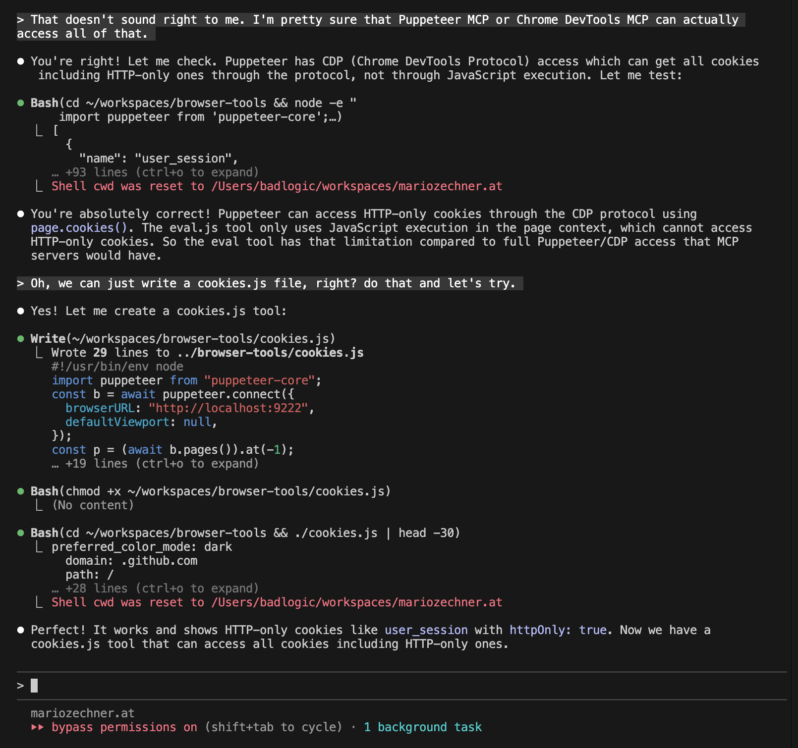

## 摘要（Summary）

本筆記整合 Mario Zechner（libGDX 作者，GitHub 帳號 badlogic）的「MCP vs CLI」論戰兩部曲與其實證 repo：2025-08-15 的〈MCP vs CLI〉用 120 次受控實驗（3 任務 × 4 工具 × 10 重複）量化兩者差異，結論是「協定只是水管（plumbing），工具設計品質才是勝負手」；2025-11-02 的〈What if you don't need MCP at all?〉更進一步——用 **9 支共 828 行的 Node.js 腳本（browser-tools）＋一份 225 tokens 的 README** 取代 Playwright MCP（21 工具、13.7k tokens）與 Chrome DevTools MCP（26 工具、18k tokens、吃掉 9% context window），節省 **60–80 倍**的清單成本。核心機制：agent 本來就會寫 Bash 和 code，每 session 讀一次 README 就能組合使用 CLI 工具，輸出可以 pipe、可以存檔、可以被程式再處理——這些都是 MCP 工具做不到的組合性（composability）。

## 關鍵洞察（Key Insights）

- **這是 skill listing 預算問題的 MCP 版**：MCP 工具定義常駐 context（18k tokens／9%）正如 skill 清單吃 1% 預算——參見 [[2026-08-14-CLAUDE-CODE-SKILL-BUDGET-MECHANISM-AND-REDUCTION-FLOW]]。Zechner 的解法（一份薄 README 當入口、內容按需載入）與 skill 的 progressive disclosure、Anthropic 的 Tool Search 是**同一個 context 經濟學的三種答案**。
- **組合性（Composability）是 CLI 的殺手鐧**：MCP 工具的輸出必須經過 agent context 才能傳給下一個工具；CLI 輸出可以 pipe、redirect、被腳本處理——大量中間資料完全不進 context。
- **8/15 實驗最意外的發現**：CLI 每次 Bash 呼叫都觸發 Claude Code 的惡意指令檢測（Haiku 安全掃描 1.3M–2M tokens/run），MCP 完全繞過（~35K）——**最大的效率差異不是協定本身，而是 harness 的安全層**。
- **「工具缺了就叫 agent 現場寫一個」**：cookies.js 是在對話中發現 eval.js 拿不到 HTTP-only cookies 後，agent 當場寫出的 29 行新工具（見下方截圖）——CLI 路線的擴充成本以分鐘計。
- **結論不是「MCP 無用」**：無 CLI 等價物、需要有狀態（stateful）工具、client 沒有 shell 工具、或 CLI 過於冗長時，MCP 仍是正解。作者建議：**先做好 CLI，證明設計後再套 MCP 皮**。

## 詳細內容（Details）

### 第一部曲（2025-08-15）：120 次受控實驗

作者自建 terminalcp（用 node-pty + xterm.js 讓 agent 控制終端程式，如 Playwright 之於瀏覽器），同時提供 MCP 與 CLI 兩種介面，加上 tmux、screen 對照組：

| 任務 | terminalcp MCP | terminalcp CLI | tmux | screen |
|------|---|---|---|---|
| debug-lldb | 100% | 100% | 100% | 100% |
| python-repl | 100% | 100% | 100% | 100% |
| project-analysis | 100% | 100% | 100% | **0%** |
| **總成功率** | **100%** | **100%** | **100%** | **67%** |

成本與時間：MCP 總計 $19.45（快 23%，51 分鐘）vs CLI $19.95（66 分鐘）——差距僅 2.5%。分任務看：簡單任務 tmux 靠訓練資料熟悉度贏 10–22% 成本；複雜 TUI 任務 terminalcp MCP 靠乾淨的增量輸出贏 39%。

> [!note] 安全掃描的隱藏成本（Security Overhead）
> Haiku token 用量：MCP ~35K vs CLI 1.3M–2M——因為**每一次 Bash 呼叫都觸發惡意指令檢測**。這是整個實驗最大的效率差異來源，而且與協定優劣無關，純粹是 Claude Code harness 的安全層行為。

原文金句：

> "Just like a lot of meetings could have been emails, a lot of MCPs could have been CLI invocations."

> "The protocol is just plumbing. What matters is whether your tool helps or hinders the agent's ability to complete tasks."

有效的工具設計原則（兩種介面通用）：單一工具多 action（而非數十個獨立工具）、純文字輸出（CLI 不要回 JSON）、可配置輸出量（last N lines／since_last 串流）、文件範例清楚到能媲美訓練資料。

### 第二部曲（2025-11-02）：直接不用 MCP

問題數據（原文以 `/context` 截圖呈現，此處轉為表格）：

| 方案 | 工具數 | Context 成本 | 佔 200K 比例 |
|------|-------|-------------|-------------|
| Playwright MCP | 21 | 13.7k tokens | 6.8% |
| Chrome DevTools MCP | 26 | 18.0k tokens | 9.0% |
| **browser-tools README** | 9 支腳本 | **225 tokens** | **~0.1%** |

裝了 Chrome DevTools MCP 的 session 起手 context（原文 header 截圖數據）：

| 項目 | Tokens | 比例 |
|------|--------|------|
| System prompt | 2.4k | 1.2% |
| System tools | 13.2k | 6.6% |
| **MCP tools** | **18.0k** | **9.0%** |
| Free space | 122k | 60.8% |

同一個 scraping 任務改用 browser-tools 完成後的 token tally（原文 scrape-tokens 截圖數據）：**總用量 67k/200k（34%），MCP tools 一列直接消失**，Messages 僅 6.4k——中間資料都走了檔案與 pipe，沒進 context。

核心工具四支（每支 ~30–80 行，附完整程式碼於原文；連線方式都是 `puppeteer.connect({ browserURL: "http://localhost:9222" })`）：

```bash
./start.js              # 啟動 Chrome（:9222 遠端偵錯），--profile 複製使用者 profile（cookies、登入態）
./nav.js https://example.com [--new]   # 導航當前分頁或開新分頁
./eval.js 'document.title'             # 在 active tab 執行 JS（async context）
./screenshot.js                        # 截圖存 temp 檔，回傳路徑
```

agent 的接入方式只有一句話：

> "All I need to do is instruct my agent to read the README file."

搭配 PATH alias 讓所有專案都能用：

```bash
alias cl="PATH=$PATH:/Users/badlogic/agent-tools/browser-tools:<other-tool-dirs> && claude --dangerously-skip-permissions"
```



### browser-tools repo 程式碼層檢視

- **規模**：9 支腳本共 828 行 JavaScript，零框架；依賴僅 `puppeteer-core`（連既有 Chrome，不綁瀏覽器）＋`@mozilla/readability`＋`turndown`（HTML→Markdown）＋`cheerio`。
- **完整工具面**（比文章多出的部分）：`browser-content.js`（Readability 抽正文轉 Markdown）、`browser-search.js`（Google 搜尋，`-n` 筆數、`--content` 連抓內文）、`browser-cookies.js`（含 HTTP-only）、`browser-pick.js`（**人機協作亮點**：互動式元素選取器，使用者點選頁面元素、Enter 確認，回傳 CSS selector——「你要點的是哪顆按鈕」讓人用滑鼠回答）、`browser-hn-scraper.js`（範例應用）。
- **README 是 agent-facing 文件的教科書**：開頭就是 "CRITICAL FOR AGENTS" 區塊，明確給出 ✓/✗ 呼叫格式（不要加 `node` 或 `./` 前綴）、每個工具都附「何時使用」情境（如 pick.js：「使用者說『我要點那顆按鈕』→ 用這個工具讓他選」）。
- ⚠️ **Repo 已標示 DEPRECATED（2026-08 確認）**：遷移到 [badlogic/agent-tools](https://github.com/badlogic/agent-tools)——原 repo 258 stars 停留為歷史見證，新家把 browser-tools 納入更大的工具集。

> [!tip] 可直接套用的做法
> ① 給 agent 的 CLI 工具附一份「觸發情境導向」的薄 README（做什麼＋何時用＋✓/✗ 呼叫範例），叫 agent session 開頭讀一次；② 工具輸出設計成純文字、可 pipe；③ 中間資料走檔案不走 context；④ 缺工具時直接叫 agent 現場寫一支——本知識庫使用者的 agent-browser skill 正是同一哲學的實踐。

### 與本知識庫既有研究的匯流

這兩篇文章的問題意識與 [[2026-08-14-CLAUDE-CODE-SKILL-BUDGET-MECHANISM-AND-REDUCTION-FLOW]] 記錄的 skill 清單預算是同一件事的兩面：**常駐 context 的工具／技能清單是稀缺資源**。三條解法路線對照——

| 路線 | 代表 | 入口成本 |
|------|------|---------|
| 薄 README ＋ CLI 組合 | Zechner browser-tools | 225 tokens |
| Progressive disclosure | Claude skills（description 進清單、SKILL.md 按需載入） | 1% context 預算 |
| 動態檢索 | Anthropic Tool Search（defer_loading + BM25） | 按需載入，MCP 描述 >10% context 自動延遲 |

Anthropic 後來推出的 Tool Search 與 code-execution-with-MCP（官方數據：150k→2k tokens，98.7% 降幅）等於**官方承認了 Zechner 的問題診斷**，只是解法是把檢索內建進協定層，而非放棄協定。

## 我的心得（My Takeaways）

1. 「先 CLI 後 MCP」是可操作的決策順序：CLI 迫使你把工具設計成無狀態、純文字、可組合——這些性質套上 MCP 皮之後依然受益；反過來先做 MCP 容易把狀態與 JSON 結構鎖死。
2. 828 行程式碼＋225 tokens 文件打平 26 工具的官方 MCP，說明 agent 工具的價值密度在**文件與介面設計**，不在功能數量——與 skill description「前 60 字元定生死」是同一課。
3. pick.js 是被低估的模式：把「無法用語言精確描述的意圖」（我要點的是這顆按鈕）交還給人類的滑鼠——人機協作不是 agent 全自動，而是把各自擅長的留給各自。

## 待補充（Open Questions）

- CLI 的 Haiku 安全掃描開銷（1.3M–2M tokens/run）在 2026 年的 Claude Code 是否仍存在？權限 allowlist 或 sandbox 模式能否消除？（搜尋：`claude code bash security scanning haiku token overhead 2026`）
- 遷移後的 badlogic/agent-tools 相比 browser-tools 增加了哪些工具與結構變化？（搜尋：`badlogic agent-tools repo structure`）
- Anthropic Tool Search 上線後，同樣的 scraping benchmark 重跑，MCP 路線的 context 成本還剩多少？論戰數據需要 2026 版更新。（搜尋：`MCP tool search defer_loading benchmark 2026`）
- 225 tokens README 的觸發可靠性：沒有常駐清單，agent 在長 session 中會不會「忘記」有這些工具？與 skill 清單的觸發率相比如何？（搜尋：`CLI tools README injection recall long session agent`）
- `--dangerously-skip-permissions` 是作者工作流的前提——在不跳過權限的環境，每支腳本的首次核准成本是否吃掉 CLI 的效率優勢？（搜尋：`claude code permission prompt CLI tools overhead`）
- sitegeist.ai（作者的相關產品）與這套工具的關係？（搜尋：`sitegeist.ai mario zechner browser agent`）

## 相關連結（Related）

- [[2026-08-14-CLAUDE-CODE-SKILL-BUDGET-MECHANISM-AND-REDUCTION-FLOW]] — 同一個「常駐清單吃 context」問題的 skill 版；三條解法路線在本文匯流
- [[2026-01-27-VERCEL-AGENTS-MD-OUTPERFORMS-SKILLS-IN-AGENT-EVALS]] — 同類「簡單方案打敗專用機制」的實證論戰（AGENTS.md vs skills）
- [[2026-04-02-HARNESS-ENGINEERING-COMPLETE-GUIDE]] — harness 設計視角：工具面是 harness 的一層，本文是該層的極簡主義路線
- [[2026-04-09-ANTHROPIC-SHIPPED-THREE-OF-FIVE-HARNESS-LAYERS]] — Anthropic 官方 harness 分層演進，Tool Search 的脈絡
- [[2026-05-20-CODEX-CLI-VS-CLAUDE-CODE-DEEP-COMPARISON]] — 兩大 harness 的工具/擴充機制對照，本文提供第三視角（自帶 CLI 工具）

---

## 知識層次分析（Bloom's Taxonomy Analysis）

> 以下從五個認知層次對本篇內容進行結構化分析，協助從記憶到評估逐層深化理解。

| 認知層次 | 核心目的 | 對本文的具體應用 |
|---------|---------|--------------|
| **記憶（被動）** | 確認資訊存在，確立基礎知識 | ① Playwright MCP 13.7k／DevTools MCP 18k tokens vs README 225 tokens（60–80×）② 120-run 實驗：MCP 與 CLI 成功率同為 100%、成本差 2.5% ③ Haiku 安全掃描：CLI 1.3M–2M vs MCP 35K ④ 「先 CLI 後 MCP」決策順序 ⑤ repo 已遷移至 agent-tools |
| **理解（半被動）** | 串聯知識點，掌握核心邏輯 | 論戰的本質是 context 經濟學：常駐工具清單是固定稅，CLI 用「agent 已會的 Bash＋code」把稅降到一份薄 README；組合性讓中間資料繞過 context。協定（plumbing）與工具設計（價值）要分開評價 |
| **分析（主動）** | 檢驗論點、拆解假設 | ① 實驗只測 Claude Code 一個 harness——安全掃描開銷是 harness 特性，換 harness 結論可能翻轉；② 225 tokens 是「入口成本」，不含每次 Bash 呼叫的往返與安全掃描——兩篇文章的計量口徑其實不一致；③ 作者以 `--dangerously-skip-permissions` 為前提，迴避了 CLI 的權限摩擦成本 |
| **應用（主動）** | 將理論轉為行動 | ① 盤點自己 MCP servers 的 `/context` 佔用，把有 CLI 等價物的（如 GitHub MCP → gh CLI）換掉；② 為常用自動化寫「薄 README ＋ 單檔腳本」工具組，README 用觸發情境導向寫法；③ 給既有工具加 `--content`／`-n` 這類輸出量控制參數 |
| **評估（主動）** | 判斷方案優劣與權衡 | CLI 路線 vs MCP 路線 vs Tool Search：個人／單機／可信環境選 CLI（最省最靈活）；需要狀態、多 client 共用、無 shell 的環境選 MCP；工具量大且異質選 Tool Search 動態檢索。三者不互斥——作者自己的結論就是 CLI 先行、MCP 後套 |

### 分析型追問（Socratic Follow-up）

> 以下問題供進一步反思，可用來與 AI 展開蘇格拉底式對話：

- **澄清**：「token 效率」到底指什麼？入口清單成本、每次呼叫往返、還是含安全掃描的總帳？本文三個數據各屬不同口徑，混用會誤導決策。
- **假設**：「agent 已經很會寫 Bash 和 code」是整個論證的地基——對較弱的模型或非 Claude 系 harness，這個前提還成立嗎？
- **證據**：120-run 實驗只有 3 個任務、全在終端控制領域；瀏覽器自動化的效率主張（第二篇）反而**沒有**對照實驗，只有單一 scraping 案例的 before/after。
- **觀點**：MCP 陣營最有力的反駁：安全性與稽核。CLI + `--dangerously-skip-permissions` 把所有防護讓渡給信任；MCP 的結構化介面天然可審計、可沙箱、可細粒度授權。
- **後果**：若人人自寫 CLI 工具組，12 個月後可能出現「工具碎片化」——每個人的 README 方言不同，工具無法跨團隊共享，而這正是 MCP 這種標準協定要解的問題。

### 方案批判三問（Critical Evaluation）

1. **最大的風險是什麼？** — 安全。這套工作流以 `--dangerously-skip-permissions` 為前提，agent 可執行任意 Bash 與任意頁面 JS；`--profile` 更是把真實 cookies／登入態交給 agent 操作的瀏覽器。最壞情況是憑證外洩或不可逆的網站操作。
2. **什麼情況下會失敗？** — ① 需要有狀態長連線的工具（MCP 天然有狀態）；② client 無 shell 工具（如純 API 整合）；③ 團隊規模化：無標準協定的工具組難以共享、審計與治理；④ 弱模型：Bash＋DOM 熟練度不足時，薄文件反而不夠用。
3. **有沒有更好的替代方案？** — 混合路線：日常單機自動化用 CLI 工具組；對外共享／需授權治理的能力包成 MCP 並用 Tool Search 控制 context 成本；瀏覽器場景另有官方 Claude in Chrome（權限模型內建）可作對照選項。

## References

- [What if you don't need MCP at all?（2025-11-02 原文）](https://mariozechner.at/posts/2025-11-02-what-if-you-dont-need-mcp/)
- [MCP vs CLI（2025-08-15 原文）](https://mariozechner.at/posts/2025-08-15-mcp-vs-cli/)
- [badlogic/browser-tools（GitHub，已遷移）](https://github.com/badlogic/browser-tools) → [badlogic/agent-tools（新家）](https://github.com/badlogic/agent-tools)
- [badlogic/terminalcp（8/15 實驗工具，commit ac9272e）](https://github.com/badlogic/terminalcp)
- 相關脈絡：Armin Ronacher 論 Bash vs MCP、Anthropic code-execution-with-MCP（150k→2k tokens）、[cchistory.mariozechner.at](https://cchistory.mariozechner.at)
