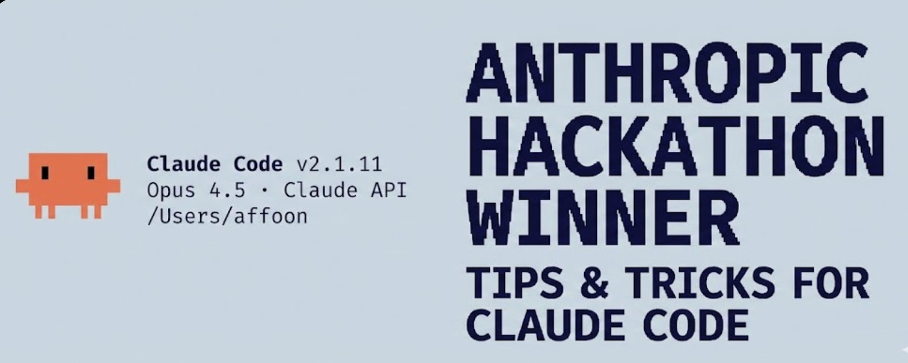
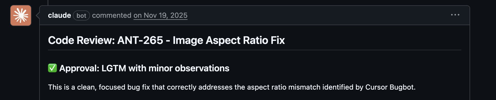

## 摘要（Summary）

作者 cogsec（@affaanmustafa）在使用 Claude Code 10 個月的日常開發後，整理出一份完整的速查指南，涵蓋技能（Skills）、鉤子（Hooks）、子代理人（Subagents）、模型情境協定（MCP）、插件（Plugins）以及各種實用技巧。作者曾憑藉完全使用 Claude Code 贏得 Anthropic × Forum Ventures Hackathon 冠軍。

## 關鍵洞察（Key Insights）

- 技能（Skills）是針對特定工作流程的「提示詞速記」，可透過斜線命令（slash commands）觸發，也可以互相串聯 — 參見 [[CLAUDE-HOOKS-SYSTEM]]
- 鉤子（Hooks）是事件驅動的自動化，繫結在工具呼叫（tool calls）和生命週期事件上，而非通用規則
- 上下文視窗（Context Window）管理是效能關鍵：MCP 過多會讓可用 token 從 200k 驟降至 70k
- 子代理人（Subagents）可在背景執行，釋放主代理人的上下文（context）
- `mgrep` 插件搜尋能力顯著優於原生 ripgrep/grep

## 詳細內容（Details）

### 技能與命令（Skills and Commands）

技能（Skills）的運作像規則，但限縮在特定範疇與工作流程內。它們是需要執行特定工作流程時的「提示詞速記」。

**使用場景範例：**
- 長時間 coding session 後清理死碼與多餘 `.md` 檔案 → `/refactor-clean`
- 需要測試 → `/tdd`、`/e2e`、`/test-coverage`
- 技能可在單一提示詞中串聯



> [!note] 技能 vs 命令（Skills vs Commands）
> - **技能（Skills）**：存放於 `~/.claude/skills/`，定義較廣泛的工作流程
> - **命令（Commands）**：存放於 `~/.claude/commands/`，快速執行的提示詞
> 兩者重疊，但儲存位置不同。

**技能資料夾結構範例：**

```bash
~/.claude/skills/
  pmx-guidelines.md        # 專案特定模式（Project-specific patterns）
  coding-standards.md      # 語言最佳實踐（Language best practices）
  tdd-workflow/            # 多檔案技能（Multi-file skill with README.md）
  security-review/         # 清單式技能（Checklist-based skill）
```

技能也可以做到「程式碼地圖更新器（codemap updater）」——讓 Claude 在不燒毀上下文的情況下快速導覽程式庫。

---

### 鉤子（Hooks）

鉤子（Hooks）是觸發式自動化，在特定事件上觸發。與技能不同，它們限縮在工具呼叫（tool calls）和生命週期事件上。

**鉤子類型（Hook Types）：**

| 類型 | 觸發時機 |
|------|---------|
| `PreToolUse` | 工具執行前（驗證、提醒） |
| `PostToolUse` | 工具完成後（格式化、回饋循環） |
| `UserPromptSubmit` | 用戶送出訊息時 |
| `Stop` | Claude 完成回應時 |
| `PreCompact` | 上下文壓縮前 |
| `Notification` | 權限請求時 |

**範例：長時間執行命令的 tmux 提醒**

```json
{
  "PreToolUse": [
    {
      "matcher": "tool == \"Bash\" && tool_input.command matches \"(npm|pnpm|yarn|cargo|pytest)\"",
      "hooks": [
        {
          "type": "command",
          "command": "if [ -z \"$TMUX\" ]; then echo '[Hook] Consider tmux for session persistence' >&2; fi"
        }
      ]
    }
  ]
}
```


> [!tip] 使用 hookify 插件
> 使用 `hookify` 插件可透過對話方式建立鉤子，無需手寫 JSON。執行 `/hookify` 並描述你想要的鉤子行為即可。

---

### 子代理人（Subagents）

子代理人（Subagents）是協調者（orchestrator，主要 Claude）可以委派任務的行程（processes），具有有限的範疇（scope）。可在背景或前景執行，為主代理人釋放上下文（context）。

**子代理人與技能搭配：** 有能力執行技能子集的子代理人可被委派任務，並自主使用那些技能。也可透過特定工具權限進行沙箱化（sandboxed）。

**子代理人資料夾結構範例：**

```bash
~/.claude/agents/
  planner.md              # 功能實作規劃
  architect.md            # 系統設計決策
  tdd-guide.md            # 測試驅動開發
  code-reviewer.md        # 品質／安全性審查
  security-reviewer.md    # 漏洞分析
  build-error-resolver.md
  e2e-runner.md
  refactor-cleaner.md
```

> [!important] 子代理人設定原則
> 每個子代理人都可設定允許的工具（allowed tools）、MCP 和權限（permissions），以實現適當的範疇限制。

---

### 規則與記憶（Rules and Memory）

`.rules` 資料夾存放 Claude **應始終遵循**的最佳實踐 `.md` 檔案。

**兩種方式：**
- **單一 CLAUDE.md**：所有內容在一個檔案（用戶或專案層級）
- **Rules 資料夾**：依關注點分組的模組化 `.md` 檔案

```bash
~/.claude/rules/
  security.md      # 禁止硬編碼密鑰、驗證輸入
  coding-style.md  # 不可變性、檔案組織
  testing.md       # 測試驅動開發工作流程、80% 覆蓋率
  git-workflow.md  # Commit 格式、PR 流程
  agents.md        # 何時委派給子代理人
  performance.md   # 模型選擇、上下文管理
```

**規則範例：**
- 程式庫禁用表情符號（emoji）
- 前端避免使用紫色調
- 部署前必須測試程式碼
- 優先使用模組化程式碼而非巨型檔案
- 禁止提交 `console.log`

---

### MCP（Model Context Protocol）

MCP 讓 Claude 直接連接外部服務。它不是 API 的替代品，而是圍繞 API 的**提示詞驅動包裝器（prompt-driven wrapper）**，在導覽資訊時提供更高彈性。

**範例：** Supabase MCP 讓 Claude 可直接拉取特定資料、在上游直接執行 SQL，無需複製貼上。


**Chrome in Claude** 是內建的插件 MCP，讓 Claude 可自主控制你的瀏覽器——點擊瀏覽以了解頁面運作方式。


> [!warning] 上下文視窗管理（Context Window Management）至關重要
> 對 MCP 要精挑細選。作者將所有 MCP 保存在用戶設定中，但停用所有未使用的。
>
> **經驗法則：** 設定中可有 20-30 個 MCP，但啟用數量保持在 10 個以內，活躍工具數量低於 80 個。
>
> 若啟用過多工具，200k 上下文視窗在壓縮前可能只剩 70k，效能會顯著下降。


---

### 插件（Plugins）

插件（Plugins）將工具打包，便於安裝，取代繁瑣的手動設定。插件可以是技能 + MCP 的組合，或是鉤子與工具的捆綁包。

**安裝插件：**

```bash
# 從市集新增插件
claude plugin marketplace add https://github.com/mixedbread-ai/mgrep

# 開啟 Claude，執行 /plugins，找到新市集，從中安裝
```


**語言伺服器協定插件（LSP Plugins）** 在編輯器外頻繁使用 Claude Code 時特別有用。語言伺服器協定（Language Server Protocol）讓 Claude 在不需開啟 IDE 的情況下獲得即時型別檢查、跳轉定義和智慧補全。

```bash
# 已啟用的插件範例
typescript-lsp@claude-plugins-official  # TypeScript 智慧輔助
pyright-lsp@claude-plugins-official     # Python 型別檢查
hookify@claude-plugins-official         # 對話式建立鉤子
mgrep@Mixedbread-Grep                   # 比 ripgrep 更好的搜尋
```

> [!warning] 與 MCP 相同——注意上下文視窗
> 插件過多同樣會壓縮可用上下文。

---

### 技巧與訣竅（Tips and Tricks）

#### 鍵盤快捷鍵（Keyboard Shortcuts）

| 快捷鍵 | 功能 |
|--------|------|
| `Ctrl+U` | 刪除整行（比按 Backspace 快） |
| `!` | 快速 bash 命令前綴 |
| `@` | 搜尋檔案 |
| `/` | 啟動斜線命令 |
| `Shift+Enter` | 多行輸入 |
| `Tab` | 切換思考顯示 |
| `Esc Esc` | 中斷 Claude／還原程式碼 |

#### 並行工作流程（Parallel Workflows）

- **`/fork`**：分叉對話（conversations），以並行方式執行不重疊的任務，而非堆疊排隊訊息
- **Git Worktrees（Git 工作樹）**：讓多個 Claude 並行執行不衝突的任務

```bash
git worktree add ../feature-branch feature-branch
# 現在在每個工作樹中執行獨立的 Claude 實例
```

#### tmux 用於長時間執行命令

串流並監控 Claude 執行的日誌／bash 行程。



```bash
tmux new -s dev       # Claude 在此執行命令，你可以分離並重新附加
tmux attach -t dev
```

#### mgrep 優於 grep

`mgrep` 是 ripgrep/grep 的顯著改進。透過插件市集安裝後，使用 `/mgrep` 技能：

```bash
mgrep "function handleSubmit"        # 本地搜尋
mgrep --web "Next.js 15 app router changes"  # 網路搜尋
```

#### 其他實用命令

| 命令 | 功能 |
|------|------|
| `/rewind` | 回到之前的狀態 |
| `/statusline` | 自訂狀態列（分支、上下文 %、待辦事項） |
| `/checkpoints` | 檔案層級的還原點（undo points） |
| `/compact` | 手動觸發上下文壓縮 |
| `/fork` | 分叉對話並行執行任務 |

---

### GitHub Actions CI/CD

在 PR 上設定程式碼審查（code review）。設定完成後，Claude 可在 PR 建立時自動審查。


---

### 沙箱化（Sandboxing）

使用沙箱模式進行高風險操作——Claude 在受限環境中執行，不影響你的實際系統。

> [!warning] `--dangerously-skip-permissions` 旗標
> 使用此旗標讓 Claude 自由運作，效果相反於沙箱模式。若不謹慎，可能造成破壞性後果。

---

### 編輯器（On Editors）

雖然編輯器不是必要的，但它可以正面或負面地影響 Claude Code 工作流程。

#### Zed（作者偏好）

Zed 是以 Rust 撰寫的編輯器，輕量、快速且高度可自訂。

**Zed 與 Claude Code 搭配效果良好的原因：**
- **代理人面板整合（Agent Panel Integration）**：可即時追蹤 Claude 編輯時的檔案變更，在 Claude 引用的檔案間快速跳轉
- **效能（Performance）**：以 Rust 撰寫，瞬間開啟，處理大型程式庫不卡頓
- **`CMD+Shift+R` 命令面板**：可搜尋所有自訂斜線命令、除錯器和工具
- **最低資源佔用（Minimal Resource Usage）**：不會在繁重操作時與 Claude 競爭系統資源
- **Vim Mode**：完整的 vim 鍵盤綁定


**實用技巧：**
- 分割螢幕：一側放 Claude Code 終端，另一側放編輯器
- `Ctrl+G`：快速在 Zed 中開啟 Claude 目前正在處理的檔案
- 啟用自動儲存（Auto-save）：確保 Claude 的檔案讀取總是最新版本
- 驗證編輯器的檔案監聽（File watchers）自動重新載入功能已啟用

#### VSCode / Cursor

同樣是可行的選擇，支援終端格式以及透過 `\ide` 自動與編輯器同步的整合模式。

---

## 作者的完整個人設定（My Setup）

### 已安裝插件（通常只啟用 4-5 個）

```markdown
ralph-wiggum@claude-code-plugins        # 循環自動化（Loop automation）
frontend-design@claude-code-plugins     # UI/UX 模式
commit-commands@claude-code-plugins     # Git 工作流程
security-guidance@claude-code-plugins   # 安全性檢查
pr-review-toolkit@claude-code-plugins   # PR 自動化
typescript-lsp@claude-plugins-official  # TypeScript 智慧輔助
hookify@claude-plugins-official         # 對話式建立鉤子
code-simplifier@claude-plugins-official
feature-dev@claude-code-plugins
explanatory-output-style@claude-code-plugins
code-review@claude-code-plugins
context7@claude-plugins-official        # 即時文件（Live documentation）
pyright-lsp@claude-plugins-official    # Python 型別檢查
mgrep@Mixedbread-Grep                  # 更好的搜尋
```

### MCP 伺服器設定（用戶層級）

```json
{
  "github": {
    "command": "npx",
    "args": ["-y", "@modelcontextprotocol/server-github"]
  },
  "firecrawl": {
    "command": "npx",
    "args": ["-y", "firecrawl-mcp"]
  },
  "supabase": {
    "command": "npx",
    "args": ["-y", "@supabase/mcp-server-supabase@latest", "--project-ref=YOUR_REF"]
  },
  "memory": {
    "command": "npx",
    "args": ["-y", "@modelcontextprotocol/server-memory"]
  },
  "sequential-thinking": {
    "command": "npx",
    "args": ["-y", "@modelcontextprotocol/server-sequential-thinking"]
  },
  "vercel": {
    "type": "http",
    "url": "https://mcp.vercel.com"
  },
  "railway": {
    "command": "npx",
    "args": ["-y", "@railway/mcp-server"]
  },
  "cloudflare-docs": {
    "type": "http",
    "url": "https://docs.mcp.cloudflare.com/mcp"
  },
  "cloudflare-workers-bindings": {
    "type": "http",
    "url": "https://bindings.mcp.cloudflare.com/mcp"
  },
  "cloudflare-workers-builds": {
    "type": "http",
    "url": "https://builds.mcp.cloudflare.com/mcp"
  },
  "cloudflare-observability": {
    "type": "http",
    "url": "https://observability.mcp.cloudflare.com/mcp"
  },
  "clickhouse": {
    "type": "http",
    "url": "https://mcp.clickhouse.cloud/mcp"
  },
  "AbletonMCP": {
    "command": "uvx",
    "args": ["ableton-mcp"]
  },
  "magic": {
    "command": "npx",
    "args": ["-y", "@magicuidesign/mcp@latest"]
  }
}
```

**停用策略：** 設定了 14 個 MCP，但每個專案只啟用約 5-6 個，以保持上下文視窗健康。

```markdown
# 在 ~/.claude.json 的 projects.[path].disabledMcpServers 下停用
disabledMcpServers: [
  "playwright",
  "cloudflare-workers-builds",
  "cloudflare-workers-bindings",
  "cloudflare-observability",
  "cloudflare-docs",
  "clickhouse",
  "AbletonMCP",
  "context7",
  "magic"
]
```

### 關鍵鉤子設定

```json
{
  "PreToolUse": [
    { "matcher": "npm|pnpm|yarn|cargo|pytest", "hooks": ["tmux 提醒"] },
    { "matcher": "Write && .md file", "hooks": ["除非 README/CLAUDE 否則阻擋"] },
    { "matcher": "git push", "hooks": ["開啟編輯器審查"] }
  ],
  "PostToolUse": [
    { "matcher": "Edit && .ts/.tsx/.js/.jsx", "hooks": ["prettier --write"] },
    { "matcher": "Edit && .ts/.tsx", "hooks": ["tsc --noEmit"] },
    { "matcher": "Edit", "hooks": ["grep console.log 警告"] }
  ],
  "Stop": [
    { "matcher": "*", "hooks": ["檢查修改檔案中的 console.log"] }
  ]
}
```

### 自訂狀態列（Custom Status Line）

顯示用戶、目錄、含修改指示器的 git 分支、剩餘上下文百分比、模型、時間和待辦事項數量。


### 規則結構

```markdown
~/.claude/rules/
  security.md      # 強制安全性檢查
  coding-style.md  # 不可變性、檔案大小限制
  testing.md       # 測試驅動開發、80% 覆蓋率
  git-workflow.md  # 慣例式提交（Conventional commits）
  agents.md        # 子代理人委派規則
  patterns.md      # API 回應格式
  performance.md   # 模型選擇（Haiku vs Sonnet vs Opus）
  hooks.md         # 鉤子文件
```

### 子代理人配置

```markdown
~/.claude/agents/
  planner.md          # 功能分解
  architect.md        # 系統設計
  tdd-guide.md        # 先寫測試
  code-reviewer.md    # 品質審查
  security-reviewer.md # 漏洞掃描
  build-error-resolver.md
  e2e-runner.md       # Playwright 測試
  refactor-cleaner.md # 移除死碼
  doc-updater.md      # 保持文件同步
```

---

## 重要結論（Key Takeaways）

1. **別過度複雜化（Don't overcomplicate）**：把設定視為微調（fine-tuning），而非架構設計
2. **上下文視窗（Context Window）是珍貴資源**：停用未使用的 MCP 和插件
3. **並行執行（Parallel execution）**：分叉對話、使用 git worktrees
4. **自動化重複性工作（Automate the repetitive）**：使用鉤子進行格式化、linting、提醒
5. **範疇化你的子代理人（Scope your subagents）**：有限工具 = 專注執行

## 我的心得（My Takeaways）

這篇指南讓我意識到 Claude Code 不只是「在終端機打命令」，而是一套可以系統化、模組化的**開發作業系統（development OS）**。最值得立即實踐的是：

- **上下文視窗管理**：我一直沒意識到過多 MCP 會讓 200k 縮水到 70k，這是效能瓶頸的根本原因
- **鉤子的 PostToolUse 自動格式化**：讓 Claude 每次編輯後自動執行 Prettier + tsc，等於免費的品質保障
- **Git Worktrees + 並行 Claude**：真正的並行開發，不是假的「一次做一件事」

## 相關連結（Related）

- [[CLAUDE-MEMORY-ENGINE]] — Claude 的記憶系統架構與 CLAUDE.md 設計
- [[MCP-OVERVIEW]] — MCP 協定原理與伺服器設定最佳實踐
- [[CLAUDE-HOOKS-SYSTEM]] — 鉤子系統深入探討與實際設定範例

## References

- [原文 X 貼文](https://x.com/affaanmustafa/status/2012378465664745795)
- [Plugins Reference](https://docs.claude.ai/en/plugins)
- [Hooks Documentation](https://docs.claude.ai/en/hooks)
- [Checkpointing](https://docs.claude.ai/en/checkpointing)
- [Interactive Mode](https://docs.claude.ai/en/interactive-mode)
- [Memory System](https://docs.claude.ai/en/memory)
