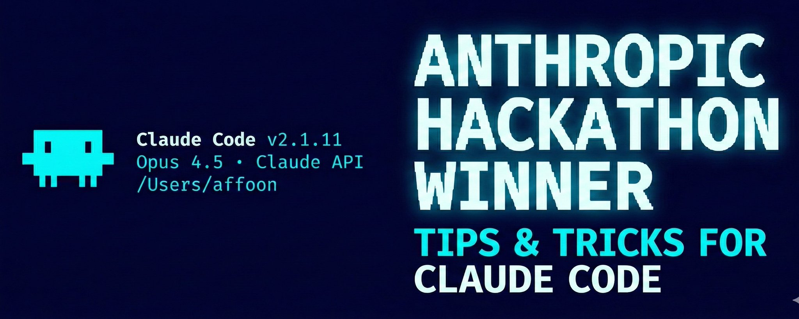
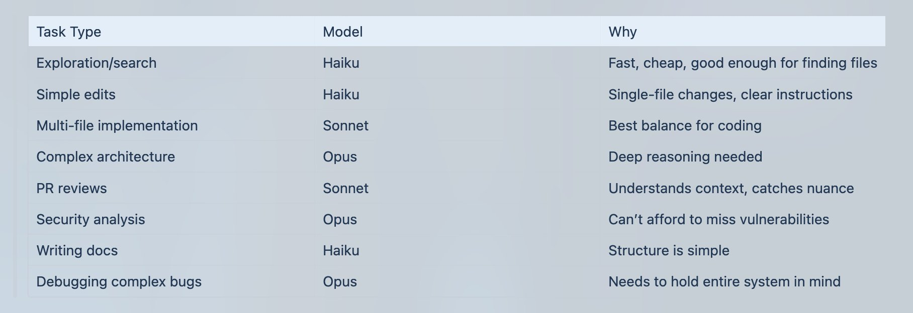
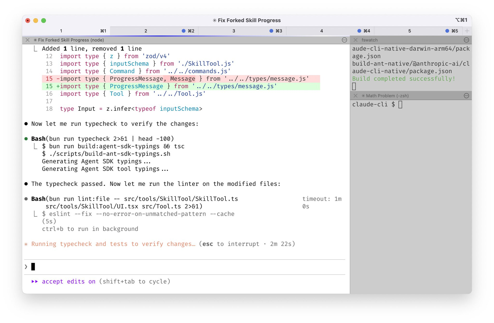
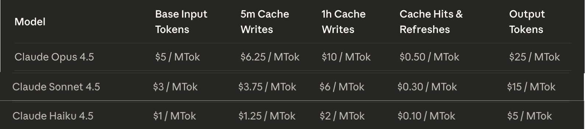
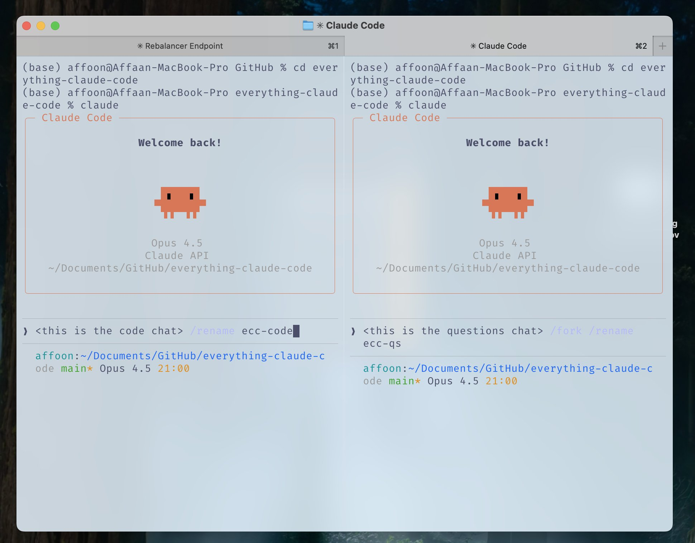
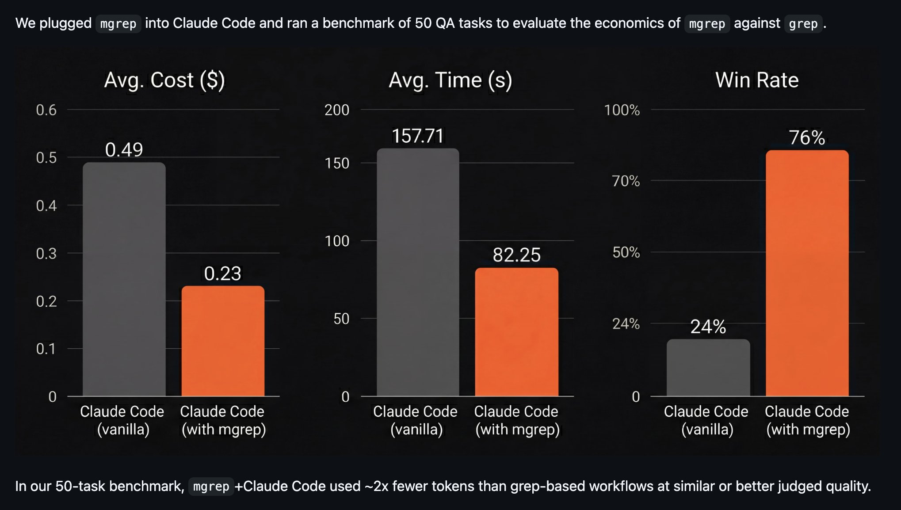

## 摘要（Summary）

這是《Claude Code 完整速查手冊》的進階長文續篇，作者 cogsec（@affaanmustafa）在 10 個月以上的日常使用後，整理出讓生產性工作階段（session）持續數小時而不陷入「上下文腐敗（context rot）」的核心技術。涵蓋主題包括：Token 經濟學（token economics）、記憶持久化（memory persistence）、驗證模式（verification patterns）、並行化策略（parallelization strategies）以及可複用工作流程（reusable workflows）的複利效應。**前提：已完成速查手冊的基礎設定（Skills、Agents、Hooks、MCPs）。**

## 關鍵洞察（Key Insights）

- 上下文腐敗（context rot）是最大敵人——透過策略性壓縮（strategic compact）和會話日誌（session logs）可跨天延續工作 — 參見 [[THE-SHORTHAND-GUIDE-TO-EVERYTHING-CLAUDE-CODE]]
- `--system-prompt` CLI 旗標（flag）比 `@file` 引用有更高的指令層級（instruction hierarchy），適合嚴格行為規則
- Haiku + Opus 的組合比 Haiku + Sonnet 更具成本效益（5x vs 1.67x 價差）
- `mgrep` 比 grep/ripgrep 平均節省約 50% 的 token 用量
- 子代理人（Subagents）只知道字面查詢，不知道背後的**目的與推理**——需要迭代式擷取（iterative retrieval）模式來修正
- 先掌握單一實例，再考慮並行化；大多數情況 2-3 個 Claude 實例已足夠

## 詳細內容（Details）



---

### 上下文與記憶管理（Context & Memory Management）

#### 跨工作階段共享記憶

最佳做法：使用技能（skill）或命令（command）摘要並記錄進度，儲存到 `.claude` 資料夾內的 `.tmp` 檔案，並在工作階段結束前持續附加（append）。

**會話日誌應包含：**
- 哪些方法有效（附可驗證的證據）
- 哪些方法已嘗試但無效
- 哪些方法尚未嘗試
- 剩餘待辦事項

**使用方式：** Claude 建立摘要目前狀態的檔案 → 你審閱並要求修改（如需要）→ 開啟新對話時只需提供檔案路徑。特別適合在碰到上下文限制時需要繼續複雜工作的情況。

範例會話儲存：`~/.claude/sessions/YYYY-MM-DD-topic.tmp`（每個工作階段一個檔案）

#### 策略性上下文清除（Clearing Context Strategically）

計畫確定後進入計畫模式（plan mode）清除上下文——適用於已累積大量探索性上下文但不再與執行相關時。

> [!tip] 策略性壓縮（Strategic Compact）
> 停用自動壓縮（auto compact），在邏輯性中斷點手動壓縮，或建立一個技能在達到某個標準時自動執行或提示壓縮。

**Strategic Compact Skill（程式碼）：**


鉤子（hook）到 Edit/Write 操作的 `PreToolUse`——當累積足夠的上下文時會提示你。

---

### 進階：動態系統提示注入（Dynamic System Prompt Injection）

不只依賴 `CLAUDE.md`（用戶範疇）或 `.claude/rules/`（專案範疇）在每次工作階段載入所有內容，而是使用 CLI 旗標動態注入上下文。

> [!note] 指令層級（Instruction Hierarchy）的差異
> - **`@memory.md` 或 `.claude/rules/`**：Claude 透過 Read 工具在對話中讀取——以工具輸出的形式進入
> - **`--system-prompt`**：內容在對話開始前注入到實際系統提示——**指令層級更高**
>
> 對日常工作而言差異不大，但對於嚴格行為規則、專案特定限制、或你絕對需要 Claude 優先考慮的上下文——系統提示注入確保其被適當加權。

**實際設定：** 為 `.claude/rules/` 設定基礎專案規則，再用 CLI 別名（aliases）切換場景特定上下文：

- `dev.md` — 專注於實作
- `review.md` — 程式碼品質／安全性
- `research.md` — 行動前的探索

---

### 進階：記憶持久化鉤子（Memory Persistence Hooks）

多數人不知道或沒有善用的鉤子：

| 鉤子 | 功能 |
|------|------|
| `PreCompact Hook` | 壓縮前將重要狀態儲存到檔案 |
| `SessionComplete Hook` | 工作階段結束時持久化學習成果 |
| `SessionStart Hook` | 新工作階段開始時自動載入前次上下文 |

**各腳本功能：**
- `pre-compact.sh`：記錄壓縮事件，更新活躍工作階段檔案，附上壓縮時間戳
- `session-start.sh`：檢查近7天的工作階段檔案，通知可用上下文和已學技能
- `session-end.sh`：建立／更新每日工作階段檔案（含範本）、追蹤開始／結束時間

> [!tip] 鏈式組合自動持續記憶
> 將三個鉤子串聯，無需手動介入即可實現跨工作階段的持續記憶。

---

### 持續學習（Continuous Learning / Memory）

**問題：** 如果你重複提示 Claude 多次，而它一再遇到相同問題或給出你已聽過的回應——那些模式必須被附加到技能（skills）中。

**解決方案：** 當 Claude Code 發現非顯而易見的事物——除錯技術、變通方法（workaround）、專案特定模式——它將知識儲存為新技能（skill）。下次出現類似問題時，該技能會自動載入。

> [!note] 為何用 Stop 鉤子而非 UserPromptSubmit？
> `UserPromptSubmit` 在每次送出訊息時執行——大量額外負荷，增加每個提示詞的延遲，對這個目的來說過於頻繁。`Stop` 在工作階段結束時執行一次——輕量、不拖慢工作階段、評估完整工作階段而非片段。

**鉤子設定：**

```
Stop hook → activator script → 分析工作階段找出值得擷取的模式
→ 儲存為 ~/.claude/skills/learned/ 中的可複用技能
```

也包含 `/learn` 命令，可在工作階段中途手動觸發知識擷取。

**其他自我改善記憶模式：**
- **@RLanceMartin 方法**：反思工作階段日誌，提煉用戶偏好——建立「日記（diary）」記錄什麼有效、什麼無效
- **@alexhillman 方法**：系統每15分鐘主動建議改進，而非等你發現模式；你核准或拒絕，系統從核准模式中學習

---

### Token 優化（Token Optimization）

#### 主要策略：子代理人架構（Subagent Architecture）

最佳化工具使用和子代理人架構，以最低成本的適當模型委派任務。



**模型選擇快速參考（Model Selection Quick Reference）：**

| 情況 | 建議模型 |
|------|---------|
| 90% 的程式設計任務 | Sonnet（預設） |
| 首次嘗試失敗、跨5個以上檔案、架構決策、安全關鍵程式碼 | 升級至 Opus |
| 重複性任務、指令非常明確、多代理人中的「工人」角色 | 降級至 Haiku |

> [!info] 成本比較
> - Haiku vs Opus：**5倍**成本差異（最值得利用）
> - Haiku vs Sonnet：1.67倍成本差異
> - Sonnet 4.5 目前定價：$3/百萬輸入 token，$15/百萬輸出 token
> - Opus 4.5：$5/百萬輸入 token，$25/百萬輸出 token
>
> Haiku + Opus 組合比 Haiku + Sonnet 更有意義。

在代理人定義中指定模型：
```yaml
model: claude-haiku-4-5-20251001  # 在 agent 定義中指定
```

#### 工具特定優化（Tool-Specific Optimizations）

使用 `mgrep` 取代 grep——在各種任務上，有效 token 使用量平均約減少一半。



#### 背景行程（Background Processes）

當你不需要 Claude 處理完整輸出時，在 Claude 外部執行背景行程（使用 tmux）。只取出你需要的部分輸出。這可節省大量輸入 token（佔大部分成本）。

#### 模組化程式庫的好處

主要檔案維持數百行而非數千行 → 同時優化 token 成本和第一次就做對的機率。



> [!tip] 主動清理程式庫
> 定期瀏覽整個程式庫，找出重複或冗餘之處，手動整合上下文，再配合 refactor 技能和 dead code 技能餵給 Claude。

#### 系統提示瘦身（System Prompt Slimming，進階）

Claude Code 的系統提示佔用約 18k token（約佔 200k 上下文的 9%），可透過補丁（patches）減少到約 10k token，節省約 7,300 token（靜態開銷的 41%）。參考 YK 的 `system-prompt-patches`。

---

### 驗證循環與評估（Verification Loops and Evals）



#### 可觀測性方法（Observability Methods）

- 將 tmux 行程綁定到追蹤思考流（thinking stream）和技能觸發時的輸出
- 使用 `PostToolUse` 鉤子記錄 Claude 具體執行的內容和確切變更

#### 評估模式類型（Eval Pattern Types）

**檢查點式評估（Checkpoint-Based Evals）：**
- 在工作流程中設定明確檢查點
- 在每個檢查點對照定義的標準驗證
- 若驗證失敗，Claude 必須先修正再繼續
- 適合有明確里程碑的線性工作流程

**持續評估（Continuous Evals）：**
- 每 N 分鐘或重大變更後執行
- 完整測試套件、建置狀態、程式碼風格檢查（lint）
- 立即回報回歸（regression）
- 停止並修正後再繼續
- 適合沒有明確里程碑的探索性重構或維護工作

#### 評分器類型（Grader Types，來自 Anthropic）

| 類型 | 特點 | 適用場景 |
|------|------|---------|
| 程式碼型評分器（Code-Based Graders） | 快速、便宜、客觀，但對合法變體脆弱 | 字串比對、二元測試、靜態分析 |
| 模型型評分器（Model-Based Graders） | 彈性、處理細微差異，但非確定性且較貴 | 評分標準評分、自然語言斷言 |
| 人類評分器（Human Graders） | 黃金標準品質，但貴且慢 | SME 審查、抽樣 |

> [!note] 關鍵指標選擇
> - **`pass@k`**：只需要它能運作，任何驗證回饋都足夠時使用
> - **`pass^k`**：一致性至關重要，需要近確定性的輸出一致性時使用

**建立評估路線圖（Eval Roadmap）：**
1. 早期開始——從真實失敗案例中整理 20-50 個簡單任務
2. 將用戶回報的失敗轉換為測試案例
3. 撰寫明確的任務——兩位專家應達到相同結論
4. 建立均衡的問題集——測試行為**應該**和**不應該**發生的情況
5. 建立穩健的測試框架——每次試驗從乾淨環境開始
6. 評分代理人產生的結果，而非執行路徑
7. 監控飽和度——100% 通過率意味著需要增加更多測試

---

### 並行化（Parallelization）

> [!warning] 範疇定義至關重要
> 分叉對話（fork conversations）時，確保每個分叉的行動範疇（scope）定義明確且互相正交，盡量減少程式碼變更的重疊。

**作者偏好的模式：**
- 主對話：專注於程式碼變更
- 分叉：用於關於程式庫現況的問題，或對外部服務的研究（拉取文件、搜尋 GitHub、通用研究）

> [!warning] 不要設定任意的終端機數量
> 作者不同意「在本地執行5個 Claude 實例 + 5個上游」的建議。新增終端機和實例應出於真實需求和目的。大多數情況下，即使是作者也只使用4個終端機左右，通常只需要 2-3 個 Claude 實例。
>
> **對新手建議**：先掌握單一實例，再考慮並行化。

#### 何時擴展實例（When Scaling Instances）

如果多個 Claude 實例在有重疊的程式碼上工作，**必須使用 git worktrees** 並為每個制定明確計畫。

```bash
git worktree add ../feature-branch feature-branch
# 在每個工作樹中執行獨立的 Claude 實例
```

使用 `/rename <名稱>` 命名所有對話，避免在恢復工作階段時混淆。

**git worktrees 的好處：**
- 實例間不會有 git 衝突
- 各自擁有乾淨的工作目錄
- 容易比較輸出
- 可對同一任務用不同方法做基準測試（benchmark）

#### 瀑布方法（The Cascade Method）

在多個 Claude Code 實例運作時，用「瀑布（cascade）」模式組織：
- 向右開啟新任務（新分頁）
- 從左到右掃描，最舊到最新
- 保持一致的方向流
- 同時專注最多 3-4 個任務——超過此數量，腦力負荷增加速度會超過生產力

---

### 起步基礎（Groundwork）

#### 兩實例起步模式（Two-Instance Kickoff Pattern）

對於作者自己的工作流程管理（非必要但有幫助），用兩個開啟的 Claude 實例開始空白 repo：

**實例 1：鷹架代理人（Scaffolding Agent）**
- 建立專案結構
- 設定設定檔（CLAUDE.md、rules、agents——速查手冊中的所有內容）
- 建立慣例（conventions）
- 搭好骨架

**實例 2：深度研究代理人（Deep Research Agent）**
- 連接所有服務、網路搜尋等
- 建立詳細的產品需求文件（PRD）
- 建立架構美人魚圖（architecture mermaid diagrams）
- 編譯附有實際文件片段的參考資料

**起始設定：** 左側終端用於程式設計，右側終端用於提問——使用 `/rename` 和 `/fork`。

#### llms.txt 模式

許多文件參考可透過在文件頁面加上 `/llms.txt` 找到 LLM 優化版本的文件，例如：
`https://www.helius.dev/docs/llms.txt`

這提供乾淨、LLM 優化版本的文件，可直接餵給 Claude。

---

### 建立可複用模式的哲學（Philosophy: Build Reusable Patterns）

> [!quote] @omarsar0 的洞察
> "早期，我花時間建立可複用的工作流程／模式。建立起來很繁瑣，但隨著模型和代理人框架（agent harnesses）的改進，這帶來了驚人的複利效應。"

**值得投資的項目：**
- 子代理人（速查手冊）
- 技能（速查手冊）
- 命令（速查手冊）
- 規劃模式（Planning patterns）
- MCP 工具（速查手冊）
- 上下文工程模式（Context engineering patterns）

**複利的原因：** "這些工作流程可以轉移到其他代理人，例如 Codex。" 一旦建立，它們可在模型升級後繼續運作。**對模式的投資 > 對特定模型技巧的投資。**

---

### 子代理人最佳實踐（Best Practices for Agents & Sub-Agents）

#### 子代理人上下文問題（The Sub-Agent Context Problem）

子代理人透過回傳摘要而非傾倒所有內容來節省上下文。但協調者（orchestrator）有子代理人所缺乏的語意上下文。子代理人只知道字面查詢，不知道請求背後的**目的／推理**。摘要往往遺漏關鍵細節。

> [!quote] @PerceptualPeak 的類比
> "你的老闆派你去開會並要摘要。你回來後做了報告。十之八九，他會有後續問題。你的摘要不會包含他所需的一切，因為你沒有他所擁有的隱含上下文。"

#### 迭代式擷取模式（Iterative Retrieval Pattern）

讓協調者（orchestrator）：
1. 評估每個子代理人的回傳
2. 在接受前提出後續問題
3. 子代理人回到來源、取得答案、回傳
4. 循環直到充分（最多3個循環以防止無限循環）

**傳遞客觀上下文，而非只是查詢。** 委派子代理人時，同時包含具體查詢和更廣泛的目標，幫助子代理人優先處理摘要中要包含的內容。

#### 階段式協調者模式（Orchestrator with Sequential Phases）

關鍵規則：
- 每個代理人取得**一個**明確輸入並產生**一個**明確輸出
- 輸出成為下一個階段的輸入
- 永不跳過階段——每個都增加價值
- 在代理人之間使用 `/clear` 保持上下文清新
- 將中間輸出儲存到檔案（而非只在記憶中）

#### 代理人抽象層級（Agent Abstraction Tierlist）



**第一層：直接增益（容易使用）**
- **子代理人（Subagents）**：直接對抗上下文腐敗和臨時專業化。只有多代理人的一半效用，但複雜度**遠低很多**
- **元提示（Metaprompting）**："我花3分鐘提示一個20分鐘的任務。" 直接增益——提高穩定性並檢驗假設
- **開始時多問用戶**：通常是增益，但你必須在計畫模式中回答問題

**第二層：技術門檻高（較難善用）**
- **長時間執行的代理人**：需要了解15分鐘 vs 1.5小時 vs 4小時任務的形態和取捨
- **並行多代理人（Parallel multi-agent）**：高方差，只在高度複雜或分割良好的任務上有用。"如果2個任務各需10分鐘，你卻花大量時間提示或合併變更，那是適得其反的"
- **基於角色的多代理人（Role-based multi-agent）**："模型進化太快，除非套利（arbitrage）非常高，否則硬編碼的啟發式規則無用"
- **電腦使用代理人（Computer use agents）**：非常早期的範式，需要大量調教

> [!important] 從第一層開始
> 只有在掌握基礎且有真實需求時，才升級到第二層。

---

### 技巧與提示（Tips and Tricks）

#### 用技能取代 MCP，釋放上下文視窗

對於版本控制（GitHub）、資料庫（Supabase）、部署（Vercel、Railway）等 MCP——大多數這些平台已有強大的 CLI，MCP 本質上只是在包裝它們。

**做法：** 將 MCP 暴露的工具功能轉換為技能和命令。

**範例：**
- 取代 GitHub MCP → 建立 `/gh-pr` 命令包裝 `gh pr create`（含偏好選項）
- 取代 Supabase MCP → 建立直接使用 Supabase CLI 的技能

> [!info] MCP 惰性載入（Lazy Loading）更新
> 自第一篇文章發布後，Boris 和 Claude Code 團隊大幅改善了記憶體管理，主要是 MCP 的惰性載入——不再從一開始就占用上下文視窗。
>
> 但 **token 用量和成本問題未被同等解決**。CLI + 技能方法仍是有效的 token 優化方法，且可以在上下文之外運行 MCP 操作（透過 CLI 而非在上下文中），大幅減少 token 用量——特別對繁重的 MCP 操作（如資料庫查詢或部署）有效。

---

## 我的心得（My Takeaways）

這篇長文最讓我受震撼的是**子代理人上下文問題**的類比——老闆派你開會卻只得到殘缺摘要，這是多代理人系統最容易被忽略的陷阱。「傳遞客觀上下文 + 不只是查詢」這個原則值得立即實踐。

其次是**token 經濟學的具體化**：把模型選擇具體換算成 5x vs 1.67x 的成本差，讓 Haiku + Opus 的架構策略變得非常清晰，而非憑感覺選模型。

第三個重要收穫是**可複用模式的複利效應**：建立技能、子代理人、規劃模式的投資不會隨模型升級而過時，反而在每次改進時得到更大回報。

## 相關連結（Related）

- [[THE-SHORTHAND-GUIDE-TO-EVERYTHING-CLAUDE-CODE]] — 本篇的前置必讀：基礎設定（Skills、Hooks、Subagents、MCPs）
- [[CLAUDE-HOOKS-SYSTEM]] — PreCompact、SessionComplete、SessionStart 鉤子的深入設定
- [[MCP-OVERVIEW]] — MCP vs CLI 技能的取捨分析

## References

- [原文 X 貼文](https://x.com/affaanmustafa/status/2014040193557471352)
- [Anthropic: Demystifying evals for AI agents](https://www.anthropic.com/engineering/demystifying-evals-for-ai-agents)（Jan 2026）
- [YK: 32 Claude Code Tips](https://agenticcoding.substack.com/p/32-claude-code-tips-from-basics-to)（Dec 2025）
- [RLanceMartin: Session Reflection Pattern](https://rlancemartin.github.io/2025/12/01/claude_diary/)
- [everything-claude-code GitHub Repo](https://github.com/affaan-m/everything-claude-code)
- [mgrep](https://github.com/mixedbread-ai/mgrep)
- [Anthropic Pricing](https://platform.claude.com/docs/en/about-claude/pricing)
