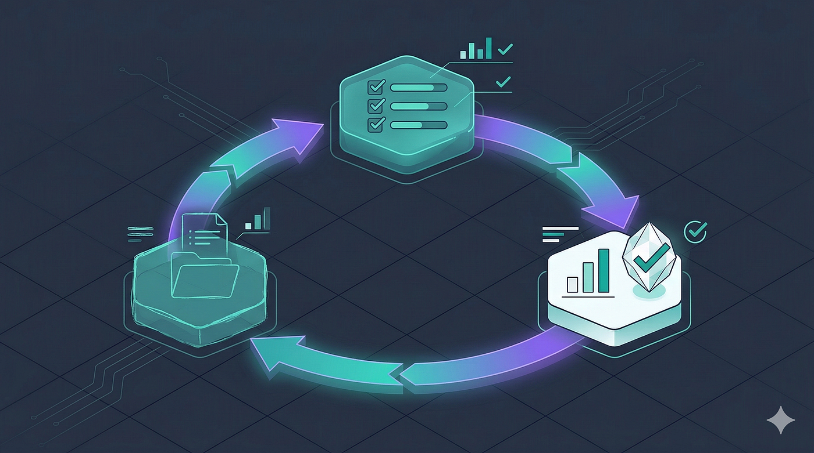

## 摘要（Summary）

作者 Reza Rezvani 在一個下午用 Anthropic 2026 年 3 月發布的 skill-creator 評估框架（eval framework），對他生產環境中的 3 個 skill 進行系統性測試與迭代。文章記錄了每個 skill 在真實評估資料下的失敗模式、迭代過程與量化改善結果，並說明評估框架如何將 skill 開發從「猜測」轉變為「工程」。



## 關鍵洞察（Key Insights）

- **假陽性（false positive）比漏報（miss）更危險** — 一個把乾淨程式碼標記為問題的 skill，會訓練開發者完全忽略它的輸出。參見 [[CLAUDE-SKILL-EVAL-FRAMEWORK]]
- **序列錯誤（sequence error）在輸出審查中是不可見的** — 只有評估的完整執行記錄（eval transcript）才能揭露步驟順序問題
- **Benchmark 模式量化 skill 的投資回報** — 多消耗 40% token，但減少 70% 人工修正，數據驅動決策
- **描述優化（description optimization）將觸發精準度從 ~70% 提升至 ~90%** — 在 skill 穩定後才執行，不要在仍在修改 skill 時就優化
- **在寫 skill 之前先寫測試案例** — 提示工程（Prompt Engineering）的測試驅動開發（Test-Driven Development，TDD），防止把「第一版剛好能做到的事」當成成功的定義

## 詳細內容（Details）

### Skill-Creator 評估框架新增的四項能力

> [!note] 2026-03-03 更新新增功能
> Anthropic 在 2026 年 3 月 3 日的 skill-creator 更新中，將 skill 開發從猜測變成可測量的工程：
> 1. **評估框架（Eval Framework）**：定義測試提示詞（prompt）和成功標準，系統告訴你 skill 是否達標
> 2. **Benchmark 模式（Benchmark Mode）**：有/無 skill 兩種情況對比，取得通過率、token 用量與計時資料
> 3. **多代理人 A/B 比較（Multi-agent A/B Comparison）**：兩個版本的 skill 由獨立代理人盲評，消除確認偏誤（confirmation bias）
> 4. **描述優化（Description Optimization）**：自動化迴圈測試 skill 的觸發描述，改寫以減少假陽性與假陰性

### Skill 分類：能力提升 vs 偏好編碼

> [!note] 兩類 Skill 的重要區別
> - **能力提升 Skill（Capability Uplift）**：幫助 Claude 做基礎模型無法穩定完成的事，如生產等級的 OpenAPI 文件。隨模型改善可能變得不必要。
> - **偏好編碼 Skill（Encoded Preference）**：對 Claude 已知如何執行的任務按團隊特定流程排序，如程式碼審查清單。價值取決於對實際工作流程的保真度。
>
> 這個區別影響評估策略，也影響何時該退役一個 skill。

---

### Skill 1：PR 審查標準（Encoded Preference）

**背景**：團隊有特定程式碼審查要求：只使用具名匯入（named imports，支援 tree-shaking）、feature 模組中不使用 barrel exports、每個 API 端點都要有 Zod 驗證、錯誤回應使用 `AppError` 類別。

**評估結果**：
- 測試案例：5 個真實 PR diff
- 第一次迭代：3/5（漏掉路徑別名（path alias）相關問題；對乾淨 PR 假陽性）
- 第三次迭代：4/5（剩餘漏報記錄為已知限制）

**關鍵發現**：
- 假陽性（把乾淨程式碼標記為問題）比漏報更有破壞性
- 修正假陽性的指令：`"Do not flag style preferences that are not documented in the standards list."`
- Benchmark 比較：無 skill 時 Claude 自然抓到 2/5，加入 skill 後第三次迭代達到 4/5

---

### Skill 2：API 文件生成器（Capability Uplift）

**背景**：將 Express route handler 轉換為包含型別化請求/回應 schema、錯誤碼與說明、rate limit 標注與範例請求的 OpenAPI 3.1 文件。

**Benchmark 量化結果**：

| 情況 | 生產就緒度評分 |
|------|-------------|
| 無 skill | ~40% |
| 有 skill，第 1 次迭代 | ~65% |
| 有 skill，第 3 次迭代 | ~85% |

**Token 用量分析**：
- skill 多消耗約 40% token
- 但輸出需要約少 70% 人工修正
- 對每週生成 API 文件的團隊，這個取捨明確合算

**框架限制**：評估框架擅長二元斷言（輸出是否包含錯誤碼，是/否），但不適合品質判斷（錯誤說明是否有幫助？範例是否真實？）這些需要人工審查。

---

### Skill 3：事件回應 Runbook（Encoded Preference）

**背景**：事件回應工作流程：P0–P3 嚴重度分類、按嚴重度的利害關係人通知模板、結構化的根本原因分析（root cause analysis）提示詞、事後報告（post-mortem）文件生成。

**關鍵發現：序列錯誤（Sequence Error）**

> [!warning] 序列錯誤在輸出審查中不可見
> 第一次測試模擬資料庫連線逾時（30% API 請求受影響）：
> - skill 正確分類為 P2
> - 生成了通知模板和根本原因分析框架
> - **但** 在確認影響範圍之前就通知了工程負責人
> - 我們的流程明確要求在升級通報前先完成影響評估，以避免警報疲勞
>
> 最終文件看起來完全正確，但只有讀取評估完整執行記錄才能發現這個排序問題。

**修正方式**：
- 嘗試一：加入明確的排序指令：`"Step 1 MUST complete and produce its output BEFORE proceeding to Step 2."`
- 更有效的方式：說明為何順序重要，而非只是要求它——解釋驅動比命令驅動更有效。

**測試案例結果（第 2 次迭代後）**：
- 資料庫連線逾時 ✅
- 第三方 API 降級 ✅
- 驗證服務故障 ✅
- 假警報（正確輸出「不需要行動」）✅

---

### 描述優化（Description Optimization）的效果

**原始描述**：
```
Code review skill that checks PRs against team coding standards including import conventions, error handling, and module structure.
```

**優化後描述**：
```
Analyze pull request diffs and code changes against team-specific coding standards. Use when reviewing code, checking PRs, looking at diffs, assessing code quality against project conventions, or when asked about import patterns, error handling approaches, barrel exports, or module boundaries — even if the user does not explicitly say 'code review.'
```

**觸發精準度改善**：
- 原始：should-trigger 查詢中 7/10 正確觸發
- 優化後：9/10 正確觸發
- 假觸發率也下降——優化後的描述正確忽略了「撰寫新程式碼」的查詢（原始版本有時會攔截這類查詢）

> [!tip] 描述優化的時機
> 在 skill 穩定後才執行描述優化。在 skill 本身仍在變動時優化描述，等於在為移動中的目標優化觸發精準度。

---

### 誠實的限制（Honest Limitations）

> [!warning] 框架的現實限制
> 1. **Claude.ai 的上下文限制**：完整的評估工作流程（平行代理人、基準線比較、評分、Benchmark）是為支援子代理人（subagent）的 Claude Code 設計的。Claude.ai 中只能循序執行測試案例，體驗明顯不如嚴謹。
> 2. **評估設計本身是一種技能**：第一批測試案例太簡單，Claude 不用 skill 就能通過。Benchmark 顯示無差異，白費一個迭代週期。好的評估要測試邊界案例，不是 happy path。
> 3. **主觀品質難以斷言**：框架適合二元檢查，不適合品質梯度。
> 4. **描述優化的冷啟動問題**：需要 20 個精心設計的觸發查詢，前幾個 skill 的負面範例（不應觸發但共享關鍵字的查詢）很難寫好。
> 5. **無團隊規模分享機制**：評估在本地執行，沒有內建的跨團隊分享、時間追蹤或 CI 自動觸發機制。

### 建議的入門順序

> [!tip] 從偏好編碼 Skill 開始，而非能力提升 Skill
> 1. **先寫測試案例，再寫 skill**：TDD 應用於提示工程，防止你無意識地把第一版剛好產生的東西定義為成功
> 2. **用 Benchmark 模式做升級決策**：新 Claude 模型上線時，對每個 skill 跑評估。若基礎模型在無 skill 情況下通過能力提升評估，就退役該 skill
> 3. **描述優化在 skill 穩定後才跑**

## 我的心得（My Takeaways）

這篇文章最有價值的部分是「序列錯誤不可見」這個洞察——我在自己的 skill 開發中也有同樣的盲點，只看最終輸出是否看起來正確，卻沒有驗證執行步驟的順序。

「在寫 skill 之前先寫測試案例」是我打算立刻採用的實踐。原因和程式碼的 TDD 一樣：測試先行會強迫你在寫任何指令之前，就先清楚說明「好的輸出長什麼樣子」。

Benchmark 模式的量化角度（40% token vs 70% 修正減少）也很實用——讓 skill 投資的取捨從「感覺好像有幫助」變成可以說明的數字。

## 相關連結（Related）

- [[CLAUDE-SKILL-EVAL-FRAMEWORK]] — skill-creator 評估框架的詳細說明與四項核心能力
- [[SKILL-MD-SPECIFICATION]] — SKILL.md 格式規格，30+ 工具共同採用的標準
- [[AGENT-SKILL-PATTERNS]] — 5 種代理人技能設計模式（Tool Wrapper、Generator、Reviewer、Inversion、Pipeline）
- [[5-AGENT-SKILL-DESIGN-PATTERNS-EVERY-ADK-DEVELOPER-SHOULD-KNOW]] — Google Cloud Tech 發布的 ADK 設計模式文章，與本文的 skill 分類框架互補

## References

- [原文](https://alirezarezvani.medium.com/claude-skill-eval-framework-3-skills-one-afternoon-real-data-5b43e06182cb)
