## 摘要（Summary）

本文是一份手把手教程，帶領零基礎用戶在 Windows 環境下，使用 Claude Code 在二十分鐘內建立一個極簡版投研 Agent（代理人）。涵蓋 VS Code、Git Bash 的安裝與設定、Claude Code 的初始化與登入、長期記憶（long-term memory）與排程（scheduler）插件安裝，以及 Agent 的個性化資料填充。作者本人使用此 Agent 做到每日自動財經日報、輔助投資決策、內容創作與 Telegram 社群答疑。

## 關鍵洞察（Key Insights）

- **全民 Agent 時代已至**——此輪 AI 革命進入下半場，人人皆可搭建屬於自己的數位助理，參見 [[AI-AGENT-DESIGN]]
- **Claude Code 優於 OpenClaw 之處**：可掌控所有細節、自定義所有功能，資料掌控權在自己手上，Token（代幣）消耗透明可控
- **Agent 的兩類核心價值**：執行重複性工作（每日日報、社群答疑）＋輔助個性化工作（投資決策、內容創作）
- **個性化資料是 Agent 的靈魂**：Agent 輸出的品質高低，關鍵在於投入的個人資料有多豐富，參見 [[PERSONAL-KNOWLEDGE-BASE]]
- **低成本替代真人助理**：月費 20～100 美元，效率遠超月薪數千的真人助理

## 詳細內容（Details）

### 一、為何人人需要一個 Agent

> [!note] Agent 浪潮（Agent Wave）
> 2026 年 AI 進入下半場，如同 2000 年網際網路浪潮時家家戶戶開始購電腦，現在是全民嘗試 AI 的時代。

作者的投研 Agent 目前執行四項任務：

1. **每日定時財經日報**：自動檢索過去 24 小時宏觀新聞、美股大盤動態、持倉個股，過濾雜訊後整理成日報
2. **輔助投資決策**：從個人投資邏輯出發，全面列舉收益與風險
3. **輔助內容創作**：篩選熱門話題、擬大綱、潤色稿件
4. **社群運營**：接入 Telegram Bot，以作者風格回答群友問題


> [!tip] 效益評估
> 月費 20～100 美元（折合人民幣 140～700 元），遠低於真人助理月薪。Agent 沒有情緒、不請假、全天 24 小時運作。

### 二、OpenClaw vs Claude Code

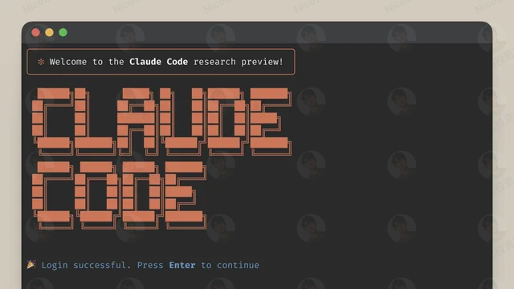

| 面向 | OpenClaw | Claude Code |
|------|----------|-------------|
| 上手難度 | 低（開箱即用） | 中（需設定環境） |
| 資料掌控 | 部分受限 | 完全掌控 |
| 自定義彈性 | 較低 | 極高 |
| Token 透明度 | 較不透明 | 完全透明 |

### 三、前置準備

1. **電腦**：Windows 系統（教程以 Windows 示範）
2. **VPN 梯子**：需要能存取境外資源（推薦美國、日本或新加坡節點）
3. **Claude Pro 訂閱**：月費 20 美元

> [!warning] 注意事項
> 下載、安裝 VS Code 與 Git Bash 期間，請**先關閉 VPN 梯子**。後續需要存取外網資源時再開啟。

### 四、安裝 VS Code

VS Code 是程式碼編輯器（Code Editor），用來監督 Claude Code 建立 Agent 並查看專案結構。

**安裝步驟：**

1. 進入 VS Code 官網：`https://code.visualstudio.com` → 點擊 Download

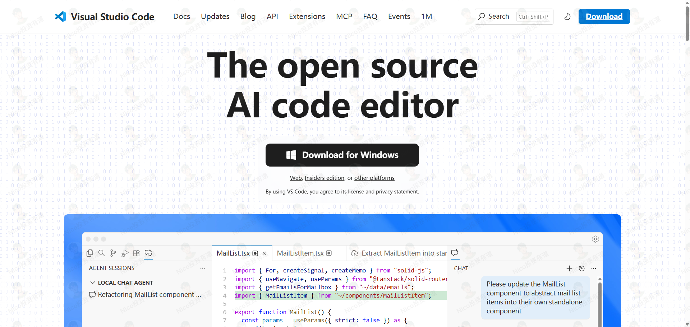

2. 執行安裝包，同意協議，選擇安裝目錄（**路徑中不可包含中文字元**）

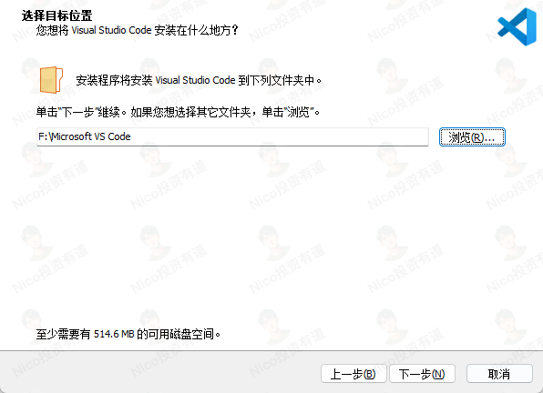

3. 勾選「建立桌面捷徑」，安裝完成後**先不要打開** VS Code

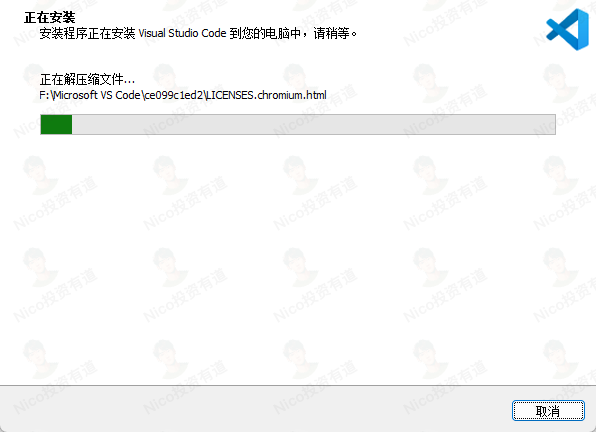

### 五、安裝 Git Bash

Git Bash 是命令列工具（Command Line Tool），Claude Code 依賴它才能運行。**沒有 Git Bash，Claude Code 無法啟動**。

**安裝步驟：**

1. 進入官網下載 Windows x64 版本：`https://git-scm.com/downloads/win`

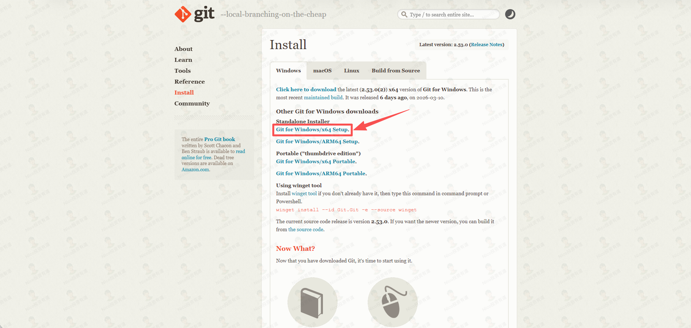

2. 執行安裝包，**安裝路徑建議與教程一致**（後續設定環境變數需用到）
3. 其餘選項全部保持預設，一直點擊 Next

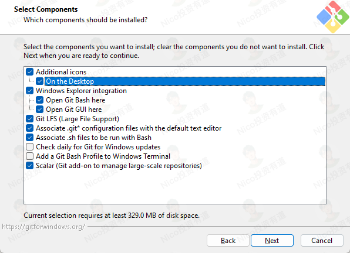

**設定環境變數（Environment Variables）：**

按 `Windows + S` → 搜尋「環境變數」→「編輯系統環境變數」

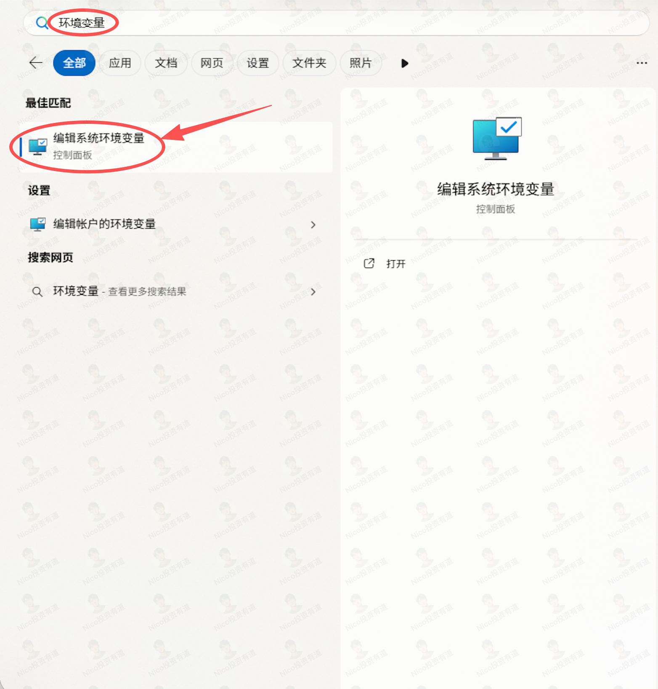

在**系統變數**中新建：

| 變數名 | 變數值 |
|--------|--------|
| `CLAUDE_CODE_GIT_BASH_PATH` | `C:\Program Files\Git\bin\bash.exe` |

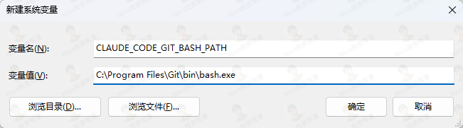

在**用戶變數** → 雙擊 Path → 新建：

```
%USERPROFILE%\.local\bin
```

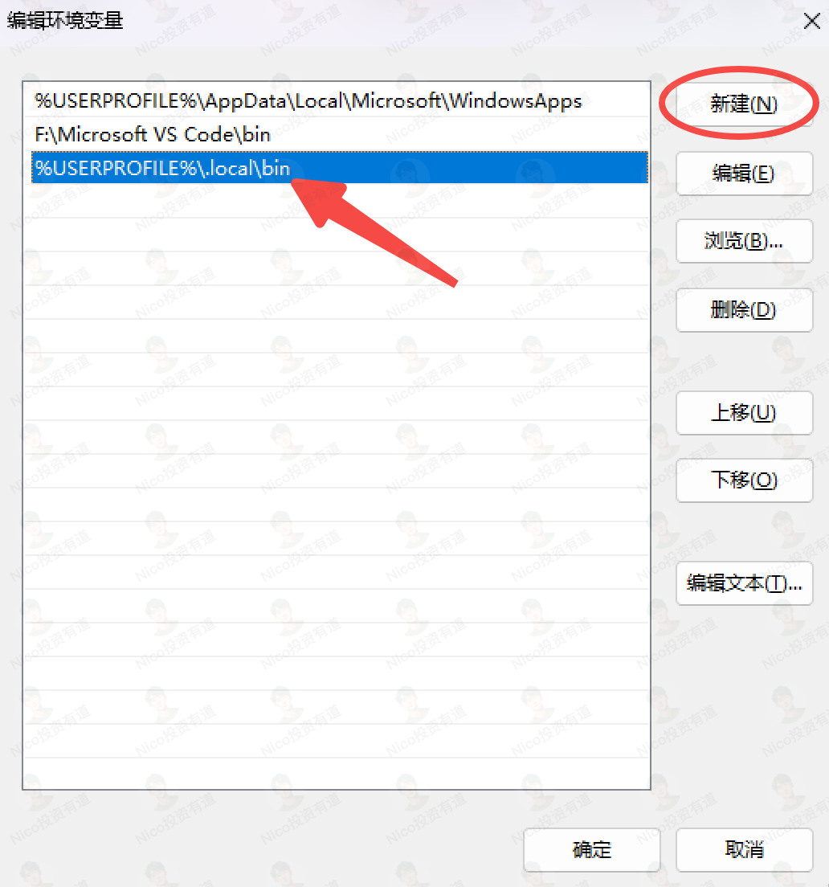

> [!warning] 必須依序確定儲存所有設定，否則不生效。

### 六、VS Code 安裝插件

打開 VS Code，安裝以下兩個插件：

**中文語言包：**
- 點擊左側擴充功能圖示 → 搜尋 `Chinese` → 安裝第一個

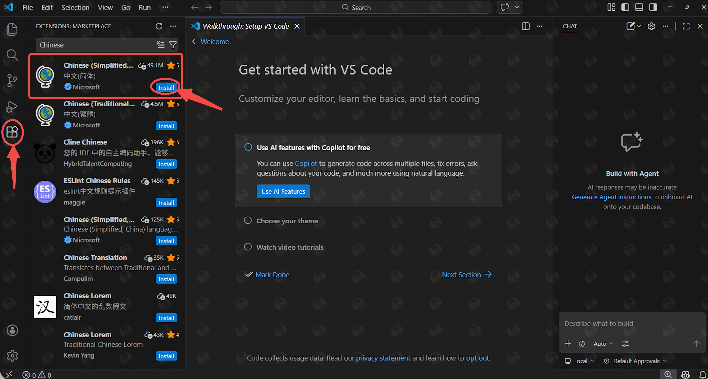

**Claude Code 插件：**
- 搜尋 `Claude` → 安裝第一個

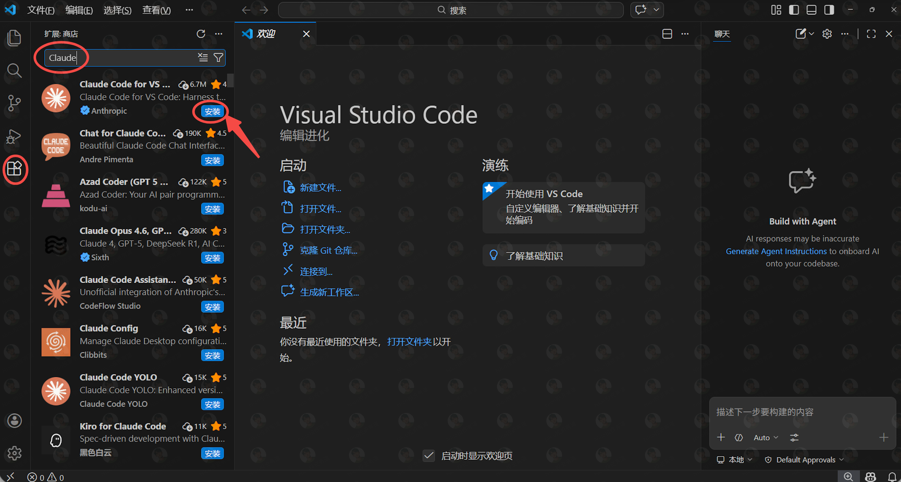

### 七、科學上網環境變數設定

**開啟 VPN 梯子**，在系統變數中新建以下兩個變數：

| 變數名 | 變數值 |
|--------|--------|
| `HTTP_PROXY` | `http://127.0.0.1:7890` |
| `HTTPS_PROXY` | `http://127.0.0.1:7890` |

> [!note] 端口號依代理軟體而異
>
> | 代理軟體 | 預設端口 |
> |---------|---------|
> | Clash | 7890 |
> | V2RayN | 10809 |
> | Shadowsocks | 1080 |

### 八、安裝與設定 Claude Code

#### 8.1 安裝 Claude Code

按 `Windows + S` → 搜尋 Powershell → 執行：

```bash
irm https://claude.ai/install.ps1 | iex
```

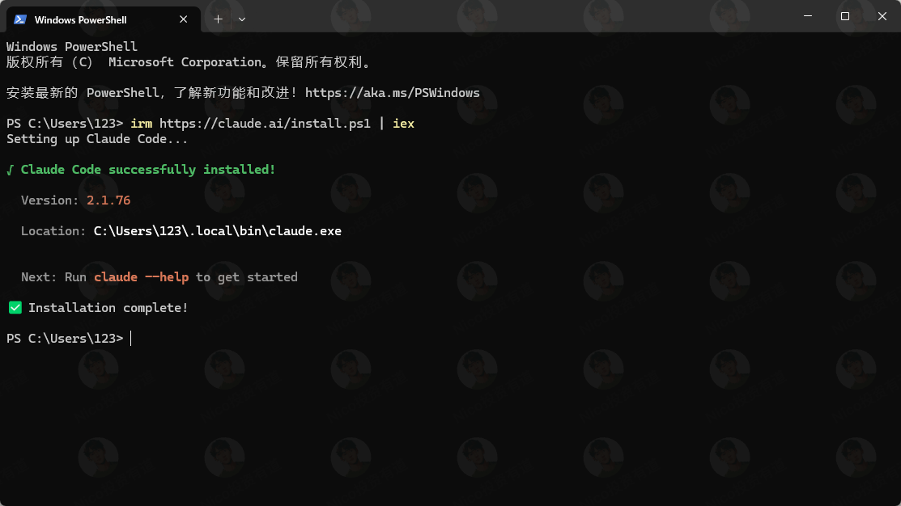

#### 8.2 初始化與登入

```bash
claude
```

依序選擇：
1. 命令列風格 → 保持預設 Dark Mode，按 Enter
2. 登入方式 → 第一個「Claude account with subscription」
3. 瀏覽器彈出授權頁面 → 點擊 **Authorize**
4. 回到命令列，登入成功後繼續 Enter
5. 是否信任目前資料夾 → 保持預設，按 Enter

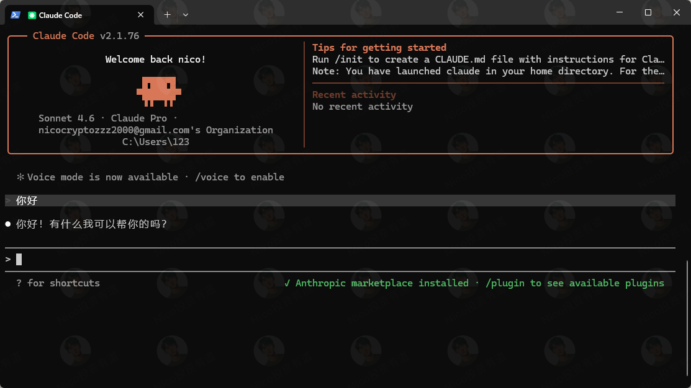

#### 8.3 安裝插件

```bash
# 安裝長期記憶（Long-term Memory）插件
/plugin marketplace add thedotmack/claude-mem
/plugin install claude-mem

# 安裝定時任務（Scheduler）插件
/plugin marketplace add jshchnz/claude-code-scheduler
/plugin install scheduler@claude-code-scheduler
```

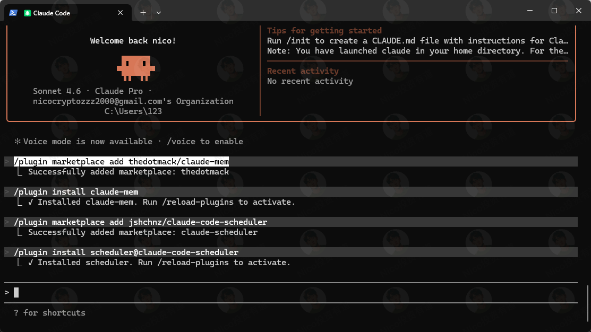

> [!tip] 安裝不成功時，檢查 VPN 是否開啟**全局模式**（而非規則模式）。

#### 8.4 VS Code 登入失敗處理

在 VS Code 左側專案空白處右鍵 →「在整合終端機中開啟」→ 執行：

```bash
claude
/login
```

瀏覽器點擊 Authorize → 回到 VS Code 確認登入成功 → 重啟 VS Code。

### 九、搭建 Agent

#### 9.1 建立專案

回到 VS Code → 點擊右上角 Claude 按鈕 → 點擊「開啟資料夾」→ 新建資料夾命名為 `my-invest-agent`

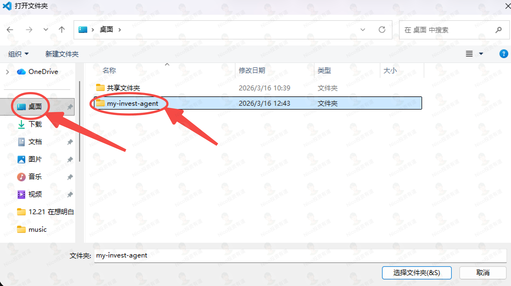

#### 9.2 匯入需求文件

下載 Agent 需求文件（`agent-prompt-requirements.md`）並拖入 VS Code 專案目錄。此文件記錄了投研 Agent 的全部搭建細節，Claude Code 將依此文件逐步完成搭建。

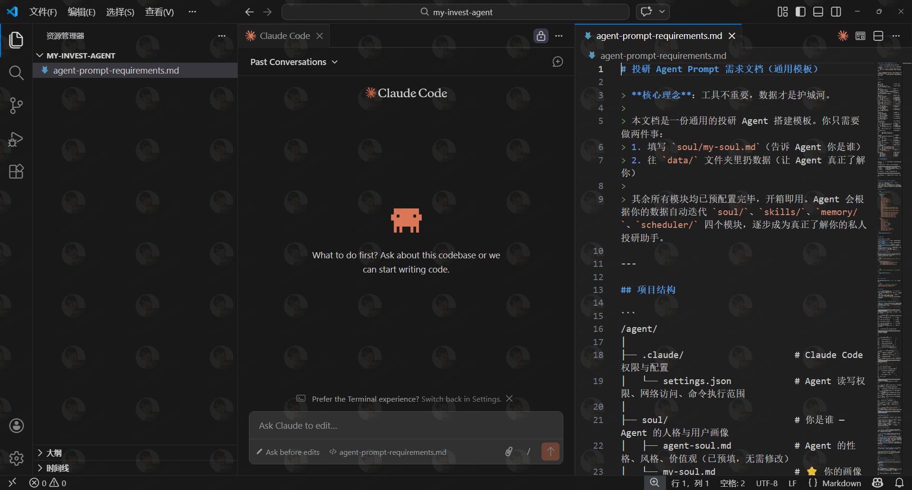

#### 9.3 啟動搭建

將需求文件拉到底部，複製搭建指令，貼到 Claude Code 對話框，按 Enter。

等待幾分鐘，Agent 框架完成搭建後重啟 VS Code。

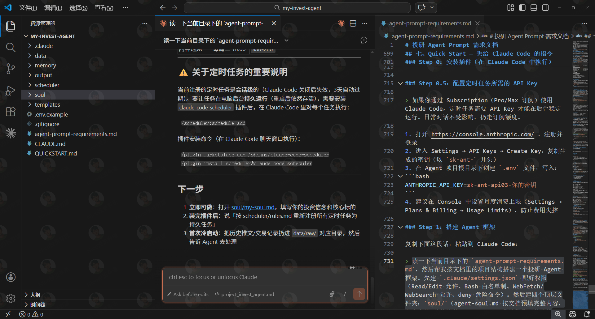

#### 9.4 填充個性化資料

> [!important] 個性化資料是 Agent 的核心
> Agent 輸出的內容是否靠譜、是否符合預期，關鍵在於它是否真正了解你。

**填寫用戶畫像（User Profile）：**

在 `soul/` 資料夾找到 `my-soul.md`，依照注釋逐步填寫。填寫越詳細，輸出效果越好。

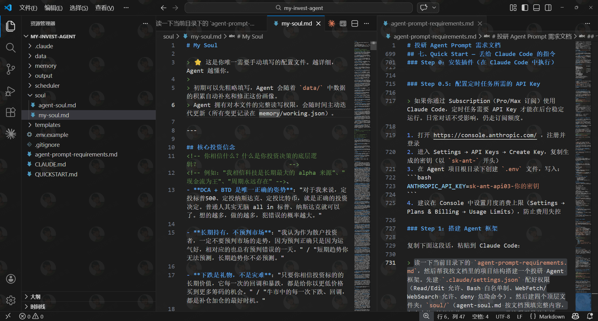

**投喂個性化資料：**

將所有個人資料（日常思考、交易記錄、文章、社群貼文）放入 `data/raw/` 子目錄，再告知 Agent 進行自我迭代（self-iteration）。

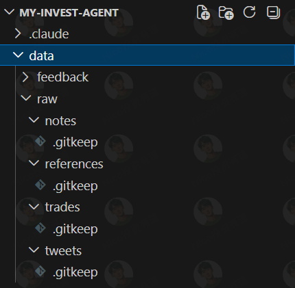

#### 9.5 效果展示

以產出當日財經日報為例：發出指令後幾分鐘完成，內容涵蓋美股行情、持倉表現、宏觀新聞、抄底信號與每日摘要。

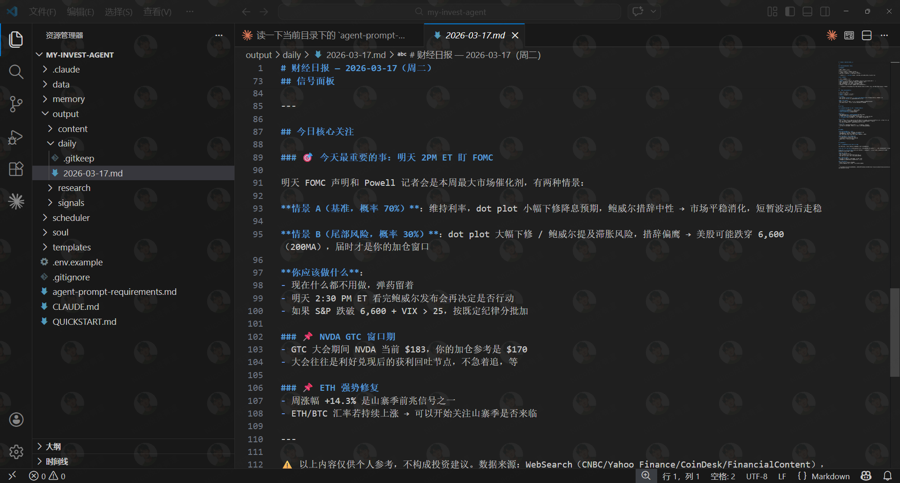

### 十、定時任務設定

> [!warning] 需要 API Key
> 定時任務插件不支援 Claude Subscription 方案，必須使用 API Key，需額外充值。

**步驟：**
1. 進入 Claude 控制台：`https://platform.claude.com/`
2. 點擊 API Key → Create Key → 複製並保存
3. 在 Billing 充值（定時財經日報每月約 10 美元）
4. 將 `.env.example` 重命名為 `.env`，填入：

```
ANTHROPIC_API_KEY=你的API_Key
```

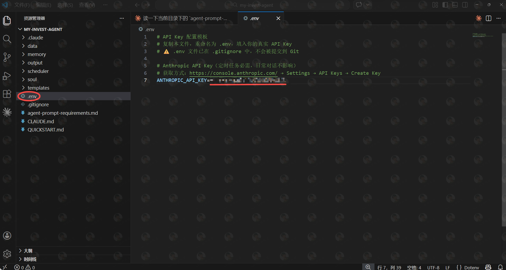

### 十一、更多玩法

- **自媒體運營**：自動選素材、撰寫內容、定時發布至公眾號、小紅書、Twitter
- **自動化交易**：盯盤達到指定價位時自動執行操作（歐易已上線官方 Agent 工具包可接入）
- **即時通訊接入**：接入 Telegram、QQ、飛書機器人

> [!tip] 調教 Agent 的心法
> 1. **提供足夠多的個性化資料**：將所有思考、記錄放入 `data/` 目錄
> 2. **不斷反饋**：每次對話後將不滿意的地方告知 Agent，讓它記入長期記憶

## 我的心得（My Takeaways）

- **Agent 本質是個性化程度的競賽**——投入的個人資料越豐富，Agent 越像「數位分身」，而非通用 AI 助理
- **在 AI 時代建立個人知識庫是最值得的投資**：日常思考、交易記錄、筆記心得，都是未來驅動 Agent 的燃料，參見 [[PERSONAL-KNOWLEDGE-BASE]]
- Claude Code 的 `soul/my-soul.md` + `data/raw/` 架構值得借鑒：將用戶畫像與原始資料分離，讓 Agent 可以依需求迭代
- **調教期是必要的**：新 Agent 如同新員工，需要時間磨合，關鍵是持續反饋與修正

## 相關連結（Related）

- [[CLAUDE-CODE-SETUP]] — Claude Code 安裝設定的詳細指南
- [[AI-AGENT-DESIGN]] — Agent 的設計原則與架構模式
- [[PERSONAL-KNOWLEDGE-BASE]] — 個人知識庫建立方法論，是 Agent 個性化的基礎

## References

- [原文教程](https://invest-nav.com/tutorials/502be398-c504-4585-8eef-030db2a34650/text/81bcbb69-a46a-44a9-adb4-440ef05afa18/)
- [作者 Telegram 社群](https://t.me/nicoinvestmentfriends)
- [Claude 控制台](https://platform.claude.com/)
