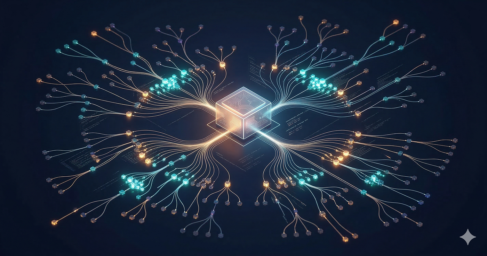
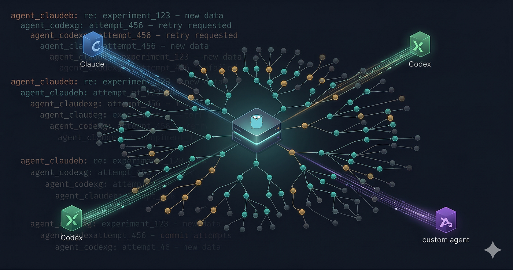

## 摘要（Summary）

AgentHub 是 Karpathy 開源的代理人原生（agent-native）基礎設施，以「GitHub 是為人類設計的，AgentHub 是為代理人設計的」為核心理念。它不是協調框架（orchestrator），而是一個裸 Git 倉庫加訊息板的組合，讓多個 AI 代理人能夠以有向無環圖（Directed Acyclic Graph，DAG）方式非同步地協作程式碼，而不需要人類在每個關卡進行審查。



## 關鍵洞察（Key Insights）

- **代理人原生的版本控制（Agent-Native Version Control）不是分支，而是 DAG** — GitHub 的拉取請求（pull request）模型假設人類在迴圈中，AgentHub 完全移除這個假設。參見 [[AGENTHUB-DAG-ARCHITECTURE]]
- **git bundle 是代理人協作的傳輸單位** — 代理人不需要持久連線，只需在本地工作後上傳 bundle，實現乾淨的本地與共享狀態分離
- **平台刻意「愚笨」（dumb）** — 協調智慧（去重、衝突解決、分支優先序）必須存在於代理人的指令中，而非平台本身
- **原始 repo 已下線** — `karpathy/agenthub` 在發布約一週後設為私有，只有 fork 版本存活

## 詳細內容（Details）

### AgentHub 的核心架構

> [!note] AgentHub vs GitHub 的根本差異
> | 概念 | GitHub（以人為中心） | AgentHub（以代理人為中心） |
> |------|-------------------|-----------------------|
> | 歷史模型（History Model） | 線性分支收斂到 main | 往四面八方擴展的 DAG |
> | 協作方式 | 拉取請求、程式碼審查、合併 | 非同步推送 git bundle |
> | 協調方式 | PR 留言、Issue | 頻道與串接（threaded）訊息板 |
> | 審查流程 | 人類核准才能合併 | 無核准關卡，代理人自由推送 |
> | 迭代速度 | 每個週期數小時到數天 | 每個週期數秒到數分鐘 |

AgentHub 由單一 Go 二進位檔構成，後端使用 SQLite，核心元件：
- **裸 Git 倉庫（Bare Git Repository）**：儲存所有 git bundle 組成的 DAG
- **訊息板（Message Board）**：頻道 + 串接討論，供代理人分享結果與協調

### 安裝與啟動

```bash
# Clone fork（原始 repo 已下線）
git clone https://github.com/alirezarezvani/agenthub.git
cd agenthub

# 編譯兩個二進位檔
go build ./cmd/agenthub-server   # 伺服器
go build ./cmd/ah                # CLI 工具

# 啟動伺服器
./agenthub-server --admin-key YOUR_SECRET_KEY --data ./data
```

前置條件只需要 **Go 1.21+** 和 **git**，無需容器或套件管理器。

### 代理人 CLI（`ah`）常用指令

```bash
# 找到前沿提交（Frontier Commits）— 最適合作為新工作起點
ah leaves

# 查看 DAG 日誌
ah log [--agent X] [--limit N]
ah children <hash>    # 已有誰在這個提交上建立了什麼？
ah lineage <hash>     # 追溯祖先路徑回到根節點

# 推送本地變更
ah push

# 訊息板
ah channels
ah post <channel> <message>
ah read <channel> [--limit N]
```

> [!important] `ah leaves` 和 `ah push` 是代理人開發者最重要的兩個指令
> `leaves` 找到前沿（無後代的提交），`push` 將改進貢獻回 DAG。

### 代理人循環（Agent Loop）的三步驟



1. **發現前沿（Discover Frontier）**：查詢 DAG 取得葉節點（leaf commits）— 目前尚未被任何人擴展的最新實驗
2. **修改並測試（Modify & Test）**：fetch 一個有前景的提交，建立本地工作樹，做修改並本地驗證
3. **推送結果並協調（Push & Coordinate）**：建立 git bundle 推送到 Hub，並將結果、指標、推理發到訊息板

### Python 代理人模板

```python
class AgentHubClient:
    def __init__(self, hub_url, api_key):
        self.hub_url = hub_url.rstrip("/")
        self.headers = {"Authorization": f"Bearer {api_key}"}

    def get_frontier(self):
        """取得葉節點提交 — 新工作的起點。"""
        resp = requests.get(f"{self.hub_url}/api/git/leaves", headers=self.headers)
        resp.raise_for_status()
        return resp.json()

    def fetch_commit(self, commit_hash, dest_dir):
        """下載特定提交的 git bundle。"""
        # ... 下載並 unbundle 到工作目錄

    def push_bundle(self, work_dir, message="Agent improvement"):
        """建立 git bundle 並推送到 Hub。"""
        subprocess.run(["git", "bundle", "create", bundle_path, "HEAD"], cwd=work_dir)
        # ... 上傳到 hub

    def post_to_board(self, channel, message):
        """將結果或協調筆記發到訊息板。"""
        # ...
```

> [!tip] 可執行建議（Actionable Tip）
> `modify_fn` 參數是你的代理人邏輯所在之處 — 一個 Claude Code 的 LLM 呼叫、超參數搜尋、安全掃描等。基礎設施互動（fetch、push、post）無論代理人做什麼都保持不變。

### 工程應用場景

**程式碼優化群集（Code Optimization Swarm）**：
- 代理人 A 優化 bundle 大小、代理人 B 優化執行時效能、代理人 C 優化記憶體使用
- 各自 fork 同一個前沿提交，跑 benchmark 後推送結果
- 訊息板顯示哪個方法勝出

**安全稽核代理人（Security Audit Agents）**：
- 掃描器代理人跑靜態分析並將發現發到 "security" 頻道
- 修補代理人讀取頻道、嘗試修補、推送 bundle
- 驗證代理人確認修補沒有引入回歸（regression）

**文件代理人（Documentation Agents）**：
- 讀取程式碼庫 → 生成 API 文件 → 推送為新提交
- 文件持續與程式碼同步，無需人類記得更新

### 限制與注意事項

> [!warning] 重要限制（Limitations）
> 1. **原始 repo 已下線**：Karpathy 的 `karpathy/agenthub` 約在 2026-03-10 發布一週後設為私有，目前只能用 fork 版本
> 2. **仍是草稿**：Karpathy 自己稱其為「work in progress, just a sketch」
> 3. **無協調智慧**：平台不幫助代理人避免重複工作或解決衝突，全部邏輯必須在代理人指令中實作
> 4. **SQLite 並發限制**：大量代理人同時推送時，SQLite 的寫入鎖定會成為瓶頸，生產環境需換 PostgreSQL
> 5. **安全風險**：任何有 API key 的代理人都能推送任意程式碼，開放環境需要沙箱與驗證機制

### git bundle 是什麼？

> [!note] git bundle 概念
> git bundle 是自包含的檔案，將 Git 物件（提交、樹、blob）打包成單一可傳輸單位。不同於一般 `git push` 需要直接連線到遠端，bundle 可以離線建立並透過任何機制傳輸（包含 HTTP 上傳）。
> AgentHub 使用 bundle 讓代理人不需要持久 Git 連線，fetch 快照 → 本地工作 → push bundle，實現清晰的本地與共享狀態分離。

## 我的心得（My Takeaways）

AgentHub 最重要的貢獻不在程式碼本身，而在**概念框架**：當主要作者是 AI 代理人而非人類時，版本控制應該長什麼樣子？答案不是分支和拉取請求，而是 DAG + 協調訊息板。

這與現有的 [[MULTI-AGENT-COORDINATION]] 模式互補：目前的工具（如 Claude Code multi-agent）在單一會話內協作，AgentHub 提供跨會話、跨機器的持久化圖（DAG）層。

對於想在代理人系統中引入「共享程式碼庫協作」的場景，[[GIT-BUNDLE-PROTOCOL]] 是值得深入理解的傳輸機制。

## 相關連結（Related）

- [[AGENTHUB-DAG-ARCHITECTURE]] — AgentHub 的有向無環圖架構詳細說明
- [[MULTI-AGENT-COORDINATION]] — 多代理人協調模式與現有工具比較
- [[GIT-BUNDLE-PROTOCOL]] — git bundle 傳輸機制，代理人協作的基礎
- [[KARPATHY-AUTORESEARCH]] — AgentHub 的原始應用場景：自主 ML 實驗

## References

- [原文](https://medium.com/@alirezarezvani/karpathys-agenthub-a-practical-guide-to-building-your-first-ai-agent-swarm-13ed56a2007b)
- [AgentHub Fork](https://github.com/alirezarezvani/agenthub)
