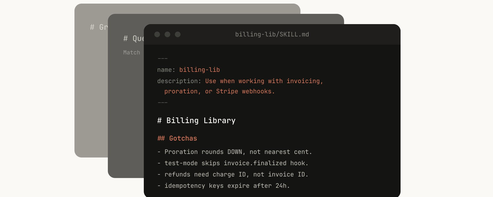
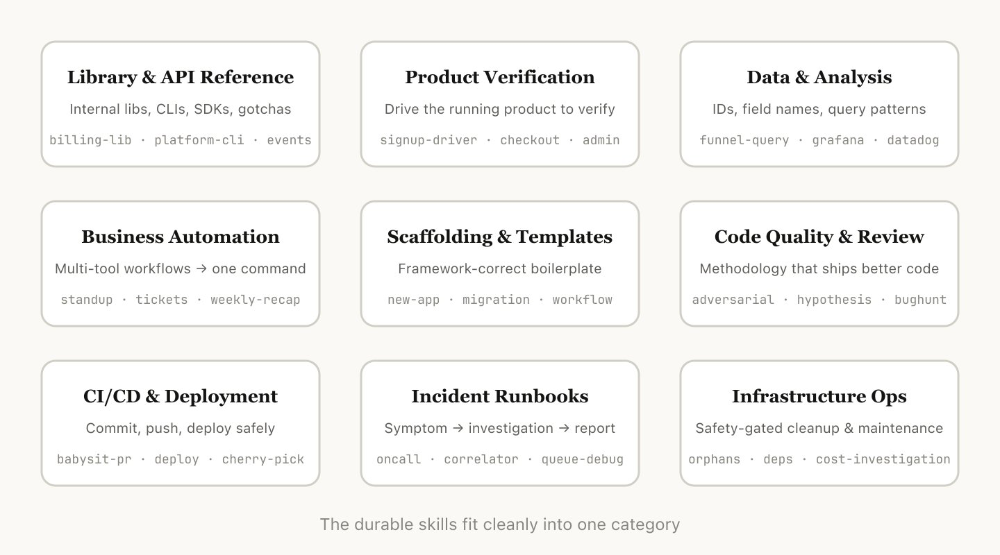
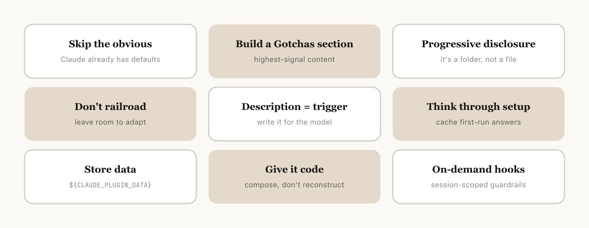
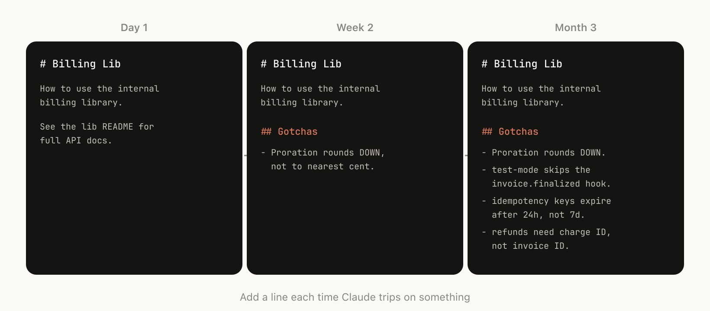
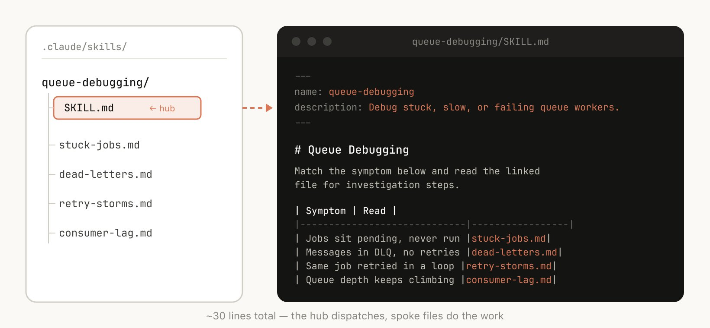
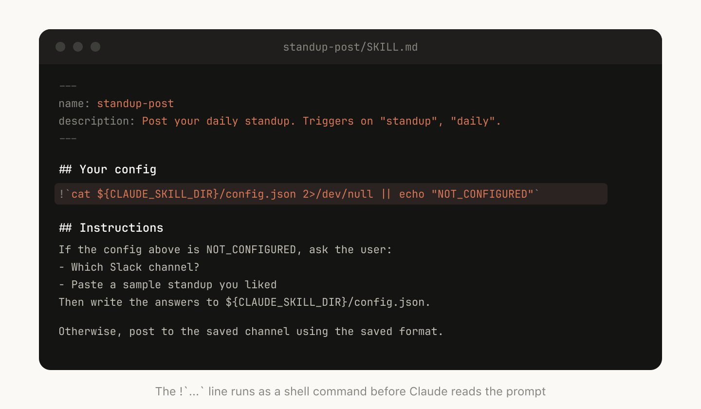
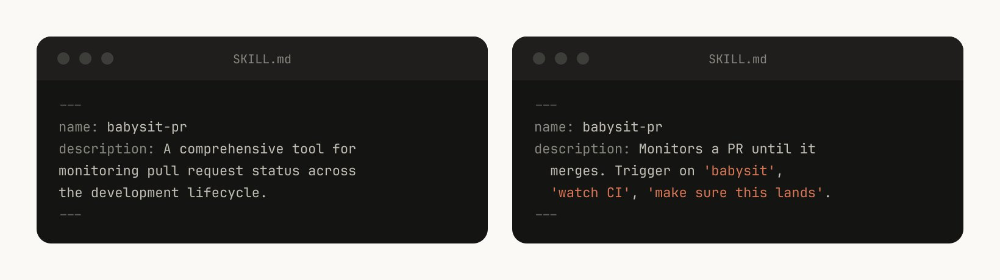

## 摘要（Summary）

本文是 Anthropic Claude Code 團隊工程師 Thariq Shihipar 的第一手實戰總結，說明 Anthropic 內部如何大規模使用 Skills（技能擴充）——目前活躍使用數量已達數百個。文章將 Skills 分為 9 大類型，並提供撰寫、分發和衡量 Skills 效果的最佳實踐（best practices）。

> [!important] 核心觀念糾正
> 常見誤解：Skills「只是 markdown 文件」。
> 事實：Skills 是**資料夾**，可包含腳本（scripts）、資源（assets）、資料（data）等，智能體（agent）可以發現、探索和使用這些內容。

---

## 完整原文翻譯

> [!note] 譯者說明
> 以下為完整原文翻譯，保留所有英文專有名詞。原文作者：Thariq Shihipar（@trq212），Anthropic Claude Code 團隊工程師，發表於 2026 年 3 月 17 日。

Skills（技能擴充）已經成為 Claude Code 中使用最廣泛的擴充點（extension points）之一。它們靈活、容易製作，分發起來也很簡單。

但也正因為太靈活，你很難知道怎樣用才最好。什麼類型的 Skills 值得做？寫出好 Skill 的秘訣是什麼？什麼時候該把它們分享給別人？

我們在 Anthropic 內部大量使用 Claude Code 的 Skills，目前活躍使用的已經有數百個。以下就是我們在用 Skills 加速開發過程中總結出的經驗。

### 什麼是 Skills？

如果你還不了解 Skills，建議先看看[我們的文件](https://code.claude.com/docs/en/skills)或最新的 [Skilljar 上關於 Agent Skills 的課程](https://anthropic.skilljar.com/introduction-to-agent-skills)，本文假設你已經對 Skills 有了基本的了解。

我們經常聽到一個誤解，認為 Skills「只不過是 markdown 文件」。但 Skills 最有意思的地方恰恰在於它們不只是文字檔——它們是資料夾，可以包含腳本、資源文件、資料等等，智能體（agent）可以發現、探索和使用這些內容。

在 Claude Code 中，Skills 還擁有[豐富的配置選項](https://code.claude.com/docs/en/skills#frontmatter-reference)，包括註冊動態鉤子（hooks）。

我們發現，Claude Code 中最有意思的那些 Skills，往往就是創造性地利用了這些配置選項和資料夾結構。

---

## Skills 的類型（Types of Skills）

在整理了我們所有的 Skills 之後，我們注意到它們大致可以歸為幾個反覆出現的類別。最好的 Skills 清晰地落在某一個類別裡；讓人困惑的 Skills 往往橫跨了好幾個。這不是一份終極清單，但如果你想檢查團隊裡是否還缺了什麼類型的 Skills，這是一個很好的思路。

### 1. 庫與 API 參考（Library & API Reference）

幫助你正確使用某個庫（library）、命令行工具（CLI）或 SDK 的 Skills。它們既可以針對內部庫，也可以針對 Claude Code 偶爾會犯錯的常用庫。這類 Skills 通常會包含一個參考程式碼片段的資料夾，以及一份 Claude 在寫程式碼時需要避免的踩坑點（gotchas）列表。

範例：
- `billing-lib` — 你的內部計費庫：邊界情況（edge cases）、容易踩的坑（footguns）等
- `internal-platform-cli` — 內部 CLI 工具的每個子命令及其使用場景範例
- `frontend-design` — 讓 Claude 更好地理解你的設計系統（design system）

### 2. 產品驗證（Product Verification）

描述如何測試或驗證程式碼是否正常運作的 Skills。通常會搭配 Playwright、tmux 等外部工具來完成驗證。

驗證類 Skills 對於確保 Claude 輸出的正確性非常有用。值得安排一個工程師花上一週時間專門打磨你的驗證 Skills。

可以考慮一些技巧，比如讓 Claude 錄製輸出過程的影片，這樣你就能看到它到底測試了什麼；或者在每一步強制執行程式化的狀態斷言（assertions）。這些通常透過在 Skill 中包含各種腳本來實現。

範例：
- `signup-flow-driver` — 在無頭瀏覽器（headless browser）中跑完「註冊→信箱驗證→引導流程」，每一步都可以插入狀態斷言的鉤子
- `checkout-verifier` — 用 Stripe 測試卡驅動結帳 UI，驗證發票最終是否到了正確的狀態
- `tmux-cli-driver` — 針對需要 TTY 的互動式命令列測試

### 3. 資料獲取與分析（Data Fetching & Analysis）

連接你的資料和監控體系的 Skills。這類 Skills 可能會包含帶有憑證的資料獲取庫、特定的儀表板（dashboard）ID 等，以及常用工作流程和資料獲取方式的說明。

範例：
- `funnel-query` — 「要看「註冊→啟動→付費」的轉化，需要關聯哪些事件？」，再加上真正存放規範 `user_id` 的那張資料表
- `cohort-compare` — 對比兩個使用者群的留存或轉化率，標記統計顯著的差異，連結到分群定義
- `grafana` — 資料來源（datasource）UID、叢集（cluster）名稱、「問題→儀表板」對照表

### 4. 業務流程與團隊自動化（Business Process & Team Automation）

把重複性工作流程自動化為一條命令的 Skills。這類 Skills 通常指令比較簡單，但可能會依賴其他 Skills 或 MCP（Model Context Protocol，模型上下文協議）。對於這類 Skills，把之前的執行結果保存在日誌文件（log files）中，有助於模型保持一致性並回顧之前的執行情況。

範例：
- `standup-post` — 彙總你的任務追蹤器、GitHub 活動和之前的 Slack 消息→生成格式化的站會（standup）匯報，只報變化部分（delta-only）
- `create-<ticket-system>-ticket` — 強制執行 schema（合法的枚舉值、必填字段）加上建立後的工作流程（通知審查者、在 Slack 中發連結）
- `weekly-recap` — 已合併的 PR + 已關閉的工單 + 部署記錄→格式化的週報

### 5. 程式碼鷹架與模板（Code Scaffolding & Templates）

為程式碼庫（codebase）中的特定功能生成框架樣板程式碼（boilerplate）的 Skills。你可以把這些 Skills 和腳本組合使用。當你的鷹架（scaffolding）有自然語言需求、無法純靠程式碼覆蓋時，這類 Skills 特別有用。

範例：
- `new-<framework>-workflow` — 用你的注解搭建新的服務/工作流程/處理器（handler）
- `new-migration` — 你的資料庫遷移（migration）文件模板加上常見踩坑點
- `create-app` — 新建內部應用，預配好你的認證（auth）、日誌和部署配置

### 6. 程式碼品質與審查（Code Quality & Review）

在團隊內部執行程式碼品質標準並輔助程式碼審查的 Skills。可以包含確定性的腳本或工具來保證最大的可靠性。你可能希望把這些 Skills 作為鉤子的一部分自動執行，或者放在 GitHub Action 中執行。

- `adversarial-review` — 生成一個全新視角的子智能體（subagent）來挑刺，實施修復，反覆迭代直到發現的問題退化為吹毛求疵
- `code-style` — 強制執行程式碼風格，特別是那些 Claude 預設做不好的風格
- `testing-practices` — 關於如何寫測試以及測試什麼的指導

### 7. CI/CD 與部署（CI/CD & Deployment）

幫你拉取、推送和部署程式碼的 Skills。這類 Skills 可能會引用其他 Skills 來收集資料。

範例：
- `babysit-pr` — 監控一個 PR→重試不穩定的 CI→解決合併衝突（merge conflicts）→啟用自動合併（auto-merge）
- `deploy-<service>` — 構建→冒煙測試（smoke test）→漸進式流量切換並對比錯誤率→指標惡化時自動回滾（rollback）
- `cherry-pick-prod` — 隔離的工作樹（worktree）→cherry-pick→解決衝突→用模板建立 PR

### 8. 維運手冊（Runbooks）

接收一個現象（比如一條 Slack 消息、一條告警或者一個錯誤特徵），引導你走完多工具排查流程，最後生成結構化報告的 Skills。

範例：
- `<service>-debugging` — 把現象對應到工具→查詢模式，覆蓋你流量最大的服務
- `oncall-runner` — 拉取告警→檢查常見嫌疑→格式化輸出排查結論
- `log-correlator` — 給定一個請求 ID（request ID），從所有可能經過的系統中拉取匹配的日誌

### 9. 基礎設施維運（Infrastructure Operations）

執行日常維護和維運操作的 Skills——其中一些涉及破壞性操作（destructive actions），需要安全護欄（guardrails）。這些 Skills 讓工程師在執行關鍵操作時更容易遵循最佳實踐。

範例：
- `<resource>-orphans` — 找到孤立的 Pod/Volume→發到 Slack→等待觀察期（soak period）→使用者確認→級聯清理（cascading cleanup）
- `dependency-management` — 你所在組織的依賴審批工作流程
- `cost-investigation` — 「我們的儲存/出口頻寬費用為什麼突然漲了」，附帶具體的儲存桶和查詢模式

---

## 編寫 Skills 的技巧（Tips for Making Skills）

確定了要做什麼 Skill 之後，怎麼寫呢？以下是我們總結的一些最佳實踐和技巧。

我們最近還發布了 [Skill Creator](https://claude.com/blog/improving-skill-creator-test-measure-and-refine-agent-skills)，讓在 Claude Code 中建立 Skills 變得更加簡單。

### 不要說顯而易見的事（Don't State the Obvious）

Claude Code 對你的程式碼庫已經非常了解，Claude 本身對程式設計也很在行，包括很多預設的觀點。如果你發布的 Skill 主要是提供知識，那就把重點放在**能打破 Claude 常規思維模式的資訊**上。

[frontend design 這個 Skill](https://github.com/anthropics/skills/blob/main/skills/frontend-design/SKILL.md) 就是一個很好的例子——它是 Anthropic 的一位工程師透過與使用者反覆迭代、改進 Claude 的設計品味而構建的，專門避免那些典型的套路，比如 Inter 字體和紫色漸層。

### 建一個踩坑點章節（Build a Gotchas Section）

任何 Skill 中**資訊量最大的部分就是踩坑點（Gotchas）章節**。這些章節應該根據 Claude 在使用你的 Skill 時遇到的常見失敗點逐步積累起來。理想情況下，你會持續更新 Skill 來記錄這些踩坑點。

### 利用文件系統與漸進式揭露（Use the File System & Progressive Disclosure）

就像前面說的，Skill 是一個資料夾，不只是一個 markdown 文件。你應該把整個文件系統當作上下文工程（Context Engineering）和漸進式揭露（progressive disclosure）的工具。告訴 Claude 你的 Skill 裡有哪些文件，它會在合適的時候去讀取它們。

最簡單的漸進式揭露形式是指向其他 markdown 文件讓 Claude 使用。例如，你可以把詳細的函式簽名（function signatures）和使用範例拆分到 `references/api.md` 裡。

另一個例子：如果你的最終輸出是一個 markdown 文件，你可以在 `assets/` 中放一個模板文件供複製使用。

你可以有參考資料、腳本、範例等資料夾，幫助 Claude 更高效地運作。

### 不要把 Claude 限制得太死（Avoid Railroading Claude）

Claude 通常會努力遵循你的指令，而由於 Skills 的複用性很強，你需要注意不要把指令寫得太具體。給 Claude 它需要的資訊，但留給它適應具體情況的彈性。例如：

### 考慮好初始設置（Think through the Setup）

有些 Skills 可能需要使用者提供上下文來完成初始設置。例如，如果你做了一個把站會內容發到 Slack 的 Skill，你可能希望 Claude 先問使用者要發到哪個 Slack 頻道。

一個好的做法是把這些設置資訊存在 Skill 目錄下的 `config.json` 文件裡。如果配置還沒設置好，智能體就會向使用者詢問相關資訊。

如果你希望智能體向使用者展示結構化的多選題，可以讓 Claude 使用 `AskUserQuestion` 工具。

### description 欄位是給模型看的（The Description Field Is For the Model）

當 Claude Code 啟動一個會話（session）時，它會構建一份所有可用 Skills 及其描述的清單。Claude 透過掃描這份清單來判斷「這個請求有沒有對應的 Skill？」所以 **description 欄位不是摘要——它描述的是何時該觸發這個 Skill**。

> [!tip] 可執行建議
> description 欄位應該寫「什麼情況下該用這個 Skill」（if-then 條件），而不是「這個 Skill 做什麼」（功能說明）。

### 記憶與資料儲存（Memory & Storing Data）

有些 Skills 可以透過在內部儲存資料來實現某種形式的記憶（memory）。你可以用最簡單的方式——一個只追加寫入的文字日誌文件或 JSON 文件，也可以用更複雜的方式——比如 SQLite 資料庫。

例如，一個 `standup-post` Skill 可以保留一份 `standups.log`，記錄它寫過的每一條站會匯報。這樣下次執行時，Claude 會讀取自己的歷史記錄，就能知道從昨天到現在發生了什麼變化。

存在 Skill 目錄下的資料可能會在升級 Skill 時被刪除，所以你應該把資料存在一個穩定的資料夾中。目前我們提供了 `${CLAUDE_PLUGIN_DATA}` 作為每個插件（plugin）的穩定資料儲存目錄。

### 儲存腳本與生成程式碼（Store Scripts & Generate Code）

你能給 Claude 的最強大的工具之一就是程式碼。給 Claude 提供腳本和庫，讓它把精力花在組合編排（composition）上——決定下一步做什麼，而不是重新構造樣板程式碼。

例如，在你的資料科學 Skill 中，你可以放一組從事件來源（event source）獲取資料的函式庫。為了讓 Claude 做更複雜的分析，你可以提供一組輔助函式（helper functions），像這樣：

Claude 就可以即時生成腳本來組合這些功能，完成更高級的分析——比如回答「週二發生了什麼？」這樣的問題。

### 按需鉤子（On Demand Hooks）

Skills 可以包含只在該 Skill 被呼叫時才啟用的鉤子（hooks），並且在整個會話期間保持生效。這適合那些比較主觀、你不想一直執行但有時候極其有用的鉤子。例如：

- `/careful` — 透過 `PreToolUse` 匹配器攔截 Bash 中的 `rm -rf`、`DROP TABLE`、force-push、`kubectl delete`。你只在知道自己在操作生產環境（production）時才需要這個——要是一直開著會讓你抓狂
- `/freeze` — 阻止對特定目錄之外的任何 Edit/Write 操作。在除錯時特別有用：「我想加日誌但一直不小心『修』了不相關的程式碼」

---

## 分發 Skills（Distributing Skills）

Skills 最大的好處之一就是你可以把它們分享給團隊的其他人。你可以透過兩種方式分享 Skills：

- 把 Skills 提交到你的程式碼庫中（放在 `./.claude/skills` 下）
- 做成插件，搭建一個 Claude Code 插件市場（Plugin Marketplace），讓使用者可以上傳和安裝插件

對於在較少程式碼庫上協作的小團隊，把 Skills 提交到庫中就夠用了。但每個提交進去的 Skill 都會給模型的上下文（context）增加一點負擔。隨著規模擴大，內部插件市場可以讓你分發 Skills，同時讓團隊成員自己決定安裝哪些。

### 管理插件市場（Managing a Marketplace）

怎麼決定哪些 Skills 放進插件市場？大家怎麼提交？

我們沒有一個專門的中心團隊來決定這些事；我們更傾向於讓最有用的 Skills 自然湧現出來。如果你有一個想讓大家試試的 Skill，你可以把它上傳到 GitHub 的一個沙盒（sandbox）資料夾裡，然後在 Slack 或其他論壇裡推薦給大家。

當一個 Skill 獲得了足夠的關注（由 Skill 的作者自己判斷），就可以提交 PR 把它移到插件市場中。需要提醒的是，建立品質差或重複的 Skills 很容易，所以在正式發布之前確保有某種審核機制很重要。

### 組合 Skills（Composing Skills）

你可能希望 Skills 之間互相依賴。例如，你可能有一個文件上傳 Skill 用來上傳文件，以及一個 CSV 生成 Skill 用來生成 CSV 並上傳。這種依賴管理（dependency management）目前在插件市場或 Skills 中還不是原生支援的，但你可以直接按名字引用其他 Skills，只要對方已安裝，模型就會呼叫它們。

### 衡量 Skills 的效果（Measuring Skills）

為了了解一個 Skill 的表現，我們使用了一個 `PreToolUse` 鉤子來在公司內部記錄 Skill 的使用情況（[範例程式碼在此](https://gist.github.com/ThariqS/24defad423d701746e23dc19aace4de5)）。這樣我們就能發現哪些 Skills 很受歡迎，或者哪些觸發頻率（trigger rate）低於預期。

---

## 結語（Conclusion）

Skills 是 AI 智能體（AI Agent）極其強大且靈活的工具，但這一切還處於早期階段，我們都在摸索怎樣用好它們。

與其把這篇文章當作權威指南，不如把它看作我們實踐中驗證過有效的一堆實用技巧合集。理解 Skills 最好的方式就是動手開始做、不斷試驗、看看什麼對你管用。我們大多數 Skills 一開始就是幾行文字加一個踩坑點，後來因為大家不斷補充 Claude 遇到的新邊界情況（edge cases），才慢慢變好的。

---

## 關鍵洞察（Key Insights）

> [!note] 洞察 1：Skills 是資料夾，不是文件
> Skills 的威力來自其資料夾結構——腳本、資料、模板的組合，而非單一 markdown 文件。參見 [[CONTEXT-ENGINEERING]]。

> [!note] 洞察 2：Gotchas 章節是最高密度的知識
> 不要寫 Claude 本來就知道的事。只寫**反直覺**的、**容易犯錯**的要點。

> [!tip] 可執行建議：description 欄位優化
> 把 description 從「這個 Skill 做 X」改成「當使用者想做 Y 時觸發」，Claude 的觸發精準度會大幅提升。

> [!tip] 可執行建議：漸進式揭露
> 把大型 Skill 拆分成多個文件（`references/`、`assets/`、`examples/`），讓 Claude 在需要時才讀取，節省上下文視窗（context window）空間。

> [!warning] 注意事項：Skill 目錄的資料持久化
> 存在 Skill 目錄下的資料在升級時可能被刪除。務必使用 `${CLAUDE_PLUGIN_DATA}` 儲存需要持久保留的資料。

> [!warning] 注意事項：插件市場的品質控制
> 建立品質差或重複的 Skills 很容易。在正式發布前必須有審核機制，否則市場會迅速降質。

## 我的心得（My Takeaways）

1. **Skills 的本質是上下文工程（Context Engineering）**：透過資料夾結構控制 Claude 何時獲得哪些資訊，是設計優質 Skill 的核心思路。
2. **驗證類 Skills 值得大力投資**：讓 Claude 自己驗證輸出正確性，是提升 Agent 可靠性的槓桿點。Product Verification Skills 可能比撰寫更多 features 更有價值。
3. **Runbooks 型 Skills 極具潛力**：把 SRE 排障手冊（runbook）做成 Skill，讓 Agent 自動完成初步排查，大幅降低 on-call 負擔。
4. **按需鉤子（On Demand Hooks）模式值得借鑒**：不是所有保護機制都應該一直開著，按需啟用更符合實際工作流程。
5. **Skill 效果可量化**：用 `PreToolUse` 鉤子記錄觸發率，讓 Skill 優化有數據支撐。

## 相關連結（Related）

- [[CLAUDE-CODE-SKILLS]] — 本文主題，Claude Code Skills 系統的深入說明
- [[CONTEXT-ENGINEERING]] — 上下文工程概念，與「把文件系統當作 context 工程」直接相關
- [[AGENT-TOOL-DESIGN]] — Agent 工具設計原則，與 Product Verification Skills 的設計思路相關
- [[CLAUDE-CODE-PROMPT-CACHING]] — 同系列文章，關於提示快取（Prompt Caching）的優化
- [[CLAUDE-CODE-SEEING-LIKE-AN-AGENT]] — 同系列文章，關於 Agent 視角的思考

## References

- [原文推文（X/Twitter）](https://x.com/trq212/status/2033949937936085378)
- [LinkedIn 版本](https://www.linkedin.com/pulse/lessons-from-building-claude-code-how-we-use-skills-thariq-shihipar-iclmc)
- [中文翻譯（baoyu.io）](https://baoyu.io/translations/2026-03-17/claude-code-skills-lessons)
