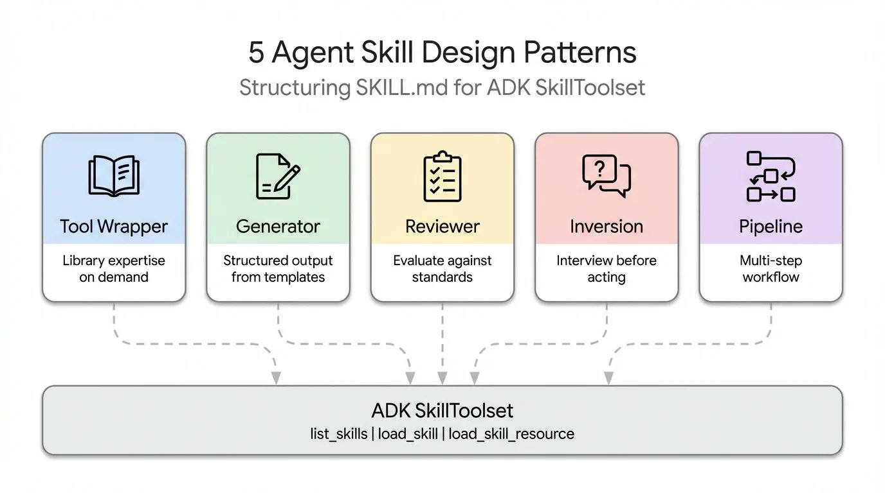
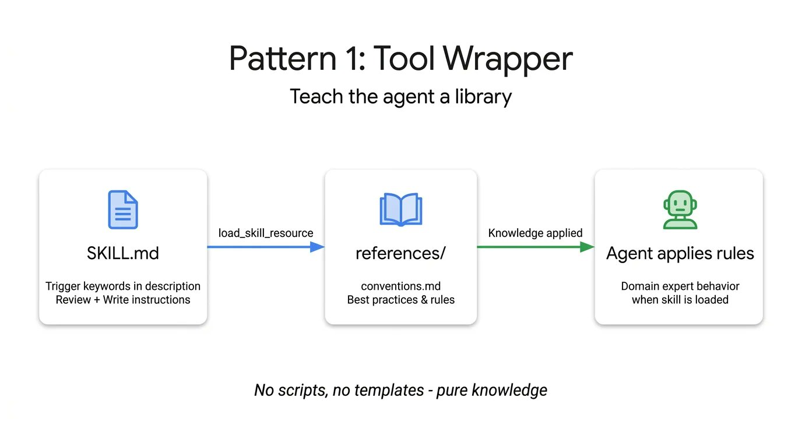
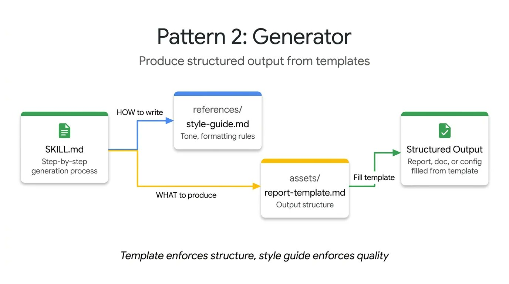
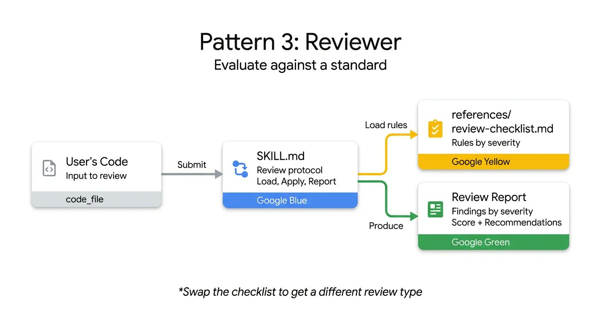
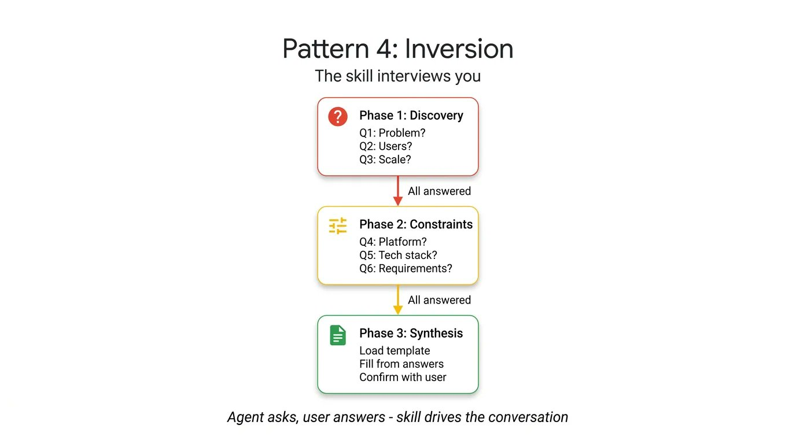
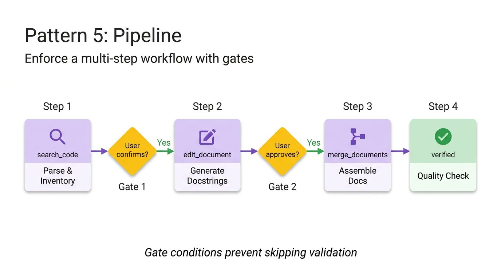
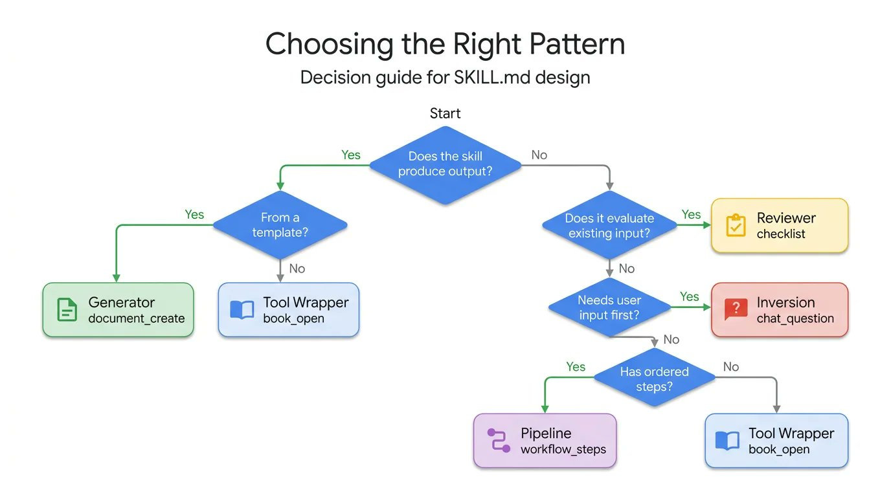

## 摘要（Summary）

本文由 Google Cloud Tech 發布，分析了超過 30 種 AI 代理人工具（Claude Code、Gemini CLI、Cursor 等）在 `SKILL.md` 格式上趨於一致後，真正的挑戰已不再是格式，而是**內容設計（content design）**。作者整理出 5 種跨生態系的代理人技能設計模式（Agent Skill Design Patterns），每種模式附有完整的 ADK 程式碼範例。


## 關鍵洞察（Key Insights）

- **格式問題已解決，內容設計才是挑戰** — 30+ 個代理人工具都採用相同的 `SKILL.md` 規格，格式的難題幾乎消失，但如何設計 skill 內部邏輯才是關鍵。參見 [[SKILL-MD-SPECIFICATION]]
- **5 種模式涵蓋絕大多數工作流程** — 工具包裝器（Tool Wrapper）、生成器（Generator）、審查器（Reviewer）、反轉模式（Inversion）、管線（Pipeline）可以互相組合
- **模式可以組合（patterns compose）** — Pipeline 可以在末尾加入 Reviewer 步驟自我檢查；Generator 可以先用 Inversion 收集變數
- **`references/` 和 `assets/` 目錄讓指令保持精簡** — 將知識外部化，只在需要時載入，保持上下文視窗（Context Window）乾淨

## 詳細內容（Details）

### 模式一：工具包裝器（Tool Wrapper）

> [!note] 定義：工具包裝器（Tool Wrapper）
> 給代理人按需提供特定函式庫的上下文。不是把 API 規範硬編碼進系統提示詞（system prompt），而是打包成一個 skill，只有在實際使用該技術時才載入。

用途：分發團隊內部編碼規範、特定框架最佳實踐。



```yaml
# skills/api-expert/SKILL.md
---
name: api-expert
description: FastAPI development best practices and conventions. Use when building, reviewing, or debugging FastAPI applications, REST APIs, or Pydantic models.
metadata:
  pattern: tool-wrapper
  domain: fastapi
---

You are an expert in FastAPI development. Apply these conventions to the user's code or question.

## Core Conventions

Load 'references/conventions.md' for the complete list of FastAPI best practices.

## When Reviewing Code
1. Load the conventions reference
2. Check the user's code against each convention
3. For each violation, cite the specific rule and suggest the fix

## When Writing Code
1. Load the conventions reference
2. Follow every convention exactly
3. Add type annotations to all function signatures
4. Use Annotated style for dependency injection
```

**關鍵設計**：指令告訴代理人「在開始審查或撰寫程式碼時載入 `conventions.md`」，而不是把所有規範直接寫在 SKILL.md 中。

---

### 模式二：生成器（Generator）

> [!note] 定義：生成器（Generator）
> 強制一致的輸出結構。`assets/` 放輸出模板，`references/` 放風格指南，指令扮演專案經理，協調填空流程。

用途：生成可預測的 API 文件、規範化 commit 訊息、搭建專案架構骨架。



```yaml
# skills/report-generator/SKILL.md
---
name: report-generator
description: Generates structured technical reports in Markdown. Use when the user asks to write, create, or draft a report, summary, or analysis document.
metadata:
  pattern: generator
  output-format: markdown
---

You are a technical report generator. Follow these steps exactly:

Step 1: Load 'references/style-guide.md' for tone and formatting rules.

Step 2: Load 'assets/report-template.md' for the required output structure.

Step 3: Ask the user for any missing information needed to fill the template:
- Topic or subject
- Key findings or data points
- Target audience (technical, executive, general)

Step 4: Fill the template following the style guide rules. Every section in the template must be present in the output.

Step 5: Return the completed report as a single Markdown document.
```

**關鍵設計**：SKILL.md 不包含實際模板或語法規則，只負責協調資源的取得與步驟執行順序。

---

### 模式三：審查器（Reviewer）

> [!note] 定義：審查器（Reviewer）
> 將「要檢查什麼」與「如何檢查」分離。將審查清單（rubric）存放在 `references/review-checklist.md`，代理人載入後按嚴重度（severity）分組回報發現。

用途：自動化 PR 審查、OWASP 安全稽核（只需換一份清單即可切換場景）。



```yaml
# skills/code-reviewer/SKILL.md
---
name: code-reviewer
description: Reviews Python code for quality, style, and common bugs. Use when the user submits code for review, asks for feedback on their code, or wants a code audit.
metadata:
  pattern: reviewer
  severity-levels: error,warning,info
---

You are a Python code reviewer. Follow this review protocol exactly:

Step 1: Load 'references/review-checklist.md' for the complete review criteria.

Step 2: Read the user's code carefully. Understand its purpose before critiquing.

Step 3: Apply each rule from the checklist to the code. For every violation found:
- Note the line number (or approximate location)
- Classify severity: error (must fix), warning (should fix), info (consider)
- Explain WHY it's a problem, not just WHAT is wrong
- Suggest a specific fix with corrected code

Step 4: Produce a structured review with these sections:
- **Summary**: What the code does, overall quality assessment
- **Findings**: Grouped by severity (errors first, then warnings, then info)
- **Score**: Rate 1-10 with brief justification
- **Top 3 Recommendations**: The most impactful improvements
```

嚴重度分三級：
- `error`：必須修復
- `warning`：應該修復
- `info`：建議考慮

**關鍵設計**：把 Python 風格清單換成 OWASP 安全清單，就能得到完全不同的專業稽核，基礎設施完全相同。

---

### 模式四：反轉模式（Inversion）

> [!note] 定義：反轉模式（Inversion）
> 翻轉代理人「立即猜測並生成」的本能。代理人扮演面試官，先依序提問、等待回答，收集完整需求後才輸出結果。

用途：專案規劃、需求收集、任何「先問後做」的場景。



```yaml
# skills/project-planner/SKILL.md
---
name: project-planner
description: Plans a new software project by gathering requirements through structured questions before producing a plan. Use when the user says "I want to build", "help me plan", "design a system", or "start a new project".
metadata:
  pattern: inversion
  interaction: multi-turn
---

You are conducting a structured requirements interview. DO NOT start building or designing until all phases are complete.

## Phase 1 — Problem Discovery (ask one question at a time, wait for each answer)

Ask these questions in order. Do not skip any.

- Q1: "What problem does this project solve for its users?"
- Q2: "Who are the primary users? What is their technical level?"
- Q3: "What is the expected scale? (users per day, data volume, request rate)"

## Phase 2 — Technical Constraints (only after Phase 1 is fully answered)

- Q4: "What deployment environment will you use?"
- Q5: "Do you have any technology stack requirements or preferences?"
- Q6: "What are the non-negotiable requirements? (latency, uptime, compliance, budget)"

## Phase 3 — Synthesis (only after all questions are answered)

1. Load 'assets/plan-template.md' for the output format
2. Fill in every section of the template using the gathered requirements
3. Present the completed plan to the user
4. Ask: "Does this plan accurately capture your requirements? What would you change?"
5. Iterate on feedback until the user confirms
```

> [!important] 反轉模式的關鍵
> 嚴格的分階段設計與明確的閘道條件（gatekeeping prompt）是核心。`DO NOT start building until all phases are complete` 這類非商量語氣的指令，是強制代理人先收集上下文的唯一可靠方法。

---

### 模式五：管線（Pipeline）

> [!note] 定義：管線（Pipeline）
> 強制執行嚴格的順序工作流程，設有硬性檢查點（hard checkpoints）。指令本身就是工作流程的定義。

用途：複雜任務、不允許跳步或忽略指令的場景，例如：文件生成管線、多步驟程式碼處理。



```yaml
# skills/doc-pipeline/SKILL.md
---
name: doc-pipeline
description: Generates API documentation from Python source code through a multi-step pipeline. Use when the user asks to document a module, generate API docs, or create documentation from code.
metadata:
  pattern: pipeline
  steps: "4"
---

You are running a documentation generation pipeline. Execute each step in order. Do NOT skip steps or proceed if a step fails.

## Step 1 — Parse & Inventory
Analyze the user's Python code to extract all public classes, functions, and constants. Present the inventory as a checklist. Ask: "Is this the complete public API you want documented?"

## Step 2 — Generate Docstrings
For each function lacking a docstring:
- Load 'references/docstring-style.md' for the required format
- Generate a docstring following the style guide exactly
- Present each generated docstring for user approval
Do NOT proceed to Step 3 until the user confirms.

## Step 3 — Assemble Documentation
Load 'assets/api-doc-template.md' for the output structure. Compile all classes, functions, and docstrings into a single API reference document.

## Step 4 — Quality Check
Review against 'references/quality-checklist.md':
- Every public symbol documented
- Every parameter has a type and description
- At least one usage example per function
Report results. Fix issues before presenting the final document.
```

**關鍵設計**：每個步驟只在需要時才載入對應的 `references/` 或 `assets/` 檔案，保持上下文視窗（Context Window）乾淨，避免無關資訊干擾。

---

### 如何選擇模式：決策樹



| 問題 | 適合模式 |
|------|---------|
| 需要在特定函式庫上下文中工作？ | Tool Wrapper |
| 需要每次都生成一致格式的文件？ | Generator |
| 需要對程式碼或文件進行結構化審查？ | Reviewer |
| 需要先從使用者收集需求才能行動？ | Inversion |
| 有複雜的多步驟工作流程，不允許跳步？ | Pipeline |

---

### 模式可以組合（Patterns Compose）



> [!tip] 組合範例
> - **Pipeline + Reviewer**：管線的最後一步加入 Reviewer，讓代理人自我雙重確認
> - **Generator + Inversion**：生成器開始時先用 Inversion 收集必要的變數
> - **Tool Wrapper + Reviewer**：以函式庫規範作為審查清單

ADK 的 `SkillToolset` 和漸進式揭露（progressive disclosure）機制，讓代理人只在需要時才使用對應模式的上下文 token，不會浪費上下文視窗。

## 我的心得（My Takeaways）

這篇文章解決了我在寫 `SKILL.md` 時常遇到的「寫完了但 AI 行為還是不穩定」的問題。根本原因是我把不同性質的工作流程混在同一個未分類的指令裡。

現在有了這 5 個具名模式，在設計新 skill 時可以先問：「這是哪種模式？」— 然後套用對應的結構。

對於目前在用的 [[AGENT-SKILL-PATTERNS]]，最有啟發的是「模式四：反轉（Inversion）」，強制先問問題的機制可以大幅減少代理人「想當然爾」的錯誤輸出。`DO NOT start building until all phases are complete` 這個指令模式值得在複雜 skill 中廣泛應用。

## 相關連結（Related）

- [[AGENT-SKILL-PATTERNS]] — 代理人技能設計模式總覽與比較
- [[ADK-AGENT-DEVELOPMENT-KIT]] — Google Agent Development Kit 入門與架構
- [[SKILL-MD-SPECIFICATION]] — SKILL.md 格式規格，30+ 工具共同採用的標準
- [[CLAUDE-CODE-SKILLS]] — Claude Code 中 skill 的實際應用案例

## References

- [原文](https://x.com/GoogleCloudTech/article/2033953579824758855)
