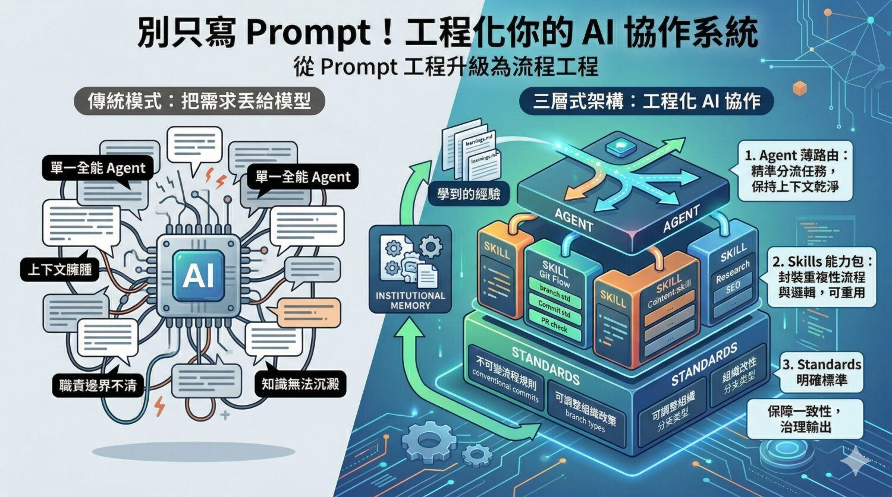

## 摘要（Summary）

本文提出一個從「提示工程（Prompt Engineering）」升級到「流程工程（Process Engineering）」的 AI 協作系統設計思維，透過 **Agents / Skills / Standards 三層式架構（Three-layer Architecture）**，加上「制度化記憶（Institutional Memory）」，把散落在個別對話中的 AI 使用方式，轉化為組織可治理、可複用、可持續演進的工作基礎設施。

## 關鍵洞察（Key Insights）

- **薄路由、厚能力（Thin Router, Thick Skill）**：Agent 應該是「路由器（Router）」而非萬能專家，負責分流判斷；真正的專業邏輯應封裝在 Skill。這解決上下文污染（Context Pollution）問題 — 參見 [[CLAUDE-SKILL-SYSTEM]]
- **Skill 是自包含的能力包**：不只是 prompt 片段，而是把流程、標準引用、輸入輸出邊界整理成可重複使用的能力單元。
- **Standards 要分兩層**：不可變的「流程規則（Process Rules）」 vs. 可調整的「組織政策（Organizational Policy）」，這是兼顧一致性與可移植性（Portability）的關鍵。
- **制度化記憶（Institutional Memory）**：`learnings.md` 與 `future-enhancement-ideas.md` 讓系統能從每次使用中沉澱經驗，而不是把教訓留在聊天紀錄裡。
- **真正的競爭力不是模型**：未來比的是誰能更早把工作知識封裝成穩定模組。

## 詳細內容（Details）

### 問題意識：把需求丟給模型並不是成熟做法

很多人使用 AI 仍停留在「丟需求期待模型一次懂完」的模式。進入持續協作後會出現三個問題：

1. **上下文越來越臃腫**：每次都要重新載入大量規範、角色設定。
2. **職責邊界不清**：同一個 agent 同時是判斷者、執行者、檢查者。
3. **知識無法沉澱**：教訓留在聊天紀錄裡，下次又得從頭來過。

> [!important] 核心問題意識
> 真正成熟的問題不是「怎麼寫更厲害的 prompt」，而是「怎麼把工作方法拆成可維護的結構」。

### 三層式架構（Three-layer Architecture）

#### 第一層：Agent — 路由器而非萬能專家

Agent 的角色很薄但關鍵。它不是自己做完所有事，而是判斷任務屬於哪個領域，交給合適的能力模組。

> [!warning] 全能型 Agent 的陷阱
> 打造「什麼都懂、什麼都會」的總代理通常最難維護。它載入太多、職責太雜，最後上下文爆炸，品質反而不穩。

#### 第二層：Skill — 自包含的能力包

Skill 不只是 prompt 片段，而是把一類工作的操作流程、標準引用、執行邏輯整理在一起。以 git workflow 為例，一個 skill 會處理：

- branch 是否符合命名規則
- 是否與 issue 有對應關係
- commit 是否符合 conventional commits
- PR 標題與描述是否合規
- AI 參與是否需要被追蹤與標示

> [!tip] Skill 的真正價值
> 不是叫模型「多懂一點」，而是讓組織把重複性高、可制度化的工作，封裝成可攜帶的能力。

#### 第三層：Standards — 一致性的保險絲

AI 最大的風險不是做不到，而是每次做法都不一樣。Standards 把散落在人腦中的規範**顯性化（explicit）**，並進一步分成兩類：

**不可變的流程規則（Immutable Process Rules）**：
- 所有工作都必須能追溯到 issue
- 所有 commit 都必須符合 conventional commits
- 所有 PR 都必須與 issue 建立連結
- commit 變更應保持 atomic

**可調整的組織政策（Mutable Organizational Policy）**：
- 允許哪些 branch type
- commit 可接受哪些 type
- PR 標題描述格式
- AI 貢獻要不要加 trailer
- 哪類 PR 至少要幾位 reviewer

> [!note] 產品思維（Product Thinking）
> 系統提供穩定方法，組織決定本地政策 — 這是讓 AI 協作系統真正可移植的關鍵。

### 為什麼這種設計比超長總 Prompt 更實用

| 痛點 | 傳統做法 | 三層式架構解法 |
|------|---------|--------------|
| 上下文污染（Context Pollution） | 所有知識塞在同一段 prompt | Agent 只載入相關 skill |
| 能力維護 | 改一處要動全盤 | 只改對應 skill 或 policy |
| 跨專案可攜性 | 每個專案重寫 prompt | 複製 `agent-system/` 即可 |
| 治理（Governance） | 輸出難 review | 標準化流程可審查、可驗證 |

### 制度化記憶（Institutional Memory）

除了三層式架構，再加一層「可持續演進」的設計：

- `project/learnings.md` — 記錄工作中的觀察、問題
- `future-enhancement-ideas.md` — 改進方向 backlog

> [!important] 三個意義
> 1. **讓知識脫離聊天紀錄** — 從對話裡救出來
> 2. **讓改進變成顯性流程** — 沒被記錄的改進通常不會發生
> 3. **讓 AI 協作從一次性走向長期運營**

### 哪些團隊最適合這種設計？

- **工程團隊**：branch、commit、PR、ADR、review 檢查流程
- **內容與知識團隊**：選題、研究、改寫、SEO、發佈前檢查
- **顧問、營運、內部支援團隊**：分析框架、紀錄格式、提案結構

### 落地策略：先做對，不是先做大

> [!tip] 克制的落地方式
> 不要一開始就做十個 agent、二十個 skills。先挑 1–2 個高頻、可標準化、最容易出錯的流程：git workflow、PR 檢查、決策紀錄整理、研究摘要、上稿前檢核。

只做三件事：
1. 把路由（router）和能力（capability）拆開
2. 把不可變流程與可調整政策拆開
3. 把工作中學到的經驗記錄下來

## 我的心得（My Takeaways）

1. **可以立即套用到 Claude Code 專案**：`.claude/skills/` 目錄天然符合這個架構，每個 skill 就是一個能力包。應該檢視目前的 skills 是否有做好「不可變 vs. 可調整」的分層。
2. **Standards 分層是最容易被忽略的**：過去把所有規範塞在 CLAUDE.md，現在應該考慮拆成 `process-rules.md`（不可變）與 `org-policy.md`（可調整）。
3. **learnings.md 已在做、但不夠結構化**：目前的 memory 系統其實就是 institutional memory 的雛形，可以參考本文把它進一步分成「回顧（learnings）」與「改進 backlog（enhancements）」兩類。

---

## 知識層次分析（Bloom's Taxonomy Analysis）

> 以下從五個認知層次對本篇內容進行結構化分析。

| 認知層次 | 核心目的 | 對本文的具體應用 |
|---------|---------|--------------|
| **記憶（被動）** | 確立基礎知識 | 核心術語：Agent（路由器）、Skill（能力包）、Standards（流程規則 + 組織政策）、Institutional Memory、Thin Router Thick Skill、薄路由厚能力 |
| **理解（半被動）** | 掌握核心邏輯 | 作者論證：超長 prompt → 問題（污染/混亂/失憶）→ 三層拆解 → 加上制度化記憶 → 從工具升級為組織能力。Agent 是分流、Skill 是執行、Standards 是規範、Learnings 是演進 |
| **分析（主動）** | 檢驗論點與假設 | 關鍵假設：(1) 任務可清楚切分到某個 skill — 真實場景常跨領域；(2) Standards 分層在小團隊可能過度設計；(3) 作者未給出 skill 之間依賴管理的具體機制，這是後續真正困難的點 |
| **應用（主動）** | 轉為行動 | (1) 檢視現有 `.claude/skills/` 哪些 skill 混雜了流程規則與組織政策，拆開它們；(2) 在個人知識庫建立 `learnings.md` 追蹤踩坑記錄；(3) 把 CLAUDE.md 中「不可改」與「可客製」的規則明確標記出來 |
| **評估（主動）** | 權衡取捨 | **本方案優點**：治理性強、可複用；**缺點**：初期設定成本高，對個人或 <5 人小團隊可能過度工程化（over-engineering）。**替代方案**：小團隊可只維護單一 CLAUDE.md + 好的 commit 習慣即可，不需完整三層。採用門檻：團隊 ≥3 人且有跨專案複用需求 |

### 分析型追問（Socratic Follow-up）

- **澄清**：「Skill 自包含」的邊界到底在哪？一個 skill 可以依賴另一個 skill 嗎？若可以，依賴循環怎麼辦？
- **假設**：本文假設「流程規則」與「組織政策」能清楚二分，但實務上灰色地帶很大（如：PR 必須要 reviewer 是流程還是政策？）。若分不清，架構還成立嗎？
- **證據**：作者主張「薄路由比厚 agent 穩定」，但沒提供實際 benchmark 或案例數據。有哪些公開的 agent 系統可驗證這個主張？
- **觀點**：從「反對模組化」立場，最有力的批評是：對於未知或新型任務，預先切好的 skill 反而限制模型的創造性組合能力。
- **後果**：若依本文建議執行 12 個月後，可能出現的副作用是 skill 數量爆炸、彼此衝突，反而需要「meta-skill」來管理 skills，複雜度螺旋上升。

### 方案批判三問（Critical Evaluation）

1. **最大的風險是什麼？** — 過度工程化。對於個人或小團隊，花大量時間設計三層架構，結果 skill 用不到幾次，維護成本超過收益。真實損失是**機會成本** — 這段時間本可用來做實際工作。
2. **什麼情況下會失敗？** — (a) 團隊 <3 人且無跨專案複用需求；(b) 任務本質是探索性而非重複性；(c) 沒有人負責維護 Standards 文件，導致規則過時；(d) skill 粒度切得太細或太粗，都會讓路由失準。
3. **有沒有更好的替代方案？** — **替代方案 A**：單一 CLAUDE.md + 好的 git 習慣（適合小團隊）；**替代方案 B**：只做 Skills 層不做 Agent 路由（讓人類決定用哪個 skill，適合中型團隊）；**替代方案 C**：完全不封裝，依賴長期上下文與 memory 系統（適合探索型工作）。何時選本方案：≥3 人團隊 + 高重複性工作 + 有跨專案複用需求。

## 相關連結（Related）

- [[2026-04-02-HARNESS-ENGINEERING-COMPLETE-GUIDE]] — Harness Engineering 也是從 prompt 工程升級到流程工程的同類思路
- [[2026-03-25-THREE-AI-CODING-FRAMEWORKS-SUPERPOWERS-GSD-GSTACK]] — 各框架對 skill/agent 分層的不同取法
- [[CLAUDE-SKILL-SYSTEM]] — Claude Code 的 skill 系統正是此架構的實作範例

## References

- [原文：別只寫 Prompt！先工程化你的 AI 協作系統](https://www.soft4fun.net/tech/ai/ai-workflow-agents-skills-standards.htm)
