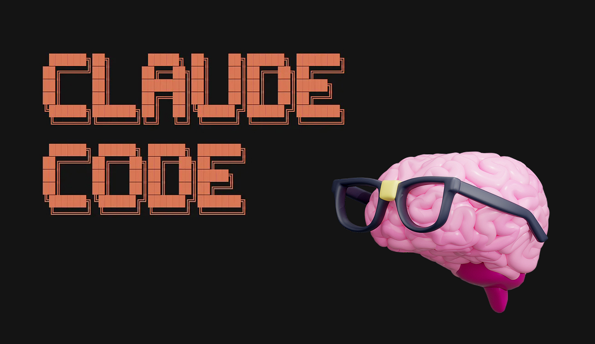

## 摘要（Summary）

Nick Babich 從產品設計師的角度，提出撰寫高效 Claude Code Skill 的七條規則，並以一個「UX Research Analyzer Skill」作為完整範例。核心觀點是：Skill 應該被視為一個「迷你程式」（mini-program）而非一堆指令的集合，需要有明確的角色定位（Role Framing）、結構化工作流程（Structured Workflow）、清晰的輸入/輸出格式、決策規則（Decision Rules）、領域知識（Domain Knowledge）和負面指令（Negative Instructions）。這七條規則從 Skill 的聚焦性到防禦性設計形成了完整的方法論閉環。



## 關鍵洞察（Key Insights）

1. **一個 Skill 一個職責（One Skill, One Job）** — 不要建構「巨型 Skill」（mega-skills），因為它們的準確度（accuracy）和可組合性（composability）都較低。好的 Skill 應該像 `UX Auditor`、`Microcopy Writer` 這樣高度聚焦。

2. **Skill 是迷你程式，不是指令集** — 人在理解完整工作流程（workflow）時表現更好，AI 也是。與其寫「分析 UX 並提出改善建議」，不如提供完整的步驟序列。這與 [[2026-04-15-CLAUDE-MD-BEST-PRACTICES-EXPERT-GUIDE-SKILLS-VS-CLAUDEMD|CLAUDE.md 最佳實踐]] 中的「結構化指令」理念一致。

3. **負面指令（Negative Instructions）是關鍵差異化** — 大多數人只寫「該做什麼」，忽略了「不該做什麼」。明確告訴 Claude 不要做的事能大幅提升信噪比（signal-to-noise ratio）。

4. **決策規則填補模糊地帶** — Claude 在遇到不確定情況時會自己做假設，這些假設可能不正確。透過決策規則（Decision Rules）明確指定在特定情境下的行為，能避免 AI「自作聰明」。

5. **領域知識必須顯式編碼** — Claude 會利用專案中的所有可用資料（原始碼、README 等）建構上下文（context），但如果缺少特定資訊，它會用假設填補。設計系統（Design System）約束、產品限制和商業邏輯是三個最需要顯式提供的領域。

## 詳細內容（Details）

### 規則一：保持 Skill 聚焦（Keep Skills Focused）

> [!important] 核心原則
> 一個 Skill 只做一件事。巨型 Skill 的準確度和可組合性都較低。

好的聚焦 Skill 範例：
- UX Auditor Skill
- Microcopy Writer Skill
- Component Spec Generator（針對特定設計系統）

### 規則二：使用角色框架（Use Role Framing）

用一到兩句話描述 Claude 在使用此 Skill 時扮演的角色。避免模糊的角色如「資深產品通才」（seasoned product generalist），改為與任務匹配的具體角色。

```markdown
# Role
You are a UX auditor focused on usability, accessibility, and conversion optimization.
```

### 規則三：將 Skill 視為迷你程式（Treat a Skill as a "Mini-Program"）

> [!tip] Token 效率建議
> 保持句子簡短精煉，使用項目符號（bullet points）而非段落（paragraphs），這讓 AI 和人類都更容易掃描內容。

避免：「分析 UX 並提出改善建議」

改為提供完整的工作流程：

```markdown
# What you need to do
- Identify usability issues (navigation, hierarchy, feedback)
- Map each issue to a UX principle violation
- Propose a concrete fix with UI-level changes
- Prioritize fixes by impact (High/Medium/Low)
```

### 規則四：定義清晰的輸入信號與輸出格式（Define Clear Input Signal & Output Format）

明確指定 Claude 預期接收的輸入資料和輸出格式。這讓輸出具有可預測性（predictable）、可掃描性（scannable），更重要的是可重用性（reusable）。

```markdown
# I will provide the following data about the project
- Project specification (text file)
- User flow (Figma file)

# You should provide the following information in output
1. Issues found
2. UX principle violated
3. Suggested fix
4. Priority (H/M/L)
```

> [!tip] 範例學習
> Claude 從範例中學習的效果非常強。加入 `# Example input` 和 `# Example output` 區塊是好做法。

### 規則五：加入決策規則（Add Decision Rules）

Claude AI 模型很聰明，在沒有明確指導時通常能找到解決方案，但它選擇的方式可能不完全是你想要的。告訴 Claude **如何在特定情境下思考**，而不只是告訴它做什麼。

```markdown
# Key rules to follow when providing UX/UI recommendations
- Do not suggest redesign if a minor fix works
- Flag accessibility issues as high priority
```

### 規則六：顯式編碼領域知識（Encode Domain Knowledge Explicitly）

> [!warning] 常見陷阱
> 不要假設 Claude 了解你的系統。如果缺少具體細節，它會用假設填補知識缺口，這些假設可能不正確。

三個必須顯式提供的關鍵領域：
1. **設計系統約束**（Design System constraints）
2. **產品約束**（Product constraints — 使用者與市場）
3. **商業邏輯決策**（Business logic decisions — KPIs）

```markdown
# Design system rules we use in layout design
- Buttons use 8px spacing
- Primary color = #0055FF
- Border radius = 12px
```

### 規則七：包含負面指令（Include Negative Instructions）

> [!important] 被忽視的高價值規則
> 大多數人在撰寫 Skill 時只關注「該做什麼」，完全忘記「不該做什麼」。填補這個空白能大幅提升信噪比。

```markdown
# Don't do this when doing audit
- Provide advices not supported with research findings
- Repeat the input
```

### 完整範例：UX Research Analyzer Skill

以下是作者依據七條規則撰寫的完整 Skill，展示了所有規則的整合應用：

```markdown
# UX Research Analyzer Skill

## Role
You are a UX research analyst focused on usability, behavioral
patterns, and actionable product insights.

---

## Goal
Analyze product inputs and generate structured UX
insights that can directly inform design decisions.

---

## Input
I will provide:
* Product description or specification
* User flows or screens (text or Figma export)
* Optional: user feedback, reviews, or research notes

---

## Workflow
Follow this exact sequence:
1. Identify key user goals
2. Map primary user flows
3. Detect friction points (navigation, cognitive load, unclear feedback)
4. Cluster issues into themes
5. Link issues to UX principles (e.g., visibility, consistency, feedback)
6. Propose specific UI/UX improvements
7. Prioritize insights by impact

---

## Output Format
Provide output in this structure:

### 1. Key User Goals
* Bullet list of inferred user intentions

### 2. Flow Breakdown
* Step-by-step summary of main user journeys

### 3. Issues Identified
| Issue | UX Principle Violated | Suggested Fix | Priority |
| ----- | --------------------- | ------------- | -------- |

### 4. Patterns & Themes
* Recurring usability problems
* Behavioral observations

### 5. Recommendations
* Clear, actionable UI-level improvements

---

## Decision Rules
* Focus on high-impact usability issues first
* Prioritize issues that block task completion
* Mark accessibility issues as High priority
* Prefer simple fixes over redesign
* If data is incomplete → make explicit assumptions

---

## Domain Knowledge

### Design System
* Use consistent spacing and hierarchy
* Avoid introducing new UI patterns unnecessarily

### Product Thinking
* Optimize for clarity and speed
* Reduce cognitive load in key flows

### Business Context
* Prioritize flows tied to conversion or retention

---

## Negative Instructions
Do NOT:
* Suggest changes without clear reasoning
* Provide generic advice (e.g., "improve UX")
* Repeat input content
* Over-engineer solutions
* Recommend full redesign unless critical

---

## Example

### Input (simplified)
Signup flow with 5 steps and unclear progress indicator.

### Output (excerpt)
| Issue | UX Principle Violated | Suggested Fix | Priority |
| --------------------- | --------------------------- | -------------------------------- | -------- |
| No progress indicator | Visibility of system status | Add step indicator (Step 2 of 5) | High |

---

## Notes
* Keep responses concise and structured
* Use bullet points, not paragraphs
* Optimize for clarity and reuse in design workflows
```

## 我的心得（My Takeaways）

1. **七條規則形成了 Skill 設計的完整框架**。從「聚焦」（做什麼）到「負面指令」（不做什麼），從「角色」（誰）到「決策規則」（如何判斷），覆蓋了 Skill 設計的所有維度。這個框架不只適用於 UX 領域，可以直接套用到任何 Skill。

2. **「Skill 是迷你程式」是最有洞察力的觀點**。這與我在 [[2026-04-17-CLAUDE-CODE-SKILL-COMPLETE-GUIDE-LOADING-COMPACTION-WRITING-TIPS]] 中研究的原始碼行為一致——Skill 在載入後會作為 system prompt 的一部分注入，結構化的工作流比模糊的指令更能引導模型的推理路徑。

3. **負面指令的價值被低估了**。從原始碼研究的角度看，Claude Code 的 system prompt 本身就包含大量負面指令（如「不要建立不必要的文件」、「不要添加額外的功能」）。使用者的 Skill 應該延續這個模式。

4. **決策規則填補了「Skill 與 CLAUDE.md」之間的空白**。CLAUDE.md 提供全域的行為準則，但 Skill 的決策規則能在特定任務的語境中提供更精準的判斷依據。這兩者是互補的，不是替代的。

5. **輸入/輸出格式化是可重用性的基礎**。當輸出格式明確定義為表格或結構化列表時，結果可以直接融入設計管線（design pipeline），而不需要人工重新格式化。

## 待補充（Open Questions）

1. **Token 預算的具體影響**：這七條規則加在一起，一個完整的 Skill 大約會消耗多少 Token？是否有「規則數量 vs Token 效率」的最佳平衡點？（建議搜尋：`claude code skill token budget measurement`）

2. **規則之間的優先級**：如果 Token 預算有限，應該優先保留哪些規則？作者沒有給出優先級排序。從原始碼研究看，Skill 有 5K/25K 的壓縮保留門檻，超過可能被截斷。（建議搜尋：`skill compaction token threshold`）

3. **Decision Rules 與 CLAUDE.md Rules 的衝突處理**：如果 Skill 的決策規則與 CLAUDE.md 的全域規則衝突，Claude 會優先遵從哪一個？（建議搜尋：`claude code skill vs claudemd rule priority`）

4. **範例數量的邊際效益**：作者建議加入範例，但沒有說明幾個範例是最佳的。太多範例會消耗 Token，太少可能不夠。是否有研究或實驗數據？（建議搜尋：`few-shot examples optimal count llm`）

5. **負面指令的表達方式**：「Don't」vs「Avoid」vs「Never」在 LLM 中是否有不同的遵從率？作者統一使用 `Do NOT`，但不同強度的否定是否有差異？（建議搜尋：`llm negative instruction compliance phrasing`）

6. **Role Framing 的實際效果**：Anthropic 官方文件是否有關於 Role Framing 對 Claude 行為影響的具體數據？在 system prompt 中加入角色描述 vs 不加，輸出品質差異有多大？（建議搜尋：`anthropic role framing system prompt impact`）

## 相關連結（Related）

- [[2026-04-16-CLAUDE-CODE-SKILLS-VS-COMMANDS-VS-SUBAGENTS-COMPLETE-COMPARISON]] — Skills/Commands/Subagents 完整比較，本文的七條規則可作為 Skill 撰寫的具體指南
- [[2026-04-15-CLAUDE-MD-BEST-PRACTICES-EXPERT-GUIDE-SKILLS-VS-CLAUDEMD]] — CLAUDE.md 最佳實踐中的「少即是多」原則與本文的「聚焦」規則互補
- [[2026-04-17-CLAUDE-CODE-SKILL-COMPLETE-GUIDE-LOADING-COMPACTION-WRITING-TIPS]] — Skill 載入/壓縮機制的原始碼研究，驗證本文「Token 效率」建議的技術基礎
- [[2026-03-07-CLAUDE-SKILLS-2.0-THE-SELF-IMPROVING-AI-CAPABILITIES-THAT-ACTUALLY-WORK]] — Skill 2.0 的自我改進機制，可與本文的靜態 Skill 設計方法對比
- [[2026-04-25-CLAUDE-SKILLS-PLAYBOOK-DESCRIPTION-SUBAGENT-DEBUG-PROMPTS]] — Gary Chen 的 Skill 實戰手冊，與本文的規則導向方法形成互補
- [[2026-03-23-GRILL-ME-SKILL-DEEP-DIVE]] — grill-me 用 4 句話印證「短而精」是 effective skill 的關鍵

---

## 知識層次分析（Bloom's Taxonomy Analysis）

> 以下從五個認知層次對本篇內容進行結構化分析，協助從記憶到評估逐層深化理解。

| 認知層次 | 核心目的 | 對本文的具體應用 |
|---------|---------|--------------|
| **記憶（被動）** | 確認資訊存在，確立基礎知識 | 七條規則：聚焦（Focused）、角色框架（Role Framing）、迷你程式（Mini-Program）、輸入/輸出格式（I/O Format）、決策規則（Decision Rules）、領域知識（Domain Knowledge）、負面指令（Negative Instructions） |
| **理解（半被動）** | 解釋概念的含義及關聯 | 七條規則形成一個設計閉環：規則 1 定義「做什麼」的邊界，規則 2-3 定義「誰」和「怎麼做」，規則 4 定義「輸入什麼/輸出什麼」，規則 5-6 處理「不確定時怎麼辦」，規則 7 劃定「不做什麼」的底線。核心邏輯是：結構化指令 > 模糊描述，顯式規則 > 隱式假設 |
| **分析（主動）** | 檢驗論點、找出假設 | 作者的核心假設是「Skill 的品質主要取決於撰寫方式」，但忽略了 Claude Code 的 Skill 載入機制（如 description 觸發、Token 預算、壓縮行為）對 Skill 效果的影響。規則 6「顯式編碼領域知識」可能與 CLAUDE.md 中的專案規則產生重複或衝突。此外，文章來自 UX 設計師視角，對程式開發類 Skill 的適用性未經驗證 |
| **應用（主動）** | 將知識套用情境，規劃行動 | 1. 用七條規則作為 checklist 審視現有的自訂 Skill（如 kb-create），檢查是否有缺少的維度。2. 在下次撰寫新 Skill 時，先用「角色 → 工作流 → I/O → 決策規則 → 負面指令」的順序起草。3. 對比 Gary Chen 的 Skill Playbook 和本文的規則，建立一個合併版的 Skill 撰寫範本 |
| **評估（主動）** | 判斷優劣，進行權衡 | 本文的優點是規則清晰、範例完整、從設計師角度切入提供了獨特視角。缺點是：(1) 沒有量化數據支持規則的效果（如加入負面指令前後的品質差異）；(2) 沒有考慮 Token 效率的具體影響——一個包含所有七個區塊的 Skill 可能佔用過多 Token；(3) 與 Anthropic 官方的 Skill 文件中的 description engineering（觸發描述工程）這個關鍵維度完全脫節。相比之下，Gary Chen 的 Playbook 更注重實測數據和 Subagent 架構 |

### 分析型追問（Socratic Follow-up）

- **澄清**：「Decision Rules」與「Negative Instructions」的界線在哪？「不要建議重新設計，除非小修復無效」到底屬於決策規則還是負面指令？
- **假設**：本文假設 Claude 會嚴格遵循 Skill 中的所有指令。但當 Skill 內容與 system prompt 的內建指令衝突時（如 Claude 內建的「不要過度設計」已覆蓋規則 7），是否會產生冗餘或干擾？
- **證據**：作者聲稱「mega-skills have lower accuracy and composability」，但未提供實驗數據。是否有 A/B 測試驗證聚焦 Skill vs 巨型 Skill 的品質差異？
- **觀點**：反對者可能認為：過度結構化的 Skill 會限制 Claude 的創造力和靈活性，特別是在探索性任務中。有時「分析 UX 並提出改善建議」反而能讓模型發揮更好。
- **後果**：如果團隊為每個任務都建立高度結構化的 Skill，12 個月後可能出現 Skill 膨脹（skill sprawl）問題——數十個 Skill 難以維護、版本管理困難、新成員入門成本增加。

### 方案批判三問（Critical Evaluation）

1. **最大的風險是什麼？** — 過度結構化可能導致 Skill 變得僵化。當專案需求快速變化時，嚴格定義的工作流和輸出格式可能成為瓶頸，需要頻繁修改 Skill 而不是讓 Claude 自適應。最壞情況是團隊花更多時間維護 Skill 而非實際工作。
2. **什麼情況下會失敗？** — (1) 任務高度探索性、無法預先定義工作流時；(2) 領域知識快速變化、Skill 中的硬編碼規則很快過時時；(3) Token 預算緊張、七個區塊加起來超過壓縮門檻被截斷時。
3. **有沒有更好的替代方案？** — 對於穩定、重複的任務（如 UX 審計），本文的七規則方法論非常適合。但對於探索性任務，更好的替代方案是「最小 Skill + CLAUDE.md 全域規則」的組合——Skill 只定義角色和輸出格式，其餘由 CLAUDE.md 提供。另外，Anthropic 的 Skills 2.0（自我改進 Skill）可能是更長期的解決方案。

## References

- [原文](https://uxplanet.org/7-rules-for-creating-an-effective-claude-code-skill-2d81f61fc7cd)
- [Nick Babich — Claude Code: Practical Guide for Product Designers](https://babich.gumroad.com)
- [Claude Code Skills 官方文件](https://docs.anthropic.com/en/docs/claude-code/skills)

- [[2026-05-09-STOP-RANDOM-SKILL-4-CORE-GROUPS-FOR-AGENT-PRODUCTIVITY]] — 本文推薦的 Skill Creator 與 Skill 設計七規則互補