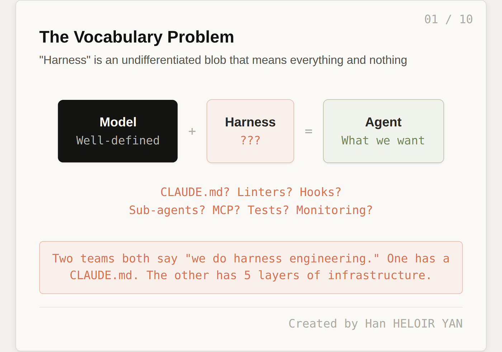
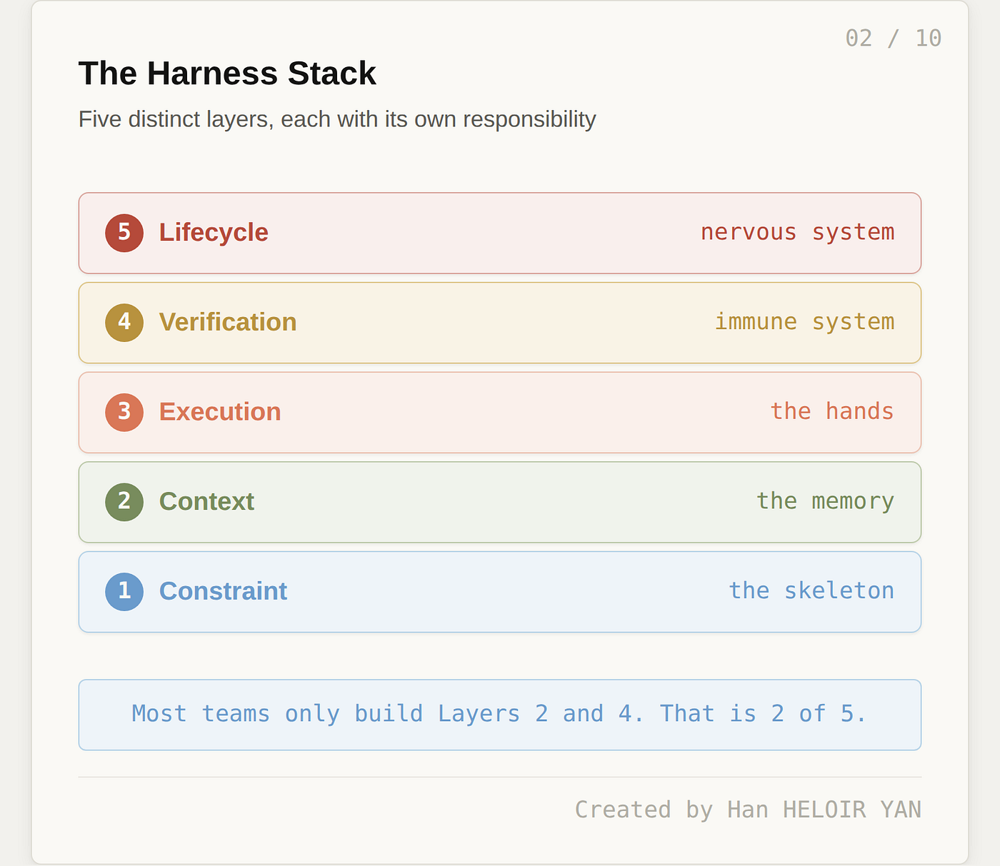
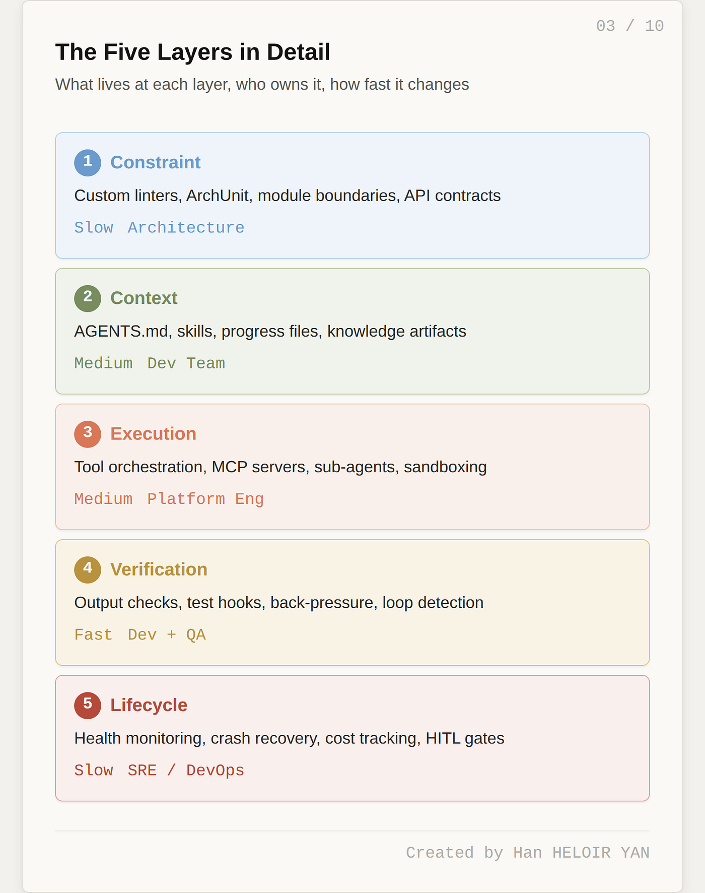
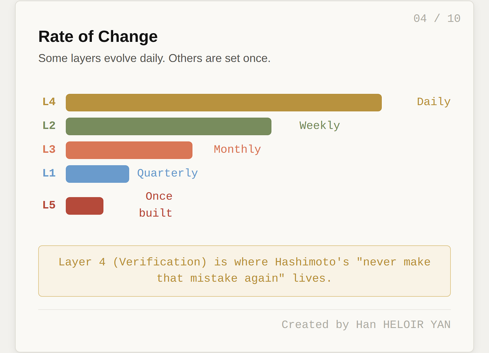
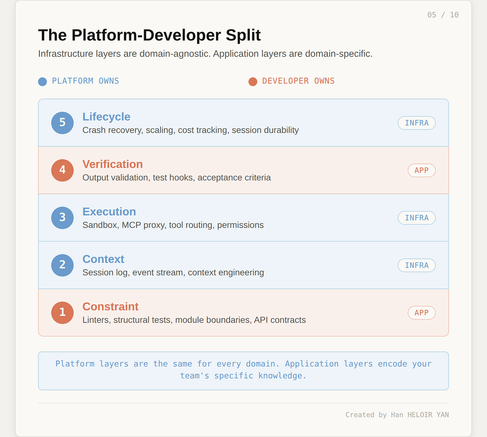
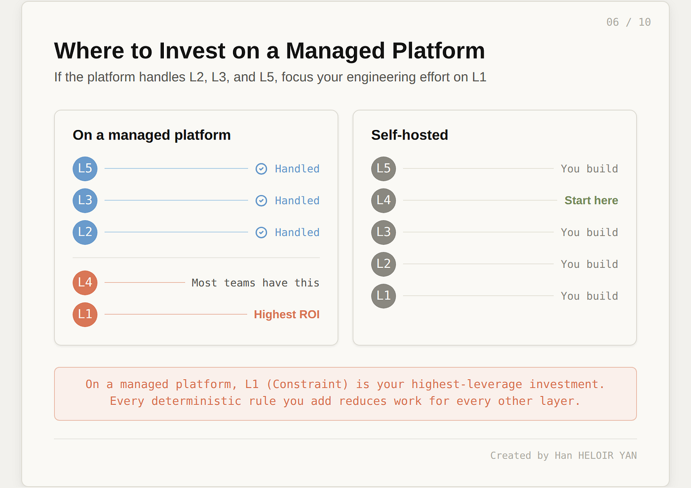
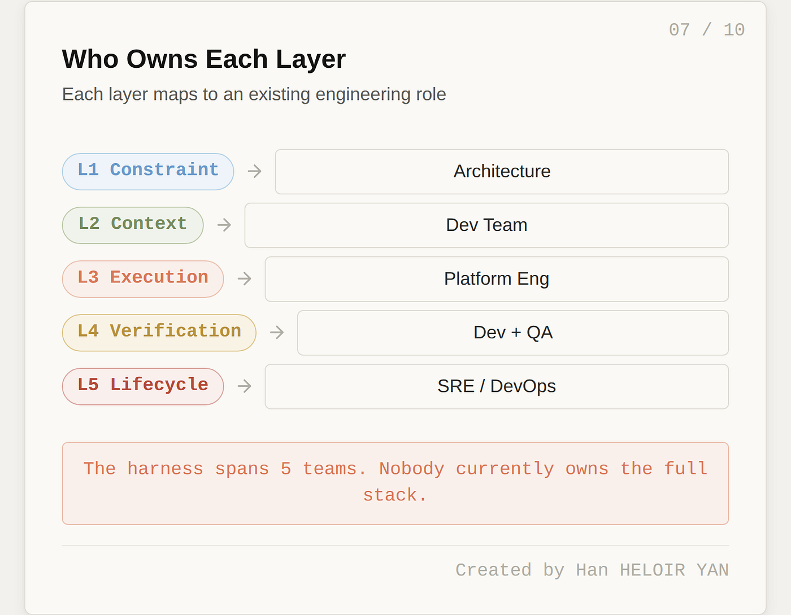
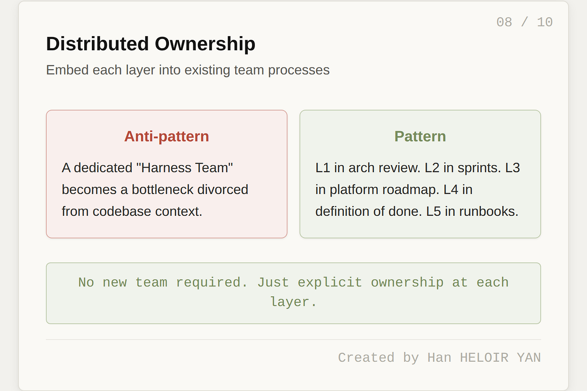
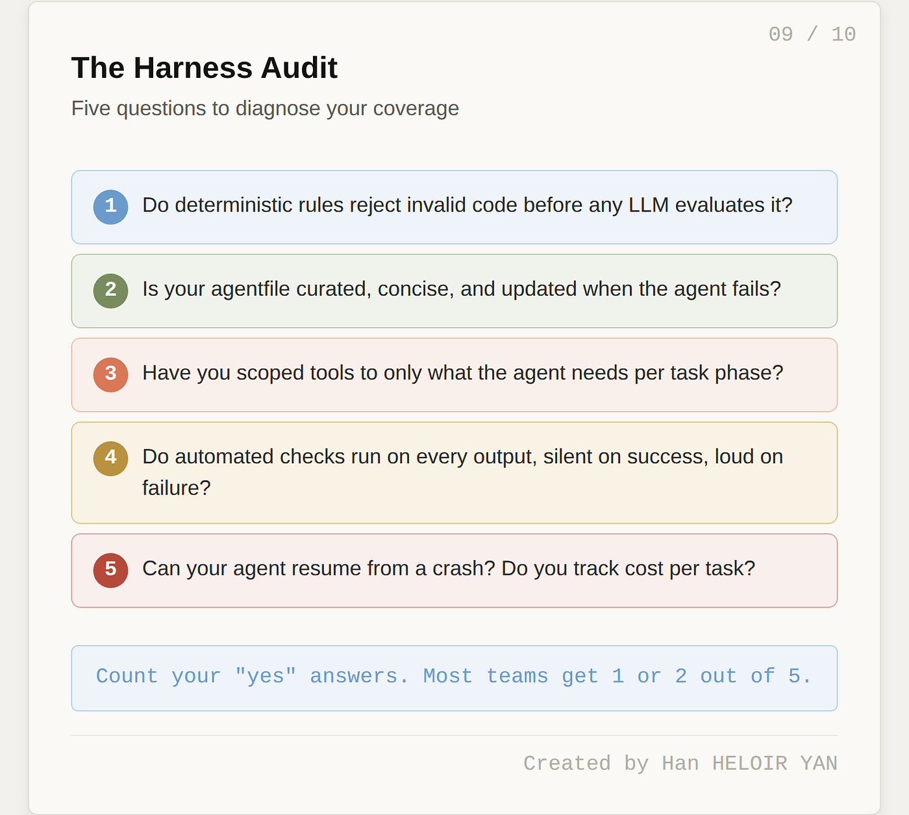

## 摘要（Summary）

本文提出了一個**五層 Harness 堆疊模型（5-Layer Harness Stack Model）**，將業界籠統使用的「Harness」概念分解為五個具有明確職責、不同變動頻率和不同組織擁有者的層次：約束層（Constraint）、上下文層（Context）、執行層（Execution）、驗證層（Verification）、生命週期層（Lifecycle）。作者指出，Anthropic 的 Claude Managed Agents 已涵蓋其中三層（L2、L3、L5），而開發者需自行負責的是**約束層（L1）**和**驗證層（L4）**——而大多數團隊在 L1 上完全缺席，這恰恰是投資邊際回報（Marginal Return）最高的層。

## 關鍵洞察（Key Insights）

- **Harness 不是單一概念，而是五層堆疊**——如同網路在 OSI 模型出現前的「networking」一詞，「harness」太籠統以至於無法精確診斷問題 — 參見 [[2026-04-02-HARNESS-ENGINEERING-COMPLETE-GUIDE]]
- **平台提供 L2/L3/L5，開發者負責 L1/L4**——基礎設施層（Infrastructure Concerns）與應用層（Application Concerns）有本質區別：前者跨領域通用，後者因團隊、程式碼庫、領域而異
- **約束層（L1）的投資回報最高**——確定性約束（Deterministic Constraints）執行成本低、零誤報（Zero False Positives）、不消耗任何 Token，卻能防止整類失敗 — 參見 [[2026-02-11-HARNESS-ENGINEERING-LEVERAGING-CODEX-IN-AN-AGENT-FIRST-WORLD]]
- **工具越多效果越差**——Vercel 發現移除 80% 的可用工具反而提升了任務完成率；HumanLayer 將完整 Linear MCP 伺服器（數十個工具）替換為只暴露六個操作的自訂 CLI
- **驗證的關鍵設計原則：成功沉默，失敗大聲**（Success is silent, Failure is loud）——將 4,000 行通過的測試灌入上下文窗口會讓代理人迷失任務

## 詳細內容（Details）

### 詞彙問題（The Vocabulary Problem）

作者用兩個團隊的對比說明問題：
- **團隊 A**：一個 CLAUDE.md 檔案 + 合併前跑型別檢查 + 偶爾用子代理人做研究 → 約涵蓋生產級 Harness 的 15%
- **團隊 B**：自訂 ArchUnit 規則、機器可讀架構約束文件、動態工具範圍限縮（Dynamic Tool Scoping）、靜默成功/失敗大聲的驗證鉤子（Hook）、迴圈偵測中介軟體（Loop Detection Middleware）、檢查點恢復（Checkpoint-Resume）、成本追蹤儀表板 → 約涵蓋 80%

> [!important] 核心問題（Core Problem）
> 現有的 6 元件模型（上下文工程、工具編排、狀態管理、驗證、人在迴圈中、生命週期管理）是平面清單（Flat List），沒有關係、沒有依賴、沒有建構順序。我們需要的是一個**堆疊（Stack）**，不是一個**清單（List）**。

### 五層模型（The Five Layers）

#### 第一層：約束層（Constraint Layer）——骨架

約束層執行關於程式碼「允許採取什麼形狀」的結構性規則。完全確定性（Deterministic），不涉及 LLM。

> [!note] OpenAI 的關鍵投資（OpenAI's Key Investment）
> OpenAI 的 Codex 團隊在此層投入最重。他們要求代理人在模組邊界（Module Boundaries）解析資料形狀、強制業務領域層之間的固定依賴方向、在每次輸出上執行自訂 Linter 和結構測試。違反結構規則的程式碼在語意評估前就被拒絕。

具體元件：
- 自訂 Linter 規則（ESLint、Biome、Clippy）
- 結構測試框架（ArchUnit）強制依賴方向與模組邊界
- 命名慣例執行（Naming Convention Enforcement）
- 檔案結構驗證
- API 合約驗證（OpenAPI Schema）

**變動頻率**：慢，隨重大架構決策演進
**擁有者**：架構團隊（Architecture Team）

#### 第二層：上下文層（Context Layer）——記憶

控制模型在每一步看到什麼。業界理解最透徹的一層。

> [!warning] ETH Zurich 研究發現（ETH Zurich Finding）
> 對 138 個 agentfile 的研究揭示：LLM 生成的 agentfile **反而降低效能**且多花 20%+ Token。程式碼庫概述和目錄列表**沒有幫助**——代理人自己就能發現倉庫結構。有效的是：**簡潔、普遍適用、頻繁更新**的人類撰寫 agentfile。HumanLayer 的 CLAUDE.md 不到 60 行。

**變動頻率**：中等，結構穩定但內容隨程式碼庫演進
**擁有者**：每日在程式碼庫工作的開發團隊

#### 第三層：執行層（Execution Layer）——雙手

管理代理人可以做什麼以及怎麼做。工具編排（Tool Orchestration）、MCP 伺服器設定、子代理人調度（Sub-agent Dispatch）、沙箱（Sandboxing）和權限模型都在此層。

> [!tip] 反直覺洞察（Counterintuitive Insight）
> **更多工具 = 更差結果**。Vercel 建構 v0 編碼代理人時發現：移除 80% 可用工具顯著提升了任務完成率。每個工具描述都消耗系統提示（System Prompt）中的 Token，太多工具會把代理人推入「笨蛋區域（Dumb Zone）」。
>
> 生產級執行層使用**動態工具範圍限縮（Dynamic Tool Scoping）**：規劃步驟不需要檔案系統寫入權限，程式碼執行步驟不需要網頁搜尋。

Boris Cherny 的「上下文防火牆（Context Firewall）」模式：使用子代理人（Sub-agent）封裝重度任務，使中間工具呼叫不會汙染父代理人的上下文窗口。

**變動頻率**：中等
**擁有者**：平台工程團隊（Platform Engineering）

#### 第四層：驗證層（Verification Layer）——免疫系統

檢查代理人輸出在到達真實世界前是否正確且安全。

Boris Cherny（Claude Code 創造者）觀察到：給 Claude 有效的驗證方法通常能將最終輸出品質提升 **2 到 3 倍**。LangChain 僅透過調整 Harness（驗證變更為主要部分）就將編碼代理人在 Terminal Bench 2.0 上的表現從 52.8% 提升到 66.5%。

> [!important] 關鍵設計原則（Critical Design Principle）
> **上下文效率（Context Efficiency）**。HumanLayer 的教訓：早期在每次變更後跑完整測試套件，4,000 行通過的測試淹沒了上下文窗口，代理人失去了對實際任務的追蹤。
>
> 修正：**吞掉通過的輸出，只浮現錯誤**。成功是沉默的，失敗是大聲的。

這也是 Mitchell Hashimoto 核心原則的所在：「每當你發現代理人犯了一個錯誤，你就花時間工程化一個解決方案，使代理人**永遠不再犯同樣的錯誤**。」

**變動頻率**：快，是演進最快的層，隨每次失敗增長
**擁有者**：開發與 QA 共同擁有

#### 第五層：生命週期層（Lifecycle Layer）——神經系統

管理代理人作為運行中的程序：啟動、健康監控、優雅關閉（Graceful Shutdown）、崩潰恢復（Crash Recovery）、成本追蹤、人在迴圈中升級（Human-in-the-Loop Escalation）。

失敗模式：
- **無限迴圈（Infinite Loops）**：代理人無限重試同一錯誤，一夜之間燒掉數千美元
- **狀態腐敗（State Corruption）**：崩潰恢復後代理人在過時假設上運作
- **上下文腐爛（Context Rot）**：長時間執行中代理人逐漸失去對原始目標的追蹤

Anthropic 的 Claude Managed Agents（2026 年 4 月）將此層提升為平台原語（Platform Primitive）。工程團隊將「大腦（Brain）」（呼叫 Claude 的 Harness 迴圈）從「雙手（Hands）」（程式碼執行的沙箱）和「會話（Session）」（持久事件日誌）解耦。結果：**p50 首 Token 時間下降約 60%，p95 下降超過 90%**。

**變動頻率**：慢，一旦建好就是基礎設施
**擁有者**：SRE 與 DevOps

### 覆蓋缺口（The Coverage Gap）

Anthropic 的 Managed Agents 虛擬化了三個元件：
- **會話**（持久事件日誌）→ **L2 上下文層**
- **沙箱**（一次性容器）→ **L3 執行層**
- **Harness 迴圈本身**（大腦）→ **L5 生命週期層**

業界預設的「CLAUDE.md + 一些測試」模式只覆蓋了部分 L2 和部分 L4——五層中的兩層，且只覆蓋部分。**缺失的幾乎總是 L1（約束層）**。

> [!tip] 投資優先級（Investment Priority）
> - **在託管平台（Managed Platform）上**：最高邊際回報是投資 L1（確定性約束：自訂 Linter、結構測試、模組邊界執行、API 合約驗證）
> - **自建團隊（Self-hosted）**：優先投資目前缺失的層，從 L4（驗證）開始，因為它每工程小時帶來最快的可靠性改善

### 誰擁有什麼（Who Owns What）

| 層次 | 映射到的傳統角色 |
|------|-----------------|
| L1 約束層 | 架構團隊（Architecture） |
| L2 上下文層 | 開發團隊（Development） |
| L3 執行層 | 平台工程（Platform Engineering） |
| L4 驗證層 | 開發 + QA 共同擁有 |
| L5 生命週期層 | SRE / DevOps |

> [!warning] 跨職能陷阱（Cross-functional Trap）
> 大多數組織中，沒有人端到端擁有「Harness」。這是一個跨越五個不同團隊的**橫切關注點（Cross-cutting Concern）**，如同安全性或可觀測性。而沒有人擁有的橫切關注點，往往就是沒有人建構的橫切關注點。
>
> 實務解決方案不是成立「Harness 工程團隊」（又一個穀倉），而是建立 **Harness 工程實踐（Practice）**：L1 在架構審查中、L2 在 Sprint 流程中、L3 在平台路線圖中、L4 在完成定義（Definition of Done）中、L5 在操作手冊（Runbook）中。

### 診斷方法與不投資的時機

**診斷啟發法**：投資在**最頻繁失敗模式正下方**的那一層。
- 結構性失敗 → L1
- 上下文漂移（Context Drift） → L2
- 工具混淆 → L3
- 輸出不正確 → L4
- 靜默失敗與失控成本 → L5

**不該投資的時機**：
- **原型階段**：還在驗證代理人方法是否可行
- **單次任務（Single-shot Tasks）**：無多步驟鏈就無複合失敗
- **抗拒 Harness 化的遺留程式碼庫**：如同對從未用過靜態分析器的專案跑分析——會被警報淹沒
- **仍在評估執行環境（Runtime）時**：只投資可攜式元件（約束、Linter、知識產物）
- **團隊太小無法覆蓋跨職能範圍時**：2 人團隊建好 L2 和 L4 比五層都蓋一半好

## 我的心得（My Takeaways）

1. **五層模型終於給了「Harness Engineering」一個精確的診斷框架**。之前看到不同文章談 Harness，總覺得每個人在講不同的東西——現在可以精確說「我們在 L1 上是空的」或「我們的 L4 只做了一半」。

2. **L1（約束層）被忽略的原因值得深思**：團隊寫測試（L4）因為測試是已知實踐；但很少有團隊寫確定性結構約束（L1），因為這個實踐在大多數工程工作流程中沒有既定位置。這是一個**組織慣性**問題，不是技術問題。

3. **「成功沉默，失敗大聲」這個設計原則可以立即應用**到任何使用 AI 代理人的工作流程中。將通過測試的完整輸出灌入上下文是極大的浪費。

4. **跨職能擁有權問題**是最真實的挑戰。OpenAI 的實驗成功部分原因是單一團隊擁有全部五層——但大多數組織無法複製這個結構。將 Harness 工程嵌入現有流程（架構審查、Sprint、路線圖、完成定義、Runbook）而非成立新團隊，是更務實的方法。

## 待補充（Open Questions）

- L1 約束層（自訂 Linter、ArchUnit）與 L4 驗證層的邊界在實務中如何劃定？型別檢查（TypeScript）、Schema 驗證、契約測試（Contract Testing）各自歸屬哪一層？（建議搜尋：`harness engineering L1 L4 boundary type checking contract testing`）
- 「移除 80% 工具後任務完成率提升」（Vercel v0 案例）的具體實驗設計是什麼？是否有控制其他變數？這個數據對不同類型的 Agent 任務是否具有通用性？（建議搜尋：`agent tool reduction task completion Vercel v0 experiment`）
- Anthropic Managed Agents 將 L5 生命週期層提升為平台原語後，「p50 首 Token 時間下降 60%」的技術機制是什麼？大腦/雙手/會話解耦具體如何實現？（建議搜尋：`Anthropic managed agents brain hands session decoupling latency`）
- 五層模型應用於非編碼場景（客服 Agent、文件處理、資料分析）時，各層的定義是否需要重新詮釋？目前有無跨場景的通用五層框架？（建議搜尋：`harness engineering non-coding agent document processing`）
- ETH Zurich 研究發現「LLM 生成的 agentfile 反而降低效能」——這個研究的樣本量、評估指標和控制條件是什麼？結論是否已被後續研究驗證或反駁？（建議搜尋：`ETH Zurich agentfile LLM generated performance degradation study`）
- 「沒有人端到端擁有 Harness」的跨職能協調問題，在已成功落地五層架構的組織中是如何解決的？是否有組織設計的案例研究？（建議搜尋：`harness engineering cross-functional ownership organizational design case study`）

## 相關連結（Related）

- [[2026-04-02-HARNESS-ENGINEERING-COMPLETE-GUIDE]] — Harness Engineering 的六層架構解析（中文影片），與本文的五層模型互為補充
- [[2026-02-11-HARNESS-ENGINEERING-LEVERAGING-CODEX-IN-AN-AGENT-FIRST-WORLD]] — OpenAI 官方原文，本文多次引用的 L1 約束層實踐案例
- [[AI-AGENT-ARCHITECTURE]] — 代理人架構設計的通用框架，可與本文的五層模型對照
- [[2026-03-19-CLAUDE-CODE-SKILLS-DOCUMENTATION]] — Claude Code Skill 機制，屬於 L2 上下文層的漸進式揭露（Progressive Disclosure）實踐
- [[2026-04-09-AI-ONE-PERSON-COMPANY-KARPATHY-OBSIDIAN-KB-OPENCLI]] — 「知識庫憲法」與「編譯後健檢」概念，對應本文的約束層與驗證層
- [[2026-03-17-NVIDIA-ANNOUNCED-NEMOCLAW-WHAT-NVIDIA-ACTUALLY-SOLVES-FOR-OPENCLAW-USERS-AND-WHAT-IT-DOES-NOT]] — NemoClaw 的跨進程策略執行，是 L1 約束層在企業安全場景的實際案例
- [[2026-04-12-HARNESS-ENGINEERING-HUNGYI-LEE-NTU-LLM-GUIDANCE]] — 李宏毅的三大控制面向（認知框架、工具、工作流程）與 Anthropic 五層 Harness 的對照

---

## 知識層次分析（Bloom's Taxonomy Analysis）

> 以下從五個認知層次對本篇內容進行結構化分析，協助從記憶到評估逐層深化理解。

| 認知層次 | 核心目的 | 對本文的具體應用 |
|---------|---------|--------------|
| **記憶（被動）** | 確認資訊存在，單純資訊檢索，確立基礎知識 | 五層名稱：約束層（Constraint）、上下文層（Context）、執行層（Execution）、驗證層（Verification）、生命週期層（Lifecycle）；平台擁有 L2/L3/L5，開發者擁有 L1/L4；「成功沉默，失敗大聲」原則；動態工具範圍限縮（Dynamic Tool Scoping） |
| **理解（半被動）** | 解釋概念的含義及關聯，串聯知識點，掌握核心邏輯 | 五層模型的核心邏輯是將 Harness 從「扁平清單」重構為「有依賴關係的堆疊」。L1 是基礎——確定性約束在語意檢查前攔截結構錯誤，使 L4 的驗證工作量減少。L2/L3/L5 是基礎設施（跨領域通用），L1/L4 是應用層（因域而異），這個劃分解釋了為何平台商能接管前者但不能接管後者。最終指向一個組織設計問題：五層橫跨五個團隊，需要的是實踐（Practice）而非新團隊。 |
| **分析（主動）** | 檢驗論點、拆解流程、找出假設，批判性思維 | **關鍵假設**：(1) 五層之間有清晰的界線——但實際上 L1 的「結構約束」與 L4 的「驗證」邊界模糊（型別檢查算哪層？）；(2) 假設團隊有足夠的架構成熟度來定義 L1 約束——但許多團隊連架構審查都沒有；(3) OSI 模型的類比暗示五層是完備且穩定的——但 OSI 本身花了數十年才穩定，此模型可能會大幅演變。**未論及的前提**：此模型假設代理人主要用於寫程式碼，對非編碼場景（文件處理、客服）的適用性未被驗證。 |
| **應用（主動）** | 將知識套用情境，規劃執行方案 | (1) 對現有專案的 Harness 做五層審計（Audit），標記每層的覆蓋率百分比，找出最大缺口；(2) 在 CI/CD 中加入自訂 Linter 規則作為 L1 約束層的第一步——從最常見的架構違規開始；(3) 重構現有的測試 Hook，實施「成功沉默」原則——只在失敗時將輸出注入代理人上下文 |
| **評估（主動）** | 判斷多個方案的優劣，進行決策和權衡 | **優點**：五層模型提供了前所未有的精確診斷能力，解決了「harness」一詞的歧義；層次間的依賴關係和擁有者映射極具實用性。**缺點**：(1) 模型可能過度簡化——實際系統中層次間的互動比堆疊模型暗示的更複雜（如 L4 驗證結果回饋到 L2 上下文）；(2) 對非程式碼代理人場景的適用性存疑。**替代方案**：LangChain 的 6 元件平面模型更簡單易懂，對小團隊可能更實用；OpenAI 的實踐導向方法（直接從失敗中學習）可能比先建立理論框架更適合快速迭代的環境。 |

### 分析型追問（Socratic Follow-up）

> 以下問題供進一步反思，可用來與 AI 展開蘇格拉底式對話：

- **澄清**：L1「約束層」與 L4「驗證層」的界線在哪？型別檢查（Type Check）、Schema 驗證、合約測試（Contract Test）應歸屬哪一層？
- **假設**：本文假設平台商（Anthropic）會持續擁有 L2/L3/L5。若平台商開始提供 L1 約束模板或 L4 驗證即服務（Verification-as-a-Service），開發者的投資優先級如何改變？
- **證據**：「L1 是最高邊際回報」的主張主要基於 OpenAI Codex 一個案例。單一案例是否足以支撐對整個產業的建議？
- **觀點**：若站在只有 2-3 人的小團隊立場，五層模型是否反而增加了認知負擔？「CLAUDE.md + 測試」的簡單模式是否在某些規模下才是最優解？
- **後果**：若整個產業都採用此五層模型，12 個月後可能出現「Harness 工程認證」或「L1 約束即服務」的市場，但也可能出現過度工程化（Over-engineering）的反效果——團隊花更多時間建構 Harness 而非交付價值。

### 方案批判三問（Critical Evaluation）

> [!warning] 適用於技術方案類內容

1. **最大的風險是什麼？** — 團隊可能在五層模型的指導下過度投資 Harness 基礎設施，特別是在專案仍處於原型或驗證階段時。過早的 L1 約束可能限制了必要的架構探索空間，導致人力浪費。
2. **什麼情況下會失敗？** — (1) 團隊規模太小（< 5 人）無法覆蓋五層的跨職能需求時；(2) 程式碼庫是遺留的義大利麵式架構（Spaghetti Architecture），每層都會被淹沒在警報中；(3) 所選的代理人執行環境（Runtime）頻繁更換，與執行環境耦合的 Harness 元件被反覆丟棄。
3. **有沒有更好的替代方案？** — Mitchell Hashimoto 的「反應式方法（Reactive Approach）」：不預先規劃五層，而是從失敗中逐個修復。適合在專案早期、團隊小、或對代理人能力尚未有足夠信心時使用。當失敗量累積到某個閾值時，再正式化為層次結構。這種「先跑再整理」的方法犧牲了一些早期效率，但避免了過度工程化的風險。

## References

- [Anthropic Just Shipped Three of the Five Harness Layers | Medium](https://medium.com/@han.heloir/anthropic-just-shipped-three-of-the-five-harness-layers-for-managed-agent-and-the-other-two-are-on-14979cb4cf00)
- [Harness engineering: leveraging Codex in an agent-first world | OpenAI](https://openai.com/index/harness-engineering/)
- [Scaling Managed Agents: Decoupling the brain from the hands | Anthropic](https://www.anthropic.com/engineering/scaling-managed-agents)
- [Harness Engineering | martinfowler.com](https://martinfowler.com/articles/harness-engineering.html)
- [The Anatomy of an Agent Harness | LangChain Blog](https://blog.langchain.dev/the-anatomy-of-an-agent-harness/)
