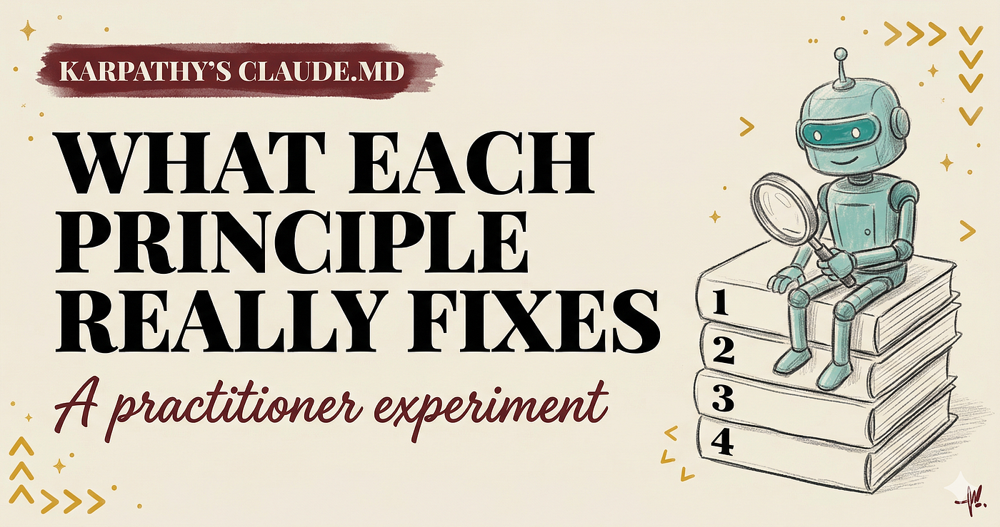
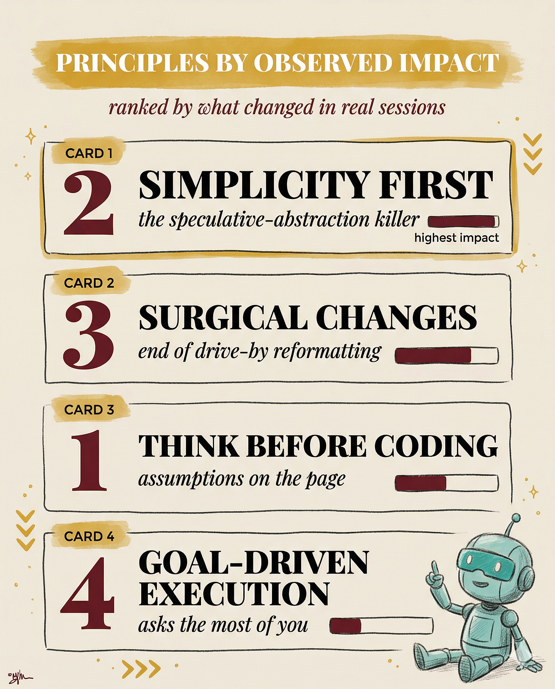
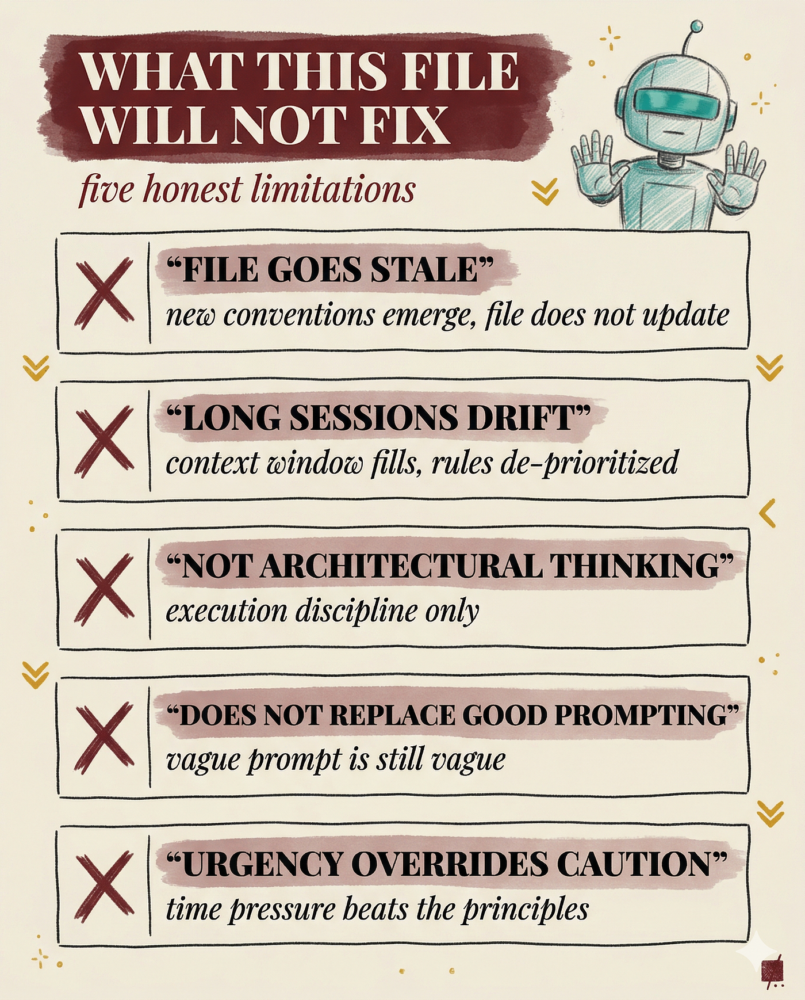

## 摘要（Summary）

同作者（Reza Rezvani）在真實 Claude Code 專案上運行 Karpathy 的 CLAUDE.md 檔案數週後的實測報告。不同於社群中多數只是複述四個原則的文章，本文聚焦於每個原則「實際改變了什麼」與「在哪裡停止運作」。核心發現：四個原則的效果不均等，最有效的是「化繁為簡（Simplicity First）」消滅了推測性抽象，最弱的是「目標驅動執行（Goal-Driven Execution）」因為它要求使用者改變行為而非模型。此外，文章揭露了合併到既有 CLAUDE.md 時的三個實際摩擦點，以及五個這份文件永遠無法解決的問題。



## 關鍵洞察（Key Insights）

- **四原則效果不均等** — 按實際改變程度排序：Simplicity First > Think Before Coding > Surgical Changes > Goal-Driven Execution，而非 Karpathy 原始編號順序
- **README 安裝 Bug** — Forrest Chang 的 Repo README 中 `andrej-karpthy-skills` 少了一個 "a"，產生 404。這暴露了「大部分評論文章從未真正執行過安裝」
- **合併順序很重要** — 專案規則應放在 Karpathy 原則之前：先定義「這個 Codebase 是什麼」，再定義「在裡面怎麼行為」。反過來會導致 Claude Code 把原則當主要上下文、專案規則當諮詢
- **令牌空間競爭** — CLAUDE.md 的每一行都與實際工作爭奪上下文空間（Context Space）。Karpathy 60 行 + 專案規則 80 行 + 系統提示 → 迅速逼近 150–200 條指令的有效上限
- **行為修正器，非思考夥伴** — 這份文件修正的是「Postgres 還是 DynamoDB」之後的執行行為，不參與架構決策

## 詳細內容（Details）

### 四個原則的實測排名



#### 原則 1：化繁為簡（Simplicity First）— 推測性抽象殺手

> [!tip] 最有效的原則
> 安裝後最可靠的改變：Claude Code 不再為 Codebase 中不存在的情境添加可選參數，也不再在只有一個呼叫者時引入抽象層。「用類別層次結構代替函數」的最糟狀況基本消失。

**誠實的限制**：風格匹配（Style Matching）。當工作區域的程式碼已經充滿抽象時，Claude Code 會匹配周圍風格，Simplicity First 悄悄敗給 Surgical Changes。兩個原則會互相衝突，局部風格勝出。

#### 原則 2：編碼前思考（Think Before Coding）— 假設顯性化

改變比預期微妙。Claude Code 不會變成「提問機器」，而是在回應中**主動命名假設**：

> "I am assuming you want the validation at the API boundary rather than at the model layer."

不同意時在寫碼前修正，同意時直接推進，比不斷來回問答更快。

**誠實的限制**：辨識能力（Recognition）。只有當模型「辨識出」歧義時才有效。歧義深度超過模型模式匹配能力時，靜默解讀仍然發生。

#### 原則 3：精準修改（Surgical Changes）— 終結順帶重排

修一個函數的 Bug，diff 只碰那一個函數。安裝前常見的「順帶重排 import block」、「刪除三個月前的註解」、「格式化相鄰程式碼」行為基本停止。

**誠實的限制**：範圍（Scope）。小型、有界的請求效果最好。當任務真正需要碰多個檔案時，精準修改的本能與實際工作衝突，模型必須選擇。通常選對，但不是每次。

**仍然滑過的**：新增 import 時，Claude Code 有時會把整個 import block 按字母排序，即使原始順序是刻意的。

#### 原則 4：目標驅動執行（Goal-Driven Execution）— 要求最高的原則

> [!warning] 這個原則改變的是「你」，不是模型
> 給 Claude Code 可驗證的成功標準（如「寫一個重現此 Bug 的測試，然後讓它通過」），效果驚人。但使用者不總是這樣寫提示。「Fix this bug」更快，而此時原則形同虛設。

### 合併到既有 CLAUDE.md 的三個摩擦

> [!warning] 沒有其他文章提到的實際問題

1. **直接規則衝突** — 專案規則「所有 API 端點都要完整錯誤處理」vs. Karpathy 原則「不可能情境不做錯誤處理」。兩者各自正確，但模型仲裁結果因出現順序不同而不一致

2. **令牌空間競爭** — Frontier 模型可靠地遵循約 150–200 條指令，Claude Code 系統提示已佔用相當比例。Karpathy 60 行 + 專案 80 行 → 必須精簡專案部分騰出空間

3. **順序影響行為** — 作者最終將 Karpathy 原則放在專案規則**之後**。邏輯：專案規則定義「Codebase 是什麼」，Karpathy 原則定義「在裡面如何行為」。反過來導致原則被當成主要上下文

> [!tip] 最佳實踐
> 解決衝突的方式不是靠排序技巧，而是讓專案規則更具體，從根本上避免衝突產生。

### 五個這份文件無法解決的問題



1. **文件會過時** — Karpathy 本人也承認沒找到好的更新方式。新規範出現但文件未更新，文件與 Codebase 的差距本身成為摩擦源
2. **長會話仍然漂移** — 原則在會話前半段最有效。上下文視窗（Context Window）填滿後，早期指令被逐步降級。這是 Claude Code 的已知行為，非 Karpathy 文件問題
3. **只是執行紀律，非架構思維** — 不幫你選 Postgres 還是 DynamoDB；但選了 Postgres 後，防止你為兩張表的功能產生六張表的 Schema
4. **不能取代好的提示** — 模糊提示加上這份文件，仍然是模糊提示
5. **緊急感覆蓋謹慎** — 「部署前快速修復」這類有隱含時間壓力的提示會覆蓋文件建立的謹慎預設。緊急感與謹慎原則對抗，緊急感勝出

### 安裝方式

**新專案**（從專案根目錄執行）：
```bash
curl -o CLAUDE.md https://raw.githubusercontent.com/forrestchang/andrej-karpathy-skills/main/CLAUDE.md
```

**既有 CLAUDE.md**（追加而非取代）：
```bash
echo "" >> CLAUDE.md
curl https://raw.githubusercontent.com/forrestchang/andrej-karpathy-skills/main/CLAUDE.md >> CLAUDE.md
```

**全域安裝**：放入 `~/.claude/skills/` 讓規則套用到所有專案。

## 我的心得（My Takeaways）

1. **Simplicity First 是最值得借鏡的原則** — 在我自己的 [[2026-03-28-CLAUDE-CODE-USER-VS-PROJECT-LEVEL-CONFIG-GUIDE|CLAUDE.md 配置]] 中，加入類似「不要為只有一個呼叫者的情境引入抽象」的規則會是最高 ROI 的改動
2. **合併順序的洞察非常實用** — 「先定義 What，再定義 How」的框架解釋了為什麼我之前把通用規則放最前面時效果不好
3. **150–200 指令上限是重要的量化參考** — 以此為基準來設計 CLAUDE.md 長度，避免超載。搭配 [[2026-04-03-KARPATHY-AI-INSANITY-AGENTS-AUTORESEARCH-MODEL-SPECIATION|Karpathy 的令牌焦慮]] 觀點，上下文空間管理是核心技能
4. **Goal-Driven Execution 的洞察很深刻** — 「這個原則改變的是你而不是模型」。最好的工具也需要使用者配合改變工作習慣
5. **「行為修正器 vs. 思考夥伴」的區分** — 有助於正確設定 CLAUDE.md 的期望值：它管執行品質，不管策略決策

## 待補充（Open Questions）

- Karpathy 的四個原則是否有量化的效果度量？例如，安裝前後的 diff 大小變化、Code Review 駁回率變化？（建議搜尋：`karpathy claude.md quantitative evaluation metrics before after`）
- 文章提到 Frontier 模型可遵循 150–200 條指令。這個數字的來源是什麼？是否有系統性的研究支持？（建議搜尋：`LLM instruction following capacity limit system prompt`）
- 「兩個原則互相衝突時局部風格勝出」——這是 Claude Code 特有的行為還是所有 LLM 的通用模式？其他 AI Coding 工具（如 Cursor、Copilot）有類似的優先級衝突嗎？（建議搜尋：`AI coding assistant rule conflict resolution priority`）
- 作者建議「讓專案規則更具體」來避免衝突，但更具體的規則是否會更快佔滿令牌空間？如何在具體性與簡潔性之間取得平衡？（建議搜尋：`claude.md instruction optimization specificity vs token budget`）
- 緊急感覆蓋謹慎的問題是否有已知的緩解方式？例如在 CLAUDE.md 中加入「即使提示暗示緊急也要保持謹慎」是否有效？（建議搜尋：`LLM urgency override safety instructions mitigation`）

## 相關連結（Related）

- [[2026-03-30-BORIS-CHERNY-HIDDEN-CLAUDE-CODE-FEATURES]] — Boris Cherny（Claude Code 創始人）的隱藏功能，文中提到本文作者 Reza 的另一篇 Boris 技巧分析
- [[2026-03-31-BUILD-CLAUDE-CODE-AGENTS-10-STEP-FRAMEWORK]] — 同作者 Reza Rezvani 的 10 步 Agent 建構框架，展示他在 CLAUDE.md 配置上的完整實踐
- [[2026-04-03-KARPATHY-AI-INSANITY-AGENTS-AUTORESEARCH-MODEL-SPECIATION]] — Karpathy 本人的 AI 觀點，本文分析的 CLAUDE.md 正是出自他的 LLM 編碼陷阱觀察
- [[2026-03-28-CLAUDE-CODE-USER-VS-PROJECT-LEVEL-CONFIG-GUIDE]] — CLAUDE.md 的配置層級管理，本文的合併順序建議直接適用於此指南的實踐
- [[2026-03-17-LESSONS-FROM-BUILDING-CLAUDE-CODE-HOW-WE-USE-SKILLS]] — Skills 系統的官方經驗，Karpathy 的 CLAUDE.md 可透過 Skills 目錄全域安裝
- [[2026-04-09-AI-ONE-PERSON-COMPANY-KARPATHY-OBSIDIAN-KB-OPENCLI]] — Karpathy 的一人公司實踐，包含他對 AI 工具配置的整體哲學
- [[2026-04-15-CLAUDE-MD-BEST-PRACTICES-EXPERT-GUIDE-SKILLS-VS-CLAUDEMD]] — 七位專家的 CLAUDE.md 最佳實踐交叉比較，含 Karpathy 四原則與其他方案的定位分析
- [[2026-01-18-STOP-BLOATING-YOUR-CLAUDE-MD-PROGRESSIVE-DISCLOSURE-AI-CODING-TOOLS]] — Opalic 的漸進式揭露方案，與 Karpathy 行為準則可互補：行為約束 + 知識按需載入
- [[2026-01-27-KARPATHY-GUIDELINES-VS-CLAUDE-CODE-BUILTIN-SYSTEM-PROMPT]] — 逐條比對 Karpathy 準則與 Claude Code 內建 `prompts.ts`，量化覆蓋度並提出精簡策略

---

## 知識層次分析（Bloom's Taxonomy Analysis）

> 以下從五個認知層次對本篇內容進行結構化分析，協助從記憶到評估逐層深化理解。

| 認知層次 | 核心目的 | 對本文的具體應用 |
|---------|---------|--------------|
| **記憶（被動）** | 確認資訊存在，單純資訊檢索，確立基礎知識 | 四個原則名稱（Think Before Coding / Simplicity First / Surgical Changes / Goal-Driven Execution）；CLAUDE.md 安裝路徑（專案根目錄 vs. `~/.claude/skills/`）；Frontier 模型指令容量上限 150–200 條；README 拼寫錯誤 `andrej-karpthy-skills` |
| **理解（半被動）** | 解釋概念的含義及關聯，串聯知識點，掌握核心邏輯 | 每個原則解決一種特定的失敗模式：靜默假設→Think Before Coding、推測性抽象→Simplicity First、順帶編輯→Surgical Changes、模糊標準→Goal-Driven Execution。合併順序影響行為是因為 LLM 對上下文的優先級解讀遵循位置偏好。「行為修正器 vs. 思考夥伴」是理解此文件價值邊界的關鍵框架 |
| **分析（主動）** | 檢驗論點、拆解流程、找出假設，批判性思維 | 作者是 Claude Code 的重度使用者（CTO + 日常使用），立場偏向「實用主義」而非理論分析。文章未控制變項——不清楚哪些改善來自 CLAUDE.md 而非使用者本身的提示品質提升。150–200 指令上限缺乏來源引用。Simplicity First 與 Surgical Changes 的衝突暗示四原則之間不是正交關係，存在內部張力 |
| **應用（主動）** | 將知識套用情境，規劃執行方案，實戰決策力 | 1. 在現有 CLAUDE.md 中加入 Simplicity First 的核心規則：「不為單一呼叫者引入抽象、不添加推測性可選參數」 2. 重新排列 CLAUDE.md 結構：專案規則在前（What）、行為原則在後（How），並控制總行數在 120 行以內 3. 把 Goal-Driven Execution 改造成提示模板而非被動規則：建立常用的可驗證成功標準片段 |
| **評估（主動）** | 判斷多個方案的優劣，進行決策和權衡 | Karpathy CLAUDE.md 的優勢：零成本、即時生效、解決真實痛點。劣勢：被動依賴（不強制使用者改變提示習慣）、不可組合（與既有規則衝突）、會過時。替代方案：Anthropic 官方的 [[2026-03-17-LESSONS-FROM-BUILDING-CLAUDE-CODE-HOW-WE-USE-SKILLS|Skills 系統]] 可將行為規則模組化並按專案啟用/停用，比單一 CLAUDE.md 更靈活但設定更複雜。對於個人使用者，Karpathy CLAUDE.md 是最佳起點；對於團隊，需要結合 managed settings 和 Skills 系統做更精細的管理 |

### 分析型追問（Socratic Follow-up）

- **澄清**：「推測性抽象（Speculative Abstraction）」的精確邊界在哪裡？添加一個 interface 以便未來擴展算不算推測性抽象？在什麼條件下它是合理的前瞻設計？
- **假設**：文章假設 CLAUDE.md 中的指令與模型行為是線性因果關係。但模型行為同時受系統提示、對話歷史、程式碼上下文影響，如何確定行為改變是 CLAUDE.md 的效果而非其他因素？
- **證據**：作者聲稱 Simplicity First 是最有效的原則，但僅基於個人主觀體驗。是否有 A/B 測試或客觀指標（如 diff 行數、review 通過率）來支持此排名？
- **觀點**：資深工程師可能會認為「推測性抽象」有時是合理的——尤其是在已知需求會擴展的領域。Karpathy 的原則是否過度偏向「YAGNI」（You Ain't Gonna Need It）？
- **後果**：若團隊全面採用 Karpathy CLAUDE.md，12 個月後可能出現的風險：團隊過度依賴文件而不改善提示品質，或 Simplicity First 導致 Codebase 缺乏必要的抽象層，使後期重構成本上升

### 方案批判三問（Critical Evaluation）

> [!warning] 適用於具體做事方法類內容

1. **最大的風險是什麼？** — 規則衝突導致模型行為不一致：既有的專案規則（如完整錯誤處理）與 Karpathy 原則（不處理不可能情境）衝突時，模型的仲裁結果不可預測，可能在關鍵 API 端點跳過錯誤處理
2. **什麼情況下會失敗？** — (1) 長會話（>30 分鐘）中原則被逐步降級 (2) 專案 Codebase 本身就高度抽象化，Simplicity First 與 Surgical Changes 互相打架 (3) 使用者習慣寫模糊提示且不願改變
3. **有沒有更好的替代方案？** — Skills 系統提供模組化的行為規則，可按專案/任務啟用停用，避免單一 CLAUDE.md 的衝突問題。但設定更複雜。對個人快速起步，Karpathy CLAUDE.md 是最佳選擇；對團隊治理，需要更精細的 Skills + managed settings 組合

## References

- [Andrej Karpathy's CLAUDE.md: What Each Principle Really Fixes — Medium](https://alirezarezvani.medium.com/andrej-karpathys-claude-md-what-each-principle-really-fixes-20b159b4b582)
- [forrestchang/andrej-karpathy-skills — GitHub](https://github.com/forrestchang/andrej-karpathy-skills)
