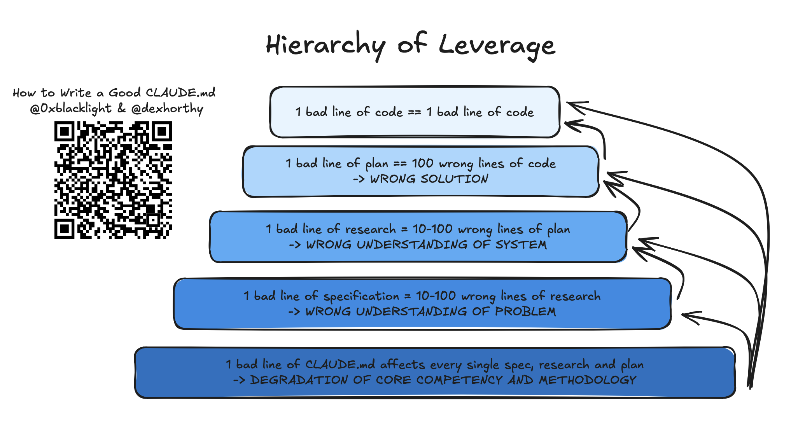
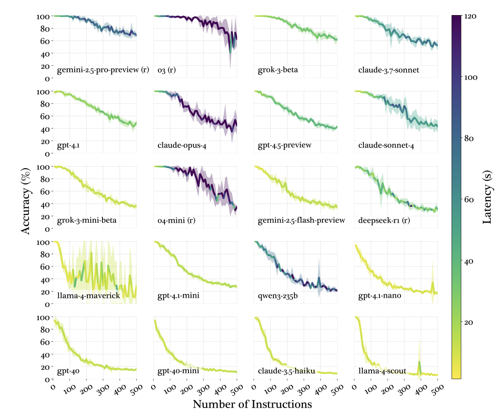

## 摘要（Summary）

HumanLayer 創辦人 Kyle 撰寫的這篇文章，從 LLM 的根本特性出發，解釋為什麼 CLAUDE.md 是 Claude Code 中**最高槓桿的設定檔**——它是唯一在每個 Session 都會被注入的檔案。但弔詭的是，Claude 經常忽略 CLAUDE.md 的內容，因為系統提示（System Prompt）中有一句「this context may or may not be relevant」暗示 Claude 可以跳過。文章提出六大核心原則：精簡至上、漸進式揭露（Progressive Disclosure）、不要把 Claude 當 Linter、不要自動生成、善用邊緣效應（Periphery Bias），以及控制指令預算（Instruction Budget）。HumanLayer 自己的 CLAUDE.md 不到 60 行。

## 關鍵洞察（Key Insights）

- **LLM 是無狀態的（Stateless）** — 每次對話都是全新開始，CLAUDE.md 是唯一保證被注入的「持久記憶」，參見 [[2026-04-17-CLAUDEMD-MYTHS-DEBUNKED-SOURCE-CODE-VERIFICATION|迷思核實]]
- **系統提示的「毒藥句」** — Claude Code 系統提示包含「this context may or may not be relevant... should not respond unless highly relevant」，導致 Claude 主動跳過它認為不普遍適用的指令
- **指令預算約 150-200 條** — 研究顯示 LLM 可靠遵循的指令上限約 150-200 條；Claude Code 系統提示已佔 ~50 條，留給使用者的只有 ~100-150 條
- **指令衰減是均勻的（Uniform Decay）** — 不是後面的指令被忽略，而是所有指令的遵循率一起下降，參見 [[2026-04-15-CLAUDE-MD-BEST-PRACTICES-EXPERT-GUIDE-SKILLS-VS-CLAUDEMD|七位專家比較]]
- **邊緣偏差（Periphery Bias）** — LLM 對提示詞開頭和結尾的注意力高於中間，所以最重要的指令應放在 CLAUDE.md 的首尾
- **CLAUDE.md 是最高槓桿點** — 一行好的指令會在數百次 Session 中被執行，壞的指令同樣會被放大數百倍

---

## 詳細內容（Details）

### 第一章：為什麼 CLAUDE.md 重要？

LLM 是無狀態的（Stateless）。每次你開啟一個 Claude Code Session，它對你的專案一無所知——不知道你用什麼框架、不知道你的程式碼風格、不知道你的團隊慣例。**CLAUDE.md 是唯一在每次 Session 都會被自動注入的檔案**，這讓它成為整個 Claude Code 工作流中影響力最大的單一檔案。



上圖說明：一份好的 CLAUDE.md 會在每次 Session、每個任務中被讀取，其影響像複利一樣累積。反之，一份壞的 CLAUDE.md 也會讓錯誤決策級聯放大。

### 第二章：為什麼 Claude 會忽略你的 CLAUDE.md？

Claude Code 的系統提示（System Prompt）中包含大約 50 條指令，其中有一句關鍵的話：

> "this context may or may not be relevant to your tasks. You should not respond to this context unless it is highly relevant to your task."

這句話原本是為了防止 Claude 過度關注不相關的上下文，但副作用是：**Claude 會主動判斷 CLAUDE.md 中的內容是否「高度相關」，並跳過它認為不適用的部分**。這就是為什麼有些使用者發現精心撰寫的規則被完全忽略。

### 第三章：指令預算（Instruction Budget）

研究表明，LLM 可靠遵循的指令數量有上限，大約在 **150-200 條**。超過這個數字後，指令遵循的品質會**均勻下降**——不是只有新增的指令被忽略，而是所有指令（包括原本被遵循的）的遵循率都一起降低。



Claude Code 系統提示已經佔用了約 50 條指令額度。這意味著：

- 你的 CLAUDE.md 實際可用的指令預算只有 **~100-150 條**
- 每多一條低價值的指令，都會拖累所有指令的遵循率
- 「少即是多」（Less is More）不是口號，而是有實證支持的策略

### 第四章：六大核心原則

#### 原則 1：少即是多（Less is More）

CLAUDE.md 不是文件或教學手冊。只放**普遍適用**（universally applicable）的指令——每次 Session、每個任務都需要的內容。HumanLayer 自己的 CLAUDE.md 不到 60 行。

> [!tip] 判斷標準
> 問自己：「這條規則在 80% 以上的 Session 中都適用嗎？」如果不是，它不該在 CLAUDE.md 裡。

#### 原則 2：漸進式揭露（Progressive Disclosure）

把任務特定的指令放到獨立的文件中（例如 `agent_docs/`），只在 CLAUDE.md 中告訴 Claude 這些文件的存在和用途。讓 Claude 根據當前任務自行判斷是否需要讀取，參見 [[2026-01-18-STOP-BLOATING-YOUR-CLAUDE-MD-PROGRESSIVE-DISCLOSURE-AI-CODING-TOOLS|Opalic 漸進式揭露實戰]]。

```
agent_docs/
  ├── building_the_project.md
  ├── running_tests.md
  └── deploying.md
```

在 CLAUDE.md 中只寫一句：

```markdown
For task-specific instructions, check the `agent_docs/` directory.
```

#### 原則 3：不要把 Claude 當 Linter

程式碼格式、命名慣例、import 順序等——這些應該用**確定性工具**（Deterministic Tools）處理：ESLint、Prettier、Biome、hooks。把這些寫進 CLAUDE.md 不僅浪費指令預算，而且 LLM 做格式檢查的可靠性遠不如專用工具。

#### 原則 4：不要自動生成（Don't Auto-Generate）

`/init` 命令會自動產生 CLAUDE.md，但品質通常很差。自動生成的內容往往過於冗長、充滿泛用的建議、缺乏專案特定的洞察。CLAUDE.md 是最高槓桿點，值得你花時間手動精心撰寫。

#### 原則 5：善用邊緣偏差（Periphery Bias）

LLM 對提示詞的**開頭和結尾**注意力最高，中間的部分容易被忽略。因此：

- 最重要的規則放在 CLAUDE.md 的**開頭**
- 次重要的放在**結尾**
- 輔助性的放在中間

#### 原則 6：用事實而非程式碼片段

不要在 CLAUDE.md 中放程式碼範例——它們會過時（stale）。用指向性的描述代替：

```markdown
# 正確做法
Error handling follows the pattern in src/utils/errors.ts

# 不推薦
Error handling should look like:
\`\`\`ts
try { ... } catch (e) { ... }
\`\`\`
```

### 第五章：HumanLayer 的實踐

HumanLayer 的 CLAUDE.md 不到 60 行，圍繞三個核心要素組織：

| 要素 | 內容 | 範例 |
|------|------|------|
| **WHAT**（技術棧） | 專案使用的語言、框架、工具 | TypeScript, Next.js, Prisma |
| **WHY**（專案目的） | 專案的核心目標和使命 | Human-in-the-loop AI workflows |
| **HOW**（執行細節） | 少量最關鍵的開發慣例 | Always use server actions, never client-side fetch |

---

## 知識層次分析（Bloom's Taxonomy Analysis）

| 認知層次 | 核心目的 | 對本文的具體應用 |
|---------|---------|--------------|
| **記憶（被動）** | 基礎知識 | 指令預算 150-200 條；系統提示佔 ~50 條；HumanLayer CLAUDE.md <60 行；邊緣偏差（開頭和結尾注意力最高） |
| **理解（半被動）** | 串聯邏輯 | 因果鏈：CLAUDE.md 太長 → 超過指令預算 → 均勻衰減（所有規則都被忽略的概率升高）→ 壞的輸出 → 乘以數百次 Session = 巨大的負面槓桿 |
| **分析（主動）** | 找出假設 | **假設 1**：150-200 條指令上限的研究是否適用於最新模型（Claude 4 Opus）？隨著模型改進，這個數字可能已提升。**假設 2**：「系統提示佔 ~50 條」是 Kyle 手動計算的，不同版本可能不同。**未論及**：多檔案 CLAUDE.md（project/user/global 三層）的指令是否累計計算 |
| **應用（主動）** | 立即行動 | (1) 統計你目前 CLAUDE.md 的指令數量，若 >100 條開始刪減；(2) 建立 `agent_docs/` 目錄，把流程性指令移出 |
| **評估（主動）** | 權衡方案 | 漸進式揭露（`agent_docs/`）vs Skills 按需載入：前者 100% 可靠但佔用啟動 context，後者節省 token 但有 20-40% 觸發失敗率。根據 [[2026-01-27-VERCEL-AGENTS-MD-OUTPERFORMS-SKILLS-IN-AGENT-EVALS|Vercel 實驗]]，被動上下文仍然勝過 Skills 的自動觸發 |

### 分析型追問（Socratic Follow-up）

- **澄清**：「指令預算 150-200 條」的研究來源是什麼？是針對 Claude 還是一般 LLM？不同模型的指令預算差異有多大？
- **假設**：文章假設「所有 CLAUDE.md 內容都同等消耗指令預算」——但結構化的事實陳述（如技術棧列表）是否真的佔用與行為指令相同的「額度」？
- **證據**：HumanLayer 的 <60 行 CLAUDE.md 效果如何量化？有沒有 A/B 測試數據比較精簡版與完整版的差異？
- **觀點**：如果站在大型團隊（50+ 人）的立場，精簡到 60 行是否足夠覆蓋所有團隊慣例？
- **後果**：如果所有人都把指令移到 `agent_docs/`，Claude 在每個 Session 都需要額外讀取檔案，是否反而增加了 token 消耗？

---

## Open Questions

1. **指令預算的模型差異** — 150-200 條指令上限在不同模型（Claude Opus vs Sonnet vs Haiku）之間是否有顯著差異？隨模型版本更新，這個數字是否會提升？（建議搜尋：`LLM instruction following capacity scaling model size 2026`）

2. **系統提示的「毒藥句」是否可被覆寫** — Claude Code 系統提示中「may or may not be relevant」這句話的影響有多大？使用者能否透過在 CLAUDE.md 開頭加 `IMPORTANT: All instructions below are critical` 來抵消它？（建議搜尋：`Claude Code system prompt override CLAUDE.md priority 2026`）

3. **漸進式揭露 vs Skills 的實證比較** — `agent_docs/` 方案和 Skills `paths:` 方案在真實專案中的觸發率與品質差異有多大？是否有人做過受控實驗？（建議搜尋：`agent_docs progressive disclosure vs skills paths controlled experiment`）

4. **邊緣偏差的量化數據** — LLM 對提示詞開頭/結尾 vs 中間的注意力差異具體是多少百分比？這個偏差在超長上下文（100K+ tokens）中是否更嚴重？（建議搜尋：`LLM positional bias primacy recency prompt instruction following quantified`）

5. **多層 CLAUDE.md 的指令累計** — 當 global、user、project 三層 CLAUDE.md 合併後，指令總數是否累計計算？如果三層各 50 條 = 150 條，是否已逼近預算上限？（建議搜尋：`Claude Code CLAUDE.md merge global user project instruction count budget`）

---

## 相關連結（Related）

- [[2026-04-15-CLAUDE-MD-BEST-PRACTICES-EXPERT-GUIDE-SKILLS-VS-CLAUDEMD]] — 七位專家的 CLAUDE.md 最佳實踐交叉比較，本文是其中 HumanLayer Kyle 的完整觀點來源
- [[2026-04-17-CLAUDEMD-MYTHS-DEBUNKED-SOURCE-CODE-VERIFICATION]] — 原始碼核實 CLAUDE.md 注入機制，驗證「系統提示的毒藥句」確實存在
- [[2026-01-18-STOP-BLOATING-YOUR-CLAUDE-MD-PROGRESSIVE-DISCLOSURE-AI-CODING-TOOLS]] — Opalic 的漸進式揭露實戰，與本文原則 2「Progressive Disclosure」互補
- [[2026-04-18-CLAUDE-CODE-TOKEN-QUOTA-THREE-TRAPS-AND-FIXES]] — 從額度管理角度支持本文「精簡 CLAUDE.md」的主張：環境膨脹直接影響額度消耗

## References

- [Writing a Good CLAUDE.md — HumanLayer (2026)](https://www.humanlayer.dev/blog/writing-a-good-claude-md)
