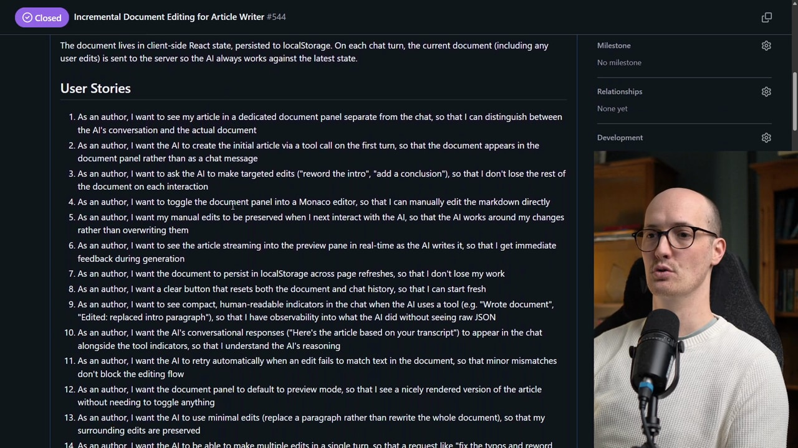
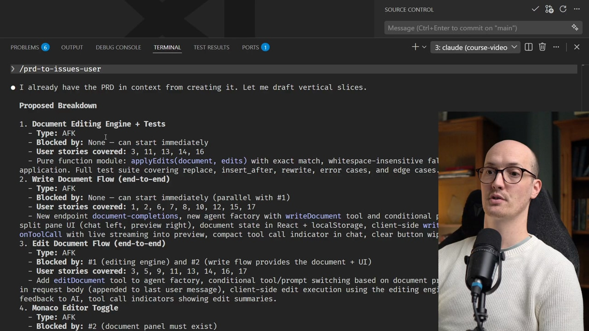
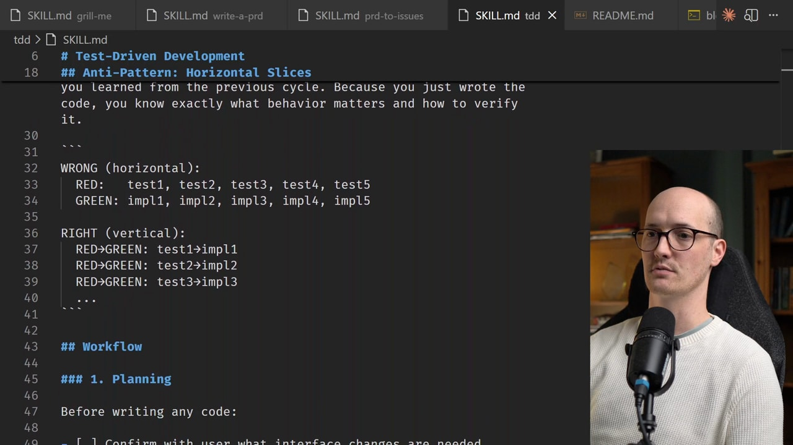
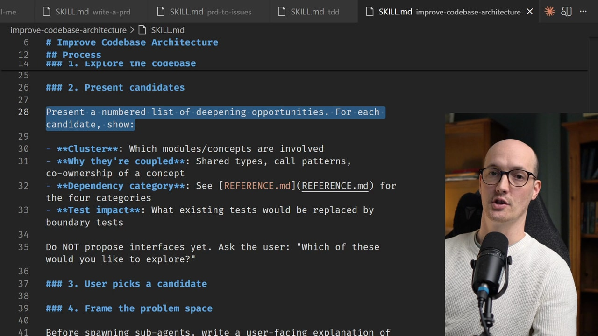
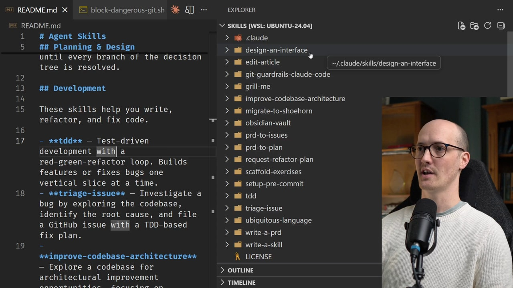
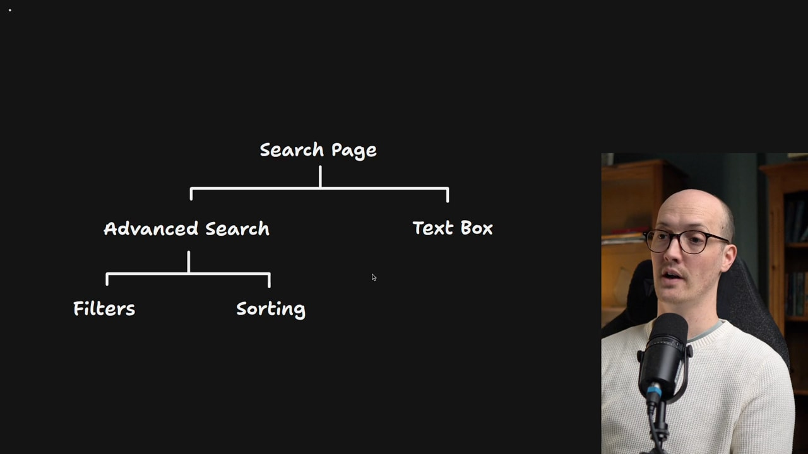
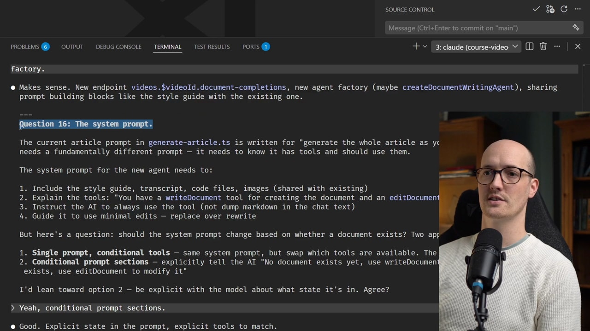

## 摘要（Summary）

這是 Matt Pocock 在 AI Engineer 大會（2026-04-24）的 96 分鐘 hands-on 工作坊，主題是「用 Claude Code agent 走完從模糊需求（vague brief）到生產級功能（production feature）的完整工作流」。Matt 不講高大上的願景，而是把他自己 `.claude/` 目錄裡每天在用的 5 個 skill 一個一個 demo：`/grill-me` → `/to-prd` → `/to-issues` → `/tdd` → `/improve-codebase-architecture`，並佐以對應的兩篇文章（[grill-me 爆紅文](https://www.aihero.dev/my-grill-me-skill-has-gone-viral)、[5 Agent Skills I Use Every Day](https://www.aihero.dev/5-agent-skills-i-use-every-day)）與已累積 86K stars 的 [mattpocock/skills](https://github.com/mattpocock/skills) repo（共 28 個 skill）。

> [!important] 為什麼這場 workshop 值得收錄
> 它不是「Claude Code 操作教學」也不是「prompt 範本合集」，而是一套**完整的人機協作工作流哲學**：把 AI 當「沒有記憶的工程師同事」對待，用嚴格流程（process）補上 AI 的能力缺口。
> 對應的 repo 86K stars 是這套方法論在開發社群已被廣泛驗證的證據。

---

## 關鍵洞察（Key Insights）

> 講者貫穿全場的 5 條核心論點（thesis），不是 skill 清單，而是 mental model：

### 1. 軟體工程基礎依然萬能（AI ≠ 新範式）

AI 不會推翻過去 30 年的軟體工程經驗，反而**強化了基礎原則的重要性**：領域驅動設計（Domain-Driven Design, DDD）、測試驅動開發（Test-Driven Development, TDD）、模組化（Modularization）、深模組（Deep Modules）等。Martin Fowler《Refactoring》、Hunt & Thomas《Pragmatic Programmer》、Frederick Brooks《The Design of Design》這些「老書」對 AI 編碼依然有效——Matt 在影片結尾甚至直接推薦觀眾上 Amazon 買 20 年前的 CS 書籍。

### 2. LLM 有「智能區」與「愚蠢區」（~100K Token 是臨界點）

引用 Human Layer 創辦人 Dex Hardy 的觀察：

> [!quote] LLM 的 attention 是 token 數的二次方成本
> 對話初期（Smart Zone）注意力關係少，LLM 最聰明；每加一個 token，attention 關係呈二次方增長。約 100K token 後進入 Dumb Zone（愚蠢區），輸出品質劇降——**不管 context window 名目上有多大**。
> 隱喻：像足球聯賽加隊伍，總比賽數呈二次方增長。

**對應策略**：用小粒度任務（small-grain tasks）避開 Dumb Zone，每個 session 都從 fresh context 開始。

### 3. Context 設計優於 Compacting（Memento 模式）

Claude Code 與多數 agent 預設用 **Compacting**（摘要會話歷史以壓縮 context）。Matt 強烈反對：

> [!warning] Compacting 的問題
> - 摘要不可預測：同樣的對話壓縮兩次結果可能不同
> - 沉澱（sediment）累積：模糊細節殘留，污染後續推理
> - 行為難重現：你無法保證下一次同一指令會走相同路徑

**Matt 的偏好**：每個 session 結束就 `clear context`，下一次完全從零開始（Memento 模式 — 引用同名電影主角短期失憶的設定）。配合：
- **Token 計數器**必備：時時看距離 100K 還有多遠
- **System prompt 極小化**：放在 context 開頭的東西要嚴格控制

### 4. 垂直切片勝過水平分層（Tracer Bullet）

AI agent 在面對 PRD 時，**預設傾向會用水平分層**：先寫所有 schema → 再寫所有 API → 最後寫所有 UI。問題是：你直到 Phase 3 才看到端到端是否能跑。

> [!tip] Tracer Bullet（追蹤彈）的隱喻
> 防空槍手射出的追蹤彈會發光，幫他即時校準瞄準。每個任務也應該是一條**垂直切片**：完整貫穿 schema + API + UI + tests，每完成一片就能 demo 與驗證。
> 來自 *The Pragmatic Programmer* 第二章。

### 5. 計畫只是目標，QA 才是決勝點

> [!important] 不要花太多力氣完美化 PRD
> PRD 只是「目的地路標」（destination document），真正決定品質的是測試與代碼審查。投入時間在 QA 而非「優化計畫文件」。

對應的具體實踐：完成後的 PRD 應該刪除或關閉，避免 **doc rot（文件腐爛）** 誤導後續的 AI agent（用 GitHub closed issues 替代）。

---

## 完整工作流：日班 vs 夜班（Day Shift / Night Shift）

> [!important] 兩個 shift 是這套工作流的核心架構
> **日班**人類在迴圈內主導對齊與設計，**夜班**人類退出讓 AI AFK（Away From Keyboard）自動完成實作。

### 系統時序圖

```
┌─────────────────── 日班（Day Shift — 人類主導）────────────────────┐
│                                                                    │
│  💡 想法（vague brief）                                            │
│         │                                                          │
│         ▼                                                          │
│  ┌─────────────────┐                                               │
│  │  /grill-me      │  ── sub-agent ──►  📂 探索 codebase           │
│  │  (深度提問)     │  (燒 93.7K token   建立共同設計概念            │
│  │                 │   但主 agent 不爆) (Shared Design Concept)    │
│  └────────┬────────┘                                               │
│           │ Grilling session 紀錄                                  │
│           ▼                                                        │
│  ┌─────────────────┐                                               │
│  │  /to-prd        │  ── 寫入 ──►  📄 PRD（含 user stories）        │
│  │  (合成 PRD)     │              發到 issue tracker                │
│  └────────┬────────┘                                               │
│           │                                                        │
│           ▼                                                        │
│  ┌─────────────────┐                                               │
│  │  /to-issues     │  ── 拆解 ──►  📋 垂直切片 issues + DAG         │
│  │  (拆垂直切片)   │              標記 HITL / AFK + 依賴關係         │
│  └────────┬────────┘                                               │
│           │                                                        │
└───────────┼────────────────────────────────────────────────────────┘
            │ 人類退出迴圈 ─────────────┐
            ▼                          │
┌──────────────────── 夜班（Night Shift — AI AFK 主導）─────────────┐
│                                                                    │
│  ┌──────────────────────────────────────────────┐                  │
│  │  Ralph Loop（once.sh / afk.sh in Docker）    │                  │
│  │                                              │                  │
│  │   ┌─► Pick next AFK issue ─┐                 │                  │
│  │   │                        │                 │                  │
│  │   │   /tdd (red→green→ref) │                 │                  │
│  │   │           │            │                 │                  │
│  │   │   Commit & push ───────┘                 │                  │
│  │   │                                          │                  │
│  │   └── 直到 "no more tasks" ─►                │                  │
│  └──────────────────────┬───────────────────────┘                  │
│                         │                                          │
│  Sandcastle 並行框架：依 DAG 拆 Planner → 多 Worker → 合 merge      │
│                         │                                          │
└─────────────────────────┼──────────────────────────────────────────┘
                          │
                          ▼
                  📦 PR / commits（人類 review）
                          │
                          ▼
            🔧 /improve-codebase-architecture（每週跑一次）
```

---

## 五個核心 Skills 串接說明

> 以下五節對應影片時間軸與 [5 Agent Skills I Use Every Day](https://www.aihero.dev/5-agent-skills-i-use-every-day) 文章結構。每節含：定位、SKILL.md 摘錄、影片時間戳。

### Skill 1：`/grill-me`（深度提問，達成共同設計概念）

**定位**：把模糊想法逼成清晰需求。影片 **12:00–30:00** 完整 demo。

**SKILL.md 原文**（[mattpocock/skills/productivity/grill-me/SKILL.md](https://github.com/mattpocock/skills/blob/main/skills/productivity/grill-me/SKILL.md)）：

```markdown
---
name: grill-me
description: Interview the user relentlessly about a plan or design until reaching shared understanding, resolving each branch of the decision tree. Use when user wants to stress-test a plan, get grilled on their design, or mentions "grill me".
---

Interview me relentlessly about every aspect of this plan until we reach a shared understanding. Walk down each branch of the design tree, resolving dependencies between decisions one-by-one. For each question, provide your recommended answer.

Ask the questions one at a time.

If a question can be answered by exploring the codebase, explore the codebase instead.
```

**關鍵設計**：
- **Walk down each branch of the design tree** — 概念來自 Frederick Brooks《The Design of Design》。設計如樹，每個決策節點都有分支，必須走遍才不會留懸空問題。
- **Provide your recommended answer** — Matt 後來加入這句，AI 在問問題的同時給出推薦答案。用戶常常只要回「yes」就夠，**對話速度大幅加快**。
- **Sub-agent 委派**：grill-me 會建立子 agent 做探索（在 Opus 上可燒掉 93.7K token），但主 agent context 不會爆炸——這是控制 100K token 臨界點的關鍵技巧。

> [!tip] 影片 demo：Cadence 課程平台遊戲化
> Demo 案例是 Sarah Chen 想為 Cadence 加入「遊戲化」（gamification）功能。grill-me 問了 16 個問題（複雜功能可達 30–50 個），逐一拆解：點數經濟、行為對應、儀表板呈現等。最終產出一份 **Grilling Session 紀錄**（不是計畫，是對話記錄）。

→ **深入剖析請見 [[2026-03-23-GRILL-ME-SKILL-DEEP-DIVE]]**

---

### Skill 2：`/to-prd`（從對話合成 PRD）

**定位**：把 grilling 對話直接轉成可讀 PRD，不再做訪談。影片 **30:00–45:00**。

**SKILL.md 重點摘錄**：

```markdown
---
name: to-prd
description: Turn the current conversation context into a PRD and publish it to the project issue tracker. Use when user wants to create a PRD from the current context.
---

This skill takes the current conversation context and codebase understanding and produces a PRD. Do NOT interview the user — just synthesize what you already know.
```

**PRD 模板涵蓋**：
1. Problem Statement（用戶視角）
2. Solution（用戶視角）
3. **User Stories**（重點，採 Agile 格式）：`As an <actor>, I want a <feature>, so that <benefit>`
4. Implementation Decisions（模組清單、介面、架構決策）— **不放具體檔案路徑**，避免速朽
5. Testing Decisions（測什麼、像哪些既有測試）
6. Out of Scope
7. Further Notes

> [!warning] 關鍵原則：不放具體 code snippet 或檔案路徑
> 除非那段是「決策本身的精確編碼」（state machine、reducer、schema、type shape），否則 PRD 不放程式碼——它會迅速過時誤導後續 agent。



---

### Skill 3：`/to-issues`（PRD 拆解為垂直切片 issues）

**定位**：PRD 是「目的地」，issues 是「旅程」。影片 **44:00–53:00**。

**SKILL.md 核心規則**：

```markdown
### 3. Draft vertical slices

Break the plan into **tracer bullet** issues. Each issue is a thin vertical slice
that cuts through ALL integration layers end-to-end, NOT a horizontal slice of
one layer.

Slices may be 'HITL' or 'AFK':
- HITL slices require human interaction (e.g., architectural decision, design review)
- AFK slices can be implemented and merged without human interaction
- Prefer AFK over HITL where possible.
```

**關鍵設計**：
- 每個 issue **獨立可抓取**（independently grabbable）
- 標註 **HITL（Human-in-the-Loop）vs AFK（Away From Keyboard）** — 用戶睡覺也能跑的是 AFK
- 標註 **Blocked by** 形成 DAG（Directed Acyclic Graph）
- **支援並行**：DAG 中沒有依賴關係的 issue 可同時派給多個 agent

```
範例 DAG：
       ┌─► Issue B (AFK)  ──┐
Issue A┤                    ├─► Issue D (AFK)
 (HITL)│                    │
       └─► Issue C (AFK)  ──┘

→ B 和 C 可並行（不互相依賴）
```



---

### Skill 4：`/tdd`（紅綠重構迴圈 + 垂直切片）

**定位**：執行階段的品質防線。影片 **66:00–78:00**。

**SKILL.md 核心哲學**：

```markdown
**Core principle**: Tests should verify behavior through public interfaces,
not implementation details. Code can change entirely; tests shouldn't.

**Good tests** are integration-style: they exercise real code paths through
public APIs. A good test reads like a specification.

**Bad tests** are coupled to implementation. They mock internal collaborators,
test private methods. The warning sign: your test breaks when you refactor,
but behavior hasn't changed.
```

**Anti-Pattern：Horizontal Slices**

```
WRONG (horizontal — 一次寫完所有測試再寫實作):
  RED:   test1, test2, test3, test4, test5
  GREEN: impl1, impl2, impl3, impl4, impl5

RIGHT (vertical — 一個 test 跟一個 impl 配對):
  RED→GREEN: test1→impl1
  RED→GREEN: test2→impl2
  RED→GREEN: test3→impl3
  ...
```

> [!warning] 為什麼禁止「先寫完所有測試」？
> - Bulk 寫的 test 測的是**想像的行為**而非實際行為
> - 容易測「形狀」（資料結構、簽名）而非用戶可感知行為
> - 重構時不敏感：行為壞了還是 pass、行為沒事卻 fail
> - **你跑在頭燈前面**（outrun your headlights）

**測試邊界的關鍵**：Matt 強調不要每個小函數獨立測試，而是**模組級**：例如影片編輯器的整個流程當成一個 deep module 來測，內部用 TypeScript discriminated union 包裝。AI 看到完整流程就能做完整改動、跑完整測試。



---

### Skill 5：`/improve-codebase-architecture`（找 deepening opportunities）

**定位**：定期維護，讓 codebase 對 AI agent 更友善。影片 **81:00–85:00**。

> [!quote] Matt 的金句
> 「如果只能從這場 workshop 帶走一件事，就去跑這個 skill。」

**核心概念：Deepening Opportunities**（深化機會）—— 把 shallow module 改寫成 deep module。

**Deep Module 定義**（來自 John Ousterhout《A Philosophy of Software Design》）：
- **Shallow Module**：介面複雜度幾乎等於實作複雜度（很多薄薄的小函數）
- **Deep Module**：簡單介面背後封裝大量功能（高 leverage）

**Skill 的 glossary（必須一致使用）**：

| 詞 | 定義 |
|----|----|
| **Module** | 任何有介面與實作的東西（function / class / package / slice） |
| **Interface** | 呼叫方需要知道的一切：types、invariants、error modes、ordering、config |
| **Implementation** | 內部 code |
| **Depth** | 介面的 leverage：小介面背後有很多行為 |
| **Seam** | 介面所在的位置；行為可以被替換而不需就地修改 |
| **Adapter** | 在 seam 上滿足介面的具體實作 |

**關鍵原則：Deletion Test**

> 想像把這個 module 刪掉。如果複雜度消失了，它本來就是 pass-through（多餘）。如果複雜度在 N 個呼叫方那邊重現了，它就值得存在。

**One adapter = hypothetical seam. Two adapters = real seam.** — 只有一個實作的「介面」很可能只是過度抽象。



---

## Repo 全景：mattpocock/skills 完整 28 個 Skills



> 截至 2026-05，repo 已累積 **86,788 stars / 7,548 forks**。MIT License。
> 安裝：`npx skills@latest add mattpocock/skills`

### Engineering（10）— 日常 coding skill

| Skill | 一句話 |
|------|------|
| **diagnose** | 硬 bug 與性能回歸的紀律診斷：再現→最小化→假設→檢測→修復→回歸測試 |
| **grill-with-docs** | 反覆訪談 + 同步更新 CONTEXT.md 和 ADR，建立 ubiquitous language |
| **improve-codebase-architecture** | 找 deepening opportunities，把 shallow modules 深化 |
| **prototype** | 拋棄式原型驗證設計（狀態機或 UI），答完問題就刪除 |
| **setup-matt-pocock-skills** | 初始化：問題追蹤系統、triage 標籤、領域文件位置 |
| **tdd** | 紅綠重構 + vertical slices + 集成測試優先 |
| **to-issues** | PRD/計畫拆成獨立 issue + DAG 依賴關係 |
| **to-prd** | 從當前對話合成 PRD（不訪談） |
| **triage** | issue 狀態機管理：需評估 → 等資訊 → AFK ready → 人工 → 不做 |
| **zoom-out** | 抽象層更高的指令（`disable-model-invocation: true`） |

### Productivity（4）— 跨 domain 的工作流

| Skill | 一句話 |
|------|------|
| **caveman** | 超低 token 模式，刪冗詞，~75% token 節省 |
| **grill-me** | 無文件的反覆訪談，窮盡決策樹分支 |
| **handoff** | 交接文件給下一個 agent |
| **write-a-skill** | 建立新 skill（含 progressive disclosure 與資源結構） |

### Misc（4）

| Skill | 一句話 |
|------|------|
| **git-guardrails-claude-code** | 攔截危險 git 指令（`push --force`、`reset --hard`、`clean -f`） |
| **migrate-to-shoehorn** | 用 `@total-typescript/shoehorn` 替換 `as` cast |
| **scaffold-exercises** | 建立課程練習目錄（章節 + 練習編號 + problem/solution/explainer） |
| **setup-pre-commit** | Husky + lint-staged + Prettier 配置 |

### Personal（2）/ In-Progress（4）/ Deprecated（4）

剩 10 個分別是 Matt 個人專用（edit-article、obsidian-vault）、實驗草稿（review、writing-beats、writing-fragments、writing-shape）、與已停用（design-an-interface、qa、request-refactor-plan、ubiquitous-language）。

---

## 四大失敗模式與對應 Skill

> Matt 把整套 skills 的設計動機歸納為「修復 4 個 AI 編碼常見失敗模式」（來自 repo README）：

| 失敗模式 | 根本原因 | 對應 Skill |
|---------|--------|----------|
| **錯位（Misalignment）** | 溝通間隙、共同概念缺失 | `/grill-me`、`/grill-with-docs` |
| **冗長（Verbosity）** | 缺少共享領域語言 | `/grill-with-docs`（建立 CONTEXT.md） |
| **代碼品質（Buggy Code）** | 反饋循環不足 | `/tdd`、`/diagnose` |
| **架構腐爛（Ball of Mud）** | 缺乏日常設計投資 | `/to-prd`、`/zoom-out`、`/improve-codebase-architecture` |

---

## Demo 案例：Cadence 課程平台遊戲化

> 整場 workshop 的串場 demo：一個叫 Cadence 的 CMS，內含瀏覽器內建影片編輯器（瀏覽器內、hardcore engineering）。

- **觀察到的問題**：學生 sign up 後 drop off，留存率低
- **客戶簡報**（PM Sarah Chen）：要加入「gamification」
- **完整流程展示**：
  1. `/grill-me <client-brief.md>` → 16 個問題逐一拆解（點數經濟、行為對應、儀表板）
  2. `/to-prd` → 產出含 user stories 的 PRD
  3. `/to-issues` → 拆成 vertical slices（含 HITL/AFK 標記與 DAG）
  4. Ralph Loop（`afk.sh` in Docker sandbox）→ AI AFK 自動實作
  5. `/tdd` 確保每個 slice 都有測試





---

## Push vs Pull 編碼標準（影片 87:00–91:00）

> [!info] 兩種把編碼標準注入 AI 的方式

| 策略 | 機制 | 適用對象 |
|------|------|--------|
| **Push** | 寫在 `CLAUDE.md`，每個 prompt 都自動帶 | **審查者 / Reviewer**（強制看到） |
| **Pull** | 寫成 skill，AI 自行決定是否 invoke | **實作者 / Implementer**（按需查閱） |

**工作流**：
```
實作者 ──[Pull 編碼標準]──► 寫代碼
              │
              ▼
審查者 ──[Push 編碼標準]──► 驗證代碼
```

---

## Sandcastle：並行執行框架（影片 90:00–96:00）

Matt 自製 TypeScript 框架，解決「多個 agent 並行」：
- `run()` 建立 **git worktree** + **Docker sandbox** 隔離
- **Planner agent**：讀 Kanban，依 DAG 算出每個 phase 可並行的 issue
- **多個 Worker agent**：同時實作不同 issue
- 完成後 merge 回主分支

---

## 安裝與設定

```bash
# 1. 安裝 skills 到當前 .claude/ 目錄
npx skills@latest add mattpocock/skills

# 2. 必選：執行初始化 skill
/setup-matt-pocock-skills
# 會問你：
#  - 用什麼 issue tracker（GitHub / GitLab / Local markdown / Other）
#  - 5 個 triage 標籤要對應到 repo 哪些 label
#  - CONTEXT.md / docs/adr/ 放在哪裡
```

初始化會產生：
- `AGENTS.md`（或 `CLAUDE.md`）加入 `## Agent skills` 區塊
- `docs/agents/issue-tracker.md`
- `docs/agents/triage-labels.md`
- `docs/agents/domain.md`

---

## 對比視角：三方並列 — Matt Pocock vs Garry Tan vs Jesse Vincent

> [!important] 為什麼要三方對比閱讀
> 同樣是「AI 編碼工作流方法論」，2026 年最有影響力的三套方案各自代表了**完全不同的設計哲學**。把三者並列閱讀，能跳出單一視角綁架。
> - **Matt Pocock**（本文）— 5 skills + 日班/夜班分工
> - **Garry Tan**（YC 總裁）— Tokenmaxxing + GStack 400× 生產力 → [[2026-05-17-GARRY-TAN-TOKENMAXXING-GSTACK-400X-PRODUCTIVITY]]
> - **Jesse Vincent / obra**（194K stars）— Superpowers 13 個自動/手動觸發 skill → [[2026-04-08-SUPERPOWERS-13-SKILLS-PRACTICAL-WALKTHROUGH]]

### 三方核心對照

| 維度 | **Matt Pocock** | **Garry Tan** | **Jesse Vincent（Superpowers）** |
|------|----------------|--------------|----------------------------------|
| **角色定位** | 全職 AI 教師、`.claude/` 開源者 | YC 總裁、兼職 hacker（13 年沒寫 code） | 長期 dev tools 開源開發者 |
| **Repo Stars** | 86K | 不公開（個人） | **194K（最高）** |
| **工作流名稱** | 5 skills pipeline | GStack（Plan-Eng-Review → CEO Plan） | Superpowers（Design→Plan→Test→Quality）|
| **Skill 數量** | 28（含停用，每天用 5） | 23 個專家角色 | 13（6 核心 + 7 輔助） |
| **核心隱喻** | 日班 / 夜班分工 | 時間億萬富翁、煮沸海洋 | Skills = Superpowers |
| **觸發機制** | 主要手動 `/skill-name` | 手動斜槓 `/CEO review` 等 | **自動 + 手動雙軌**（4 自動 / 9 手動）最強制 |
| **強制力** | 中（靠人記得 invoke） | 弱（靠自律） | **最強**（verification 阻止 AI 自我聲稱完成） |
| **Token 觀** | **Memento 模式**（每 session 清空、節省） | **Tokenmaxxing**（不計成本、$500/天） | 未明確表態（中性） |
| **Skill 哲學** | 短而精（grill-me 428 bytes） | Fat Skills（Markdown = 代碼） | 6 核心 + 7 輔助分層 |
| **對齊機制** | `/grill-me` design tree 遍歷 | CEO Plan / 10x 元提示詞 | `brainstorming`（自動觸發）|
| **計畫產物** | PRD 用 issue tracker；完成即刪 | CEO Plan 文件 + Office Hour 對話 | **強制檔案化** `docs/superpowers/specs/` + `plans/` |
| **拆解原則** | Vertical Slices / Tracer Bullets | 80–90% 覆蓋夠用 | 計畫文件拆步驟 + sub-agent 並行 |
| **測試 TDD** | red-green-refactor 一個對一個（禁 horizontal） | 80–90% 覆蓋夠 | **強制 TDD**（自動觸發） + verification 強制證據 |
| **工具偏好** | 主要 Claude Code | Claude Code + Codex + Playwright | **7 個 harness 全支援**（CC/Codex/Cursor/Gemini/OpenCode/Droid/Copilot） |
| **doc rot 立場** | 完成後刪 PRD（避免誤導未來 AI） | 不在意 | **保留 specs**（給接手人） |
| **典型 demo** | Cadence 課程遊戲化 | Garry's List（Posterous 第三次重構，1 人/5 天/$200） | 廣告回傳功能（卡卡實戰） |
| **核心金句** | 「不要優化 PRD，**QA 才是決勝點**」 | 「物理代碼行數毫無意義，**邏輯代碼密度**才是」 | 「Skills 不是讓 AI 變聰明，是讓 AI **變靠譜**」 |

### 三人共同點

雖然路線各異，三人在以下幾點高度一致：

1. **Human in the Loop 永遠不可替代**：人類負責方向、價值判斷；AI 負責執行
2. **AI 編碼需要嚴格流程**：不是「prompt 完等結果」，而是有結構的工作流
3. **Markdown / Skill 是新時代的編程語言**（與 [[2026-04-29-ANDREJ-KARPATHY-FROM-VIBE-CODING-TO-AGENTIC-ENGINEERING-SOFTWARE-3-0|Karpathy 的 Software 3.0]] 完全同調）
4. **個人開發者可達團隊級產出**：三人都從個人實戰累積出方法論

### 三人最大歧見（值得辨識）

| 議題 | Matt Pocock | Garry Tan | Jesse Vincent |
|------|------------|-----------|---------------|
| **Token 該怎麼花？** | 節省（lean session）| **不計成本**（Boil the Ocean） | 不表態 |
| **計畫文件保留？** | **刪除**（避免 doc rot） | 中性 | **保留**（給接手人） |
| **觸發 skill 該強制嗎？** | 中（依賴使用者） | 弱（靠自律） | **強**（自動觸發 + verification 把關）|
| **多 harness 支援？** | 主 Claude Code | 主 CC+Codex | **7 harness 全支援** |
| **TDD 嚴格度？** | **嚴格 vertical** | 80–90% 覆蓋夠 | **強制**（但允許靈活）|

### 設計取向地圖（哲學定位）

```
              強制 / 紀律 high
                    │
                    │
                Superpowers ★   ←── 4 自動 skill + verification
                    │           不准 AI 自我聲稱完成
                    │
                    │
    Matt Pocock ●   │   ● GStack
                    │
                    │
              鬆散 / 自由 high
        ←───────────────────────►
       人類驅動                AI 驅動
       （/grill-me             （AI AFK + CEO Plan
        每步等對齊）            一次 review 多步）
```

### 矛盾如何調和？

> [!tip] 三者可以同時使用（且互相強化）
>
> **Token 觀**：Matt 講的是「**單 session 內**」要 lean（每 session 清空、不超過 100K）；Garry 講的是「**整體成本投入**」不要省。**同時採用**：每個 session 維持 lean，但整體不省下開新 session 跑深度研究的成本。
>
> **計畫文件**：Matt 反對 doc rot、Jesse 力推保留。**折衷**：把 specs/plans 標註 status（active / archived），完成的 archived 用 LLM 主動 ignore（folder 加 `.aiignore` 之類）。
>
> **強制度**：Superpowers 的 verification 機制最強，可作為「最後一關」普遍套用；中間階段選 Matt 的精緻 grill-me 或 Garry 的快速 CEO Plan。

### 該採用哪一套？（升級版三方推薦）

| 情境 | 推薦 |
|------|------|
| **新手 / 想最少思考就上手** | **Superpowers**（4 自動 skill 把關，AI 沒法偷懶）|
| **中等複雜度、需求模糊、要對齊深** | Matt（grill-me 起手深度問答）|
| **個人 hacker、有預算、求速度** | Garry（CEO Plan + Tokenmaxxing）|
| **大型 codebase 重構** | Matt（improve-codebase-architecture）|
| **從零打造 MVP** | Garry（Tokenmaxxing 全速）|
| **嚴謹品質要求（醫療/金融）** | Matt TDD + **Superpowers verification 雙保險** |
| **創業 demo / hackathon** | Garry（80% 覆蓋夠用）|
| **團隊協作 / 多 harness 混用** | **Superpowers**（7 harness 全支援 + 強制流程）|
| **教學 / 訓練新人 AI workflow** | **Superpowers**（文件最齊全、流程最清晰）|
| **個人 side project** | Garry（簡化 review）或 **Superpowers**（更穩）|

### 終極建議：可以全部裝、按情境切換

```
日常 baseline：Superpowers（自動把關）
  │
  ├─ 需求很模糊 ────► 切 Matt grill-me 做深度對齊
  │
  ├─ 趕 demo / hackathon ──► 切 Garry CEO Plan 全速
  │
  ├─ 大型重構 ──────► Matt /improve-codebase-architecture
  │
  └─ 最後一關 ──────► Superpowers verification-before-completion
                      （永遠用這個把關，最強制）
```

---

## 我的心得（My Takeaways）

1. **「日班 vs 夜班」是這套方法論的精華**，過去看別人講 AI agent 大多停在「給個 prompt 自動做事」這層，Matt 真正回答了「人類什麼時候該退出迴圈」這個問題：對齊 + PRD + 拆 issue 結束後就走人，剩下交給 Ralph Loop。
2. **「不要優化 PRD」這個反直覺建議很關鍵**——容易掉進「為了完美計畫而拖延實作」的陷阱。把計畫當「目的地路標」就好，把心思放在 QA。
3. **垂直切片的概念可遷移到自己的 ingestion 流程**：與其一次把所有文章爬完再批次摘要，不如「爬一篇 → 寫一篇 → cross-ref → commit」一個個收尾。
4. **`/improve-codebase-architecture` 值得每週執行**：對個人 KB 來說就是「每月 review 結構，看有沒有可以合併重組的筆記群」。
5. **Memento 模式（clear context 而非 compact）值得實驗**：尤其在我寫多篇 KB 的場景，每篇都 fresh start 確實比 compact 後繼續更可控。

---

## 待補充（Open Questions）

1. **Ralph Loop 的具體實作細節**？影片只 demo 了 `once.sh`（單次跑），完整版 `afk.sh` 怎麼處理：
   - 跑多久後該停？無限迴圈？
   - 遇到測試失敗怎麼回退？
   - Docker sandbox 的記憶體與磁碟限制？
   - 建議搜尋：`mattpocock afk.sh ralph loop docker`
2. **Sandcastle 框架什麼時候開源**？影片中 demo 了，但沒明確說 release 時間。建議追：`@mattpocockuk` Twitter 與 mattpocock GitHub。
3. **HITL 與 AFK 的判斷標準**怎麼自動化？目前看起來是 AI 自己標，會不會誤判（把該 HITL 的標成 AFK）？
4. **deep module 的「太深」判斷**？例如把整個影片編輯器當成一個 deep module 來測，會不會反而讓單一測試太慢、變更影響範圍太大？建議搜尋：`Ousterhout deep module size threshold`
5. **`/triage` 的 5 個狀態（需評估 / 等資訊 / AFK ready / 人工 / 不做）**在 GitHub Issues 上用什麼 label 結構？是否有現成 setup script？
6. **與 [[2026-05-09-STOP-RANDOM-SKILL-4-CORE-GROUPS-FOR-AGENT-PRODUCTIVITY]] 的 4 group 分類**怎麼對應？Matt 的 6 個分類（engineering / productivity / misc / personal / in-progress / deprecated）能不能映射到「Plan / Build / Verify / Maintain」？
7. **`grill-me` 燒掉 93.7K token 的子 agent 機制**：是 Claude Code 內建的 Task tool 嗎？還是 Matt 自製？參考 [[2026-04-29-CLAUDE-CODE-HOOK-API-SOURCE-DEEP-DIVE]]。

---

## 相關連結（Related）

- [[2026-03-23-GRILL-ME-SKILL-DEEP-DIVE]] — 本篇的姊妹文，深入剖析 `/grill-me` 的設計哲學
- [[2026-05-09-STOP-RANDOM-SKILL-4-CORE-GROUPS-FOR-AGENT-PRODUCTIVITY]] — 另一套 skill 分類框架（4 group：Plan/Build/Verify/Maintain），可與 Matt 的 6 分類對照
- [[2026-04-29-ANDREJ-KARPATHY-FROM-VIBE-CODING-TO-AGENTIC-ENGINEERING-SOFTWARE-3-0]] — Karpathy 對 vibe coding → agentic engineering 的同調觀點
- [[2026-03-17-LESSONS-FROM-BUILDING-CLAUDE-CODE-HOW-WE-USE-SKILLS]] — Anthropic 官方對 skill 設計的看法，可與 Matt 的實戰風格對照
- [[2026-04-08-7-RULES-FOR-CREATING-EFFECTIVE-CLAUDE-CODE-SKILL]] — skill 撰寫規則，可印證 Matt 的「短而精」風格
- [[2026-03-25-THREE-AI-CODING-FRAMEWORKS-SUPERPOWERS-GSD-GSTACK]] — 其他 AI coding framework 比較，可看 Matt 的 skills 與 Superpowers/GSD 的差異
- [[2026-03-18-5-AGENT-SKILL-DESIGN-PATTERNS-EVERY-ADK-DEVELOPER-SHOULD-KNOW]] — 通用 skill 設計模式
- [[2026-05-17-GARRY-TAN-TOKENMAXXING-GSTACK-400X-PRODUCTIVITY]] — **三方對照 #2**：另一條路線（Tokenmaxxing + GStack），Token 觀與 skill 哲學與本文截然相反
- [[2026-04-08-SUPERPOWERS-13-SKILLS-PRACTICAL-WALKTHROUGH]] — **三方對照 #3**：最強制 + 多 harness 的 Superpowers（194K stars），自動觸發 + verification-before-completion 機制最值得借鏡

---

## 知識層次分析（Bloom's Taxonomy Analysis）

> 以下從五個認知層次對本篇內容進行結構化分析，協助從記憶到評估逐層深化理解。

| 認知層次 | 核心目的 | 對本文的具體應用 |
|---------|---------|--------------|
| **記憶（被動）** | 確認資訊存在 | 5 個 skill 名稱（grill-me / to-prd / to-issues / tdd / improve-codebase-architecture）、100K token 是 Dumb Zone 臨界、Tracer Bullet、Memento 模式、Deep Module、HITL/AFK |
| **理解（半被動）** | 解釋概念的含義及關聯 | 5 個 skill 形成「對齊 → 規劃 → 拆解 → 實作 → 維護」的完整 pipeline；日班/夜班分工對應「人類對齊、AI AFK 實作」；垂直切片同時是「issue 拆解原則」與「TDD 寫測試原則」 |
| **分析（主動）** | 檢驗論點、拆解假設 | Matt 假設「人類退出迴圈後 AI 能 AFK 自動實作」需 Docker sandbox + 詳細 PRD + AFK 標記，**前提是 codebase 已經架構良好**（否則 AI AFK 跑半天結果一團糟）；Tracer Bullet 假設「每個切片都可獨立 demo」對 backend-only 任務難成立 |
| **應用（主動）** | 將知識套用情境 | 1) 把「Memento 模式」套用到 KB ingestion：每篇文章 fresh context 而非 compact；2) 把「Deletion Test」套用到 KB 既有筆記重組：刪掉這篇複雜度會消失還是擴散？3) 對個人 side project 跑 `/improve-codebase-architecture` 看 deepening 機會 |
| **評估（主動）** | 比較替代方案 | vs 純 Plan Mode：Matt 的方法多了「設計樹遍歷」步驟，適合需求模糊場景；對需求清楚的小修改反而 overkill。vs Superpowers TDD skill：Matt 強調「不要先寫完所有測試」更嚴格；Superpowers 更通用但易掉入 horizontal slicing 陷阱。vs Karpathy AgentHub：Matt 更聚焦個人 dev workflow；AgentHub 更偏 agent infrastructure |

### 分析型追問（Socratic Follow-up）

- **澄清**：「Deep Module」與「Vertical Slice」是同一概念的不同視角，還是兩個獨立原則？前者談模組設計、後者談任務拆解，但有交集（vertical slice 內部可能就是一個 deep module）。
- **假設**：「人類退出迴圈，AI AFK 完成實作」成立的關鍵前提是「PRD + AFK issue 已經足夠精確」。若這個前提崩了（issue 描述模糊），Ralph Loop 會產出垃圾代碼且無人發現，**最壞情況比沒用 AFK 還慘**。
- **證據**：「100K token 後 LLM 變笨」這個說法的實證基礎在哪？Dex Hardy 的觀察是經驗法則還是有 benchmark？不同模型（Opus / Sonnet / Haiku / GPT）的臨界點是否一致？
- **觀點**：反對者可能說「這套流程太重，小 feature 用一行 prompt 就解決了，何必 grill 16 個問題？」——值得辨識這套方法的 sweet spot 是「中等複雜度、需求模糊」的任務，不是萬用解。
- **後果**：若團隊全面採用，12 個月後可能出現的副作用：(a) PRD/issue 寫作耗時遠大於實作；(b) AFK 跑壞了沒人發現；(c) review 變成瓶頸而非實作。

### 方案批判三問（Critical Evaluation）

1. **最大的風險是什麼？** — AFK 模式下 AI 在 Docker sandbox 自動 commit，若 issue 描述有歧義或測試覆蓋不夠，可能產出「測試 pass 但行為錯」的代碼並一路 push。最壞情況：人類醒來發現要 revert 半天份的 commits，或更糟，沒發現而合進主線。
2. **什麼情況下會失敗？**
   - codebase 已是 ball of mud：deep module 改寫風險太大，AI 改一處壞十處
   - 測試文化薄弱：TDD skill 強制要先有測試，但若 codebase 沒有測試骨架，AI 自己寫的測試品質難保證
   - issue 拆解粒度抓不準：太粗 AI 無法 AFK 完成、太細管理成本超過實作成本
   - 個人專案不需要這麼重的 process（grill 16 題寫個小工具完全是 overkill）
3. **有沒有更好的替代方案？**
   - **輕量替代**：[[Superpowers brainstorming + TDD]] 或 Claude Code 內建 Plan Mode，對小 feature 更合適
   - **infra 替代**：[[Karpathy AgentHub]] 提供更通用的多 agent 並行 infra，比 Sandcastle 應用面更廣
   - **混合策略**：把 Matt 的方法用於「新功能 / 重構」，把輕量 prompt-only 用於「bug fix / 小調整」

---

## References

- [Full Walkthrough: Workflow for AI Coding — Matt Pocock (YouTube, 96 min)](https://www.youtube.com/watch?v=-QFHIoCo-Ko)
- [5 Agent Skills I Use Every Day（文章）](https://www.aihero.dev/5-agent-skills-i-use-every-day)
- [mattpocock/skills GitHub Repo](https://github.com/mattpocock/skills)
- [AI Hero 完整 skills 頁面](https://www.aihero.dev/skills)
- 經典參考書：Frederick Brooks《The Design of Design》、Hunt & Thomas《The Pragmatic Programmer》、Ousterhout《A Philosophy of Software Design》、Martin Fowler《Refactoring》
