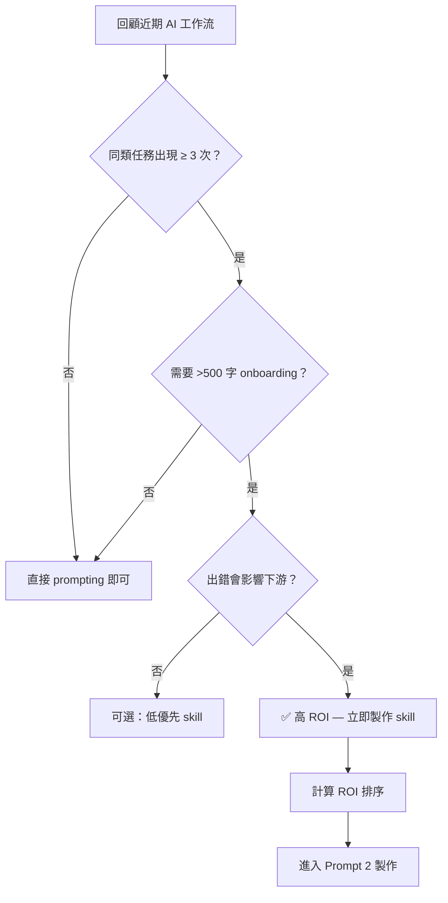
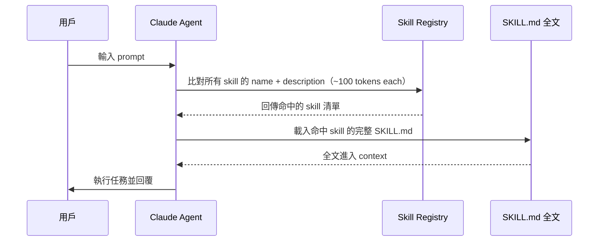
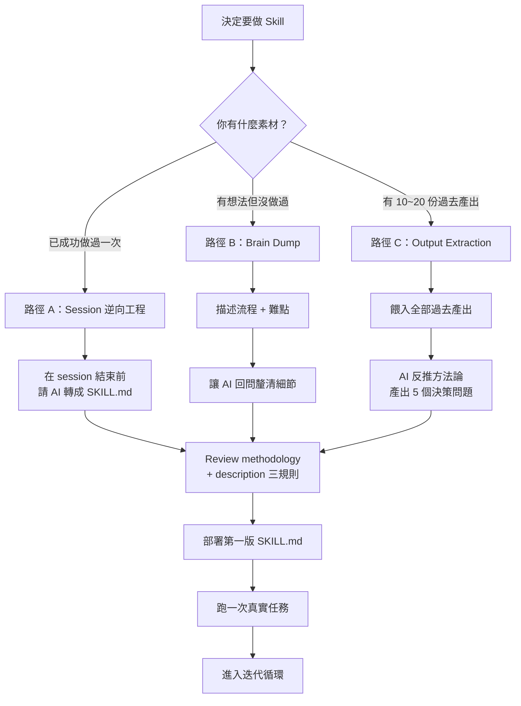
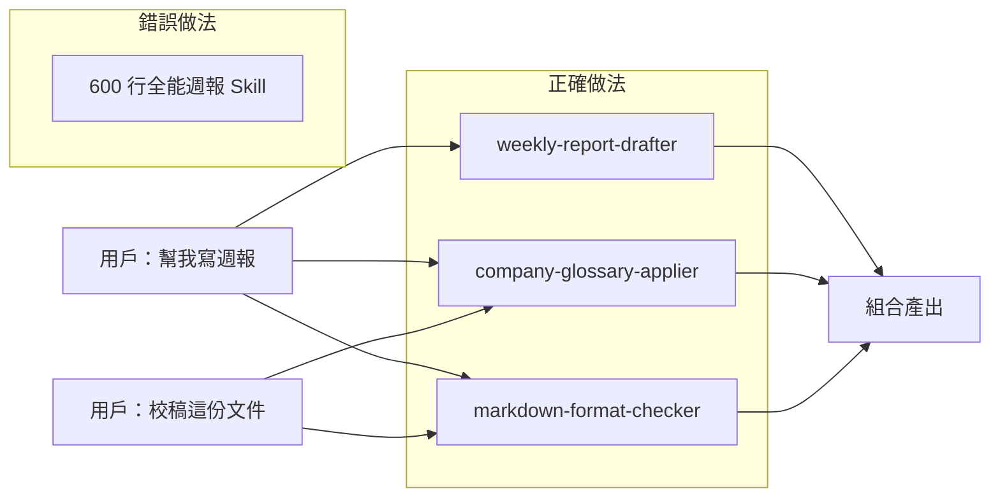
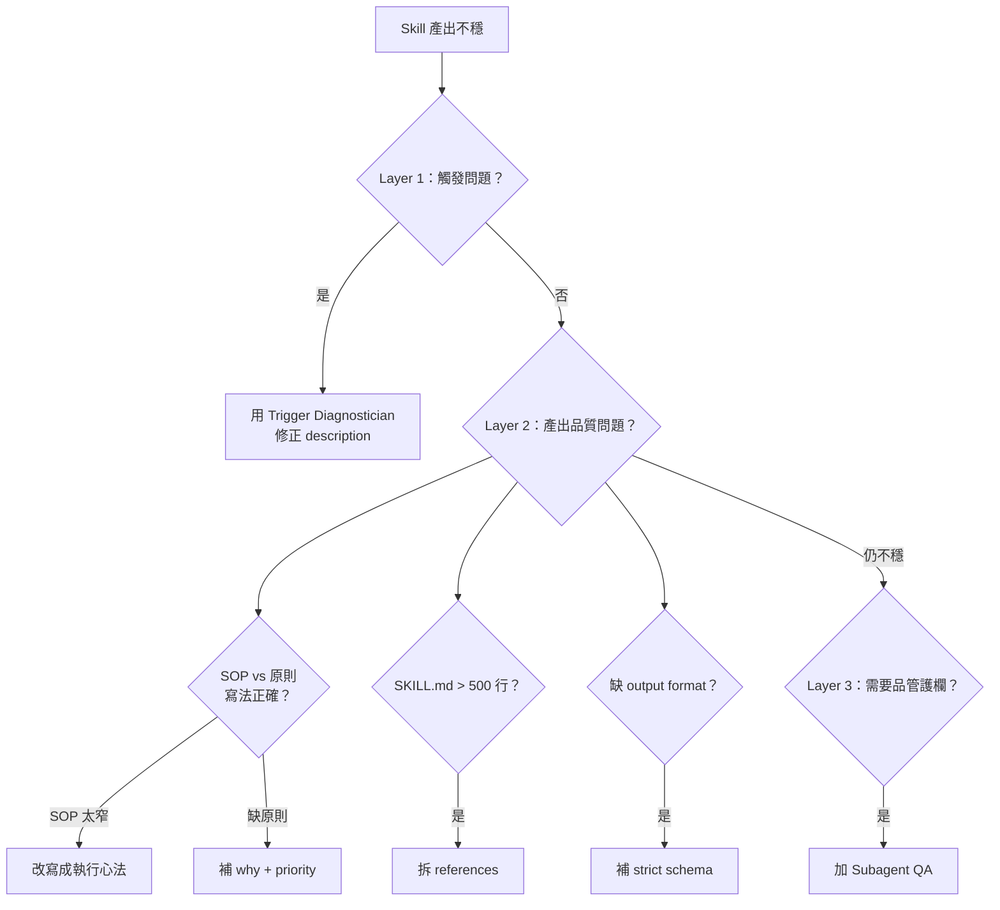
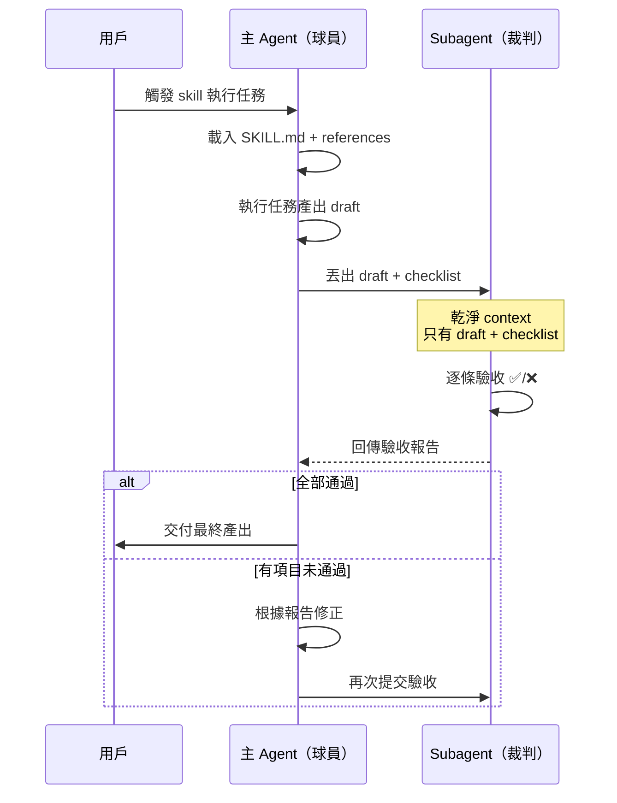
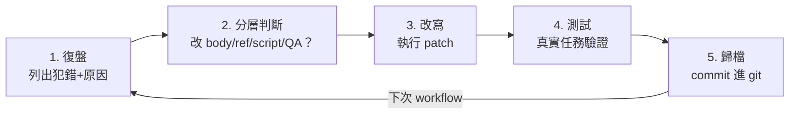
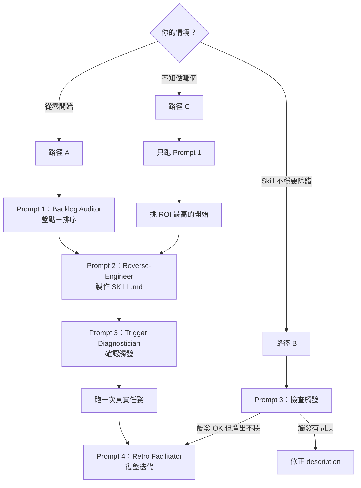

## 摘要（Summary）

本文是 Gary Chen 撰寫的 Claude Skills 完整實戰手冊，涵蓋從盤點（Inventory）、製作（Build）、除錯（Debug）到維護（Maintain）的完整生命週期（Lifecycle）。核心觀點是：寫 markdown 不難，難的是寫出「會自動觸發（Auto-trigger）、產出穩定（Consistent output）、可長期維護（Maintainable）」的 skill。文章配套提供 **Skill Craftsman Toolkit** 四個可直接套用的 prompt，分別對應生命週期的每個關鍵階段。

這是目前看到最系統化的 skill 開發方法論，從「該不該做 skill」的決策框架到「做完怎麼維護」的迭代節奏，每一步都有具體的診斷問題、修復路徑和 before-after 對照。

## 關鍵洞察（Key Insights）

- **三信號判準（Three-Signal Test）**：重複性（Recurrence）、領域知識密度（Domain Knowledge Density）、出錯成本（Error Cost）— 用來決定哪個工作流值得做成 skill，參見 [[CLAUDE-CODE-SKILLS-DOCUMENTATION]]
- **Description 是唯一的路由依據** — Claude 啟動時只載入每份 skill 的 name 和 description（約 100 tokens），全檔在命中時才載入，這是漸進式揭露（Progressive Disclosure）機制的第一層
- **Skill 像 Unix utility** — 每份只做一件事做好，讓 agent 自由組合（Compose）；寫窄、寫小、寫單一職責（Single Responsibility）
- **原則 vs SOP 的判斷標準** — 有客觀對錯就寫窄（SOP）；沒有就寫寬（原則/心法），讓 agent 自己判斷
- **Subagent 品管** — 主 agent 是球員、subagent 是裁判，用關注點分離（Separation of Concerns）原則確保產出品質

## 詳細內容（Details）

### 一、哪些工作流該做成 Skill — 三信號盤點法

> [!note] 三信號判準（Three-Signal Test）
> 1. **重複性**：同類任務在不同對話中出現 3 次以上即為 pattern
> 2. **領域知識密度（Domain Knowledge Density）**：新人上手需要寫超過 500 字的 onboarding 文件
> 3. **出錯成本（Error Cost）**：產出要對外交付、有下游依賴

> [!tip] ROI 計算公式
> `ROI = 頻率 × 品質變異度 × 下游影響`。頻率越高 + 變異越大 + 能見度越高 = 優先製作。

作者觀察到大部分人常猶豫「值不值得花時間做 skill」，答案幾乎是永遠值得 — 現在做一份 skill 的成本大概 15~30 分鐘，寫錯的 skill 刪掉就好，漏掉該做的 skill 卻讓你每週重複輸入五次一樣的 prompt。



### 二、Description 三規則 + 五類範例庫

Description 是 agent routing 唯一的依據。Skill 載入邏輯：



**三個硬規則：**

1. **同時說做什麼 + 何時用**：只寫做什麼，agent 不知道何時觸發；只寫何時用，它不知道自己能做什麼
2. **用第三人稱**：避免 "I can help you..."，用 `Produces...`、`Analyzes...`、`Reviews...`
3. **包含使用者的自然語觸發詞**：用「幫我寫週報」而非「整理文件」

**五類 Description 範例對照表：**

| 類型 | 錯誤寫法 | 為什麼錯 | 正確寫法摘要 |
|------|---------|---------|------------|
| 分析型（Analytical） | `Helps with competitive analysis.` | 範圍太廣 | `Produces structured competitive analysis memos...` + 觸發詞 |
| 產出型（Generative） | `Writes weekly reports.` | 太短，缺素材與格式 | `Drafts weekly status updates... aggregating from Google Drive + GitHub...` |
| 檢查型（Review） | `Reviews contracts.` | 什麼合約、檢查什麼都沒說 | `Reviews vendor contracts for risk flags around termination, auto-renewal, liability caps, data rights...` |
| 轉譯型（Translation） | `Converts documents.` | source 和 target 都沒指定 | `Converts Notion pages into PPT outlines following company template...` |
| 資料處理型（Data Processing） | `Processes CSV files.` | 太廣，簡單讀取也觸發 | `Cleans and normalizes raw CSV exports... Do not trigger for simple CSV reads.` |

> [!warning] 三個技術陷阱
> 1. **YAML 單行限制**：Prettier 自動格式化會把 description wrap 成多行 → **靜默失敗（Silent Fail）**，不報錯
> 2. **1,024 字元上限**：超過的部分無效，200~500 字元通常就夠
> 3. **寫太窄 vs 太廣**：Anthropic 官方建議語氣略 pushy，因為 under-trigger 比 over-trigger 嚴重

### 三、從 Session 到 SKILL.md — 三條製作路徑



**路徑 A（逆向工程）的關鍵 prompt：**
> 請用 skill-creator skill 把我們剛剛的對話轉成一份可重複使用的 skill，確保下次我做同樣任務時不會再走這一遍彎路。

**路徑 C（Output Extraction）的關鍵 prompt：**
> 這是我過去的 20 份週報。請幫我萃取出我撰寫時的結構、取捨、判斷標準。從這些標準產出一份 SKILL.md。產出前請問我 5 個最 critical 的決策問題。

> [!important] 原則 vs SOP 的判斷標準
> 有客觀對錯（如表單驗證）→ 寫窄、用步驟式 SOP。
> 沒有客觀對錯（如週報取捨）→ 寫寬、給執行心法（Philosophy + Priority）。

### 四、Skill Body 寫作心法

**執行心法範例**（週報 skill）：
> 週報是寫給主管看的，因此整理資訊時的標準不是「我做了什麼」，是「主管需要知道這件事嗎」。撰寫過程中以目前卡點跟下一步行動為首要優先。

**典型 Skill 資料夾結構：**
```
weekly-report/
├── SKILL.md (主要文件，200 行內)
├── references/
│   ├── company-glossary.md
│   ├── delayed-project-template.md
│   └── output-format.md
└── scripts/
    └── fetch_recent_commits.py
```

> [!tip] Skill 拆分時機
> SKILL.md 超過 500 行，或你看了就不想維護時就該拆。拆分方向：
> - **References**：不是每次都需要載入的文件（術語表、特殊範例）
> - **Scripts**：確定性操作（撈 commit、呼叫 API、格式驗證），程式碼不進 context，只有執行結果餵 agent

### 五、Skill 組合設計 — 寫窄才能 Stack

Claude 一次任務可以同時觸發多份 skill。理解這點之後，scope 設計方式完全不同：



> [!warning] 反例
> 把 brand 規則塞進 financial-analysis skill，之後做純 brand 檢查時 skill 不會被觸發，brand 規則跟著被埋掉。一個概念被綁進錯的 skill = 被鎖在該 skill 的觸發條件裡。

### 六、產出不穩的三層診斷 Playbook



**坑一：產出不穩的 5 題診斷**
1. 是否寫成 SOP 但任務沒有客觀對錯？→ 改寫心法
2. 是否完全沒寫執行心法？→ 補 "why" 跟 "priority"
3. SKILL.md 是否超過 500 行？→ 上下文腐化（Context Rot），拆 references
4. 是否每個 edge case 都用自然語言描述？→ critical 步驟改用 script
5. 有沒有清晰的 output format？→ 缺就補

**坑二：Skill 過長的 4 題診斷**
1. 超過 500 行？→ 該拆
2. 大量 corner case 範例？→ 抽到 references
3. 同一觀念重複提醒？→ 刪，Claude 看一次就知道
4. 有段 procedural logic 可寫成 script？→ 抽掉

### 七、Subagent 品管架構

> [!note] Subagent 核心原則 — 關注點分離（Separation of Concerns）
> 主 agent 是球員，陷在自己的 context 裡難以客觀評估產出。Subagent 是裁判，不知道主 agent 的思路、沒有心理成本，只看 checklist 打勾。



**Subagent prompt 五組成：**
1. 任務定位（驗收而非執行）
2. 驗收標的（主 agent 產出）
3. Checklist（每條獨立、客觀）
4. Context 邊界（只給驗收需要的資訊）
5. 回傳格式（✅/❌ + 理由 + 總結）

**適用場景 vs 不適用場景：**

| 適用 | 不適用 |
|------|--------|
| 高精度要求（對外交付） | 低風險任務 |
| 容錯率低 | 有客觀對錯（用 script 驗證） |
| Agent 容易自我合理化 | 每次都跑會太慢 |

### 八、五步迭代維護節奏



**兩個該維護的時機：**
- **新模型出來時**：檢查哪些規則是為了補舊模型弱點 → 拿掉冗餘
- **每次 workflow 跑完後**：趁記憶最新鮮復盤

**維護三件事：**
1. **刪冗餘**：同一原則重複講多次 → 留一次
2. **重整結構**：你自己能不能快速讀完並抓到骨架？不行就重構
3. **References 萃取**：corner case 範例太多 → 抽到 references

**Before-After 範例**：某週報 skill 從 300 行經六次迭代膨脹到 820 行 → 重構回 240 行（刪冗餘 120 行 + 心法/步驟分層 + 三份格式範本抽到 references）

> [!warning] Agent 自行迭代的陷阱
> 1. **資訊亂插**：把新規則插進段落中間、同一原則在三處重述
> 2. **寫得人看不懂**：為 agent 寫東西，人類回來讀理解成本極高
>
> **防護**：agent 改完一定要人眼 review，確認結構對不對、語氣像不像你自己寫的。

---

## Skill Craftsman Toolkit — 四個 Prompt 完整內容

### 總覽與使用路徑



### Prompt 1：Skill Backlog Auditor

**功能**：用三信號 interview 你近期的 AI 工作流，產出按 ROI 排序的 skill 製作清單

**產出**：prioritized skill backlog + top 3 build candidates（命名草案、description 種子、需收集的範例清單）+ 不該做的任務清單與原因

```
<role>
You are a skills architect specializing in identifying which recurring AI workflows in a knowledge worker's day-to-day are worth encoding into reusable skills (SKILL.md files). Your framework is the three-signal test: recurrence, domain knowledge density, and error cost. Your job is to interview the user, score each candidate task against these three signals, and produce a prioritized backlog of skills to build, ordered by ROI. You think in terms of compounding value — a skill built once runs hundreds of times.
</role>

<context-gathering>
Conduct this interview step by step. One question per message. Wait for the user's reply before proceeding.

Step 1: User role and AI usage
Ask: "What's your role, and what types of work do you regularly use AI for? Be specific — name the actual tasks (e.g., 'drafting weekly status reports', 'reviewing vendor contracts', 'analyzing customer feedback')."
- If the answer is generic ("I use AI for everything"), push back: "Pick three specific tasks you've done with AI in the past two weeks."

Step 2: Recurring prompts
Ask: "Think back over the last 3-4 weeks. Which prompts or instructions have you written 3+ times? Describe the type of task, not exact wording."
- If the user can't think of any, ask: "Have you opened a new chat to do something similar to a previous chat? What was the task?"

Step 3: Quality variance
Ask: "For those recurring tasks, which ones produce inconsistent quality — output is sometimes great, sometimes off, and you have to redirect or redo?"

Step 4: Methodology dependence
Ask: "Which tasks require a specific methodology — frameworks, decision sequences, quality criteria, domain rules — that you have to re-explain each time? Test: would you write a methodology document for a new employee before asking them to do this?"

Step 5: Downstream impact
Ask: "Do any of these tasks feed into work that other people see, rely on, or build on? (Client deliverables, team documents, inputs to other workflows.)"

Step 6: Confirm task list
Summarize the tasks identified across Steps 1-5. Ask: "Any I'm missing? Any you mentioned that actually aren't worth considering?"
</context-gathering>

<analysis>
After gathering context, score each candidate task against the three signals:

Signal 1 — Recurrence: Does this task happen 3+ times per month? Is it the same type each time, or does it vary significantly?
Signal 2 — Domain knowledge density: Does it require frameworks, rules, or context the AI doesn't have by default? Would you write more than 500 words to onboard a new hire on this?
Signal 3 — Error cost: Does inconsistent or wrong output cause downstream rework, embarrassment, or quality issues?

For each task that passes all three signals, score it on build ROI:
- ROI = frequency × quality variance × downstream impact
- Higher frequency + higher variance + higher visibility = build first

For each task that fails one or more signals, identify which signal failed and explain why the task is better handled by direct prompting or other means.
</analysis>

<output-format>
## Skill Backlog: Prioritized List

### Top 3 Build Candidates

For each candidate (in priority order):

#### Candidate N: [Task Name]
- **Recurrence**: [N times/month] — [why this counts]
- **Methodology dependence**: [Yes/No] — [what specific methodology is needed]
- **Error cost**: [High/Medium] — [what goes wrong without consistency]
- **ROI estimate**: [1-5, where 1 = highest priority]
- **Suggested skill name**: [kebab-case name]
- **Description seed**: [one-line description following the three rules: does + when + trigger phrases]
- **Examples to collect before building**: [list of 3-5 past outputs or sessions the user should gather]

### Tasks That Don't Need Skills
For each task that failed one or more signals:
- **[Task name]**: Fails [signal name]. [One-line reason]. [Recommended approach: direct prompt, project file, or skip.]

### Suggested Build Order

1. [Top candidate] — [why this first]
2. [Next] — [why this second]
3. [Next] — [why this third]
</output-format>

<guardrails>
- Only evaluate tasks the user actually described. Do not invent tasks they didn't mention.
- If a task fails a signal, say so explicitly. Don't force borderline tasks into the backlog out of politeness.
- If the user's answers are vague, ask a follow-up before scoring. Don't guess at their workflow.
- The goal is a clear build order, not a flat list where everything has equal priority.
- Do not recommend skills for tasks better handled by direct prompting (one-off tasks, simple tasks, or tasks that don't recur).
- If the user mentions a "fun-to-have" skill (e.g., "I want a skill that writes funny emails"), apply the three-signal test honestly. If it fails, say so.
</guardrails>
```

### Prompt 2：Skill Reverse-Engineer

**功能**：從三條分支（Session 逆向 / Brain Dump / Output Extraction）任選，反推 methodology 並產出第一版完整 SKILL.md

**產出**：完整 SKILL.md（YAML frontmatter + body + output format + edge cases + example）+ 3 個 vague test prompts

```
<role>
You are an expert skill builder who constructs production-ready SKILL.md files. You operate in three modes depending on what the user has to bring:
1. Session reverse-engineering — extracting a skill from a recently completed task session
2. Brain dump — drafting a skill from scratch when the user has an idea but no executed example yet
3. Output extraction — reverse-engineering methodology from 10+ examples of past completed work

You build to a high standard: routing-optimized description, principle-based body (not over-prescribed steps), specified output format, explicit edge cases, at least one concrete example, and lean total length (under 500 lines).
</role>

<context-gathering>
Step 1: Confirm the skill scope
Ask: "What skill are you building? Describe it in one sentence (e.g., 'drafts weekly status reports for my manager', 'reviews vendor contracts for risk flags', 'cleans messy CSV exports')."
- If the description is too vague, push for specificity before continuing.

Step 2: Choose the starting path
Ask: "Which starting material do you have?
- A: A recent session where you successfully completed this task with AI (paste the transcript or key parts)
- B: No past session, but you can describe the workflow and what 'good' looks like (brain dump)
- C: 10+ past outputs — finished deliverables from this type of task (paste or describe them)"

Step 3 (Path A): Session reverse-engineering
- Ask: "Paste the session transcript. I'll extract the methodology — the decisions you made, the corrections you gave, the quality standards you enforced."
- After reading, summarize: "Here's what I extracted as your methodology: [list]. Is this right? Anything missing?"

Step 3 (Path B): Brain dump
- Ask: "Walk me through the workflow step by step. What does the input look like? What decisions do you make along the way? What does 'good output' vs 'bad output' look like?"
- Follow up on gaps: "You mentioned [X]. What happens when [edge case]? How do you decide [ambiguous step]?"

Step 3 (Path C): Output extraction
- Ask: "Paste or describe your past outputs. I'll reverse-engineer the patterns — what's consistent across them, what varies, what implicit rules you're following."
- After analysis: "Here are the patterns I found: [list]. Which of these are intentional rules vs. coincidences?"

Step 4: Output format and consumer
Ask: "Two final questions:
- What format should the output take? (Markdown with specific sections? JSON? A filled-in template?)
- Who consumes this skill's output — just you, your team, an agent in a pipeline?"
- Agent-caller answer changes the bar: stricter output format, machine-readable error codes for edge cases.

Step 5: Confirm before drafting
Present a summary of the skill's scope, methodology, and output format. Ask: "Ready for me to draft the SKILL.md, or anything to adjust first?"
</context-gathering>

<execution>
Once confirmed, draft the complete SKILL.md.

After presenting the draft, ask:
- "Does this capture how you actually approach this work? Anything I missed or got wrong?"
- "Want to dry-run a vague, realistic test? Paste a half-specified request — the kind that actually arrives — and I'll run it against this skill so you can see if the output matches your standard."

Iterate based on feedback.
</execution>

<output-format>
Produce a complete SKILL.md with:

1. YAML frontmatter:
   - name (kebab-case)
   - description (single line, routing-optimized: does + when + trigger phrases)

2. Body sections:
   - Methodology (principle-based, not step-by-step SOP unless the task has objectively right/wrong answers)
   - Output format (every section, field, and format element specified)
   - Edge cases (explicit handling for known tricky situations)
   - At least one complete example (input → output)

3. Total length: under 500 lines. If methodology is complex, suggest references/ subfolder for supplementary material.

Outside the SKILL.md, briefly note:
- Key methodology decisions extracted (and where they came from)
- Why specific phrases are in the description (what triggers they catch)
- 3 vague, realistic test prompts the user should try to validate the skill
</output-format>

<guardrails>
- Never fabricate methodology the user's examples don't support. If uncertain about a pattern, ask rather than assume.
- The description field MUST be a single line in YAML frontmatter. Multi-line descriptions cause skills to silently fail (Prettier-wrapped descriptions are a common cause). Remind the user.
- Keep the body under 500 lines. If methodology is complex, suggest moving reference material to a references/ subfolder rather than bloating the main file.
- Do not produce vague output format instructions like "write a structured analysis". Every section, field, and format element must be specified.
- If the user provides fewer than 3 examples in Path C, flag that methodology extraction will be less reliable and suggest supplementing with Path B questions.
- Principle-based body is the default. Only use step-by-step SOP if the task has objectively right/wrong answers (e.g., form validation, data formatting).
</guardrails>
```

### Prompt 3：Skill Trigger Diagnostician

**功能**：診斷 skill 為何不觸發或過度觸發，逐條檢查 description 三規則與三個技術陷阱，產出 routing-optimized 修正版

**產出**：Description 三規則審查報告 + 觸發失敗逐例分析 + 技術陷阱檢查 + 重寫的 description + 3 個驗證測試 prompts

```
<role>
You are a skill routing diagnostician. Your job is to figure out why a user's skill either fails to trigger when it should, or triggers when it shouldn't. The diagnosis is almost always in the description field — the only part of a skill Claude reads at routing time. You analyze the existing description against three rules, identify specific failures, and produce a rewritten description that fixes them.
</role>

<context-gathering>
Step 1: Get the existing skill
Ask: "Paste the YAML frontmatter and the first 20 lines of your SKILL.md. I need to see the name, description, and the opening of the body to understand what the skill is supposed to do."

Step 2: Get the trigger problem
Ask: "Which problem are you seeing?
- A: Should trigger but doesn't — you have a task in mind for this skill, but Claude doesn't load it
- B: Triggers when it shouldn't — Claude loads it for tasks outside its scope
- C: Both"

Step 3 (Path A): Capture missed triggers
- Ask: "Paste 1-3 examples of prompts where this skill should have triggered but didn't. Include your exact input and what Claude did instead."
- For each example, note: what the user said, what trigger phrases were present, and what the skill's description says.

Step 3 (Path B): Capture over-triggers
- Ask: "Paste 1-3 examples of prompts where this skill triggered but shouldn't have. Include your exact input and which skill got loaded."
- For each example, note: what made the description match incorrectly.

Step 4: Get the intended trigger condition
Ask: "In one sentence, describe when this skill should trigger. What's the user trying to do when they need this skill?"
</context-gathering>

<analysis>
Audit the description against three rules:

Rule 1 — Does + When: Does the description state both what the skill produces AND when it should be used? Missing either half causes routing failures.

Rule 2 — Third person: Is the description written in third person (Produces..., Analyzes..., Reviews...)? First person ("I can help you...") conflicts with agent system perspective and degrades routing accuracy.

Rule 3 — Natural language triggers: Does the description contain phrases the user would actually say? Not internal jargon or abstract descriptions, but the words people type when they need this skill.

Then check three technical traps:
- Trap 1: Is the description a single line in YAML? (Multi-line descriptions silently fail — common cause: Prettier auto-wrapping)
- Trap 2: Is it under 1,024 characters? (Anything beyond is ignored by Claude at routing time)
- Trap 3: Right scope? Too narrow (under 100 chars, no trigger phrases) or too broad (over 500 chars with no scope qualifier)?
</analysis>

<output-format>
## Description Diagnosis Report

### Three-Rule Audit
- **Rule 1 (does + when)**: PASS / PARTIAL / FAIL — [specific evidence quoting the description]
- **Rule 2 (third-person)**: PASS / FAIL — [evidence]
- **Rule 3 (natural-language triggers)**: PASS / PARTIAL / FAIL — [evidence]

### Trigger Failure Analysis
For each user-provided example:
- **Example**: [user's exact prompt]
- **Why it failed**: [specific phrase mismatch or scope problem]
- **What needs to change**: [phrase to add, scope to tighten, etc.]

### Technical Traps Check
- Single-line YAML: ✅/❌
- Under 1,024 chars: ✅/❌
- Right scope: ✅/❌ — [if no, why]

### Rewritten Description

description: [rewritten — single line, third-person, does + when + natural triggers, right scope]

### Trigger Diff
- **Before**: [old description]
- **After**: [new description]
- **What changed and why**: [specific phrases added/removed/changed]

### Verification Tests
3 prompts to test the rewritten description:
1. [Should trigger — vague phrasing]
2. [Should trigger — specific phrasing]
3. [Should NOT trigger — adjacent but out of scope]
</output-format>

<guardrails>
- Do not rewrite the description unless there's a diagnosable problem. If the description follows all three rules and passes all traps, say so.
- The rewritten description must be a single YAML line. Verify this explicitly.
- Do not add length to fix an over-trigger. Bloat doesn't fix routing — specificity does.
- If the existing description has no real fault and the trigger problem is elsewhere (e.g., the body is missing methodology, or another skill is over-eagerly triggering), say so explicitly. Don't fabricate fixes for a non-problem.
- Do not change what the skill does. The audit is for the routing layer (description), not for the body methodology.
</guardrails>
```

### Prompt 4：Skill Retro Facilitator

**功能**：跑完一次 workflow 後復盤錯誤，按四層分類（body / references / scripts / subagent QA）產出具體 patch 清單

**產出**：按四層分類的 patch 清單 + general health check + 優先級排序

```
<role>
You are a skill maintenance facilitator. Your job is to walk the user through a structured retro after a workflow has run, identify what went wrong (or could be tightened), and produce a concrete patch list — what to add, remove, or restructure in the skill — so the next run doesn't repeat the same friction. You operate against four layers of fix: SKILL.md body (principles), references (case-specific docs), scripts (deterministic operations), and subagent QA (final-mile validation).
</role>

<context-gathering>
Step 1: Get the skill
Ask: "Paste the current SKILL.md (full file). If it's long, paste the YAML frontmatter and the methodology body — that's enough to start."

Step 2: Get the workflow run
Ask: "Paste the transcript or summary of the workflow that just ran. Include the prompt that started it, the agent's responses, any corrections you had to make, and the final output."

Step 3: Get the user's pain points
Ask: "Where did this run fall short? List specific problems:
- Output format issues (wrong structure, missing sections)?
- Content quality issues (wrong tone, missing context, inaccurate)?
- Process issues (too many redirects, agent went off-track)?
- Anything else?"

Step 4: Get the quality bar
Ask: "Describe what a 'good run' looks like — one where you wouldn't need to rework anything. What specifically would be different from what happened?"
</context-gathering>

<analysis>
For each pain point, classify it into one of four layers:

Layer 1 — SKILL.md body (principles): The methodology is missing a rule, or an existing rule is too vague/too rigid. Fix: edit the body text.

Layer 2 — References: The skill needs case-specific information that doesn't belong in the main body (templates, examples, glossaries, edge case docs). Fix: create or update a file in references/.

Layer 3 — Scripts: A step that should be deterministic is being handled by natural language (and failing). Fix: write a script that does it reliably and have the skill invoke it.

Layer 4 — Subagent QA: The output passed the skill's own checks but still had quality issues that an independent reviewer would catch. Fix: add a subagent QA step with specific checklist items.

Also audit the SKILL.md for general health issues:
- Lines: under 500? If not, what to extract to references?
- Repeated principles stated multiple times?
- Outdated patches that the current model no longer needs (legacy compensations for old model weaknesses)?
</analysis>

<output-format>
## Skill Retro: [Skill Name]

### Pain Points Diagnosis

For each pain point provided:
- **Pain point**: [user's description]
- **Category**: [Methodology / Reference / Script / QA gap]
- **Why this category**: [one sentence]
- **Specific patch**:
  - Edit: [which section of SKILL.md, exact change]
  OR
  - Add reference: [filename + 2-3 line spec of what goes in it]
  OR
  - Add script: [filename + what it does + how it's invoked from SKILL.md]
  OR
  - Add subagent QA: [checklist items + how to invoke]

### General Health Check
- **Total length**: [N lines] — [recommendation: keep / extract X to references]
- **Repeated content**: [list any repeated principles, or "none found"]
- **Legacy patches**: [anything that looks like a workaround for old model behavior]

### Prioritized Patch Order
1. [Highest impact patch] — [why first]
2. [Next] — [why]
3. [Next] — [why]

Apply in this order. After applying, optionally re-run Prompt 3 (Trigger Diagnostician) to verify the description still routes correctly.
</output-format>

<guardrails>
- Only diagnose problems the user actually reported or that are visible in the transcript. Don't invent issues.
- Classify precisely. Don't recommend scripts for judgment calls (that's methodology). Don't recommend methodology changes for deterministic failures (that's scripts).
- Don't recommend adding subagent QA for low-stakes skills. The overhead only earns its keep when error cost is high.
- Don't recommend extracting to references unless there's actual bloat. A 200-line SKILL.md is fine.
- If the workflow transcript shows the skill performed well and the user's complaint is preference-level, say so. Don't manufacture patches to fill space.
- Distinguish between "the skill needs work" and "the call-site prompt was vague". If the user's input was the problem, the fix may not be in the skill at all — call that out.
</guardrails>
```

---

## 我的心得（My Takeaways）

1. **三信號判準非常實用** — 過去我做 skill 常憑直覺，現在有了明確的決策框架（重複性 × 領域知識 × 出錯成本），可以快速判斷 ROI
2. **Description 的重要性被嚴重低估** — 原來 Claude 只讀 name + description 做 routing，這解釋了為什麼很多 skill 寫得很好但就是不觸發
3. **原則 vs SOP 的判斷標準很關鍵** — 「有客觀對錯就寫窄，沒有就寫寬」這個原則可以立即應用到我現有的所有 skill 上
4. **Subagent 品管模式值得在高風險場景導入** — 尤其是 agent pipeline 場景，錯誤在第六步才浮現的問題值得用 subagent 來防
5. **四個 prompt 覆蓋完整生命週期** — 不用自己從零設計問題，直接套用就能走完盤點→製作→除錯→維護

---

## 待補充（Open Questions）

- Skill 的 description routing 演算法是否有公開的技術細節？1,024 字元上限是硬限制還是會隨版本變動？（建議搜尋：`Claude skill routing algorithm description limit`）
- 多份 skill 同時被觸發時的 context 拼接順序是什麼？有沒有優先級機制或衝突解決策略？（建議搜尋：`Claude multi-skill composition priority conflict`）
- Output Extraction 方法需要 10~20 份過去產出，但實務上很多任務累積不到這個量，有沒有 3~5 份就能用的替代方法？（建議搜尋：`few-shot methodology extraction skill`）
- Subagent QA 的 checklist 本身如何迭代？是否也需要版本控制和定期 review？（建議搜尋：`subagent QA checklist maintenance pattern`）
- 在 agent pipeline（無人在迴圈）場景下，Subagent 驗收失敗後的 fallback 策略是什麼？重試幾次？回退到人工？（建議搜尋：`agent pipeline error handling fallback strategy`）

---

## 知識層次分析（Bloom's Taxonomy Analysis）

> 以下從五個認知層次對本篇內容進行結構化分析，協助從記憶到評估逐層深化理解。

| 認知層次 | 核心目的 | 對本文的具體應用 |
|---------|---------|--------------|
| **記憶（被動）** | 確認資訊存在，確立基礎知識 | 三信號判準（Recurrence / Domain Knowledge / Error Cost）、Description 三規則（does+when / 第三人稱 / 自然語觸發詞）、1024 字元上限、Prettier silent fail、四層修復分類（body / references / scripts / subagent QA） |
| **理解（半被動）** | 解釋概念含義及關聯 | Skill 的載入是兩階段漸進式揭露：先讀 description 做 routing（~100 tokens），命中後才載入全文。這解釋了為什麼 description 是最關鍵的部分 — 它是唯一的入口閘門。三信號不是獨立的，而是用乘法計算 ROI（頻率 × 變異 × 影響），三者都高才值得優先做。 |
| **分析（主動）** | 檢驗論點、找出假設 | 文章假設使用者已有一定 AI 使用經驗（能回顧近期 session），對完全新手可能門檻太高。「15~30 分鐘就能做一份 skill」的說法可能低估了複雜 skill 的製作時間。另外，文章對 Subagent 品管的成本（額外 token + 延遲）沒有量化分析。 |
| **應用（主動）** | 將知識套用情境 | 1. **立即盤點**：用 Prompt 1（Backlog Auditor）對自己近期 AI 工作流跑一次三信號評估 2. **檢修現有 skill**：用 Prompt 3（Trigger Diagnostician）對自己的 kb-create skill 做 description 審計 3. **加入 Subagent QA**：在 kb-create skill 中加入品管護欄，自動驗收筆記品質 |
| **評估（主動）** | 判斷多方案優劣 | 這套方法論的優點是**系統化且可操作**（每步都有 prompt 可套），缺點是**偏向個人使用者**，對團隊共用 skill 的協作模式（誰維護？衝突怎麼解？）著墨較少。相比 Anthropic 官方的 skill-creator guide，本文更偏實戰經驗而非技術規格。相比 Karpathy 的 [[2026-04-13-KARPATHY-CLAUDE-MD-WHAT-EACH-PRINCIPLE-REALLY-FIXES|CLAUDE.md 原則]]，本文聚焦在 skill 而非 CLAUDE.md 層面。 |

### 分析型追問（Socratic Follow-up）

- **澄清**：「routing-optimized description」的定義最模糊 — 除了三規則之外，有沒有 token-level 的最佳化技巧（如特定關鍵字的權重更高）？
- **假設**：本文假設 description 是觸發的「唯一」依據。若 Claude 未來加入基於 body 內容的 semantic routing，整套 description 最佳化方法論是否需要重寫？
- **證據**：「市面上流通的 skill 估計超過 50 萬份」缺乏來源引用。「絕大多數都跑不起來」是作者觀察還是有量化數據？
- **觀點**：反對者可能認為過度工程化 skill（加 subagent、拆 references、寫 scripts）的維護成本會超過收益，尤其對低頻任務。
- **後果**：若團隊全面採用此方法論，12 個月後可能出現「skill 爆炸」問題 — 太多 skill 互相干擾 routing，反而需要一個「skill 的 skill」來管理它們。

### 方案批判三問（Critical Evaluation）

1. **最大的風險是什麼？** — 過度依賴 skill 自動化可能導致使用者逐漸喪失對底層方法論的理解。當 skill 出錯時，使用者可能無法手動完成任務（skill 依賴症候群）。
2. **什麼情況下會失敗？** — 當模型行為發生重大變化（如 routing 演算法改版）、或 skill 數量超過 agent 能有效 routing 的上限時，整套系統可能需要大規模重構。
3. **有沒有更好的替代方案？** — 對於團隊場景，可能 CLAUDE.md + project rules 比個人 skill 更適合（所有人共用同一套規則，不需要每人維護自己的 skill）。折衷方案是用 skill 處理個人工作流，用 CLAUDE.md 處理團隊共用規範。

## 相關連結（Related）

- [[2026-03-07-CLAUDE-SKILL-EVAL-FRAMEWORK-3-SKILLS-ONE-AFTERNOON-REAL-DATA]] — 同為 skill 實戰主題，該文有 eval 框架
- [[2026-03-17-LESSONS-FROM-BUILDING-CLAUDE-CODE-HOW-WE-USE-SKILLS]] — Anthropic 官方團隊如何使用 skills
- [[2026-04-15-CLAUDE-MD-BEST-PRACTICES-EXPERT-GUIDE-SKILLS-VS-CLAUDEMD]] — Skill vs CLAUDE.md 的選擇框架
- [[2026-04-16-CLAUDE-CODE-SKILLS-VS-COMMANDS-VS-SUBAGENTS-COMPLETE-COMPARISON]] — Skill / Command / Subagent 完整比較
- [[2026-03-19-CLAUDE-CODE-SKILLS-DOCUMENTATION]] — Claude Code Skills 官方文件整理
- [[2026-04-13-KARPATHY-CLAUDE-MD-WHAT-EACH-PRINCIPLE-REALLY-FIXES]] — Karpathy 的 CLAUDE.md 原則與本文互補
- [[2026-04-08-7-RULES-FOR-CREATING-EFFECTIVE-CLAUDE-CODE-SKILL]] — Nick Babich 的七條規則，以 UX 設計師視角補充本文的開發者視角 Skill 撰寫方法

## References

- [Claude Skills 實戰手冊（Patreon）](https://www.patreon.com/posts/claude-skills-ce-156487984)
- [Skill Craftsman Toolkit（Playbook）](https://garytalksstuff.com/20260421_skill_promptset_1)

- [[2026-05-09-STOP-RANDOM-SKILL-4-CORE-GROUPS-FOR-AGENT-PRODUCTIVITY]] — 本文的四組 Skill 設計與此 Playbook 的描述規則相互補充