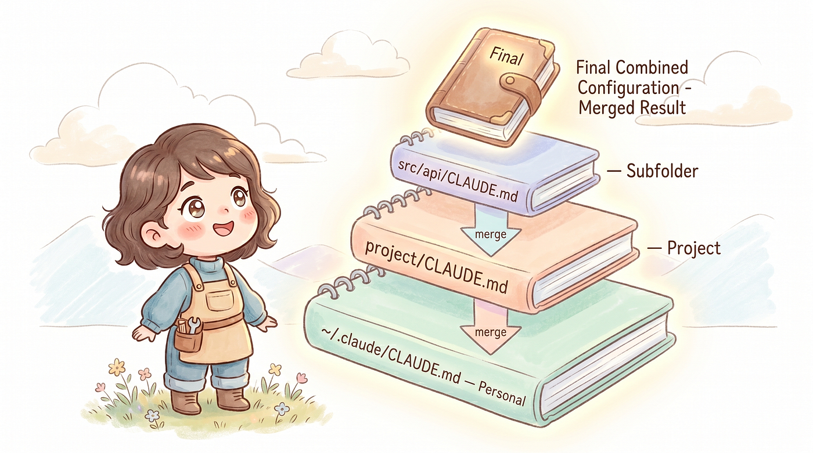

## 摘要（Summary）

`CLAUDE.md` 是放在專案裡、由 Claude Code 啟動時自動讀取的「專案說明書」。它不是程式碼也不是設定檔，而是一份用 Markdown 寫的指令集（instruction set），告訴 Claude 那些「沒人講就不會知道」的潛規則——coding style、測試怎麼跑、哪個資料夾別碰、commit message 格式。

本文把 `CLAUDE.md` 徹底講清楚：**三層架構（使用者層／專案層／子目錄層）怎麼分、隱藏的第四層 `CLAUDE.local.md`、該放什麼、不該放什麼、怎麼寫 Claude 才聽得懂**，並附上作者實際在用的完整三層設定。核心心法只有一句：**放規則（rules），不放資料（data）**。

## 關鍵洞察（Key Insights）

- **三層拼接而非覆蓋**：使用者層 + 專案層 + 子目錄層同時存在時，Claude 全部讀取並**串接（concatenate）**在一起，不是 CSS 那種優先序覆蓋。參見 [[2026-03-28-CLAUDE-CODE-USER-VS-PROJECT-LEVEL-CONFIG-GUIDE]]。
- **跨層衝突無保證**：官方明說衝突時 Claude「may pick one arbitrarily（可能任意選一個）」。正解是**避免衝突**，而非依賴優先序。
- **唯一明確優先序在同層**：同一層目錄裡 `CLAUDE.local.md` 保證在 `CLAUDE.md` **之後**載入，所以同層衝突時 `.local.md` 優先。
- **子目錄層最被低估**：操作某子目錄檔案時會額外載入該目錄的 `CLAUDE.md`，可放模組級的具體規範（如網路層規範）。
- **放規則不放資料**：超過 10 行就自問「Claude 能不能自己從 codebase 推斷？」能就別放。這與 [[2026-01-18-STOP-BLOATING-YOUR-CLAUDE-MD-PROGRESSIVE-DISCLOSURE-AI-CODING-TOOLS]] 的漸進式揭露（Progressive Disclosure）同源。
- **不需重啟**：改完 `CLAUDE.md` 下一輪對話即生效（hot reload），詳見 [[2026-04-14-CLAUDE-CODE-CLAUDEMD-SKILLS-HOT-RELOAD-MECHANISM]]。

## 詳細內容（Details）

### CLAUDE.md 是什麼？一句話版本

> [!quote] 作者定義
> CLAUDE.md 是你寫給 Claude 的專案說明書。

它是一份用 Markdown 寫的「指令集」，Claude Code 啟動時自動讀取，每一輪對話都會參考。可以想成：**新人到職第一天你會跟他說的那些事**——「我們的 coding style 是這樣」「測試要這樣跑」「這個資料夾不要動」「commit message 要這個格式」，這些口耳相傳的潛規則就是 `CLAUDE.md` 要放的東西。

### 三層架構（Three-layer Architecture）

大部分人只知道在專案根目錄放一個 `CLAUDE.md`，但它其實有三層：

| 層級 | 路徑 | 作用範圍 | 適合放什麼 |
|------|------|---------|-----------|
| 使用者層 | `~/.claude/CLAUDE.md` | 你所有的專案 | 個人偏好、通用規範 |
| 專案層 | `專案根目錄/CLAUDE.md` | 這個專案 | 專案架構、技術棧、指令 |
| 子目錄層 | `任意子目錄/CLAUDE.md` | 該目錄下的檔案 | 模組特定的規範 |



> [!important] 拼接，不是覆蓋
> 三層同時存在時，Claude 會全部讀取、串接在一起。**不是覆蓋，是拼接（concatenate）。**

那如果衝突呢？比如使用者層寫「commit message 用英文」、專案層寫「commit message 用中文」？官方文件明說：

> [!quote] 官方文件
> All discovered files are concatenated into context rather than overriding each other.
> If two rules contradict each other, Claude may pick one arbitrarily.

正確做法是**避免衝突**，而非依賴優先序：

- 使用者層寫「通用偏好」，專案層寫「專案規範」，兩者不要重疊
- 若專案需覆蓋個人偏好，直接在專案層明確寫「即使個人偏好不同，本專案一律用 xxx」
- 定期檢查多層 `CLAUDE.md`，清除過期或矛盾的指令

### 使用者層（User Level）：`~/.claude/CLAUDE.md`

個人設定，跨所有專案生效。適合放：個人 coding 偏好、跟語言無關的通用規範、希望每個專案都遵守的規則。

```markdown
# 個人偏好
- 回答跟 commit message 請使用繁體中文
- 開啟 .md 文件一律使用 `code <path>` 指令
- Git commit 時不要加上 Co-Authored-By 行
- 程式碼中的註解使用英文
```

> [!tip] 用 settings.json 強制執行更可靠
> 「不要加 Co-Authored-By 行」寫在 `CLAUDE.md` 是自然語言指令，通常有效；但更可靠的是用 `~/.claude/settings.json` 的 attribution 設定——這是系統層級設定，Claude Code 強制執行。詳見 [[2026-04-17-CLAUDE-CODE-SETTINGS-FILES-COMPLETE-GUIDE]]。

```json
{
"attribution": {
"commit": "",
"pr": ""
}
}
```

> [!note] 注意
> 使用者層不會被 commit 進 repo，完全是個人的。

### 專案層（Project Level）：`專案根目錄/CLAUDE.md`

團隊共用的專案規範，commit 進 repo 後每個人都會套用。

```markdown
# MyApp
## 技術棧
- iOS 17+, Swift, SwiftUI
- 架構：MVVM + Coordinator
- 資料層：SwiftData
- 網路層：URLSession + async/await
## 專案結構
- Sources/Features/ — 功能模組，每個功能一個資料夾
- Sources/Core/ — 共用元件（網路、儲存、工具）
- Sources/Design/ — 設計系統（色彩、字型、元件）
## 規範
- 所有 View 都要支援 Dynamic Type
- ViewModel 必須是 @Observable class
- 網路請求一律用 NetworkService protocol
- 禁止使用 force unwrap（除非有明確的 fatalError 說明）
## 常用指令
- 跑測試：`xcodebuild test -scheme MyApp -destination 'platform=iOS Simulator,name=iPhone 16'`
- SwiftLint：`swiftlint lint --strict`
```

### 子目錄層（Subdirectory Level）：`任意子目錄/CLAUDE.md`

當 Claude 操作某子目錄的檔案時，會額外載入該目錄的 `CLAUDE.md`。這是**最容易被忽略、但最實用**的一層。

```
Sources/
├── Features/
│   └── CLAUDE.md      ← 功能模組的規範
├── Core/
│   └── Network/
│       └── CLAUDE.md  ← 網路層的特殊規範
└── Design/
    └── CLAUDE.md      ← 設計系統的規範
```

例如 `Sources/Core/Network/CLAUDE.md`：

```markdown
# 網路層規範
- 所有 API 請求必須透過 NetworkService protocol
- Response 統一用 APIResponse<T> 包裝
- Error handling 使用 NetworkError enum
- 不要直接 import Foundation 以外的框架
- 新增 endpoint 時要同步更新 APIEndpoint enum
```

> [!info] 規範越往下越具體
> Claude 處理 `Sources/Core/Network/` 底下的檔案時，會同時看到三層：使用者層 + 專案層 + 這個子目錄層。

### 隱藏的第四層：`CLAUDE.local.md`

每一層目錄除了 `CLAUDE.md`，還可放一個 `CLAUDE.local.md`。功能完全一樣，差別在於：

- 同一層目錄裡，`.local.md` 會在 `.md` **之後**被載入，所以衝突時 `.local.md` 優先
- 它不應 commit 進 repo，加進 `.gitignore` 即可

用途：**團隊規範用 `CLAUDE.md`，個人偏好用 `CLAUDE.local.md`**。

```
MyApp/
├── CLAUDE.md         ← 團隊規範：commit message 用英文
├── CLAUDE.local.md   ← 我的偏好：commit message 用繁體中文（覆蓋團隊規範）
└── .gitignore        ← 裡面加上 CLAUDE.local.md
```

> [!quote] 官方對 .local.md 的說明
> Within each directory, CLAUDE.local.md is appended after CLAUDE.md, so when instructions conflict, your personal notes are the last thing Claude reads at that level.

> [!warning] 同層保證 ≠ 跨層保證
> 這個優先序保證**只在同一層目錄內**有效。跨層級的衝突（使用者層 vs 專案層）仍是「可能任意選一個」。

| 順序 | 檔案 | 說明 |
|------|------|------|
| 1 | `~/.claude/CLAUDE.md` | 使用者層，通用偏好 |
| 2 | `專案根目錄/CLAUDE.md` | 團隊共用規範 |
| 3 | `專案根目錄/CLAUDE.local.md` | 個人偏好（同層覆蓋 CLAUDE.md） |
| 4 | `子目錄/CLAUDE.md` | 模組規範（按需載入） |
| 5 | `子目錄/CLAUDE.local.md` | 個人偏好（同層覆蓋 CLAUDE.md） |

### 載入時機（Loading Timing）

| 時機 | 說明 |
|------|------|
| 啟動 session | 自動載入使用者層 + 專案層 |
| 操作特定目錄的檔案 | 自動載入該目錄的子目錄層 |
| 你修改了 CLAUDE.md | 下一輪對話自動套用，不用重啟 |

> [!important] 不需要重啟
> 修改 `CLAUDE.md` 後，Claude 在**下一輪對話**就會讀到更新內容。底層 hot-reload 機制見 [[2026-04-14-CLAUDE-CODE-CLAUDEMD-SKILLS-HOT-RELOAD-MECHANISM]]。

### 該放什麼？放「沒人告訴你就不會知道」的事

1. **專案架構**——Claude 不會通靈知道你的資料夾結構是什麼意思

```markdown
## 專案結構
- Sources/Features/ — 功能模組，每個功能一個資料夾（View + ViewModel + Model）
- Sources/Core/ — 共用基礎建設，不依賴任何 Feature
- Tests/Unit/ — 單元測試，結構對應 Sources/
- Tests/UI/ — UI 測試，按 user flow 組織
```

2. **技術決策**——「為什麼用 A 不用 B」光看程式碼看不出來

```markdown
## 技術決策
- 網路層用 URLSession 而不是 Alamofire，因為不需要額外依賴
- 用 SwiftData 而不是 Core Data，因為這是新專案，最低支援 iOS 17
- 狀態管理用 @Observable 而不是 ObservableObject，參考 WWDC23 遷移建議
```

3. **命名慣例與 Coding Style**

```markdown
## 命名慣例
- ViewModel 命名：`{Feature}ViewModel`（例：ProfileViewModel）
- View 命名：`{Feature}View`（例：ProfileView）
- 網路請求方法命名：`fetch{Resource}`（例：fetchUserProfile）
- Bool 變數用 `is` / `has` / `should` 前綴
```

4. **禁止事項**——告訴 Claude 什麼不要做，跟告訴它要做什麼一樣重要

```markdown
## 禁止事項
- 不要使用 force unwrap（!）
- 不要在 View body 裡做網路請求
- 不要直接用 UserDefaults 存敏感資料，用 Keychain
- 不要在沒有對應測試的情況下新增 public method
- 不要修改 Sources/Legacy/ 底下的檔案，那是待遷移的舊程式碼
```

5. **常用指令**——Claude 不知道你的專案怎麼跑測試、怎麼 build

```markdown
## 常用指令
- Build：`xcodebuild build -scheme MyApp -destination 'platform=iOS Simulator,name=iPhone 16'`
- 單元測試：`xcodebuild test -scheme MyAppTests -destination 'platform=iOS Simulator,name=iPhone 16'`
- Lint：`swiftlint lint --strict`
- 格式化：`swift format --in-place Sources/`
```

### 不該放什麼？

| 不要放 | 原因 | 該放哪裡 |
|--------|------|---------|
| 完整的 API 文件 | 太長，佔 context | 放獨立檔案，需要時再讓 Claude 讀 |
| 所有檔案的功能說明 | Claude 可以自己讀程式碼 | 不需要，Claude 會自己看 |
| 一次性的任務指令 | CLAUDE.md 是永久規範 | 直接在對話中說 |
| 程式碼片段／範本 | 太佔空間 | 放 Skills 的附帶檔案 |
| 每個 function 的用法 | Claude 讀 code 比讀文件準 | 不需要 |
| 頻繁變動的資訊 | 維護成本高，容易過期 | 放 README 或 wiki |

> [!important] 核心原則
> `CLAUDE.md` 放「規則」，不放「資料」。一個判斷方式：如果這段內容超過 10 行，問自己「Claude 能不能自己從 codebase 裡推斷出來？」如果可以，就不用放。

### 寫法技巧：怎麼寫 Claude 才「聽得懂」

**1. 用具體規則，不要用模糊描述**

```markdown
# ❌ 模糊
- 程式碼要寫乾淨
- 遵循好的命名慣例
- 錯誤處理要完善
# ✅ 具體
- 每個 function 不超過 30 行
- 變數命名用 camelCase，常數用 UPPER_SNAKE_CASE
- 所有 throwing function 在呼叫端用 do-catch 處理，不用 try?
```

**2. 正面表述優先，負面表述補充**（先說「要怎麼做」，再說「不要怎麼做」）

```markdown
# ✅ 先正面，再負面
- 用 guard let 做 early return（不要用巢狀的 if let）
- ViewModel 用 @Observable class（不要用 ObservableObject + @Published）
- 依賴注入用 init 參數（不要用 Singleton 直接存取）
```

**3. 給出「為什麼」**（Claude 知道原因後，邊界情況判斷更準確）

```markdown
# ❌ 只有規則
- 不要用 AnyView
# ✅ 有原因
- 不要用 AnyView — 它會破壞 SwiftUI 的 diff 機制，導致不必要的 view 重建，影響效能
```

**4. 善用標題分類**（結構越清楚，Claude 越容易找到對應規則）

```markdown
## 架構
...
## 命名慣例
...
## 測試規範
...
## 禁止事項
...
## 常用指令
...
```

### 實戰：作者的三層 CLAUDE.md

**使用者層 `~/.claude/CLAUDE.md`**

```markdown
# 個人偏好
- 回答跟 commit message 請使用繁體中文
- 開啟 .md 文件一律使用 `code <path>` 指令
- Git commit 時不要加上 Co-Authored-By 行
- 程式碼中的註解使用英文
```

**專案層 `MyApp/CLAUDE.md`**

```markdown
# MyApp
## 技術棧
- iOS 17+, Swift 5.9, SwiftUI
- 架構：MVVM + Coordinator
- 資料層：SwiftData
- 最低部署版本：iOS 17.0
## 專案結構
- Sources/Features/{Feature}/ — 功能模組（View, ViewModel, Model）
- Sources/Core/ — 共用元件，不可依賴 Features
- Sources/Design/ — 設計系統
- Tests/Unit/ — 單元測試
- Tests/UI/ — UI 測試
## 架構規範
- View 只負責 UI，邏輯放 ViewModel
- ViewModel 是 @Observable class，透過 init 注入依賴
- Model 是純 struct，不包含業務邏輯
- 跨模組通訊透過 Coordinator，不要讓 Feature 之間直接依賴
## 命名慣例
- Feature 模組：{Feature}View, {Feature}ViewModel, {Feature}Model
- Protocol：{Name}Protocol（例：NetworkServiceProtocol）
- Mock：Mock{Name}（例：MockNetworkService）
## 禁止事項
- 不要 force unwrap
- 不要在 View body 裡做 side effect
- 不要直接存取 Singleton，用依賴注入
- 不要修改 Sources/Legacy/ 下的檔案
## 常用指令
- Build：`xcodebuild build -scheme MyApp -destination 'platform=iOS Simulator,name=iPhone 16'`
- 測試：`xcodebuild test -scheme MyAppTests -destination 'platform=iOS Simulator,name=iPhone 16'`
- Lint：`swiftlint lint --strict`
```

**子目錄層 `Sources/Core/Network/CLAUDE.md`**

```markdown
# 網路層
- 所有請求透過 NetworkServiceProtocol
- Response 用 APIResponse<T: Decodable> 包裝
- Error 用 NetworkError enum（含 case：serverError, timeout, noConnection, decodingError）
- 新增 API 時同步更新 APIEndpoint enum
- 每個 endpoint 都要有對應的單元測試（用 MockURLProtocol）
```

> [!tip] 三層加起來不到 60 行，但 Claude 的行為會明顯不一樣。

### 進階：動態內容注入（Dynamic Content Injection）

跟 Skills 一樣，`CLAUDE.md` 支援 `` !`command` `` 語法，在載入時先執行 shell 指令，把結果塞進去：

```markdown
## 目前 Git 狀態
!`git branch --show-current`
## 專案版本
!`cat .xcconfig | grep MARKETING_VERSION`
```

Claude 看到的不是指令本身，而是**執行結果**。

> [!warning] 謹慎使用
> 如果指令很慢或輸出很長，會拖慢每次啟動速度。適合放「快速、輸出簡短」的指令。

### 進階：`.claude/CLAUDE.md` vs 根目錄 `CLAUDE.md`

兩者功能完全一樣，Claude 都會讀取，差別只在**可見性**——一個在根目錄看得到，一個藏在 `.claude` 資料夾裡。

> [!tip] 個人偏好放哪？
> 建議用 `CLAUDE.local.md`。它是官方設計的「個人覆蓋」機制，語意更清楚，而且跟 `CLAUDE.md` 放在同一層，衝突時的優先序也更明確。

### 常見錯誤（Common Mistakes）

- **錯誤 1：寫成 README**——`CLAUDE.md` 不是給人讀的介紹文，要寫成規則不是散文
- **錯誤 2：規則太模糊**——「寫好的程式碼」跟沒寫一樣
- **錯誤 3：內容太多**——塞 200 行 API 文件每次都被載入，白白佔 context（上下文視窗）
- **錯誤 4：跟程式碼重複**——Claude 可自己讀程式碼，列出每個 method 是浪費

### 團隊怎麼用？

建立方式：① 專案根目錄建 `CLAUDE.md` → ② 寫入團隊規範 → ③ commit 進 repo → ④ 團隊所有人用 Claude Code 時自動套用。


> [!tip] 維護建議
> - 像維護 README 一樣維護 `CLAUDE.md`——技術決策變了，規範也要跟著更新
> - Code Review 時也看 `CLAUDE.md` 的改動——這是影響全團隊的設定
> - 新成員加入時，先讓他讀 `CLAUDE.md`——比口頭交接靠譜

### CLAUDE.md vs 其他設定機制

| 機制 | 性質 | 生效時機 | 典型用途 |
|------|------|---------|---------|
| CLAUDE.md | 永久規範 | 每次自動載入 | 架構、命名、禁止事項 |
| Skills | 按需能力 | 手動呼叫或自動觸發 | 工作流程、轉換、清理 |
| Agents | 獨立執行 | 由 Skill 或 Claude 派生 | 大量分析、code review |
| settings.json | 系統設定 | 啟動時載入 | 權限、Hooks、環境變數 |

簡單記：

- **CLAUDE.md** — 告訴 Claude「規則是什麼」
- **Skills** — 告訴 Claude「怎麼做某件事」
- **Agents** — 告訴 Claude「派誰去做」
- **settings.json** — 告訴 Claude Code「系統怎麼運作」

## 我的心得（My Takeaways）

- **「跨層衝突任意選一個」這點最值得內化**：我過去以為 `~/.claude/CLAUDE.md` 與專案層有清楚的覆蓋關係，實際上沒有。我目前的使用者層 CLAUDE.md（含繁中回答、不加 Co-Authored-By）與某些專案規範可能默默打架——應該照本文做法，在專案層用「即使個人偏好不同，本專案一律 xxx」明確化，而非賭優先序。
- **子目錄層 CLAUDE.md 我幾乎沒用過**，但對 connsys-jarvis、ccq 這種多模組 repo 很合適——可在各核心模組目錄放具體規範（如 ccq 的 clangd 介面層），避免把所有規則塞進根目錄。
- **「放規則不放資料」與 progressive disclosure 同源**：本文的 10 行判準很實用，可直接拿來審視我現有的 CLAUDE.md 是否該瘦身。
- **attribution 用 settings.json 而非自然語言**：這提醒我，凡是「必須強制執行」的偏好（如 commit 不加署名）應該移到 settings.json，把 CLAUDE.md 留給「軟性指引」。

---

## 知識層次分析（Bloom's Taxonomy Analysis）

> 以下從五個認知層次對本篇內容進行結構化分析，協助從記憶到評估逐層深化理解。

| 認知層次 | 核心目的 | 對本文的具體應用 |
|---------|---------|--------------|
| **記憶（被動）** | 確認資訊存在，單純資訊檢索，確立基礎知識 | 核心術語：①三層架構（使用者層 `~/.claude/CLAUDE.md`、專案層、子目錄層）②`CLAUDE.local.md`（同層 append 在後、優先）③拼接 concatenate ④動態注入 `` !`command` `` ⑤attribution 設定 |
| **理解（半被動）** | 解釋概念的含義及關聯，串聯知識點，掌握核心邏輯 | 三層是「拼接而非覆蓋」，所以多份指令並存；跨層衝突無保證 → 因此心法是「避免衝突」而非「設優先序」；同層 `.local.md` 是唯一有明確順序保證的機制。整體目標是讓 Claude 像「讀過 onboarding 文件的新隊友」。 |
| **分析（主動）** | 檢驗論點、拆解流程、找出假設，批判性思維 | 關鍵假設：①讀者用 Claude Code 且有多人團隊（單人開發其實用不到 `.local.md` 分流）②官方「arbitrarily pick」行為短期不變③範例全為 iOS/Swift，跨語言適用性未驗證。潛在漏洞：文中未談「三層全載入」對 context 預算的累積成本，與「不放資料」原則其實互相牽制。 |
| **應用（主動）** | 將知識套用情境，規劃執行方案，實戰決策力 | ①用 10 行判準審視並瘦身我現有 `~/.claude/CLAUDE.md` ②把「commit 不加 Co-Authored-By」從自然語言改為 `settings.json` attribution 強制執行 ③在 connsys-jarvis / ccq 各核心模組目錄建子目錄層 `CLAUDE.md` |
| **評估（主動）** | 判斷多個方案的優劣，進行決策和權衡 | 「軟性指引放 CLAUDE.md vs 硬性規則放 settings.json」的取捨：CLAUDE.md 彈性高但不保證遵守；settings.json 強制但只覆蓋有限項目。團隊一致性上，CLAUDE.md（版控、可審）優於口頭交接，但弱於 lint/CI 強制檢查——三者應分工：CLAUDE.md 引導、settings.json 設定、CI 把關。 |

### 分析型追問（Socratic Follow-up）

- **澄清**：本文「規則 vs 資料」的界線在哪？「技術決策（為什麼用 A 不用 B）」算規則還是資料？10 行判準在邊界案例（如 30 行的架構說明）如何裁決？
- **假設**：本文論點成立的最關鍵前提是「Claude 跨層衝突會任意選擇」。若未來官方改為明確優先序（如 CSS cascade），本文「避免衝突」的心法是否就過時？
- **證據**：「三層加起來不到 60 行，但 Claude 行為明顯不一樣」——缺乏對照實驗或量化證據，如何驗證 CLAUDE.md 真的改變了輸出品質？
- **觀點**：站在「反 CLAUDE.md」立場（如 Vercel AGENTS.md 派），最有力的批評是什麼？是否「規則該寫進 lint/CI 而非自然語言文件」？參見 [[2026-01-27-VERCEL-AGENTS-MD-OUTPERFORMS-SKILLS-IN-AGENT-EVALS]]。
- **後果**：若團隊嚴格執行三層 CLAUDE.md，12 個月後可能出現什麼副作用？（規範腐化、過期指令累積、子目錄 CLAUDE.md 與根目錄默默矛盾、新人讀規範的負擔反而變重？）

### 方案批判三問（Critical Evaluation）

1. **最大的風險是什麼？** — 規範**腐化（rot）**：CLAUDE.md 隨技術決策演進而過期，Claude 卻照舊執行錯誤規則，產出與現況矛盾的程式碼。跨層矛盾累積後，「任意選一個」使行為不可預測，debug 成本高。
2. **什麼情況下會失敗？** — ①規模超大（單一 CLAUDE.md 數百行）→ 重點被稀釋、佔爆 context ②跨層寫了矛盾規則 → 行為隨機 ③把該強制的規則（如署名、格式）只寫進自然語言 → Claude 偶爾不遵守 ④單人專案 → `.local.md` 分流機制其實多餘。
3. **有沒有更好的替代方案？** — 對「必須強制」的項目，`settings.json` / hooks / CI lint 優於 CLAUDE.md（見 [[2026-04-17-CLAUDE-CODE-SETTINGS-FILES-COMPLETE-GUIDE]]）；對「大量參考資料」，Skills 的 progressive disclosure（[[2026-01-18-STOP-BLOATING-YOUR-CLAUDE-MD-PROGRESSIVE-DISCLOSURE-AI-CODING-TOOLS]]）優於塞進 CLAUDE.md。CLAUDE.md 最適合的是「軟性、全域、需常駐」的引導規則——其餘應分流到對應機制。

## 待補充（Open Questions）

- 跨層「任意選一個」具體是怎麼裁決的？是否與規則出現順序、token 距離、或語意相似度有關？（搜尋關鍵字：`Claude Code CLAUDE.md conflict resolution precedence`）
- 三層全載入對 context 預算的實際開銷有多大？子目錄層是「進入該目錄才載入」還是「session 開始就全載」？（搜尋：`Claude Code subdirectory CLAUDE.md loading timing context budget`）
- 動態注入 `` !`command` `` 的執行時機與安全邊界為何？是否每輪都重跑、會不會被 prompt injection 利用？（搜尋：`Claude Code CLAUDE.md bang command injection security`）
- `CLAUDE.local.md` 跨層級（如使用者層 local vs 專案層 local）之間是否也有順序保證，還是只有同層保證？
- 本文範例全為 iOS/Swift，這套三層心法在 monorepo、多語言、polyglot repo 的最佳實務是否不同？
- 有無公開 benchmark 量化「有 vs 無 CLAUDE.md」對輸出一致性的影響？（搜尋：`CLAUDE.md effectiveness benchmark code consistency`）

## 相關連結（Related）

- [[2026-01-18-STOP-BLOATING-YOUR-CLAUDE-MD-PROGRESSIVE-DISCLOSURE-AI-CODING-TOOLS]] — 同主題反面：本文教「該放什麼」，該篇教「如何瘦身、用 progressive disclosure 卸載資料」
- [[2026-04-13-KARPATHY-CLAUDE-MD-WHAT-EACH-PRINCIPLE-REALLY-FIXES]] — Karpathy 視角的 CLAUDE.md 原則與本文寫法技巧互補
- [[2026-03-28-CLAUDE-CODE-USER-VS-PROJECT-LEVEL-CONFIG-GUIDE]] — 深入使用者層 vs 專案層配置，與本文三層架構直接呼應
- [[2026-04-17-CLAUDE-CODE-SETTINGS-FILES-COMPLETE-GUIDE]] — 本文提到的 attribution 等「硬性強制」設定的完整說明
- [[2026-04-14-CLAUDE-CODE-CLAUDEMD-SKILLS-HOT-RELOAD-MECHANISM]] — 本文「不需重啟、下一輪生效」的底層 hot-reload 機制
- [[2026-01-27-VERCEL-AGENTS-MD-OUTPERFORMS-SKILLS-IN-AGENT-EVALS]] — 提供「規則該寫進文件還是別處」的對照觀點

## References

- [原文：CLAUDE.md 完全攻略 — 讓 Claude Code 真正理解你的專案 (MikeWang)](https://medium.com/@n913239/claude-md-%E5%AE%8C%E5%85%A8%E6%94%BB%E7%95%A5-%E8%AE%93-claude-code-%E7%9C%9F%E6%AD%A3%E7%90%86%E8%A7%A3%E4%BD%A0%E7%9A%84%E5%B0%88%E6%A1%88-3a9478865a11)
- [Claude Code Docs — Memory](https://docs.claude.com/en/docs/claude-code/memory)
- [Claude Code Docs — Skills](https://docs.claude.com/en/docs/claude-code/skills)
- [Claude Code Docs — Sub-agents](https://docs.claude.com/en/docs/claude-code/sub-agents)
