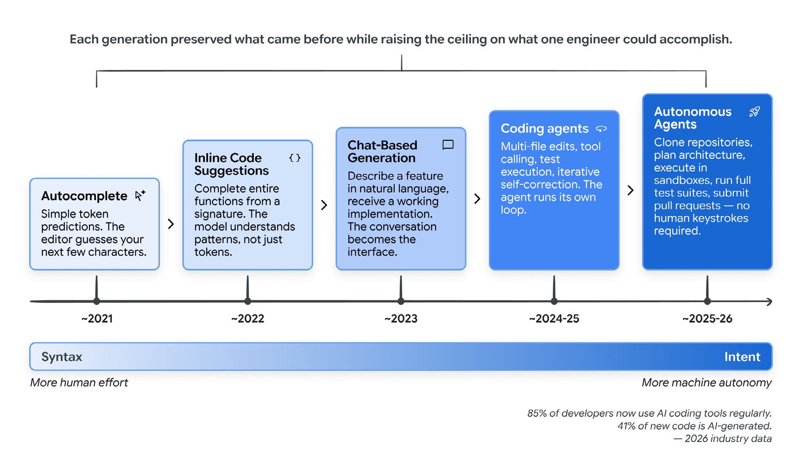
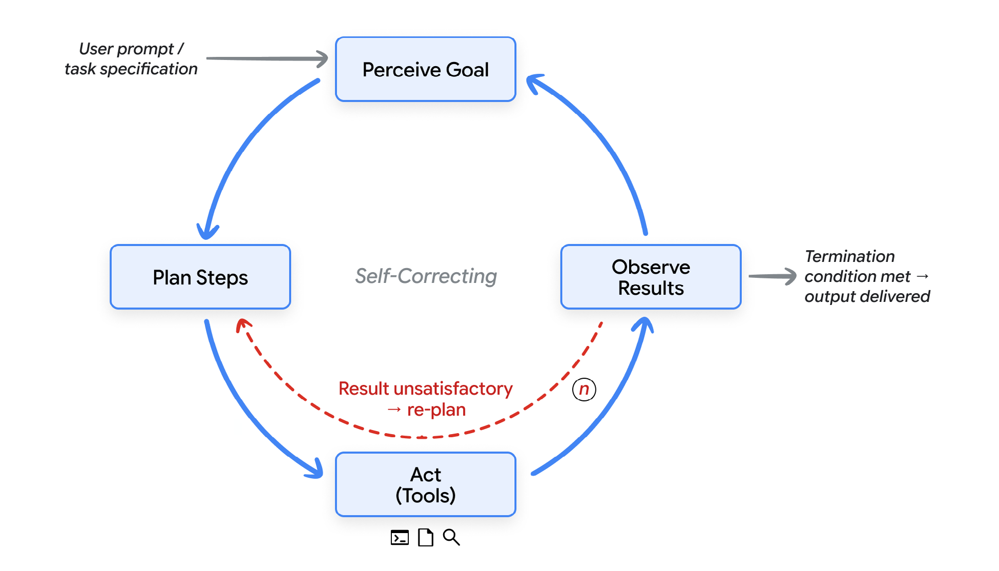
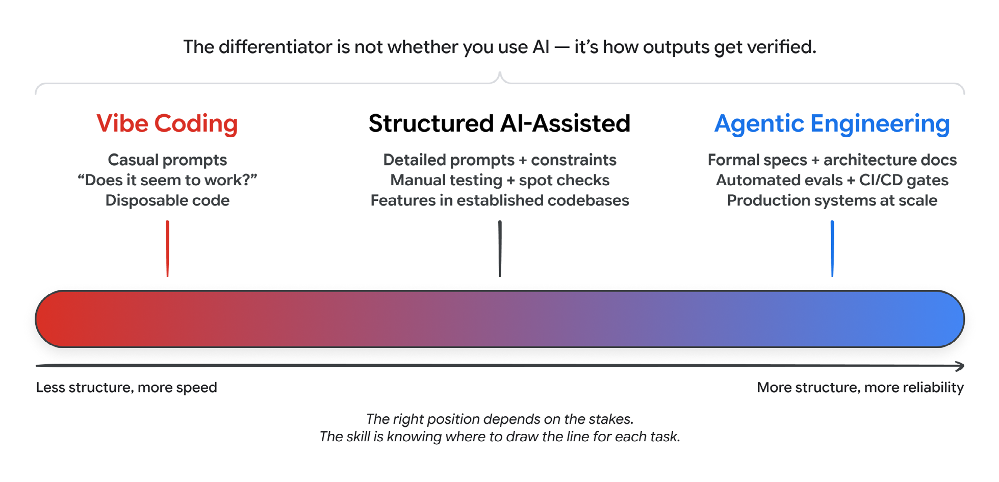
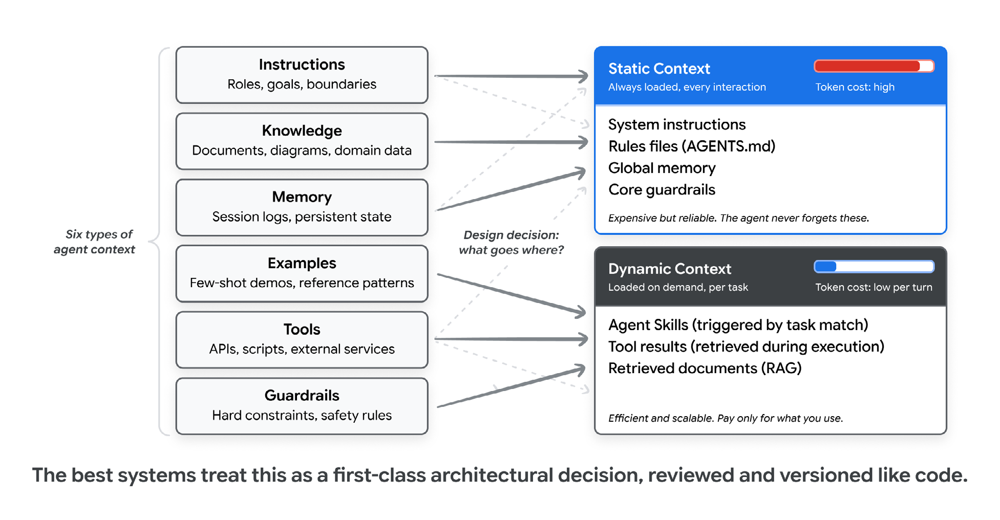
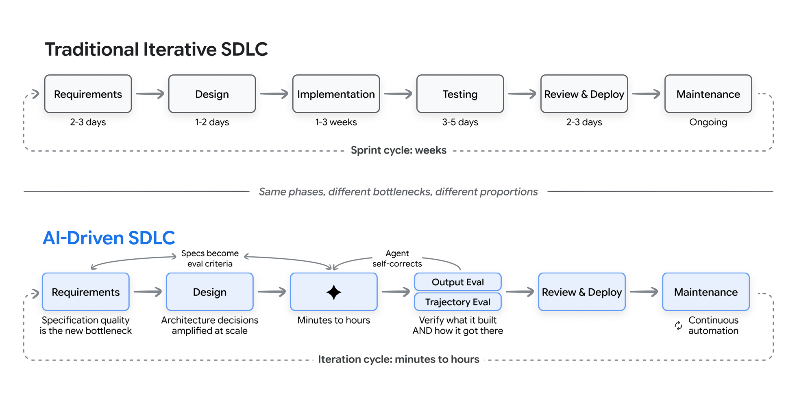
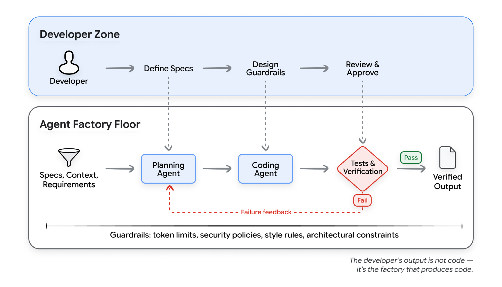
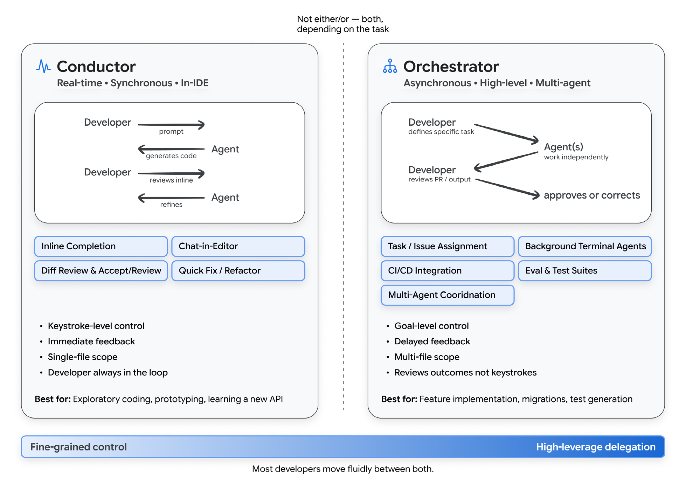
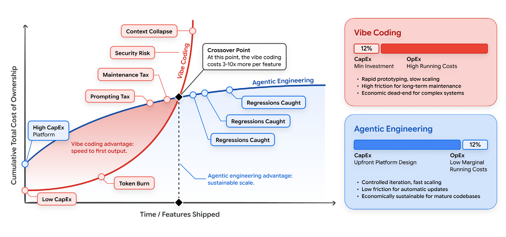

## 摘要（Summary）

Google 於 2026 年 5 月發布 51 頁白皮書《The New SDLC with Vibe Coding: From ad-hoc prompting to Agentic Engineering》（發布於 Kaggle，僅標示月份），這是業界第一次把過去一年滿天飛的術語——vibe coding、agentic engineering、context engineering、harness——**放進同一套座標系**的官方框架文件。目標讀者正是軟體工程師、工程管理者、架構師與技術領導。

全書一句話主張：**如果你的 AI agent 表現不好，通常不是模型太笨，而是你沒給它夠好的 Harness（工作環境與約束）**。核心公式 `Agent = Model + Harness`，且模型只佔整體行為的約 10%，Harness 佔約 90%。白皮書直言：「大部分 agent 的失敗，誠實檢查後都是配置（configuration）失敗」——缺一把工具、一條含糊的規則、一個缺席的 guardrail，或塞滿雜訊的 context window。

本筆記整合兩個來源：①白皮書全文（51 頁逐頁研讀，9 張關鍵圖已收錄、表格轉為 Markdown）；②Gary Chen 的 Patreon 深拆文（2026-07-10），提供中文導讀視角、skills 實戰血淚經驗，與 Harness Audit Kit（4 組體檢 prompts）工具包。結尾金句值得先記住：**"Generation is solved. Verification, judgment, and direction are the new craft."（生成已經被解決了，驗證、判斷與方向才是新手藝）**

## 這份白皮書的來歷：為什麼可信

主作者 Addy Osmani 是在 Google Chrome 團隊十年以上的資深工程主管。白皮書 Endnotes 大量引用他個人部落格的原型文章——factory model、the 80% problem、conductors to orchestrators 全都能在他的部落格找到雛形。Gary Chen 對此的評價很到位：這不是高層在會議室憑空寫的官樣文章，而是**一位第一線工程師花了兩年在部落格上打磨的論述，被系統化後蓋上 Google 官方認證**。這種草根成書路徑讓文件讀起來異常收斂且務實。

> [!info] 業界數據基線（2026 年初）
> 85% 專業開發者常態使用 AI Coding Agents、51% 每天用、估計 41% 的新程式碼由 AI 生成。開發者與機器的介面正從「語法（syntax）」轉向「意圖（intent）」。



## AI Agent 快速回顧

AI agent 是「感知目標 → 規劃步驟 → 透過工具行動 → 觀察結果 → 迭代直到達標或觸發停止條件」的軟體系統。Chatbot 產生一則回覆後等待下一個 prompt；agent 則**自己跑迴圈**。



每個 agent 由五個部分組成：**Model**（推理引擎）、**Tools**（連接世界：API、可執行的程式碼、資料庫、可委派的其他 agent）、**Memory**（狀態：跨 session 的記憶與專案規則）、**Orchestration**（跑迴圈的程式碼：組裝 context、派發工具呼叫、決定是否繼續）、**Deployment**（把原型變成服務：hosting、身份、可觀測性）。

## 光譜，不是開關

vibe coding 與 agentic engineering 不是二選一的開關，而是**同一條光譜的兩端**。判斷標準不是「你有沒有用 AI」，而是「你在 AI 輸出周圍放了多少結構、驗證與人類判斷」。

術語簡史：2025 年 2 月 Andrej Karpathy 描述了一種「完全順著感覺走、不看程式碼、錯誤訊息直接貼回去叫 AI 修」的開發方式，vibe coding 一詞爆紅後被濫用到失去意義；2026 年初 Karpathy 補上 **agentic engineering** 一詞描述光譜的紀律端。白皮書把光譜切成三個位置（Table 1 轉錄）：

| 維度 | Vibe Coding | Structured AI-Assisted Coding | Agentic Engineering |
|------|-------------|------------------------------|---------------------|
| 意圖規格化（Intent specification） | 隨口的自然語言 prompts | 含範例與約束的詳細 prompts | 正式規格、架構文件、memory files |
| 驗證（Verification） | 「看起來會動嗎？」 | 手動測試、抽查 | 自動化測試套件、CI/CD 閘門、LM judges |
| 程式碼庫理解（Codebase understanding） | 極少；開發者可能不讀生成的程式碼 | 選擇性審查關鍵路徑 | 全面審查架構；AI 處理實作細節 |
| 錯誤處理（Error handling） | 把錯誤訊息複製貼回給 AI | 開發者診斷根因、AI 實作修復 | Agent 在定義好的邊界內自我診斷；人類處理架構層問題 |
| 適用範圍（Appropriate scope） | 原型、腳本、個人專案、hackathon | 既有程式碼庫內的功能 | Production 系統、團隊規模開發 |
| 風險輪廓（Risk profile） | 高；可拋棄程式碼可接受 | 中等；關鍵檢查點有人類判斷 | 低；每一階段都有系統性驗證 |



> [!tip] 位置由賭注（stakes）決定
> 週末原型可以純 vibe coding；處理金流的 production API 必須 agentic engineering。白皮書的比喻：對 CTO 說「我們在 vibe coding 付款系統」會（也應該）拉響警報；說「我們在用 agentic engineering 建付款系統——AI 負責實作、人類設計約束、測試覆蓋確保正確性」則是完全不同的對話。**多數真實工作落在中間，技能在於知道每個任務該把線畫在哪裡。**

**光譜最大的分水嶺是驗證**，且驗證分兩種：**Tests（測試）** 驗證確定性部分（給 A 輸入必須得 B 輸出，由程式碼檢查）；**Evals（評估）** 驗證非確定性部分（agent 的解題路徑對不對、工具選得合不合理、產出是否達品質標準，由標註資料集、評分準則與 LM judges 檢查）。白皮書講得很直白：**兩者缺一，無論 prompt 雕琢得多精緻，本質上仍是 vibe coding**。

## 品質飛輪：驗證不是關卡，是迴圈

Gary Chen 特別點出這段是「大家最容易略讀跳過、卻真正決定 AI 產出品質」的精華。Evals 底下還有一層細分：

- **Output evaluation（產出評估）**：檢查最終產物——程式碼能否編譯、測試是否通過
- **Trajectory evaluation（軌跡評估）**：檢查 agent 走過的完整路徑——工具呼叫順序對不對、中間有沒有跳過該做的步驟

兩個都要，因為白皮書點出一個殘酷事實：**一個輸出流暢但偷偷跳過驗證步驟的 agent，比一個帶著明顯錯誤的 agent 更危險**——前者你根本不會起疑。

驗證也不該是靜態關卡，而是五步的**品質飛輪（quality flywheel）**：

```text
┌─► ① Evaluate  對 benchmark suite 跑分
│   ② Diagnose  把失敗按根因（root cause）分群
│   ③ Optimize  修掉造成失敗的 prompt 或工具
│   ④ Verify    對 regression suite 確認沒把別的弄壞
└── ⑤ Monitor   盯 production 流量抓新失敗模式
        （每轉一圈，系統更可靠一點——複利效應）
```

這個複利結構正是後面 Token 經濟學能成立的前提。

## Context Engineering：真正要練的技能

AI 生成程式碼的品質，**與 prompt 寫得多聰明關係不大，與你提供的 context 品質關係極大**。最好的心智模型是「幫新到職同事做入職簡報」：關鍵問題不是「怎麼騙 AI 寫出好程式碼」，而是「**一位新進工程師需要知道什麼才能有效貢獻？我如何把這些知識編碼成 AI 能用的形式？**」

六類 context：**Instructions**（角色、目標、工作邊界）、**Knowledge**（文件、架構圖、領域資料）、**Memory**（短期 session 記錄 + 長期持久狀態）、**Examples**（少樣本示範、程式碼庫參考模式）、**Tools**（可呼叫的 API 與服務的精確定義）、**Guardrails**（硬性約束、格式規則、安全驗證）。

這六類再分成兩大陣營：

- **Static context（靜態）**：每次互動必載入——系統指令、rule files（`AGENTS.md`、`CLAUDE.md`、`GEMINI.md`）、全域記憶。可靠但**貴**：每個 token 在每次互動都要付錢，無論相關與否。
- **Dynamic context（動態）**：按需載入——任務匹配觸發的 skills、執行中取回的工具結果、RAG 撈回的文件。便宜且可擴充，風險是 agent 該抓資料時沒去抓。

> [!important] 靜動分界是一級架構決策
> 靜態塞太多浪費 token 且稀釋訊號；塞太少 agent 會忘記關鍵規則。白皮書要求把這條界線「**像程式碼一樣被 review 與版控**」。



**Agent Skills** 是管理動態 context 最強的模式：結構化、可攜的程序性知識包，只在任務需要時載入。透過**漸進式揭露（progressive disclosure）**——啟動時 agent 只看到每個 skill 約一行的 metadata，任務匹配才載入完整指令，需要更深的參考資料才進一步撈——一個 agent 可以攜帶幾十種專業能力，卻只為當下使用的那一個付 token 錢。白皮書解釋 skills 勝出的原因是一次解決四個老問題：①context rot（塞爆 prompt 導致重點稀釋）、②LLM 缺乏程序性記憶（skills 是可重複調用的 SOP）、③multi-agent 架構的維運負擔（同一個 agent 換 skill 即可，不用維護一堆特化 sub-agent）、④可攜性（純文字結構，跨工具跨廠商帶著走）。

### Gary Chen 的 Skills 實戰姿勢（實作過上百個 skill 的血淚經驗）

1. **Skills 有複利效應**：每天用的 skill，發現產出不如預期就馬上回頭微調，一個月後會比初版好用上百倍。不要想一步到位，持續迭代才是王道。
2. **對 agent 友善，同時人類要容易維護**：複雜任務會調用多份 skills，產出走鐘時你必須能快速定位是哪份 skill 帶偏的——一萬行的 skill 連看完都會崩潰。
3. **起手式不用 multi-agent**：一個好的 generalist agent 配幾套優質 skills（該 review 時化身 reviewer、要規劃時變 planner）對日常開發已非常夠用。
4. **Planning 與 coding 拆成兩個 session**：規劃過程累積大量 context 與偏見；最乾淨的做法是把 plan 當獨立產出（artifact），餵給全新的 coding session，讓實作環境不被規劃階段的雜訊拖累。

## 新 SDLC：壓縮不均勻，瓶頸大洗牌

AI 把實作從數週壓縮到數小時，但**需求、架構與驗證仍然是人類步調**。結果不是舊流程變快，而是全新的工作流：階段邊界模糊、迭代週期從「週」變「分鐘」、**規格品質（specification quality）成為新瓶頸**、開發者從主要實作者變成系統設計師與品質仲裁者。



各階段的重點轉變：

| 階段 | 轉變 |
|------|------|
| 需求與規劃 | 從部門間傳遞的文件變成「與 AI 的對話」，規格與初版 prototype 同時誕生；需求到原型的回饋迴圈趨近於零 |
| 設計與架構 | **最頑固的人類堡壘**：架構決策本質是取捨（一致性 vs 可用性、自建 vs 採購），需要 AI 抓不到的商業脈絡；AI 擅長的是架構拍板後的俐落執行 |
| 實作 | 業界調查 25–39% 生產力提升，但 METR 研究發現資深工程師某些任務**反而慢 19%**（時間花在驗證 AI 產出）——兩組數據不衝突：AI 把實作從「寫」變成「review、引導與驗證」 |
| 測試與 QA | 測試與 evals 成為**向 AI 傳達意圖的主要機制**：好的 eval suite 告訴 AI「正確」是什麼意思，並提供自動驗證 |
| Code review 與部署 | AI 當第一遍 reviewer（bug、風格、安全、效能），人類保留設計、可維護性與策略對齊的判斷 |
| 維護與演進 | **最被低估的寶地**：只有原作者敢動的 legacy code，agent 能讀懂整個 codebase 並在尊重既有架構下修改；框架遷移、更新棄用 API 這些「風險太高沒人敢碰」的事終於有人代勞 |

### Factory Model：打造「生產程式碼的系統」

把這些變化串起來的心智模型：開發者的主要產出不再是程式碼，而是**能夠產出程式碼的系統**，包含五個組件——精準的規格與 context、負責實作的 agents、把關的測試與品質閘門、自我修正的 feedback loops、防止脫軌的 guardrails。工廠經理不會親手組裝每個零件；他設計產線並把關品質。**給 agent 成功準則（success criteria），而不是 step-by-step 的死板指令，然後讓它迭代。**



> [!example] Factory model 的極限案例
> 2026 年初 Anthropic 發布實驗：一組 agent 團隊**兩週用 Rust 寫出能動的 C compiler**，人類只設定方向與 review 產出、完全沒寫實作程式碼。瓶頸已從「把程式碼寫出來」轉移到「定義它該做什麼」與「驗證 agents 真的做到了」。

## Harness Engineering：Agent = Model + Harness

常見迷思是把模型當成系統的全部——新模型發布 agent 就變聰明、舊模型就變笨，模型成為解釋一切成敗的理由。**這個直覺是錯的，而且會導致錯誤的投資**。模型只是運行中 agent 的一個輸入；其他所有東西——prompts、工具、context 政策、hooks、sandboxes、sub-agents、可觀測性——都是 harness：包在模型外面、讓它真正能完成事情的鷹架。

你用 Claude Code、Cursor、Codex、Antigravity、Aider、Cline 感受到的差異，主要來自 harness 的設計，而不只是底層哪顆模型。白皮書的比喻：**模型是引擎，harness 是車、路、和交通法規**。


Harness 六大件：

| # | 組件 | 內容 |
|---|------|------|
| 1 | Instructions / Rule Files（規則文件） | 定義 agent 是誰、在乎什麼、禁止做什麼：`AGENTS.md`、`CLAUDE.md`、`GEMINI.md`、skill 檔、sub-agent prompts |
| 2 | Tools（工具） | 可呼叫的 functions、MCP servers、API，**加上何時、如何呼叫的說明文字** |
| 3 | Sandboxes（沙盒與執行環境） | 程式碼實際在哪裡跑、能存取什麼、摸不到什麼 |
| 4 | Orchestration logic（調度層） | Sub-agent 派生、model routing、專家間交接，以及各自何時觸發的規則 |
| 5 | Guardrails / Hooks（護欄／掛鉤） | 在生命週期定點執行的確定性程式碼：工具呼叫前、檔案編輯後、commit 前——「agent 不該忘記但常忘記的事」放這裡 |
| 6 | Observability（可觀測性） | Logs、traces、evals、成本與延遲監控——沒有它，你不知道 agent 是做得好還是在悄悄漂移 |

> [!important] Harness 效果有硬數據
> Terminal Bench 2.0 上，有團隊**完全不換模型、只改 harness**，把 coding agent 從 30 名外拉進前 5；LangChain 在同一 benchmark 用固定模型只調 system prompt、tools 與 middleware 就提升 13.7 分。同一顆大腦，換套工作環境，表現天差地遠。**Agent 出包時第一直覺不要怪模型**——大部分失敗誠實檢查後是配置失敗：缺工具、規則含糊、guardrail 缺席、context 塞滿雜訊。
>
> 白皮書還特別強調：**這一大片 harness 是你團隊的地盤（surface area），不是模型廠商的**。模型你控制不了；harness 是你唯一能控制、也最值得投資的地方。

### Harness 在 SDLC 四階段的運轉（不是設定完就放著的 config）

| 階段 | Harness 角色 | 使用組件 | 實際動作 |
|------|-------------|---------|---------|
| 1. 需求／規劃／架構 | **Configure（配置）** | Instructions/Rule Files | 在 AI 寫任何 production 程式碼前架好環境：建 `AGENTS.md`、定義可用工具（特定 API、資料庫 schema）、設下不可違反的規則 |
| 2. 實作 | **Run（運行）** | Sandboxes、執行環境、Tools | 模型生成的程式碼在隔離 sandbox 中執行；要讀檔案、查網路都透過 harness 提供的工具 |
| 3. 測試與 QA | **Feedback Loop（回饋迴圈）** | Orchestration、Guardrails | 測試失敗時 orchestration 捕捉錯誤輸出、自動路由回模型要求重試——**agent 的「自我修正」能力其實是 harness 給的** |
| 4. Review／部署／維護 | **Observe（觀察）** | Hooks、Observability | Hooks 在定點擋危險動作（如 commit 前擋硬編碼密碼）；observability 追蹤 token 成本、延遲與 agent 漂移，讓人能稽核 agent 為何做了某個決定 |

> [!tip] Gary Chen 的日常習慣：把出包經驗寫回 harness
> Agent 出包時不要修完 bug 就走——多花五分鐘問一句「我的 rules、workflows、skills 哪裡可以改，讓這種錯誤不再發生」，然後把答案寫回 harness。每跑一輪系統就更可靠，**錯誤從成本變成資產**。

## 人的新角色：Conductor 與 Orchestrator，以及 80% 陷阱

開發者在兩種模式間流動切換（不是二選一）：



- **Conductor（指揮家）**：在 IDE 裡即時與 AI 結對，盯著程式碼一行行出現、隨時修正。適合複雜邏輯、棘手 debug、不熟的 codebase——需要理解每個改動的場景。風險：若每個鍵擊都要親自指揮，AI 帶來的吞吐量提升有限。
- **Orchestrator（協調者）**：定義目標、發包給 agents 背景平行執行、定期回來 review 結果給方向。適合規格明確的 bug fix、既定 pattern 的功能實作、codebase 遷移、測試生成。

Orchestrator 需要四個新技能：**Specification**（把任務定義到 agent 不會誤解）、**Decomposition**（把大任務拆成 agent 能消化的單元）、**Evaluation**（快速判斷產出是否達標）、**System design**（設計讓 agents 保持高產的約束、測試與回饋迴圈）。

> [!warning] 80% Problem：AI 錯誤的性質變了
> AI 能極速生成約 80% 的程式碼，但剩下 20%——刁鑽的 edge cases、錯誤處理、跨系統整合點、微妙的正確性要求——需要目前模型欠缺的深度情境知識。更麻煩的是錯誤性質的演化：**從一眼看穿的語法錯誤，變成「看起來很對」的概念性失誤**（對業務邏輯的錯誤假設、需求模糊時自行腦補、漏掉 edge case、埋下長期維護負擔的架構決策）。這種錯誤難抓正因為程式碼「看起來沒問題」，甚至能通過基本測試——這也呼應了 trajectory evaluation 的必要性。
>
> 高手的姿態：把 AI 用在它擅長的（明確任務的極速實作），把自己的注意力留給 AI 不擅長的（模糊需求釐清、架構取捨、正確性驗證）。**他們快不是因為照單全收，而是把專業用在刀口上。**

補充：coding agents 出現在開發者日常的三個位置——**編輯器內**（行內補全、對話面板：GitHub Copilot、Cursor、Windsurf、JetBrains AI Assistant）、**終端機**（自然語言給目標、全檔案系統存取、多檔編輯、跑工具與測試：Claude Code、Codex CLI、Antigravity CLI、Cline——「認真的 vibe coding 發生在這裡」）、**背景**（雲端 sandbox 自主跑數小時、產出 PR：Google Jules、Copilot agent mode、Cursor background agents）。多數開發者一天內三者都用；**起點取決於任務，不是自主性階梯的高低**。

## Token 經濟學：CapEx 與 OpEx 的反轉

對工程領導者，比「寫程式碼多快」更關鍵的指標是**總持有成本（TCO, Total Cost of Ownership）**。用財務語言說：vibe coding 是「低 CapEx（前期投資）、高 OpEx（營運成本）」；agentic engineering 把這筆帳整個反過來。



Vibe coding 的三個滾雪球隱藏成本：

1. **Token 燃燒率（Token Burn Rate）**：把沒整理的巨型檔案塞進 context window、反覆叫模型修自己沒驗證過的錯——低首次成功率的「prompting loop」每一輪都在燒 API 費用
2. **維護稅（Maintenance Tax）**：ad-hoc prompting 產出的程式碼缺乏結構一致性，半年後出 bug，工程師得花好幾天對 AI 生成的義大利麵程式碼逆向工程
3. **資安補救（Security Remediation）**：生程式碼快、生漏洞也快；在 production 修資安漏洞的代價比設計階段攔截高出指數倍

Agentic engineering 的 CapEx 花在設計 API schemas、建確定性測試套件、以及最重要的——**結構化 agent 的 context**。前期成本高，但每個新功能的邊際成本大幅下降：AI 在治理良好的「工廠」內運作，產出天生結構正確、預先測過、符合標準。

兩個放大器：

- **Context engineering 是財務槓桿**：LLM 按 token 收費，每次把 10 萬 token 的 repo 整包塞進 prompt 在規模上財務不可行；精準高訊號的 payload（如一份精確的 `AGENTS.md` + 架構 guardrails）大幅拉高首次通過率，第一次就做對省下無數次 trial-and-error 的真金白銀。
- **Intelligent Model Routing（智慧模型路由）**：vibe coding 預設所有事都丟給最貴的旗艦模型（修 typo 也付頂級價）。設計良好的工廠把高複雜度任務（需求、架構、初版實作）給大模型，把確定性高的任務（測試生成、code review、CI/CD 監控）路由給更小更快更便宜的模型——品質不打折、帳單直線下降。路由規則就寫在 harness 的 orchestration 層，所以 **harness 不只是工程資產，也是財務資產**。

## Where to Start：三份行動清單（RD／工程領導／組織）

> [!important] 貫穿原則
> **AI 放大它所落地的工程文化（AI amplifies the engineering culture it lands in）**。以下清單把原則翻成行動。

### 給個人開發者（RD）

1. **為專案建一份 `AGENTS.md`（或等效檔案）**：十行起步——技術棧、慣例、硬規則、workflow。之後每當 agent 做了不想再看到的事，就加一條規則。
2. **為 coding agent 裝一組 skills**（如 Agents CLI）用於建置、評估、部署與優化 agents。
3. **挑一個重複性 workflow 做成你的第一個 agent**：研究流程、code review 流程、定期報告都行。先用 coding agent 做原型，值得之後再升級為 production agent。**親手端到端建一個 agent，比讀一百篇文章學得多。**
4. **先寫測試與 evals，再生成程式碼**：它們合起來是你與 AI 的合約。好的 test + eval suite 比任何自然語言 prompt 更精準地傳達意圖，也是 vibe coding 升級成 agentic engineering 的分界。
5. **要上線的程式碼每一行都親自 review**：對看起來聰明的寫法保持懷疑、檢查 import 的套件是否真實存在、確認錯誤處理覆蓋現實的失敗模式。團隊看不懂的程式碼是團隊付不起的除錯成本。
6. **維持你的工程基本功**：debug、系統設計、對效能與正確性的直覺必須保持銳利。**把 AI 當成放大專業的工具，不是替代專業的藉口**。

### 給工程領導（Engineering Leaders）

1. **把 context engineering 變成團隊的一級工程實踐**：`AGENTS.md`、system prompts、eval suites、skill 庫都當程式碼對待——進 PR review、隨專案版控、有具名負責人。沒有這個紀律，harness 會漂移、agent 行為在團隊間不可重現。
2. **標準設在 eval，不是 demo**：會動的 demo 只證明 agent 能成功一次；通過的 eval suite 才證明它可靠。沒有明確評分準則（rubric）的 eval 什麼都沒量。把「有明確 rubric 的 eval 覆蓋」設為 agent 進入共享 workflow 的前置條件——就像測試覆蓋率把關服務部署一樣。
3. **為 AI 生成的程式碼重塑 code review**：AI 程式碼需要等同甚至更高的審查強度，特別注意幻覺出來的依賴、不足的錯誤處理、乍看正確的細微缺陷。訓練 reviewer 認識生成程式碼的失敗模式、調整 review checklist。
4. **在團隊規範中區分原型工作與 production 工作**：vibe coding 是探索的正確速度、agentic engineering 是 production 的正確紀律。明確界線：哪些專案、哪些 branch、哪些環境用哪種模式。**界線模糊的團隊會「不小心把原型上線」。**
5. **把 harness 組件當團隊共享資產投資**：可重用的 system prompts、skill 庫、MCP 連線、評估 harness 會跨專案複利。像基礎設施一樣文件化、維護、刻意改進。**從 AI 輔助開發賺到最多複利的團隊，是把 harness 建一次、精煉很多次的團隊。**

### 給組織（Organizations）

1. **把 AI 輔助開發當工程投資，不是生產力功能**：收益最大的團隊把 AI 工具與 eval 覆蓋、可觀測性、清楚的架構標準配套。沒有這些鷹架就推 coding agent，得到的是「沒有品質的速度」，技術債堆積得比任何團隊還得快。
2. **在規模化之前先投資 production 基底（substrate）**：筆電上的 vibe-coded 原型不是 production 系統；讓它畢業的是圍繞它的營運紀律——CI 裡跑 trajectory 與 final-response evals、每次 agent 執行都有 trace、每個 agent 有 scoped 權限、針對生成程式碼失敗模式調校的安全審查。**在第一個 production agent 上線之前建好，不是之後。**
3. **採用開放標準**：工具存取用 MCP（Model Context Protocol）、跨 agent 委派用 A2A（Agent2Agent）——兩者正在收斂為 multi-agent 系統的連接組織。現在選定可保留混用廠商與框架的彈性，避免日後重新平台化。
4. **規劃人機混合團隊，而非純人或純 agent 的 workflow**：過去一年最強的 production 成果來自「人設方向、agent 做實作、清楚的交接協定管理邊界」的架構。Code review 流程、on-call 輪值、團隊結構都要演進以反映 agent 是參與者、不只是工具。
5. **把招聘與技能發展重新框定在判斷力，而非實作力**：實作越來越快、越來越自動化，瓶頸移向規格、評估、架構判斷與 review。**未來幾年最有價值的工程師，是最會指揮 agent 的人，不是寫最多程式碼的人。**

## 結論：三個禁得起時間考驗的原則

1. **Structure scales, vibes don't（結構可規模化，憑感覺不行）**：vibe coding 對探索、原型、個人專案完全正當；但對組織賴以運作的軟體，agentic engineering 的紀律——規格、測試、guardrails、人類的架構監督——不是可選項。「看起來會動」與「在所有條件下都正確」之間的落差，正是 production 事故、資安漏洞與維護惡夢的棲息地。
2. **AI 放大你的工程文化**：測試紀律、架構標準、code review 扎實的組織從 AI 拿到的價值遠大於沒有的組織。AI 是力量倍增器——同時放大你的優點和缺點。
3. **人的角色在演化，不是消失**：懂架構、能寫精準規格、能批判性評估產出、能設計約束與回饋系統的建造者比以往更有價值。關鍵技能從實作移向判斷——從寫程式碼，變成**設計生產程式碼的系統**。

> [!quote] 全書金句
> "Generation is solved. Verification, judgment, and direction are the new craft."
> （生成已被解決。驗證、判斷與方向，才是新的手藝。）

Gary Chen 的收尾補充也值得記：模型幾個月換代一次，追是追不完的；但你為工作流打造的 harness——rules、skills、evals——安穩存在 version control 裡，隨每次出包變強。**當生成不再稀缺，稀缺的是「能被嚴格驗證的產出」——而這個超能力不在大廠的模型裡，一直都在你的 harness 裡。**

## Gary Chen 的 Harness Audit Kit（4 組 Prompts 工具包）

Gary Chen 把白皮書的理論框架做成四個可直接體檢自己工作流的 prompts（工具本體在其 Patreon 會員工具頁）：

| 工具 | 用途 |
|------|------|
| **Harness Auditor** | 貼入你現在的配置（rule files、tools、hooks、skills 清單），對照 harness 六大件逐項做 gap analysis，產出缺口清單與補強優先序 |
| **AGENTS.md Bootstrapper** | 以訪談方式引導：問完技術棧、開發慣例、硬性規則與 workflow 後，生成十行起步的 `AGENTS.md`，附後續持續擴充規則的 SOP |
| **Failure-to-Rule Converter** | Agent 出包時把事故經過貼入，診斷屬於哪種 configuration 失敗，直接產出能寫回 harness 的 rule、hook 或 skill 修正方案 |
| **Static/Dynamic Boundary Reviewer** | 盤點所有 context 資產，判定哪些該常駐（static）、哪些按需載入（dynamic）、哪些值得抽成獨立 skill，每個判定附 token 成本推理 |

Gary 的使用建議：先把白皮書框架掃過一遍（對六大件與四階段運轉圖有概念），再回頭跑 Harness Auditor，會更能感受缺口的重要性。

## 我的心得（My Takeaways）

這份白皮書最大的價值是**收斂**：過去一年知識庫裡分散追蹤的線索——harness engineering（[[2026-04-02-HARNESS-ENGINEERING-COMPLETE-GUIDE]]、[[2026-04-24-AGENT-HARNESS-12-MODULES-COMPLETE-GUIDE]]）、progressive disclosure 與 CLAUDE.md 瘦身（[[2026-01-18-STOP-BLOATING-YOUR-CLAUDE-MD-PROGRESSIVE-DISCLOSURE-AI-CODING-TOOLS]]）、Karpathy 的 vibe coding → agentic engineering 演化——第一次被放進同一套官方座標系，而且每個主張都附了可查證的數據（Terminal Bench 2.0、LangChain +13.7、METR -19%）。「Model ~10% / Harness ~90%」這張圖會是對管理層溝通時最好用的一張投影片。

三個對我最有行動含義的點：①**「trajectory evaluation 比 output evaluation 更能抓到危險失敗」**——輸出流暢但跳過驗證步驟的 agent 最可怕，這直接支持在 CI 裡記錄並審查 agent 執行軌跡的做法；②**靜動 context 分界是要被 review 與版控的一級架構決策**——這給了「為什麼不該把所有東西塞進 CLAUDE.md」一個財務層面的論證（token 經濟學），比單純的「context rot」論更有說服力；③**Gary Chen 的「出包寫回 harness」五分鐘習慣**是整套框架最小可執行的入口，成本趨近於零、複利明確。

也要記錄一個批判觀察：白皮書把 METR「資深工程師反而慢 19%」的研究輕輕帶過（一句「AI 把寫變成 review」），但這個數據其實是對全書樂觀論調最有力的反例——如果驗證成本吃掉了生成收益，crossover point 可能比 Fig 9 畫的更遠。另外 Agents CLI 的章節有明顯的 Google 產品置入色彩，讀的時候要分清「框架」與「產品推銷」的邊界。

## 待補充（Open Questions）

- **Harness Audit Kit 的 4 組 prompts 本體未取得**：本文僅收錄工具描述；prompts 全文在 Gary Chen Patreon 的會員工具頁。若取得可補錄（比照 [[2026-07-02-CONTEXT-CONVERTER-17-VOICE-PROMPTS-TURN-TALK-INTO-WORK-OUTPUT]] 的逐字收錄慣例）。
- **「Model ~10% / Harness ~90%」的比例從何而來？** 白皮書圖上直接標注但未給出量測方法——是 Terminal Bench 分數變異的歸因分析，還是修辭性的估計？可追蹤：`harness vs model contribution attribution coding agent benchmark`
- **Trajectory evaluation 的實作工具鏈是什麼？** 白皮書講了 why 沒講 how——用什麼格式記錄軌跡、LM judge 怎麼評步驟合理性、成本多高？可追蹤：`trajectory evaluation agent tool call sequence LM judge implementation`
- **Model routing 的實際省幅有多少？** 「帳單直線下降」缺數據：多少比例的任務可路由給小模型、品質損失如何量測？可追蹤：`model routing cost savings eval quality tradeoff production`
- **METR -19% 與業界 +25-39% 的矛盾如何在個體層面調和？** 什麼特徵的任務／工程師會落入「變慢」那一側？可追蹤：`METR uplift study 2026 experienced developers slower AI verification cost`
- **白皮書系列的 Day-3（Context Engineering: Sessions, Skills & Memory）與 Day-5（Spec-Driven Production Grade Development）**：正文多次引用，是後續值得攝入的配套文件。可追蹤：`Google whitepaper series context engineering day 3 spec-driven day 5 Kaggle`

## 相關連結（Related）

- [[2026-04-24-AGENT-HARNESS-12-MODULES-COMPLETE-GUIDE]] — Harness 十二模組解析與本文六大件是同一主題的不同切分粒度，可互相對照。
- [[2026-04-02-HARNESS-ENGINEERING-COMPLETE-GUIDE]] — Harness Engineering 完整指南；白皮書把此概念收編進 Google 官方座標系。
- [[2026-04-09-ANTHROPIC-SHIPPED-THREE-OF-FIVE-HARNESS-LAYERS]] — Anthropic 的五層 harness 堆疊，與白皮書六大件對照可看出兩家廠商的收斂與差異。
- [[2026-06-17-WHAT-IS-LOOP-ENGINEERING-HOW-DIFFERENT-HARNESS-ENGINEERING]] — Loop Engineering 是 harness 上方的控制平面；白皮書的品質飛輪與其停止條件設計互補。
- [[2026-06-30-AI-DLC-CLAUDE-CODE-END-OF-VIBE-CODING-VS-OPENSPEC-SUPERPOWERS]] — AWS 的「終結 vibe coding」方法論；AI-DLC 可視為白皮書 agentic engineering 端的一種具體實作。
- [[2026-04-25-CLAUDE-SKILLS-PLAYBOOK-DESCRIPTION-SUBAGENT-DEBUG-PROMPTS]] — Gary Chen 的 Skill 實戰手冊；本文的 skills 複利與可維護性經驗是同一作者的延續。
- [[2026-07-01-FIELD-GUIDE-TO-FABLE-FINDING-UNKNOWNS-THARIQ-BILINGUAL-PROMPTS]] — 「規格品質是新瓶頸」與 Thariq 的「找出未知」六招正面呼應：unknowns 就是規格缺口。
- [[2026-01-18-STOP-BLOATING-YOUR-CLAUDE-MD-PROGRESSIVE-DISCLOSURE-AI-CODING-TOOLS]] — Progressive disclosure 的實驗數據；白皮書把它上升為 static/dynamic context 的架構決策框架。

---

## 知識層次分析（Bloom's Taxonomy Analysis）

> 以下從五個認知層次對本篇內容進行結構化分析，協助從記憶到評估逐層深化理解。

| 認知層次 | 核心目的 | 對本文的具體應用 |
|---------|---------|--------------|
| **記憶（被動）** | 確認資訊存在，單純資訊檢索 | 必記概念：`Agent = Model + Harness`（10%/90%）、光譜三位置（vibe coding / structured AI-assisted / agentic engineering）、tests vs evals、output vs trajectory evaluation、品質飛輪五步、六類 context、static vs dynamic、progressive disclosure、factory model、conductor vs orchestrator、80% problem、CapEx/OpEx 反轉、model routing、三原則 |
| **理解（半被動）** | 解釋概念的含義及關聯 | 全書是一條因果鏈：驗證方式決定你在光譜的位置 → context 品質決定產出品質 → harness 決定 agent 行為 → harness 成熟度決定 token 經濟學是否成立 → 經濟學決定該投資 CapEx 還是繼續付隱藏 OpEx。「規格品質是新瓶頸」是整條鏈的起點 |
| **分析（主動）** | 檢驗論點、拆解流程、找出假設 | 隱含假設：①「80% 自動生成」對所有領域成立（嵌入式、安全關鍵系統未必）；②團隊有能力寫出好的 evals（寫 eval 本身就是稀缺技能，白皮書未提學習成本）；③METR -19% 被輕描淡寫——驗證成本可能比白皮書承認的更高；④Agents CLI 章節的產品置入使「框架中立性」打折 |
| **應用（主動）** | 將知識套用情境，規劃執行方案 | 1. 今天就建十行 `AGENTS.md`／`CLAUDE.md`，之後每次 agent 出包加一條規則（Failure-to-Rule 習慣）；2. 用 Gary Chen 的 Harness Auditor 對照六大件盤點自己工作流的缺口；3. 檢視自己的 CLAUDE.md 靜動分界：哪些常駐內容可抽成按需載入的 skill；4. 對團隊管理者：把「eval 覆蓋 + rubric」設為 agent 進入共享 workflow 的門檻 |
| **評估（主動）** | 判斷多個方案的優劣，進行決策和權衡 | 與 AWS AI-DLC 對照：白皮書給「原則與心智模型」（what/why），AI-DLC 給「可執行的流程規則」（how）——前者不會過時但不可直接執行，後者可直接跑但儀式感重。與 Anthropic 五層 harness 對照：Google 六大件多了 observability 的一級地位。對個人：從「出包寫回 harness」起步的邊際成本最低；對組織：先建 eval/observability 基底再規模化，順序顛倒會放大技術債 |

### 分析型追問（Socratic Follow-up）

- **澄清**：「structured AI-assisted coding」這個中間位置的邊界最模糊——手動測試+抽查到什麼程度就該升級成自動化 evals？白皮書沒給量化門檻，你的專案該怎麼定？
- **假設**：「AI 放大工程文化」假設文化是既存且穩定的。對一個文化尚未成形的新創團隊，先建 harness 會不會反而過早固化了錯誤的慣例？
- **證據**：Terminal Bench「30 名外→前 5」的團隊改了 harness 的哪些部分？白皮書未給細節，無法排除該案例是 benchmark 過擬合（overfitting）而非泛化改善。
- **觀點**：站在「模型進步論者」立場：如果下一代模型內建了自我驗證與長程記憶，harness 六大件有多少會被模型吸收？90/10 比例是否只是這個時間點的快照？
- **後果**：若組織全面把「判斷力」置於「實作力」之上招聘，12 個月後初階工程師的養成管道會發生什�麼事——沒寫過大量程式碼的人能長出架構判斷力嗎？

### 方案批判三問（Critical Evaluation）

1. **最大的風險是什麼？** — Eval 的虛假安全感：白皮書把 evals 當成 agentic engineering 的基石，但 eval suite 本身可能覆蓋不足、rubric 偏頗、或被 agent 過擬合。通過 eval ≠ 正確，就像通過測試 ≠ 沒有 bug；把「eval 通過」當放行條而省略人工 review，會讓概念性錯誤（80% problem 的那 20%）大規模上線。
2. **什麼情況下會失敗？** — ①小團隊／短生命週期專案：CapEx 回收期比專案壽命長，crossover point 永遠到不了；②缺乏寫 eval 能力的團隊：工具在手但不會定義「正確」，飛輪第一步就卡死；③高度創新／探索型工作：規格本身就在流動，先寫 spec 與 eval 的順序不成立；④安全關鍵領域：80% 自動生成的前提不被監管接受。
3. **有沒有更好的替代方案？** — 對想要「可直接執行的流程」的團隊，AWS AI-DLC（[[2026-06-30-AI-DLC-CLAUDE-CODE-END-OF-VIBE-CODING-VS-OPENSPEC-SUPERPOWERS]]）提供了白皮書缺少的具體步驟與產物格式；對個人開發者，Superpowers 的 process skills 是零 CapEx 的紀律起點。最務實的組合：用白皮書的座標系做團隊共識與管理層溝通（它是最好的 why 文件），用 AI-DLC／OpenSpec 之類的方法論做 how，用 Gary Chen 的 Audit Kit 做定期體檢。

## References

- [白皮書原文：The New SDLC With Vibe Coding（Kaggle，Google，2026 年 5 月，51 頁 PDF）](https://www.kaggle.com/whitepaper-the-new-SDLC-with-vibe-coding)
- [Gary Chen：從 Vibe Coding 到 Agentic Engineering——Google 51 頁白皮書完整深拆 + Harness Audit Kit（Patreon，2026-07-10）](https://www.patreon.com/GaryChen/posts/cong-vibe-coding-163426899)
- [Addy Osmani：The Factory Model](https://addyosmani.com/blog/factory-model/)
- [Addy Osmani：The 80% Problem in Agentic Coding](https://addyo.substack.com/p/the-80-problem-in-agentic-coding)
- [Addy Osmani：From Conductors to Orchestrators](https://addyosmani.com/blog/future-agentic-coding/)
- [METR：Uplift Update — Measuring the Impact of AI Coding Tools（2026-02）](https://metr.org/blog/2026-02-24-uplift-update/)
- [Karpathy：Vibe Coding 原始貼文（2025-02）](https://x.com/karpathy/status/1886192184808149383)
