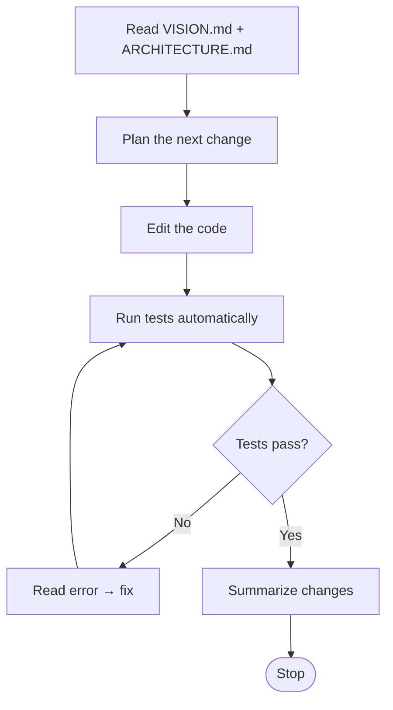
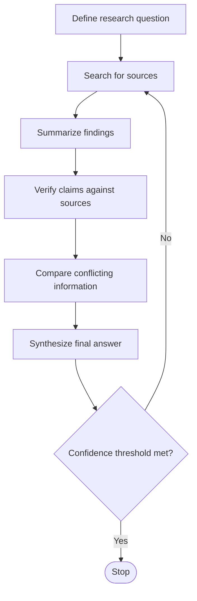
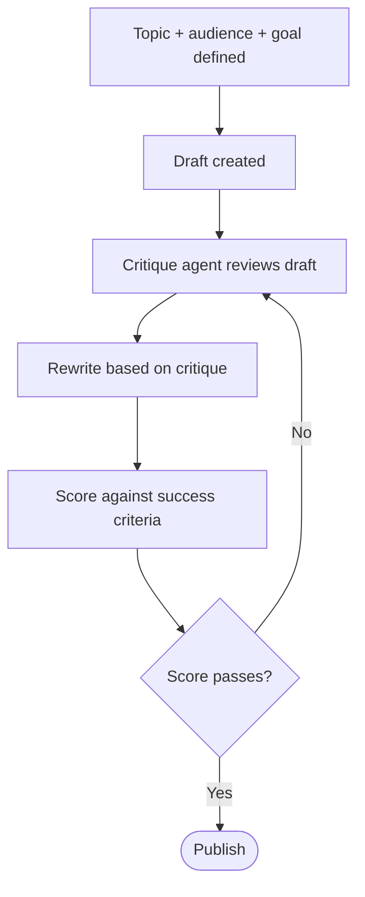
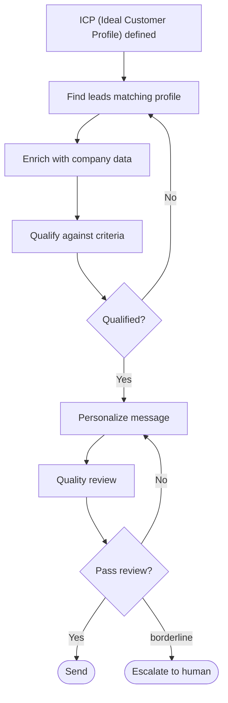

## 摘要（Summary）

「迴圈工程（Loop Engineering）」是 2026 年中浮現的一個概念轉向：**你不再親自提示（prompt）代理人的每一步，而是設計一套會自己提示代理人的系統。** 本筆記以中國 YouTube 頻道「最佳拍档」的中文導讀影片《什麼是循環工程 Loop Engineering》（主持人「大飛」，2026-06-16）為**主敘事線**，疊上先前已攝入的四個文字來源的**深度比較**：上游源頭 Sai Rahul 的 X 長文、Addy Osmani 的部落格、MindStudio 教學文、lunkerchen 的 `loop-engineering-skill` GitHub repo。影片是最易懂的入口骨架；四來源提供它沒講到的源頭考據、實作程式碼與學理脈絡。

> [!important] 影片定位：它是 Addy 文章的「忠實中文轉述」，不是獨立新觀點
> 影片開宗明義即說「結合谷歌雲 AI 總監 Addy Osmani 的一篇深度分析」。其內容（五模組 + 記憶、`/loop`、`/goal`、獨立 verifier、每天早上 triage 迴圈、三大隱憂、收尾金句）幾乎與 Addy 部落格逐段對應，是**既有材料的中文化子集**——與我們既有四來源**沒有任何事實衝突**。它的價值在於：①把抽象概念講成最好懂的中文敘事；②是這波論述「跨語言二次傳播」的活樣本（傳承樹再多一層）。

> [!info] 名詞查證：影片把 Addy 稱為「谷歌雲 AI 總監」是**正確的**
> 我原本以為 Addy Osmani 是 Google Chrome DevRel 主管而想糾正影片，但查他本人官網（addyosmani.com）親述：「a **director at Google Cloud AI**, focused on Gemini, Vertex AI, and the Agent Development Kit (ADK)」。他已從 Chrome 轉到 **Google Cloud AI 總監（Director, Google Cloud AI）**——影片無誤，是我過時。此處記錄查證過程以免知識庫沿用錯誤。

核心結論：五個來源在「迴圈是什麼、需要哪些零件」上高度互補（六原語 + 五階段幾乎是共識）；但在**「驗證的最終責任歸誰」與「成本是該抽象掉還是該正面管理」**兩點上存在真實張力。最值得記住的警句（影片與 Addy 都以此收尾）：「**設計迴圈，但要以工程師的身份去搭建，而不是做一個只會按下啟動鍵的人。**」——這句話其實源自源頭 Rahul 的「build it like someone who intends to stay the engineer」。

> [!important] 一句話定位五來源
> - **最佳拍档影片（主敘事線）** 把 Addy 的分析「講成最好懂的中文」——本筆記的入口骨架，但內容是 Addy 的轉述
> - **Sai Rahul（源頭）** 把 Steinberger / Cherny 的兩則推文「翻譯成完整心智模型」，並補上**成本經濟學**——其餘來源都是它的下游分流
> - **MindStudio** 回答「迴圈是什麼」（WHAT / WHY，往上接到學術界的 ReAct）
> - **Addy Osmani** 回答「迴圈由哪些已上市的產品原語組成」（生態系層，工具中立）
> - **lunkerchen repo** 回答「怎麼把迴圈做出來、為什麼會壞」（實作 + 失敗模式 + 程式碼）

---

## 影片導讀：最佳拍档《什麼是循環工程》逐段精華

> [!note] 本節是「主敘事線」——依影片實際講述順序，用台灣繁體中文重述其論證流程；深一層的源頭考據、程式碼、學理對照見後續各節。影片術語以台灣慣用譯名呈現（簡體稿原文：循环工程→迴圈工程、子Agent→子代理人）。

### 開場：一個矽谷新概念

影片從矽谷 AI 圈的新名詞「迴圈工程」切入，引用兩位重量級人物的相同訊息：

> [!quote] 兩個原始火花
> - **Peter Steinberger（OpenClaw 開發者）**：「你不應該再去手動提示 Coding Agent，你應該設計讓 Agent 自動運行的迴圈。」
> - **Boris Cherny（Anthropic／Claude Code 負責人）**：「我現在已經不手動提示 Claude 了，而是有很多迴圈在後台運行，負責提示 Claude、判斷下一步。我的核心工作就是編寫這些迴圈。」

影片並點名 **Andrej Karpathy 的 AutoResearch** 也是同一思路——把人從迴圈裡抽離、讓系統自主運行、盡量提升 token 吞吐量、讓人不再成為瓶頸。參見 [[2026-04-29-ANDREJ-KARPATHY-FROM-VIBE-CODING-TO-AGENTIC-ENGINEERING-SOFTWARE-3-0]]。

### 什麼是迴圈工程？

影片給的定義最白話：**用你設計的系統，去替代你自己對 Agent 的提示與調度。** 這裡的「迴圈」可理解為一個**遞迴的目標（recursive goal）**——你只定義最終目的，AI 就反覆迭代執行，直到目標完成。一套完整迴圈大概由**五個基本模組 + 一個獨立記憶載體**組成，而 Claude Code 與 OpenAI Codex **兩款主流工具現在都已完整具備**。

> [!warning] 影片誠實點出的兩個早期問題
> 1. **token 成本**：不同使用模式下消耗差異極大，預算有限就必須謹慎規劃迴圈邏輯。
> 2. **程式碼品質下滑**：AI 生成程式碼越來越粗糙的擔憂並非空穴來風，在**無人值守**的迴圈裡這問題更突出。

### 概念定位：迴圈工程在「Harness 的上一層樓」

影片釐清三個相近概念的關係：

```
工廠模型（Factory Model）           ← 一整套「構建軟體」的系統
        ▲
迴圈工程（Loop Engineering）        ← 跑在計時器上、自主生成子代理人、自我驅動
        ▲
Agent Harness Engineering          ← 為「單個」Agent 搭建的運行環境框架
```

> [!tip] 一年前 vs 現在（影片最有感的一段）
> 一年前你想跑自動迴圈，得自己寫一大堆 bash 腳本、長期維護、而且只能自己用、很難遷移；**現在這些核心能力已直接內建到主流產品**。Steinberger 總結的迴圈清單幾乎與 Codex 功能一一對應，也與 Claude Code 高度重合——「當你意識到不同工具底層架構完全一致時，就不會再糾結選哪款工具，只要設計一套通用迴圈邏輯，哪款工具都能跑。」

### 五大模組 + 記憶（影片逐一拆解）

**① 自動化（Automations）— 整個迴圈的「心跳」**
讓迴圈成為「真正的迴圈」而非一次性手動運行。Codex 在自動化分頁建任務（選專案、提示詞、頻率、本地或後台工作樹），有問題進「分類收件匣」、沒問題自動歸檔；OpenAI 內部就用它做每日 issue 分類、CI 失敗彙總、commit 簡報、排查上週 bug，且**自動化可直接呼叫 Skill**（不必把整串指令貼進定時任務）。Claude Code 則用排程 + 鉤子（hooks）+ `/loop` + 定時任務 + GitHub Actions 達成同一件事。

> [!important] 會話內的關鍵：`/goal` 與「寫的人 ≠ 判斷完成的人」
> `/loop` 是按固定節奏重複；`/goal` 則**持續運行直到你設定的條件真正達成**，且每一輪結束後由**一個獨立的小模型**檢查目標是否完成——也就是說「寫程式碼的 Agent」和「判斷有沒有寫完的 Agent」不是同一個。你只要給類似「保證 auth 模組所有測試通過、且 lint 沒問題」這種停止條件，就能放手。Codex 也有同名 `/goal`（跨多輪、可暫停／恢復／清除）。

**② 工作樹（Worktrees）— 解決多 Agent 並行的檔案衝突**
同時跑多個 Agent，很容易多個 Agent 改同一個檔案而撞在一起（等同兩個工程師沒溝通就改同一行）。Git 工作樹建立獨立工作目錄、跑在單獨分支、共享同一倉庫歷史，從物理層面隔離。Codex 內建、Claude Code 用 `--worktree` 參數 + 子 Agent 工作樹隔離（任務結束自動清理）。

> [!warning] 編排稅（Orchestration Tax）：人才是真正的瓶頸
> 影片強調：工作樹只解決「機械層面」的檔案衝突，但整個流程的瓶頸**依然是人本身**——你一天能認真審核多少份程式碼產出，才是你實際能跑多少個 Agent 的上限，而不是工具能同時跑多少線程。

**③ 技能（Skills）— 不必每次開新會話都重講一遍專案**
兩款工具的 Skill 同格式：一個資料夾放一份說明文檔（指令 + 元資料）＋ 可選腳本／參考／資源。Codex 用符號／指令主動呼叫，或在任務描述與 Skill 描述匹配時自動觸發（**所以描述要簡潔準確，而非花俏**）。

> [!note] 關鍵術語：意圖債（Intent Debt）
> Agent 每次開新會話都是從零開始，你沒講清楚的地方它就用「自信的猜測」填補，而這些猜測常與專案實際要求有偏差。Skill 就是把規則、約定、構建步驟、甚至「過往踩過的坑」正式寫下來一次，讓 Agent 每次運行都讀得到——沒有 Skill，迴圈每跑一次就把整個專案從零重新推導。

**④ 外掛與連接器（Plugins / Connectors）— 讓迴圈動到你真實的工具**
影片先釐清一對最容易混淆的概念：**Skill 是內容的「編寫格式」，Plugin 是內容的「分發方式」**——你想把一個 Skill 共享給多個程式碼倉庫、或把好幾個相關 Skill 打包，就封裝成一個 Plugin（Codex 與 Claude Code 通用）。**連接器（Connectors）** 則把 Agent 接入你日常在用的工具，**大多基於 MCP 協議**：讀需求追蹤器、查資料庫、呼叫測試環境介面、甚至在即時通訊工具發訊息。因為兩款工具都支援 MCP，你為其中一款寫的連接器通常在另一款也能直接用；而 Plugin 把連接器 + Skill 打包，同事只要安裝一次就能用整套配置。

> [!important] 普通 Agent vs 完整迴圈（影片點出的核心差別）
> 一個只能操作本地檔案系統的迴圈，能做的事很有限。普通 Agent 只會告訴你「這裡有個修復方案」；**完整的迴圈可以自己建立合併請求（PR）、關聯對應的需求工單、等 CI 通過之後自動在溝通頻道通知相關人員**。有了連接器，迴圈才能真正融入你現有的工作環境，而不只停留在「給建議」的層面。

**⑤ 子代理人（Subagents）— 影片稱「整個迴圈裡最有價值的結構設計」**
核心邏輯是把**寫程式碼的角色**與**檢查程式碼的角色**拆開：讓寫的模型自評，往往判斷寬鬆、看不見自己的邏輯漏洞；而第二個「擁有不同指令、甚至不同模型」的 Agent，就能抓出第一個 Agent 忽略或主動迴避的問題。

> [!tip] 子代理人的模型分工（與 repo 的分層路由完全呼應）
> 影片舉的例子，正好印證後文 repo 的 `route_task`：在配置目錄用設定檔定義各 Agent（名稱／描述／指令／模型／推理強度）——**負責安全審查的 Agent 用能力更強的模型、開更高推理強度；負責瀏覽檔案的探索型 Agent 用速度快的輕量模型、只開只讀權限。** Claude Code 對應機制相同，還能組「Agent 團隊」讓任務在角色間流轉。最常見分工＝**探索／實現／驗證**三角色。

> [!warning] 子代理人的代價與時機
> 子代理人在迴圈裡特別重要，是因為迴圈常在你沒盯著時運行——「只有有一個你信得過的驗證環節，你才能放心讓它自己跑」。但子代理人會**消耗更多 token**（每個都要獨立完成模型呼叫與工具使用），所以不需要到處用，只在「需要二次把關的關鍵場景」開啟才划算。影片並點明：稍早的 `/goal` 底層用的就是同一套邏輯——**判斷迴圈有沒有完成的，是一個全新的模型，而不是執行任務的那個模型**（把「生成與校驗分離」用到了停止條件的判斷上）。

**⑥ 記憶（Memory）— 迴圈的脊椎**
一個 Markdown 檔、一塊 Linear 板，任何活在「單次對話之外」的載體。模型每次 run 之間會遺忘，但記憶檔記著「試過什麼、什麼通過、什麼還沒解決」，明早的 run 就能接著今天停下的地方繼續。

### 收尾：迴圈改變工作形態，但沒把人剔除

影片用三個「會隨迴圈變強而**更突出**、而非更容易解決」的問題收束——這三點與 Addy 原文完全一致：

| # | 問題 | 影片原話精華 |
|---|------|------------|
| 1 | **驗證責任最終在你身上** | 無人值守運行的迴圈，同時是一個無人值守犯錯的迴圈。把驗證子 Agent 與生成 Agent 分開，只是讓「完成」的結論更有參考性，但「完成」仍只是一個聲明、不是嚴格驗證的結論。你的工作依然是交付「你親自確認過可運行」的程式碼。|
| 2 | **理解債（Comprehension Debt）** | 迴圈產出越快，你沒親手寫的程式碼累積越多，「實際存在的程式碼」與「你真正理解的內容」差距越大。唯一解法：認真讀迴圈生成的每一份程式碼。參見 [[CLAUDE-MEMORY-ENGINE]]。|
| 3 | **認知投降（Cognitive Surrender）** | 最舒服的狀態往往最危險——迴圈能自走時，人很容易不再主動思考、照單全收。設計迴圈「既可以是提升效率的解藥，也可以是讓你能力退化的加速劑」，同樣的動作帶來相反結果。|

> [!quote] 影片的定錨結語
> 「兩個人搭建出完全一樣的迴圈，可能得到截然相反的結果。一個用它在自己深度理解的工作上提升效率，另一個用它逃避對工作內容的理解。迴圈本身分辨不出這兩者，但你自己可以。」「Cherny 的意思不是程式設計師的工作變簡單了，而是**工作的槓桿點轉移了**——以前你的槓桿來自寫好提示詞，現在來自設計好一套能持續運行的系統。」「你可以去搭建你的迴圈，但要以一個工程師的身份去搭建，而不是做一個只會按下啟動鍵的人。」

---

## 三來源定位速覽

| 維度 | Addy Osmani 部落格 | MindStudio 教學文 | lunkerchen `loop-engineering-skill` |
|------|------------------|------------------|-------------------------------------|
| 體裁 | 實踐者隨筆（帶懷疑） | 教學文 + 產品行銷 | 開源 Skill（Hermes Agent 格式）|
| 抽象層 | 生態系 / 產品原語 | 概念 / CS 教科書 | 實作 / 工程紀律 |
| 思想源頭 | Peter Steinberger、Boris Cherny（業界 2025–2026） | ReAct 論文（Princeton + Google，學術） | Rahul《Loops 2026》+ Steinberger + Cherny（橋接兩者）|
| 核心框架 | 5 原語 + 記憶（共 6 件） | 迴圈解剖 5 要件 + 4 種迴圈模式 | 5 階段 + 6 元件 + 5 大殺手 |
| 工具立場 | 工具中立（Codex ↔ Claude Code 對照） | 導流到 MindStudio 平台 | Hermes / Nous Research（但開源 MIT）|
| 成本態度 | 警告「token 成本要小心」 | 淡化（交給平台處理） | 正面管理（明列 token 預算 + 分層路由）|
| 對人的角色 | 強調「人仍是天花板與最終驗證者」 | 幾乎不談（強調可自動化、無程式碼）| 強調 maker≠checker，但偏向自動化驗證 |
| License / 形態 | 文章 | 文章（含 FAQ）| MIT，含 3 支 bash script |

> [!note] 上表是「三個下游**文字**觀點」的橫向比較；本筆記主線的影片是 Addy 欄的中文轉述（不另列欄）。三者共同的**上游源頭**是下一節分析的 Rahul 原文。

---

## 源頭考據：Sai Rahul 的原始框架與傳承樹

> [!important] 這一節是本筆記的更新重點。前一版把 Rahul 列為待查；現已取得原文（[X 長文](https://x.com/sairahul1/article/2064277888216555684)），並確認它是整波「Loop Engineering」論述的**中央散播節點**。

### 傳承樹（Lineage）

```
        Peter Steinberger（OpenClaw→OpenAI）："Stop prompting. Design loops."
        Boris Cherny（Claude Code）："My job is to write loops."
                          │  （兩則推文，原始火花）
                          ▼
        ┌─────────────────────────────────────────────┐
        │  Sai Rahul《Loops 2026》X 長文（源頭/普及者）   │
        │  把兩則推文「翻譯成完整心智模型」               │
        │  6 building blocks · 5 stages · open/closed    │
        │  + 成本經濟學（中國 LLM 是解方）                │
        └───────┬───────────────┬───────────────┬───────┘
                │               │               │
        近乎逐字重疊        概念對齊         明確標註 inspired by
                ▼               ▼               ▼
        ┌──────────────┐ ┌──────────────┐ ┌──────────────────┐
        │ Addy Osmani  │ │ MindStudio   │ │ lunkerchen repo  │
        │ 生態系/產品   │ │ 學理(ReAct)  │ │ 實作/Hermes/碼   │
        └──────┬───────┘ └──────┬───────┘ └──────────────────┘
               │ 中文二次傳播      │ 往上接學術源頭
               ▼                 ▼
   ┌────────────────────────┐   ReAct（Reason+Act,
   │ 最佳拍档影片（本筆記主線）│   Princeton+Google）
   │ 大飛・中文導讀・忠實轉述  │
   └────────────────────────┘
```

> [!note] 傳承樹的最底層是本筆記的主敘事線
> 「最佳拍档」影片是 Addy 部落格的**中文二次傳播**——它讓這套概念跨越語言抵達中文觀眾。本筆記刻意以它為入口骨架（好懂），再往上回溯到 Addy（產品原語）、Rahul（源頭框架 + 成本）、MindStudio（ReAct 學理）、repo（實作程式碼）。

### 三項傳承證據（為何斷定 Rahul 是源頭）

1. **repo 明確標註。** `loop-engineering-skill` 的 `README.md` 開宗明義：「Inspired by Rahul's "Loops: What Every AI Engineer Needs to Know in 2026"」。其 SKILL.md 的 token 成本數字（50K–200K / 500K–2M）、分層路由點名的 **DeepSeek V4 Flash / Kimi / MiniMax**，全都直接搬自 Rahul——這解答了原 Open Question「repo 的 token 數字與模型名稱從哪來」。
2. **Addy 與 Rahul 近乎逐字重疊。** 兩篇都用同樣的 Steinberger/Cherny 引言、同樣的「每天早上 triage 迴圈」例子，結尾更幾乎一字不差：Rahul「build it like someone who intends to stay the engineer」↔ Addy「Build the loop. Stay the engineer.」；「兩個人造一模一樣的迴圈會得到完全相反的結果」這段在兩文都出現。傳承關係明確（共同推文源 + 高度互文）。
3. **六原語清單同源。** Rahul 的「6 building blocks」與 Addy / repo 的清單**完全相同且同序**（Automations → Worktrees → Skills → Plugins → Subagents → Memory），且每條都附「它在 5 階段裡觸發哪一步」的對應——這個「原語 ↔ 階段」對應正是 Rahul 的原創編排。

### Rahul 獨有、其他三者較弱的三項貢獻

> [!info] 為什麼仍值得單獨讀 Rahul：他補上了下游各自省略的「為什麼負擔得起」與「先做哪種」。

**(A) 成本經濟學 + 中國 LLM 是解方（最鮮明的原創角度）**

Rahul 把「成本」當成全文的**第一個**段落，而非附註。他直言這是「沒人先告訴你的隱藏障礙」：

> 「Loops are not hard to design. They are hard to afford.（迴圈不難設計，難在負擔得起。）」

他的數字與解方（repo 的成本章節即源自此）：

| 規模 | Token 消耗 |
|------|-----------|
| 單代理人中型編碼任務 | 50,000–200,000 tokens |
| 艦隊迴圈（orchestrator + 3 專家）| 500,000–2,000,000 tokens |
| 每日排程迴圈 | 每週數百萬 tokens |

解方是**中國前沿模型**——DeepSeek V4、Kimi、MiniMax 讓迴圈「在經濟上可行」。他特別點名 DeepSeek V4：**1M 上下文視窗、384K 最大輸出、Flash + Pro、極低 token 定價、高併發（Flash 達 2500 requests）**，並下了金句：「**1.7 billion tokens for \$20**，你終於負擔得起造一個迴圈。」

> [!warning] 偏誤提醒
> 此段帶有明顯的「中國模型推廣」傾向（數字與定價皆為自述、未引第三方評測）。可信的部分是**論點結構**（成本是真實障礙、便宜前沿模型改變方程式）；不可盡信的是**具體數字與模型優劣排名**。

**(B) Open Loop vs Closed Loop——「2026 最重要的實務區分」**

| 類型 | 特性 | 預算 | Rahul 的建議 |
|------|------|------|-------------|
| **Open Loop（開環）** | 探索性、自由漫遊、能做出你沒完整 spec 的東西 | 燒錢兇（「眼睛流淚」）| 對標準鬆散的專案會變「slop machine」；90% 沒有無限預算的人「還不實用」|
| **Closed Loop（閉環）** | 有界、人先設計好端到端路徑 + 每步 eval gate | 一般預算可負擔 | **先從閉環開始**，建好品質閘門後再開放 |

repo 的「Open/Closed 兩種迴圈類型」即直接繼承這組區分，但 Rahul 把它和**預算**綁在一起講，更務實。

**(C) Prompt Engineer vs Loop Engineer——明確的技能斷層表**

| | Prompt Engineer | Loop Engineer |
|---|----------------|---------------|
| 核心 | 寫更好的指令（語言技巧）| 設計更好的回饋循環（軟體工程技巧）|
| 產出 | 更好的單次輸出 | 可靠、已驗證的結果 |
| 誰是回饋循環 | **你**（每次手動 review）| **系統**（自我檢查、自我修正）|
| 一句話 | "Write me a function" | "Write → test → fix until green" |
| 付費對象 | 單次輸出 | 已驗證的結果 |

> [!quote] Rahul 的定錨句
> 「Prompt engineers ask AI for output. Loop engineers design systems that produce verified outcomes.（提示工程師向 AI 要產出；迴圈工程師設計能產出『已驗證結果』的系統。）」「One reliable loop is worth a thousand perfect prompts.（一個可靠的迴圈，勝過一千個完美的提示。）」

### Rahul 的四個實戰迴圈範本（Mermaid 流程圖 + 適用情境）

Rahul 給了四個可直接套用的迴圈骨架，這是其他三者都沒有的「即用範本」。以下用 **Mermaid 流程圖**呈現（Obsidian 原生支援），節點文字保留 Rahul 英文原文，菱形是停止／回跳的判斷閘門——能清楚看出「迴圈回跳」的箭頭。每張圖後附**實際 use case**。

**① The Coding Loop（編碼迴圈）**



> [!example] 🎯 適用 use case
> 自動修 bug、TDD 紅綠循環、CI 失敗自動修復、相依套件升級後修壞掉的測試、重構後跑回歸測試。**停止條件最明確（測試全綠 + lint 乾淨）**，因此是四者中最適合「閉環（closed loop）、無人值守」的一種——正是 repo `dev-loop.sh` 實作的那個迴圈（見下方〈實作紀律〉）。

**② The Research Loop（研究迴圈）**



> [!example] 🎯 適用 use case
> 競品 / 技術選型調研、文獻回顧、盡職調查（due diligence）、**事實查核**（例如我剛幫你查 Addy Osmani 的職稱就是跑這個迴圈）、市場分析。關鍵在「Confidence threshold（信心門檻）」這個停止條件，以及「Verify claims against sources / Compare conflicting information」兩步——少了它就會變成幻覺製造機。屬**半開環**（探索性、可能多輪 search），對應 superpowers 的 deep-research 模式。

**③ The Content Loop（內容迴圈）**



> [!example] 🎯 適用 use case
> 部落格 / 行銷文案、技術文件、社群貼文、電子報、發布稿。其中「Critique agent reviews draft」正是 **maker≠checker** 用在內容領域的實作。停止條件是「Score passes（評分過關）」——**前提是 success criteria 必須先定義清楚**（如可讀性分數、字數、語氣檢核表），否則迴圈不知何時該停。屬閉環。

**④ The Sales Outreach Loop（業務開發迴圈）**



> [!example] 🎯 適用 use case
> 名單開發（lead gen）、潛客資格審查、個人化開發信、ABM（account-based marketing，目標客戶行銷）。它是四者中**唯一內建 human-in-the-loop**（Send **or escalate to human**）的——因為對外觸及風險高，品質審查沒過就升級給真人，而非自動寄出。適合**半自動**而非全自動運行。

### 四個迴圈一覽：停止條件、迴圈類型與代表 use case

| 迴圈 | 核心停止條件 | 迴圈類型 | 代表 use case |
|------|------------|---------|--------------|
| ① Coding | 測試全綠 + lint 乾淨 | 閉環、可無人值守 | 自動修 bug、CI 修復、重構回歸 |
| ② Research | 信心門檻達標（多源交叉驗證）| 半開環（探索性）| 競品調研、盡職調查、事實查核 |
| ③ Content | 評分過關（需先定義 criteria）| 閉環 | 文案、技術文件、電子報 |
| ④ Sales | 通過品質審查，否則升級給人 | 半自動（human-in-loop）| 名單開發、個人化開發信、ABM |

> [!tip] 共同骨架
> Rahul 點破四者其實是同一副骨架：**Goal → Action → Check → Fix → Repeat until done。** 換掉「Action」與「Check」的內容，就是不同領域的迴圈。對照四張圖會發現：差別只在「菱形閘門問什麼」（測試過？信心夠？評分過？資格符合／審查過？）與「回跳到哪一步」。

---

## 關鍵洞察（Key Insights）

- **槓桿點移動，不是工作變簡單。** 三者一致：價值從「寫好一個 prompt」移到「設計好一個迴圈」。Addy 點破——Cherny 的意思不是工作變輕鬆，而是「leverage point moved（槓桿支點移位了）」。參見 [[2026-04-29-ANDREJ-KARPATHY-FROM-VIBE-CODING-TO-AGENTIC-ENGINEERING-SOFTWARE-3-0]] 的 Software 3.0 脈絡。
- **「迴圈」的反面是「鏈（chain）」。** MindStudio 給了最清楚的定義學界界線：chain 是線性 A→B→C 且可預測；loop 是動態的，可重試、可改策略、可回退。迴圈工程的本質就是「閉合回饋落差（close the feedback gap）」。
- **六大原語在三者間幾乎逐一對齊。** Automations、Worktrees、Skills、Plugins/Connectors、Subagents、Memory——Addy 與 repo 用的是**同一份清單**，差別只在 Addy 對照 Codex/Claude Code 產品，repo 對照 Hermes 實作。這代表此清單已接近業界共識。
- **maker ≠ checker 是迴圈能無人值守的唯一理由。** repo 把它寫成硬規則：Worker（context A）與 Verifier（context B）必須是**獨立 API 呼叫、無共享歷史**——「繼承了 worker 上下文的 verifier，也繼承了它的盲點」。這正是 Claude Code `/goal` 底層在做的事。參見 [[2026-03-30-BORIS-CHERNY-HIDDEN-CLAUDE-CODE-FEATURES]]。
- **「迴圈是 harness 的上一層樓。」** Addy 明言 loop engineering 坐落在 agent harness engineering 之上——harness 是單一代理人運行的環境，loop 是讓它「按時觸發、生小幫手、自我餵食」的那一層。參見 [[2026-04-02-HARNESS-ENGINEERING-COMPLETE-GUIDE]]、[[2026-04-09-ANTHROPIC-SHIPPED-THREE-OF-FIVE-HARNESS-LAYERS]]。
- **記憶必須在磁碟上，不在上下文裡。** 三者都強調：模型每次 run 之間會遺忘，所以「做完什麼、下一步什麼」要存成 Markdown / Linear 板 / 狀態檔。repo 更進一步——**存的是「規則」不是「日誌」**。參見 [[CLAUDE-MEMORY-ENGINE]]。
- **真正的障礙不是智力，是 token 成本。** 這是源頭 Rahul 最被低估、卻被下游淡化的洞察：「迴圈不難設計，難在負擔得起。」開環（open loop）燒錢兇到「90% 沒有無限預算的人還不實用」——所以務實路線是**先做閉環（closed loop）**，用便宜前沿模型，建好品質閘門再開放。參見 [[2026-05-17-GARRY-TAN-TOKENMAXXING-GSTACK-400X-PRODUCTIVITY]]。

---

## 詳細內容（Details）

### 一、共同核心：六大原語與五階段

三來源最大的交集，是把「一個會自走的迴圈」拆成可辨識的零件。Addy 與 repo 的清單幾乎一字不差：

| 原語（Primitive） | 在迴圈裡的職責 | Codex App（Addy） | Claude Code（Addy） | Hermes 實作（repo） |
|------------------|--------------|-------------------|---------------------|---------------------|
| **Automations** | 排程觸發發現與分流（心跳） | Automations 分頁 + Triage 收件匣 + `/goal` | 排程任務、cron、`/loop`、`/goal`、hooks、GitHub Actions | `cronjob` 排程 |
| **Worktrees** | 平行代理人不互相踩檔 | 每 thread 內建 worktree | `git worktree`、`--worktree`、`isolation: worktree` | `git worktree add` → `.worktrees/<branch>/` |
| **Skills** | 把專案知識寫下來、每 run 複利 | Agent Skills（`SKILL.md`） | Agent Skills（`SKILL.md`） | `project-context/*` + VISION/ARCH/RULES 文件 |
| **Plugins / Connectors** | 讓迴圈能動到真實工具（DB、Slack、Linear） | Connectors（MCP）+ plugins | MCP servers + plugins | MCP 工具、`delegate_task` |
| **Subagents** | 出主意的人 ≠ 檢查的人 | `.codex/agents/`（TOML） | `.claude/agents/` + agent teams | `delegate_task role=leaf/orchestrator` |
| **Memory / State** | 跨 run 不遺忘 | Markdown 或 Linear（connector）| Markdown（`AGENTS.md`、進度檔）或 Linear（MCP）| `.dev-loop-state.md`、`skill-compounder.sh` |

repo 則把「執行流程」濃縮成**五階段（5 Stages）**，這是 MindStudio 的 ReAct「reason→act→observe→repeat」之工程化版本：

```
DISCOVER ─► PLAN ─► EXECUTE ─► VERIFY ─► ITERATE（或 DONE）
   探索        規劃      只做必要      獨立      過 = 出貨
   狀態        分解      的事 + 抓     脈絡      不過 = 診斷
            選模型層級    輸出/metadata  驗證      → 換策略再迴圈
```

> [!note] 關鍵術語（Key Term）：ReAct 模式（Reason + Act）
> 由 Princeton 與 Google 提出，做法是**把推理步驟與行動步驟交錯**：模型先想（reason）、再做（act）、觀察結果（observe）、再想、再做。MindStudio 指出，現代所有代理人迴圈幾乎都可追溯到這個模式——它是迴圈工程的學理起點。

### 二、三方比較矩陣：互補與互斥

#### 🟢 互補之處（三者拼起來才完整）

1. **抽象層互補（這是最大的價值）。** 三者剛好疊成一個堆疊：MindStudio 的「迴圈解剖」（Goal / Tools / Context / Termination / Error handling）解釋了 repo「五大殺手」每一條在防什麼；Addy 的「六原語」則告訴你這些零件**今天用哪個產品按鈕就能拿到**。

   ```
   ┌──────────────────────────────────────────────┐
   │  MindStudio：WHY / WHAT                        │
   │  ReAct 學理、迴圈 vs 鏈、解剖 5 要件、4 種模式    │
   └───────────────────┬──────────────────────────┘
                       │ 「概念落地成產品」
   ┌───────────────────▼──────────────────────────┐
   │  Addy Osmani：生態系原語                        │
   │  6 原語 × Codex/Claude Code 對照、工具中立        │
   └───────────────────┬──────────────────────────┘
                       │ 「產品落地成程式碼」
   ┌───────────────────▼──────────────────────────┐
   │  lunkerchen repo：實作紀律                      │
   │  5 階段、5 殺手、Worker/Verifier 碼、bash script │
   └──────────────────────────────────────────────┘
   ```

2. **失敗模式 ↔ 解剖要件，恰好對應。** MindStudio 的「一個好迴圈需要的 5 要件」與 repo 的「5 大殺手」是同一枚硬幣的兩面：

   | MindStudio 解剖要件（正面） | repo 5 大殺手（反面） |
   |--------------------------|---------------------|
   | 明確目標 + 可測終止條件 | （目標模糊 → 無限迴圈）|
   | 上下文管理 | **Context Collapse**（第 12 步忘了第 1 步要什麼）|
   | 錯誤處理（真正適應，非重試）| **No Self-Correction**（同錯重試、昂貴空轉）|
   | 終止邏輯（成功/失敗/升級）| —（對應 repo 的 VERIFY gate）|
   | 工具集 | —；repo 補上 **No Verifier / No Guardrails / No Memory** |

3. **迴圈模式詞彙互補。** MindStudio 提供了 Addy 與 repo 都沒明列的「模式分類學」：Retry Loop、Plan-Execute-Verify Loop、Explore-Narrow Loop、Human-in-the-Loop——這是挑選迴圈架構時的實用詞彙表。

#### 🔴 互斥 / 張力之處（三者真正分歧）

> [!warning] 張力一：驗證的「最終責任」歸誰？——這是最深的分歧
> - **repo**：驗證可以、也應該交給一個**獨立 context 的自動 verifier**（Worker/Verifier 分離）。傾向「把人移出迴圈」。
> - **Addy**：「**Verification is still on you.**」一個無人值守的迴圈，也是一個無人值守地在犯錯的迴圈。自動 verifier 只是讓「它說完成了」這句話更有份量，但「done 是一個主張、不是一個證明」。
> - **判讀**：兩者不矛盾於技術（都要 maker≠checker），但矛盾於**態度**。repo 解決「機器如何自查」，Addy 提醒「人不能因此交出判斷力」——他稱失去判斷的姿態為 **cognitive surrender（認知投降）**。

> [!warning] 張力二：成本——抽象掉，還是正面管理？（四來源在此分歧最大）
> - **Rahul（源頭）**：成本是**全文第一章**、是「沒人先說的隱藏障礙」。解方＝中國前沿模型（DeepSeek V4 / Kimi / MiniMax），「1.7B tokens for \$20」。最積極面對成本，但帶中國模型推廣偏誤。
> - **repo**：把成本當一級設計議題——明列「單代理人中型任務 50K–200K tokens、艦隊迴圈 + 3 專家 500K–2M、每日排程迴圈每週數百萬」，並用**分層模型路由（Tiered Routing）**正面管理。**此數字與模型清單即承自 Rahul。**
> - **Addy**：居中但偏警戒——「你絕對**必須**小心 token 成本，用量模式落差極大」。參見 [[2026-05-17-GARRY-TAN-TOKENMAXXING-GSTACK-400X-PRODUCTIVITY]]、[[2026-04-18-CLAUDE-CODE-TOKEN-QUOTA-THREE-TRAPS-AND-FIXES]]。
> - **MindStudio**：基礎設施（重試、限流、狀態管理）「跟實際邏輯無關」，應交給平台（賣點：`@mindstudio-ai/agent` SDK）。**淡化成本**——與 Rahul 恰成兩極。

> [!warning] 張力三：廠商視角的偏誤（Vendor Bias）
> - **MindStudio**：目的是賣平台，因此論述傾向「迴圈很難、基礎設施很煩、交給我們」。
> - **Addy**：刻意工具中立——「一旦你發現形狀都一樣，就不再爭論用哪個工具」。
> - **repo**：綁 Hermes / Nous Research 術語（Fable 5、`delegate_task`、`max_spawn_depth`），但 MIT 開源、可移植。

### 三、實作紀律的精華：repo 的可執行模式

repo 的獨到貢獻，是把抽象原則變成**可貼上就用的程式碼**。以下完整保留三段最關鍵的實作（依語言規則，程式碼不翻譯、不省略）：

**(1) Worker / Verifier 必須是獨立 context**

```python
# worker builds in context A
worker = client.messages.create(model="...", messages=[{"role": "user", "content": prompt}])

# verifier grades in context B — completely independent
verifier = client.messages.create(
    model="...",
    messages=[{"role": "user", "content": f"Grade this output against this rubric:\n\nOUTPUT: {worker.text}\n\nRUBRIC: {rubric}"}]
)
# No shared history. No bias. Clean judgment.
```

**(2) 分層模型路由（Tiered Model Routing）——別用最貴的模型做每件事**

```python
def route_task(task_type, complexity):
    if task_type in ("architecture_decision", "hard_bug_diagnosis",
                     "multi_file_reasoning", "final_verification",
                     "ambiguity_resolution") or complexity == "high":
        return "best-model"        # Fable 5, Opus
    elif task_type in ("data_extraction", "reformatting",
                       "boilerplate_generation", "simple_edit",
                       "routine_retry") and complexity == "low":
        return "cheap-model"       # Haiku, MiniMax
    else:
        return "mid-model"         # Sonnet, DeepSeek V4 Flash
```

> [!tip] 可執行建議（Actionable Tip）
> 規則：「**只在判斷力重要時才升級到貴模型。大多數迴圈迭代很便宜——驗證才是該花錢的地方。**」這與 [[2026-05-17-GARRY-TAN-TOKENMAXXING-GSTACK-400X-PRODUCTIVITY]] 的 token 經濟學一致。

**(3) 記憶存「規則」不存「日誌」（Memory as Rules, Not Logs）**

```python
def extract_rule(client, failed_attempt, error_output):
    response = client.messages.create(
        model="best-model",
        messages=[{"role": "user", "content": f"""
A task just failed. Extract ONE general rule to remember for next time.

WHAT FAILED:
{failed_attempt}

ERROR:
{error_output}

Write a single clear rule that would prevent this failure in the future.
Format: "RULE: [concise general principle]"
Do not write a note about this specific case.
Write a rule that applies broadly.
"""}]
    )
    return response.text
```

**(4) 閉環腳本 `dev-loop.sh` 的核心迴圈（write → test → fix → verify）**

```bash
while [ "$ITER" -lt "$MAX_ITER" ] && [ "$PASS" = false ]; do
  ITER=$((ITER + 1))
  echo "--- Iteration $ITER/$MAX_ITER ---"

  # Phase: TEST
  TEST_OUTPUT=$(eval "$TEST_CMD" 2>&1) || true
  TEST_EXIT=$?

  if [ "$TEST_EXIT" -eq 0 ]; then
    echo "✓ All tests passed!"
    PASS=true
    break
  fi

  echo "✗ Tests failed (exit $TEST_EXIT)"
  echo "$TEST_OUTPUT" | tail -40

  if [ "$ITER" -ge "$MAX_ITER" ]; then
    echo "⚠ Max iterations ($MAX_ITER) reached. Loop stopping."
    echo "$TEST_OUTPUT" > ".dev-loop-last-error.log"
    break
  fi
  # 代理人讀上面的錯誤 → 改碼 → 重跑
done
```

### 四、迴圈架構全圖（repo 的 Worker + Verifier 控制流）

```
                    ┌─────────────────────────────────┐
                    │           LOOP CONTROLLER        │
                    │  (orchestrator / cron trigger)   │
                    └──────────┬───────────────────────┘
                               │
                    ┌──────────▼──────────┐
                    │    GOAL + CONTEXT    │
                    │  (what done means)   │
                    └──────────┬──────────┘
                               │
                    ┌──────────▼──────────┐
                    │  1. DISCOVER + PLAN  │
                    │  (decompose, route)  │
                    └──────────┬──────────┘
                               │
                    ┌──────────▼──────────┐
                    │  2. WORKER (ctx A)   │
                    │  execute -> produce  │
                    └──────────┬──────────┘
                               │  output
                    ┌──────────▼──────────┐
                    │  3. VERIFIER (ctx B) │
                    │  independent check   │
                    │  no shared history   │
                    └──────────┬──────────┘
                               │
                    ┌──────────▼──────────┐
                    │  4. GATE  pass/fail? │
                    └──────┬──────┬────────┘
                        PASS      FAIL
                           │      │
                    ┌──────▼┐  ┌──▼──────────────┐
                    │ DONE  │  │ 5. DIAGNOSE      │
                    └───────┘  │ root cause       │
                               │ extract rule     │
                               │ new approach     │
                               └──┬───────────────┘
                                  │  back to EXECUTE
                                  └─────────────────►
```

> [!example] Addy 描述的「一個迴圈長什麼樣」（生態系語言版的同一件事）
> 每天早上一個 automation 在 repo 上跑 → 呼叫 triage skill 讀昨天的 CI 失敗、open issues、近期 commits → 寫進 Markdown / Linear → 每個值得做的發現開一個隔離 worktree → 派 sub-agent 起草修正 → 第二個 sub-agent 對照 project skills 與既有測試審查 → connector 開 PR、更新 ticket → 處理不了的丟進 triage 收件匣給人。「**你只設計了一次，沒有提示其中任何一步。**」

---

## 我的心得（My Takeaways）

1. **這三篇該一起讀，而不是擇一。** 單看 MindStudio 會以為是 CS 概念複習；單看 repo 會陷進 Hermes 術語；單看 Addy 又少了可貼上的程式碼。三者疊起來，正好是「概念→產品→程式碼」的完整下樓梯。
2. **六原語清單可直接當我自己的 Loop 自評表。** 我可以拿 Automations / Worktrees / Skills / Plugins / Subagents / Memory 六格，逐格檢查自己現有的 Claude Code 工作流缺哪一塊——這比抽象口號實用得多。對照 [[2026-04-09-ANTHROPIC-SHIPPED-THREE-OF-FIVE-HARNESS-LAYERS]] 的「五層只出三層」盤點法。
3. **「Memory as Rules, not Logs」是最被低估的一招。** 我目前的知識庫多半在存「發生了什麼」，而 repo 提醒我該存「下次該遵守什麼規則」。這正好可以回饋到我自己的 auto-memory 機制。
4. **Addy 的警句是定錨。** 「兩個人造一模一樣的迴圈會得到完全相反的結果。一個用它在自己深刻理解的工作上跑更快，另一個用它來逃避理解工作本身。迴圈分不出差別，你分得出。」——這句話該貼在每個 cron 旁邊。
5. **影片是「最好懂的入口」，但別停在影片。** 最佳拍档的中文導讀把概念講得極清楚，適合第一次接觸時建立直覺；但它是 Addy 的轉述、是材料的子集——真正的深度（源頭 Rahul 的成本經濟學、repo 的 Worker/Verifier 程式碼、ReAct 學理）在影片裡是看不到的。這本身就是「理解債」的微型示範：看完影片以為懂了，其實只摸到傳承樹的最底層。
6. **跨語言傳播是個值得追蹤的訊號。** 一個矽谷概念在 Addy 發文後數日就出現高品質中文導讀（影片 2026-06-16，Addy 文 2026-06-07），說明這類「迴圈工程」論述的擴散極快。對我自己的知識庫策略而言：抓到源頭（Rahul）比抓到任一下游轉述都更有價值。

---

## 知識層次分析（Bloom's Taxonomy Analysis）

> 以下從五個認知層次對本篇綜合內容進行結構化分析，協助從記憶到評估逐層深化理解。

| 認知層次 | 核心目的 | 對本文的具體應用 |
|---------|---------|--------------|
| **記憶（被動）** | 確認資訊存在，確立基礎知識 | 必記術語：①迴圈工程（Loop Engineering）②ReAct（Reason+Act）③六原語（Automations/Worktrees/Skills/Plugins/Subagents/Memory）④五階段（DISCOVER→PLAN→EXECUTE→VERIFY→ITERATE）⑤5 大殺手（Context Collapse / No Self-Correction / No Verifier / No Guardrails / No Memory）|
| **理解（半被動）** | 解釋概念含義與關聯 | 迴圈工程＝把槓桿點從「寫 prompt」移到「設計會自走的回饋系統」。它座落於 harness 之上；學理源於 ReAct；落地靠六原語；可靠性靠 maker≠checker 的獨立驗證。五個來源（影片中文導讀＋源頭 Rahul＋Addy／MindStudio／repo 三下游）是同一概念在不同語言與抽象層的切面。|
| **分析（主動）** | 檢驗論點、找出假設 | 關鍵假設：①「獨立 context 的 AI verifier 可信到能無人值守」——Addy 質疑此假設（done 是主張非證明）。②MindStudio 假設「成本可被平台抽象掉」——repo 用實際 token 數字反駁。③六原語清單假設 Codex 與 Claude Code 會持續趨同，若產品分化此對照即失效。|
| **應用（主動）** | 將知識轉為行動 | ①用六原語表盤點自己的 Claude Code 工作流缺口。②把 `route_task` 的分層路由套到自己的多代理腳本，驗證步驟才上 Opus。③在知識庫導入「Memory as Rules」——失敗後抽一條通用規則而非存日誌。|
| **評估（主動）** | 判斷方案優劣與取捨 | 何時該建迴圈 vs 直接 prompt？評估：迴圈在「你深刻理解、且有可測終止條件（測試/lint）」的重複性工作上收益最大；在探索性、需求未定、或你不熟的領域，直接 prompt 反而更安全（避免 comprehension debt 與 cognitive surrender）。MindStudio 的無程式碼平台適合非工程師起步，但會犧牲對成本與終止邏輯的掌控。|

### 分析型追問（Socratic Follow-up）

- **澄清**：「迴圈（loop）」與「代理（agentic）」「harness」三詞最容易混用——本文界定：harness 是單一代理的環境，loop 是讓它按時自走的上一層，agentic 是更廣的傘狀詞。哪個邊界最模糊？
- **假設**：整套迴圈工程成立的最關鍵前提是「自動 verifier 真的能抓到 worker 的錯」。若 verifier 與 worker 用同一個基礎模型、只是不同 context，它們是否共享同一類盲點？
- **證據**：repo 的 token 成本數字（50K–2M）來源未標註、Fable 5 等模型名稱無法查證；MindStudio 的 SDK 能力（120+ 方法）也是自述。哪些主張需要獨立佐證？
- **觀點**：若站在「prompt engineering 還沒過時」的反方，最有力的反駁是——對一次性、創造性、需求模糊的任務，設計迴圈的固定成本遠高於直接對話。
- **後果**：若一個團隊把所有開發都交給排程迴圈，12 個月後最可能出現的非預期副作用是什麼？（候選：comprehension debt 累積、對程式碼失去 mental model、token 帳單失控、對單一代理框架鎖定。）

### 方案批判三問（Critical Evaluation）

> 本文含 repo 的可執行方案（bash script + Python 模式），故加入此區塊。

1. **最大的風險是什麼？** 無人值守迴圈在最壞情況下會「無人值守地持續犯錯並出貨」——若 guardrails（RULES.md、預算上限、唯讀模式）沒設好，可能刪檔、花錢、對外呼叫 API 而無人察覺。更隱性的損失是**工程師對自己程式碼失去理解（comprehension debt）**，最終品質下滑、陷入 Addy 說的「越挖越深的下行螺旋」。
2. **什麼情況下會失敗？** ①目標無法寫成可測終止條件（沒有測試/lint 當 gate）→ 迴圈不知何時停。②worker 與 verifier 共享盲點 → 自動驗證形同虛設。③上下文未分解的長任務 → Context Collapse。④token 預算未設 → 艦隊迴圈每週燒數百萬 token。⑤產品/框架快速演化 → 綁定 Hermes 或 MindStudio 的實作過時。
3. **有沒有更好的替代方案？** 對「你深刻理解 + 重複性 + 可驗證」的工作，迴圈優於直接 prompt；但對**探索性、一次性、需求未定**的工作，**直接 prompt（保留 human-in-the-loop）反而更省成本、風險更低**。務實做法是混合：用迴圈處理 triage / 測試修復 / 例行維護，用直接對話處理架構決策與不確定問題——Addy 本人即主張「找到正確的平衡」。

---

## 待補充（Open Questions）

- ~~repo 引用的「Rahul《Loops 2026》」原文在哪？~~ ✅ **已解決（本次更新）**：原文為 [Sai Rahul 的 X 長文](https://x.com/sairahul1/article/2064277888216555684)，已納入〈源頭考據〉一節；它是三個下游來源的共同上游。
- ~~repo 的 token 數字與「DeepSeek V4 Flash / MiniMax」模型清單從哪來？~~ ✅ **部分解決**：直接承自 Rahul 原文的成本章節。但**仍未解**：Rahul 的數字本身是量測還是估計？「Fable 5」對應 2026 年哪個實際模型？建議搜尋：`DeepSeek V4 1M context pricing benchmark`、`Hermes agent Fable 5 model`。
- 自動 verifier 與 worker 用**同一基礎模型不同 context**時，能否真正避免「共享盲點」？有沒有實證評測顯示獨立 context 比 self-critique 抓錯率高多少？建議搜尋：`verifier shared context blind spot eval`、`self-critique vs independent verifier LLM`。
- **新增**：Rahul 與 Addy 的高度互文，究竟是誰引用誰、還是兩人同時取材自 Steinberger 的推文串？兩篇的發布先後與引用方向值得考據。建議搜尋：`steipete loops tweet`、`addyosmani loop engineering sairahul`。
- **新增**：Rahul 強推中國 LLM（DeepSeek/Kimi/MiniMax）作為迴圈成本解方，這個成本優勢在 2026 下半年是否仍成立？西方前沿模型降價後，此論點會不會失效？
- Codex App 與 Claude Code 的六原語對照，在本文發布後是否仍成立？兩產品會持續趨同還是分化？建議追蹤兩者 changelog。
- MindStudio 的 `@mindstudio-ai/agent` SDK「120+ typed capabilities」在真實多代理迴圈中的可靠性與鎖定風險如何？是否有第三方評測？
- 「迴圈工程會不會只是 agent harness engineering 的行銷重新包裝？」Addy 自己把它定位為 harness 的上一層，但兩者邊界在實作上是否真的可分？
- ~~影片逐字稿在「Skills」與「三大隱憂」之間略過了 Plugins／Subagents？~~ ✅ **已查證並更正**：那是我第一次擷取逐字稿時內容不完整的**假象**，不是影片真的略過。重抓帶時間戳的逐字稿確認，影片在 **9:59–13:17** 完整講了 Plugins／Connectors 與 Subagents（含 Skill vs Plugin 分工、MCP 連接器、安全審查 Agent 用強模型 / 探索 Agent 用只讀輕量模型、`/goal` 用全新模型判斷完成）。〈影片導讀〉第 ④⑤ 模組已據此補齊。
- ✅ **已查證**：影片整段（0–18:31）**確實沒有**提到源頭 Rahul，也沒提 token 成本的中國 LLM（DeepSeek/Kimi/MiniMax）解方——它只忠實轉述 Addy。仍未解的是：大飛是只讀了 Addy 沒讀 Rahul，還是刻意省略推廣爭議？這影響我們判斷中文圈對此概念的理解完整度。

---

## 相關連結（Related）
- [[2026-06-24-CODEBASE-MEMORY-MCP-PRO-VS-CODEGRAPH-CODE-KNOWLEDGE-GRAPH-COMPARISON]] — 索引器/查詢器分離呼應 Worker/Verifier 職責分離

- [[2026-06-17-WHAT-IS-LOOP-ENGINEERING-HOW-DIFFERENT-HARNESS-ENGINEERING]] — Akshay Kokane 從 FDE 視角補上 Loop vs Harness 的務實邊界與成本判準
- [[2026-04-02-HARNESS-ENGINEERING-COMPLETE-GUIDE]] — Addy 明言「迴圈是 harness 的上一層樓」，本筆記是其直接延伸
- [[2026-04-09-ANTHROPIC-SHIPPED-THREE-OF-FIVE-HARNESS-LAYERS]] — 用「分層盤點」法看哪些原語已上市，與本文六原語對照表同源
- [[2026-03-30-BORIS-CHERNY-HIDDEN-CLAUDE-CODE-FEATURES]] — 三來源共同引用的 Cherny「我的工作是寫迴圈」；`/loop`、`/goal` 等隱藏功能即迴圈原語
- [[2026-03-17-KARPATHYS-AGENTHUB-A-PRACTICAL-GUIDE-TO-BUILDING-YOUR-FIRST-AI-AGENT-SWARM]] — 對應 repo 的 Fleet Loop（orchestrator→specialists→subagents）
- [[2026-05-17-GARRY-TAN-TOKENMAXXING-GSTACK-400X-PRODUCTIVITY]] — 呼應三來源在 token 成本上的分歧，提供成本側對照
- [[CLAUDE-MEMORY-ENGINE]] — 對應第六原語 Memory；可延伸到 repo 的「Memory as Rules, not Logs」
- [[2026-04-29-ANDREJ-KARPATHY-FROM-VIBE-CODING-TO-AGENTIC-ENGINEERING-SOFTWARE-3-0]] — 「槓桿點移動」的更大時代脈絡

## References

- 【主敘事線・影片】[什麼是循環工程 Loop Engineering | … | Addy Osmani — 最佳拍档（Best Partners TV）](https://www.youtube.com/watch?v=KgiwIEBeOHw)（2026-06-16，時長 18:32，主持人大飛；Addy 部落格的中文導讀）
- 【上游源頭】[Loops: What Every AI Engineer Needs to Know in 2026 — Sai Rahul (@sairahul1)](https://x.com/sairahul1/article/2064277888216555684)（X 長文，本波論述的中央散播節點）
- [Loop Engineering — Addy Osmani](https://addyosmani.com/blog/loop-engineering/)（2026-06-07）
- [What Is Loop Engineering? The New Meta for AI Coding Agents — MindStudio](https://www.mindstudio.ai/blog/what-is-loop-engineering-ai-coding-agents)
- [loop-engineering-skill — lunkerchen (GitHub, MIT)](https://github.com/lunkerchen/loop-engineering-skill)（repo 建立 2026-06-10，SKILL v1.1.0）
