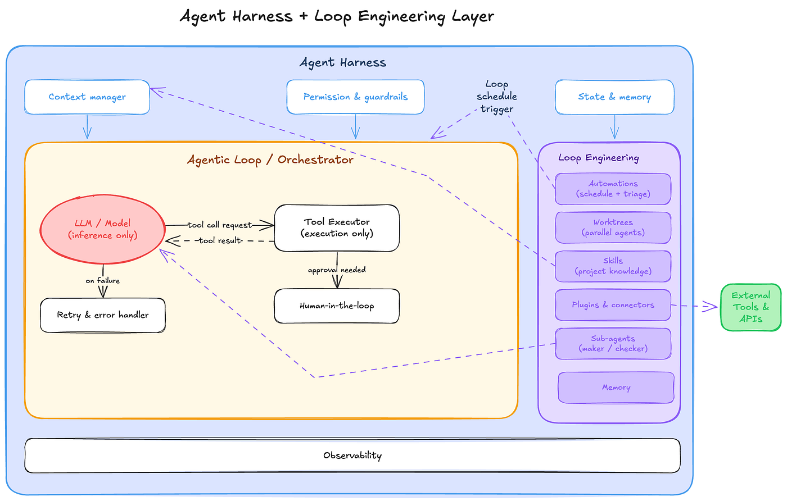
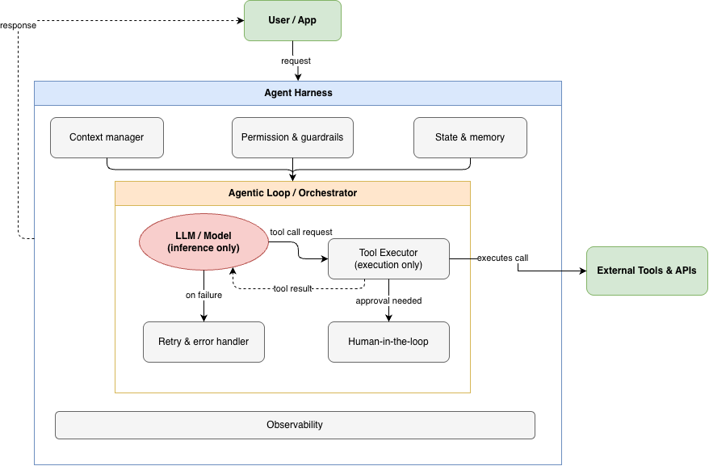
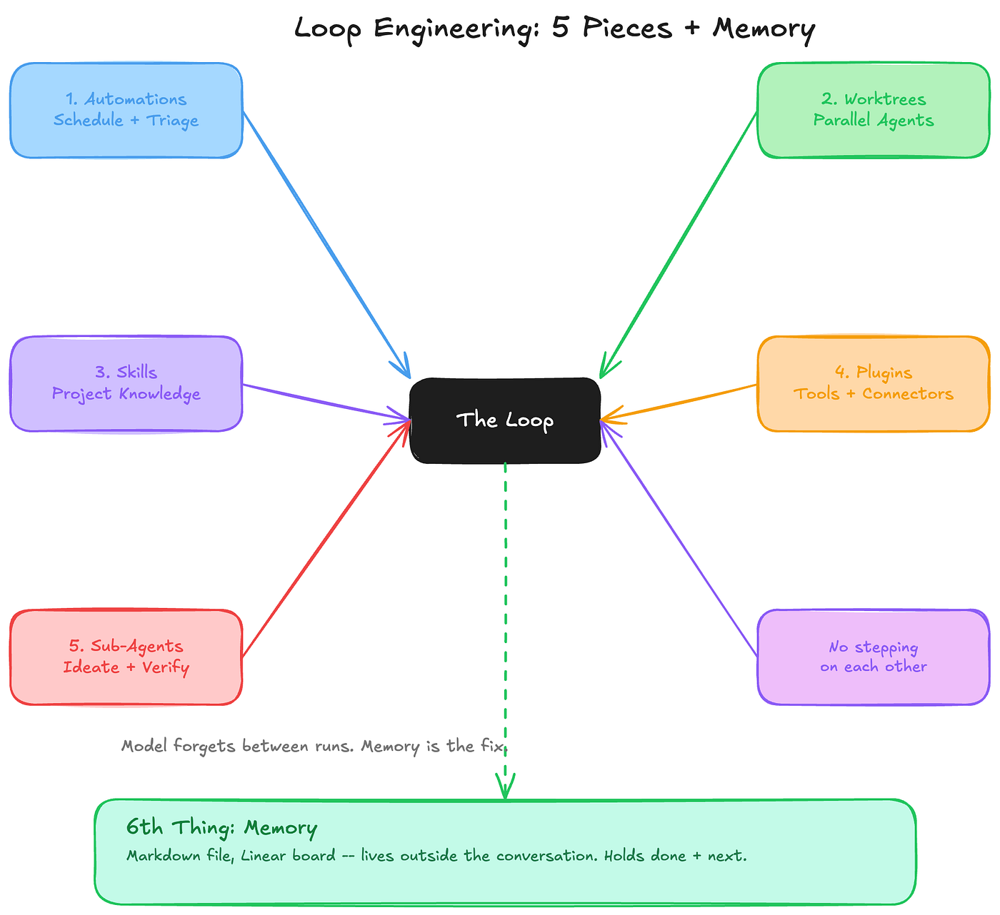

## 摘要（Summary）

Akshay Kokane 這篇 Level Up Coding 文章從 Forward Deployed Engineer 的角度，釐清「迴圈工程（Loop Engineering）」和「Harness Engineering」的分工：Harness 是**單一代理人（Agent）執行時所住的環境**，負責上下文（Context）、工具權限、重試、日誌、狀態與防錯；Loop 則是**Harness 上方的控制平面（control plane）**，負責決定何時啟動代理人、給它什麼任務、如何跨多次運行保留狀態，以及如何判斷工作完成。

作者的立場很務實：Loop Engineering 不是全新典範，也不是所有工作都該改成迴圈。真正的新意在於 `/goal` 這種可驗證停止條件，以及「執行者」與「完成判斷者」分離的 maker/checker 設計。若任務只是固定檢查部署狀態，腳本更便宜；若任務需要在執行時做模糊判斷，Loop 才可能值得花 Token。

## 關鍵洞察（Key Insights）

- **Loop 是 Harness 的上一層，不是替代品**：Harness 讓單一 Agent 不會忘記目標、亂用工具或自信犯錯；Loop 決定多個 Agent / 多次 run 如何被排程、分工、驗收與延續。
- **Loop 和 cron / pipeline 的差別在「步驟由模型於執行時決定」**：傳統 cron 固定執行明確步驟；Loop 給的是高階目標，模型在當下判斷哪些失敗值得處理、先做什麼、何時停止。
- **懷疑是合理的**：新名詞有行銷膨脹，且 Token 成本是真問題。Loop 不該用來取代簡單、便宜、可預先寫死的腳本。
- **五個結構件 + 狀態是 Loop 的基本骨架**：Automations、Worktrees、Skills、Connectors、Sub-agents，加上一個存在對話之外的 state。
- **`/goal` 是最值得注意的原語**：它把「停止條件」交給獨立 judge 檢查，避免同一個 Agent 既寫作業又替自己打分數。

## 詳細內容（Details）

### 為什麼這不是單純換名詞？

作者承認 AI 業界很愛替舊模式取新名詞：context engineering、agent harness、agentic workflows、loop engineering 都可能被濫用。但他認為這次有一個真實轉移：人的工作從「寫好下一次提示詞（Prompt）」變成「設計一個會自己提示 Agent 的系統」。

> [!note] 關鍵差異
> 傳統腳本的步驟在撰寫時已經確定；Loop 的高階目標雖然由人設定，但具體下一步常由模型在執行時根據上下文決定。這讓 Loop 有能力處理模糊工作，也讓它更難預估成本與風險。

### Harness Engineering vs Loop Engineering

| 維度 | Harness Engineering | Loop Engineering |
|------|---------------------|------------------|
| 抽象層 | 單一 Agent 的執行環境 | 多個 Agent / 多次 run 的控制平面 |
| 核心問題 | Agent 如何安全、穩定、可觀測地行動？ | 誰找工作、誰做工作、誰驗收、下一輪如何接續？ |
| 主要元件 | Context、工具權限、重試、日誌、狀態持久化、驗證 | Automations、Worktrees、Skills、Connectors、Sub-agents、State |
| 失敗模式 | 幻覺工具呼叫、忘記目標、錯誤輸出卻高自信 | Token 失控、錯誤自動化放大、無人驗收、狀態漂移 |
| 最適合的工作 | 讓單一 Agent 可靠完成任務 | 長期、反覆、需要模糊判斷與跨 run 狀態的工作 |

一句話：**Harness 是 Agent 住的房子；Loop 是決定什麼時候派 Agent 出門、交付什麼、回來後如何驗收的調度系統。**

### Loop 的六個結構件

作者引用 Addy Osmani 的拆法，把 Loop 的基本結構整理成五個零件，再補上一個真正的脊椎：state。

| 結構件 | 作用 | 風險 |
|--------|------|------|
| Automations | 排程或事件觸發，定期發現工作 | 很容易把便宜腳本變成昂貴模型呼叫 |
| Worktrees | 隔離平行 Agent，避免互改同一檔案 | 解決檔案衝突，不解決審查瓶頸 |
| Skills | 把專案知識寫一次，讓 Agent 不必每輪重推導 | Skill 描述與觸發條件不清會造成誤用 |
| Connectors | 透過 MCP 等整合 PR、ticket、chat、資料庫 | 權限邊界與審計需要設計 |
| Sub-agents | maker/checker 分離，避免同一 Agent 自評 | Token 成本增加，且 checker 也可能錯 |
| State | 對話外的持久狀態，記錄試過什麼、完成什麼、待辦什麼 | 狀態過期或格式混亂會讓下一輪接錯工作 |

### `/goal` 的設計價值

文章認為 `/goal` 是 Loop Engineering 中最值得注意的原語。使用者給一個可驗證停止條件，例如「某組測試全過且 lint 乾淨」。Loop 持續執行，每一輪後由另一個較小或獨立的模型判斷是否達標。

這不是 cron job：cron job 只要腳本結束就停止；`/goal` 的停止條件是由 judge 判斷「規格是否真的滿足」。這把 maker/checker 分離不只用在 code review，也用在「何時停止」這個控制問題上。

> [!warning] 成本判斷
> 如果問題是「CI 有沒有過」，shell 腳本就夠了。如果問題是「這個 PR 是否符合安全慣例並值得合併」，模型判斷才可能值得付費。

### 從 verdict 到 production

作者給的實務建議很保守：不要從 Loop 開始。先找一個重複發生、但決策邏輯無法完全預先寫死的工作流，手動用 Agent 跑幾次，觀察它在哪些地方需要判斷、在哪些地方失敗、哪些產出不值得信任。這些觀察才是 Loop 設計的材料。

> [!tip] 可執行建議
> 先做「人工操作的 Loop 原型」：同一個 workflow 手動跑 3-5 次，記錄每次的輸入、判斷點、失敗點、人工驗收條件與 Token 成本，再決定哪些步驟值得自動化。

## 我的心得（My Takeaways）

這篇文章的價值在於補上 [[2026-06-07-LOOP-ENGINEERING-THREE-SOURCE-EXPERT-SYNTHESIS]] 裡比較需要的「冷水」：Loop Engineering 不是「不用 prompt 了」這麼簡單，而是把 prompt 變成系統的一部分；它也不是 Harness 的替代品，而是依賴 Harness 才能安全運作的上一層。

我最認同作者的成本判準：**能用 deterministic script 解決的地方，不應該為了跟風改成模型 Loop。** Loop 應該留給「每次都需要新的判斷」的場景，例如 flaky CI triage、跨 issue 的 bug clustering、PR 安全審查、或長期研究任務的下一步規劃。這和 [[2026-04-09-ANTHROPIC-SHIPPED-THREE-OF-FIVE-HARNESS-LAYERS]] 裡「確定性約束層投資回報最高」其實是同一個工程直覺。

## 待補充（Open Questions）

- **Loop 的 ROI 如何量化？** 文章提醒 Token 成本，但沒有給出衡量公式。可追蹤：`loop engineering token cost ROI framework`
- **`/goal` 的 judge 模型如何避免錯判？** 若 judge 錯誤確認完成，Loop 反而會把未完成工作標成成功。可追蹤：`goal primitive independent verifier false positive`
- **State 的資料結構應該標準化嗎？** Markdown、Linear board、issue tracker 都可行，但不同格式的可驗證性差很多。可追蹤：`agent loop state schema markdown linear`
- **哪些工作最適合從人工 Agent workflow 升級成 Loop？** 需要收集更多生產案例，而不是只看 demo。可追蹤：`production loop engineering case studies`
- **Loop 會不會擴大理解債（Comprehension Debt）？** 產出速度加快後，人類審查是否成為真正瓶頸？可追蹤：`agent loop comprehension debt code review bottleneck`

## 相關連結（Related）

- [[2026-06-07-LOOP-ENGINEERING-THREE-SOURCE-EXPERT-SYNTHESIS]] — 既有多來源綜合筆記，本文可作為 Akshay Kokane 版本的務實補充。
- [[2026-04-02-HARNESS-ENGINEERING-COMPLETE-GUIDE]] — Harness Engineering 的基礎定義與六層架構，有助理解 Loop 為何是上一層。
- [[2026-04-09-ANTHROPIC-SHIPPED-THREE-OF-FIVE-HARNESS-LAYERS]] — 五層 Harness 堆疊模型，補足本文提到的 execution environment 細節。
- [[2026-02-11-HARNESS-ENGINEERING-LEVERAGING-CODEX-IN-AN-AGENT-FIRST-WORLD]] — OpenAI Codex Harness 實戰案例，與本文提到的 Codex automations / worktrees / goal 原語相互呼應。
- [[2026-04-24-AGENT-HARNESS-12-MODULES-COMPLETE-GUIDE]] — 從十二大模組角度拆解 Harness，適合對照 Loop 的控制平面責任。

---

## 知識層次分析（Bloom's Taxonomy Analysis）

> 以下從五個認知層次對本篇內容進行結構化分析，協助從記憶到評估逐層深化理解。

| 認知層次 | 核心目的 | 對本文的具體應用 |
|---------|---------|--------------|
| **記憶（被動）** | 確認資訊存在，單純資訊檢索 | 必記術語：Loop Engineering、Harness Engineering、Automations、Worktrees、Skills、Connectors、Sub-agents、State、`/goal`、maker/checker split |
| **理解（半被動）** | 解釋概念的含義及關聯 | Harness 管單一 Agent 的穩定執行；Loop 管多次 run 與多 Agent 的時間序列編排。Loop 不是新瓶裝舊酒，差別在於模型於執行時決定具體步驟，但這也帶來成本與驗證問題 |
| **分析（主動）** | 檢驗論點、拆解流程、找出假設 | 文章假設「模糊判斷」是 Loop 合理使用的分界線，但沒有提供可操作的模糊度量表；也假設 `/goal` 的獨立 judge 足以提升可信度，但 judge 本身仍需驗證 |
| **應用（主動）** | 將知識套用情境，規劃執行方案 | 1. 選一個每週重複的 triage 工作，先手動用 Agent 跑 3 次並記錄判斷點；2. 把已知規則先寫成 script / lint / Skill，只有剩下的模糊判斷交給 Loop；3. 為每個 Loop 設 Token 預算與人工驗收閘門 |
| **評估（主動）** | 判斷多個方案的優劣，進行決策和權衡 | Loop vs script：script 便宜、可預測、適合固定邏輯；Loop 昂貴、不確定、適合執行時判斷。Loop vs Harness：不是二選一，沒有穩定 Harness 的 Loop 只是把錯誤自動化放大 |

### 分析型追問（Socratic Follow-up）

- **澄清**：「需要 runtime judgment」的判準是什麼？能否轉成 checklist 來判斷何時值得建立 Loop？
- **假設**：如果 `/goal` 的 checker 模型和 maker 模型共享同樣偏誤，maker/checker split 還能帶來多少改善？
- **證據**：文章提到 daily CI triage、commit briefings、bug hunting 適合 Loop，有沒有生產環境中的成功率與成本數據？
- **觀點**：若站在平台工程團隊角度，應該先提供 Loop primitive，還是先提供更強的 deterministic constraint / verification layer？
- **後果**：若團隊過早把大量工作改成 Loop，12 個月後可能累積哪些成本、理解債與安全審查缺口？

### 方案批判三問（Critical Evaluation）

1. **最大的風險是什麼？** — 把 Loop 當成一般性升級，導致便宜腳本能做的事被昂貴模型定時重做，成本上升而可靠性下降。
2. **什麼情況下會失敗？** — 當任務的成功條件無法明確驗證、state 不可靠、connectors 權限過寬、或人類沒有時間審查輸出時，Loop 會把局部錯誤放大成持續性流程錯誤。
3. **有沒有更好的替代方案？** — 先用 deterministic automation、lint、tests、rules、small scripts 解決固定部分；只把剩下需要模糊判斷的部分交給 Agent Loop。若只是想讓單一 Agent 更可靠，優先投資 Harness 而非 Loop。

## References

- [原文：What is Loop Engineering? How it is different than Harness Engineering?](https://levelup.gitconnected.com/what-is-loop-engineering-how-it-is-different-than-harness-engineering-0e764f373fb1)
- [Addy Osmani: Loop Engineering](https://addyosmani.com/blog/loop-engineering/)
- [作者前文：Agent harness is just system design with a new name](https://medium.com/gitconnected/agent-harness-is-just-system-design-with-a-new-name-d91be4a648c5)
- [Claude Code scheduled tasks documentation](https://code.claude.com/docs/en/scheduled-tasks)
