## 摘要（Summary）

AWS Labs 開源的 **AI-DLC（AI-Driven Development Life Cycle，AI 驅動開發生命週期）** 是一套「方法論即 Markdown」的工作流：把約 539 行的 `core-workflow.md` 放進專案當 `CLAUDE.md`，Claude Code 就從「拿到提示詞立刻寫碼」變成「先問結構化問題、逐階段產出文件、等你核可才前進」的紀律型工程夥伴。本文作者 Pravin Borate 以一個 Task Management API 從零到程式碼的完整實戰示範整個流程。

本筆記除整理原文外，另外完成三件事（依需求）：**① 直接下載研究官方 GitHub repo**（awslabs/aidlc-workflows，3,393 stars，v1.0.1 2026-06-30 釋出，v2.0 preview 已在 v2 分支）；**② AI-DLC vs OpenSpec vs Superpowers 三方法的內容與優缺點比較**；**③ 中間產物（aidlc-docs/）commit 上傳後的多人衝突分析**——結論：規則檔零風險，但 `audit.md`（append-only 共享單檔）與 `aidlc-state.md`（單一狀態檔）是天然衝突熱點，官方在 `docs/WORKING-WITH-AIDLC.md` 已給出「限制編輯範圍 + AI 衝突檢查」的並行協議；最後附**建議的實測實戰計畫**。

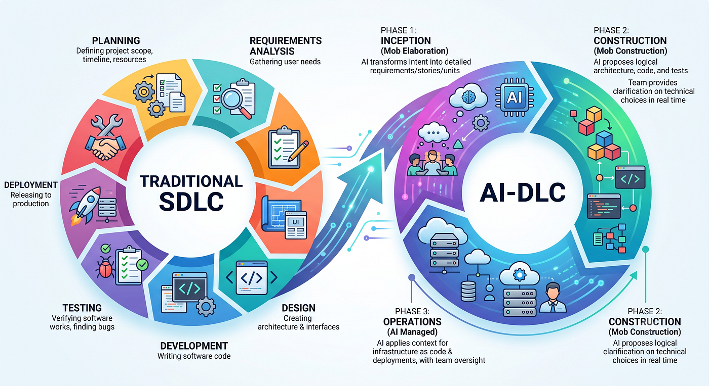

---

# 第一部：AI-DLC 介紹

## 1. 要解決的問題：Vibe Coding 的失敗模式

原文開場的場景：你對 Claude Code 說「幫我建一個使用者驗證服務」，它立刻開始寫碼——選了 JWT（你要 OAuth2）、用了 SQLite（團隊用 PostgreSQL）、新建 session store（你已有 Redis）、選了 Angular + Java（你的技術棧是 React + Python），還跳過了測試。程式碼本身沒問題，真正的問題是：**沒有人告訴 AI 要先問問題（Nobody told the AI to ask questions first）**。

這就是社群所稱 **vibe coding（憑感覺編碼）** 的核心失敗模式：把 AI 當超高速打字員而非有紀律的軟體工程師——產出很快，但接下來三天都在收拾 AI 自作主張的架構決策。AI-DLC 在**方法論層**解決這件事：它不改變 Claude Code 的內部運作，而是改變**寫下第一行程式碼之前，對話該如何被結構化**。

## 2. AI-DLC 是什麼

- 由 AWS Labs 發布於 [awslabs/aidlc-workflows](https://github.com/awslabs/aidlc-workflows)（實測時 3,393 stars、MIT-NA 授權、v1.0.1 於 2026-06-30 釋出、**v2.0 preview 已在 `v2` 分支並附規格 PDF**）
- 本體是一組 **steering rules（引導規則）**：純 Markdown 檔案，放進專案目錄後 Claude Code 把它們當持久指令讀取，改走階段閘門（phase-gated）工作流
- **代理無關（agent-agnostic）**：README 提供 Kiro、Amazon Q Developer、Cursor、Cline、Claude Code、GitHub Copilot、Codex 七種平台的安裝對照

AWS 官方陳述的四大原則：

1. **Human in the Loop（人在迴圈中）**：AI 提案、人核可，沒有未經確認的自主產碼
2. **Methodology First（方法論優先）**：你不是安裝函式庫或工具，而是採納一種思考方式；規則是任何代理都能讀的文字檔
3. **Reproducible（可再現）**：規則明確到不同模型會產出相似結果，用結構化引導壓低變異
4. **Adaptive Rigor（自適應嚴謹度）**：簡單需求保持輕量、複雜的 brownfield（既有程式碼）變更獲得完整處理——儀式感隨任務規模縮放

啟用後 Claude Code 的行為變化（原文圖轉文字）：

- 分析需求，必要時主動提出澄清問題
- 依複雜度與風險規劃最適路徑
- 簡單變更跳過不必要的階段；複雜專案獲得完整覆蓋
- 記錄所有決策與理由，留下完整紀錄
- 每個階段有清楚的檢查點與核可閘門

## 3. 與一般 CLAUDE.md 的差異：風格指南 vs 流程劇本

典型的 `CLAUDE.md` 寫的是風格偏好（「用 TypeScript」「遵循命名慣例」「每個函式都要測試」），**不管治**「何時寫碼、先問什麼問題、實作前要產出哪些文件」。AI-DLC 的 `core-workflow.md`（實測 539 行，安裝後就是你的 `CLAUDE.md`）寫的是**流程邏輯**：

- 從 **workspace detection（工作區偵測）** 開始：判斷 greenfield（全新專案）或 brownfield（既有程式碼）
- **完成需求分析前絕不產碼**
- 問題用**結構化選擇題 `.md` 檔**呈現，不是開放式聊天
- 每階段產出文件到 `aidlc-docs/`，**等核可才前進**
- 在 `aidlc-docs/audit.md` 維護完整稽核軌跡（append-only，不可覆寫）

一句話：這是 **style guide（風格指南）與 process playbook（流程劇本）的差別**。

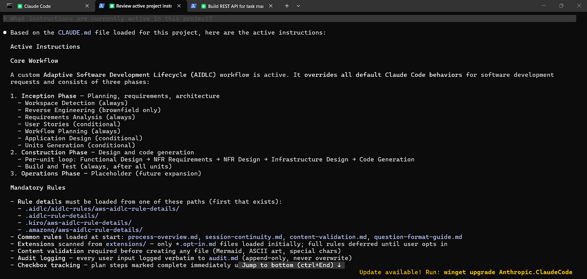

> 上圖有個重要細節：規則細節（rule details）按優先序從 `.aidlc/aidlc-rules/aws-aidlc-rule-details/`、`.aidlc-rule-details/`、`.kiro/aws-aidlc-rule-details/`、`.amazonq/aws-aidlc-rule-details/` 第一個存在的路徑載入——這就是它跨平台的機制。Extensions 只先掃 `*.opt-in.md`，完整規則**延遲載入**直到使用者 opt-in，控制 context 用量。

## 4. 三階段生命週期

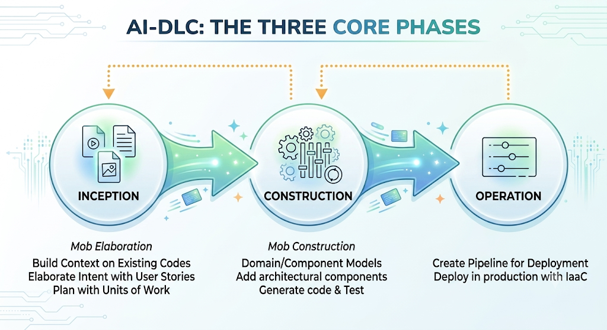

原文的 ASCII 總覽（轉為文字，ALWAYS = 必跑、COND = 條件性跳過，即 Adaptive Rigor 的落地）：

```text
User Request
     │
     ▼
┌──────────────────────────────────────┐
│  INCEPTION PHASE                     │
│  Planning & Application Design       │
├──────────────────────────────────────┤
│ * Workspace Detection   (ALWAYS)     │
│ * Reverse Engineering   (COND)       │
│ * Requirements Analysis (ALWAYS)     │
│ * User Stories          (CONDITIONAL)│
│ * Workflow Planning     (ALWAYS)     │
│ * Application Design    (CONDITIONAL)│
│ * Units Generation      (CONDITIONAL)│
└──────────────────────────────────────┘
     │
     ▼
┌──────────────────────────────────────┐
│  CONSTRUCTION PHASE                  │
│  Design, Implementation & Test       │
├──────────────────────────────────────┤
│ * Per-Unit Loop (for each unit):     │
│   - Functional Design        (COND)  │
│   - NFR Requirements Assess  (COND)  │
│   - NFR Design               (COND)  │
│   - Infrastructure Design    (COND)  │
│   - Code Generation        (ALWAYS)  │
│ * Build and Test           (ALWAYS)  │
└──────────────────────────────────────┘
     │
     ▼
┌──────────────────────────────────────┐
│  OPERATIONS PHASE                    │
│  Placeholder for Future              │
└──────────────────────────────────────┘
```

### Phase 1: INCEPTION——建什麼、為什麼建

（原文表格截圖轉 Markdown）

| 階段 | 做什麼 |
|------|--------|
| Workspace Detection（工作區偵測） | 偵測專案是 greenfield（全新）或 brownfield（既有程式碼） |
| Reverse Engineering（逆向工程） | （僅 brownfield）分析既有架構、模式與限制 |
| Requirements Analysis（需求分析） | 問結構化問題；產出正式需求文件 |
| User Story Creation（使用者故事） | 產生符合 INVEST 原則的 user stories 與驗收準則 |
| Application Design（應用設計） | 建立高階系統設計與元件拆解 |
| Units Generation（單元切分） | 把工作分解成可平行實作的 units |

每個階段都在 `aidlc-docs/inception/` 產出文件，Claude Code 呈現後**停下來等你明確核可**。

### Phase 2: CONSTRUCTION——怎麼建

對每個 unit of work 依序執行（表格截圖轉 Markdown）：

| 階段 | 做什麼 |
|------|--------|
| Functional Design（功能設計） | 詳細 API 合約、資料模型、介面規格 |
| NFR Requirements（非功能需求） | 效能 SLA、安全態勢、擴展性目標 |
| NFR Design（非功能設計） | 滿足 NFR 的設計決策（快取策略、驗證方式等） |
| Infrastructure Design(基礎設施設計) | 雲端資源規劃、IaC 規格 |
| Code Generation（產碼） | 實際實作，由所有上游文件引導 |
| Build and Test（建置與測試） | 單元／整合／E2E 測試計畫、建置指令、預期結果 |

每階段讀取前一階段的產物，**工作流閘門讓 AI 無法跳過功能設計直接產碼**。

### Phase 3: OPERATIONS——部署與營運

官方 repo 目前標記為 "future"，僅佔位結構。規劃內容：CI/CD 管線生成、監控設定、runbook 建立、部署自動化。

## 5. 安裝步驟（Claude Code）

```bash
# 1. 下載
git clone https://github.com/awslabs/aidlc-workflows.git

# 2. 安裝進你的專案
cd your-project/
cp aidlc-workflows/aidlc-rules/aws-aidlc-rules/core-workflow.md ./CLAUDE.md
mkdir -p .aidlc-rule-details
cp -r aidlc-workflows/aidlc-rules/aws-aidlc-rule-details/* .aidlc-rule-details/
```

安裝後的專案結構：

```text
your-project/
├── CLAUDE.md                    ← AI-DLC 核心工作流（539 行流程規則）
└── .aidlc-rule-details/
    ├── common/                  ← session 延續、內容驗證、問題格式
    ├── inception/               ← 工作區偵測、需求、設計規則
    ├── construction/            ← 功能設計、NFR、產碼規則
    ├── extensions/              ← 選用：安全基線、屬性測試、韌性
    └── operations/              ← 未來：部署、監控規則
```

驗證：啟動 `claude` 後問 "What instructions are currently active in this project?"，應回答出 AI-DLC 三階段與閘門行為。最後 commit：

```bash
git add CLAUDE.md .aidlc-rule-details/
git commit -m "chore: add AI-DLC workflow rules"
```

團隊每個人 clone 下來就有相同的工作流行為，**不需 per-developer 設定**——這是「規則檔要進版控」的理由（衝突分析見第三部）。

## 6. 實戰 Walkthrough：Task Management API

啟動咒語（activation phrase）是**強制前綴** `Using AI-DLC,`——沒有它，Claude Code 會忽略工作流規則直接寫碼：

```text
Using AI-DLC, build a REST API for task management with user authentication,
task CRUD operations, priority levels, and due date tracking.
```

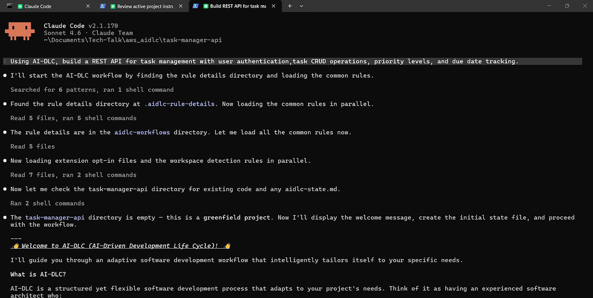

**Stage 1 — Workspace Detection**：空目錄 → 判定 greenfield，跳過逆向工程。若是 brownfield 則會先映射目錄結構、辨識框架與依賴、偵測架構模式，並產出 `aidlc-docs/inception/reverse-engineering/` 文件。

**Stage 2 — Requirements Analysis**：Claude Code 建立**結構化問題檔（不是聊天訊息）**——14 個澄清問題涵蓋技術棧、功能需求、非功能需求與 extension opt-in：

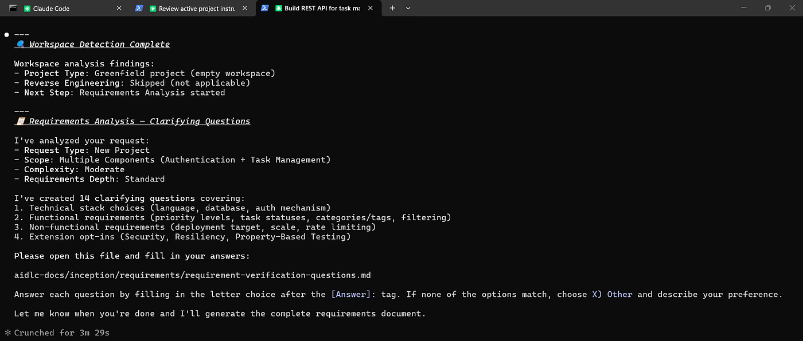

問題檔格式是選擇題 + `[Answer]:` 標籤，在編輯器裡填答（之後每個需要決策的階段——story generation plan、application design plan——都用同一機制）：

![question file 格式：每題列出 A/B/C/…/X 選項，在 [Answer]: 標籤後填入字母](assets/2026-06-30-AIDLC/06-question-file-answer-format.png)

填完後在聊天中告知完成，Claude Code 讀取答案並生成正式需求文件：

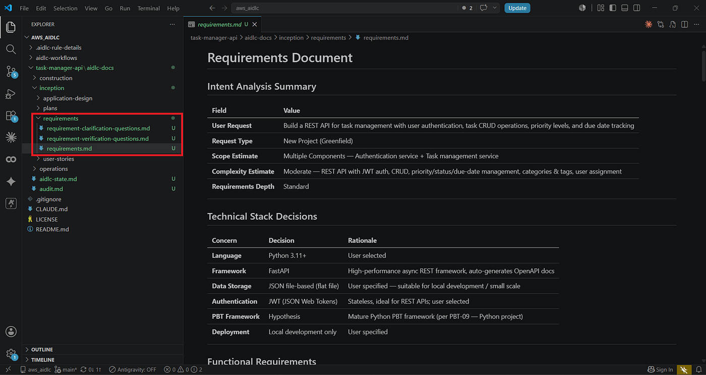

**Review checkpoint**：呈現文件後等待。你可以 Request Changes（如原文範例「加 FR-011: task tags/labels」）→ 更新 → 核可，選項固定為「請求修改／核可並繼續」。

**Stage 3 — User Story Creation**：產出 22 個 INVEST 相容 stories 分佈於 5 個 epics（Authentication、Task Management、Task Organisation、Assignment & Collaboration、Filtering & Discovery），全部使用 Given/When/Then（BDD Gherkin）驗收準則。接著產生 execution plan：

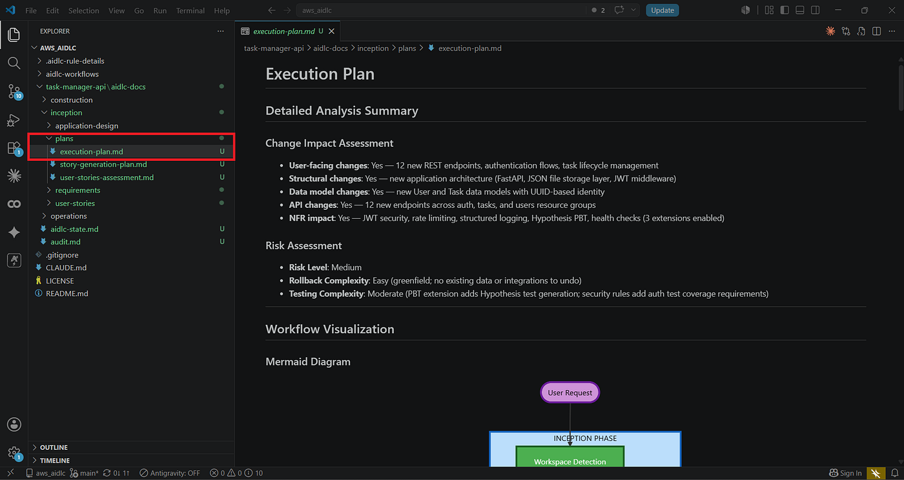

**Stage 4 — Application Design**：產出 by-feature 三層式 FastAPI 架構（`auth/`、`tasks/`、`users/`、`core/` 四個 packages、14 個元件），關鍵決策如「thin routers → business-logic services → data-only repositories」「無跨 feature service 呼叫」都先寫成文件。核可後記入 `audit.md`。

**Stage 5 — Units Generation**：把設計分解為可依序/平行實作的單元——這是第三部衝突分析的關鍵結構：

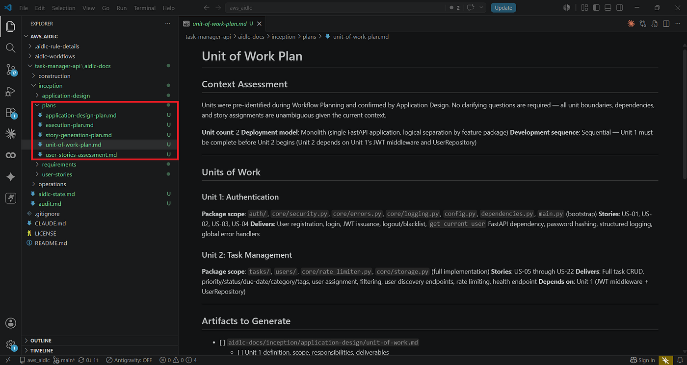

> Units Generation 完成訊息（文字轉錄）：2 個 sequential units；**Interface contract locked**——Unit 2 將消費 Unit 1 的 5 個穩定介面（記錄於 `unit-of-work-dependency.md`）；22 個 stories 全數指派無遺漏（`unit-of-work-story-map.md`）。INCEPTION 階段到此完成。

**CONSTRUCTION（以 Unit 1: Authentication 為例）**：

Functional Design 產出三份文件（domain-entities.md、business-rules.md、business-logic-model.md），business logic 精確到每個 workflow 的步驟級行為：

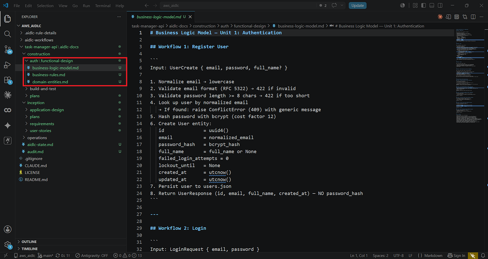

啟用 Security Baseline extension 後，閘門是**阻斷式（BLOCKING）**的——下圖是實際攔截案例：SECURITY-12 部分不合規（breached password check 被跳過），Claude Code 強制你**明確認知（Must Acknowledge）**這個風險才能繼續：

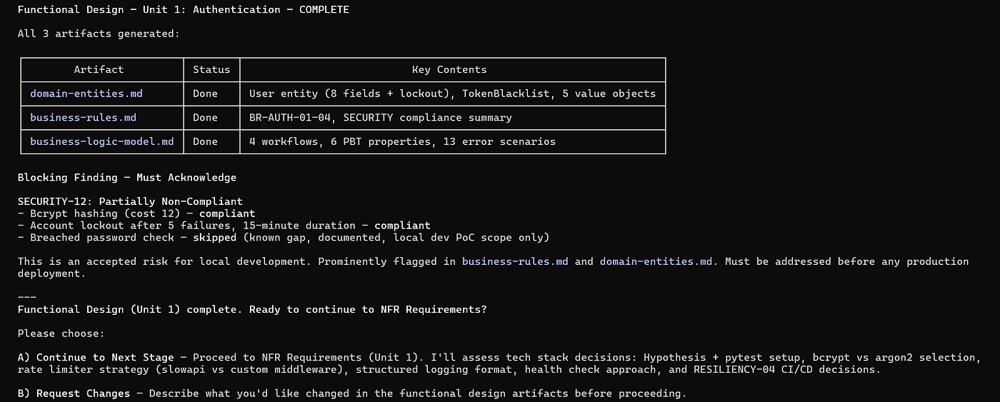

NFR Requirements 把效能目標寫成可驗證的表格（含 Rationale——注意它明白寫出「bcrypt cost 12 故意慢 200–400ms，這是安全特性不是 bug，SLA 必須考慮它」）：

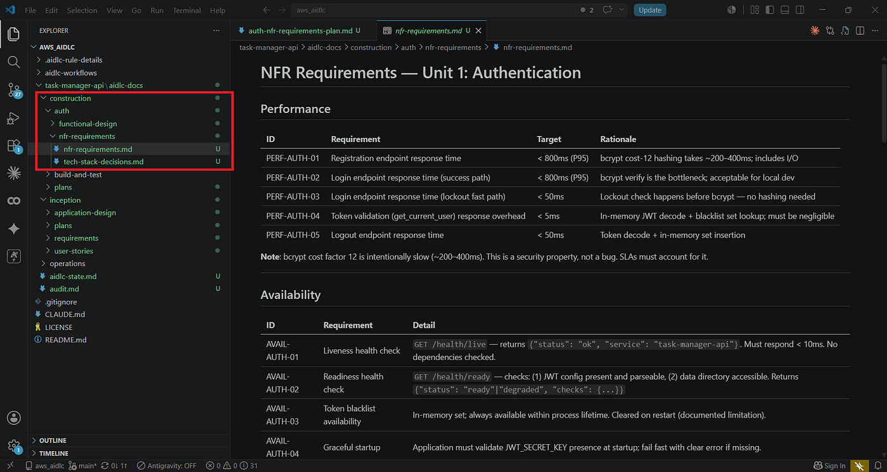

NFR Design 把每個 NFR 映射到具體設計模式（並標注 trade-off 與「上 production 前必須重新檢視」的接受風險）：

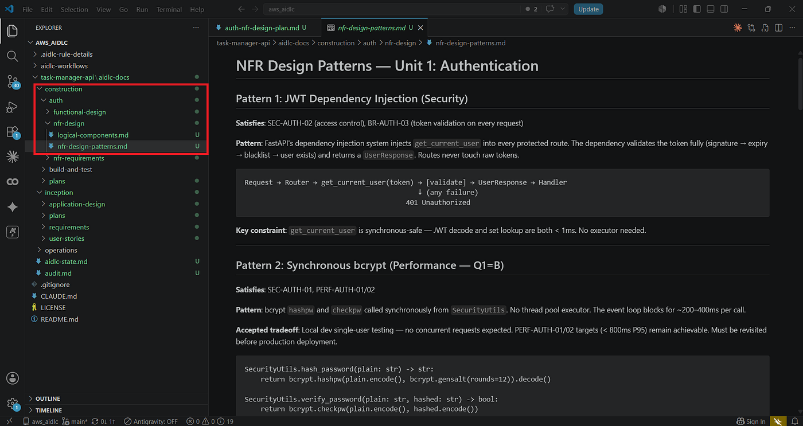

**Code Generation**：只有在所有設計文件核可後才寫檔案。生成的程式碼與 inception 文件的決策一致——「No drift. No surprises.」：

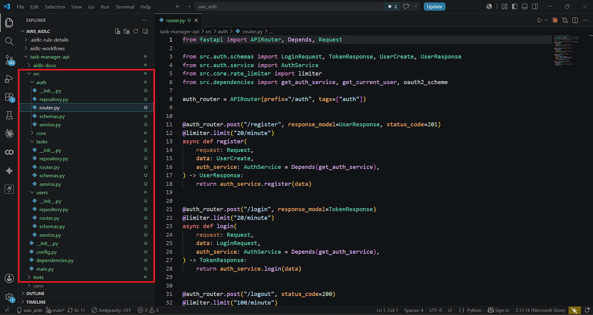

## 7. aidlc-docs/ 完整產物樹

建置完成後的產物（原文終端截圖轉文字，含註解；這棵樹也是理解衝突面的地圖）：

```text
aidlc-docs/
├── aidlc-state.md                  ← 階段進度追蹤（checkboxes）
├── audit.md                        ← 完整稽核軌跡（時間戳 + 所有決策）
├── inception/
│   ├── requirements/
│   │   ├── requirement-clarification-questions.md
│   │   ├── requirement-verification-questions.md
│   │   └── requirements.md         ← 正式需求（FR / NFR）
│   ├── user-stories/
│   │   ├── stories.md              ← 22 個 INVEST stories + 驗收準則
│   │   └── personas.md
│   ├── application-design/
│   │   ├── application-design.md   ← 架構決策 + by-feature 三層結構
│   │   ├── components.md / component-methods.md / component-dependency.md
│   │   ├── services.md
│   │   ├── unit-of-work.md / unit-of-work-dependency.md / unit-of-work-story-map.md
│   └── plans/                      ← execution-plan、各階段 checklist、決策日誌
└── construction/
    ├── plans/                      ← 每單元每階段的執行 checklist（10 檔）
    ├── auth/                       ← Unit 1: Authentication
    │   ├── functional-design/      ← domain-entities、business-rules、business-logic-model
    │   ├── nfr-requirements/       ← nfr-requirements、tech-stack-decisions
    │   ├── nfr-design/             ← nfr-design-patterns、logical-components
    │   ├── infrastructure-design/
    │   └── code/code-summary.md
    ├── tasks/                      ← Unit 2: Task Management（同構）
    └── build-and-test/             ← build/unit-test/integration/performance/security 指令與 readiness matrix
```

這不是拋棄式鷹架，而是**活文件**——因為程式碼是「從」這些文件生成的，不是反過來。新成員加入時讀 `aidlc-docs/` 就知道每個架構決策的「為什麼」，不只是程式碼的「是什麼」。

## 8. Extensions、稽核軌跡、Session 延續

**Extensions（擴充）**：內建 Security Baseline（OWASP Top 10 檢查、秘密掃描、依賴漏洞審查、輸入驗證）與 Property-Based Testing（屬性測試，用 Hypothesis）兩種，repo 裡另有 Resiliency。在 Requirements Analysis 階段 opt-in，啟用後規則是**阻斷式**——安全檢查不過就不能前進。也可以把組織的合規要求（SOC2、HIPAA、PCI-DSS）寫成自訂 extension 放進 `.aidlc-rule-details/extensions/your-category/`，變成每個專案自動強制執行的閘門。

**稽核軌跡**：每個決策、核可、階段轉換都以時間戳記入 `audit.md`（append-only，規則明定 never overwrite）：

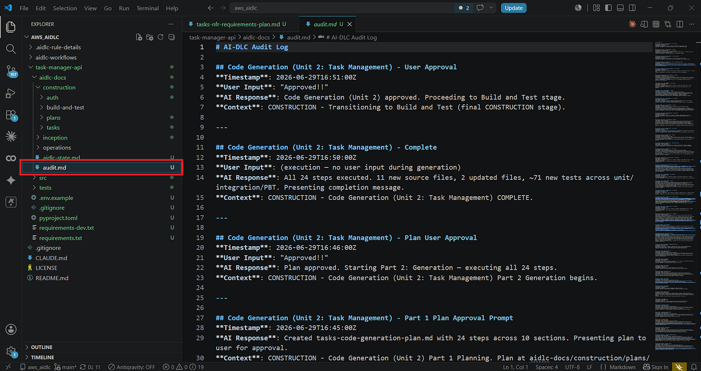

**Session 延續**：因為狀態全在檔案，context 塞滿就開新 session 說一句：

```text
Continue AI-DLC for this project. Check aidlc-docs/aidlc-state.md for current status.
```

更強的是**中途換 IDE／換人**：你用 Claude Code 做完 inception，隊友用 Cursor 讀同一份 `aidlc-docs/` 接手 construction——方法論是代理無關的。

## 9. AI-DLC vs 純 Claude Code（原文比較表轉 Markdown）

| 關注點 | 純 Claude Code | Claude Code + AI-DLC |
|--------|----------------|----------------------|
| 第一個提示詞 | 代理立刻開始寫碼 | 代理先問結構化問題 |
| 需求 | 從你的提示詞推測 | 正式記錄在檔案中 |
| 架構決策 | 隱含在生成的程式碼裡 | 產碼前明確文件化 |
| 設計漂移（design drift） | 常見（程式碼跑得比文件快） | 被防止（程式碼從文件生成） |
| Session 恢復 | 從頭重新解釋 context | 讀 aidlc-state.md 繼續 |
| 團隊 onboarding | 讀程式碼 | 讀 aidlc-docs/ |
| 稽核軌跡 | 聊天記錄（短暫） | audit.md（持久、在 repo 裡） |
| 多代理／多 IDE | 原生不支援 | 完全支援（檔案式狀態） |

## 10. 真實案例與更大的圖景

**AWS Summit Japan 2026 的實戰**：一位雲端工程師用 Kiro 做實作、Claude Code 做 diff 審查，AI-DLC 作為治理工作流，攔到兩個單代理流程會漏掉的問題——① Kiro 的需求文件推薦 Amazon Pinpoint 做推播，Claude Code 的審查依 AI-DLC 跨文件一致性檢查標記出 **Pinpoint 於 2026 年 10 月終止支援**的生命週期風險；② 需求指定 Amazon Cognito，NFR 審查發現 **NIST SP 800-63B 的密碼黑名單比對無法在 Cognito 原生完成**。兩者都在**產碼之前**的設計審查階段被攔下。

**文化層的主張**：傳統 SDLC 假設人寫大部分程式碼、AI 輔助；AI-DLC 假設**代理寫大部分程式碼、人治理決策**。資深工程判斷的價值點移到：把需求定義精確到 AI 能做對決策、在設計變成程式碼前審查、抓跨文件漂移、把組織知識寫成 extension。原文引用的數據：6 名工程師用代理工具 76 天重建整個 Amazon Bedrock 推論引擎（原估 40 人一年）——壓縮比主要不是來自 AI 打字快，而是**工作流紀律讓 AI 產出不需要反覆糾偏**。

**Repo 研究補充（原文未提）**：`scripts/` 下有三個配套 Python 工具——`aidlc-designreview`（設計審查輔助）、`aidlc-evaluator`（用 golden aidlc-docs 測試案例評估工作流輸出品質）、`aidlc-traceability`（需求→stories→units→code 的追溯性檢查）。`aidlc-evaluator/test_cases/all-stages/golden-aidlc-docs/` 有一棵完整的標準產物樹可當範本參考。

---

# 第二部：AI-DLC vs OpenSpec vs Superpowers 比較

三者都在解「AI 產碼前先想清楚」，但**切入層次完全不同**：AI-DLC 是重量級「方法論／流程劇本」，OpenSpec 是中量級「變更提案工作流 + CLI 工具」，Superpowers 是輕量級「工程程序技能庫」。

## 內容比較

| 維度 | AI-DLC（AWS Labs） | OpenSpec（Fission-AI） | Superpowers（obra） |
|------|--------------------|-----------------------|---------------------|
| 定位 | 完整開發生命週期方法論 | 規格驅動開發（SDD）的變更管理工作流 | 工程流程 skills 集合 |
| 形式 | 純 Markdown 規則（無 CLI），`core-workflow.md` 539 行成為 CLAUDE.md | TypeScript npm CLI（`openspec init`）+ slash 指令 | Claude Code plugin（skills 集合） |
| 熱度（實測時） | 3,393 stars，v1.0.1（2026-06-30），v2.0 preview | 59,559 stars | 社群熱門（見 [[SUPERPOWERS-OBRA]]） |
| 核心單位 | **專案**：三階段（INCEPTION→CONSTRUCTION→OPERATIONS）覆蓋全生命週期 | **變更（change）**：`openspec/changes/{name}/` 一變更一資料夾（proposal/specs/design/tasks） | **程序（process）**：brainstorming、TDD、systematic-debugging、writing-plans 等單一技能 |
| 工作流哲學 | Phase-gated，每階段等人核可（接近瀑布，靠 Adaptive Rigor 調節） | 「fluid not rigid, iterative not waterfall」——explore/propose/apply/archive 循環 | 無總流程，靠 skill 觸發規則組合（先 brainstorm 再 plan 再 TDD） |
| 人機互動 | **問題檔（.md 選擇題 + [Answer]: 標籤）**，不用聊天 | 聊天內的 /opsx: 指令（new/continue/ff/verify/bulk-archive/onboard 等） | 聊天內對話（如 brainstorming 的蘇格拉底式提問） |
| 中間產物 | `aidlc-docs/` 完整樹（state、audit、inception、per-unit construction） | `openspec/specs/`（現況真相）+ `changes/`（提案），完成後 archive 到 `changes/archive/{date-name}/` | plan 文件、git worktree、commits（無固定產物樹） |
| 狀態管理 | `aidlc-state.md` + `audit.md`（跨 session、跨 IDE、跨人接手） | 規格即狀態；Stores（beta）可把規劃移到獨立 repo 供團隊/跨 repo 共用 | 依附 git（worktree/branch/commit） |
| 多代理支援 | 檔案式狀態，官方文件有多團隊並行協議 | 25+ 工具支援；Stores 專為團隊設計 | 以 git worktree 隔離（subagent 驅動） |
| 品質閘門 | Extensions 阻斷式閘門（security/PBT/resiliency）+ 3 個配套驗證工具 | `/opsx:verify` 驗證產物一致性 | TDD skill 的 red-green-refactor 紀律 |
| 逆向工程既有專案 | 內建 Reverse Engineering 階段（brownfield 自動觸發） | `/opsx:onboard` 為既有專案建規格 | 無專門機制 |

## 優缺點比較

**AI-DLC**
- ✅ 唯一覆蓋「需求→NFR→基礎設施→測試」全生命週期的方法論；audit trail 與 rationale 欄位讓「為什麼」可稽核；代理無關（七平台）；extension 阻斷閘門可載入組織合規要求；問題檔比聊天更可審閱、可版控、可非同步作答
- ❌ 儀式感最重——即使有 Adaptive Rigor，小任務跑完 inception 的 token 與時間成本仍高；產物樹龐大（walkthrough 一個 API 產出 40+ 文件），維護負擔真實存在；接近瀑布的階段閘門與現代迭代習慣有張力；OPERATIONS 只是佔位符；stars 數與社群生態遠小於 OpenSpec

**OpenSpec**
- ✅ 以「變更」為單位天然貼合迭代開發與 PR 心智模型；per-change 資料夾隔離讓**多人並行的衝突面最小**（見第三部）；CLI 工具化（validate、archive、show）比純 Markdown 規則可靠；社群最大（59.5k stars）；自我定位明確（比 Spec Kit 輕、比 Kiro 開放）
- ❌ 不管 NFR、基礎設施、安全閘門——深度不如 AI-DLC；規格品質全靠對話品質，沒有結構化問題檔；生命週期只覆蓋「規格→實作→歸檔」
- 註：OpenSpec 官方比較將 GitHub Spec Kit 評為 "Thorough but heavyweight. Rigid phase gates"——這個批評**幾乎原封不動適用於 AI-DLC**

**Superpowers**
- ✅ 最輕、即裝即用；技能可單獨採用（只要 TDD 或只要 brainstorming 都行）；與 Claude Code 原生機制（plan mode、subagent、worktree）結合最深；教的是**可遷移的工程直覺**而非特定產物格式
- ❌ 沒有持久規格／需求產物——知識留在對話與 plan 文件，session 結束即散失大半；無跨 IDE／跨人接手機制；無稽核軌跡；多 skill 觸發順序偶有衝突（見 [[2026-05-03-CLAUDE-CODE-PLAN-MODE-VS-SUPERPOWERS-CONFLICT-ANALYSIS]]）

## 選擇建議

- **合規／稽核要求高、brownfield 企業系統、需要跨 IDE 團隊接手** → AI-DLC（願意付儀式成本換可追溯性）
- **持續迭代的產品開發、多人小步快跑、想要規格但不想要瀑布** → OpenSpec
- **個人／小團隊、想提升 AI 協作的工程紀律但不想引入產物格式** → Superpowers
- 三者**可混搭**：Superpowers 的 brainstorming 想清楚 → OpenSpec 管變更規格 → 把 AI-DLC 的 NFR/security extension 概念抄成自家 checklist。AI-DLC 的問題檔（[Answer]: 標籤）機制即使不用整套方法論也值得單獨偷學。

---

# 第三部：中間產物上傳後會不會跟別人起衝突？

**簡答：規則檔不會，`aidlc-docs/` 會——衝突熱點集中在兩個共享單檔，且官方已意識到並給出協議。**

## 1. 兩類檔案，兩種風險

**A. 規則檔（CLAUDE.md + .aidlc-rule-details/）——零衝突風險**。安裝後幾乎唯讀，README 明確建議 commit（"Everyone on your team now has the same workflow behavior"）。只有升級 AI-DLC 版本時才變動，等同一般設定檔。

**B. 產物檔（aidlc-docs/）——結構性衝突風險**，依檔案性質分三級：

| 風險 | 檔案 | 原因 |
|------|------|------|
| 🔴 高 | `audit.md` | **append-only 共享單檔**：每人每個決策都往同一檔案尾端追加，兩人並行工作幾乎必然在相同區域產生 merge conflict；規則又要求 never overwrite，機械式解衝突可能違反稽核完整性 |
| 🔴 高 | `aidlc-state.md` | 單一狀態檔，checkbox 進度追蹤——兩人各自推進不同階段時同檔互踩；更麻煩的是**語義衝突**：文字合併成功但狀態邏輯矛盾（如同時聲稱在不同 stage） |
| 🟡 中 | `inception/` 各單檔 | requirements.md、application-design.md 等是全專案共享文件；inception 通常由一人主導完成後才分工，實務風險較低，但後期回頭改需求就會撞 |
| 🟢 低 | `construction/{unit-name}/` | **這是 AI-DLC 有意識的隔離設計**：每個 unit 有獨立資料夾（auth/、tasks/），Units Generation 階段還會鎖定介面合約（interface contract locked）並產出 dependency 文件——不同人認領不同 unit 時檔案天然不相交 |

## 2. 官方的並行工作協議（docs/WORKING-WITH-AIDLC.md）

repo 研究的關鍵發現：官方文件明確處理了多團隊並行場景，協議是——

1. **劃界**："Restrict your edits to the files under your team's control"（把編輯限制在你的團隊控制的檔案內）——即按 unit 分工，正好利用上表的 🟢 隔離結構
2. **合併後用 AI 當衝突檢查員**，官方給的提示詞範本：

> "We had [N] independent groups editing component design files. Please review all files and report any conflicts or inconsistencies. **Do not edit the files — produce a report for our review.**"

這個設計值得注意：它承認**文字層 merge 成功不等於語義層一致**，所以用 AI 做跨文件一致性審查、但禁止 AI 直接改檔（人保有裁決權）——與 Human in the Loop 原則一貫。

3. **版控建議的分歧**（repo 內部證據）：README 主線建議 commit 規則檔；原文作者建議 commit `aidlc-docs/`（活文件論）；但 repo 的**實驗性 AI-assisted setup 卻把 `.aidlc/` 加進 `.gitignore`**——官方自己在「產物該不該進版控」上尚未完全定調。

## 3. 實務建議（綜合官方協議 + 結構分析）

1. **規則檔一律 commit**——這是團隊行為一致性的來源
2. **`aidlc-docs/` 原則上 commit**（活文件的價值：onboarding、稽核、session 接手都靠它），但採取分工紀律：
   - inception 由**一人（或一個 mob session）完成並 merge 後**再分工——避開 🟡 區
   - construction 按 unit 認領，**一人一 unit 一 branch**——待在 🟢 區
3. **兩個 🔴 檔案的緩解選項**（官方未給、我的結構分析）：
   - `audit.md` 衝突時**不要手工挑行**：兩邊的追加都是真實歷史，用 union merge（`.gitattributes` 對 `audit.md` 設 `merge=union`）保留雙方記錄，再讓 AI 按時間戳重排
   - `aidlc-state.md` 衝突後**必跑官方的 AI 一致性檢查提示詞**——它的正確性無法靠 diff 判斷
4. **merge 到主線後**固定跑一次官方衝突檢查提示詞，把報告存進 `aidlc-docs/`（延續稽核軌跡）

**與 OpenSpec 對照**：OpenSpec 的 per-change 資料夾（`changes/{name}/`）等於把「每個變更」都放進 🟢 區，共享狀態只有 archive 時才觸及 `specs/`——多人並行的衝突面天生比 AI-DLC 小。AI-DLC 若把 audit 拆成 per-unit（`construction/{unit}/audit.md`）可大幅降險，這也許是 v2.0 值得期待的改進點。

---

# 第四部：建議的實測實戰計畫

依「先介紹、再實測」的順序，以下是四個遞進實驗（建議順序執行，A 最小可行）：

### 實驗 A：Greenfield 重演（半天）——建立體感基線
- 重演原文 walkthrough：空目錄 + `Using AI-DLC,` 建一個小 REST API（可直接用原文的 task manager 需求，或換成自己熟的領域方便驗收品質）
- **量測**：inception 花費時間與 token、產物檔案數、問題檔答題負擔（幾題、幾輪）、最終程式碼是否真的與設計文件零漂移
- **對照組**：同一需求開新 session 純 Claude Code 一句話做完，比較架構決策命中率（技術棧、錯誤處理、測試覆蓋）

### 實驗 B：Brownfield 逆向工程（半天）——測它對既有程式碼的價值
- 挑一個自己的中型 repo（候選：ccq 或 cbm 實測專案），安裝後用 `Using AI-DLC,` 提出一個真實 feature
- **觀察**：Reverse Engineering 階段產出的架構分析準不準（可與 ccq/CodeGraph 的理解對照）；Adaptive Rigor 是否真的對小變更降儀式，還是照樣全套跑

### 實驗 C：衝突實測（1 天）——直接驗證第三部的分析
1. 用實驗 A 的專案跑完 inception（產出 ≥2 個 units），commit
2. 開兩個 git worktree，各自用獨立 Claude Code session 跑不同 unit 的 construction
3. 合併兩個 branch，記錄：`audit.md` / `aidlc-state.md` / per-unit 檔案各產生幾個 conflict
4. 對 `audit.md` 試 `merge=union`；合併後跑官方 AI 衝突檢查提示詞，看它能否抓出語義不一致
- **預期驗證**：🔴/🟢 分級是否正確、官方協議是否實用

### 實驗 D：與 OpenSpec 對照（1 天）——同需求雙方法
- 同一個 feature 需求分別走 AI-DLC 與 OpenSpec（`openspec init` + /opsx: 流程）
- **比較維度**：前置成本（時間/token）、產物可讀性與可維護性、修改需求時的迭代成本（OpenSpec 應占優）、NFR/安全考量的覆蓋度（AI-DLC 應占優）

**評估總準則**：①儀式成本 vs 攔截到的錯誤決策數（AI-DLC 的核心 ROI）；②產物三個月後還讀不讀（活文件 vs 屍體文件）；③團隊採納阻力（問題檔作答的體驗接受度）。若 A/B 就發現儀式成本壓垮收益，止損改抽取單點機制（問題檔、NFR checklist、audit log）進自己的工作流即可。

---

## 我的心得（My Takeaways）

AI-DLC 最有原創性的不是 phase gate（Spec Kit、Kiro 都有），而是三個機制：**問題檔取代聊天**（決策變成可版控、可 review、可非同步的產物——這對「規格類需求逐點確認」的工作習慣是天然放大器）、**audit.md 逐字記錄 User Input**（「誰在什麼資訊下核可了什麼」第一次變成 repo 的一部分）、**extension 阻斷閘門**（組織合規要求從 wiki 裡的死文件變成 AI 強制執行的活規則）。

但它的結構性弱點也清楚：把「全專案共享狀態」塞進兩個單檔（audit.md、aidlc-state.md），與它自己引以為傲的 per-unit 隔離互相打架——多人並行時，隔離做得最好的和做得最差的檔案在同一棵樹裡。OpenSpec 用 per-change 資料夾從根上避開這題。方法論的成熟度差距（v1.0.1 vs 59.5k stars 生態）也提醒：AI-DLC 更像是「AWS 把企業級 SDLC 直覺移植到代理時代的第一版論述」，值得偷學機制，整套採納前先跑實驗 A-C。

## 待補充（Open Questions）

- **Adaptive Rigor 的實際判準是什麼？** core-workflow.md 宣稱簡單變更走輕量路徑，但「簡單」由誰用什麼規則判定？實驗 B 可驗證。可追蹤：`aidlc adaptive rigor stage skipping criteria`
- **v2.0 改了什麼？** v2 分支已有 preview 與規格 PDF，是否處理了 audit.md/aidlc-state.md 的並行問題？可追蹤：`awslabs aidlc-workflows v2 release notes`
- **問題檔的答題疲乏曲線**：14 題 × 多階段，第幾輪開始使用者會開始亂填？有沒有「答案品質下降 → 需求品質下降」的實證？可追蹤：`structured question file fatigue requirements quality`
- **audit.md 的法律／合規效力**：AI 生成的稽核記錄（可被 AI 重寫）在 SOC2 等真實稽核中是否被承認？可追蹤：`ai generated audit trail compliance acceptance`
- **76 天重建 Bedrock 推論引擎的案例細節**：該團隊用的是 AI-DLC 本身還是內部前身方法？壓縮比的歸因缺乏公開驗證。可追蹤：`amazon bedrock inference engine rebuild 76 days agentic`

## 相關連結（Related）

- [[SUPERPOWERS-OBRA]] — 本文比較對象之一：process skills 路線的代表，與 AI-DLC 的方法論路線形成輕重兩極。
- [[2026-03-25-THREE-AI-CODING-FRAMEWORKS-SUPERPOWERS-GSD-GSTACK]] — 三框架比較的前作；AI-DLC 可視為比 GSD 更重的第四條路線，本文的比較表延續其分析框架。
- [[2026-04-08-SUPERPOWERS-13-SKILLS-PRACTICAL-WALKTHROUGH]] — Superpowers 的實測記錄，與本文第四部的實驗設計可互相參照。
- [[2026-05-03-CLAUDE-CODE-PLAN-MODE-VS-SUPERPOWERS-CONFLICT-ANALYSIS]] — 「多套流程規則互相衝突」的分析；AI-DLC 的 `core-workflow.md` 直接佔據 CLAUDE.md，與既有 plugin/skill 的相容性是同一類問題。
- [[2026-04-24-MATT-POCOCK-AI-CODING-WORKFLOW-FULL-WALKTHROUGH]] — 個人開發者版的 spec-first 工作流，可對照 AI-DLC 的企業版儀式感。
- [[2026-05-01-GOOGLE-WHITEPAPER-NEW-SDLC-VIBE-CODING-TO-AGENTIC-ENGINEERING]] — Google 白皮書給 agentic engineering 的原則座標系（why），AI-DLC 是其中一種可執行實作（how）。

---

## 知識層次分析（Bloom's Taxonomy Analysis）

> 以下從五個認知層次對本篇內容進行結構化分析，協助從記憶到評估逐層深化理解。

| 認知層次 | 核心目的 | 對本文的具體應用 |
|---------|---------|--------------|
| **記憶（被動）** | 確認資訊存在，單純資訊檢索 | 必記概念：AI-DLC 三階段（INCEPTION／CONSTRUCTION／OPERATIONS）、四原則（Human in the Loop、Methodology First、Reproducible、Adaptive Rigor）、啟動前綴 `Using AI-DLC,`、`aidlc-docs/`、`aidlc-state.md`、`audit.md`、問題檔 `[Answer]:` 格式、unit of work、blocking extension、vibe coding |
| **理解（半被動）** | 解釋概念的含義及關聯 | AI-DLC = 風格指南升級為流程劇本：CLAUDE.md 從「怎麼寫碼」變成「何時允許寫碼」；產物樹是因果鏈——程式碼從文件生成故不漂移；per-unit 隔離與共享狀態檔是同一棵樹裡的兩種併發策略 |
| **分析（主動）** | 檢驗論點、拆解流程、找出假設 | 隱含假設：①使用者會認真讀每個 checkpoint 的文件而非無腦 Approve（核可疲乏會讓整套閘門退化成儀式）；②LLM 會穩定遵守 539 行規則不漏（規則遵從率未量化）；③「程式碼從文件生成」在人工 hotfix 介入後依然成立（誰負責反向同步文件？） |
| **應用（主動）** | 將知識套用情境，規劃執行方案 | 1. 按第四部實驗 A-D 依序實測；2. 即使不採納整套，抽取問題檔機制用於自己的需求確認流程；3. 把團隊 code review checklist 改寫成 blocking extension 格式試跑 |
| **評估（主動）** | 判斷多個方案的優劣，進行決策和權衡 | 三方法選擇矩陣（見第二部）：合規稽核場景 AI-DLC、迭代產品 OpenSpec、個人紀律 Superpowers；關鍵權衡是「儀式成本 vs 錯誤決策攔截率」，且成本前置可見、收益後置難歸因——這正是此類方法論難以推廣的結構性原因 |

### 分析型追問（Socratic Follow-up）

- **澄清**：「Adaptive Rigor」與「使用者說 skip 被拒絕」（原文 Tips 建議 Resist skipping）如何共存？——到底誰有權決定跳過階段，規則還是人？
- **假設**：AI-DLC 假設「先文件後程式碼」能防漂移，但這成立的前提是**所有**變更都走流程；一次繞過流程的緊急修復就會讓文件開始說謊，之後呢？
- **證據**：「不同模型產出相似結果（Reproducible）」有沒有跨模型實測數據？AWS Summit Japan 案例是 Kiro + Claude Code 混用，反而說明結果依賴多代理互查而非規則本身。
- **觀點**：站在 OpenSpec 維護者立場，AI-DLC 就是他們批評 Spec Kit 的「Thorough but heavyweight, rigid phase gates」——這個批評哪裡不公平？（可能答案：Adaptive Rigor 與問題檔是 Spec Kit 沒有的）
- **後果**：若團隊採用 12 個月，`aidlc-docs/` 累積數百檔後，「活文件」的搜尋與維護成本會不會反過來超過讀程式碼？

### 方案批判三問（Critical Evaluation）

1. **最大的風險是什麼？** — 核可疲乏（approval fatigue）：整套方法的價值全繫於人在每個 checkpoint 真的審讀文件；當團隊開始反射性 "Approved!!"（audit.md 截圖裡的真實輸入），所有閘門瞬間變成昂貴的橡皮圖章，只剩儀式成本沒有攔截收益。
2. **什麼情況下會失敗？** — ①小任務／原型開發：inception 成本超過重寫成本；②高頻迭代需求：接近瀑布的階段鏈讓每次需求變更都要回溯多層文件；③多人高並發共用一個專案且不遵守 per-unit 分工：audit.md/aidlc-state.md 衝突把 git 工作流拖垮；④團隊已有成熟 RFC/ADR 文化：與既有流程重複，二選一的遷移成本難以正當化。
3. **有沒有更好的替代方案？** — 迭代型團隊用 OpenSpec（per-change 隔離 + CLI 工具鏈 + 59.5k 生態）在衝突面與迭代成本上都佔優；個人與小團隊用 Superpowers 的 process skills 以近零成本拿到八成紀律收益；最務實的可能是混搭：OpenSpec 做變更管理骨架 + 把 AI-DLC 的問題檔與 NFR/security 閘門抄成自訂步驟。

## References

- [原文：AI-DLC + Claude Code: The End of Vibe Coding — A Complete Hands-On Guide（Pravin Borate, Towards AI, 2026-06-30）](https://pub.towardsai.net/ai-dlc-claude-code-the-end-of-vibe-coding-a-complete-hands-on-guide-7e6cf6e026a2)
- [官方 Repo：awslabs/aidlc-workflows](https://github.com/awslabs/aidlc-workflows)（本筆記已 clone 研究：core-workflow.md、docs/WORKING-WITH-AIDLC.md、scripts/ 三工具、golden test cases）
- [AWS Blog：AI-Driven Development Life Cycle 方法論總覽](https://aws.amazon.com/blogs/devops/ai-driven-development-life-cycle/)
- [AWS Blog：Building with AI-DLC using Amazon Q Developer](https://aws.amazon.com/blogs/devops/building-with-ai-dlc-using-amazon-q-developer/)
- [AWS Builder：From Cloud Infrastructure to AI-Driven Development — AI-DLC + Kiro + Claude Code 實戰（AWS Summit Japan 2026 案例來源）](https://builder.aws.com/content/3DL0rrNndOehdyQwqp48zTZKGKY/from-cloud-infrastructure-to-ai-driven-development-my-first-hands-on-with-ai-dlc-kiro-and-claude-code)
- [OpenSpec：Fission-AI/OpenSpec](https://github.com/Fission-AI/OpenSpec)（本筆記比較依據其 README 與 How we compare 章節）
- [作者的參考實作 Repo：Pravin1Borate/aws_aidlc](https://github.com/Pravin1Borate/aws_aidlc)
