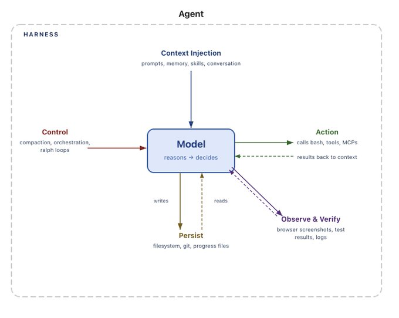
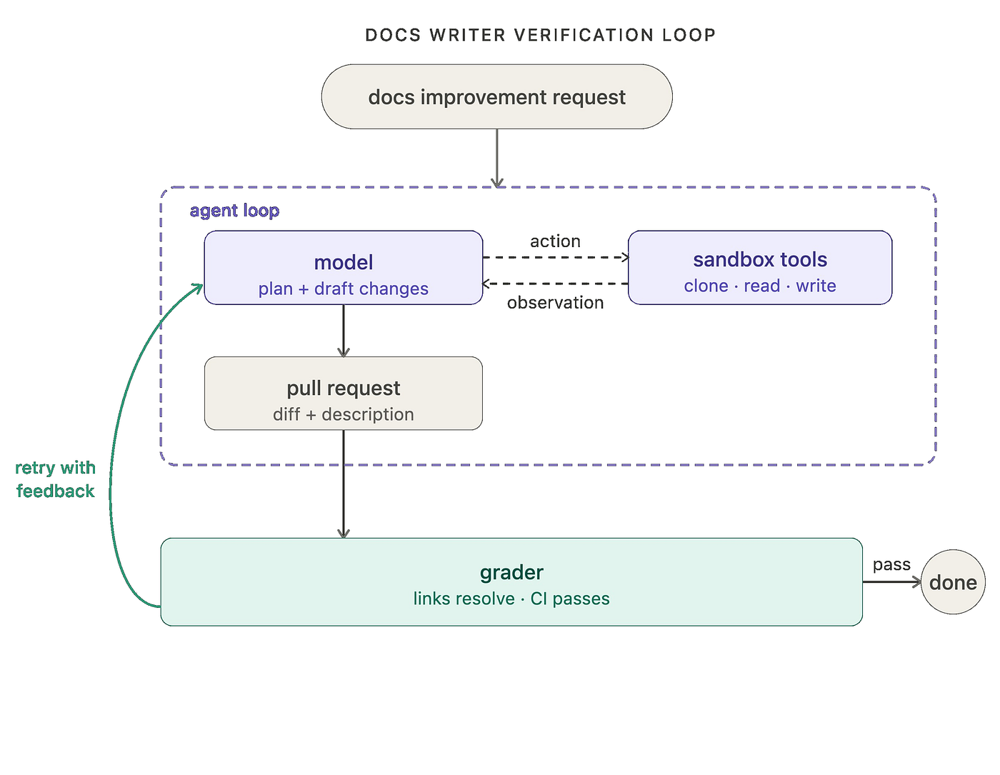
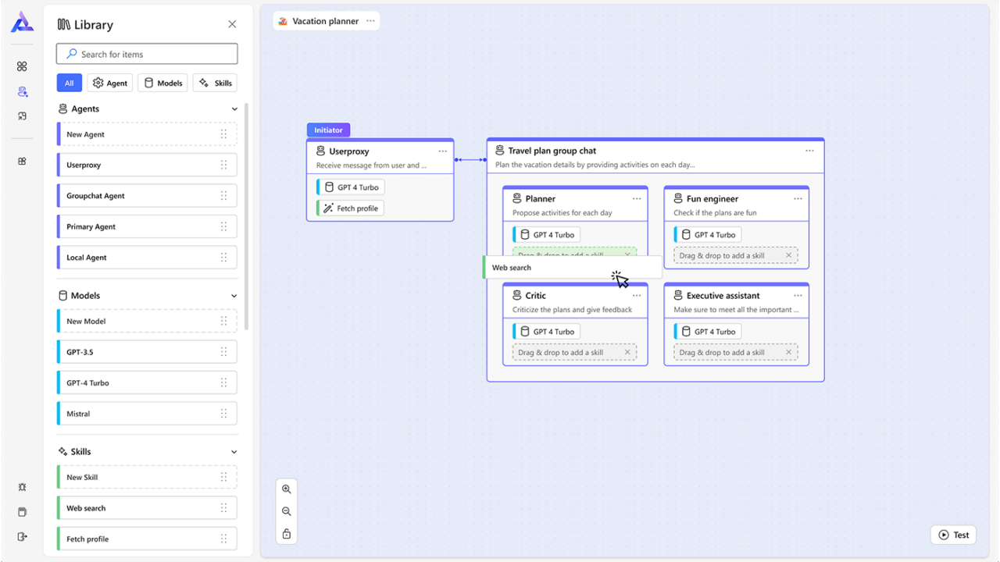

## 摘要（Summary）

2026 年 7 月最出圈的 agent 工程文章：Bijit Ghosh 的〈Agent Harness Engineering vs. Loop Engineering vs. Graph Engineering〉（Medium 2026-07-19 發布；X 上 @beamnxw 的同內容貼文**58 萬瀏覽、6.5 萬收藏**）。它沒有發明任何新東西，而是把近兩年被混用的三個熱詞放進同一張座標：**Harness 管環境、Loop 管回饋、Graph 管流程**（心智模型：environment → feedback → flow），並給出一張「症狀 → 層 → 修法」的**故障定位決策表**——這正是它被瘋狂收藏的原因：大家把它當工程速查表存。

本筆記整合三個來源回答「重點是什麼、以後怎麼用、痛點在哪、大家在討論什麼」：①原文全文（經 friend link 取得，10 分鐘閱讀）；②**LangChain 官方回應文**〈3 Years of Graph Engineering with LangGraph〉（2026-07-22，Harrison Chase 親自署名——立場是「graph engineering 不是新東西，LangGraph 三年前就在做」）；③中文圈一線工程師 Why QQ 的導讀影片（2026-07-31），提供「哪些能直接抄、哪些要繞坑」的實戰視角與對廠商敘事的清醒提醒。

## 為什麼這篇會爆紅：它踩中的痛點

Why QQ 影片開頭描述的場景幾乎是所有 agent 上線者的共同經驗：Demo 階段怎麼跑怎麼乖，一上生產環境就變玄學——agent 跑一大圈宣稱「做完了」但產出全是壞的；重試二十次 token 帳單翻三倍 bug 還在；跨 session 忘光進度;多給五個工具反而開始亂調用。**故障明明在那裡，但不知道從哪查起**：改 prompt？換模型？加記憶？上編排框架？每個方向都有人推銷自己的框架是終極答案。

這篇文章的價值就卡在這個痛點上：它給了一張「排障地圖」——你的系統由哪幾層組成、每層負責什麼、出了什麼症狀去哪一層抓內鬼。影片作者的總結很傳神：它把老闆那句「你們的 Agent 怎麼又抽風了」的模糊抱怨，**翻譯成了工程師可執行的排查工單**。

## 30 秒答案與三層比較

> [!note] 30 秒答案（原文）
> - **Harness engineering**：建造模型周圍的機械（builds the machinery around the model）
> - **Loop engineering**：設計重複的「工作＋回饋」循環
> - **Graph engineering**：把工作流拓撲顯式化——節點、分支、匯合、狀態轉移與受控循環
>
> 乾淨的心智模型：**environment → feedback → flow（環境 → 回饋 → 流程）**

三層的巢狀關係：**graph 跑在 harness 裡；loops 活在 graph 裡；harness 供應 loops 需要的 state、tools 與 evaluators**。分類會重疊（軟體分層本來就重疊），但每層給團隊的是「系統失敗時不同的施力點」。

原文比較表（表格圖轉 Markdown）：

| 問題 | Agent Harness | Loop Engineering | Graph Engineering |
|------|---------------|------------------|-------------------|
| 主要關注（Primary concern） | 操作能力（operational capability） | 迭代進展與回饋 | 顯式控制流 |
| 核心物件（Core object） | Model wrapper / runtime | 有界的可重複循環 | 步驟的有向圖 |
| 典型構件 | Tools、memory、sandbox、middleware、permissions、traces | Trigger、goal、action、evidence、feedback、stop rule | Nodes、edges、共享 state、branches、joins、interrupts、cycles |
| 它修的失敗 | 「模型無法安全地做這件工作」 | 「Agent 停太早，或重複產出弱結果」 | 「工作流難以推理或控制」 |
| 最適場景（Best fit） | 通用 agent 平台或任務特定 runtime | 靠驗證迭代改善的開放式工作 | 有已知決策點的複雜多步流程 |
| 主要風險（Main risk） | 臃腫、不透明的 runtime | 無限重試、token 燃燒、reward hacking | 過度工程的圖與脆弱路徑 |

## 第一層：Agent Harness Engineering（管環境）

- **LangChain 的定義**：agent = model + harness，harness 是模型之外的所有程式碼、設定與執行邏輯——system prompt、工具定義、記憶、檔案系統、sandboxes、model routing、handoffs、middleware hooks、壓縮（compaction）、權限、日誌與驗證介面
- **OpenAI Agents SDK 的 runtime 視角**：runner 呼叫模型、執行工具呼叫、處理 handoffs、攜帶狀態，只在達到真正的終止條件時停止

「Harness」這個詞的用處在於**把注意力從「模型崇拜」移開**：兩個團隊用同一個基座模型，一邊給乾淨工具、穩定工作區、受限權限與可觀測狀態；另一邊只有模糊 prompt 和不可靠的 API 包裝——智能水平差不多，**打工條件完全不同**。Why QQ 補充：「你硬換更強的大模型，也救不了爛透了的工程環境。」

一個嚴肅的 harness 通常包含六件事：**Context injection**（指令、檢索事實、對話狀態、skills、任務政策）、**Action surfaces**（API、瀏覽器、shell、code interpreter、資料庫、MCP 工具）、**Persistence**（檔案、checkpoints、sessions、進度日誌、git 歷史、長期記憶）、**Execution control**（timeout、重試、預算、model routing、sub-agent 派生、審批閘門）、**Safety & governance**（權限、隔離、白名單、密鑰處理、人工授權）、**Observability**（traces、工具輸入輸出、狀態轉移、成本、延遲、評估結果）。

> [!tip] 粗暴但好用的判斷法
> **把架構圖裡的「基座模型」拿掉，剩下的基本全是 harness**：工具、資料存取、狀態儲存、sandbox、middleware、evaluators、重試政策、UI。

**Harness 何時登場**：agent 缺能力、回不來（can't come back clean）、丟狀態、存取過寬、不可稽核、跨環境行為不一致。解法通常是**對管線的物理改動，不是 prompt 裡再加一段**。原文引用 Anthropic 多 session coding 的經驗：光靠 context compaction 不夠，需要 initializer、進度檔案、git 歷史與增量工作紀律，讓每個新 context 都能看懂「發生過什麼、還剩什麼」。

## 第二層：Loop Engineering（管回饋）

每個會用工具的 agent 都內嵌一個小迴圈：呼叫模型 → 看結果 → 跑工具 → 把觀察餵回模型 → 重複直到給出最終答案。當建造者**刻意圍繞這個行為疊加新循環**，就是 loop engineering 的開始：驗證迴圈（verification loop：產出 artifact → 跑確定性檢查或 grader → 收到明確回饋 → 只在有證據的錯誤時重跑）、事件驅動迴圈（排程、webhook、新文件喚醒）、改善迴圈（分析 traces 與失敗 → 修改指令/工具 → 驗證新版本更好）。LangChain 2026 的說法是 **a stack of loops**，不是一個魔法 while。

良好迴圈的七要素解剖：

| 要素 | 內容 |
|------|------|
| Trigger（觸發） | 什麼啟動下一輪：使用者請求、排程、失敗的測試、新資料、evaluator 回饋 |
| Goal（目標） | 要到達的**具體狀態**，不是「繼續改善」這種模糊指令 |
| State & memory | 下一輪需要知道什麼，而不用重播全部 |
| Action policy | Agent 可以改什麼、呼叫什麼、委派什麼、花多少 |
| Evidence（證據） | 測試、schema 驗證、引文、diffs、指標或人工審查 |
| Feedback（回饋） | 對「證據為何失敗」的精簡可行動描述 |
| Stopping rule（停止規則） | 成功、預算上限、timeout、不可恢復錯誤或人工升級 |

> [!quote] 全文金句
> "Do not loop on confidence. Loop on evidence."（別對信心循環，要對證據循環）——「agent 說它做完了」不是停止條件；「測試通過、連結可解析、schema 驗證通過、審查者核可」才是。

**與 prompt engineering 的分界**：prompt 管「呼叫中」模型該做什麼；loop 管「呼叫後」系統做什麼——怎麼觀察結果、選擇回饋、決定是否繼續、持久化進度、何時終止。主要代價是成本與延遲：每個 grader、reviewer、retry 都是一次額外的模型或工具呼叫。Anthropic 的通用建議在此適用：**偏好最簡可行架構**——loop 只該加在「失敗成本遠高於驗證成本」的地方。

## 第三層：Graph Engineering（管流程）

Graph engineering 問的是另一個問題：**不只 agent 做什麼，而是「哪個元件被允許接著跑」**。節點代表步驟、邊代表允許的下一步（順序、條件分支、平行 fan-out、匯合、循環、人工中斷），狀態沿圖流動，拓撲讓控制流可被檢查。

- **LangGraph**：定位為長時運行、有狀態 agent 的低階編排基礎設施——durable execution、狀態與 human-in-the-loop 控制，明確強調「control over agents」而非把工作流抽象掉
- **Microsoft AutoGen（GraphFlow）** 文件說得直白：需要精確控制 agent 順序、不同結果走不同分支、確定性分支或帶循環的複雜多步流程時，才用 graph

Graph 工程師實際決定六件事：**節點邊界**（哪些工作屬於確定性函式／LLM 呼叫／專家 agent／人工審查）、**state schema**（每個節點可讀寫什麼、平行更新如何合併）、**路由條件**（什麼證據把工作送往前、後、旁路或升級）、**並行**（什麼可平行、什麼必須 join、共享資源如何協調）、**循環與出口**（哪裡允許重試、幾次、什麼讓循環安全）、**耐久性**（checkpoint 在哪、中斷後如何恢復）。

> [!warning] Graph 的儀式成本
> Graph 在流程有實質分支、平行工作、審批、恢復路徑或多專家 agent 時才有價值；當任務只是「給一個 agent 三個工具讓它做」時價值不大。**圖能改善除錯，但也可能太早凍結假設**——若模型必須動態發明計畫，把每條可能路徑塞進圖裡會讓系統更脆，不是更穩。注意這裡的 graph 是「執行圖」，與知識圖譜（knowledge graph）的資料實體關係圖不同。

## 三層在一個真實系統中的合作

以「研究與出版 agent」（產出事實性產業簡報）為例（原文表格圖轉 Markdown）：

| 層 | 在此系統中的職責 |
|----|------------------|
| Harness | 提供瀏覽器、搜尋工具、文件工作區、引文儲存、model routing、密鑰、權限、trace 日誌與審批介面 |
| Graph | 把工作路由過 scoping → 平行研究 → 來源篩選 → 綜合 → 草稿 → 法務審查 → 出版，發布前有人工閘門 |
| Loops | 覆蓋率不足時重跑來源檢索；引文失敗時把草稿退回修正；市場變化時執行排程更新 |

## ⭐ 核心運用：故障定位決策表（症狀 → 層 → 修法）

這是全文最實用的部分（原文表格圖轉 Markdown），Why QQ 稱之為「值回票價的一張表」：

| # | 症狀 | 先查哪層 | 可能的修法 |
|---|------|---------|-----------|
| 1 | Agent 無法安全存取正確的資料或工具 | **Harness** | 工具契約、權限、sandbox、context injection |
| 2 | Agent 跨 session 忘記進度 | **Harness** | 持久化狀態、checkpointing、進度產物、壓縮策略 |
| 3 | 第一次嘗試常常接近但不可靠 | **Loop** | 外部 grader、確定性測試、回饋與有界重試 |
| 4 | 成功後還不停手——或沒有證據就宣布完成 | **Loop** | 證據型終止狀態與預算感知的停止規則 |
| 5 | 多個專家必須按受控順序執行 | **Graph** | 顯式節點、邊、路由條件與匯合 |
| 6 | 多步流程中的失敗難以定位 | **Graph + Harness** | 與圖節點及轉移對齊的有狀態 traces |
| 7 | 工作流變動太頻繁、不適合固定圖 | **更簡單的 Harness** | 保持模型驅動的控制；**推遲圖的形式化** |

第 7 條最反直覺也最重要：需求還在「三天一改」的階段，**往回退**、別畫圖。

## 可直接抄的七條實踐（Why QQ 按落地優先級整理）

1. **證據驅動的停止規則**：agent 自稱完成一文不值；測試通過、連結可解析、schema 驗證、人工核可才算數
2. **有界重試**：「失敗了繼續試」不能當 loop 規格；每個循環寫清楚四件事——可測量目標、每輪必須拿到的新證據、最大重試次數、具名兜底路徑。無界重試的惡果就是成本黑洞，「Token 帳單才是最誠實的報警器」
3. **最小權限**：harness 層的權限、網路隔離、白名單、密鑰處理、人工授權一樣都別省——權限太寬，被注入攻擊或搞崩系統只是時間問題
4. **進度檔案 + Git 歷史做持久化**（Anthropic 多 session 經驗）：光靠 context 壓縮不夠，要 initializer、結構化進度檔、git 提交歷史與增量工作紀律
5. **確定性檢查永遠優先於模型自評**：同一模型既當選手又當裁判有共同盲區——「它寫碼時在哪瞎了，評審時往往還在同一個地方瞎」；能用自動化測試／schema 驗證／diff 解決的就別用另一個 LLM 評；必須用 LLM 評審時做 context 分離，高危動作上人工審批
6. **先跑 Trace 再畫 Graph**：業務沒跑通就上圖編排是原文「昂貴錯誤清單」榜首；正確姿勢是先用最簡 harness 跑、收集真實 traces、看穩定路徑長什麼樣，再用圖固化
7. **工具寧窄勿寬**：「別把 harness 當垃圾場」——工具一多選擇錯誤率上升、context 變嘈雜；更多工具和記憶不會自動等於更好的結果

這七條**沒有一條需要買新框架，全是工程紀律**。

## 五個昂貴錯誤（The Expensive Mistakes）

1. **先建圖再理解工作**：先從簡單 harness 的 traces 觀察 agent 怎麼解題，再形式化穩定路徑
2. **同一模型自寫自評無防護**：優先確定性檢查、分離 reviewer context、高影響動作要人工核可
3. **拿「keep trying」當 loop 規格**：無界重試是成本漏洞
4. **把 harness 當垃圾場**：工具越多選擇錯誤越多、context 越吵模型越混亂、權限越寬風險越高
5. **把編排失敗怪罪模型**：模型無法可靠地補償過期狀態、模糊的工具 schema、壞掉的 API 或缺失的退出條件——**修「擁有這個失敗」的那一層**

## 生產就緒檢查清單（原文五項）

- **Harness**：工具是否窄、有文件、可觀測？狀態是否耐久？權限是否最小？操作員能否暫停、檢視、恢復一次執行？
- **Loop**：什麼證據證明成功？失敗時回傳什麼回饋？允許幾次重試？預算耗盡時發生什麼？
- **Graph**：哪些路徑必須確定性？哪裡可平行？哪些狀態共享？人工閘門與恢復路線在哪？
- **Evaluation**：團隊能否重播真實 traces、比較版本、把改善歸因到具體變更而非直覺？
- **Operations**：成本、延遲、失敗率、人工介入率與任務級成功率是否在 production 中被監控？

## LangChain 官方回應：〈3 Years of Graph Engineering with LangGraph〉

三天後（2026-07-22）LangChain 發文回應，**Harrison Chase（CEO）與 Sydney Runkle 親自署名**——立場與其說反駁，不如說是「認領」：

- **「Graph engineering 不是新概念」**：LangGraph 三年前就是這個做法，如今月下載 65M+。graph engineering 和 prompt engineering、loop engineering 一樣，術語存在是因為它描述了真實的難題——"getting LLMs to do work is **hard**"
- **真正新的是「node 裡能放什麼」**：早期節點裝確定性程式碼或單次 LLM 呼叫；現在**整個 agent run 可以是一個 node**
- 技術要點：production agent 需要循環（重試、修訂、暫停）所以不是 DAG；`Send` API 讓節點動態路由工作到下游而不用靜態定義每條邊；「loop 只是 graph 的簡化版——a loop is just a directed, cyclic graph」
- **誠實的適用邊界**：可預測結構的工作流（先分類再行動、先檢查 repo 再改碼、需要審批）用 graph；高度探索型任務（如 deep research）**agentic 彈性比結構重要**——並舉了 GPT Researcher 從 graph 架構遷移到 Deep Agents 的反向案例

> [!note] 三方立場對照
> 原文（Bijit）：三層各有職責，按症狀選層修。LangChain：graph 是老東西的新名字，我們做三年了，且 loop ⊂ graph。Why QQ（一線視角）：術語通脹要清醒，但「症狀到分層」的排障邏輯比術語長壽。三方其實共識大於分歧——**都反對過早上圖、都主張證據驅動、都承認分層會重疊**。

## 大家在討論什麼（社群反應盤點）

- **X 原帖**（@beamnxw）：58 萬瀏覽、6.5 萬收藏——收藏率極高的典型「速查表型」傳播：大家不是讀完了認同，而是「怕以後找不到」先存
- **LangChain 官方下場**引發第二波討論：Medium 上出現〈Is Graph Engineering Here? LangChain Says It's Nothing New〉等反應文，科技媒體以「LangChain CEO Says LangGraph Led Graph Engineering」角度報導——**框架廠商爭奪術語定義權**成為看點
- **中文圈**（Why QQ 影片）聚焦三件事：①決策表可直接抄進排障 SOP；②警惕**廠商敘事**——原文大量引 LangChain／OpenAI／AutoGen 的資料，這些來源難免夾帶推廣生態的私貨，「他們總結的避坑指南可以抄，他們推銷的複雜架構結論必須拿你生產環境的真實 trace 驗證，別拿發布會 PPT 驗證」；③**老工程紀律的回歸**——證據驅動停止、有界重試、最小權限、確定性檢查優先，這些在分散式系統、SRE 手冊、資安規範裡早就無處不在；「Agent 工程 2026 年沉澱下來的好東西，一大半是過去的老工程紀律換了身時髦衣服。你過去十年的工程直覺沒作廢，它正在變成你在 AI 時代最堅固的護城河」

Why QQ 的三個前瞻判斷也值得記錄：①**Harness 層標準化加速**（工具協定、權限模型、trace 格式變公共基礎設施，自造輪子的差異化空間縮小）；②**Loop 層的競爭點在「證據系統」**（誰的自動化評分器更便宜準快，誰的循環就敢多跑幾輪——測試工程含金量回升）；③**Graph 層將經歷去泡沫化**（跟風上圖的專案會退回簡單 harness，留下的是真有複雜分支／並行／審批／恢復剛需的重型系統）。

## 我的心得（My Takeaways）

這篇筆記與知識庫既有的兩條線完美接軌：Google 白皮書（[[2026-05-01-GOOGLE-WHITEPAPER-NEW-SDLC-VIBE-CODING-TO-AGENTIC-ENGINEERING]]）給了 harness 的 **管理層敘事**（Agent = Model + Harness、10%/90%），本文給了 **工程層操作手冊**（症狀→層→修法）；而 Akshay Kokane 的 loop vs harness 之辨（[[2026-06-17-WHAT-IS-LOOP-ENGINEERING-HOW-DIFFERENT-HARNESS-ENGINEERING]]）在本文被擴充成三層——「Loop 是 Harness 上方的控制平面」與本文「loops 活在 graph 裡、graph 跑在 harness 裡」是一致的巢狀觀。

三個對我最有價值的具體收穫：①**故障定位決策表直接可抄**——特別是第 7 條「工作流還在快速迭代時，往回退、推遲圖的形式化」，這是對「拿到新框架就想全上」最好的解毒劑；②**「Do not loop on confidence. Loop on evidence.」**應該貼在所有 agent 專案的 README 上——它與 Google 白皮書的 trajectory evaluation、Thariq 的合併前小考是同一個驗證哲學的三種表達；③**LangChain 回應文的 GPT Researcher 反向案例**（從 graph 遷到 Deep Agents）比原文更誠實地畫出了 graph 的邊界——連圖編排的頭號廠商都承認探索型任務不該上圖。

批判面：原文作者身分有些混亂（pub.towardsai.net 顯名 ML Point、Medium 帳號 @bijit211987、X 原帖 @beamnxw），且內容高度依賴 LangChain／OpenAI／AutoGen 的官方資料綜合——它是一篇優秀的**綜合整理**而非原創研究；Why QQ「警惕廠商敘事」的提醒因此格外中肯。另外「loop engineering 是 2026 年從業者間興起的新詞」這個說法，與知識庫記錄的 Loop Engineering 傳承（Rahul × Addy 起源）吻合，但三層劃分本身也可能是下一個被通脹的術語——真正該內化的是排障邏輯，不是名詞。

## 待補充（Open Questions）

- **X 原帖 @beamnxw 與 Medium @bijit211987 的關係**：同一人？授權轉載？或內容農場搬運？58 萬瀏覽的傳播主體其實是 X 帖而非 Medium 文。可追蹤：`beamnxw X agent harness loop graph engineering thread`
- **「跟圖節點對齊的有狀態 trace」如何實作**：症狀 6 的修法（Graph + Harness 聯合）只有一句話，LangGraph 的 checkpoint/trace 與 LangSmith 如何具體對齊？可追蹤：`LangGraph checkpoint trace alignment LangSmith node-level debugging`
- **GPT Researcher 從 graph 遷到 Deep Agents 的完整動機與量化收益**：LangChain 只一句帶過，這是「何時不用 graph」的最佳實證案例。可追蹤：`GPT Researcher Deep Agents migration from LangGraph architecture`
- **Reward hacking 在 loop 層的實際案例**：比較表把它列為 loop 的主要風險之一，但原文沒展開——agent 如何騙過 grader？可追蹤：`agent verification loop reward hacking grader gaming examples`
- **三層劃分與 Google 白皮書六大件的映射**：本文 harness 六內容 vs Google 六大件（rule files/tools/sandboxes/orchestration/hooks/observability）高度重疊但切法不同——orchestration 在本文被拆到 loop+graph 兩層。哪種切法對排障更有效？可自行對照實驗。可追蹤：`agent harness taxonomy comparison layered debugging`

## 相關連結（Related）

- [[2026-05-01-GOOGLE-WHITEPAPER-NEW-SDLC-VIBE-CODING-TO-AGENTIC-ENGINEERING]] — Google 白皮書的 harness 六大件是管理層敘事，本文三層是工程層排障手冊；兩者的 harness 定義可互相映射。
- [[2026-04-24-AGENT-HARNESS-12-MODULES-COMPLETE-GUIDE]] — Harness 十二模組完全解析；本文的 harness 六內容是更粗粒度的同主題切分。
- [[2026-04-02-HARNESS-ENGINEERING-COMPLETE-GUIDE]] — Harness Engineering 完整指南；本文把它放進三層座標的第一層。
- [[2026-06-17-WHAT-IS-LOOP-ENGINEERING-HOW-DIFFERENT-HARNESS-ENGINEERING]] — Loop vs Harness 之辨的前作；本文把二分擴充為三層並補上 graph。
- [[2026-06-07-LOOP-ENGINEERING-THREE-SOURCE-EXPERT-SYNTHESIS]] — Loop Engineering 多來源綜合；本文的七要素迴圈解剖與其停止條件設計互相印證。
- [[2026-04-09-ANTHROPIC-SHIPPED-THREE-OF-FIVE-HARNESS-LAYERS]] — Anthropic 五層 harness 堆疊；本文引用的 Anthropic 多 session 持久化經驗（進度檔+git）屬於其中的狀態層。

---

## 知識層次分析（Bloom's Taxonomy Analysis）

> 以下從五個認知層次對本篇內容進行結構化分析，協助從記憶到評估逐層深化理解。

| 認知層次 | 核心目的 | 對本文的具體應用 |
|---------|---------|--------------|
| **記憶（被動）** | 確認資訊存在，單純資訊檢索 | 必記概念：三層心智模型 environment → feedback → flow、巢狀關係（graph 在 harness 裡、loop 在 graph 裡）、harness 六內容、迴圈七要素（Trigger/Goal/State/Action policy/Evidence/Feedback/Stopping rule）、"Do not loop on confidence, loop on evidence"、五個昂貴錯誤、「模型拿掉剩下全是 harness」判斷法 |
| **理解（半被動）** | 解釋概念的含義及關聯 | 三層是三個不同的施力點而非互斥選項：harness 決定模型「能不能安全做」、loop 決定「什麼時候算做完」、graph 決定「誰被允許接著做」；排障的本質是把「agent 不可靠」這團焦慮切成能各自定責的切面 |
| **分析（主動）** | 檢驗論點、拆解流程、找出假設 | 隱含問題：①原文是 LangChain/OpenAI/AutoGen 官方資料的綜合，來源幾乎全是框架廠商——「你需要更複雜編排」的結論有利益衝突；②三層邊界實際上模糊（orchestration 同時出現在 harness 與 graph 的定義裡），決策表的乾淨程度在真實系統中會打折；③「loop engineering 是 2026 新詞」的斷代與 LangChain「我們做三年了」的認領互相矛盾——術語史本身就是行銷戰場 |
| **應用（主動）** | 將知識套用情境，規劃執行方案 | 1. 把故障定位決策表抄進團隊的 agent 排障 SOP，下次生產事故先按症狀對號入座再動手；2. 檢查自己所有 agent 迴圈是否有七要素——特別是「證據」與「停止規則」兩項（拿 connsys-jarvis 的 feedback loop 對照）；3. 對照「五個昂貴錯誤」盤點現有專案：有沒有 unbounded retry？有沒有同模型自評？工具清單是否過寬 |
| **評估（主動）** | 判斷多個方案的優劣，進行決策和權衡 | 與 Google 白皮書比較：白皮書適合對管理層建立共識（why），本文適合工程師日常排障（how to debug）；與 AI-DLC 比較：AI-DLC 是把 graph 層做成 Markdown 流程規則的重量級實作，本文第 7 條症狀（需求頻繁變動→退回簡單 harness）恰好是「何時不該上 AI-DLC」的判準；LangChain 回應文的價值在誠實畫出 graph 邊界（探索型任務不適用），比原文的三層並列更有取捨指引 |

### 分析型追問（Socratic Follow-up）

- **澄清**：「harness」的邊界到底在哪？原文把 model routing 放在 harness，但 routing 規則又是 orchestration（graph 層）的職責——同一機制出現在兩層，決策表遇到 routing 故障該查哪層？
- **假設**：三層劃分假設失敗可以歸因到單一層，但生產事故常是跨層連鎖（權限過寬 → 工具亂調 → 重試燒錢）；「第一責任層」的判定在連鎖失敗中還成立嗎？
- **證據**：「58 萬瀏覽 6.5 萬收藏」證明的是傳播力不是正確性——有沒有團隊實際採用這張決策表後排障時間下降的量化數據？（Why QQ 說「收斂快多了」是唯一的個案見證）
- **觀點**：站在 DSPy／自動優化派的立場：與其人工設計三層，不如把 loop 與 graph 都交給優化器搜尋——三層手工工程會不會是過渡期產物？
- **後果**：若團隊全面採納「症狀→層」的排障文化，12 個月後可能出現「層際推諉」——harness 團隊說是 loop 的錯、loop 說是 graph 的錯；決策表需要配套的跨層 ownership 制度嗎？

### 方案批判三問（Critical Evaluation）

1. **最大的風險是什麼？** — 分類學的虛假安全感：三層地圖讓人以為所有故障都可乾淨歸層，但真實事故常是跨層連鎖或層間介面問題（例如 graph 的 state schema 與 harness 的持久化格式不相容）。把時間花在「爭論歸哪層」而不是修故障，是分類學工具的經典副作用。
2. **什麼情況下會失敗？** — ①單人小專案：三層儀式感超過需求，一個簡單 harness + 一條驗證迴圈就夠；②需求高速變動期：連 loop 的 evidence 定義都還在變，任何形式化都過早（原文第 7 條自己承認）；③探索型任務：LangChain 自己舉的 GPT Researcher 反例——agentic 彈性比結構重要時，graph 是負資產。
3. **有沒有更好的替代方案？** — 對「已經在用特定框架」的團隊，直接採用該框架的原生除錯體系（LangSmith trace、AutoGen Studio）可能比抽象三層更快落地；對管理溝通場景，Google 白皮書的 Model/Harness 二分比三層更易傳達；最務實的組合：用本文決策表做工程排障、用白皮書二分對上溝通、把七條實踐納入 code review checklist——三者不衝突。

## References

- [原文（friend link 可免費閱讀）：Agent Harness Engineering vs. Loop Engineering vs. Graph Engineering（Bijit Ghosh／ML Point，Towards AI on Medium，2026-07-19）](https://pub.towardsai.net/agent-harness-engineering-vs-loop-engineering-vs-graph-engineering-02690996d485?sk=b98098a4e88b2b9086eb0e73342a711c)
- [Medium 原文：@bijit211987](https://medium.com/@bijit211987/agent-harness-engineering-vs-loop-engineering-vs-graph-engineering-44a967d6b975)
- [Towards AI 轉載（含官方摘要）](https://towardsai.com/p/machine-learning/agent-harness-engineering-vs-loop-engineering-vs-graph-engineering)
- [LangChain 官方回應：3 Years of Graph Engineering with LangGraph（Sydney Runkle & Harrison Chase，2026-07-22）](https://www.langchain.com/blog/3-years-of-graph-engineering-with-langgraph)
- [Why QQ 導讀影片：58万浏览6.5万人收藏的Agent排障表，我抄了（2026-07-31，12:08，zh-Hans 字幕）](https://youtu.be/s3yiXTxueoI)
- [社群反應文：Is Graph Engineering Here? LangChain Says It's Nothing New（AI Engineering, Medium）](https://ai-engineering-trend.medium.com/is-graph-engineering-here-langchain-says-its-nothing-new-17a35a2bad37)
- 原文引用的一手資料：[LangChain — The Anatomy of an Agent Harness](https://www.langchain.com/) ／ [The Art of Loop Engineering](https://www.langchain.com/) ／ [OpenAI Agents SDK](https://developers.openai.com/) ／ [AutoGen GraphFlow](https://microsoft.github.io/) ／ [Anthropic — Building Effective AI Agents](https://resources.anthropic.com/)
