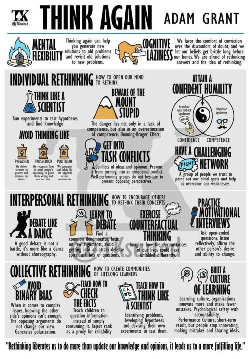

## 摘要（Summary）

《逆思維》（Think Again: The Power of Knowing What You Don't Know）是賓州大學華頓商學院（Wharton School）組織心理學教授亞當·格蘭特（Adam Grant）於 2021 年出版的作品，深度探討「重新思考（rethinking）」的力量——也就是有意識地質疑自己的信念、拋棄過時的觀點、並在新的證據面前更新認知。

在一個資訊爆炸、環境快速變遷的時代，知道「什麼時候該改變想法」，比知道「什麼時候要堅持」，更是一種稀缺且關鍵的能力。

> [!important] 核心命題
> 智慧（intelligence）不只是學習的能力，更是**重新學習（unlearning）**和**重新思考（rethinking）**的能力。聰明的人擅長辯護自己的觀點；但真正有洞察力的人，擅長質疑自己的觀點。

---

## 一、書籍架構概覽

本書分為四大部分：

```
第一部分：個人重新思考
   ├─ 第 1 章：傳教士、檢察官、政客、科學家的思維模式
   ├─ 第 2 章：聰明的弱點——以自知解除武裝
   └─ 第 3 章：蘇格拉底式困惑的喜悅

第二部分：人際重新思考
   ├─ 第 4 章：挑戰建立關係——好辯者的贏家手冊
   ├─ 第 5 章：跳舞，而不是格鬥——如何與反對者談判
   └─ 第 6 章：壞血——打破偏見的循環

第三部分：集體重新思考
   ├─ 第 7 章：重新定義接種疫苗——讓不接受事實的人接受事實
   ├─ 第 8 章：共識的代價——解開沉默的文化
   └─ 第 9 章：兩極化的陷阱——複雜性的魅力

第四部分：終身重新思考的習慣
   ├─ 第 10 章：更新職涯地圖——超越規劃謬誤
   ├─ 第 11 章：激發他人的重新思考——終身學習的課程
   └─ 結語：以智識謙遜（Intellectual Humility）面對世界
```

---

## 二、第一部分：個人重新思考

### 2.1 四種思維模式

Grant 用四種身份類比描述我們面對挑戰時的思維習慣：

> [!note] 四種思維模式（Four Mental Modes）
> - **傳教士（Preacher）**：當有人威脅我們的信念時，我們進入傳教模式，捍衛並傳播我們的神聖觀點
> - **檢察官（Prosecutor）**：當我們發現別人的論點有缺陷時，我們進入檢察官模式，挑剔他人的推理並贏得案件
> - **政客（Politician）**：當我們試圖贏得他人支持時，我們進入政客模式，拉票、討好聽眾
> - **科學家（Scientist）**：當我們尋求真理時，我們進入科學家模式，形成假設（hypothesis）、收集資料、測試假設、更新觀點

**核心主張**：我們在日常生活中應該更常切換到「科學家模式」——把自己的觀點當作「假設」而非「真理」，用「好奇心」取代「確信」。

### 2.2 達克效應（Dunning-Kruger Effect）的悖論

> [!warning] 確信感的陷阱
> 能力越低的人，往往對自己的能力越有把握（因為他們不知道自己不知道什麼）。真正的專家通常更加謙遜，因為他們越清楚這個領域有多複雜。

Grant 提出**智識謙遜（Intellectual Humility）**的重要性：
- 不是對自己的觀點沒有把握
- 而是對「觀點有可能是錯的」保持開放
- 這種謙遜實際上是一種自信——你相信自己有能力在更新觀點後繼續前進

### 2.3 「哈姆雷特效應」——懷疑自己的懷疑

當我們有「冒牌者症候群（Impostor Syndrome）」時，Grant 提出一個反直覺的觀點：

**適度的懷疑感實際上有助於表現**，因為它能：
- 促使你更努力準備
- 讓你對回饋保持開放
- 防止過度自信導致的輕率決策

> [!tip] 可執行建議
> 遇到冒牌者症候群時，不要試圖消除它，而是把它重新框架（reframe）為：**「我正在謙遜地面對這件事的複雜性」**。

---

## 三、第二部分：人際重新思考

### 3.1 辯論的藝術——少就是多

Grant 引用研究發現：在說服別人時，**提出更多論點反而可能適得其反**。

當你列出十條理由時，對方會想：「你要費這麼大勁才能說服我，可見這件事本身並不那麼有說服力。」

> [!important] 說服的反直覺法則
> - 選擇你**最強的一兩個論點**，深入闡述，比列舉十個弱論點更有說服力
> - 找出對方**已經認同的一點**，從那裡建立橋樑
> - 問問題，而不是聲明——讓對方自己說出理由

### 3.2 動機式訪談（Motivational Interviewing）

Grant 詳細介紹了心理學家在戒癮治療中發展出的技術，並說明它在日常說服中的應用：

**核心技巧**：
1. **問開放性問題（Open-ended Questions）**：讓對方思考改變的可能性
2. **反映式傾聽（Reflective Listening）**：把對方說的話反映回去，確認你理解了
3. **肯定自主性（Affirm Autonomy）**：強調決定權在對方手中，你只是提供思考的素材

> [!example] 具體範例
> 與其說：「你應該要改變這個習慣」
> 不如說：「你覺得如果改變這個習慣，對你來說最大的好處會是什麼？」

### 3.3 對話中的「舞蹈」vs「格鬥」

優秀的談判者（negotiator）和糟糕的談判者的差異：

| 行為 | 糟糕的談判者 | 優秀的談判者 |
|------|------------|------------|
| 反對意見時 | 立即反駁 | 先探索對方的立場 |
| 論點數量 | 堆砌多個論點 | 精選一兩個最強論點 |
| 提問頻率 | 很少問問題 | 大量提問 |
| 情緒感受 | 視為弱點 | 直接說出來（「我有點困惑...」）|
| 共識尋求 | 少 | 主動尋找共同點 |

---

## 四、第三部分：集體重新思考

### 4.1 為什麼事實無法改變人的想法

Grant 引用心理學研究解釋「確認偏誤（Confirmation Bias）」：

- 人們不只是選擇性地接收資訊，更會**主動尋找支持自己觀點的證據**
- 當被提供反駁自己觀點的事實時，人們反而**更加堅持原有觀點**（「逆火效應（Backfire Effect）」）

> [!warning] 為什麼「提供事實」常常無效
> 信念不只是關於資訊，它們還涉及**身份認同（identity）**。當你挑戰一個人的信念，他們感覺到的是**你在攻擊他們這個人**，而不只是攻擊一個觀點。

**解法**：在挑戰觀點之前，先分離「觀點」和「身份」。讓對方感覺到：「就算你改變了這個想法，你仍然是你。」

### 4.2 打破極化（Polarization）的方法

Grant 提出一個反直覺的建議：**不要試圖讓議題看起來更簡單，而是讓它看起來更複雜**。

當我們承認一個議題有多個側面、多種有效觀點時，人們反而更容易鬆動原本的極端立場。

> [!tip] 複雜性地圖（Complexity Map）
> 在討論爭議性話題時，嘗試：
> 1. 找出你**同意**對方觀點的一個地方
> 2. 找出你**自己的立場**中有疑慮或不確定的一點
> 3. 承認這個議題有多個合理的立場

---

## 五、第四部分：終身重新思考的習慣

### 5.1 職涯規劃的謬誤

Grant 批評傳統的「職涯規劃（career planning）」思維，主張：

> [!important] 職涯規劃的新框架
> 把你的職涯當作一系列的**「小實驗（small experiments）」**，而不是一條直線的路徑。
> 
> - **舊框架**：「我要成為 X，然後按照這個計劃走」
> - **新框架**：「我現在對 X 感興趣，讓我先做幾個小實驗看看是否真的適合我」

這樣做的好處：
- 降低路徑改變的心理成本
- 讓「轉換方向」從「失敗」變成「學到新東西後的調整」
- 更能應對快速變化的職業環境

### 5.2 「角色」vs「人格特質」

Grant 提出一個重要的身份認同（identity）框架：

與其說「我是一個 X 類型的人」，不如說「**我是一個目前做 X 的人**」。

| 身份框架 | 說法 | 影響 |
|---------|------|------|
| 固定型（Fixed） | 「我是個內向的人」 | 限制行為的彈性 |
| 動態型（Dynamic） | 「我目前比較喜歡獨處思考」 | 保留改變的可能性 |
| 固定型 | 「我不是搞數字的人」 | 預先關閉學習可能性 |
| 動態型 | 「我還沒有花時間深入學數字」 | 維持成長空間 |

### 5.3 教育中的重新思考

Grant 描述了「心理安全感（Psychological Safety）」在學習環境中的重要性：

- 學生（和員工）需要感覺「犯錯和提問是被歡迎的」，才能真正學習
- 最有效的老師不是給出所有答案的人，而是提出好問題的人
- 讓學習者自己發現問題的答案，比直接告訴他們答案，記憶更深刻

---

## 六、關鍵概念速查

> [!note] 智識謙遜（Intellectual Humility）
> 承認自己可能是錯的，並對新證據保持開放的意願。這不是缺乏自信，而是一種元認知（metacognition）能力——你知道自己的認知有局限。

> [!note] 確認偏誤（Confirmation Bias）
> 傾向於尋找、解讀和記憶支持自己已有信念的資訊。是人類最普遍、最難覺察的認知偏誤之一。

> [!note] 邏輯謙遜（Argument Humility）
> 承認你的論點可能有弱點，並願意在對話中探索那些弱點，而不是死守每一個細節。

> [!note] 成長型身份（Identity Fluidity）
> 把自己定義為「正在學習的人」而非「某種固定類型的人」，讓身份認同不再成為改變的障礙。

---

## 七、書中最值得記住的金句

> [!quote] Adam Grant
> 「最成功的職涯規劃師，不是那些最早找到人生目標的人，而是那些在每個階段都能重新評估自己方向的人。」

> [!quote] Adam Grant
> 「聰明是認識到問題的複雜性；智慧是知道什麼時候簡化它。」

> [!quote] Adam Grant
> 「知道你不知道什麼，是重新思考的起點。」

> [!quote] Adam Grant
> 「懷疑是不確定的武器；謙遜是成長的基礎。」

---

## 八、對工程師與技術人的特別啟示

結合今日 AI 快速發展的背景（參見 [[2026-03-25-ENGINEERS-FUTURE-MULTI-AGENT-ERA-STEVE-YEGGE]]），本書對技術人員有幾個直接的應用：

> [!tip] 技術人員的逆思維實踐

1. **不要讓「過去的技術選擇」成為你的身份**：用的框架、掌握的語言，都只是「目前選擇的工具」，不是「你是什麼人」。當更好的工具出現時，才能放得下。

2. **把架構決策當作假設，而非真理**：設計一個系統時，記錄下「這個選擇的假設是什麼」——當假設不再成立時，才能更快地辨認出需要重新設計。

3. **在 code review 中使用動機式訪談（Motivational Interviewing）**：與其說「這樣做是錯的」，不如說「你在這邊做這個選擇的考量是什麼？」——這能讓對方自己思考是否有更好的做法。

4. **AI 時代的「重新學習（Unlearning）」**：Steve Yegge 說的「球門一直在移動」，其實正是本書的核心主題——最危險的不是不學習，而是繼續相信過時的「最佳實踐（best practices）」。

---

## 我的心得（My Takeaways）

這本書最讓我印象深刻的，是它對「身份（identity）」與「改變（change）」之間關係的深刻分析。我們常常不是因為「缺乏證據」而無法改變觀點，而是因為「改變觀點感覺像是在否定自己」。

對於工程師來說，這一點尤其關鍵。技術人員往往容易把自己對某個技術棧的選擇或架構哲學，變成一種身份認同的一部分。結果就是，當新的技術或方法出現時，「學習新東西」會錯誤地感覺像「承認自己之前是錯的」。

Grant 的解法——把職涯和技術選擇重新框架為「一系列的小實驗」——是一個非常實用的心智工具。

另一個值得深思的點是「說服的反直覺法則」。在工程討論中，我們常常試圖用堆積如山的技術論點來說服同事或主管。但根據本書的研究，這可能適得其反。精選一兩個最有力的論點，加上「為什麼這對我們具體情況重要」的連結，往往比長篇大論更有效。

---

## 關鍵洞察（Key Insights）

- **科學家模式 vs. 傳教士模式**：把觀點當假設而非真理，是重新思考的基礎——參見 [[INTELLECTUAL-HUMILITY]]
- **說服力與論點數量成反比**：選擇最強的一兩個論點深入闡述，比列舉十個弱論點更有效
- **身份認同是改變的最大阻力**：分離「觀點」和「自我認同」，是幫助他人（和自己）改變的關鍵——參見 [[COGNITIVE-BIAS]]
- **職涯是一系列小實驗**：把路徑轉變從「失敗」重新框架為「根據新資訊調整」——參見 [[GROWTH-MINDSET]]
- **複雜性比簡化更能打破極化**：在爭議性討論中，承認多個有效立場的存在，反而更能軟化對方的極端立場

---

---

## 九、官方視覺概念圖（Sketchnote）



> 圖片來源：Adam Grant 官方網站（adamgrant.net）

---

## 十、官方討論指南（Discussion Guide）完整翻譯

> [!info] 原始來源
> 以下問題翻譯自 Adam Grant 官方發布的《Think Again》閱讀討論指南（Discussion Guide），共 30 題，分三大主題。原文為英文，以下為完整台灣繁體中文翻譯。

### 個人重新思考（Individual Rethinking）

1. 你最近正在重新思考的一個假設是什麼？

2. 你最容易陷入哪種模式——傳教士、檢察官還是政客？你可以採取哪些步驟，讓自己更像科學家一樣思考？

3. 重新思考到什麼程度算是過多？什麼情況下你應該信任直覺，什麼情況下你應該測試直覺？

4. 你如何避免困在「愚蠢山頂（Mount Stupid）」？如果你要列一份「無知清單（ignorance list）」，記錄你不知道的事情，上面會有什麼？

5. 你有沒有體驗過冒牌者思維（impostor thoughts）帶來的好處？你用什麼策略，在質疑自己的知識的同時，依然對自己保持信心？

6. 你正在對未來做出哪些預測？你如何保持開放性，隨時準備重新思考那些預測？

7. 你如何擁抱「被證明錯誤的喜悅（the joy of being wrong）」？

8. 誰在你的「挑戰網絡（challenge network）」裡？你如何確保你最有洞察力的批評者，願意對你誠實地說出意見？

9. 你從促進任務衝突（task conflict）而不引發關係衝突（relationship conflict）中學到了什麼？

10. 如果你要重寫這本書，你會重新思考什麼？

### 人際重新思考（Interpersonal Rethinking）

11. 你最喜歡用什麼方式，在差異之間找到共同點？

12. 在激烈的辯論中，你發現哪些問題有助於打開對方的思路？

13. 你如何避免稀釋你的論點，讓自己專注在少數最強的論點上？

14. 當有人說「我們各持己見就好（let's agree to disagree）」，你如何學著下次用不同的方式處理這種情況？

15. 哪些刻板印象（stereotypes）是你成長過程中的一部分？如果你出生在不同的種族、在不同的國家長大，或生活在不同的世紀，你的觀點可能會有什麼不同？

16. 有沒有某個你通常很難傾聽的人？如果你坐下來，純粹為了傾聽和理解他們的觀點，會發生什麼事？

17. 在動機式訪談（motivational interviewing）中，你如何保持專注，引導對方走向他們的目標，而不是試圖推進你自己的議程？

18. 在給出建議時，你如何強化對方的選擇自由（freedom of choice）？

19. 有什麼話題陷入了二元偏見（binary bias），迫切需要被複雜化（complexified）？

20. 在談論具有爭議的議題時，你如何擴展對話的情感範圍（emotional range）？

### 集體重新思考（Collective Rethinking）

21. 學校如何能更好地教導孩子重新思考？

22. 你有破除迷思的家庭晚餐討論，或其他重新思考的家庭慣例嗎？

23. 在職場上，你見過領導者和管理者做了什麼，來建立讓人們敢於重新思考的心理安全感（psychological safety）？

24. 建立一個學習型文化（learning culture）而非績效型文化（performance culture），需要什麼條件？

25. 我們應該重新思考哪些「最佳實踐（best practices）」？

26. 哪些你曾經想成為的形象（images of who you wanted to be）讓你感到沉重？你如何放下它們？

27. 你如何避免對一個失敗的行動方向不斷升級承諾（escalation of commitment）？

28. 你有沒有試過「職涯健康檢查（career checkup）」或「關係健康檢查（relationship checkup）」？你對自己的目標和身份如何演變學到了什麼？

29. 我們如何改變關於重新思考的文化敘事（cultural narrative）？你能想像這樣一個世界嗎：說「我不知道」被視為自信謙遜（confident humility）的標誌，而不是無知的表現；說「我錯了」被視為誠信的行為，而不是能力不足的承認？

30. 你怎麼發音 mayonnaise（美乃滋）？

> [!note] 關於第 30 題
> 這是 Grant 刻意加入的一題「輕鬆問題」——提醒我們，並非所有事情都值得嚴肅地重新思考。知道什麼時候該認真，什麼時候可以輕鬆，本身也是一種智慧。

---

## 十一、官方測驗（Think Again Quiz）

Adam Grant 在官方網站提供一份自我評估測驗，測量你目前的「重新思考能力（rethinking capacity）」。

**測驗連結**：[adamgrant.net/quizzes/think-again-quiz/](https://adamgrant.net/quizzes/think-again-quiz/)

測驗內容涵蓋：
- 你對新資訊保持開放的程度
- 你面對不確定性時的舒適度
- 你在被反駁時的典型反應
- 你對自己觀點的確信度管理

> [!tip] 建議
> 在讀完這本書後做一次測驗，記錄分數；三到六個月後再做一次，觀察自己是否有變化。

---

## 相關連結（Related）

- [[INTELLECTUAL-HUMILITY]] — 智識謙遜：重新思考的核心態度
- [[COGNITIVE-BIAS]] — 認知偏誤完整列表，包含確認偏誤和逆火效應
- [[GROWTH-MINDSET]] — Carol Dweck 的成長型思維，與本書的「重新學習（unlearning）」概念互補
- [[2026-03-25-ENGINEERS-FUTURE-MULTI-AGENT-ERA-STEVE-YEGGE]] — Steve Yegge 談技術典範轉移，與本書「不讓過去選擇綁架未來」的主題相呼應
- [[MOTIVATIONAL-INTERVIEWING]] — 動機式訪談的完整技術手冊

## References

- [Kobo 電子書](https://readnow.kobo.com/b302bf16-ec27-4e44-8ad8-6c0c00206013)
- [Kobo 書籍頁面](https://www.kobo.com/tw/zh/ebook/586QChVQGjC3hlID1gwHkg)
- [Adam Grant 官方網站](https://adamgrant.net/book/think-again/)
- [官方討論指南 PDF](https://adamgrant.net/wp-content/uploads/2021/03/ThinkAgainDiscussionGuide.pdf)
- [官方自我測驗](https://adamgrant.net/quizzes/think-again-quiz/)
- [官方概念視覺圖（Sketchnote）](https://adamgrant.net/wp-content/uploads/2020/09/ThinkAgain-Sketchnote-504x720.jpg)
