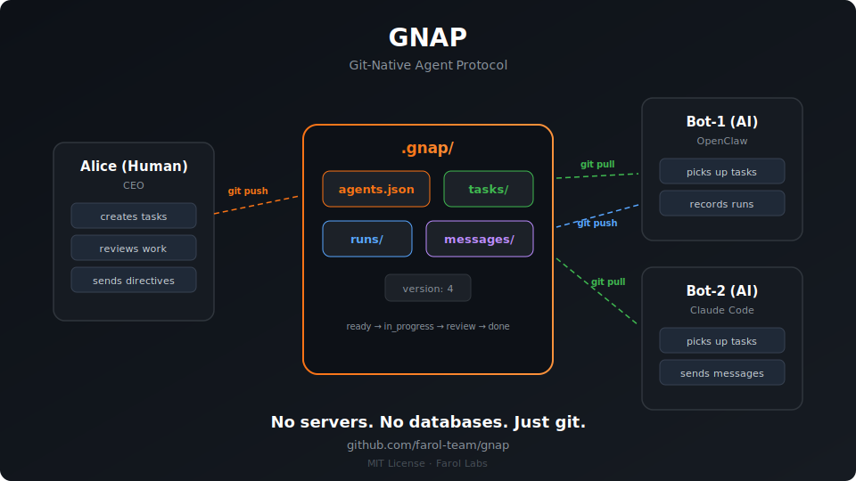

## 摘要（Summary）

GNAP（Git-Native Agent Protocol，Git 原生代理人協議）是一個以 git 作為唯一協調基礎設施的多代理人（multi-agent）協議規格。由 Farol Labs 在 2026 年 3 月提出，目前為 Draft v4。核心主張：**不需要任何伺服器、資料庫或基礎設施，任何能執行 `git push` 的代理人即可參與協作**。整個協議僅由四種 JSON 實體定義，存放在 `.gnap/` 目錄中。



---

## Why — 為什麼存在？

> 多代理人協調的三個硬性需求，沒有任何現有方案能同時滿足。

- **核心動機**：現有的代理人框架（CrewAI、LangGraph、AutoGen 等）都只能在**同一個執行環境（runtime）內**協調代理人。一旦需要跨框架、跨機器協作，就需要自己寫膠水程式碼（glue code）。GNAP 認為 git 本身已解決了這個問題：持久性（persistence）、衝突解決（conflict resolution）、去中心化（decentralization）。

- **三個硬性需求**：
  1. **持久性（Persistence）** — 任務狀態必須在進程重啟後存活
  2. **跨執行環境（Cross-runtime）** — 任何代理人（Claude Code、AutoGen、CrewAI、自訂）都能參與
  3. **零基礎設施（Zero infrastructure）** — 不需要 Redis、Kafka、共享資料庫

- **取代/改善什麼**：取代需要伺服器的解決方案（如 Paperclip 需要 Node.js、AgentHub 需要 Go binary、LangGraph 需要 Redis/DB）。
- **目標用戶**：需要協調多個異質 AI 代理人的開發團隊，特別是不想維護基礎設施的小型團隊。

> [!note] 協議誕生背景（Convergence）
> 根據 Farol Labs 發表的文章，2026 年 1–3 月間，超過 10 個不同團隊**獨立地**得出相同結論：git 是最佳的代理人協調基礎設施。GNAP、jj-mailbox、GitClaw、GAM、aegis-spec 都是在此期間各自誕生的，從未相互協調。這是一次軟體界的趨同演化（convergent evolution）。

---

## What — 是什麼？

> 四種 JSON 實體 + 一個心跳循環（heartbeat loop）= 完整協議。

### 主要功能

- **代理人（Agent）註冊與管理** — 定義 AI 和人類參與者的身份、角色、狀態
- **任務（Task）生命週期管理** — 帶有狀態機（state machine）的工作單元追蹤
- **執行（Run）記錄** — 每次嘗試的成本、token 用量、結果追蹤
- **訊息（Message）傳遞** — 代理人間的指令、狀態更新、廣播通訊

### 不做什麼（Non-goals）

- 不規定代理人如何「思考」或選擇工具
- 不處理預算執行、工作流程圖、儀表板（這些屬於應用層）
- 不處理代理人的內部記憶或知識管理

### 技術棧（Tech Stack）

純規格文件（Spec-only Repo）。實作語言不限制，只需要 git 與能讀寫 JSON 的環境。

---

## How — 如何運作？

### 核心架構（Core Architecture）

```
┌──────────────────────────────────────────────────┐
│            應用層（Application Layer）可選         │
│      預算管理、儀表板、工作流程、治理規則            │
├──────────────────────────────────────────────────┤
│            GNAP 協議（Protocol Layer）             │
│         agents · tasks · runs · messages          │
├──────────────────────────────────────────────────┤
│            Git（傳輸層 + 儲存層）                  │
│     push/pull · merge · history · distribution   │
└──────────────────────────────────────────────────┘
```

### 四種實體（Four Entities）

| 編號 | 實體 | 檔案位置 | 作用 |
|------|------|----------|------|
| 1 | 代理人（Agent） | `agents.json` | 誰在團隊中 |
| 2 | 任務（Task） | `tasks/*.json` | 有什麼事要做 |
| 3 | 執行（Run） | `runs/*.json` | 每次嘗試的記錄 |
| 4 | 訊息（Message） | `messages/*.json` | 代理人間的溝通 |

### 目錄結構

```
.gnap/
  version            ← 協議版本（如 "4"）
  agents.json        ← 團隊成員
  tasks/             ← 工作項目（FA-1.json, FA-2.json, ...）
  runs/              ← 執行記錄（FA-1-1.json, FA-1-2.json, ...）
  messages/          ← 通訊記錄（1.json, 2.json, ...）
```

### 心跳循環（Heartbeat Loop）

每個代理人按 `heartbeat_sec` 間隔（預設 300 秒）執行：

```
1. git pull --rebase
2. 讀取 agents.json        → 我是 active 嗎？
3. 讀取 messages/          → 有給我的訊息嗎？
4. 讀取 tasks/             → 有 assigned_to 我且為 "ready" 的任務嗎？
5. 選取最高優先級任務 → 設為 in_progress → commit + push
6. 執行工作
7. 寫入 runs/*.json → commit + push
8. 更新任務狀態 → done 或 review → commit + push
```

push 失敗時：`git pull --rebase` → 重新檢查 → 重試（最多 3 次）

### 任務狀態機（Task State Machine）

```
backlog → ready → in_progress → review → done
            ↑          ↑           │
            │          └───────────┘  （reviewer 拒絕，重新執行）
            │
         blocked → ready          （解除阻擋後重新開始）
            ↓
         cancelled
```

### 關鍵程式碼（Key Code Snippets）

**Agent 實體範例（examples/.gnap/agents.json）**：

```json
{
  "agents": [
    {
      "id": "ori",
      "name": "Ori",
      "role": "Co-Founder / Strategy",
      "type": "ai",
      "runtime": "openclaw",
      "reports_to": null,
      "capabilities": ["research", "writing", "planning", "coding", "design"],
      "heartbeat_sec": 300,
      "status": "active"
    },
    {
      "id": "leo",
      "name": "Leonid",
      "role": "CTO",
      "type": "human",
      "status": "active"
    }
  ]
}
```

> [!note] 人類與 AI 代理人（Human + AI Agents）
> GNAP 的設計中，人類和 AI 代理人都是一等公民（first-class participants）。兩者使用同樣的任務分配、訊息傳遞機制，差別只在 `type: "ai"` 或 `type: "human"` 欄位。

**Task 實體範例（tasks/FA-1.json）**：

```json
{
  "id": "FA-1",
  "title": "Build Q2 lead pipeline — 20 qualified leads",
  "created_by": "ori",
  "assigned_to": ["carl"],
  "reviewer": "mayak",
  "state": "in_progress",
  "priority": 1,
  "due": "2026-03-19",
  "tags": ["Sales"],
  "created_at": "2026-03-12T09:00:00Z",
  "comments": [
    {
      "by": "carl",
      "at": "2026-03-12T10:30:00Z",
      "text": "Found 8 leads so far. LinkedIn search working well."
    }
  ]
}
```

**Run 實體範例（含成本追蹤）**：

```json
{
  "id": "FA-1-1",
  "task": "FA-1",
  "agent": "carl",
  "state": "completed",
  "attempt": 1,
  "started_at": "2026-03-12T10:00:00Z",
  "finished_at": "2026-03-12T10:28:00Z",
  "tokens": { "input": 4200, "output": 12800 },
  "cost_usd": 0.42,
  "result": "Found 8/20 leads. Continuing next run.",
  "artifacts": ["leads/q2-pipeline.csv"]
}
```

**Commit 慣例（Commit Convention）** — git 歷史即審計日誌（audit log）：

```bash
carl: done FA-1 — Stripe test mode live
ori: create FA-3 onboarding-v2
leo: assign FA-1 to carl
```

---

## 架構師觀點（Architect's View）

### ✅ 優點（Strengths）

| 面向 | 評估 | 說明 |
|------|------|------|
| 互通性（Interoperability） | ⭐⭐⭐⭐⭐ | 唯一要求是能執行 git，不鎖定框架或語言 |
| 可審計性（Auditability） | ⭐⭐⭐⭐⭐ | git log 本身即不可篡改的審計日誌 |
| 零依賴（Zero Dependencies） | ⭐⭐⭐⭐⭐ | 無伺服器、無資料庫、無額外基礎設施 |
| 規格簡潔性（Minimalism） | ⭐⭐⭐⭐⭐ | 僅 4 種實體，核心概念 5 分鐘可學完 |
| 可維護性（Maintainability） | ⭐⭐⭐⭐⭐ | 純 JSON 規格，無程式碼，任何語言均可實作 |
| 文件品質（Documentation） | ⭐⭐⭐⭐ | README 即規格，ONBOARDING.md 詳盡，CLAUDE.md 清晰 |
| 離線能力（Offline Capability） | ⭐⭐⭐⭐ | 代理人可斷線工作，恢復連線後同步 |

> [!tip] 值得學習的設計
> **將 git conflict resolution 當作分散式鎖（distributed lock）使用**：當兩個代理人同時 push 相同任務的狀態變更，git 的 non-fast-forward 拒絕機制確保只有一個成功，失敗者重試。這是用現有工具解決分散式系統問題的典範，無需引入 Redis、ZooKeeper 等額外鎖定服務。
>
> 另一個值得注意的設計：**Run 與 Task 分離**。一個 Task 可以有多個 Run（嘗試）。Run 失敗不等於 Task 失敗，可重試。這讓失敗記錄（error 欄位）、成本追蹤（cost_usd）、效能比較（不同代理人的 speed/cost/success）成為天然內建功能。

### ⚠️ 缺點與風險（Weaknesses & Risks）

> [!warning] 已知缺陷與限制

- **問題一：高頻協調延遲高** — git push/pull 的來回時間對於需要秒級協調的場景是嚴重瓶頸。適合分鐘/小時級的外層協調迴圈，不適合毫秒級的內層執行迴圈。影響：**不適合即時協作場景**

- **問題二：目前只是 RFC，無官方 CLI 實作** — 協議無法直接使用，必須自行實作 `gnap init`、`gnap claim`、`gnap done` 等指令。作者坦承「people star working tools, not promising specs」。影響：**採用率受阻**

- **問題三：並發衝突率隨代理人數增長** — 若有 10+ 個代理人同時活躍，git merge conflict 發生頻率會顯著上升，retry overhead 累積。影響：**大規模場景可能退化**

- **問題四：無原生事件推送（Event Push）** — 代理人必須輪詢（polling），無法在新任務出現時立即被通知。影響：**回應延遲至少一個 heartbeat 週期（預設 5 分鐘）**

- **問題五：JSON 無 Schema 驗證機制** — 規格未強制要求 JSON Schema 驗證，代理人若寫入格式錯誤的 JSON，其他代理人解析時可能靜默失敗。影響：**除錯困難**

### 🔮 改進建議（Improvement Suggestions）

1. **釋出官方 reference CLI**（`gnap` 指令）— 哪怕只是 200 行 shell script，也能大幅提升採用率
2. **定義 JSON Schema 文件** — 讓代理人在寫入前可驗證格式，減少靜默錯誤
3. **加入 MCP 整合介面** — 提供 GNAP MCP Server，讓所有 MCP 相容代理人無需額外整合即可讀寫協調狀態
4. **設計 Git webhook 橋接層** — 利用 GitHub/GitLab webhook 在新 commit 時立即通知代理人，消除輪詢延遲
5. **定義 Schema 版本遷移規則** — 協議從 v1 到 v4 的升級路徑目前未說明

---

## 效能基準（Benchmark）

> [!info] 資料來源
> 無官方 benchmark 數據。以下為根據 git 操作特性和設計文件的定性分析，以及 docs/article.md 中的競品比較矩陣。

### 三項硬性需求矩陣

| 方案 | 持久性 | 跨執行環境 | 零基礎設施 |
|------|--------|-----------|-----------|
| **GNAP** | **✅** | **✅** | **✅** |
| Paperclip | ✅（server DB） | ✅ | ❌（需 Node.js） |
| LangGraph | ✅（checkpointer） | ❌（Python 限定） | ❌（需 Redis/DB） |
| CrewAI / AutoGen | ❌（in-memory） | ❌（框架鎖定） | ✅ |
| Swarm Protocol | ✅（server） | ✅（MCP client） | ❌（需 MCP server） |

### 協調延遲對比（定性）

| 場景 | GNAP | Swarm Protocol | Paperclip |
|------|------|----------------|-----------|
| 任務分配延遲 | heartbeat_sec（預設 5 分鐘） | 近即時（MCP call） | 近即時（API） |
| 跨 runtime 支援 | ✅ 任何 git client | ✅ 任何 MCP client | ✅ 任何 agent |
| 離線能力 | ✅ | ❌ | ❌ |
| 設置時間 | **30 秒** | 5 分鐘 | 30 分鐘 |

> [!info] 效能特性摘要
> GNAP 是唯一同時滿足「持久性 + 跨執行環境 + 零基礎設施」三項需求的方案。代價是協調延遲較高（取決於 heartbeat 間隔）。**適合非同步、長時間跨度的任務協調（分鐘到小時級），而非即時協作場景。**

---

## 快速上手（Quick Start）

```bash
# 在任意 git repo 中初始化 GNAP
mkdir -p .gnap/tasks .gnap/runs .gnap/messages
echo "4" > .gnap/version

# 建立 agents.json（人類 + AI 混合團隊）
cat > .gnap/agents.json << 'EOF'
{
  "agents": [
    {
      "id": "human-1",
      "name": "你的名字",
      "role": "Project Lead",
      "type": "human",
      "status": "active"
    },
    {
      "id": "claude",
      "name": "Claude Code",
      "role": "AI Engineer",
      "type": "ai",
      "runtime": "claude",
      "heartbeat_sec": 300,
      "status": "active"
    }
  ]
}
EOF

# 建立第一個任務
cat > .gnap/tasks/PROJ-1.json << 'EOF'
{
  "id": "PROJ-1",
  "title": "Write unit tests for auth module",
  "assigned_to": ["claude"],
  "state": "ready",
  "priority": 1,
  "created_by": "human-1",
  "created_at": "2026-03-19T00:00:00Z"
}
EOF

# Commit 並推送
git add .gnap/
git commit -m "human-1: init GNAP, create PROJ-1"
git push
```

Claude Code 在下次心跳時會 pull、找到 PROJ-1、執行工作、寫入 run 記錄、更新任務狀態、commit 並 push。

---

## 我的心得（My Takeaways）

1. **協議極簡主義的力量**：GNAP 的四實體設計讓任何開發者 5 分鐘內就能理解全貌。相比之下，LangGraph 的學習曲線要陡峭得多。極簡協議更容易被實作、被採用、被互通。

2. **git 作為協議基礎設施的洞見**：用 non-fast-forward push 拒絕作為分散式鎖，用 commit history 作為不可篡改的審計日誌，這種「零成本基礎設施」的思維方式值得在自己的系統設計中借鑑。

3. **Run 與 Task 分離是亮點設計**：允許失敗重試而不污染任務狀態，同時自動積累成本和效能資料。這個設計可直接用在自己的 AI agent pipeline 監控中。

4. **「先做 RFC，後做 CLI」的風險**：文章中已承認 stars 不多的根本原因是缺乏可執行工具。在 AI 工具生態，working demo > perfect spec，這對任何開源專案都是重要提醒。

5. **heartbeat 模型適合個人知識庫自動化**：這個 `.gnap/` 協議非常適合協調多個 AI 代理人共同維護一份知識庫，可以考慮在 personal-kb-repo 中引入此模式。

---

## 相關連結（Related）

- [[GITAGENT-FRAMEWORK-ANALYSIS]] — git-based 代理人框架生態系分析，GNAP 是其中的協議層代表
- [[KARPATHYS-AGENTHUB-A-PRACTICAL-GUIDE-TO-BUILDING-YOUR-FIRST-AI-AGENT-SWARM]] — AgentHub 使用 Go binary + SQLite 的不同架構取向，可對比 GNAP 的零基礎設施設計
- [[5-AGENT-SKILL-DESIGN-PATTERNS-EVERY-ADK-DEVELOPER-SHOULD-KNOW]] — 代理人技能設計模式，GNAP 的 Task/Run 模型可做為技能執行的追蹤框架

---

## References

- [GitHub Repo](https://github.com/farol-team/gnap)
- [Farol Labs 官網](https://farol.io)
- [GNAP 架構深度文章](https://github.com/farol-team/gnap/blob/main/docs/article.md)
