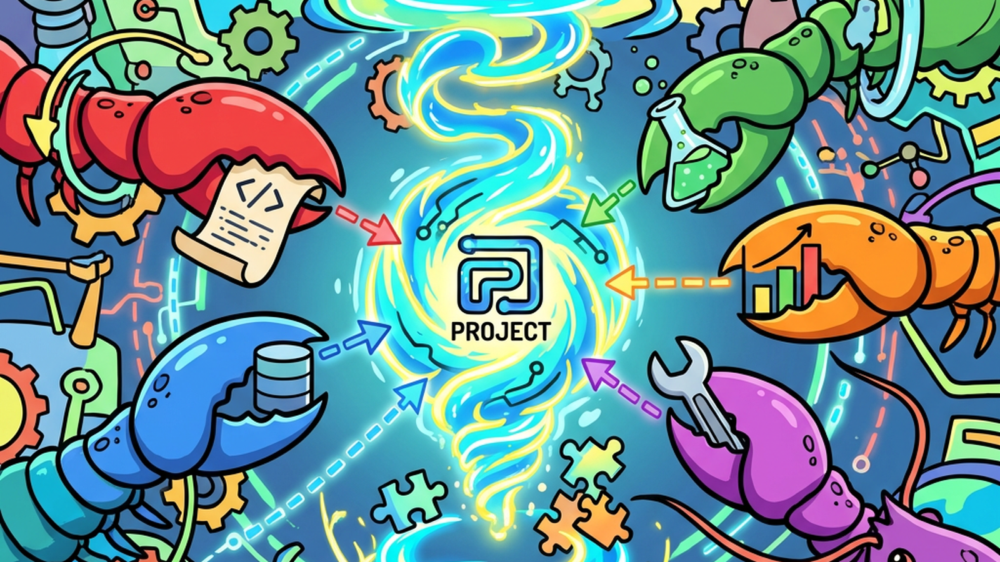
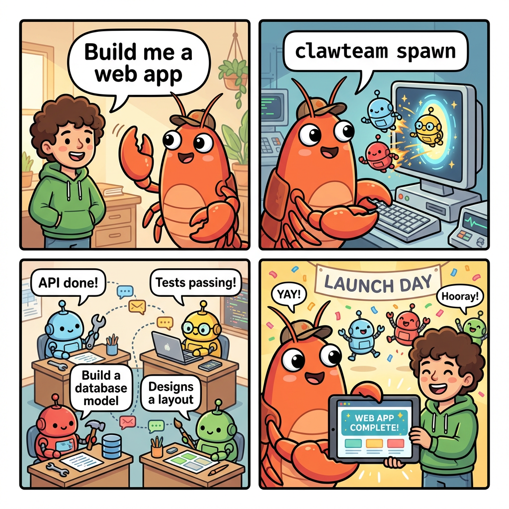
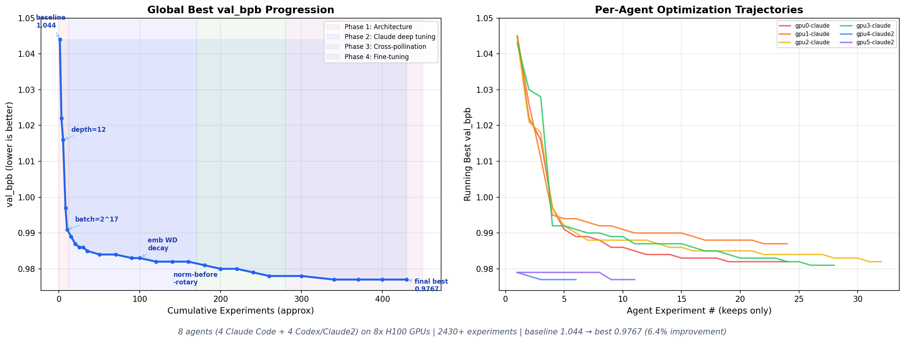

## 摘要（Summary）

ClawTeam 是一個**框架無關（framework-agnostic）的多代理協調命令列介面（CLI）**，讓 AI 代理（Agent）能自我組織成群體（Swarm），在隔離的 git 工作樹（worktree）中並行執行任務，透過共享的 JSON 檔案通訊，無需資料庫或雲端基礎設施。

> [!note] 核心理念
> 不是「人類協調 AI 代理」，而是「AI 代理自行協調其他 AI 代理」。Leader Agent 透過 `clawteam` CLI 指令生成 Worker Agent，分配任務，監控進度，最後合併成果。

版本 v0.2.0 | Python 3.10+ | MIT 授權 | 3,819 ⭐

---

## Why — 為什麼存在？

現有 AI 代理（如 Claude Code、Codex）功能強大，但**各自孤立運作**。面對複雜任務，你必須手動協調多個代理、管理上下文、拼接碎片化結果。

ClawTeam 解決的核心問題：

- **複雜任務分解**：一個全端應用程式需要前後端、資料庫、測試四個子任務同時進行
- **跨代理隔離**：每個代理有自己的 git worktree，不會互相衝突
- **通訊協議**：代理之間透過收件匣（Inbox）傳遞訊息，不依賴特定框架
- **可觀察性**：監看板（Board）讓你同時看到所有代理的工作狀態

| | ClawTeam | 其他多代理框架 |
|---|---------|--------------|
| 🎯 **使用者** | AI 代理本身 | 人類撰寫協調程式碼 |
| ⚡ **設定** | `pip install` + 給 Leader 一個提示 | Docker、雲端 API、YAML 設定 |
| 🏗️ **基礎設施** | 只需檔案系統和 tmux | Redis、訊息佇列、資料庫 |
| 🤖 **代理支援** | 任何 CLI 代理 | 特定框架專用 |
| 🌳 **隔離** | Git worktrees | 容器或虛擬環境 |

---

## What — 是什麼？

- **主要功能**：
  - 代理生成（Spawn）：以 tmux 視窗或子程序（subprocess）啟動代理
  - 任務看板（Task Board）：pending → in_progress → completed，支援依賴鏈（blocked-by）
  - 收件匣（Inbox）：點對點傳訊（send/receive/peek）+ 廣播（broadcast）
  - 工作區隔離（Workspace）：自動建立 git worktree，分支命名 `clawteam/{team}/{agent}`
  - 監看板（Board）：終端機看板 / 自動刷新 / 貼磚 tmux 視圖 / Web UI
  - 模板（Templates）：TOML 定義的團隊原型，一行指令啟動完整團隊
  - MCP 伺服器（MCP Server）：`clawteam-mcp` 供 MCP 客戶端使用
  - 協調提示注入（Coordination Prompt Injection）：自動注入到每個生成的代理

- **不做什麼（Non-goals）**：
  - 不管理 AI 模型本身（模型選擇由各代理 CLI 決定）
  - 不提供 UI 設計能力（只協調，不執行）
  - 不處理代理內部的對話記憶

- **技術棧（Tech Stack）**：Python 3.10+、Typer（CLI）、Pydantic（資料驗證）、Rich（終端機 UI）、MCP（Model Context Protocol）、ZeroMQ（P2P 傳輸，選用）

---

## How — 如何運作？

### 系統架構圖（System Architecture）

```
┌─────────────────────────────────────────────────────────────────┐
│                        使用者（Human）                            │
│              一個目標 → Leader Agent 承接                         │
└────────────────────────────┬────────────────────────────────────┘
                             │ clawteam team spawn-team
                             ▼
┌────────────────────────────────────────────────────────────────┐
│  🦞 Leader Agent（任意 CLI Agent: Claude / Codex / ...）         │
│                                                                 │
│  使用 clawteam CLI 指令協調：                                     │
│  • clawteam spawn         → 生成 Worker                         │
│  • clawteam task create   → 建立任務                             │
│  • clawteam inbox send    → 傳訊                                 │
│  • clawteam board show    → 監看                                 │
│  • clawteam workspace merge → 合併結果                           │
└──────────┬─────────────────┬──────────────────────┬────────────┘
           │ spawn           │ spawn                │ spawn
           ▼                 ▼                      ▼
┌──────────────┐   ┌──────────────┐      ┌──────────────┐
│ 🤖 Worker A  │   │ 🤖 Worker B  │      │ 🤖 Worker C  │
│ git worktree │   │ git worktree │      │ git worktree │
│ tmux window  │   │ tmux window  │      │ tmux window  │
│              │   │              │      │              │
│ 自動注入提示: │   │ 自動注入提示: │      │ 自動注入提示: │
│ task list    │   │ task list    │      │ task list    │
│ task update  │   │ task update  │      │ task update  │
│ inbox send   │   │ inbox send   │      │ inbox send   │
└──────┬───────┘   └──────┬───────┘      └──────┬───────┘
       │                  │                     │
       └──────────────────┴─────────────────────┘
                          │
                          ▼
             ┌─────────────────────────┐
             │      ~/.clawteam/       │
             │  teams/{name}/          │
             │  ├── config.json        │
             │  └── inboxes/{agent}/   │
             │  tasks/{name}/*.json    │
             │  workspaces/ (worktrees)│
             └─────────────────────────┘
```



### 執行流程圖（Execution Flowchart）

```
 Human: "Build full-stack app"
   │
   ▼
Leader Agent 收到任務
   │
   ├── clawteam team spawn-team webapp
   │     └── 寫入 ~/.clawteam/teams/webapp/config.json
   │
   ├── clawteam task create × 5（含 --blocked-by 依賴鏈）
   │     └── 寫入 ~/.clawteam/tasks/webapp/*.json
   │
   ├── clawteam spawn × 5（每個 Worker）
   │     ├── 建立 git worktree → branches/clawteam/webapp/{agent}
   │     ├── 啟動 tmux window（session: clawteam-webapp）
   │     ├── 自動確認 workspace trust prompt
   │     └── 注入 Coordination Prompt（identity + task + protocol）
   │
   ├── Worker 們並行執行：
   │     ├── clawteam task update <id> --status in_progress
   │     ├── ... 實際工作 ...
   │     ├── git commit（在自己的 worktree）
   │     └── clawteam task update <id> --status completed
   │           └── 自動解除被此任務阻擋的下游任務（auto-unblock）
   │
   ├── Leader 監看：
   │     ├── clawteam board show webapp
   │     ├── clawteam inbox receive webapp
   │     └── 依狀況再分配任務或終止代理
   │
   └── 完成後：
         ├── clawteam workspace merge webapp {agent}
         └── clawteam team cleanup webapp
```

### 時序圖：spawn 代理詳細流程（Sequence Diagram）

```
Leader       TmuxBackend          tmux            Worker CLI
  │               │                 │                  │
  │─spawn()──────►│                 │                  │
  │               │─build_env_vars  │                  │
  │               │                 │                  │
  │               │─new-session────►│                  │
  │               │                 │─export env vars──►│
  │               │                 │─cd worktree dir──►│
  │               │                 │─launch CLI───────►│ 啟動
  │               │                 │                  │
  │               │─poll pane───────►│                  │
  │               │◄─pane visible───│                  │
  │               │                 │                  │
  │               │─capture-pane────►│                  │
  │               │◄─check trust────│                  │
  │               │   prompt?       │                  │
  │               │─send Enter──────►│─────────────────►│ 確認 trust
  │               │                 │                  │
  │               │─wait for CLI────►│                  │
  │               │◄─ready (❯ prompt)│                 │
  │               │                 │                  │
  │               │─load-buffer────►│                  │
  │               │─paste-buffer───►│──Coordination────►│ 注入提示
  │               │                 │   Prompt         │
  │               │─register_agent()│                  │
  │◄─"spawned"────│                 │                  │
```



### 關鍵設計決策（Key Design Decisions）

> [!note] 設計模式（Design Pattern）
> **檔案即訊息匯流排（File as Message Bus）**：所有狀態（任務、收件匣、設定）都是 `~/.clawteam/` 下的 JSON 檔案，原子寫入（mkstemp + rename）確保崩潰安全性。這是刻意選擇的最小基礎設施策略。

1. **Coordination Prompt 自動注入**：Worker 不需要學習 ClawTeam，生成時自動收到完整的協調協議說明（`spawn/prompt.py:build_agent_prompt()`）
2. **tmux 作為預設後端**：讓代理在可視化的互動介面運行，便於除錯和監看
3. **框架無關性**：只要代理 CLI 能跑在 tmux 裡、能接受初始提示，就能加入團隊
4. **路徑安全（Path Safety）**：`paths.py:ensure_within_root()` 防止路徑穿越（path traversal）攻擊
5. **雙傳輸模式**：預設 file transport（單機），選用 ZeroMQ P2P（跨機器，自動 fallback）

### 資料流（Data Flow）

1. Leader 呼叫 `clawteam spawn` → `cli/commands.py` → `spawn/tmux_backend.py:TmuxBackend.spawn()`
2. `TmuxBackend` 設定環境變數（`CLAWTEAM_AGENT_ID`, `CLAWTEAM_TEAM_NAME` 等）
3. 建立 git worktree（`workspace/`），tmux 新視窗，注入 coordination prompt
4. `spawn/registry.py:register_agent()` 持久化 spawn 資訊
5. Worker 執行 `clawteam task list` → `team/tasks.py` 讀取 `~/.clawteam/tasks/{team}/*.json`
6. Worker 執行 `clawteam inbox send` → `team/mailbox.py` 寫入 `~/.clawteam/teams/{team}/inboxes/{agent}/`
7. Leader 執行 `clawteam board show` → `board/renderer.py` 彙整所有狀態輸出

---

## 安裝流程（Installation Flow）

### 安裝觸發方式

```
pip install clawteam
  → hatchling 打包工具解析 pyproject.toml
  → 安裝 Python 套件到 site-packages
  → 建立 entry points 腳本
  → 無 postinstall script（不預先建立 ~/.clawteam/）
```

### 安裝時序圖

```
用戶        pip/hatchling      Python site-packages     PATH
  │               │                    │                  │
  │─pip install──►│                    │                  │
  │               │─解析 pyproject─────►│                  │
  │               │─安裝依賴────────────►│                  │
  │               │  typer, pydantic   │                  │
  │               │  rich, questionary │                  │
  │               │  mcp               │                  │
  │               │─安裝 clawteam 套件──►│ site-packages/   │
  │               │                    │   clawteam/      │
  │               │─建立 entry points──►│                 ►│ ~/.local/bin/clawteam
  │               │                    │                 ►│ ~/.local/bin/clawteam-mcp
  │◄──安裝完成────│                    │                  │
  │               │                    │                  │
  │─clawteam team spawn-team ─────────────────────────────►│
  │               │    （首次執行時 lazy 建立 ~/.clawteam/）   │
```

> [!important] 懶惰初始化（Lazy Init）
> `~/.clawteam/` 目錄**不在安裝時建立**，而是在第一次執行 `clawteam team spawn-team` 時由 `team/manager.py:TeamManager.create_team()` 建立。

### 安裝產物清單

| 路徑 | 類型 | 用途 |
|------|------|------|
| `{site-packages}/clawteam/` | 目錄 | Python 套件本體 |
| `~/.local/bin/clawteam` | 可執行檔 | 主 CLI 入口（`clawteam.cli.commands:app`） |
| `~/.local/bin/clawteam-mcp` | 可執行檔 | MCP 伺服器（`clawteam.mcp.server:main`） |
| `~/.clawteam/config.json` | 檔案（lazy）| 全域設定（首次 `config set` 時建立） |
| `~/.clawteam/teams/{name}/` | 目錄（lazy）| 每個團隊的設定與收件匣 |
| `~/.clawteam/tasks/{name}/` | 目錄（lazy）| 每個團隊的任務 JSON 檔案 |
| `~/.clawteam/workspaces/` | 目錄（lazy）| Git worktrees 根目錄 |

### 環境變數

| 變數名 | 預設值 | 設定時機 | 說明 |
|--------|--------|---------|------|
| `CLAWTEAM_DATA_DIR` | `~/.clawteam` | 執行時 | 資料目錄根路徑 |
| `CLAWTEAM_TRANSPORT` | `file` | 執行時 | `file` 或 `p2p` |
| `CLAWTEAM_WORKSPACE` | `auto` | 執行時 | `auto`/`always`/`never` |
| `CLAWTEAM_DEFAULT_BACKEND` | `tmux` | 執行時 | `tmux` 或 `subprocess` |
| `CLAWTEAM_SKIP_PERMISSIONS` | `true` | 執行時 | 自動確認 Claude 工具權限 |
| `CLAWTEAM_AGENT_ID` | — | spawn 時自動注入 | Worker 的唯一識別碼 |
| `CLAWTEAM_AGENT_NAME` | — | spawn 時自動注入 | Worker 的邏輯名稱 |
| `CLAWTEAM_TEAM_NAME` | — | spawn 時自動注入 | 所屬團隊名稱 |
| `CLAWTEAM_WORKSPACE_DIR` | — | spawn 時自動注入 | Worker 的 git worktree 路徑 |

> [!warning] 解除安裝清理
> `pip uninstall clawteam` 只移除 Python 套件，**不會清理** `~/.clawteam/` 目錄（包含所有狀態資料）。如需完整清理需手動執行 `rm -rf ~/.clawteam`。

---

## 使用案例地圖（Use Case Map）

### 案例總覽

| # | 使用案例 | 觸發方式 | 入口檔案 | 核心模組鏈 |
|---|---------|---------|---------|----------|
| 1 | 建立團隊 | `clawteam team spawn-team` | `cli/commands.py` | `team/manager.py` → `~/.clawteam/teams/` |
| 2 | 生成 Worker | `clawteam spawn tmux claude` | `cli/commands.py` | `spawn/tmux_backend.py` → `git worktree` → `tmux` |
| 3 | 任務管理 | `clawteam task create/update` | `cli/commands.py` | `team/tasks.py` → `~/.clawteam/tasks/` |
| 4 | 代理通訊 | `clawteam inbox send/receive` | `cli/commands.py` | `team/mailbox.py` → `~/.clawteam/teams/{t}/inboxes/` |
| 5 | 監看面板 | `clawteam board show/serve` | `cli/commands.py` | `board/renderer.py` + `board/server.py` |
| 6 | 模板啟動 | `clawteam launch hedge-fund` | `cli/commands.py` | `templates/` → `team/manager.py` → `spawn/` |

### 案例詳解

#### 案例 1：建立團隊（spawn-team）

```
用戶（或 Leader Agent）: clawteam team spawn-team my-team -d "..." -n leader
  │
  ▼
cli/commands.py: team_spawn_team()
  │
  ├── validate_identifier(name, "team name")    ← paths.py
  ├── validate_identifier(leader_name)
  │
  ▼
team/manager.py: TeamManager.create_team()
  │
  ├── 寫入 ──► ~/.clawteam/teams/my-team/config.json
  │              {name, description, lead_agent_id, members}
  │
  ├── 建立 ──► ~/.clawteam/teams/my-team/inboxes/leader/
  │
  └── 建立 ──► ~/.clawteam/tasks/my-team/   （空目錄）
```

#### 案例 2：生成 Worker（spawn with tmux）

```
Leader Agent: clawteam spawn tmux claude --team my-team --agent-name alice --task "..."
  │
  ▼
cli/commands.py: spawn()
  │
  ├── spawn/sessions.py: build_spawn_context()   ← 解析 backend, command
  ├── spawn/prompt.py: build_agent_prompt()       ← 建立協調提示
  │
  ▼
spawn/tmux_backend.py: TmuxBackend.spawn()
  │
  ├── 設定環境變數（CLAWTEAM_AGENT_ID, CLAWTEAM_TEAM_NAME, ...）
  │
  ├── 建立 git worktree ──► {repo}/branches/clawteam/my-team/alice/
  │
  ├── tmux new-session / new-window "clawteam-my-team:alice"
  │
  ├── _confirm_workspace_trust_if_prompted()   ← 自動確認 trust 對話框
  │
  ├── _wait_for_cli_ready()                    ← 偵測 ❯ 或 > 提示符
  │
  ├── _inject_prompt_via_buffer()              ← load-buffer + paste-buffer
  │
  └── spawn/registry.py: register_agent()     ← 持久化 spawn 資訊
```

#### 案例 3：任務自動解除阻擋（auto-unblock）

```
Worker B: clawteam task update my-team T2 --status completed
  │
  ▼
cli/commands.py: task_update()
  │
  ▼
team/tasks.py: update_task_status()
  │
  ├── 讀取 ~/.clawteam/tasks/my-team/T2.json
  ├── 更新 status: "completed"
  ├── atomic_write_text() → 寫回
  │
  └── 掃描所有 blocked 任務，找出 blocked_by 包含 T2 的任務
        ├── T5 blocked by [T2, T3, T4]
        ├── T2 完成，還剩 [T3, T4] 未完成 → T5 仍 blocked
        └── 若 T3, T4 也完成 → T5 自動改為 pending
```

#### 案例 4：模板啟動完整團隊（launch）

```
用戶: clawteam launch hedge-fund --team fund1 --goal "Analyze AAPL..."
  │
  ▼
cli/commands.py: launch()
  │
  ▼
templates/__init__.py: load_template("hedge-fund")
  │  讀取 ──► clawteam/templates/hedge-fund.toml
  │           {roles: [portfolio-manager, buffett-analyst, ...],
  │            tasks: [...], spawn_sequence: [...]}
  │
  ├── team/manager.py: create_team()          ← 建立團隊
  │
  └── 依序執行 spawn：
        ├── TmuxBackend.spawn(portfolio-manager, ...)
        ├── TmuxBackend.spawn(buffett-analyst, ...)
        ├── TmuxBackend.spawn(growth-analyst, ...)
        └── ... 共 7 個 Agent
```

> [!note] 閱讀建議
> 若要快速理解「spawn 時到底發生了什麼」，從 `spawn/tmux_backend.py:TmuxBackend.spawn()` 讀起最直接——這是所有 Agent 生成的核心路徑。

---

## 架構師觀點（Architect's View）

### ✅ 優點（Strengths）

| 面向 | 評估 | 說明 |
|------|------|------|
| 可維護性（Maintainability） | ⭐⭐⭐⭐ | 模組清楚分層（cli/team/spawn/board），職責單一 |
| 可擴展性（Scalability） | ⭐⭐⭐⭐ | SpawnBackend 抽象基類讓新後端易於加入 |
| 測試覆蓋（Test Coverage） | ⭐⭐⭐⭐ | 31 個測試檔案，覆蓋各子系統 |
| 文件品質（Documentation） | ⭐⭐⭐⭐⭐ | README 詳盡，附真實案例 |
| 依賴管理（Dependency Management） | ⭐⭐⭐⭐ | 依賴精簡，選用功能（P2P）分 extras |

> [!tip] 值得學習的設計
> **協調提示自動注入**（`spawn/prompt.py`）是最聰明的架構決策：Worker 代理不需要安裝特殊 SDK 或知道 ClawTeam 存在，生成時自動收到完整的行為協議。這讓框架真正做到「任何 CLI 代理皆可加入」。

### ⚠️ 缺點與風險（Weaknesses & Risks）

> [!warning] 已知限制
> - **tmux 依賴**：預設後端需要 tmux，在 CI/CD 環境或 Windows 上有限制
> - **檔案系統瓶頸**：大量代理同時操作時，JSON 檔案 I/O 可能成為瓶頸
> - **單機為主**：P2P 模式是早期功能，跨機器穩定性未充分驗證

- **問題一**：`clawteam spawn` 的 workspace trust 偵測依賴 tmux pane 的文字內容，若 CLI 更新介面則需同步維護 — 影響：新版本代理可能無法自動確認
- **問題二**：`~/.clawteam/` 沒有 TTL 或自動清理機制，長期使用會累積大量過期狀態 — 影響：需手動執行 `team cleanup`
- **問題三**：Worker 的協調提示包含硬編碼的 ClawTeam 指令，若用戶使用非 bash shell 可能有相容性問題

### 🔮 改進建議（Improvement Suggestions）

1. 加入 `clawteam gc`（garbage collect）指令，自動清理超過 N 天的過期團隊資料
2. 將 workspace trust 偵測邏輯做成可設定的 pattern 清單，方便跟上各 CLI 的介面變化
3. 提供 `--dry-run` 模式讓 Worker 在正式執行前先確認 spawn 指令的完整性

---

## 效能基準（Benchmark）

> [!info] 實際案例數據
> 來源：README 中記錄的真實 ML 研究案例

| 場景 | 數據 |
|------|------|
| ML 研究自動化（8 代理 × 8 H100 GPU） | val_bpb: 1.044 → 0.977（6.4% 改善）|
| 自動化實驗數量 | 2430+ 次 |
| 消耗 GPU 算力 | ~30 GPU 小時 |
| 人工介入次數 | 0（完全自動） |



---

## 快速上手（Quick Start）

```bash
# 1. 安裝
pip install clawteam

# 2. 確認依賴
tmux -V
clawteam --help

# 3. 建立團隊（你當 Leader）
clawteam team spawn-team my-team -d "Build auth module" -n leader

# 4. 生成 Worker 代理
clawteam spawn --team my-team --agent-name alice --task "Implement OAuth2"
clawteam spawn --team my-team --agent-name bob   --task "Write unit tests"

# 5. 監看所有代理
clawteam board attach my-team

# 6. 讓 AI Agent 自行驅動（推薦）
# 將 skills/clawteam/ 複製到 ~/.claude/skills/clawteam/
# 然後告訴 Claude Code：
# "Build a full-stack app. Use clawteam to split the work."
```

---

## 我的心得（My Takeaways）

1. **「CLI 即協議」的設計哲學**：ClawTeam 選擇讓代理透過 CLI 指令溝通，而不是透過 SDK 或 API。這讓框架完全不綁定特定 AI 平台，任何能執行 shell 指令的代理都能加入。

2. **最小基礎設施原則**：tmux + 檔案系統 = 完整的多代理協調基礎設施。沒有 Redis、沒有 Docker、沒有雲端依賴。這是一個值得學習的「minimum viable infrastructure」設計範本。

3. **自動注入 vs 手動整合**：協調提示自動注入讓 ClawTeam 做到「透明整合」——Worker 代理甚至不需要知道自己在 ClawTeam 中運作。對比 oh-my-claudecode 的明確 Skill 注入方式，這是另一種不同的整合策略。

---

## 待補充（Open Questions）

- ClawTeam 的 JSON 檔案訊息匯流排在真實網路（多台機器、雲端執行環境）下要如何橫向擴展？ZeroMQ P2P 模式的成熟度與容錯能力是否足夠生產環境使用？（建議搜尋：`clawteam p2p zeromq distributed multi-machine`）
- Leader Agent 本身若崩潰，Worker 任務狀態與 Inbox 是否能自動恢復？`~/.clawteam/` 的容錯設計有無 WAL 或 journal 機制？（建議搜尋：`clawteam crash recovery fault tolerance`）
- 協調提示（Coordination Prompt）注入會消耗多少 context window？當 Worker 代理同時持有大量 SKILL.md 與 ClawTeam 協調指令時，context budget 如何分配？（建議搜尋：`clawteam context window budget skill injection`）
- Worker 之間只能透過 Leader 傳遞訊息，有沒有方式讓 Worker 直接點對點協作？目前 inbox 的 broadcast 功能是否足以支援 Peer-to-Peer 協作模式？（建議搜尋：`clawteam worker-to-worker direct communication`）
- ClawTeam 如何處理「任務完成品質不佳」的情況？Leader 目前是否有重試（retry）或任務回退（rollback）機制？（建議搜尋：`clawteam task retry rollback quality check`）
- git worktree 的 merge 策略若多個 Worker 修改了同一支檔案，衝突解決由誰負責？`workspace merge` 指令的內部邏輯是什麼？（建議搜尋：`clawteam workspace merge conflict resolution`）

## 相關連結（Related）

- [[2026-01-09-OH-MY-CLAUDECODE-MULTI-AGENT-ORCHESTRATION]] — 同樣解決 Claude Code 多代理問題，但方向相反：OMC 是增強單一 Claude 的能力，ClawTeam 是協調多個獨立代理
- [[CLAUDE-CODE-SKILLS-ARCHITECTURE]] — ClawTeam 以 Skill 文件注入協調知識的方式與此概念直接相關
- [[MULTI-AGENT-COORDINATION-PATTERNS]] — ClawTeam 的收件匣模型是 Actor Model 的輕量實作

## References

- [GitHub Repo](https://github.com/HKUDS/ClawTeam)
- [ROADMAP.md](https://github.com/HKUDS/ClawTeam/blob/main/ROADMAP.md)
- [ClawTeam Skill（代理使用手冊）](https://github.com/HKUDS/ClawTeam/blob/main/skills/clawteam/SKILL.md)
- [AutoResearch 實際案例](https://github.com/novix-science/autoresearch)

## 知識層次分析（Bloom's Taxonomy Analysis）

> 以下從五個認知層次對本篇內容進行結構化分析，協助從記憶到評估逐層深化理解。

| 認知層次 | 核心目的 | 對本文的具體應用 |
|---------|---------|--------------|
| **記憶（被動）** | 確認資訊存在，單純資訊檢索，確立基礎知識 | 協調提示自動注入（spawn/prompt.py）；任務自動解除阻擋（auto-unblock）；lazy init（~/.clawteam/ 首次執行時建立）；7 個 TOML 模板環境變數；clawteam-mcp MCP 伺服器；雙傳輸模式（file / P2P ZeroMQ）；懶惰初始化設計；3,819 顆 GitHub Stars；6 個核心使用案例 |
| **理解（半被動）** | 解釋概念的含義及關聯，串聯知識點，掌握核心邏輯 | 2026-03-18 版本相較 2026-03-17 版本深入解析了安裝流程（hatchling 打包 → lazy init）、使用案例地圖（6 個案例的完整調用鏈）和 MCP 伺服器整合（clawteam-mcp）。核心架構理念一致：「CLI 即協議、檔案即訊息匯流排、框架無關性」。Coordination Prompt 讓 Worker 無需知道 ClawTeam 存在就能遵守協調規則，這是「透明整合」的最佳實踐。 |
| **分析（主動）** | 檢驗論點、拆解流程、找出假設，批判性思維 | ①`pip uninstall clawteam` 不清理 `~/.clawteam/`，假設「使用者知道需要手動清理」，但對初學者而言這是隱藏的狀態遺留問題；②TOML 模板（hedge-fund.toml）的 spawn_sequence 依序啟動代理人，假設後一個代理人在前一個完全就緒後才接收任務，但 `_wait_for_cli_ready()` 的輪詢機制不保證嚴格的 happens-before 關係；③MCP 伺服器（clawteam-mcp）讓 MCP 客戶端可以管理 ClawTeam，但這個「代理人控制代理人協調器」的二層架構增加了故障排查複雜度 |
| **應用（主動）** | 將知識套用情境，規劃執行方案 | ①用 `clawteam launch hedge-fund` 一鍵啟動金融分析團隊，驗證多代理人並行分析的效果；②為個人常用場景（全端開發、文件撰寫、安全審查）建立自訂 TOML 模板；③通過 clawteam-mcp 讓 Claude Code 本身可以動態調度 ClawTeam 任務，實現 AI 自驅動的多層協調 |
| **評估（主動）** | 判斷多個方案的優劣，進行決策和權衡 | 相較 2026-03-17 版本，此版本更完整地揭示了安裝產物（entry points / lazy init）和環境變數設計，讓部署場景更清晰。MCP 伺服器整合是相對於 oh-my-claudecode 的架構優勢，後者的 MCP 工具伺服器是單點瓶頸，ClawTeam 的 MCP 是可選整合。然而兩個版本筆記的重疊度較高，建議合併為單一筆記。 |

### 分析型追問（Socratic Follow-up）

> 以下問題供進一步反思，可用來與 AI 展開蘇格拉底式對話：

- **澄清**：`clawteam-mcp` 的 MCP 伺服器讓 MCP 客戶端可以呼叫 `clawteam` CLI 指令，但 MCP 客戶端（如 Claude Code）通常在沙盒環境中運行。MCP 伺服器如何傳遞 `CLAWTEAM_SKIP_PERMISSIONS=true` 等環境變數，確保生成的代理人能自動確認 trust prompt？
- **假設**：環境變數 `CLAWTEAM_SKIP_PERMISSIONS=true` 假設所有 Worker 的操作都可以無需人工確認。但若 Worker 執行的任務包含潛在破壞性操作（刪除舊代碼、重構核心模組），這個假設是否創造了非預期的安全風險？
- **證據**：ML 研究案例（2430+ 次實驗，val_bpb 1.044 → 0.977）中，ClawTeam 的協調開銷（框架本身）在 30 GPU-hours 中佔多少比例？有無對照組（相同任務，手動協調）的效率比較？
- **觀點**：從 DevOps 工程師的角度，`~/.clawteam/` 的懶惰初始化設計讓使用者無法在安裝後立即驗證配置是否正確（需要執行 spawn-team 才能確認）。`omc doctor` 這種安裝診斷工具對 ClawTeam 是否同樣必要？
- **後果**：若 Leader Agent 在 spawn 多個 Worker 後崩潰，`~/.clawteam/teams/{team}/` 目錄和 git worktrees 都已建立但沒有人負責協調。Worker 會持續執行已分配的任務，但結果無人收集。這個「孤兒 Worker」場景如何偵測和清理？

### 方案批判三問（Critical Evaluation）

> [!warning] 適用於技術方案類內容

1. **最大的風險是什麼？** — `CLAWTEAM_SKIP_PERMISSIONS=true` 環境變數自動確認所有 Claude Code 的 workspace trust 和工具使用權限，結合 `clawteam launch hedge-fund` 一鍵啟動 7 個 Agent 的設計，創造了一個「完全自動化但零監督的多代理人執行環境」。若任何一個 Worker 的 Coordination Prompt 被意外篡改或受到 prompt injection 影響，7 個代理人都會在無人值守的情況下執行任意操作，且沒有任何攔截機制。
2. **什麼情況下會失敗？** — ①git worktree 的目標分支（`clawteam/{team}/{agent}`）若與現有分支名稱衝突，`git worktree add` 失敗，但 ClawTeam 可能繼續嘗試注入 prompt，Worker 在錯誤的目錄中執行任務；②`clawteam workspace merge` 在多個 Worker 修改相同檔案的情況下需要人工解決衝突，若在自動化 TOML 模板啟動的無人值守場景中觸發，整個 pipeline 無限期阻塞；③長期使用後 `~/.clawteam/` 累積大量過期狀態（無 TTL 機制），task list 查詢時間線性增長，影響 ClawTeam 自身的 CLI 響應速度
3. **有沒有更好的替代方案？** — ①若需要更嚴格的安全控制：在 Docker 容器中隔離每個 Worker，通過容器 API 而非 tmux 管理生命週期；②若已有 MCP 基礎設施：用 MCP Server 作為代理人協調中心，比檔案系統方案有更好的即時性和錯誤處理；③若需要跨機器協調且生態系更成熟：等待 ClawTeam v0.4 的 Redis Transport，或採用已有完整跨機器支援的工具（如 LangGraph Platform）
