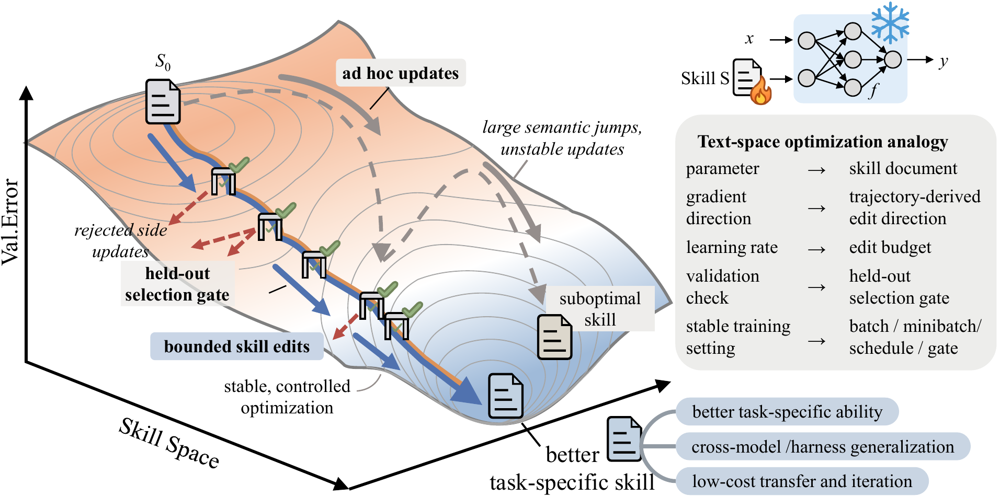
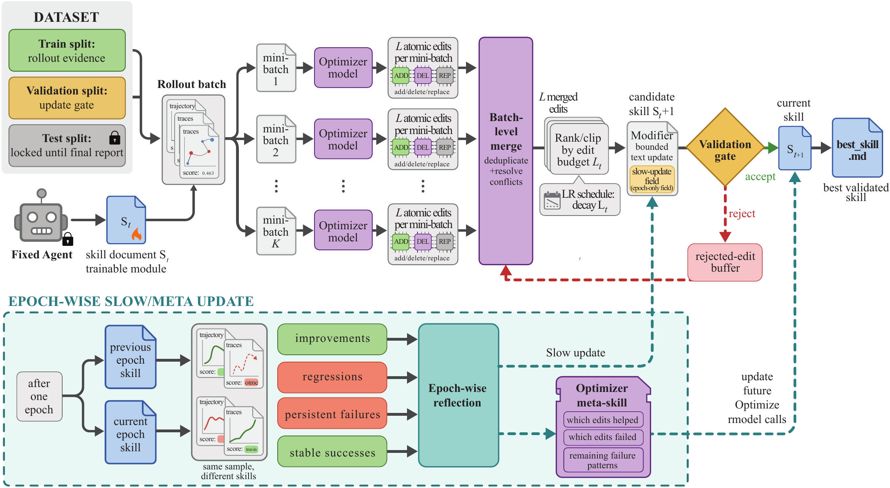
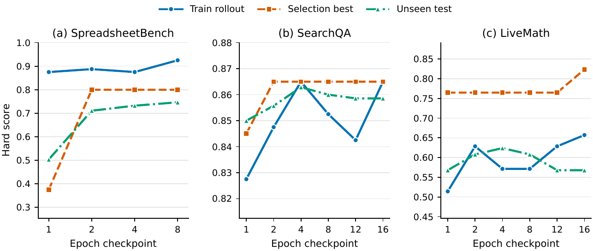

> [!info] 本筆記性質
> 本篇合併 **GitHub repo（程式碼實作）** 與 **arXiv 論文（方法論與實驗）** 兩個來源，以程式碼分析為主軸、論文數據為佐證。
> - 程式碼：`microsoft/SkillOpt`（Python，~19,555 行，MIT，2,982 stars，2026-05-08 建立）
> - 論文：*SkillOpt: Executive Strategy for Self-Evolving Agent Skills*（arXiv:2605.23904，2026-05-22）
> - **命名小註**：repo 對外叫 **SkillOpt**，但程式碼內部處處是舊代號 **ReflACT**（`ReflACTTrainer`、「6-stage ReflACT pipeline」），兩者指同一系統。
> - **作者單位**：據中文科普影片（Jim AI Notebook）指出，SkillOpt 為 **Microsoft 與上海交通大學、復旦大學、同濟大學** 的合作研究（本筆記原僅標註 Microsoft，已補）。

## 摘要（Summary）

SkillOpt 是一個把「代理人技能（Agent Skill）」當成**可優化參數（optimizable parameter）**來訓練的**文字空間優化器（text-space optimizer）**。它不動模型權重（model weights），而是讓一個「優化器模型（optimizer model）」讀取被評分的執行軌跡（scored rollouts），把它們轉成對技能文件（一份 Markdown）的**有界編輯（bounded edits）**，並且只有在驗證分數**嚴格上升**時才接受該次編輯。

核心類比：整個流程刻意對應深度學習的訓練迴圈——有 **epoch、minibatch、學習率（learning rate，= 每步可套用的編輯數）、驗證閘門（validation gate）**，但全部發生在**自然語言文字空間**而非數值權重空間。論文宣稱在 **6 個 benchmark、7 個目標模型、3 種執行環境（harness）= 52 種組合**上，SkillOpt **在每一格都拿到最佳或並列最佳（52/52）**，且學到的技能可**跨模型、跨環境遷移**。

## Why — 為什麼存在？

> 現有「讓 Agent 自己變強」的做法都不像一個真正的優化器（optimizer）。

- **核心動機**：論文摘要直指痛點——現今的 Agent 技能不是手工撰寫（hand-crafted）、就是一次性生成（one-shot generated）、或透過「鬆散控制的自我修訂（loosely controlled self-revision）」演化。**這三者都不像深度學習優化器，也都無法在回饋下可靠地超越起點。**
- **取代/改善什麼**：把「prompt/skill 的自我演化」從「憑感覺改寫」升級成「有學習率、有驗證閘門、有 epoch 排程的受控優化過程」，避免自我修訂越改越爛（degradation）。
- **目標用戶**：研究 self-evolving agents、prompt/skill optimization 的研究者；想在**不微調（fine-tune）凍結模型（frozen model）**的前提下提升 Agent 表現的工程師。

## What — 是什麼？

> 一個受控、可複現的「技能訓練」框架，產物是一份可直接部署的 `best_skill.md`。

- **主要功能**：
  - 把 scored rollouts 轉成對 skill 文件的 add/insert/replace/delete 編輯（textual gradient → edits）
  - 學習率（learning rate）= 每步可套用的最大編輯數（edit budget L），有 constant/linear/cosine/autonomous 排程
  - 驗證閘門（validation gate）：只接受讓選擇集（selection set）分數上升的候選技能
  - 兩/三時間尺度更新：步級編輯（fast）→ epoch 級 slow update（寫入受保護區段）→ 訓練末/跨 epoch meta-skill（優化器側記憶）
  - 多後端：Azure OpenAI / OpenAI-compatible / Anthropic Claude / Codex(exec) / Claude Code(exec) / Qwen(vLLM)
  - 多 benchmark 環境（env）外掛架構 + 斷點續訓（resume）+ Gradio WebUI 監控
- **不做什麼（Non-goals）**：
  - 不微調/不更新模型權重（目標模型全程凍結）
  - 不在**推論時（inference-time）**增加額外模型呼叫——技能就是一段提示（prompt），部署成本與一般 prompt 相同
  - 不自帶 benchmark 資料集（需自備符合格式的 train/val/test split）
- **技術棧（Tech Stack）**：Python 3.10+、`openai`、`azure-identity`、`pyyaml`、`numpy`、`openpyxl`；選配 `alfworld`、`gradio`(WebUI)、`vllm`(Qwen)、`claude-agent-sdk`。

## How — 如何運作？

### 系統架構圖（System Architecture）

```
┌──────────────────────────────────────────────────────────────┐
│                     scripts/train.py (CLI)                     │
│        load_config → get_adapter(env) → ReflACTTrainer.train() │
└───────────────────────────────┬──────────────────────────────┘
                                 │
                  ┌──────────────▼───────────────┐
                  │  engine/trainer.py (1912 行)  │
                  │  epoch / step 主迴圈協調者     │
                  └─┬──────┬───────┬───────┬──────┘
                    │      │       │       │
        ┌───────────▼─┐ ┌──▼─────┐ ┌▼──────────┐ ┌▼────────────┐
        │ envs/<bench> │ │gradient│ │ optimizer  │ │ evaluation  │
        │ adapter:     │ │reflect │ │ clip(select)│ │ gate.py     │
        │ rollout +    │ │aggregate│ │ scheduler  │ │ accept/     │
        │ evaluator    │ │(merge) │ │ lr_autonom │ │ reject      │
        └──────┬───────┘ └──┬─────┘ │ skill(apply)│ └─────────────┘
               │            │       │ slow_update │
               │            │       │ meta_skill  │
               ▼            ▼       └─────┬───────┘
        ┌──────────────────────────────────────┐
        │      model/router.py → backends       │
        │  optimizer_model（teacher 改技能）     │
        │  target_model（frozen student 跑任務） │
        │  azure_openai / codex / claude (+qwen) │
        └──────────────────────────────────────┘
```

> [!note] 設計模式（Design Pattern）：Teacher–Student + Strategy + 純函式決策
> `ModelRouter` 把呼叫分成兩個角色：**optimizer_model（teacher）**負責批判與改寫技能，**target_model（frozen student）**負責拿著技能跑任務。每個 benchmark 是一個 `EnvAdapter` 子類（Strategy pattern），在 `train.py` 以 lazy import 註冊（`_register_builtins`）。值得一提的是 `evaluation/gate.py` 寫成**純決策函式**（pure function）：只比較分數回傳 accept/reject，所有副作用（rollout、印出、改狀態）留給 trainer——測試與推理都更乾淨。

### 執行流程圖（Execution Flowchart）— 6 階段 per-step pipeline

```
 Start epoch/step
   │
   ▼
[① Rollout] adapter.rollout(skill, batch)（ThreadPoolExecutor 平行）
   │   每題得到 {id, hard:0/1, soft:0~1, trace}
   ▼
[② Reflect] gradient/reflect.py — minibatch 分析（類比 minibatch SGD）
   │   失敗/成功軌跡各自切成大小 M 的 minibatch，平行呼叫 optimizer
   │   error_analyst + success_analyst → 各產出 patch(JSON 編輯清單)
   ▼
[③ Aggregate] gradient/aggregate.py — 階層式合併(hierarchical merge)
   │   failure patches 先合 → success patches 再合 → 最終合併(失敗優先)
   ▼
[④ Select/Clip] optimizer/clip.py — 「梯度裁剪」
   │   若編輯數 > L，呼叫 optimizer 排序挑 top-L（失敗則退化為截斷）
   │   L = learning rate：scheduler(constant/linear/cosine) 或 autonomous 決定
   ▼
[⑤ Update] optimizer/skill.py — apply_patch（類比 optimizer.step()）
   │   依序套用 append/insert_after/replace/delete → candidate skill
   │   （受保護的 slow-update 區段一律跳過）
   ▼
[⑥ Evaluate/Gate] evaluation/gate.py
   │   cand_hard = candidate 在 selection set 的分數
   ├─ cand_hard > current_score ──► accept（> best 則 accept_new_best）
   └─ 否則 ──► reject（候選編輯進 rejected buffer，作為負面記憶）
                          │
                          ▼
                  記錄 step、存檔（可 resume）

 (每 epoch 末) → optimizer/slow_update.py：比較同一批任務在「前/後 epoch 技能」
                的表現差異(改善/退步/持續失敗)，把策略寫進「受保護區段」
 (跨 epoch)   → optimizer/meta_skill.py：蒸餾「優化器側記憶」，改善未來 edit 品質
```

### 時序圖（Sequence Diagram）— teacher/student 互動

```
 Trainer        Env(target_model)      Optimizer_model        Gate
   │                   │                      │                 │
   │──rollout(skill)──►│                      │                 │
   │◄─scored traces────│ (frozen student 跑 batch)              │
   │──reflect(minibatches)─────────────────────►│               │
   │◄─patches(JSON 編輯)────────────────────────│ (teacher 批判) │
   │──aggregate(merge) / select(top-L)─────────►│               │
   │◄─final patch───────────────────────────────│               │
   │  apply edits → candidate skill                             │
   │──evaluate(candidate on selection set)──────────────────────►│
   │◄─cand_hard──────────────────────────────────────────────────│
   │  accept iff cand_hard > current_score                       │
   │                                                             │
 (epoch 末) slow_update：同一批任務在前/後 epoch 技能下重跑 → 寫入受保護區段
 (跨 epoch) meta_skill：寫優化器側記憶，提升未來 edit 生成/排序品質
```

### 關鍵設計決策（Key Design Decisions）

1. **技能即參數，文字即梯度（skill-as-parameter, text-as-gradient）** — 把反思（reflection）產生的自然語言批判視為「文字梯度（textual gradient）」，指向技能該往哪改。
2. **minibatch 反思** — `reflect.py` 明說對應「minibatch SGD vs per-sample SGD」：把多條軌跡分組一起分析，找**共通**失敗樣式而非單一邊例（prompt 也明確要求 generalizable、不要 hardcode）。
3. **嚴格驗證閘門（strict validation gate）** — `evaluate_gate` 只在 `cand_hard > current_score` 時接受；超過 best 則記為 new best。這是「可靠改善」的關鍵；且本分支**強制開啟 gate**（config 若 `use_gate: false` 直接報錯）。
4. **學習率 = 編輯預算（edit budget L）** — `scheduler.py` 提供 constant/linear/cosine 衰減；`lr_autonomous.py` 讓 optimizer 自己決定本步要套幾個編輯（類比自適應 LR）。`clip.py`（梯度裁剪）負責把超過 L 的編輯排序後砍到 L 個。
5. **多時間尺度更新（multi-timescale）** — 步級編輯（fast）／epoch 級 **slow update** 寫進 `<!-- SLOW_UPDATE_START/END -->` **受保護區段**（步級編輯不可動，類比 EMA/target network 的穩定錨）／跨 epoch **meta-skill** 是「優化器側記憶」，只改善未來 edit 生成、不改 target 技能。
6. **rejected-edit buffer** — 被拒編輯不丟棄，作為「不要再這樣改」放進下一步的 `step_buffer_context`。
7. **無推論時額外成本** — 所有優化發生在訓練期；部署時技能只是一段 prompt。

### 關鍵程式碼（Key Code Snippets）

驗證閘門（`evaluation/gate.py`）——純決策函式，整個方法「可靠改善」的核心：

```python
def evaluate_gate(candidate_skill, cand_hard, current_skill, current_score,
                  best_skill, best_score, best_step, global_step) -> GateResult:
    if cand_hard > current_score:                 # 嚴格上升才接受
        if cand_hard > best_score:
            return GateResult(action="accept_new_best", current_skill=candidate_skill,
                              current_score=cand_hard, best_skill=candidate_skill,
                              best_score=cand_hard, best_step=global_step)
        return GateResult(action="accept", current_skill=candidate_skill,
                          current_score=cand_hard, best_skill=best_skill,
                          best_score=best_score, best_step=best_step)
    return GateResult(action="reject", current_skill=current_skill,
                      current_score=current_score, best_skill=best_skill,
                      best_score=best_score, best_step=best_step)
```

編輯套用（`optimizer/skill.py`）——「optimizer.step()」，四種 op + 保護區段：

```python
if op == "append":
    ...  # 接在技能尾端（但插在 SLOW_UPDATE 區段之前）
if op == "insert_after":
    ...  # 找到 target 之後插入；找不到則退化為 append
if op == "replace":
    if not target or target not in skill: return skill  # 找不到 → 跳過
    return skill.replace(target, content, 1)             # 只換第一個
if op == "delete":
    if not target or target not in skill: return skill
    return skill.replace(target, "", 1)                  # 只刪第一個
# 任何落在 <!-- SLOW_UPDATE_START/END --> 內的 target 都會被略過（protected）
```

學習率排程（`optimizer/scheduler.py`）——「學習率」就是每步編輯數 L：

```python
class AutonomousScheduler(LRScheduler):
    NO_LIMIT = 999            # 不設限，改由 optimizer LLM 自行決定編輯數
    def _compute_lr(self, step): return self.NO_LIMIT
# 另有 ConstantScheduler / LinearScheduler / CosineScheduler（從 max_lr 衰減到 min_lr）
```

失敗分析提示（`prompts/analyst_error.md`，節錄，完整保留語氣）：

```
You are an expert failure-analysis agent for AI agent tasks.
You will be given MULTIPLE failed agent trajectories from a single minibatch...
## Analysis Process
1. Read ALL trajectories in the minibatch.
2. Identify the most prevalent, systematic failure patterns across them.
4. Propose skill edits that address the COMMON patterns — not individual edge cases.
5. Edits must be generalizable; do not hardcode task-specific values.
...
Respond ONLY with a valid JSON object: { "patch": { "edits": [ {"op": "append", ...} ] } }
IMPORTANT: ... Do NOT propose any edits that target ... content within
<!-- SLOW_UPDATE_START --> ... <!-- SLOW_UPDATE_END --> markers.
```





## 安裝流程（Installation Flow）

> [!info] 追蹤層級
> SkillOpt 是標準 Python 套件（`pip install -e .`），不像 CLI 工具那樣 patch 使用者家目錄；安裝的「副作用」主要在 Python 環境與專案內的 `outputs/` 目錄，以及使用者需自建的 `.env`。

### 安裝觸發方式

```
git clone + pip install -e .      → 安裝 skillopt 套件 + 註冊 console scripts
pip install -e ".[alfworld]"      → 額外裝 alfworld/gymnasium（embodied benchmark）
cp .env.example .env; source .env → 設定 API 憑證環境變數
```

### 安裝時序圖

```
 安裝者        pip / setuptools          Python env           專案目錄
    │               │                       │                    │
    │──pip install -e .──►│                  │                    │
    │               │──build (pyproject)────►│                    │
    │               │──install skillopt*─────►│ site-packages(egg-link)
    │               │──register scripts──────►│ bin/skillopt-train
    │               │                        │ bin/skillopt-eval  │
    │──cp .env.example .env───────────────────────────────────────►│ ./.env
    │──source .env──►（匯出 AZURE_OPENAI_* 等到 shell）             │
    │──python scripts/train.py ...──────────────────────────────────► outputs/<run>/
```

### 安裝產物清單

| 路徑 | 類型 | 用途 |
|------|------|------|
| `<venv>/.../skillopt*.egg-link` | 檔案 | editable 安裝指向原始碼 |
| `<venv>/bin/skillopt-train` | console script | = `scripts.train:main` |
| `<venv>/bin/skillopt-eval` | console script | = `scripts.eval_only:main` |
| `./.env`（使用者自建） | 檔案 | API 憑證（不進 git） |
| `outputs/<run_name>/` | 目錄 | 訓練產物（見下） |
| `outputs/<run>/best_skill.md` | 檔案 | **最終可部署技能** |
| `outputs/<run>/{history,config,runtime_state}.json` | 檔案 | 歷史 / 設定 / resume 檢查點 |
| `outputs/<run>/skills/skill_vXXXX.md` | 檔案 | 每步技能快照 |
| `outputs/<run>/steps/step_XXXX/` | 目錄 | 每步 patch / 評估產物（含 minibatch patch 快取，供 resume） |

### 環境變數

| 變數名 | 值 | 設定時機 |
|--------|-----|---------|
| `AZURE_OPENAI_ENDPOINT` | endpoint URL | 執行時（**三種 auth 模式都必填**，缺它全部 LLM 呼叫失敗） |
| `AZURE_OPENAI_API_VERSION` | 如 `2024-12-01-preview` | Azure 模式 |
| `AZURE_OPENAI_API_KEY` | 金鑰 | api_key 模式 |
| `AZURE_OPENAI_AUTH_MODE` | `api_key`/`azure_cli`/`managed_identity`/`openai_compatible` | 切換驗證方式 |
| `ANTHROPIC_API_KEY` | `sk-ant-...` | claude_chat backend |
| `QWEN_CHAT_BASE_URL` / `QWEN_CHAT_MODEL` | vLLM 端點 / 模型名 | 本地 Qwen |
| `REFLACT_MODEL_BACKEND` | backend 名 | router 啟動時讀（透露內部代號 ReflACT） |

> [!warning] 解除安裝 / 清理
> `pip uninstall skillopt` 移除套件與 console scripts；訓練產物需手動刪 `outputs/`，憑證在 `./.env`。資料集本身不隨 repo 提供，需自備。

## 使用案例地圖（Use Case Map）

### 案例總覽

| # | 使用案例 | 觸發方式 | 入口檔案 | 核心模組 |
|---|---------|---------|---------|---------|
| 1 | 訓練一個技能 | `python scripts/train.py --config ...` | `scripts/train.py` | `config → engine/trainer.py → (reflect → aggregate → clip → skill → gate)` |
| 2 | 只評估已訓練技能 | `python scripts/eval_only.py --skill best_skill.md` | `scripts/eval_only.py` | `envs/<bench>/adapter → rollout → evaluator` |
| 3 | 監控訓練 | `python -m skillopt_webui.app` | `skillopt_webui/app.py` | 讀 `outputs/<run>/history.json` 以 Gradio 呈現 |
| 4 | 新增 benchmark | 照 `envs/_template/` 實作 | `skillopt/envs/_template/` | `EnvAdapter` 子類：`build_*_env / rollout / reflect` |

### 案例詳解

#### 案例 1：訓練一個技能（最常用）

```
用戶：python scripts/train.py --config configs/searchqa/default.yaml --split_dir ... --target_model gpt-5.5
  │
  ▼
scripts/train.py:main()
  │  load_config（_base_ 繼承 + CLI 覆寫）；get_adapter(env)
  ▼
engine/trainer.py:ReflACTTrainer.train()
  │  載入 train/val/test；initial_skill()；算 baseline 分數
  │
  ├─每 step→ 6 階段 pipeline
  │     ① rollout(batch) → ② reflect(minibatch) → ③ aggregate(merge)
  │     → ④ clip(top-L) → ⑤ apply → ⑥ gate；接受則更新 skill；存 steps/step_XXXX/
  │
  ├─每 epoch末→ optimizer/slow_update.py（寫入受保護區段）
  └─跨 epoch→ optimizer/meta_skill.py（優化器側記憶）
  │
  ▼
寫出 outputs/<run>/best_skill.md（最終效果：一份可直接當 prompt 用的技能）
```

#### 案例 2：只評估已訓練技能

```
用戶：python scripts/eval_only.py --config ... --skill outputs/my_run/best_skill.md --split valid_unseen
  │
  ▼
scripts/eval_only.py:main()
  │  讀技能 .md（不做任何優化）
  ▼
envs/<bench>/adapter.py:rollout(skill, item)  × split
  │  target_model 帶著技能跑每題 → evaluator 打分
  ▼
輸出平均分數（最終效果：量化這份技能的好壞，不改動它）
```

> [!note] 閱讀建議
> 想理解「訓練到底動了什麼」，從 `engine/trainer.py`（1912 行，docstring 已列出 6 階段）配 `gradient/reflect.py:run_minibatch_reflect` 開始讀；想理解「技能怎麼被改」，讀 `optimizer/skill.py`（4 種 op 的字串操作）與 `evaluation/gate.py`（接受規則）。

## 架構師觀點（Architect's View）

### ✅ 優點（Strengths）

| 面向 | 評估 | 說明 |
|------|------|------|
| 可維護性（Maintainability） | ⭐⭐⭐⭐⭐ | 模組職責極清晰：gradient / optimizer / evaluation / model / envs 各司其職，型別集中在 `types.py`，gate 寫成純函式 |
| 可擴展性（Scalability） | ⭐⭐⭐⭐⭐ | benchmark 與後端皆外掛化；`envs/_template/` + lazy import 註冊讓新增任務成本低；config 有 `_base_` 繼承 |
| 測試覆蓋（Test Coverage） | ⭐⭐ | repo 內幾乎看不到測試（`dev` extra 有 pytest 但測試檔案稀少）；屬研究程式碼常態 |
| 文件品質（Documentation） | ⭐⭐⭐⭐ | README 完整、有 mkdocs、prompts 自帶說明、每個模組 docstring 都用「對應到哪個 DL 概念」解釋 |
| 依賴管理（Dependency Management） | ⭐⭐⭐⭐ | 核心依賴精簡，重依賴（alfworld/vllm/gradio/claude-sdk）都放 optional extras |

> [!tip] 值得學習的設計
> **用「深度學習隱喻」當設計語言**：每個檔案 docstring 都明說自己對應 minibatch SGD / gradient clipping / learning rate / EMA / target network。這讓陌生讀者能用既有心智模型快速理解，是極佳的「概念可發現性（conceptual discoverability）」示範。把 gate 切成**純決策函式**、用 dataclass（`Edit`/`Patch`/`RolloutResult`）當合約，也很值得借鏡。

### ⚠️ 缺點與風險（Weaknesses & Risks）

> [!warning] 已知缺陷 / 技術債（Technical Debt）

- **訓練成本高**：每一步都是「batch rollout（①）+ 多個 minibatch 反思（②，平行 LLM）+ 階層合併（③，多次 LLM）+ 排序選擇（④，LLM）+ 在 selection set 上重跑評估（⑥）」，再加每 epoch 的 slow_update 與跨 epoch meta_skill。單步就要幾十次 LLM 呼叫——金錢與時間成本可觀。
- **驗證閘門用點估計（point estimate）**：`evaluate_gate` 直接比較 selection set 上的單一 hard 分數（`cand_hard > current_score`），無變異/雜訊處理 — 影響：selection set 小或評分有雜訊時，接受/拒絕可能被隨機波動主導（對驗證集過擬合風險）。
- **編輯套用是脆弱的字串操作**：`replace`/`delete` 用 `str.replace(target, ..., 1)` 只動第一個符合處，`target` 必須與技能文字**逐字相符**否則整個編輯被默默跳過（`skipped_replace_target_not_found`）— 影響：optimizer 產生的 anchor 一旦對不上就靜默失效，或誤改到非預期的重複片段。
- **選擇/排序仰賴 optimizer LLM**：`clip.rank_and_select` 用 LLM 排序，失敗時 fallback 只是 `edits[:max_edits]` 截斷 — 影響：排序品質與一致性受 optimizer 能力左右。
- **命名雙軌（SkillOpt vs ReflACT）**：對外 SkillOpt、對內 ReflACT（類別名、env var `REFLACT_MODEL_BACKEND`、prompt 措辭）— 影響：新進者閱讀容易混淆，是改名未竟的技術債。
- **依賴可量化的自動評分器**：方法只適用於「score 能自動算（hard 0/1）」的 benchmark；開放式、無 ground-truth 的任務難以套用。

### 🔮 改進建議（Improvement Suggestions）
1. 驗證閘門改用**多次評估 + 信賴區間 / 最小可偵測效果（MDE）**或 bootstrap，降低雜訊誤判。
2. `replace`/`delete` 改用 anchor + 區段定位（技能本可解析成 sections）取代全域字串取代，並回報「靜默跳過」比率到 history。
3. 加入 rollout/評估快取與增量評估（只重跑受編輯影響的題），壓低訓練成本。
4. 統一對外/對內命名，移除 ReflACT 遺留，降低閱讀負擔。

## 效能基準（Benchmark）

> [!info] 資料來源
> 數據取自官方專案頁（`microsoft.github.io/SkillOpt`，與 arXiv:2605.23904 一致）。下表為 **SkillOpt 相對「no-skill baseline」的分數增益（gain）**，非絕對分數；6 benchmark + 平均增益（Avg gain）。

**主結果（各目標模型，Direct chat harness 的增益）**

| 目標模型 | SearchQA | Sheet | Office | DocVQA | LiveMath | ALFWorld | **Avg gain** |
|---|---|---|---|---|---|---|---|
| GPT-5.5 | +9.6 | +38.9 | +39.0 | +12.4 | +29.3 | +11.9 | **+23.5** |
| GPT-5.4 | +6.2 | +21.1 | +12.8 | +13.6 | +7.2 | +15.6 | +12.8 |
| GPT-5.4-mini | +4.3 | +11.4 | +26.7 | +16.5 | +4.8 | +12.7 | +12.7 |
| GPT-5.4-nano | +19.0 | +8.2 | +33.7 | +49.4 | +4.0 | +35.1 | **+24.9** |
| GPT-5.2 | +11.2 | +18.9 | +21.5 | +16.5 | +15.2 | +16.4 | +16.6 |
| Qwen3.5-4B | +3.1 | +14.6 | +15.2 | +2.1 | +29.6 | +50.7 | +19.2 |
| Qwen3.6-35B-A3B | +7.6 | +9.3 | +1.2 | +3.8 | +10.4 | +22.4 | +9.1 |

**跨 harness（GPT-5.5，agentic 執行環境）**

| Harness | SearchQA | Sheet | Office | DocVQA | LiveMath | ALFWorld | Avg gain |
|---|---|---|---|---|---|---|---|
| Codex | +5.5 | +57.5 | +12.8 | +5.0 | +28.0 | N/A | **+21.8** |
| Claude Code | +4.0 | +58.3 | +13.9 | +3.5 | +13.3 | N/A | **+18.6** |

> [!note] 整體宣稱
> 「**52/52** — 在每一個 模型×benchmark 與 harness×benchmark 設定中皆為最佳或並列最佳」。論文摘要另以 +23.5（direct）、+24.8（Codex）、+19.1（Claude Code）為頭條數字；專案頁表格的 Codex/Claude Code Avg 為 +21.8／+18.6（推測為版本/設定差異，以表格的逐項分解為準）。

**消融實驗（Ablation，三個 benchmark 的絕對分數）**

| 元件 | 設定 | SearchQA | Spreadsheet | LiveMath |
|---|---|---|---|---|
| 學習率（learning rate） | lr=4（預設） | **87.1** | **77.5** | **61.3** |
| 學習率 | 不用 lr | 84.6 | 75.7 | 57.3 |
| Rejected buffer | 有 buffer | 87.1 | 77.5 | 61.3 |
| Rejected buffer | 無 buffer | 85.5 | 72.9 | 58.9 |
| 更新記憶（meta+slow） | 兩者皆有 | 87.1 | 77.5 | 61.3 |
| 更新記憶 | 兩者皆無 | 86.3 | **55.0** | 59.7 |

→ 「更新記憶」對 Spreadsheet 影響最大（77.5 → 55.0，掉 22.5），顯示 slow/meta 更新在程式生成類任務最關鍵；rejected buffer 與 lr 各貢獻數個百分點。

**遷移（Transfer）**：跨模型 **+15.2**（GPT-5.4 的 LiveMath 技能 → GPT-5.4-nano，零樣本）；跨 harness **+31.8**（Codex 上訓的 SpreadsheetBench 技能 → Claude Code）。



## 快速上手（Quick Start）

```bash
git clone https://github.com/microsoft/SkillOpt.git
cd SkillOpt
pip install -e .

cp .env.example .env          # 填入憑證後
source .env

# 訓練（需自備符合格式的 split：train/val/test 各一個 items.json）
python scripts/train.py \
    --config configs/searchqa/default.yaml \
    --split_dir /path/to/your/searchqa_split \
    --azure_openai_endpoint https://your-resource.openai.azure.com/ \
    --optimizer_model gpt-5.5 \
    --target_model gpt-5.5

# 評估訓練好的技能
python scripts/eval_only.py \
  --config configs/searchqa/default.yaml \
  --skill outputs/my_run/best_skill.md \
  --split valid_unseen \
  --split_dir /path/to/searchqa_split \
  --azure_openai_endpoint https://your-resource.openai.azure.com/
```

## 我的心得（My Takeaways）

- **「驗證閘門 + 學習率（編輯數）裁剪 + rejected buffer」是把自我演化變可靠的最小充分組合**。消融實驗也佐證：拿掉這些煞車，分數就掉（Spreadsheet 在沒有更新記憶時直接從 77.5 崩到 55.0）。這個觀念可直接搬到我自己的 prompt/skill 迭代流程：每次只小改、用固定驗證集卡關、不過關就回退、把失敗的改法記下來別重蹈。
- **minibatch 反思**是個好招：與其逐條軌跡各提一堆零碎建議，不如把一批失敗放一起、找**共通**樣式再下手，天然抑制過擬合單一邊例。
- **深度學習隱喻當架構命名法**非常有啟發性——把抽象概念對齊讀者既有心智模型，值得用在自己專案的模組命名與 docstring。
- 對 connsys-jarvis 的多代理人設計而言，SkillOpt 的「optimizer/target 雙角色 + rejected buffer + epoch consolidation + 受保護區段」可作為「讓 agent 的 system prompt/skill 隨使用自動精煉」的參考骨架，但要先解決**自動評分器**這個前提。

## 待補充（Open Questions）

- 訓練一份技能到收斂的**實際 token/金錢成本**是多少？repo/論文未給每次 run 的呼叫次數與費用（建議搜尋：`SkillOpt training cost tokens`、issue 區 `cost`）。
- 專案頁表格的 Codex/Claude Code Avg（+21.8／+18.6）與摘要頭條（+24.8／+19.1）為何不同？是 v1→v2 改版、還是不同子集平均？（需比對 arXiv v1 vs v2）
- selection set（gate 用來評分的集合）多大？`evaluate_gate` 用點估計，論文是否對其大小/雜訊做敏感度分析？（建議搜尋：`SkillOpt selection set size ablation`）
- 跨**模型**遷移時，被遷移的技能是針對哪個 target 訓練的、是否各自重訓？表格給了 +15.2 但機制細節不足（建議搜尋：`SkillOpt cross-model transfer`）。
- `replace/delete` 因 anchor 對不上而「靜默跳過」的比率有多高？這對最終技能品質影響多大？（需讀 `steps/*/` 的 per-edit report）
- 對**無自動評分**的開放式任務（寫作、規劃），SkillOpt 是否有 LLM-as-judge 變體把 hard 分數換成裁判分？（建議搜尋：`SkillOpt LLM judge open-ended`）
- **作者單位待獨立核實**：「Microsoft + 上海交大 + 復旦 + 同濟」目前僅來自中文科普影片（Jim AI Notebook），補充當下 arXiv abs 頁回 500 無法驗證（建議：直接讀 arXiv:2605.23904 PDF 第一頁的 affiliation 區塊確認）。

---

## 知識層次分析（Bloom's Taxonomy Analysis）

> 以下從五個認知層次對本篇內容進行結構化分析，協助從記憶到評估逐層深化理解。

| 認知層次 | 核心目的 | 對本文的具體應用 |
|---------|---------|--------------|
| **記憶（被動）** | 確認資訊存在，單純資訊檢索，確立基礎知識 | 核心術語：textual gradient（文字梯度）、validation gate（驗證閘門）、learning rate=edit budget（編輯預算）、minibatch reflect、slow update（受保護區段）、meta skill（優化器側記憶）、frozen target model。核心 API：`ReflACTTrainer.train()`、`run_minibatch_reflect()`、`merge_patches()`、`rank_and_select()`、`evaluate_gate()`。 |
| **理解（半被動）** | 解釋概念的含義及關聯，串聯知識點，掌握核心邏輯 | 6 階段把 prompt 自我演化重構成優化迴圈：rollout（前向）→ reflect（求梯度）→ aggregate（合梯度）→ clip（限學習率）→ apply（更新參數）→ gate（驗證早停）。三條時間尺度（step/epoch/run）對應 fast 更新、受保護的 slow 錨、跨任務記憶蒸餾。 |
| **分析（主動）** | 檢驗論點、拆解流程、找出假設，批判性思維 | 關鍵假設：(1) 存在**可自動量化**的 hard 分數；(2) selection set 分數是泛化的可靠代理（小/雜訊會破壞此假設）；(3) optimizer_model 夠強，能產生會泛化的編輯且 anchor 對得上。潛在漏洞：每步多次 LLM 的高成本、point-estimate 閘門、字串編輯的靜默失效。 |
| **應用（主動）** | 將知識套用情境，規劃執行方案，實戰決策力 | (1) 在自己的 prompt 迭代流程導入「固定驗證集 + 只接受嚴格上升 + 單步小改回退 + 記錄失敗改法」四原則；(2) 用 `envs/_template/` 為自家任務寫一個 `EnvAdapter`，把現有評測接進 SkillOpt 跑一次技能訓練；(3) 借「DL 隱喻命名法」重構自己專案的模組 docstring。 |
| **評估（主動）** | 判斷多個方案的優劣，進行決策和權衡 | 相較 TextGrad/GEPA/DSPy，SkillOpt 的差異化在「嚴格驗證閘門 + minibatch 反思 + 多時間尺度 + rejected buffer」，數據上 52/52 best-or-tied、平均增益 +9~+25。但代價是**訓練成本**與**對自動評分器的依賴**。若任務無可量化分數、或預算極有限 → 反而該選輕量 prompt engineering / few-shot；若任務有清楚評分且願花算力 → SkillOpt 範式優勢明顯。 |

### 分析型追問（Socratic Follow-up）

- **澄清**：「textual gradient」最模糊——它其實只是「optimizer LLM 對 minibatch 軌跡的批判 + JSON 編輯建議」，並無數學意義上的方向/大小；要精確化，得問「它在多大程度上單調指向更高 selection 分數」。
- **假設**：最關鍵前提是「selection set 分數是泛化的可靠代理」。若集合太小或有雜訊，嚴格閘門反而會對它過擬合，「單調改善」就會失真。
- **證據**：「跨模型遷移 +15.2」這類主張仍需更多控制變因（技能針對哪個 target 訓練、是否各自重訓）才站得住；表格給了數字但機制細節不足。
- **觀點**：反對者最有力的批評是——「這只是包裝得很像 SGD 的 prompt search，真正貢獻是工程紀律（閘門+裁剪+buffer）而非新理論」。
- **後果**：若團隊全面採用，12 個月後可能出現的副作用是**算力帳單暴增**與**技能對特定 benchmark 過擬合**，部署到真實分布時表現回落。

### 方案批判三問（Critical Evaluation）

1. **最大的風險是什麼？** — **對 selection set 過擬合 + 訓練成本失控**。每步多次 LLM 呼叫 + 重跑評估會放大 API 花費；point-estimate 閘門讓技能可能學到「討好這個集合」而非真本事，部署到真實分布時退步。
2. **什麼情況下會失敗？** — (a) benchmark 無自動可量化分數；(b) selection set 太小/雜訊大；(c) optimizer_model 太弱，編輯破壞性或 anchor 對不上而靜默失效；(d) 預算不足以承受每步多次 LLM；(e) 任務分布與驗證分布不一致。
3. **有沒有更好的替代方案？** — 無量化分數時用 **LLM-as-judge + 人評**；預算有限時用**手工 prompt engineering / few-shot exemplars**；想要更省的自動優化可用 **DSPy / GEPA / TextGrad**（論文的比較對象）。當你「有清楚評分 + 願花算力 + 想要可複現的單調改善」時，才選 SkillOpt 範式。

## 影片補充（中文科普視角｜Jim AI Notebook, 2026-05-28）

> [!info] 為什麼補這段
> 用 NotebookLM 抽取這支 10 分鐘科普影片「當 Prompt 變成可訓練模型：SkillOpt 重新定義提示詞工程」的逐字稿後，與本筆記比對：影片在**機制細節、benchmark 數字、與 TextGrad/GEPA/DSPy 的比較、限制與成本**上都比本筆記淺（這些本筆記已涵蓋且更深），但它提供了三個值得補進來的**框架性洞察**。

1. **定位：prompt 從「手工藝（craft）」走向「科學（science）」** — 影片主張「手動調 prompt 的時代要結束了」，把 SkillOpt 視為提示詞工程從「憑直覺手寫」轉為「可量化迭代優化」的分水嶺。（此為評論者的詮釋框架，非論文原話。）
2. **小模型可追上大模型** — 影片點出：小模型套上 SkillOpt 優化後的 skill，表現可逼近甚至超越「未優化的大模型」。本筆記的 benchmark 表其實已佐證這點（例：Qwen3.5-4B 在 ALFWorld **+50.7**、平均 **+19.2**），值得當成一句明確的洞察。
3. **對日常寫 prompt 的實務啟示** — (a) 為任務建一個小型「**驗證題庫**」，才能客觀判斷 prompt 變好或變壞；(b) **小步快跑**：一次只改幾條規則、馬上測分；(c) **角色轉變**：未來「prompt 工程師」的工作可能從「手寫 prompt」轉為「**設計優化流程 + 準備驗證資料**」。

> [!warning] 影片的侷限（故無需從它補充的部分）
> 該影片屬科普介紹，**未**與 TextGrad/GEPA/DSPy 做比較、**未**談優化的運算成本／token 消耗與過擬合風險——這些本筆記的「架構師觀點」與「方案批判三問」已涵蓋。簡言之：**本篇的核心重點沒有漏，影片補的是「科普框架 + 作者單位」這層。**

## 相關連結（Related）
- [[2026-04-16-CLAUDE-CODE-SKILL-FRONTMATTER-FORK-AGENT-HOOKS-SOURCE-DEEP-DIVE]] — 相關主題：Claude Code Skill/Plugin 安全機制全解析：Frontmatter 進階欄位 + 命名冒名防護 + 企業 Marketplace 部署
- [[2026-04-11-NPX-SKILLS-DEEP-DIVE-PARSE-DISCOVER-INSTALL-UPDATE]] — 相關主題：npx skills 深度分析 — parseSource 解析、discoverSkills 搜尋、安裝更新機制與 Gerrit Server 相容性
- [[2026-04-07-GSTACK-DESIGN-PHILOSOPHY-AND-INTEGRATION]] — 相關主題：gstack 設計哲學與多 Agent 整合架構 — Plugin、Symlink、Headless 全解
- [[2026-01-09-OH-MY-CLAUDECODE-MULTI-AGENT-ORCHESTRATION]] — 相關主題：oh-my-claudecode — Claude Code 多代理人編排系統深度分析
- [[2026-04-16-CLAUDE-CODE-SKILLS-VS-COMMANDS-VS-SUBAGENTS-COMPLETE-COMPARISON]] — 相關主題：Claude Code 擴充機制完整比較：Skills vs Commands vs Subagents vs Plugins 最佳實踐與實驗數據
- [[2026-05-20-CODEX-HOOK-AND-SKILLS-PARAMETERS-DEEP-DIVE]] — 相關主題：Codex Hook 系統參數與 Skills 搜尋路徑 — 原始碼層級深度規格
- [[2026-04-15-AI-DEVELOPER-EVOLUTION-PRACTITIONER-GUIDE-PERE-VILLEGA]] — 相關主題：AI 開發者演化：實踐者指南全系列（Pere Villega 11 章全文翻譯）
- [[2026-05-20-CODEX-CLI-VS-CLAUDE-CODE-DEEP-COMPARISON]] — 相關主題：Codex CLI vs Claude Code 深度對比 — 兩大終端機 AI Coding Agent 的架構與體驗

## References
- [GitHub Repo — microsoft/SkillOpt](https://github.com/microsoft/SkillOpt)
- [論文 — SkillOpt: Executive Strategy for Self-Evolving Agent Skills (arXiv:2605.23904)](https://arxiv.org/abs/2605.23904)
- [專案頁](https://microsoft.github.io/SkillOpt/)
- [Demo 影片（官方）](https://youtu.be/JUBMDTCiM0M)
- [中文科普解說 — 「當 Prompt 變成可訓練模型：SkillOpt 重新定義提示詞工程」（Jim AI Notebook, 2026-05-28）](https://www.youtube.com/watch?v=g8Ik-0aYfiQ)
