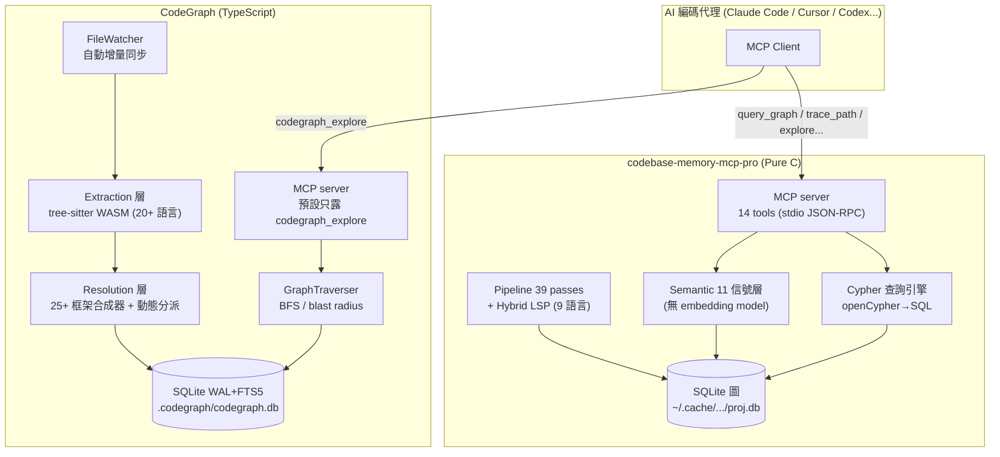
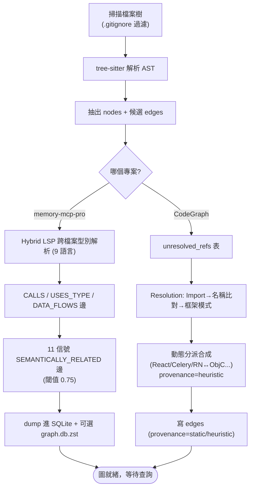
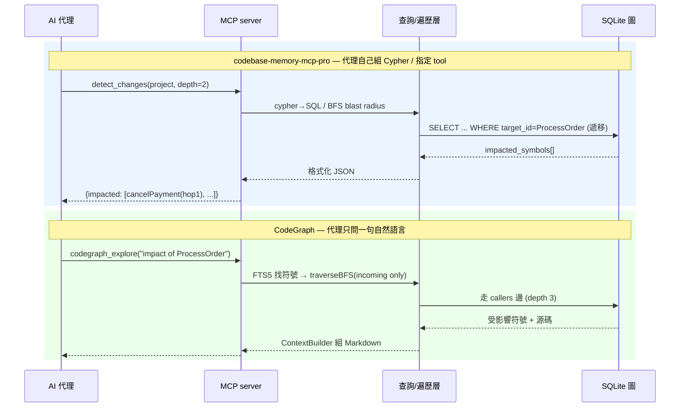
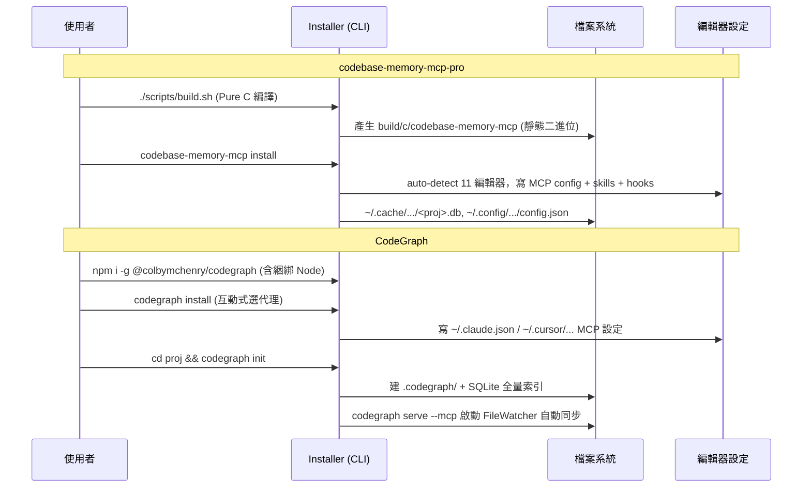

## 摘要（Summary）

這篇筆記深度拆解兩個「程式碼知識圖譜（Code Knowledge Graph）MCP server」，並做正面比較。兩者要解決**同一個痛點**：AI 編碼代理（Claude Code、Cursor、Codex…）理解大型 codebase 時，靠 `grep` / `Read` 一個一個檔案翻找，造成**大量工具呼叫**與**爆量 token 消耗**。兩者的共同解法也一樣：**預先把程式碼解析成 AST → 抽出節點（function/class/route）與邊（calls/imports/…）→ 存成可查詢的圖 → 透過 MCP 工具讓代理一次問到位**。

但兩者的設計哲學南轅北轍：

- **`codebase-memory-mcp-pro`（win4r fork）** — Pure C 寫的「**查詢引擎派**」。內建完整的 openCypher 查詢語言、14 個 MCP 工具、11 信號語意相似度搜尋、158 種語言、團隊共享壓縮工件。追求**最大查詢表達力**。
- **`CodeGraph`（Colby McHenry）** — TypeScript/Node 寫的「**單一工具、代理導向派**」。預設只暴露 `codegraph_explore` 一個工具、刻意**不做向量/語意**（只要結構精確邊）、靠檔案監控自動增量同步、框架感知（25+ 框架）動態分派合成。追求**貼合代理實際行為**。

> [!important] 一句話總結差異
> **memory-mcp-pro 給你一把瑞士刀（Cypher + 14 工具 + 語意搜尋），CodeGraph 給你一個按鈕（explore）。** 前者賭「代理會聰明地組合查詢」，後者賭「少即是多，代理只想問一句話」。

---

## 關鍵洞察（Key Insights）

- **同源異流**：兩者都是「AST → graph → MCP」管線，但 memory-mcp-pro 把圖當**資料庫**（暴露 Cypher 讓你查），CodeGraph 把圖當**內部結構**（只暴露一個高階 explore）。這是「資料庫 vs 應用」的經典張力 — 參見 [[CLAUDE-MEMORY-ENGINE]] 對「記憶該存什麼、怎麼取」的討論。
- **語意 vs 結構之爭**：memory-mcp-pro 用 11 種本地信號算 `SEMANTICALLY_RELATED` 邊（無外部 embedding model）；CodeGraph **刻意拒絕語意相似度**，主張「精確 AST 邊 > 語義近似」以避免幻覺。這是兩種對「什麼叫理解程式碼」的根本世界觀。
- **動態分派是試金石**：`handlers[action.type]()`、React `setState→render`、Celery `task.delay()` 這類**靜態追不到**的呼叫，CodeGraph 用 25+ 個框架專屬合成器補上（標記 `provenance: heuristic`），這是它最硬的工程護城河；memory-mcp-pro 則靠 9 語言 Hybrid LSP 補型別解析，路線不同。
- **成熟度天差地遠**：CodeGraph 53.7k stars、v1.0 已發佈、217 open issues（活躍）；memory-mcp-pro 73 stars、2026-06-21 才建立的 fork。star 數不等於技術優劣，但決定了「踩到坑時有沒有人陪你」。
- **Pure C 的賭注**：memory-mcp-pro 用零依賴 C 換取「單一靜態二進位 + 秒級索引百萬行」，代價是維護成本極高（手寫記憶體/字串管理）；CodeGraph 用 Node 內建 `node:sqlite`（無原生編譯）換取可維護性與快速迭代。

---

## 詳細內容（Details）

### 〈A〉codebase-memory-mcp-pro — Pure C 查詢引擎

> [!info] 身世
> 它是 `DeusData/codebase-memory-mcp`（MIT）的社群 fork，由 @win4r 維護，整合了上游未合併的 9 個 PR（增量索引 CALLS 邊修正、Cypher 聚合修復、Swift 型別細化、blast radius 深度等）。2026-06-21 建立，73 stars。

#### Why / What
- **Why**：file-by-file 探索 token 爆炸（README 宣稱 412K tokens vs 圖查詢 3.4K tokens），且 grep 精準度低。
- **What**：高速知識圖譜引擎，秒級索引百萬行（宣稱 Linux kernel 28M LOC 約 3 分鐘），對外暴露 14 個 MCP 工具給 11 種編碼代理。
- **技術棧**：**Pure C**，零外部執行時依賴，內嵌（vendored）SQLite3 + tree-sitter（158 語言 grammar）+ yyjson + xxhash + zstd + 可選 libgit2 + mimalloc。

#### How — 核心機制
- **儲存**：`~/.cache/codebase-memory-mcp/<project>.db`（SQLite，in-memory + WAL）。節點有 `Function/Method/Class/Route/Resource…` 等 label，邊有 26 種類型（`CALLS/IMPORTS/DATA_FLOWS/SEMANTICALLY_RELATED/HTTP_CALLS…`）。
- **索引管線**（`src/pipeline/`，39 個 pass）：definitions → k8s → LSP cross-dispatch → calls → usages → semantic → 預 dump（decorator/route/similarity/semantic/complexity）。檔案 >50K 時走平行管線。
- **Hybrid LSP**（9 語言：Python/TS/JS/PHP/C#/Go/C/C++/Java/Kotlin/Rust）做跨檔案型別解析，捕捉 generics、class hierarchy、import→定義。
- **11 信號語意相似度**（`src/semantic/`，**無外部 embedding model**）：TF-IDF、Random Indexing、MinHash、API/Type/Decorator signature、AST 結構輪廓、Data Flow、Graph Diffusion、Halstead-Lite。閾值 0.75 才發 `SEMANTICALLY_RELATED` 邊。
- **查詢**：核心是 `src/cypher/`（15 萬行 C！）自實作的 openCypher 讀子集，把 `MATCH...WHERE...RETURN` 轉成 SQL。
- **團隊共享**：可匯出 `.codebase-memory/graph.db.zst`（zstd -9，8–13:1 壓縮）commit 進 git，隊友 clone 後免重索引。

#### 14 個 MCP 工具（節選）

| 工具 | 功能 |
|------|------|
| `explore` | 【主工具】一次回傳 callers + callees + 源碼 |
| `query_graph` | 原生 openCypher 查詢 |
| `trace_path` | BFS 呼叫鏈追蹤（inbound/outbound，depth 1–5） |
| `search_graph` | BM25 + regex + 11 信號 vector 搜尋 |
| `detect_changes` | git diff → blast radius（影響的符號 + 遞移呼叫者） |
| `get_architecture` | Leiden 社群偵測做模組聚類 |
| `manage_adr` | Architecture Decision Records CRUD |

---

### 〈B〉CodeGraph — 單一工具、代理導向

> [!info] 身世
> 由 Colby McHenry 開發，TypeScript（約 5.9 萬行）。v1.0.0 於 2026-06-12 發佈。**53,668 stars / 3,284 forks / 217 open issues** — 是程式碼圖譜領域的主流明星專案。

#### Why / What
- **Why**：AI 代理一次流程常需 20+ 次 Read/Grep，重複探索、token 昂貴。
- **What**：本地優先（local-first）程式碼智慧引擎，宣稱跨 7 個真實 repo 平均**工具呼叫減 58%、執行時間快 22%、token 成本降 35%**、檔案讀取趨近 0。
- **技術棧**：TypeScript + Node.js 22.5+，用 Node 內建 `node:sqlite`（WAL + FTS5，**無原生編譯依賴**）、`web-tree-sitter`（WASM）、commander、@clack/prompts。自實作 MCP stdio transport（無外部 MCP SDK）。

#### How — 核心機制
- **三階段**：
  1. **Extraction**：tree-sitter（WASM）解析 → 22 個語言提取器抽符號 → 寫 `nodes`/`edges`/`unresolved_refs` 表。`.vue/.svelte/.astro/.liquid` 有專屬提取器。
  2. **Resolution**：解 `unresolved_refs`，策略優先序 = Import 解析 → 名稱比對 → **框架模式**（Django/Express/NestJS/Spring/Rails…），並**合成動態分派邊**（React `setState→render`、JSX、Celery/Sidekiq/Spring events、React Native ↔ ObjC 橋接、C 函式指標）。合成邊標 `provenance: heuristic`。
  3. **Query**：FTS5 搜尋初始符號集 → `GraphTraverser.traverseBFS()` 遍歷 → `ContextBuilder` 組成 Markdown（源碼 + 呼叫流程 + blast radius）。
- **儲存**：`.codegraph/codegraph.db`（SQLite WAL + FTS5）。**刻意不用向量、不用 Neo4j** — 主張結構精確 > 語意近似、簡化安裝。
- **自動同步**：`FileWatcher`（FSEvents/inotify/ReadDirectoryChangesW）+ 防抖（預設 2s）增量重索引；編輯中的檔案在回應裡標 ⚠️ staleness warning。
- **守護進程**：Direct(stdio) / Proxy(socket) / Daemon(背景) 三模式，共用單一 SQLite + watcher，PPID 監控防孤兒進程。

#### MCP 工具哲學
- **預設只暴露 `codegraph_explore` 一個工具**（query + 可選 projectPath），其餘（`node/search/callers/callees/impact/files/status`）需用 `CODEGRAPH_MCP_TOOLS` 環境變數開啟。
- 設計信條：**「一個工具做好一件事」**、**「即使出錯也回 success 形狀」**（沒索引的專案回傳指引而非 `isError`，避免代理放棄使用）。

---

### 系統架構圖（System Architecture，Mermaid）

兩者高層結構同形，差異在「對外介面寬度」與「語意層的有無」：



> [!note] 讀圖重點
> memory-mcp-pro 多了一條 **Semantic 信號層** 與一個完整 **Cypher 引擎**（對外開放查詢語言）；CodeGraph 多了一個 **FileWatcher 自動同步** 與一個厚重的 **框架合成 Resolution 層**。兩者都把 SQLite 當底層儲存。

---

### 索引流程圖（Indexing Flowchart，Mermaid）



> [!warning] 兩者最大的索引差異
> memory-mcp-pro 在索引期就**算好語意相似度邊**（昂貴的 O(n²) 計算，大 repo 是性能懸崖）；CodeGraph **完全不算語意**，但花大力氣在**合成動態分派邊**（這正是 grep 永遠追不到的東西）。

---

### 查詢時序圖（Query Sequence Diagram，Mermaid）

同一個問題「`ProcessOrder` 改了會影響誰？」在兩個系統的呼叫順序：



> [!tip] 互動成本差異
> memory-mcp-pro 給代理「選工具 / 寫 Cypher」的自由 → 表達力強，但代理要先學會該用哪個工具；CodeGraph 把選擇權收回，代理「問一句、拿一包」→ 上手快，但你要的細節若不在 explore 預設裡，就得改環境變數開別的工具。

---

### 安裝流程（Installation Flow）

#### 安裝時序圖（Mermaid）



#### 安裝產物清單對照

| 項目 | codebase-memory-mcp-pro | CodeGraph |
|------|--------------------------|-----------|
| 二進位 | `build/c/codebase-memory-mcp`（自編譯靜態檔） | `~/.local/bin/codegraph`（含綑綁 Node 22.5） |
| 索引 DB | `~/.cache/codebase-memory-mcp/<proj>.db`（全域 cache） | `.codegraph/codegraph.db`（**專案內**，per-project init） |
| 設定 | `~/.config/codebase-memory-mcp/config.json` | 環境變數 `CODEGRAPH_*` |
| 團隊共享 | `<repo>/.codebase-memory/graph.db.zst`（commit 進 git） | 各自 `codegraph init`（不共享圖） |
| MCP 設定 | `~/.claude/.mcp.json` + skills + hooks | `~/.claude.json` / `~/.cursor/settings.json` 等 |

> [!warning] 解除安裝
> CodeGraph 提供 `src/bin/uninstall.ts` 反向移除邏輯（`codegraph uninstall`）；memory-mcp-pro 需手動清 `~/.cache/` 與各編輯器 MCP 設定。CodeGraph 的 daemon 在 Windows 上曾有「黑色 console 視窗一直閃」的 issue（#485/#510），是背景進程架構的代價。

---

### 使用案例地圖（Use Case Map）

| # | 使用案例 | memory-mcp-pro 路徑 | CodeGraph 路徑 |
|---|---------|----------------------|-----------------|
| 1 | 「誰呼叫 X？」 | `trace_path(inbound)` → `store.c` BFS | `codegraph_explore` → `traversal.ts` BFS |
| 2 | 「改了會影響誰？」 | `detect_changes` → git diff + 遞移 | `getImpactRadius()`（只走 incoming 邊） |
| 3 | 「`/api/users` 在哪處理？」 | `query_graph` Cypher 找 Route 節點 | 框架 resolver（Django/Express…）發 route 邊 |
| 4 | 「找語意相近的函數」 | `search_graph(semantic_query)` 11 信號 | ❌ 不支援（刻意不做語意） |
| 5 | 「React 何時 re-render？」 | 一般 CALLS 邊（追不到動態） | `callback-synthesizer.ts` 合成 setState→render |
| 6 | 「最多人呼叫的函數？」 | `query_graph` Cypher `COUNT` 聚合 | 需開 `codegraph_callers` 工具逐一查 |

> [!note] 互補而非全面互斥
> 案例 4（語意搜尋）只有 memory-mcp-pro 有；案例 5（動態分派）CodeGraph 明顯更強。若你的 codebase 是 React Native / 多框架混合，CodeGraph 的合成器是殺手鐧；若你想用 Cypher 做任意圖分析（如社群偵測、複雜聚合），memory-mcp-pro 的查詢引擎無可取代。

---

### 正面比較矩陣（Head-to-Head Matrix）

| 維度 | codebase-memory-mcp-pro | CodeGraph | 誰勝 |
|------|--------------------------|-----------|------|
| 實作語言 | Pure C（零依賴） | TypeScript / Node | 各有取捨 |
| 儲存 | SQLite（in-mem + WAL）+ 可選 zstd 工件 | SQLite（WAL + FTS5） | 平 |
| 查詢介面 | **openCypher** + 14 工具 | 主要 1 個 `explore`（其餘需開啟） | 表達力→前者；易用→後者 |
| 語意搜尋 | ✅ 11 信號（無 embedding） | ❌ 刻意不做 | 看世界觀 |
| 型別/跨檔案解析 | Hybrid LSP（9 語言） | Import + 名稱比對 + 框架模式 | 平（路線不同） |
| 動態分派合成 | ⚠️ 弱 | ✅ **25+ 框架合成器** | **CodeGraph** |
| 語言數 | **158**（tree-sitter grammar） | 20+ | memory-mcp-pro |
| 框架感知路由 | 部分（route_match pass） | ✅ **17+ 框架** | CodeGraph |
| 自動同步 | watcher（git polling） | ✅ **native FS 事件 + 防抖** | CodeGraph |
| 團隊共享圖 | ✅ commit `.db.zst` | ❌ 各自索引 | memory-mcp-pro |
| 跨 repo/服務 | ✅ `CROSS_HTTP_CALLS` | monorepo `projectPath` | 平 |
| 索引速度宣稱 | 28M LOC ≈ 3 min | — | memory-mcp-pro |
| 效益宣稱 | token 412K→3.4K | 工具呼叫 -58%、token -35% | 都是自報 |
| 成熟度 | 73 ⭐（新 fork） | **53.7k ⭐ / v1.0** | **CodeGraph** |
| 安裝心智負擔 | 需編譯 C（或下載二進位） | `npm i -g`（含綑綁 Node） | CodeGraph |

> [!important] 觀點：互補多於互斥
> 兩者不是「誰取代誰」，而是**兩種代理-codebase 介面的押注**。CodeGraph 押「代理要的是低摩擦、結構精確、一句話拿一包」；memory-mcp-pro 押「進階使用者/代理需要圖資料庫級的查詢自由與語意召回」。若我只能選一個給團隊**今天就上線**，會選 **CodeGraph**（成熟度 + 自動同步 + 動態分派）；若我要做**研究型程式碼分析 / 自訂圖查詢**，會選 **memory-mcp-pro**（Cypher + 11 信號語意）。

---

### Worker（索引）/ Verifier（查詢）分離視角

兩者都隱含「索引器（寫圖）」與「查詢器（讀圖）」的職責分離，這和 [[2026-06-07-LOOP-ENGINEERING-THREE-SOURCE-EXPERT-SYNTHESIS]] 裡的 maker≠checker 思路相通：

```
        ┌─────────────┐         ┌─────────────┐
 程式碼 →│  索引器(寫)  │→ SQLite →│  查詢器(讀)  │→ 代理
        │ AST→nodes/   │   圖    │ Cypher/BFS  │
        │ edges        │         │ explore     │
        └─────────────┘         └─────────────┘
         memory-mcp-pro: 39-pass     14 工具
         CodeGraph: extract+resolve  explore
```

---

## 我的心得（My Takeaways）

1. **「少即是多」是 CodeGraph 的核心洞見** — 它實測發現代理偏好 `codegraph_explore` 遠勝過給一堆工具，所以預設只露一個。這對我設計任何 agent 工具都是提醒：**工具菜單越長，代理越容易選錯或不用**。
2. **語意 vs 結構不是技術問題，是世界觀問題** — CodeGraph 賭「程式碼的真相在 AST 結構裡，語意相似只會引入幻覺」；memory-mcp-pro 賭「人類問問題是模糊的，需要語意召回」。兩者都對，取決於使用情境。
3. **動態分派合成是真功夫** — 25+ 框架專屬 resolver（React setState→render、Celery task.delay→@shared_task）是 CodeGraph 最難複製的護城河，因為這需要**逐框架的領域知識**，不是通用演算法能解決的。
4. **Pure C 的零依賴二進位很誘人，但對團隊是雙面刃** — 啟動快、無 dependency hell，但 73 stars 的新 fork 意味著踩坑要自己爬出來。
5. **可立即行動**：(a) 在我自己的大型 repo 上各跑一次 `codegraph init` 與 memory-mcp-pro 的 `index_repository`，實測 token 節省。(b) 把這套「AST→graph→MCP」思路接到 [[2026-04-02-HARNESS-ENGINEERING-COMPLETE-GUIDE]] 的 harness 設計，當作代理的「程式碼記憶層」。

---

## 知識層次分析（Bloom's Taxonomy Analysis）

> 以下從五個認知層次對本篇內容進行結構化分析。

| 認知層次 | 核心目的 | 對本文的具體應用 |
|---------|---------|--------------|
| **記憶（被動）** | 確立基礎知識 | Code Knowledge Graph、MCP server、AST、tree-sitter、openCypher、FTS5、`codegraph_explore`、`SEMANTICALLY_RELATED` 邊、provenance(heuristic/static) |
| **理解（半被動）** | 串聯知識點 | 兩者都是「AST→nodes/edges→SQLite→MCP 工具」管線；差別在 memory-mcp-pro 把圖當**可查詢資料庫**（Cypher+14 工具+語意），CodeGraph 把圖當**內部結構**（單一 explore+結構精確+自動同步） |
| **分析（主動）** | 找出假設、看透底層 | 關鍵假設：memory-mcp-pro 假設「代理會聰明組合查詢」；CodeGraph 假設「代理只想問一句話」。前者的 11 信號語意是否真比 embedding 好？後者拒絕語意是否在「找概念相近但命名不同的程式碼」時失靈？ |
| **應用（主動）** | 轉為行動 | (1) 在同一大型 repo 上各跑一次、用真實任務量測 token/工具呼叫差異；(2) React Native/多框架專案優先試 CodeGraph 的動態分派合成；(3) 需要自訂圖分析（社群偵測、聚合）時用 memory-mcp-pro 的 Cypher |
| **評估（主動）** | 權衡取捨 | 今天就要上線給團隊 → **CodeGraph**（成熟、自動同步、解除安裝乾淨、53.7k 驗證）；研究型/要查詢自由 → **memory-mcp-pro**（Cypher+語意+158 語言）。star 數懸殊但不該是唯一依據 |

### 分析型追問（Socratic Follow-up）

- **澄清**：「程式碼知識圖譜」中的「邊」到底涵蓋多少真實控制流？靜態邊 + 啟發式合成邊之外，反射/DI 容器的呼叫兩者都追不到，這個盲區有多大？
- **假設**：CodeGraph「結構精確 > 語意近似」成立的前提是「使用者問的問題能對應到確切符號名」。若使用者只記得「那個處理付款的東西」呢？
- **證據**：兩邊的效益數字（412K→3.4K、-58% 工具呼叫）都是自報、各自挑選的 repo，缺乏第三方同條件 benchmark。
- **觀點**：站在 LSP/IDE 廠商立場，這類工具是否只是「重造了 LSP 的 call hierarchy，再包成 MCP」？差異化是否足夠？
- **後果**：若團隊把圖 commit 進 git（memory-mcp-pro 的 `.db.zst`），12 個月後 binary 工件的 merge conflict 與 repo 膨脹會不會反成負擔？

### 方案批判三問（Critical Evaluation）

1. **最大的風險是什麼？** — 索引與真實程式碼**不同步**時，代理會基於過時的圖給出自信但錯誤的答案（比沒有圖更危險）。CodeGraph 用 FileWatcher + staleness ⚠️ 標記緩解；memory-mcp-pro 靠 git polling，sparse checkout 或無 git 環境會失效。
2. **什麼情況下會失敗？** — (a) 大量動態分派/反射的程式碼（兩者都退化）；(b) 超大 repo 的語意邊 O(n²) 計算（memory-mcp-pro 性能懸崖）；(c) Linux inotify watch 上限耗盡（CodeGraph 監控降級）；(d) 非 git 專案（memory-mcp-pro 增量索引依賴 git 歷史）。
3. **有沒有更好的替代方案？** — 對「只想要精準跳轉/呼叫鏈」的需求，成熟的 **LSP（language server）**已內建 call hierarchy，且 IDE 原生支援；這類圖譜工具的真正增量在於「**為 LLM 代理優化的批次回應格式**」與「**跨檔案/跨框架的動態分派合成**」。若你的代理工作流不吃這兩點，直接接 LSP 可能更省事。

---

## 待補充（Open Questions）

- 兩者的效益數字（token、工具呼叫）在**同一個 repo、同一批任務**下對比會是多少？目前只有各自挑選的自報數據。建議搜尋關鍵字：`codegraph benchmark independent`、`code knowledge graph MCP comparison`。
- memory-mcp-pro 的 11 信號本地語意，召回率/精確度與真正的 code embedding model（如 `nomic-embed-code`、`jina-code`）相比如何？建議搜尋：`code retrieval embedding vs structural graph`。
- CodeGraph 的 217 個 open issue 中，最常見的失敗模式是什麼（除了已知的 Windows daemon console 閃爍）？建議讀 `colbymchenry/codegraph` issues 的 `label:bug`。
- 兩者能否**共存**？例如用 CodeGraph 做結構查詢、memory-mcp-pro 做語意召回，掛在同一個代理上會不會工具衝突？
- 把程式碼圖譜 commit 進 git（memory-mcp-pro 模式）在大型團隊的長期維護成本，有無實際案例數據？

## 相關連結（Related）

- [[CLAUDE-MEMORY-ENGINE]] — 兩者本質都是「給代理的程式碼記憶層」，與 Claude 記憶引擎的「存什麼、怎麼取」是同一類問題
- [[2026-04-02-HARNESS-ENGINEERING-COMPLETE-GUIDE]] — 程式碼圖譜可視為 agent harness 的「程式碼理解模組」，MCP 工具即 harness 的 context-provisioning 層
- [[2026-06-07-LOOP-ENGINEERING-THREE-SOURCE-EXPERT-SYNTHESIS]] — 索引器/查詢器分離呼應 Loop Engineering 的 Worker/Verifier 職責分離

## References

- [codebase-memory-mcp-pro（win4r fork）](https://github.com/win4r/codebase-memory-mcp-pro)
- [上游 DeusData/codebase-memory-mcp](https://github.com/DeusData/codebase-memory-mcp)
- [CodeGraph（colbymchenry）](https://github.com/colbymchenry/codegraph)
