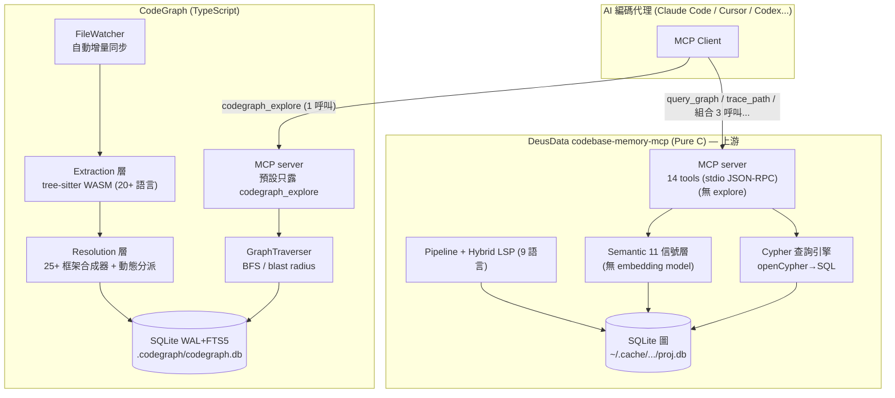
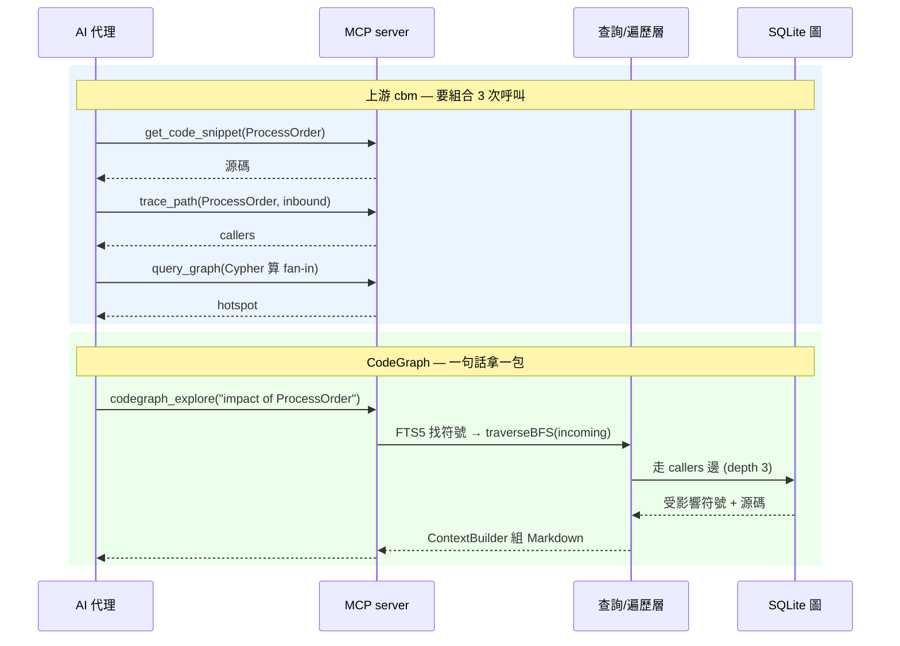
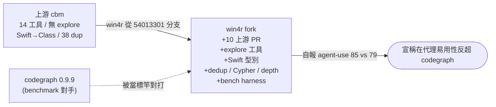
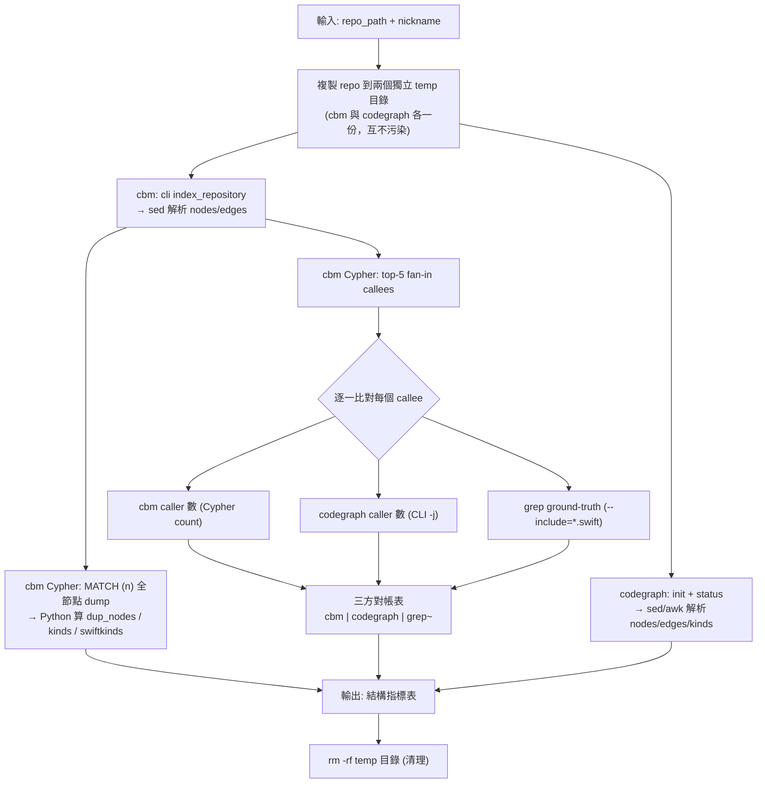
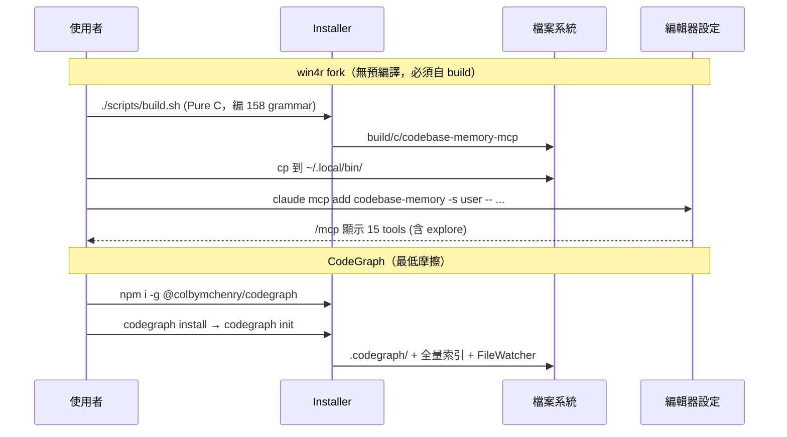
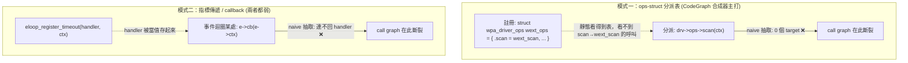
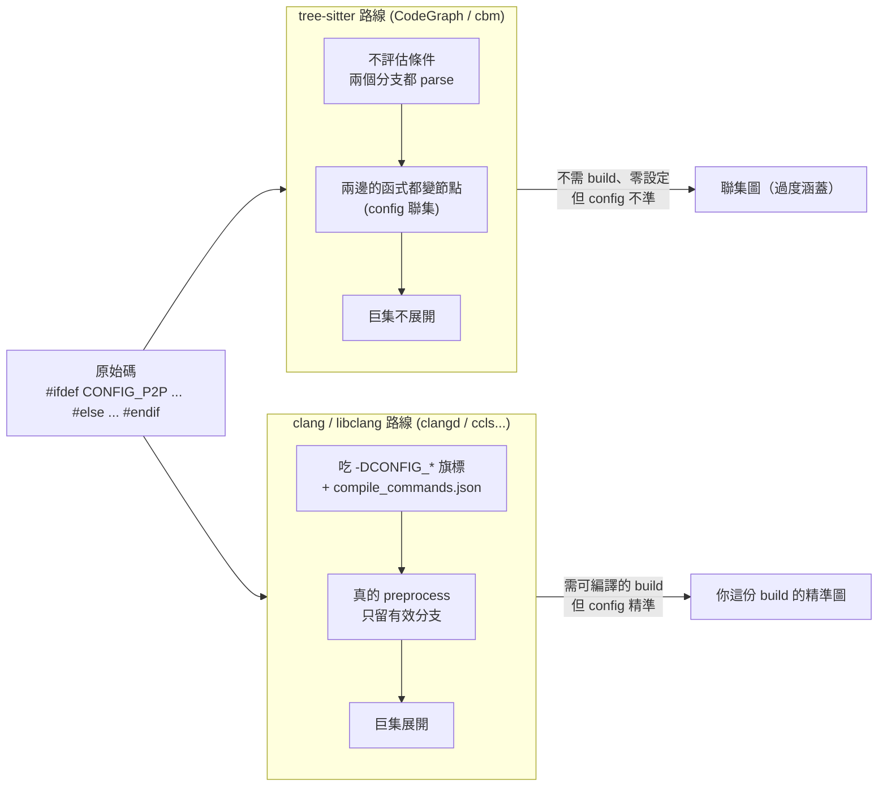

## 摘要（Summary）

這篇筆記做兩件事，順序很重要：

1. **先把「上游原版」`DeusData/codebase-memory-mcp` 和 `CodeGraph` 正面比較** —— 因為使用者最初給的 `win4r/codebase-memory-mcp-pro` 其實是 DeusData 的 fork，拿 fork 去比不公平，要比就比原始引擎。
2. **再從 git diff 解剖 win4r fork 改了什麼** —— 看它「想強化什麼、發現了什麼問題」，並把研究結果疊加上去。

三個專案要解決**同一個痛點**：AI 編碼代理（Claude Code、Cursor、Codex…）理解大型 codebase 時靠 `grep` / `Read` 一個一個翻檔案，造成**大量工具呼叫**與**爆量 token**。共同解法也一樣：**AST → 抽節點（function/class/route）與邊（calls/imports/…）→ 存成可查詢的圖 → 用 MCP 工具讓代理一次問到位**。

| 專案 | 角色 | 語言 | ⭐ | 建立 | 一句話定位 |
|------|------|------|-----|------|-----------|
| **DeusData/codebase-memory-mcp** | 上游原版 | Pure C | 12.8k | 2026-02-24 | 14 工具 + Cypher 查詢引擎，158 語言、零依賴靜態二進位 |
| **CodeGraph**（colbymchenry） | 獨立競品 | TypeScript | **53.7k** | 2026-01-18 | 單一 `codegraph_explore` 工具、結構精確、自動同步、框架感知 |
| **win4r/codebase-memory-mcp-pro** | DeusData 的 fork | Pure C | 73 | 2026-06-21 | 提前整合 10 個上游 PR + **自創 `explore` 工具補上代理易用性** |

> [!important] 本篇最關鍵的發現
> **win4r fork 之所以存在，正是因為「拿 cbm 去打 codegraph 會輸」。** fork 內藏的 `bench/BASELINE.md` 是一份白紙黑字的 head-to-head benchmark（cbm-pro vs codegraph 0.9.9，在真實 iOS Swift repo 上跑），明確記錄上游在三個維度輸給 codegraph，然後逐項把它補平、補超。換句話說，**使用者現在做的這個比較，win4r 早就做過，而且把結論變成了程式碼。**

> [!warning] 對前一版筆記的更正
> 前一版我把 `explore` 工具當成 codebase-memory-mcp「家族」的核心特色。經 diff 查證：**上游 DeusData 根本沒有 `explore` 工具（只有 14 個工具）；`explore` 是 win4r fork 新增的第 15 個工具**（純新增 +333 行、0 刪除）。本版已更正歸屬。

---

## 關鍵洞察（Key Insights）

- **上游 vs codegraph 是「查詢引擎 vs 單一按鈕」之爭**：上游給 14 個工具 + 完整 openCypher 查詢語言（最大表達力，但代理要會選工具、會寫 Cypher）；codegraph 只給一個 `codegraph_explore`（最低摩擦，賭「代理只想問一句話」）。參見 [[CLAUDE-MEMORY-ENGINE]] 對「記憶該存什麼、怎麼取」的同型張力。
- **語意 vs 結構的世界觀差異**：上游用 11 種本地信號算 `SEMANTICALLY_RELATED` 邊（無外部 embedding model）；codegraph **刻意拒絕語意相似度**，主張「精確 AST 邊 > 語義近似」以避免幻覺。
- **codegraph 的護城河是動態分派合成**：`handlers[action.type]()`、React `setState→render`、Celery `task.delay()` 這類靜態追不到的呼叫，codegraph 用 25+ 個框架專屬合成器補上（標 `provenance: heuristic`）。上游靠 9 語言 Hybrid LSP 補型別解析，路線不同。
- **fork 的改動主軸是「向 codegraph 看齊代理易用性」**：win4r 透過 benchmark 發現上游三個落後點 —— (a) 拿不到 one-call 的「源碼+影響範圍」（要 3 次呼叫），(b) Swift 型別全壓成 `Class`，(c) 同名節點重複發射。逐一補上後，agent-use 綜合分從 ~75 拉到 ~85（codegraph 79）。
- **成熟度三級跳**：codegraph 53.7k ⭐、上游 12.8k ⭐、fork 73 ⭐（且**不發佈預編譯二進位，要自己 build**）。star 數不等於技術優劣，但決定踩坑時有沒有人陪。

---

## 詳細內容（Details）

### 〈A〉上游 DeusData/codebase-memory-mcp — Pure C 查詢引擎

#### Why / What
- **Why**：file-by-file 探索 token 爆炸、grep 精準度低。
- **What**：高速知識圖譜引擎，宣稱秒級索引百萬行（README：158 語言、sub-ms 查詢、99% 少 token、單一靜態二進位零依賴）。對外 **14 個 MCP 工具**給 11 種編碼代理。
- **技術棧**：**Pure C**，內嵌（vendored）SQLite3 + tree-sitter（158 語言 grammar）+ yyjson + xxhash + zstd + 可選 libgit2 + mimalloc。

#### How — 核心機制
- **儲存**：`~/.cache/codebase-memory-mcp/<project>.db`（SQLite，in-memory + WAL）。節點有 `Function/Method/Class/Route/Resource…` label，邊有 26 種類型（`CALLS/IMPORTS/DATA_FLOWS/SEMANTICALLY_RELATED/HTTP_CALLS…`）。
- **索引管線**（`src/pipeline/`，多 pass）：definitions → k8s → Hybrid LSP cross-dispatch → calls → usages → semantic → 預 dump（decorator/route/similarity/semantic/complexity）。檔案 >50K 走平行管線。
- **Hybrid LSP**（9 語言：Python/TS/JS/PHP/C#/Go/C/C++/Java/Kotlin/Rust）做跨檔案型別解析。
- **11 信號語意相似度**（`src/semantic/`，**無外部 embedding model**）：TF-IDF、Random Indexing、MinHash、API/Type/Decorator signature、AST 結構輪廓、Data Flow、Graph Diffusion、Halstead-Lite，閾值 0.75 才發 `SEMANTICALLY_RELATED` 邊。
- **查詢**：核心是 `src/cypher/`（自實作的 openCypher 讀子集，把 `MATCH...WHERE...RETURN` 轉成 SQL）。
- **團隊共享**：可匯出 `.codebase-memory/graph.db.zst`（zstd -9，8–13:1）commit 進 git，隊友 clone 免重索引。

#### 上游 14 個 MCP 工具（實測 grep 自 `src/mcp/mcp.c`）
`index_repository`、`search_graph`、`query_graph`、`trace_path`、`get_code_snippet`、`search_code`、`get_graph_schema`、`get_architecture`、`detect_changes`、`manage_adr`、`ingest_traces`、`list_projects`、`index_status`、`delete_project`。

> [!warning] 上游沒有 one-call 探索工具
> 要拿到「目標源碼 + 誰呼叫它（blast radius）」，上游得**組合 3 次呼叫**：`get_code_snippet` + `trace_path` + `query_graph`。這正是 codegraph 用 1 次 `explore` 就做到、而上游輸掉的地方（見〈C〉）。

---

### 〈B〉CodeGraph — 單一工具、代理導向

#### Why / What
- **Why**：AI 代理一次流程常需 20+ 次 Read/Grep，重複探索、token 昂貴。
- **What**：本地優先程式碼智慧引擎，宣稱跨 7 個真實 repo 平均**工具呼叫減 58%、執行時間快 22%、token 成本降 35%**、檔案讀取趨近 0。v1.0.0 於 2026-06-12 發佈。
- **技術棧**：TypeScript + Node.js 22.5+，用 Node 內建 `node:sqlite`（WAL + FTS5，**無原生編譯依賴**）、`web-tree-sitter`（WASM）、commander。自實作 MCP stdio transport。

#### How — 核心機制
- **三階段**：(1) **Extraction**：tree-sitter（WASM）→ 22 語言提取器抽符號 → 寫 `nodes`/`edges`/`unresolved_refs`。(2) **Resolution**：解 `unresolved_refs`，優先序 = Import → 名稱比對 → **框架模式**（Django/Express/NestJS/Spring/Rails…），並**合成動態分派邊**（React `setState→render`、JSX、Celery/Sidekiq、React Native↔ObjC 橋接、C 函式指標）。(3) **Query**：FTS5 找初始符號 → `GraphTraverser.traverseBFS()` → `ContextBuilder` 組 Markdown。
- **儲存**：`.codegraph/codegraph.db`（SQLite WAL + FTS5）。**刻意不用向量、不用 Neo4j**。
- **自動同步**：`FileWatcher`（FSEvents/inotify/ReadDirectoryChangesW）+ 防抖增量重索引；編輯中的檔案標 ⚠️ staleness warning。
- **守護進程**：Direct / Proxy / Daemon 三模式，PPID 監控防孤兒進程（Windows 上曾有黑色 console 閃爍 issue #485/#510）。
- **工具哲學**：**預設只暴露 `codegraph_explore`**，其餘需 `CODEGRAPH_MCP_TOOLS` 開啟。信條：「一個工具做好一件事」、「即使出錯也回 success 形狀」（避免代理放棄使用）。

---

### 主比較矩陣：上游 DeusData vs CodeGraph

| 維度 | DeusData/codebase-memory-mcp（上游） | CodeGraph | 誰勝 |
|------|--------------------------------------|-----------|------|
| 實作語言 | Pure C（零依賴） | TypeScript / Node | 各有取捨 |
| 儲存 | SQLite（in-mem + WAL）+ 可選 zstd 工件 | SQLite（WAL + FTS5） | 平 |
| 查詢介面 | **openCypher** + 14 工具 | 主要 1 個 `explore`（其餘需開啟） | 表達力→上游；易用→codegraph |
| one-call「源碼+影響範圍」 | ❌ 要 3 次呼叫組合 | ✅ 1 次 `explore` | **CodeGraph** |
| 語意搜尋 | ✅ 11 信號（無 embedding） | ❌ 刻意不做 | 看世界觀 |
| 型別/跨檔案解析 | Hybrid LSP（9 語言） | Import + 名稱比對 + 框架模式 | 平（路線不同） |
| 動態分派合成 | ⚠️ 弱 | ✅ **25+ 框架合成器** | **CodeGraph** |
| 語言數 | **158** | 20+ | 上游 |
| 框架感知路由 | 部分（route_match pass） | ✅ **17+ 框架** | CodeGraph |
| 自動同步 | watcher（git polling） | ✅ **native FS 事件 + 防抖** | CodeGraph |
| 團隊共享圖 | ✅ commit `.db.zst` | ❌ 各自索引 | 上游 |
| Swift 型別保真度 | ⚠️ 全壓成 `Class` | ✅ struct/enum/protocol 區分 | **CodeGraph** |
| 成熟度 | 12.8k ⭐ | **53.7k ⭐ / v1.0** | CodeGraph |
| 安裝心智負擔 | 預編譯一行腳本 | `npm i -g`（含綑綁 Node） | 平 |

> [!important] 觀點：互補多於互斥
> 兩者是「兩種代理-codebase 介面的押注」。codegraph 押「低摩擦、結構精確、一句話拿一包」；上游押「圖資料庫級的查詢自由（Cypher）與語意召回」。**今天就要上線給團隊** → codegraph（成熟、自動同步、動態分派、53.7k 驗證）；**研究型程式碼分析 / 自訂圖查詢** → 上游（Cypher + 11 信號語意 + 158 語言）。

---

### 系統架構圖（System Architecture，Mermaid）



### 查詢時序圖（Query Sequence Diagram，Mermaid）

同一問題「`ProcessOrder` 改了會影響誰、長怎樣？」：



> [!note] 這張圖就是 fork 的起點
> 上游「3 呼叫 vs codegraph 1 呼叫」的差距，正是 win4r `bench/BASELINE.md` 量到的痛點，也是它新增 `explore` 工具的直接動機（見〈C〉）。

---

## 〈C〉win4r fork 改動剖析：它想強化什麼？發現什麼問題？

> [!info] 用 git diff + GitHub compare API 查證的事實
> fork 從上游 commit `54013301`（King Star，2026-06-19「return valid UTF-8 snippets」）分支，在 main 上疊了約 12 個 win4r 自己的 commit（2026-06-21～06-22）。**注意**：fork 之後上游又前進了 50+ 個 commit，所以 fork 現在在「其他上游修正」上反而落後 —— 它領先的只有自己加的那幾項。

### C-1. fork「發現的問題」：它對打 codegraph 輸了

fork 內藏 `bench/BASELINE.md` —— 一份誠實到近乎自嘲的 head-to-head benchmark（**cbm-pro vs codegraph 0.9.9**，測試 repo：LingoLearn-iOS，29 個 Swift 檔，2026-06-21）。它先記錄 **before（輸的狀態）**：

| 指標 | 上游 cbm | codegraph | 問題 |
|------|---------|-----------|------|
| **dup_nodes**（同名同檔同時發成 Method + Function） | **38** | 0 | 節點重複污染圖 |
| **Swift 型別保真度**（struct/enum/protocol/extension 是否區分） | **1**（全變 `Class`） | 5 | 型別語意全丟失 |
| **拿「源碼+blast-radius」要幾次呼叫** | **3 次** | **1 次**（`explore`） | 代理易用性差 |

> [!quote] bench/BASELINE.md 原文（節錄）
> *"Ergonomics / explore (the other M1 lever — not yet scriptable, **cbm has no explore**) … codegraph: **1 call**; cbm-pro: **3 calls** (get_code_snippet + trace_path + query_graph)."*

### C-2. fork「想強化什麼」：逐項把差距補平、補超

從 commit log + diff 看出 fork 的改動分兩類：

#### 類型一：提前整合上游待合併的 10 個 PR（搶先 bug fix）
README「Fork notice」白紙黑字列出（皆連結上游 PR 編號）：

| 主題 | 上游 PR | 修了什麼 |
|------|---------|---------|
| 增量索引正確性 | #528 | 編輯檔案不再讓 inbound 跨檔 `CALLS` 邊變孤兒 |
| Cypher `WITH` 聚合帶屬性 | #465 | `query_graph` 經 `WITH` 後節點屬性不再變空 |
| label 過濾遍歷截斷 | #412 | label-filtered 遍歷不再默默截在 10 列 |
| `detect_changes` honor `since` | #464 | 尊重 `since` 參數 |
| 定義優先名稱解析 | #466 | 回報歧義而非亂猜 |
| `get_code_snippet` 合法 UTF-8 | #526 | 片段不再吐壞 UTF-8 |
| 堆疊溢位修正 | #475 | `append_args_json` stack-buffer-overflow |
| JSON 控制字元跳脫 | #527 | — |
| ADR 跨全量重索引保留 | #539 | — |
| libgit2 ≥ 1.8 build fix | #512 | macOS Homebrew libgit2 編得過 |

#### 類型二：fork 原創功能（直接針對 benchmark 落後點）

| fork 改動 | 對應的輸點 | diff 規模 / 證據 |
|-----------|-----------|-----------------|
| **新增 `explore` 工具**（第 15 個） | 3 呼叫 → 1 呼叫 | `src/mcp/mcp.c` **+302 / −0**、`tests/test_mcp.c` +31。一次回傳 blast-radius（含 fan-in hotspot 標記）+ 1-hop 鄰居 + 逐行源碼 + Cypher 逃生口 |
| **idiomatic Swift 型別** | 保真度 1 → ≥5 | `Struct`/`Enum`/`Actor` 變獨立 label（不再全壓 `Class`）；enum cases 抽成 `EnumCase` 節點 |
| **Swift enum-static dedup** | dup_nodes 38 → 0 | `enum` 的 `static func` 不再被雙重發成 Method + Function |
| **Cypher 聚合修正** | （超越 codegraph） | `RETURN type(r), count(*)` 現在按函式值分組（每邊型一列），不再全塌成一組 |
| **`detect_changes` 遞移 blast radius** | （超越 codegraph） | `depth` 參數產生遞移 caller 影響，每個標 `hop` + `transitive` |
| **head-to-head bench harness** | 量化全部 | `bench/headtohead.sh` + `bench/BASELINE.md` |

### C-3. fork 的 after 結果（自報）

| 指標 | baseline cbm | after M1 | codegraph | 狀態 |
|------|--------------|----------|-----------|------|
| dup_nodes | 38 | **0** | 0 | ✅ 追平 |
| `explore` 1-call | ✗（3 呼叫） | **✅ 1 呼叫** | ✅ | ✅ 追平 |
| explore caller 歸因 | — | **精確 + ⚠hotspot fan-in** | 不精確、無 hotspot | ✅ 超越 |
| explore Cypher 逃生口 | — | ✅ | ✗ | ✅ 超越 |
| explore 自動展開鄰居 | — | ✗（聚焦式） | ✅ | codegraph 仍勝 |
| **agent-use 綜合分**（主觀、自稱已做公平性檢查） | ~75 | **~85** | 79 | fork 自稱反超 |



> [!warning] 對 fork 自報數據的保留態度
> `agent-use 85 vs 79` 是 win4r **自己定義指標、自己評分**（雖然檔案裡註明「fairness-checked」），且只在**單一 29 檔的 Swift repo** 上測。dup_nodes 0、explore 1-call 是可驗證的客觀事實；但「綜合分反超」屬主觀，不應照單全收。

---

## 〈D〉win4r 的 benchmark 怎麼做的？方法論完整解剖

> [!info] 一手資料
> 本節基於實際讀取 fork 的兩個檔案：`bench/headtohead.sh`（65 行 bash）與 `bench/BASELINE.md`（結果報告）。下方程式碼為原文節錄。

### D-1. Bench 的「受測物」是什麼？

| 項目 | 內容 |
|------|------|
| **受測專案（被索引的 repo）** | `LingoLearn-iOS-main` —— 一個 iOS 學語言 App，**29 個 Swift 檔**。腳本本身吃 `<repo_path>` 參數，所以可換任何 repo；BASELINE 用的是這個。 |
| **受測工具 A** | `codebase-memory-mcp`（cbm，fork 自己的二進位） |
| **受測工具 B** | `codegraph 0.9.9`（競品） |
| **第三方裁判（ground truth）** | `grep` —— 用純文字比對當「呼叫數的雜訊上界」，誰都不能自己當裁判 |

> [!note] 鑑識細節
> 腳本第 12 行的預設 cbm 路徑寫死成 `/Users/charlesqin/.local/bin/codebase-memory-mcp` —— 暗示 win4r 本名可能是 **Charles Qin**。這是 commit 之外的另一個身分線索。

### D-2. Bench 程式怎麼寫的？（核心原理）

整支腳本的設計哲學寫在開頭註解，這是理解一切的鑰匙：

> [!quote] headtohead.sh 開頭三行
> ```bash
> # headtohead.sh — deterministic head-to-head: codebase-memory-mcp (cbm) vs codegraph.
> # Re-run after each workstream to MEASURE movement (no self-grading).
> ```

三個關鍵字定義了它的方法論：
1. **deterministic（確定性）** —— 同一 repo 跑兩次結果一樣，沒有隨機/主觀。
2. **MEASURE movement（量測位移）** —— 不是一次性打分，而是「每完成一個 workstream（WS）就重跑」，證明數字真的動了（before → after）。
3. **no self-grading（不自評）** —— 用 grep 當中立第三方，工具不能給自己打分。

#### 它如何把「圖」變成「可比的數字」

核心技巧是 **用 cbm 自己的 Cypher 查詢語言把圖 dump 成 JSON，再用 Python 算指標**。例如算重複節點與型別豐富度：

```bash
qcbm "MATCH (n) RETURN n.name AS nm, n.label AS l, n.file_path AS f" | python3 -c "
import sys,json
from collections import defaultdict,Counter
rows=json.load(sys.stdin).get('rows',[])
by=defaultdict(set); kinds=Counter()
for nm,l,f in rows:
    kinds[l]+=1
    if nm: by[(nm,f)].add(l)
dups=[k for k,s in by.items() if 'Method' in s and 'Function' in s]
# Swift type-kind fidelity: are struct/enum/protocol/extension distinct, or lumped into Class?
swiftkinds=sum(1 for k in kinds if k in ('Struct','Enum','Protocol','Extension','EnumCase','Actor','Component','Class'))
print(f'CBM_DUP={len(dups)}'); print(f'CBM_KINDS={len(kinds)}'); print(f'CBM_SWIFTKINDS={swiftkinds}')
"
```

> [!important] dup_nodes 的精妙定義
> 重複節點的判定鍵是 `(name, file)`，因為 cbm 的 bug 會把**同一個源碼符號**用**不同的 qualified_name** 同時發成 `Method` 和 `Function`。所以只要某個 `(名稱, 檔案)` 同時掛著 Method 和 Function 兩個 label，就算一個 dup。這是「測一個具體建模 bug」，不是泛泛的重複。

對 codegraph 則改用它自己的 CLI 介面取數（不同工具用各自原生介面，公平）：

```bash
codegraph init "$CG_WORK" >/dev/null 2>&1
CG_STAT=$(codegraph status "$CG_WORK" 2>/dev/null)
CG_N=$(echo "$CG_STAT" | sed -n 's/.*Nodes:[[:space:]]*\([0-9]*\).*/\1/p' | head -1)
CG_KINDS=$(echo "$CG_STAT" | awk '/Nodes by Kind/{f=1;next} f&&/^  [a-z]/{c++} f&&/^$/{f=0} END{print c+0}')
```

#### 呼叫圖對帳（call-graph parity）——最聰明的設計

它不直接信任任一工具的 caller 數，而是**三方對帳**：先用 cbm 的 Cypher 找出「被呼叫最多次的前 5 個函數」（fan-in 最高），再對每個函數同時問 cbm、codegraph、grep 三邊的呼叫數：

```bash
for sym in $CALLEES; do
  cb=$(qcbm "MATCH (a)-[:CALLS]->(b) WHERE b.name='$sym' RETURN count(a) AS n" | ...)
  cg=$(codegraph callers "$sym" -p "$CG_WORK" -j 2>/dev/null | ...)
  gt=$(grep -rEo "[^a-zA-Z_]$sym\s*\(" "$WORK" --include='*.swift' 2>/dev/null | wc -l)
  printf "  %-28s cbm=%-3s codegraph=%-3s grep~%-3s\n" "$sym" "${cb:-?}" "${cg:-?}" "$gt"
done
```

grep 是「雜訊上界」（會誤算註解、字串裡的同名），但它**中立**：若 cbm 和 codegraph 都接近 grep，代表兩者的 CALLS 邊都抓得準；若某一方遠低於 grep，代表它漏抓了呼叫。

### D-3. Bench 程式流程圖（Mermaid）



### D-4. Bench 的架構與原理：為什麼測這幾項？

整套 bench 分兩層，**這是最重要的觀念**：

```
┌─────────────────────────────────────────────────────────────┐
│  第一層：headtohead.sh 量的「客觀確定性指標」(可複現、無自評)    │
│    nodes / edges / dup_nodes / kind richness / call parity     │
├─────────────────────────────────────────────────────────────┤
│  第二層：BASELINE.md 的「agent-use 綜合分」(主觀、人工評)        │
│    explore 易用性、cypher 逃生口、hotspot... → 85 vs 79         │
└─────────────────────────────────────────────────────────────┘
```

| 測的指標 | 屬於哪層 | **為什麼要測它**（對應的設計目標） |
|---------|---------|----------------------------------|
| nodes / edges | 客觀 | 圖規模 sanity check，確認兩工具索引的是同一份碼、規模可比 |
| **dup_nodes** | 客觀 | 直接量 cbm 的**建模 bug**（同符號雙重發射）。codegraph 結構上是 0，所以這是「cbm 欠 codegraph 的債」，修好 → 0 即追平 |
| **kind richness / swiftkinds** | 客觀 | 量**型別保真度**。Swift 全壓成 `Class`（=1）vs 區分 struct/enum/protocol（=5）。WS2b 的目標就是把這格從 1 拉到 ≥5 |
| **call-graph parity** | 客觀（grep 當錨） | 量**圖的呼叫邊準不準**。用中立 grep 當地面真值，避免「兩個工具各說各話」 |
| explore 1-call、hotspot、cypher 逃生口 | 主觀 | 量**代理易用性** —— 這是 fork 真正想贏的戰場，但無法純靠腳本量化，故落在 BASELINE.md 人工評 |

**原理總結**：win4r 的 bench 是一種「**confirm the failure before fixing it**（先確認失敗再修）」的迴歸測試框架 —— 把「我比 codegraph 差在哪」翻譯成**可複現的數字**，每修一項（WS1 explore、WS2a dedup、WS2b Swift kinds）就重跑一次，用 before/after 證明位移。這正呼應 [[2026-06-07-LOOP-ENGINEERING-THREE-SOURCE-EXPERT-SYNTHESIS]] 的 **VERIFY → ITERATE** 迴圈：先有可驗證的成功標準，再迭代。

> [!warning] 這個 bench 的方法論限制（誠實批判）
> 1. **樣本極小且單一語言**：只跑 1 個 29 檔的 Swift repo，grep ground-truth 還寫死 `--include='*.swift'`（第 62 行），結論難外推到 Python/Go/大型 repo。
> 2. **codegraph 的 dup_nodes 是「假設 0」不是「量出來 0」**：第 53 行直接 `printf ... "0"` 硬寫，腳本並沒有真的去數 codegraph 的重複節點。
> 3. **callee 清單由 cbm 自己挑**：top-5 fan-in 用 cbm 的 Cypher 產生（第 56 行），等於「考題由其中一方出」，對 codegraph 略不公平。
> 4. **grep 是上界不是真值**：會把註解、字串、定義本身都算進去，只能當「不應超過」的參考，不能當精確答案。
> 5. **第二層綜合分仍是自評**：85 vs 79 出自人工、win4r 自定義權重，雖註明 fairness-checked，仍非第三方盲測。

> [!tip] 可借鏡的做法
> 撇開「fork 自吹」的部分，這支腳本本身是**評估任何 code-graph / 檢索工具的好起手式**：複製 repo 到隔離 temp、各用原生介面取數、用中立工具（grep/LSP）當錨、把主觀與客觀指標分兩層。你可以直接拿 `headtohead.sh` 改成自己的評測 harness。

---

## 安裝流程（Installation Flow）

> [!important] fork 與上游的安裝差異
> **上游**有預編譯二進位（`curl … install.sh | bash`）。**fork 刻意不發佈預編譯 release**，README 明說「build the integrated binary yourself」，須 `./scripts/build.sh`（首次編 158 個 tree-sitter grammar 要幾分鐘）。這對「想直接用」的人是門檻。

| 項目 | 上游 DeusData | win4r fork | CodeGraph |
|------|--------------|------------|-----------|
| 取得二進位 | `install.sh` 預編譯 | **只能自己 build** | `npm i -g`（含綑綁 Node） |
| 接 Claude Code | `codebase-memory-mcp install` 自動偵測 11 編輯器 | `claude mcp add codebase-memory -s user -- ~/.local/bin/...` | `codegraph install` 互動式 |
| 索引 DB | `~/.cache/codebase-memory-mcp/<proj>.db` | 同上 | `.codegraph/codegraph.db`（專案內） |
| 團隊共享 | `.codebase-memory/graph.db.zst` commit | 同上 | 各自 init |

#### 安裝時序圖（Mermaid）



---

## 使用案例地圖（Use Case Map）

| # | 使用案例 | 上游 cbm 路徑 | CodeGraph 路徑 | fork 改善 |
|---|---------|---------------|-----------------|-----------|
| 1 | 「源碼 + 誰呼叫它？」 | 3 呼叫組合 | `codegraph_explore` 1 呼叫 | ✅ 新增 `explore` 追平 |
| 2 | 「改了會影響誰？」 | `detect_changes` | `getImpactRadius()` | ✅ 加遞移 depth |
| 3 | 「`/api/users` 在哪處理？」 | `query_graph` Cypher | 框架 resolver 發 route 邊 | — |
| 4 | 「找語意相近函數」 | `search_graph(semantic_query)` | ❌ 不支援 | — |
| 5 | 「React 何時 re-render？」 | 一般 CALLS（追不到動態） | `callback-synthesizer` 合成 | — |
| 6 | 「Swift struct/enum 是哪種？」 | ⚠️ 全變 Class | ✅ 區分 | ✅ 加 Struct/Enum/Actor |

---

## 〈E〉C 語言場景專論：函式指標、指標傳遞與評估計畫

> [!info] 本節範圍
> 針對「未來要分析 C 語言程式碼（如 [digsrc/wpa_supplicant](https://github.com/digsrc/wpa_supplicant)）」的需求，做**研究與評估**，並提出**如何試的計畫**。本節**尚未對任一工具做實測索引**；下方數字若標「實測」是指讀原始碼/grep 的靜態觀察，工具能力對比是基於閱讀兩者的程式碼與文件，待 E-5 計畫執行後才會有實跑數據。

### E-1. C codebase 快速判斷比較表

| 維度（純 C 場景） | CodeGraph | codebase-memory-mcp（上游 / fork） | 初步判斷 |
|------------------|-----------|-----------------------------------|---------|
| **函式指標分派表**（`struct ops` → `p->fn()`） | ✅ **專用合成器** `c-fnptr-synthesizer.ts`（#932），以 `(struct型別, 欄位)` 為鍵橋接 | ⚠️ 變數級追蹤 + designated init 解析，**無專打分派表的 whole-graph pass** | **wpa 這類 → CodeGraph 較穩** |
| **函式指標變數**（`fp = &foo; fp()`） | 合成器涵蓋 assignment 綁定 | ✅ `c_lsp.c` 變數級 `fp_var_names→fp_target_qns` 追蹤 | 平 |
| **指標傳遞 / callback 註冊**（`eloop_register(cb)`，cb 之後被間接呼叫） | ⚠️ 函式當值傳遞 → reference 邊，但「事件迴圈→cb」call 邊難自動連 | ⚠️ 同樣難（靜態看不到註冊後的延遲呼叫） | **兩者都弱，需緩解** |
| **巨集密度高**（`#define` 包呼叫） | tree-sitter **不展開巨集** ⚠️ | ✅ Hybrid LSP 對 C/C++ 處理 macros、typedef chains | macro 多 → cbm 較準 |
| **手動查候選**（列舉某欄位註冊了哪些函式） | ❌ 無查詢語言 | ✅ **`query_graph` Cypher** 可直接撈 | **cbm 勝** |
| **大型 repo**（wpa ≈ 620 檔） | 宣稱 -58% 工具呼叫、-22% 時間 | 宣稱 28M LOC/3 分鐘、sub-ms 查詢 | 都宣稱可吃，待實測 |
| **動態邊標記**（可信度透明） | ✅ `provenance:'heuristic'` | 邊有 `properties_json`（confidence） | 平 |
| **自動同步**（邊改邊查） | ✅ FileWatcher | watcher（git polling） | CodeGraph 較即時 |
| **純 C 安裝門檻** | `npm i -g` | fork 需自 build（編 158 grammar） | CodeGraph 較易 |

> [!tip] 一句話初判
> **函式指標分派表（ops struct）密集的 C** → 先試 **CodeGraph**（有專用合成器）。**但若你需要「列舉某 ops 欄位註冊了哪些 handler」或巨集很多** → **cbm 的 Cypher + Hybrid LSP** 反而是更可控的工具。最務實的答案可能是**兩者並用**：CodeGraph 自動補分派邊、cbm 的 Cypher 當人工驗證的查詢層。

### E-2. 為什麼函式指標 / 指標傳遞會「影響判斷」？

你的擔心完全正確，而且對 wpa_supplicant 這類程式**影響極大**。原因是 C 沒有 class/virtual，**多型全靠函式指標**，所以「呼叫圖（call graph）」的關鍵連結恰好就是靜態分析最難的地方。實測 wpa_supplicant 的規模：

| 模式 | 實測數字（grep） | 對呼叫圖的衝擊 |
|------|-----------------|---------------|
| `struct wpa_driver_ops` 的函式指標欄位 | **128 個** | driver 抽象層整層靠它分派，漏掉就等於 driver↔core 斷鏈 |
| `eloop_register_*`（事件迴圈 callback 註冊） | **289 次** | 幾乎所有非同步邏輯的進入點都是「註冊後延遲呼叫」 |
| ops struct 種類 | `wpa_driver_ops` / `bgscan_ops` / `autoscan_ops` / macsec ops / EAP method… | 整個架構是「介面=函式指標表」 |

#### 兩種會出問題的具體模式



- **模式一（分派表）**：靜態抽取看得到 `wext_ops = {.scan = wext_scan}` 這張表（資料），也看得到 `drv->ops->scan()` 這個呼叫，但**看不到兩者的連線**——因為 `drv->ops` 在執行期才綁定。結果：問「誰實作了 scan」會得到空答案，或 `scan` 看起來沒人呼叫。
- **模式二（指標傳遞）**：`handler` 被當參數傳進 `eloop_register_timeout` 存起來，之後由事件迴圈間接呼叫。靜態上 `handler` 只是個「被引用的值」，**事件迴圈的呼叫點連不回 handler**。這是 callback / 延遲呼叫的通病。

### E-3. 兩個工具各自怎麼處理（附程式碼證據）

#### CodeGraph：專用 `c-fnptr-synthesizer.ts`（針對模式一）
原始碼開頭註解寫得很清楚（這是 issue #932 的產物）：

> [!quote] c-fnptr-synthesizer.ts 設計註解（節錄）
> *"C/C++ polymorphism is the function pointer… concrete functions are registered into it through a table… the dispatcher calls through it indirectly (`p->fn(argv)`). Static extraction captures neither the registration→field binding nor the indirect call… This bridges it, keyed by **(struct type, fn-pointer field)**."*

它涵蓋：positional 表 `{"add", cmd_add}`、designated `.fn = cmd_add`、assignment `x->fn = cmd_add`；分派 `recv->field()`（recv 由參數/區域變數解析回 struct 型別）；以及 **field←field 傳遞**（`a->f = b->g`，即 wpa 常見的 `h->func = found->fn` 形狀）。所有合成邊標 `provenance:'heuristic'`，有 `FANOUT_CAP = 300`（git 的命令表約 150 是合法 fan-out）。

> [!warning] CodeGraph 的代價：過度近似（over-approximation）
> 它把 dispatcher 連到**該 (struct,欄位) 註冊過的所有 handler**，即使執行期只會走一個。對「理解程式碼」這是對的（寧可列出候選），但別把它當精確的 runtime call graph。模式二（eloop callback）**不在它的合成器範圍**。

#### cbm：變數級函式指標追蹤（通用 LSP 的一環）
`internal/cbm/lsp/c_lsp.c` 與 `c_lsp.h` 顯示它的能力：

```c
// c_lsp.h:51 — 函式指標目標：變數名 → 目標函式 QN（注意：是「變數級」，不是 (struct,欄位) 級）
const char **fp_var_names;
const char **fp_target_qns;
```

它也解析 designated initializer（`c_lsp.c:3977 initializer_pair / field_designator`）與 member call（`c_lsp.c:3380 "member call: type_qn=… field=…"`）。但它的函式指標追蹤主結構是 **var→target**，屬於通用型別解析，**沒有一個專門「橋接分派表」的 whole-graph pass**。所以面對 `ops->scan()` 跨註冊點的解析，會比 CodeGraph 的 (struct,欄位) 專用橋接更碰運氣。

> [!note] 公平結論
> 不是「cbm 不能處理函式指標」——它能解析表、能追變數級指標。差別在 **CodeGraph 有一個專為 ops-struct 分派表設計的合成器**，而 cbm 的是通用 LSP 的副產品。對 wpa 這種「整個架構=函式指標表」的程式，這個差別會被放大。

### E-4. 如何解決 / 緩解這些影響

> [!important] 緩解策略（從工具選擇到查詢技巧）
> 1. **選對工具當主力**：分派表密集 → 用 CodeGraph 的合成器自動補邊；但保留 cbm 當「驗證/查候選」的第二意見。
> 2. **以「註冊點」為錨，而非「呼叫點」**：兩工具都看得到靜態的 `wext_ops = {.scan = wext_scan}`。即使 `ops->scan()` 的呼叫邊缺失，也可改問「**`wpa_driver_ops.scan` 這個欄位被指派了哪些函式**」來列舉候選——這是 data-flow 問題，比「`ops->scan()` 呼叫了誰」（runtime 問題）可靠得多。用 cbm 的 Cypher 最直接。
> 3. **接受過度近似 + 標記可信度**：把合成邊當「候選集」而非「精確答案」，永遠看 `provenance:'heuristic'`。
> 4. **用中立工具當地面真值交叉驗證**：對函式指標分派，`grep`/`cflow`/`ctags`/`cscope`（cscope 對 C 的「找函式被誰呼叫」很強）做 ground-truth，比對工具有沒有漏/多。
> 5. **模式二（callback）另解**：eloop callback 這種延遲呼叫，靜態工具幾乎都連不回去；緩解法是**手動建立「註冊 API → callback 慣例」的對照**（如 `eloop_register_timeout` 的第 1 個函式參數就是 handler），或在查詢時直接問「`handler` 被當值傳給了哪些 API」。
> 6. **巨集**：wpa 巨集多，CodeGraph 不展開巨集會漏；必要時對關鍵巨集先 `gcc -E` 預處理再索引，或改用 cbm 的 Hybrid LSP（宣稱處理 macros）。

### E-5. 評估計畫（如何試 —— 尚未執行）

> [!important] 這是「計畫」不是「結果」
> 以下定義**怎麼公平地試**，但**還沒跑**。等你確認方向後再執行。刻意複用 win4r 的 `bench/headtohead.sh` 精神（deterministic、用中立工具當錨、客觀/主觀分層）。

**Phase 0 — 縮小範圍（避免一開始就索引 620 檔）**
- 取一個能代表函式指標難題的子集：`src/drivers/driver.h`（定義 `wpa_driver_ops` 128 欄位）+ 2–3 個實作（如 `driver_wext.c`、`driver_nl80211.c`）+ 分派點（`wpa_supplicant/driver_i.h` 的 `wpa_drv_*` wrapper）。
- 同時選一段 eloop callback 流程（如 `wpa_supplicant/scan.c` 的 `eloop_register_timeout` → scan 完成 callback）。

**Phase 1 — 各自索引（隔離、不互相污染）**
- CodeGraph：`codegraph init <subset>`。
- cbm：`codebase-memory-mcp cli index_repository`（用獨立 `CBM_CACHE_DIR`）。

**Phase 2 — 設計針對函式指標的測試查詢**

| # | 問題 | 模式 | 成功判準 |
|---|------|------|---------|
| Q1 | 「`wext_scan` 被誰呼叫？」 | 分派表 | 工具是否把 `wpa_drv_scan`/`drv->ops->scan()` 連到 `wext_scan` |
| Q2 | 「`wpa_drv_scan()` 會分派到哪些實作？」 | 分派表（反向） | 是否列出所有註冊到 `.scan` 的 driver handler（過度近似可接受） |
| Q3 | 「`wpa_driver_ops.scan` 欄位被指派了哪些函式？」 | 註冊點查候選 | cbm Cypher 應可精確列舉；CodeGraph 看 metadata.via |
| Q4 | 「某 `eloop_register_timeout` 的 handler 之後在哪被呼叫？」 | 指標傳遞/callback | 預期**兩者都連不到事件迴圈**——驗證此盲區 |

**Phase 3 — 地面真值（ground truth）**
- 用 `cscope -L -3 wext_scan`（找呼叫者）、`cflow`、人工讀碼，建立「正確答案」。
- 對 Q4 特別記錄「正確的延遲呼叫點」，量化兩工具漏了多少。

**Phase 4 — 評分指標（客觀，沿用 headtohead.sh 風格）**
- **分派邊召回率**：應有的 dispatcher→handler 邊，工具找到幾成。
- **分派邊精確率**：合成邊有沒有亂連到沒註冊的函式（CodeGraph 的精度邊界測試可借鏡）。
- **候選列舉完整度**（Q3）：列出的 handler 是否涵蓋所有 driver。
- **callback 盲區大小**（Q4）：延遲呼叫漏連的比例。

**Phase 5 — 決策**
- 若 CodeGraph 的分派邊召回明顯高 → wpa 類專案主力用它。
- 若 cbm 的 Cypher 候選列舉更可控、巨集處理更準 → 用它當驗證層。
- 把結果回寫本筆記的 E-1 表（把「初步判斷」換成「實測判斷」）。

> [!warning] 計畫的已知風險
> (a) 子集切太小會讓跨檔分派失真（driver 註冊與分派分屬不同檔）；(b) fork 需先自 build 成功；(c) cscope/cflow 對函式指標同樣有上界誤差，需人工複核關鍵案例；(d) eloop 盲區可能兩者皆 0 分，那結論會是「函式指標分派 CodeGraph 勝、callback 兩者皆需人工補」。

---

## 〈F〉C 前置處理器難題：`#ifdef` / `#undef` / 巨集沒展開怎麼辦？

> [!important] 三句話先回答你的問題
> 1. **它需要你的 compiler 參數嗎？** —— **不需要**。這兩個工具都用 **tree-sitter（語法解析器，不是前置處理器）**，根本不跑 preprocessor，所以不吃 `-DCONFIG_*` 旗標。
> 2. **`#ifdef` 沒確認時怎麼判斷？** —— **它不判斷**。tree-sitter 把 `#ifdef/#else` 的**兩個分支都當語法解析、都抽成節點**，不評估條件。等於給你一張「所有 config 的聯集圖」。
> 3. **要先產生 header / 用 compile_commands.json 嗎？** —— 對「準確度」有幫助但**治標不治本**：cbm 完全不讀 compile_commands.json；CodeGraph 會讀，但**只用來找 include 目錄**（改善 `#include` 解析），**不會**拿去解 `#ifdef`。要真正「只看你這份 build 的有效 config」，得用 **clang/libclang 路線的工具**（見 F-4）。

### F-1. 原理：tree-sitter 是 parser，不是 preprocessor

C 的編譯分兩步：**前置處理（preprocess：展開 `#include`、`#define`、評估 `#ifdef`）→ 編譯（parse + 產碼）**。真正的編譯器（gcc/clang）會先 preprocess 再 parse。但 **tree-sitter 跳過 preprocess，直接 parse 原始文字**。tree-sitter 的 C grammar 有 `preproc_ifdef`、`preproc_if`、`preproc_def` 這些節點，但它只是把指令**當語法結構記下來，不執行**。



### F-2. 對 `#ifdef` / `#undef` / 巨集的實際行為

| 前置處理結構 | tree-sitter 工具（兩者）怎麼處理 | 後果 |
|------------|-------------------------------|------|
| `#ifdef X ... #else ... #endif` | **兩個分支都解析、都抽節點**，不看 X 是否定義 | **過度涵蓋**：圖裡有你 build 根本沒編進去的函式 |
| `#if defined(A) && !defined(B)` | 條件完全不評估 | 同上 |
| `#undef X` | **忽略**，對抽取無影響 | `#undef` 後的條件分支判斷會錯 |
| `#define FOO(x) bar(x)`（巨集包呼叫） | **不展開**；只看到 `FOO(...)` token | **涵蓋不足**：巨集產生的呼叫/定義漏抓 |
| 巨集產生函式名（如 `DEFINE_HANDLER(scan)`） | 看不到生成的 `scan_handler` | 該符號在圖中**不存在** |

wpa_supplicant 把這個難題放到極致（實測 grep）：

| 指標 | 實測數字 | 意義 |
|------|---------|------|
| `#ifdef/#ifndef/#if defined/#elif` 總數 | **3,141** | 條件編譯無所不在 |
| 不同 `CONFIG_*` 開關 | **174 種** | 哪些函式存在，由 `.config` 決定 |
| 最密集開關 | `CONFIG_P2P`(331)、`CONFIG_IEEE80211W`(234)、`CONFIG_IEEE80211R`(222)、`CONFIG_WPS`(178) | 大段功能整塊條件編譯 |
| `#undef` | **86** | 重新定義/取消，加劇判斷難度 |

> [!warning] 對 wpa 的具體衝擊
> 你的 `.config` 若沒開 `CONFIG_P2P`，真實 build 裡那 331 處 P2P 碼根本不存在；但 tree-sitter 工具**照樣把它們全抽進圖**。於是「誰呼叫 `p2p_init`」會得到一堆**你這份 build 其實編不到**的答案。反過來，巨集生成的符號又會**漏掉**。這不是 bug，是 tree-sitter「不 build 也能跑」的設計代價。

### F-3. 兩工具的差異（附程式碼證據）

| | cbm（codebase-memory-mcp） | CodeGraph |
|---|---------------------------|-----------|
| 解析器 | vendored tree-sitter C | web-tree-sitter（WASM） |
| 評估 `#ifdef`？ | ❌ 否 | ❌ 否 |
| 需要 compiler flags？ | ❌ 否 | ❌ 否 |
| 讀 `compile_commands.json`？ | ❌ **完全不讀** | ⚠️ **讀，但只為找 include 目錄** |
| 巨集處理 | ✅ **有真前置處理器**：`internal/cbm/preprocessor.cpp` 用 **simplecpp**（cppcheck 同款）做第二階段——展開巨集、重抓「巨集藏起來的 CALLS」，並把 `#define` 抽成 **Macro 節點**（#375）。實測整包 wpa 抽出 **3,395 個 Macro 節點** | ❌ 不展開、不抽巨集（實測 0 個 macro 節點） |

> [!warning] 對本表「巨集處理」的更正（2026-06-26 實測後）
> 本節初版曾表述「cbm 也不展開巨集」，**經 build cbm 實測更正**：cbm 是**雙階段**——tree-sitter 抽定義（原始碼，看得到所有 `#ifdef` 分支）＋ simplecpp 展開巨集重抓 CALLS。**但實測發現一個落差**：wpa 的巨集多半包**外部 libc**（`os_memcpy`→`memcpy`），而 memcpy 在專案內無 Function 節點可連，所以 cbm 的展開**沒有轉化成額外 CALLS 邊**——其巨集能力體現在「3,395 個 Macro 節點」而非「多出的呼叫邊」。完整實測見 〈G〉。

CodeGraph 用 compile_commands.json 的真相（原始碼 `src/resolution/import-resolver.ts`）：

> [!quote] import-resolver.ts（節錄）
> *"Look for compile_commands.json (Clang compilation database)… try to load **include directories** from compile_commands.json. Returns null if no compilation database is found (so the heuristic [probing] is used)."*

—— 它只拿 compile_commands.json 裡的 **include 路徑**來把 `#include` 連準，**沒有**用裡面的 `-DCONFIG_*` 去解 `#ifdef`。所以給它 compile_commands.json 能改善「跨檔 header 連結」，**不能**讓它只看有效 config。

### F-4. 那要怎麼辦？（緩解階梯，由輕到重）

> [!important] 依「你要多準」選方案
> **階梯一～二是 tree-sitter 工具內可做的；階梯三才是真正解 `#ifdef` 的方法，但要換工具類別。**

1. **接受「聯集圖」並在查詢時心裡有數**（最省力）
   把結果當「所有 config 的可能性」。對「理解架構」常夠用；對「我這份 build 到底有什麼」會錯。查詢時用檔案/模組知識自行過濾。

2. **先把 `#include` 連準**（中等，只治 include 不治 ifdef）
   - CodeGraph：用 `bear -- make` 或 CMake `-DCMAKE_EXPORT_COMPILE_COMMANDS=ON` 產 `compile_commands.json`，放專案根目錄 → header 邊變準。
   - 兩者：先跑 wpa 的設定流程把**生成的 header** 產出來（否則 `#include` 目標不存在），cross-file 邊才完整。

3. **索引「前置處理後」的碼**（最準，但最重）—— 真正解 `#ifdef` 與巨集
   - 用你的實際旗標把碼 preprocess 成 `.i`：`gcc -E -DCONFIG_WPS -DCONFIG_P2P … foo.c > foo.i`（或讓 build 系統吐出 `.i`），再索引 `.i`。如此**只剩有效分支、巨集已展開**。
   - 代價：要有可編譯的 build、`.i` 檔因展開所有 header 而爆大、且失去原始檔行號對應與部分結構；通常只對「關鍵幾支檔」這樣做，不整包做。

4. **改用 clang/libclang 路線的工具**（要 build-accurate 就換類別）
   若你要的是「精準反映某 config 的呼叫圖」，本質上需要跑編譯器前端：**clangd / ccls**（LSP，吃 `compile_commands.json` + 你的旗標，正確評估 preprocessor）、或 **Sourcetrail / SciTools Understand / cscope+cflow**（後兩者對 `#ifdef` 仍有限，但 clang 系正確）。
   - 取捨：**需要一份可編譯的 build、設定多、較慢**；換來的是 config 精準 + 巨集展開。這正是 codegraph/cbm 刻意不走的路（它們賣點就是「不用 build」）。

> [!tip] 對 wpa_supplicant 的務實建議
> 先用 tree-sitter 工具拿「聯集圖」快速摸索架構（反正你多半想看所有 driver/feature）；**當你要精準確認「我這份 `.config` 下 `ops->scan` 到底接到哪個 driver」時，改用階梯三（`gcc -E` 關鍵檔）或階梯四（clangd）**。把「廣度探索」與「精準驗證」分給不同工具，呼應 〈E〉「廣度用一個、精準用另一個」的結論。

### F-5. 把這條變數加進評估計畫（補 〈E-5〉）

在 E-5 的 Phase 1 索引時，**跑兩種輸入各一次**並對比：
- **(a) 原始碼直接索引**（tree-sitter 預設，config 聯集）
- **(b) `gcc -E` 用某組 `CONFIG_*` 預處理後再索引**（單一有效 config）

新增測試問題 **Q5**：「`p2p_init` 在圖中是否存在 / 被誰呼叫？」
- 在 (a) 應出現（即使你的 config 沒開 P2P）→ 證明「過度涵蓋」。
- 在 (b) 不開 `CONFIG_P2P` 時應消失 → 證明前置處理能收斂到有效 config。
- 量「聯集 vs 有效 config」的節點/邊差異百分比，就知道 `#ifdef` 對**你這份 build** 的判斷影響有多大。

---

## 〈G〉C 程式碼實測結果（wpa_supplicant，2026-06-26）

> [!important] 從「文獻推論」到「實跑驗證」
> 〈E〉〈F〉的結論都是讀原始碼 + 各方自報。本節是**真的 build 兩個工具、索引 wpa_supplicant（620 C/H 檔）跑出來的**。完整可重跑專案見 `~/git/cbm-vs-codegraph-bench`（含 `setup.sh`、`bench/bench.sh`、`REPORT.md`）。

### 受測與方法
- **cbm**：`win4r/codebase-memory-mcp-pro` 自 build（fork，含 explore）。**codegraph**：1.1.1（bundled，因系統 Node 26 須用官方 installer 繞過）。
- 題目：`digsrc/wpa_supplicant`，先 12 檔子集驗證方法、再整包 620 檔。
- Ground truth：`grep -rhoE '\.scan2\s*=\s*\w+'`（函式指標註冊正確答案）＋ `cscope`（中立第三方）＋人工讀碼。

### 整包客觀數據（全部實測）
| 指標 | cbm | CodeGraph |
|------|-----|-----------|
| 索引耗時（620 檔） | **4.17s** | 14.02s |
| RAM 峰值 | 499 MB | **390 MB** |
| nodes / edges | 24,848 / 74,219 | 18,850 / 67,712 |
| Macro 節點 | **3,395** | 0 |
| 函式指標合成邊 | 0 | **404** |
| **`.scan2` 分派召回** | **0 / 5** | **3 / 5（60%）** |

### 核心發現
1. **函式指標分派：CodeGraph 決定性勝出但非完美**。`wpa_drv_scan → {wext, nl80211, privsep}` 三個 handler 正確合成（召回 3/5），**漏掉 bsd/ndis**（平台限定、在 `#ifdef` 內）。cbm **0/5**——它把 `.scan2 = wpa_driver_wext_scan` 只記成 **USAGE 邊**而非 CALLS，`trace_path` 查呼叫者回空。
2. **cscope 也追不到**：中立第三方 `cscope -L -3 wpa_driver_wext_scan` 同樣回空 → 證明間接分派**問題本質難**，CodeGraph 的合成器是少數能（部分）橋接的工具。
3. **巨集是 cbm 的領域**：3,395 Macro 節點 vs codegraph 0。但（見 〈F〉更正）因 wpa 巨集多包外部 libc，**沒轉成額外 CALLS 邊**。
4. **#ifdef 過度涵蓋兩者皆有**：CONFIG 區塊內的函式兩工具都收錄——因都用 tree-sitter 不評估條件編譯（〈F〉預測正確）。
5. **callback 盲區共有**：eloop 延遲呼叫兩者都追不到；codegraph 至少把「註冊點」當 reference 浮出。
6. **速度反直覺**：Pure C 的 cbm 索引快 3.4 倍（4.2s vs 14s）；Node 的 codegraph 反而慢，但兩者對 620 檔都 <15s。

### 基本建構抽取對照（補測：struct / enum / inline / function）
> 原 Q1-Q6 聚焦難題，未測基礎建構。回應「enum/struct/inline/function 是否都比較過」補跑 `bench/basic.sh`：

| 建構 | cbm | CodeGraph |
|------|-----|-----------|
| function | 9,125 | 9,351（✅ 近一致、皆可靠） |
| inline 函式（取樣20） | 19/20 | 20/20（✅ 都正確當 function） |
| enum 名 | 336 | 408（都抽） |
| enumerator（enum 值） | ❌ 混入 Variable | enum_member 3,244（codegraph 精確） |
| struct | Class 1,775（無 Struct label、膨脹） | struct 706 |
| typedef | ❌ 無 | type_alias 104 |
| macro | 3,395 | 0 |

- **基本 function/inline 兩者都可靠**；差異在型別建模精細度：**CodeGraph 把 struct/enum_member/typedef 各自獨立**，cbm 較粗（struct→Class、enum 值→Variable、無 typedef、且有 name 碰撞），但 cbm 獨有 Macro 節點。

### 嚴格召回率評分（對中立 ground truth）

| 評分項 | Ground Truth | cbm | CodeGraph |
|--------|--------------|-----|-----------|
| struct 召回 | grep 583 | 90% | 85% |
| enum 召回 | grep 219 | 100% | 99% |
| function 召回 | grep 1,064 | 97% | 99% |
| **直接呼叫圖召回** | **cflow 28 邊** | **0%** | **93%** |
| **呼叫邊函式級佔比** | — | **1.0%** | **98.2%** |
| 函式指標分派召回 | grep 5 | 0% | 60% |

> [!warning] ★比函式指標更根本的發現：cbm 的 C 呼叫圖是「檔案級」
> 嚴格評分揭露：**cbm 的 CALLS 邊 ~99% 來源是「檔案（Module）」而非「呼叫函式」**（函式級僅 1.0%）。例：`eloop_destroy → eloop_remove_timeout` 這條真實邊，cbm 記成 `Module: eloop.c → eloop_remove_timeout`。**所以 cbm 知道「哪個檔案呼叫 Y」但不知「哪個函式呼叫 Y」**——對 cflow 的 28 條函式級呼叫邊命中 0/28，CodeGraph 26/28。這才是先前所有 cbm 函式級查詢全空的**根因**，不只是函式指標。
>
> **泛化驗證（redis）**：在第二個風格迥異的 C 專案 redis/src（216 檔）上重測，cbm 呼叫圖**更極端——0% 函式級**（codegraph 100%）。→ **檔案級呼叫圖是 cbm 對 C 的通用限制，非 wpa 特有**。根因已查證：`pass_calls.c` 設計上想掛 enclosing function，C 解析不到時 fallback 到 file 節點；cbm 自家 `docs/BENCHMARK.md` 亦記 inbound trace `PARTIAL 1/5`。
>
> **修正結論**：只要牽涉「呼叫關係」（誰呼叫誰、函式指標、影響分析），**CodeGraph 對 C 壓倒性勝出**；cbm 的價值在符號/型別清單、巨集、Cypher、索引速度。不再是單純互補，而是「**看你要不要呼叫圖**」。實用決策指南見 bench repo 的 `PLAYBOOK.md`。

### 給「要分析 C」的人的結論
- **函式指標表（ops struct）密集** → **CodeGraph 主力**（唯一能部分橋接分派），但接受 60% 召回、過度近似，關鍵案例人工複核。
- **巨集多 / 要 Cypher 任意查 / 要快** → **cbm**。
- **務實做法：兩者並用** —— CodeGraph 補分派邊 + 快速 explore；cbm 做巨集查詢 + Cypher 分析 + 當第二意見。
- **要 build-accurate（只看你的 `.config`）**：兩者皆不行，需 clangd（〈F〉階梯四）。

---

## 〈H〉同類工具生態 + clangd / compile_commands.json 實測（2026-06-26）

回應「網路上有沒有用 AST+LLM 經 MCP 檢索、用 compile_commands.json 的工具」——有，分兩派：

| 派別 | 代表 | ⭐ | 基礎 | 對 C 的關鍵差異 |
|------|------|-----|------|----------------|
| **LSP+MCP（通用）** | **Serena**（oraios/serena） | 25.8k | LSP（C/C++ 用 **clangd**） | 經 language server → 函式級正確 |
| clangd MCP（專用 C/C++） | mpsm/mcp-cpp | 93 | clangd + **compile_commands.json** | 同上 |
| libclang MCP | kandrwmrtn/cplusplus_mcp | 29 | libclang | 真編譯器前端 |
| tree-sitter 自建圖 | **codegraph / cbm**（本篇） | 53.7k / 73 | tree-sitter | 免 build，但 #ifdef 過度涵蓋 |

### compile_commands.json 有/無 實測（redis + clangd，`bench/clangd_callers.py` 驅動 callHierarchy）

| 函式 | clangd**有**ccjson | clangd**無**ccjson | codegraph | cbm |
|------|-----|-----|-----|-----|
| lookupCommand | **13** | 3 | 13 | 0 |
| lookupKeyRead | **45** | 3 | 20 | 0 |

> [!important] 三個關鍵結論
> 1. **compile_commands.json 對 clangd 系工具是決定性的**：沒有它，clangd 只剩**同檔** callers（跨檔全失，兩函式都只 3）。**所以裝了 Serena/mcp-cpp 卻不給 compile_commands.json，是最糟組合。**
> 2. **codegraph（tree-sitter、免 build）出乎意料有競爭力**：直接呼叫常與 clangd+ccjson 打平（13/13），但重度呼叫漏約一半（20/45）。
> 3. **C 函式級呼叫圖總排序**：`clangd+compile_commands.json` > `codegraph` > `clangd 無 ccjson` > `cbm`。這驗證了 〈F〉「階梯四」——要 build-accurate 就用 clangd 系，且**必須先 `bear -- make` 產 compile_commands.json**。

### 受控實驗（#ifdef + 巨集藏呼叫）+ Serena 驗證

手寫小專案（`#ifdef FEATURE_X` 包函式 + 巨集 `WRAP_CALL(x)→real_handler(x)`），compile_commands.json 有/無 `-DFEATURE_X`：

| 維度 | cbm | codegraph | clangd+ccjson |
|------|-----|-----------|---------------|
| **#ifdef 精準**（-D 時應只 feature_func） | ❌ 全收 | ❌ 全收 | ✅ 隨 -D 翻轉 |
| **巨集藏呼叫**（caller→real_handler，內部函式） | ⚠️ 抓到但檔案級 | ❌ 漏掉 | ✅ 抓到+函式級 |
| struct/enum/inline | ✅ | ✅ | ✅ |
| macro 節點 | ✅ 獨有 | ❌ | （不建節點） |

- **巨集藏呼叫終於分勝負**：之前 redis `os_memcpy→memcpy` 因 memcpy 外部無節點測不出；改用**內部** real_handler → **cbm 的 simplecpp 真有用**（抓到 codegraph 漏的呼叫，但檔案級）、clangd 最完整（函式級）。
- **Serena 驗證**：solidlsp 框架含 `clangd_language_server.py` → **Serena 對 C 用 clangd**，故 Serena 結果 == clangd+ccjson 欄。

### ★ 三引擎全維度總表（C）

| 維度 | cbm | codegraph | clangd+ccjson（Serena/mcp-cpp 引擎） |
|------|-----|-----------|------|
| 函式級呼叫圖 | ❌ 檔案級 | ✅ 直接呼叫達標 | ✅✅ 最完整 |
| 函式指標分派 | ❌ | ⚠️ 60% 合成 | ⚠️ runtime 指標靜態追不到 |
| 巨集藏呼叫 | ⚠️ 檔案級 | ❌ | ✅ 函式級 |
| #ifdef 精準 | ❌ | ❌ | ✅ |
| Cypher 任意查詢 | ✅ 獨有 | ❌ | ❌ |
| 速度/免 build | ✅ | ✅ | ❌ 需 compile_commands.json |

**最終取捨**：最準 C 語意 → clangd 系 + `bear -- make`；免 build 夠用 → codegraph；巨集/Cypher/速度 → cbm。

---

## 我的心得（My Takeaways）

1. **「先確認 fork 關係，再決定比較對象」是這次最大的方法論收穫** —— 直接拿 fork 比競品會把「上游既有能力」誤算成「某一方的特色」。我第一版就把 `explore` 誤歸給整個家族，diff 一查才知是 fork 原創。**比較前先 `git diff` 對齊基準。**
2. **fork 的 `bench/BASELINE.md` 是教科書級的工程誠實** —— 先寫下「我現在輸在哪」（before），再逐項證明 movement（after）。這種「confirm the failure before fixing it」的紀律，值得套用到任何優化工作。
3. **codegraph 的「1 工具」哲學贏在易用性，但上游的 Cypher 贏在表達力** —— fork 的選擇很聰明：不放棄 Cypher，只是**補上一個 explore 當門面**，等於「easy mode 給代理、power mode 留給進階」。
4. **fork 落後上游主線的風險真實存在** —— win4r 領先的是自家那 12 個 commit，但上游已前進 50+ commit；長期不 rebase，fork 會在「別的修正」上反而落後。
5. **可立即行動**：(a) 在自己的大型 repo 上同時跑上游 `index_repository` 與 codegraph `init`，用真實任務量 token/呼叫數。(b) 把 fork 的 `bench/headtohead.sh` 拿來當「評估 code-graph 工具」的起手式。(c) 接到 [[2026-04-02-HARNESS-ENGINEERING-COMPLETE-GUIDE]] 的 harness 當代理的程式碼記憶層。

---

## 知識層次分析（Bloom's Taxonomy Analysis）

| 認知層次 | 核心目的 | 對本文的具體應用 |
|---------|---------|--------------|
| **記憶（被動）** | 確立基礎知識 | Code Knowledge Graph、MCP、AST、tree-sitter、openCypher、FTS5、`explore` 工具、`SEMANTICALLY_RELATED` 邊、dup_nodes、merge-base、ahead_by/behind_by |
| **理解（半被動）** | 串聯知識點 | 上游=查詢引擎派（14 工具+Cypher+語意），codegraph=單一按鈕派（explore+結構精確+自動同步）；fork=拿 codegraph 當標竿，補上游缺的 one-call explore 與 Swift 型別保真 |
| **分析（主動）** | 找出假設、看透底層 | fork 自報「85 vs 79」的關鍵假設：單一 Swift repo 的指標能代表通用代理易用性？dup_nodes/1-call 是客觀事實，但綜合分是自定義自評。上游「Cypher 表達力」假設代理會寫 Cypher —— 真的嗎？ |
| **應用（主動）** | 轉為行動 | (1) 比較任何 fork 前先 `git diff`/compare API 對齊 merge-base；(2) 用 fork 的 headtohead.sh 在自己 repo 實測；(3) React Native/多框架專案優先 codegraph，需自訂圖分析選上游 |
| **評估（主動）** | 權衡取捨 | 今天上線給團隊 → codegraph（53.7k、自動同步、預編譯/npm）；要 Cypher/語意/158 語言 → 上游；想要 one-call explore + 上游引擎且願自 build → fork，但要接受它落後上游主線的維護風險 |

### 分析型追問（Socratic Follow-up）
- **澄清**：「agent-use 綜合分」到底怎麼算？哪些子項、各佔多少權重？沒有公式就無法複現。
- **假設**：fork「補了 explore 就追平 codegraph」成立的前提是「代理易用性主要由 one-call 決定」。但 codegraph 的護城河（動態分派合成）fork 完全沒碰，這塊差距還在。
- **證據**：所有效益數字（上游 99% 少 token、codegraph -58% 呼叫、fork 85 vs 79）都是各自挑 repo、各自定義的自報值，缺第三方同條件 benchmark。
- **觀點**：站在 codegraph 立場，會說「cbm 補一個 explore 只是抄了門面，真正難的是 25+ 框架的動態分派合成」。
- **後果**：若團隊押 fork，12 個月後上游已遠遠領先，fork 的「搶先整合 10 PR」優勢早已消失，反而背上 rebase 債。

### 方案批判三問（Critical Evaluation）
1. **最大的風險是什麼？** — 押 **fork**：上游主線飛快前進，fork 不持續 rebase 會在「自己沒改的那 99%」上落後，且無預編譯、73 ⭐、單人維護，等於把生產依賴綁在一個人的業餘時間上。押任一圖譜工具：索引與真實碼**不同步**時，代理基於過時圖給出自信錯答（比沒圖更危險）。
2. **什麼情況下會失敗？** — (a) 大量動態分派/反射的碼（上游退化、codegraph 靠合成器部分覆蓋）；(b) 超大 repo 的語意邊 O(n²)（上游性能懸崖）；(c) 非 git 專案（增量索引依賴 git 歷史）；(d) fork 自 build 失敗（缺 libgit2/編譯器環境）。
3. **有沒有更好的替代方案？** — 對「只要精準跳轉/呼叫鏈」，成熟的 **LSP** 已內建 call hierarchy 且 IDE 原生支援；這類圖譜工具的真正增量在「為 LLM 批次優化的回應格式」與「跨框架動態分派合成」。若代理工作流不吃這兩點，直接接 LSP 更省事。對「想要 cbm 引擎 + explore」，最穩的其實是**等上游自己合併 explore**（而非依賴 fork）。

---

## 待補充（Open Questions）

- 上游與 codegraph 在**同一個 repo、同一批任務**下的客觀對比是多少？目前只有各自挑 repo 的自報數據。建議搜尋：`code knowledge graph MCP benchmark independent`。
- win4r 的 `explore` 工具會被上游正式合併嗎？若會，fork 的核心差異化就消失了。建議追蹤上游 PR 列表中是否出現 explore。
- 上游的 11 信號本地語意，召回率/精確度與真正的 code embedding model（`nomic-embed-code`、`jina-code`）相比如何？建議搜尋：`code retrieval embedding vs structural graph`。
- codegraph 的 217 個 open issue 中，除了 Windows daemon console 閃爍，最常見的失敗模式是什麼？建議讀 `label:bug`。
- 把程式碼圖譜 commit 進 git（上游 `.db.zst` 模式）在大型團隊的長期 merge 成本，有無實際案例數據？

## 相關連結（Related）

- [[CLAUDE-MEMORY-ENGINE]] — 三者本質都是「給代理的程式碼記憶層」，與記憶引擎的「存什麼、怎麼取」同類
- [[2026-04-02-HARNESS-ENGINEERING-COMPLETE-GUIDE]] — 程式碼圖譜可視為 agent harness 的程式碼理解模組
- [[2026-06-07-LOOP-ENGINEERING-THREE-SOURCE-EXPERT-SYNTHESIS]] — 索引器/查詢器分離呼應 Worker/Verifier 職責分離；fork 的「先量測再修」呼應 VERIFY→ITERATE

## References

- [上游 DeusData/codebase-memory-mcp](https://github.com/DeusData/codebase-memory-mcp)（12.8k ⭐）
- [CodeGraph（colbymchenry）](https://github.com/colbymchenry/codegraph)（53.7k ⭐）
- [win4r/codebase-memory-mcp-pro（fork）](https://github.com/win4r/codebase-memory-mcp-pro)（73 ⭐，含 `bench/BASELINE.md` head-to-head）
- [fork 的 explore 工具 commit 1026c260](https://github.com/win4r/codebase-memory-mcp-pro/commit/1026c260)（+302/−0 in mcp.c）
