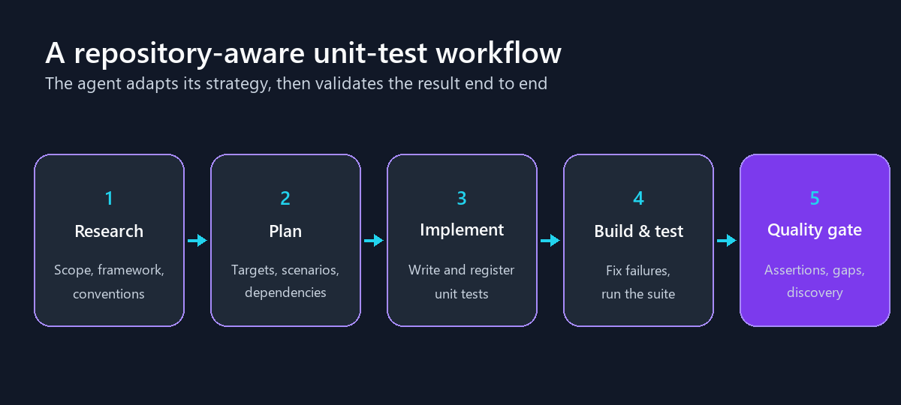

## 摘要（Summary）

本筆記整合三個來源：Microsoft .NET Blog 文章《From generated code to trusted code with a unit-test agent》（2026-07-31，Amaury Levé）、`dotnet/skills` repo 中 `plugins/dotnet-test` 的完整原始碼分析（10 個 agent + 22 個 skill），以及其 benchmark 數據。

`code-testing-generator` 是 Microsoft .NET 團隊開源的**多語言（polyglot）單元測試生成代理**，支援 12 種語言。它把「Generate unit tests.」這種一行模糊提示（vague prompt）轉成可信結果的方法是：**先研究 repo、再規劃、再實作、最後強制通過品質閘門（quality gate）**——包括輕量突變測試（pseudo-mutation testing）、斷言品質檢查、以及「repo 的正式測試指令找得到新測試」的 harness discovery 驗證。官方 benchmark：152 個任務完成率 92.1% vs 素的 GitHub Copilot 78.9%（同模型），**模糊提示上失敗減少 67%**，而且不是靠多生測試（反而少 2.3%）。架構上是「skill 入口 + 兩層 sub-agent fan-out + dispatch skill 外部化語言知識」的教科書級 agent 工程實作。

## Why — 為什麼存在？

> 「Generate unit tests.」這一行提示留下了所有關鍵決策：哪些程式碼要測？用什麼測試框架？測試放哪？build 怎麼找到它們？該斷言什麼？

- **核心動機**：通用 coding agent 面對模糊測試請求時，常產出「能過但沒價值」的測試——只檢查 not null、測錯方法、方法回傳預設值也照樣通過；或更隱蔽的：**新測試專案自己能 build 能跑，但從未被加入 solution 或 repo 的測試指令，CI 永遠不會執行它**（隱形失敗）。
- **取代/改善什麼**：素的（stock）GitHub Copilot / Claude Code 的裸測試生成。文章強調素的 agent 在「指定 diff 寫測試」的 15 個任務上**全軍覆沒（0/15）**，專用 agent 全過（15/15）。
- **目標用戶**：用 GitHub Copilot CLI / VS Code / Claude Code / Codex / Cursor 的開發者——plugin 同一份內容為五種 host 各放一份 manifest。

## What — 是什麼？

- **主要功能**：
  - `code-testing-generator`：從單一 function 到整個 solution 的單元測試生成，含 mocking 與依賴隔離。
  - `test-quality-auditor`：對既有測試跑多維度稽核（anti-patterns → 斷言品質 → 缺口分析 → 覆蓋率）。
  - `testability-migration`：偵測難測的 static 依賴（`DateTime.Now`、`File.*` 等）→ 生成 wrapper → 批次遷移 → 補測試。
  - 22 個 skill：測試執行（run-tests/MTP hot reload）、覆蓋率與 CRAP score、靜態測試配對（find-untested-sources）、6 本品質分析 skill（anti-patterns、19 種 test smell、assertion-quality、gap-analysis、tagging、grade-tests）等。
- **不做什麼（Non-goals）**：整合測試、E2E、瀏覽器、效能測試都不在範圍；測試生成期間**不改 production code**；不寫呼叫外部 URL、開 port、依賴精確時序的測試。測試框架遷移拆到獨立的 `dotnet-test-migration` plugin。
- **技術棧（Tech Stack）**：純 Markdown 的 agent/skill 定義（agentskills.io 標準）+ PowerShell / Python（tree-sitter）/ C#（Roslyn）輔助腳本；repo 附 Vally schema 的 eval 體系與 GitHub Pages 品質儀表板。

## How — 如何運作？

### 系統架構圖（兩層 fan-out 的 agent 樹）

```
[使用者] "Generate unit tests."
    │
    ▼
┌────────────────────────────────────────────────────────┐
│ code-testing-agent (SKILL — MANDATORY ENTRY POINT)     │
│  判斷規模: Focused(單檔) vs Broad(整專案)               │
└───────────────────────┬────────────────────────────────┘
                        ▼
┌────────────────────────────────────────────────────────┐
│ code-testing-generator (orchestrator, user-invocable:  │
│ false) — 選策略: Direct / Single pass / Iterative      │
└──┬──────────────┬──────────────────┬───────────────────┘
   │              │                  │
   ▼              ▼                  ▼
┌─────────┐ ┌──────────┐ ┌────────────────────────────┐
│researcher│ │ planner  │ │ implementer(每 phase 一次)  │
│→research │ │→plan.md  │ │  ├─ builder (build 檢查)    │
│  .md     │ │          │ │  ├─ tester  (跑測試)        │
└─────────┘ └──────────┘ │  ├─ fixer   (修錯,一次一個) │
                          │  └─ linter  (format/lint)   │
     共享狀態: .testagent/ └────────────────────────────┘
     (research.md / plan.md / status.md)

獨立的 user-facing agents:
┌──────────────────────┐  ┌──────────────────────────┐
│ test-quality-auditor │  │ testability-migration     │
│ 稽核 pipeline         │  │ Detect→Generate→Migrate→ │
│ (handoff→generator)  │  │ Test (handoff→generator)  │
└──────────────────────┘  └──────────────────────────┘

Polyglot 機制(dispatch skills, disable-model-invocation: true):
┌────────────────────────────┐ ┌───────────────────────────┐
│ code-testing-extensions    │ │ test-analysis-extensions   │
│ 生成用·12 語言資料檔        │ │ 分析用·11 語言偵測資料表    │
└────────────────────────────┘ └───────────────────────────┘
```

### 執行流程圖（generator 的核心工作流）

```
 Start: 收到測試請求
   │
   ▼
[理解需求 + 判斷規模]
   │
   ├─ 單一 function/class/file ──► Direct: 直接寫+立即跑(跳過 fan-out)
   ├─ 數個 module ──────────────► Single pass: R→P→I 跑一次
   └─ 大範圍/覆蓋率目標 ────────► Iterative: 重複 R→P→I
   │                              (research-2.md, plan-2.md...)
   ▼
[Research] 語言/框架偵測(manifest 為準)、既有測試慣例、
   │        scoped 指令 + harness-equivalent 指令兩條都記錄
   ▼
[Plan] 從簡單碼到多依賴碼排 phase、行為→測試檔對映
   │
   ▼
[Implement 每個 phase]
   │  build 失敗 ──► fixer ──► rebuild(最多 3 次)
   │  test 失敗 ───► fixer ──► rerun(最多 5 次)
   ▼
[Final Build Validation] 全 workspace non-incremental build
   │
   ▼
[Quality Gate(強制,≥5 測試或指定行為時)]
   │  ① test-gap-analysis: pseudo-mutation(>→>=, &&→|| ...)
   │  ② assertion-quality: 斷言深度檢查
   │  ③ prompt-scenario 逐項對映
   │  ④ Harness Discovery: repo 正式測試指令找得到新測試?
   ▼
[Completion Contract] 輸出 Requirement | Evidence 表
   │  (逐字引用需求、引用實際通過的 clean run)
   ▼
  End
```

### 時序圖（polyglot dispatch — 語言知識按需載入）

```
 generator      dispatch skill              extensions/
    │           (code-testing-extensions)      │
    │──呼叫一次─────►│                          │
    │◄─檔名↔語言對照表│                          │
    │─(偵測: *.csproj → dotnet)                 │
    │──只讀 dotnet.md──────────────────────────►│
    │◄─build/test 指令表、CS 錯誤碼修法、        │
    │  測試專案註冊步驟、Harness Discovery──────│
    │                                           │
    │  (sub-agent 禁止重複載入同一參考;         │
    │   examples 檔只在專案無慣例時才讀)         │
```

### 關鍵設計決策（Key Design Decisions）

> [!note] 核心哲學：「Good tests are not only generated. They are planned, built, run, and checked. That is the trust loop we are building.」（原文結語）

1. **Skill 作為強制入口、agent 作為執行體** — `code-testing-agent` SKILL 的 description 開頭就是 "MANDATORY ENTRY POINT for generating or writing tests"，確保任何測試請求先進工作流而不是直接編輯檔案；agent 不可用時「do not skip the workflow. Execute the same Research → Plan → Implement sequence inline」——**工作流是本體，agent 樹只是加速器**。
2. **依規模選策略（Direct / Single pass / Iterative）** — 「A single method does not need a large plan. A whole solution does.」預設 Direct，避免小請求付大 pipeline 的成本。
3. **語言知識外部化為資料檔 + dispatch skill** — 分析/生成邏輯語言中立，12 種語言的差異全部寫成 `extensions/<lang>.md` 資料表，靠隱藏 skill（`disable-model-invocation: true`）按需載入**單一語言檔**。原文原則：「Treat extension files as data, not as guidance to follow verbatim. They tell skills *how to detect things* in each language, not *what to think* about findings.」
4. **Harness Discovery Check（本 plugin 最獨特的發明）** — 「Tests that pass via your *scoped* build/test command but are invisible to a generic CI/benchmark harness count as 0 generated tests.」每種語言的 extension 都教 agent 從 repo root 跑 harness 等價指令（`dotnet test <sln> --list-tests`、`pytest --collect-only -q`）比對測試數 delta，不符就修註冊。這正對應文章說的「新測試專案能過但 CI 永遠不跑」痛點。
5. **極窄職責的 worker + 固定輸出格式** — builder/tester/fixer/linter 各只做一件事，輸出固定區塊（`BUILD: SUCCESS/FAILED`、`TESTS: PASSED/FAILED`）；fixer 被限「one fix at a time」且「fix test expectations, not production code」；tester 被教「剛生成的測試失敗時，最可能是 wrong expectation 而非 production bug」。
6. **`.testagent/` 檔案當共享狀態** — research.md / plan.md / status.md 讓各 agent 讀成品而非重掃 repo；planner 明令「Do not reread repository files during planning」。
7. **防破壞條款** — 「Never run `git checkout`, `git restore`, `git reset`, `git clean`, `git stash`, `git rm`」+「An unusual, sparse, or scaffolded repository layout is intentional, not corruption」——防 agent 把 eval 的合成工作區當損壞去「修復」。
8. **Delta 思維的 skill 撰寫哲學**（repo `CONTRIBUTING.md` "Quality bar"）— 每個 skill 用「同模型、無 skill」的 baseline 對照實驗打分：「Encode the decisions the model gets wrong; delete anything it already produces unaided. A skill that reads as reference prose ties its own baseline.」

### 資料流（Data Flow）

1. 使用者提示 → `code-testing-agent` skill 判斷規模 → spawn `code-testing-generator`。
2. researcher 掃 repo → 寫 `.testagent/research.md`（語言、框架、慣例、scoped + harness 兩組指令）。
3. planner 讀 research.md → 寫 `.testagent/plan.md`（分 phase、行為→測試檔對映）。
4. implementer 逐 phase 寫測試 → builder/tester 驗證 → fixer 修（build 3 次、test 5 次上限）→ linter 收尾。
5. 全 workspace build → 品質閘門（gap-analysis + assertion-quality + scenario 對映 + harness discovery）→ Completion Contract 表輸出。

### 關鍵程式碼（Key Code Snippets）

**(1) 測試品質的核心思想 — mutation thinking**（`skills/code-testing-agent/unit-test-generation.prompt.md`）：

> "each assertion should fail under at least one plausible mutation (`>`→`>=`, `&&`→`||`, a dropped null check, an off-by-one...)"
> 自審一句話："would emptying the function body make it fail? If not, the assertions are too weak."

**(2) 空洞測試的定義**（`agents/code-testing-generator.agent.md` Step 7）：

> "a test that passes vacuously — that would still pass if the function body were emptied or returned a default — is a bug, not a test."

**(3) CRAP score 公式**（`skills/coverage-analysis/scripts/Compute-CrapScores.ps1`，Alberto Savoia 原始公式）：

```powershell
# CRAP(m) = comp^2 * (1 - cov)^3 + comp
# comp = cyclomatic complexity, cov = branch coverage (0..1)
# 輸出: OVERALL_LINE_COVERAGE / OVERALL_BRANCH_COVERAGE /
#       TOTAL_METHODS / FLAGGED_METHODS / HOTSPOTS:<json>
```

`crap-score` skill 還附反推公式 `cov_needed = 1 − ((15 − comp)/comp²)^(1/3)`，並指出 complexity ≥ 15 時「coverage alone cannot bring the CRAP score below the threshold」——必須先重構。

**(4) grade-tests 的評分演算法**（`skills/grade-tests/SKILL.md`）：每個測試從 A（90–100）起扣，三個子維度加權（Assertion strength 0.45 / Anti-pattern hygiene 0.30 / Structure & focus 0.25）；anti-pattern 子分取「hard ceiling pass（Critical/High 取最差不累加）」與「Medium-deduction pass（每個 Medium 降一級累加）」兩趟較差者；總分被最差子維度封頂（任一維 F → overall F）。只報字母等第不報數字：

> "False precision invites bikeshedding; bands keep the conversation focused on the rubric."

**(5) Completion Contract**（`skills/code-testing-agent/SKILL.md`）— 最終回覆必含 `Requirement | Evidence` 表：

> "Behavioral rows cite exact generated test names." / "Quote the user's requirement verbatim in each row." / "Cite a clean run, not an attempt."

repo 的 eval 用 regex `\|\s*Requirement\s*\|\s*Evidence\s*\|` 客觀驗證這張表存在——**把主觀完成轉成機器可檢查的產出**。

## 安裝流程（Installation Flow）

> [!info] 這是純 Markdown plugin（無執行檔），安裝 = 把 skill/agent 定義註冊進 host 的 plugin 系統。多 host 相容靠平行 manifest 目錄：`.claude-plugin/`（Claude Code）、`.codex-plugin/`（Codex）、`.cursor-plugin/`、`.agents/`（agentskills 標準）、`.github/`（Copilot），內容由版本同步機器人維持一致。

### 安裝觸發方式

```
GitHub Copilot CLI / Claude Code:
  /plugin marketplace add dotnet/skills
  /plugin install dotnet-test@dotnet-agent-skills
  → 讀 .claude-plugin/marketplace.json(marketplace 名: dotnet-agent-skills)
  → 讀 plugins/dotnet-test/plugin.json(skills: ./skills/ + 10 個 agent 路徑)

VS Code(Preview): settings.json 設 "chat.plugins.enabled": true
  + "chat.plugins.marketplaces": ["dotnet/skills"]

Codex CLI(v0.121.0+): codex plugin marketplace add dotnet/skills
  → 讀 .agents/plugins/marketplace.json + plugins/dotnet-test/.codex-plugin/plugin.json

Cursor: symlink 到 ~/.cursor/plugins/local/dotnet-agent-skills(本地開發)
```

### 安裝時序圖

```
 開發者        Copilot CLI          dotnet/skills repo        本機 plugin 目錄
   │               │                       │                       │
   │─marketplace add──►│                   │                       │
   │               │──fetch .claude-plugin/marketplace.json──►│    │
   │               │◄─16 個 plugin 清單────│                       │
   │─plugin install───►│                   │                       │
   │               │──讀 plugins/dotnet-test/plugin.json──────►│   │
   │               │──註冊 skills/ + 10 agents────────────────────►│
   │◄─重啟 CLI 後 code-testing-generator 出現在 agent 清單──────────│
```

### 安裝產物清單

| 路徑 | 類型 | 用途 |
|------|------|------|
| host 的 plugin 快取目錄（依 host 而異） | 目錄 | `plugins/dotnet-test/` 的 skills + agents 副本 |
| 工作 repo 的 `.testagent/` | 目錄 | **執行時**產生的共享狀態（research.md / plan.md / status.md），非安裝產物 |

### 環境變數

無安裝期環境變數。VS Code 有一個關鍵**執行期設定**：巢狀 subagent 委派預設關閉，需 `"chat.subagents.allowInvocationsFromSubagents": true` 才會 fan-out（Copilot CLI 無此閘門、永遠 fan-out）；未開啟時 implementer 會 inline 自己做 builder/tester/fixer/linter 的工作，結果相同只是不並行。

> [!warning] 解除安裝
> host 的 `/plugin uninstall`（或移除 marketplace）即可；工作 repo 中若殘留 `.testagent/` 目錄可手動刪除。

## 使用案例地圖（Use Case Map）

### 案例總覽

| # | 使用案例 | 觸發方式 | 入口定義檔 | 核心鏈 |
|---|---------|---------|-----------|--------|
| 1 | 生成單元測試 | 「Generate unit tests.」 | `skills/code-testing-agent/SKILL.md` | skill → generator → researcher/planner/implementer → builder/tester/fixer/linter |
| 2 | 稽核既有測試品質 | 選 `test-quality-auditor` agent | `agents/test-quality-auditor.agent.md` | anti-patterns → assertion-quality → gap-analysis →（.NET）coverage → 分維度報告 |
| 3 | 可測試性改造 | 選 `testability-migration` agent | `agents/testability-migration.agent.md` | detect-static-dependencies → generate-testability-wrappers → migrate-static-to-wrapper → 補測試 |
| 4 | 覆蓋率 + 風險熱點 | 要求 coverage 分析 | `skills/coverage-analysis/SKILL.md` | 跑測試收 Cobertura → Compute-CrapScores.ps1 → 熱點報告 |
| 5 | 幫測試打分數 | 指定測試清單要求評分 | `skills/grade-tests/SKILL.md` | 三維度加權 → A–F 字母等第表（可貼 PR comment） |
| 6 | 找沒測試的原始檔 | 要求測試缺口清單 | `skills/find-untested-sources/SKILL.md` | Roslyn（C#）或 tree-sitter（polyglot）靜態配對 → JSON |

### 案例詳解

#### 案例 1：「Generate unit tests.」（模糊提示的完整旅程）

```
用戶：Generate unit tests.
  │
  ▼
code-testing-agent SKILL(判斷 Focused vs Broad)
  │
  ▼
code-testing-generator agent(選 Direct / Single pass / Iterative)
  │
  ▼
researcher ── 讀 ──► *.csproj / package.json / go.mod...(語言偵測)
  │          ── 呼叫 ──► code-testing-extensions(只讀 dotnet.md)
  │          ── 寫 ──► .testagent/research.md
  ▼
planner ── 讀 research.md ── 寫 ──► .testagent/plan.md
  │
  ▼
implementer(每 phase) ── 寫測試 ──► builder/tester 驗證 ──► fixer 修
  │
  ▼
品質閘門(gap-analysis + assertion-quality + harness discovery)
  │
  ▼
Requirement | Evidence 表 + 全 suite 通過的 clean run 引用
```

#### 案例 3：可測試性改造（testability-migration）

```
用戶：這個 class 到處都是 DateTime.Now,沒辦法測
  │
  ▼
testability-migration agent
  │
  ▼
detect-static-dependencies ── 掃 ──► DateTime.Now / File.* / Environment.*
  │                                   (按呼叫頻率排名)
  ▼
generate-testability-wrappers ── 產 ──► IFileSystem / TimeProvider 採用
  │                                     (無 DI 容器時產 ambient context seam)
  ▼
migrate-static-to-wrapper ── 批次替換呼叫點 + constructor injection
  │
  ▼
handoff → code-testing-generator 補測試(用 fake 驗證)
```

## 架構師觀點（Architect's View）

### ✅ 優點（Strengths）

| 面向 | 評估 | 說明 |
|------|------|------|
| 可維護性（Maintainability） | ⭐⭐⭐⭐⭐ | 語言知識全部外部化成資料檔;worker agent 極窄職責;版本同步機器人維護多 host manifest |
| 可擴展性（Scalability） | ⭐⭐⭐⭐⭐ | 加一種語言 = 加兩個 extension 資料檔,零 agent 改動;plugin 間職責清楚(遷移拆去 dotnet-test-migration) |
| 測試覆蓋（Test Coverage） | ⭐⭐⭐⭐⭐ | 罕見亮點:每個 skill 都有「skill vs 無 skill baseline」的統計檢定 eval(Vally schema + sign test),還有 eval 品質檢查器擋十類結構性缺陷 |
| 文件品質（Documentation） | ⭐⭐⭐⭐ | README 清楚標注 polyglot vs .NET-only 邊界與 host 差異;skill 內大量「When Not to Use」 |
| 依賴管理（Dependency Management） | ⭐⭐⭐⭐ | 純 Markdown 零執行依賴;腳本自帶(PowerShell / tree-sitter 單一 wheel / Roslyn file-based app) |

> [!tip] 最值得學習的三個設計
> 1. **Harness Discovery Check** — 「測試存在」不等於「測試會被跑」。任何生成型 agent 都該驗證產物會被系統的正式管道發現,而不只是局部驗證通過。
> 2. **Delta 思維寫 skill** — 只編碼模型會答錯的決策,刪掉它本來就會的。「A skill that reads as reference prose ties its own baseline.」搭配 baseline 對照 eval,skill 的價值變成可量測的 delta。
> 3. **Completion Contract** — 強制輸出 `Requirement | Evidence` 表、逐字引用需求、引用實際通過的執行——把「agent 自稱做完了」變成可稽核的證據結構。

### ⚠️ 缺點與風險（Weaknesses & Risks）

- **SWE Atlas 上完成率只有 36.4%**：官方誠實披露的硬 benchmark 結果（16/44 vs 素的 12/44）。內部 benchmark 92.1% 與此落差巨大——「能 build、能過、有新測試」的標準與「測試能抓 bug」的標準之間還有大段距離。
- **品質量測的兩面性**：官方承認一旦兩邊都完成任務,素的 Copilot 在斷言與覆蓋率上略勝,專用 agent 只在 test hygiene 上略勝——**專用化買到的是可靠性(reliability),不是單項品質上限**。
- **內部 benchmark 未開源**：152 個任務的內部基準無法外部復現;語言別樣本小(Go 15、Python 15、PowerShell 10),官方自己也說「useful signals, not promises」。PowerShell 甚至輸給素的 Copilot 一題。
- **Token 成本沒省**：每完成任務多用約 3.2% token(含 cached input)。這個 agent 的價值主張是可靠性,不是效率——與 [[2026-08-07-OPEN-CODE-REVIEW-ALIBABA-AI-CODE-REVIEW-CLI-CODE-ANALYSIS|OCR]] 的「1/9 token」是完全不同的取向。
- **VS Code 巢狀委派預設關閉**：不知道要開 `chat.subagents.allowInvocationsFromSubagents` 的使用者拿到的是 inline 降級版(結果相同但慢)。
- **深度依賴 host 的 agent/skill 基礎設施**：不像 OCR 是自帶迴圈的 CLI,這個 plugin 的行為品質受 host 實作(工具名對映、subagent 支援度)影響,跨 host 一致性靠「同時列語意名與各 host 工具名」的 frontmatter 技巧硬撐。

### 🔮 改進建議（Improvement Suggestions）

1. 開源內部 152 任務 benchmark（或其子集），讓「92.1%」可外部復現。
2. 品質閘門加入「斷言深度」的量化門檻（官方已把 deeper assertions 列為下一步）。
3. 把 Harness Discovery 的 delta 比對做成可獨立呼叫的 skill,供其他生成型 plugin 復用。

## 效能基準（Benchmark）

> [!info] 資料來源
> 官方部落格文章（2026-07-31）。內部 benchmark：152 個真實 repo 任務（89 模糊提示 + 63 詳細提示）；四種設定對比（素的 Copilot / 素的 Claude Code / 專用 agent in Copilot / in Claude Code），下表以 Copilot 對比為主，同模型同提示。通過標準：repo 能 build、全部測試通過、至少新增一個測試、未刪既有測試。

**總體結果（152 任務）**：

| 指標 | 專用 agent | 素的 Copilot |
|------|-----------|-------------|
| 任務完成 | **140/152（92.1%）** | 120/152（78.9%） |
| Solution 能 build | 148 | 145 |
| 最終測試套件通過 | 149 | 147 |
| 生成測試數 | 6,963 | 7,129 |
| 平均最終行覆蓋率 | 72.4% | 72.2% |
| 平均最終分支覆蓋率 | 49.8% | 49.1% |
| 平均任務時間 | **359 秒** | 380 秒 |

**依提示類型（本文最核心的發現）**：

| 提示類型 | 專用 agent | 素的 Copilot |
|---------|-----------|-------------|
| 模糊提示（89 任務） | **79（88.8%）** | 59（66.3%） |
| 詳細提示（63 任務） | 61（96.8%） | 61（96.8%）— 平手 |

模糊提示上失敗減少 67%，**全部 20 個淨增益都來自模糊提示**;指定 diff 寫測試的 15 個任務：專用 15/15,素的 0/15。配對分析：兩者皆過 119、僅專用過 21、僅素的過 1、皆敗 11。

**.NET 45 任務 × 三種模型**：

| 模型 | 專用 agent | 素的 Copilot | 失敗減少 |
|------|-----------|-------------|---------|
| Claude Opus 4.8 | 43/45（95.6%） | 35/45（77.8%） | 80% |
| GPT-5.5 | 41/45（91.1%） | 36/45（80.0%） | 56% |
| Claude Haiku 4.5 | 34/45（75.6%） | 25/45（55.6%） | 45% |

> [!important] 最有戰略意義的數據
> 「a strong workflow can lift a mid-tier model close to the best result」——全 152 任務上,**專用化的 GPT-5.5 達 90.1%,距專用化 Opus 不到 2 個百分點,比素的 Opus 高 11 個百分點以上**。好的 workflow 比換更強的模型更有效。

**跨語言（Opus）**：Python 15 任務 13 vs 6（翻倍以上）、Go 15 任務 **15 vs 10（全過）**、PowerShell 10 任務 7 vs 8（**輸一題**,官方誠實列出）。

**SWE Atlas（更難的外部基準,44 任務）**：專用 16/44（36.4%）vs 素的 12/44（27.3%）;抓到注入 bug 的測試 360 vs 316。官方："SWE Atlas is hard, and there is still a lot to improve."

**效率**：每完成任務多用約 3.2% 記錄 token（含 cached input,不直接代表成本）——增益來自可靠性,不是效率。



## 快速上手（Quick Start）

```
/plugin marketplace add dotnet/skills
/plugin install dotnet-test@dotnet-agent-skills
```

重啟 CLI,從 agent 清單選 `code-testing-generator`,然後：

```
Generate unit tests.
```

也可以指定單一 function、module 或覆蓋率目標。VS Code 使用者記得開 `"chat.subagents.allowInvocationsFromSubagents": true` 才有並行 fan-out。

## 我的心得（My Takeaways）

1. **「可靠性」是與「效率」正交的專用化方向**：OCR 用確定性工程買 token 效率（1/9）,dotnet-test 用工作流買完成率（失敗 -63%,token 反而 +3.2%）。兩者都證明「素的通用 agent」有巨大改進空間,但改進的維度完全不同——設計 agent 產品時要先選定你的主張是哪一個。
2. **模糊提示是專用 agent 的主戰場**：詳細提示上兩邊平手（96.8%）——當使用者自己做完研究,workflow 沒有增值空間。專用 agent 的價值 = 「do the research that the developer did not put in the prompt」。這也是評估任何 agent 產品的好問題:它在使用者最懶的時候表現如何?
3. **Harness Discovery 是所有生成型 agent 都該偷的檢查**:產物「存在且局部驗證通過」≠「會被系統正式管道使用」。寫檔案的 agent 都有同構問題（生成的 config 有沒有被引用?生成的 route 有沒有被註冊?）。
4. **workflow 提升中階模型的性價比**：專用 GPT-5.5 打平專用 Opus、輾壓素的 Opus——印證 [[2026-05-01-GOOGLE-WHITEPAPER-NEW-SDLC-VIBE-CODING-TO-AGENTIC-ENGINEERING|Google 白皮書]] 的「Agent = Model + Harness,harness 佔 90%」論。預算有限時,投資 workflow 比升級模型划算。
5. **skill 的 eval 體系比 skill 本身更值得學**:「每個 skill 對照無 skill baseline 做統計檢定」+「eval 品質檢查器」+「防 closed-loop 作弊審查」——這是我看過最嚴謹的 skill 工程實踐,可直接搬到自己的 skill 庫。

## 待補充（Open Questions）

- 內部 152 任務 benchmark 的任務構成與評分細節未公開,「92.1%」無法外部復現;與 SWE Atlas 的 36.4% 落差說明通過標準寬鬆——「至少一個測試 + 全過」下限有多低?（建議搜尋:`dotnet skills benchmark methodology`、`SWE Atlas unit test benchmark`）
- 素的 Claude Code 對比數據文章只提了設定存在,幾乎沒給數字——Claude Code 上的增益是否與 Copilot 相當?（建議搜尋:`dotnet-test plugin Claude Code results`）
- pseudo-mutation（靜態推理 + 選擇性執行驗證）與真 mutation testing 工具（Stryker.NET）的抓漏率差距有多大?（建議搜尋:`Stryker.NET vs LLM mutation analysis`）
- `.testagent/` 目錄的生命週期:多次執行後會不會累積過時的 research/plan 誤導後續 iteration?有沒有清理機制?
- 12 種語言的 extension 檔品質是否均勻?PowerShell 輸給素的 Copilot 是樣本噪音還是 Pester 資料檔較弱?（建議搜尋:`dotnet/skills issues powershell pester`）
- VS Code 巢狀委派閘門何時預設開啟?inline 降級版與 fan-out 版的實測時間差?

---

## 知識層次分析（Bloom's Taxonomy Analysis）

> 以下從五個認知層次對本篇內容進行結構化分析，協助從記憶到評估逐層深化理解。

| 認知層次 | 核心目的 | 對本文的具體應用 |
|---------|---------|--------------|
| **記憶（被動）** | 確認資訊存在 | ① Research→Plan→Implement→Build&test→Quality gate 五步工作流;② Harness Discovery Check;③ CRAP score 公式 `comp² × (1−cov)³ + comp`;④ dispatch skill（`disable-model-invocation: true` 的資料查找 skill）;⑤ Completion Contract（Requirement/Evidence 表） |
| **理解（半被動）** | 串聯知識點 | 核心邏輯鏈:模糊提示留下的決策空隙 → 用 repo 研究填補 → 分規模選策略控成本 → 極窄 worker 保證每步可驗證 → 品質閘門防空洞測試 → 契約化輸出可稽核。polyglot 的本質 = 邏輯語言中立 + 語言差異外部化為資料 |
| **分析（主動）** | 找出假設與漏洞 | 關鍵假設:①「能 build + 全過 + 有新測試」足以代表成功——SWE Atlas 36.4% 揭示此標準與「測試能抓 bug」的落差;② 內部 benchmark 自建自測,語言別樣本小;③ pseudo-mutation 靠 LLM 推理選 mutation,覆蓋面遠小於系統性 mutation 工具 |
| **應用（主動）** | 轉為行動 | ① 給自己的生成型 skill 加 Harness Discovery 等價檢查（產物是否被正式管道發現）;② 用「Requirement | Evidence 表 + 引用 clean run」重寫自己 agent 的完成報告格式;③ 用「baseline 對照 + 統計檢定」為自己的 skill 庫建 eval（抄 `dotnet-skills.experiment.yaml` 的設計） |
| **評估（主動）** | 權衡取捨 | vs OCR:可靠性專用化（token +3.2%）vs 效率專用化（token 1/9）,兩條正交路線;vs 素的 agent:模糊提示大勝、詳細提示平手——使用者提示品質高時價值有限;vs 真 mutation 工具:pseudo-mutation 快但淺,關鍵模組仍該上 Stryker.NET。適用場景:團隊測試紀律不足、常下模糊指令、多語言 monorepo;不適用:已有嚴格 TDD 流程且提示詳盡的團隊（增益趨近平手線） |

### 分析型追問（Socratic Follow-up）

- **澄清**:「completed a task」的精確定義（build + 全過 + ≥1 新測試 + 不刪舊測試）沒有任何斷言品質門檻——一個只有 trivial 斷言的任務也算完成嗎?品質閘門在 benchmark 中是否啟用?
- **假設**:「模糊提示的失敗主因是缺研究」——若真正主因是 harness 註冊失敗（一個機械問題）,那大部分增益可能來自單一檢查,而非整套 RPI pipeline。文章沒有做消融實驗（ablation）。
- **證據**:「specialized GPT-5.5 距 specialized Opus 不到 2 點」只在此 benchmark 成立;在 SWE Atlas 這種難題上中階模型是否還能靠 workflow 補齊?未提供。
- **觀點**:反對者可說:與其裝 10 agent + 22 skill 的 plugin,不如教團隊寫詳細提示（詳細提示上完全平手,96.8%）——訓練人比訓練 agent 便宜。
- **後果**:12 個月後,若團隊完全依賴 agent 生成測試,測試套件可能充滿「hygiene 良好但斷言保守」的測試（官方自承斷言深度略遜）——回歸防護網看似完整,實際抓 bug 能力未知,且無人再手寫測試去校準。

### 方案批判三問（Critical Evaluation）

1. **最大的風險是什麼？** — 「高完成率」被誤讀為「高保護力」。SWE Atlas 顯示以「抓得到注入 bug」為標準時完成率只剩 36.4%。最壞情況:團隊看 92.1% 就把測試工作全交給 agent,得到一套通過率很好看、突變殺傷力未知的測試套件,重構時它們不會報警。
2. **什麼情況下會失敗？** — ① host 不支援 subagent 或 VS Code 閘門未開（降級為慢速 inline）;② 非主流語言/框架（extension 資料檔未覆蓋,如 Elixir、Zig）;③ repo 的 build 系統非常規（Bazel monorepo 的 harness discovery 指令可能偵測不到）;④ 需要整合測試才有意義的程式碼（I/O 密集、DB 邏輯）——明確在 non-goals 內;⑤ 使用者已寫詳細提示（增益歸零）。
3. **有沒有更好的替代方案？** — 若要真突變測試,Stryker.NET / PIT / mutmut 是嚴謹版（慢但系統性）;若只要覆蓋缺口清單,`find-untested-sources` 這類靜態工具單獨用就夠（秒級）;若團隊提示紀律好,素的 agent + 詳細提示已達同等完成率。本 plugin 的甜蜜點:**模糊指令 + 多語言 + 在意「測試真的進 CI」的團隊**。

## 相關連結（Related）

- [[2026-08-07-OPEN-CODE-REVIEW-ALIBABA-AI-CODE-REVIEW-CLI-CODE-ANALYSIS]] — 兩種專用化路線的鏡像對照:OCR 買 token 效率（1/9）,dotnet-test 買可靠性（失敗 -63%、token +3.2%）;同樣是「專用 harness 打素的通用 agent」且 benchmark 都自建自測
- [[2025-12-29-SKILLSBENCH-AGENT-SKILL-USE-BENCHMARK-CODE-ANALYSIS]] — skill 評測方法論參照:SkillsBench 測「agent 會不會用 skill」,dotnet/skills 的 eval 測「skill 對同模型的 delta」,兩種互補的 skill 評測哲學
- [[2026-04-16-CLAUDE-CODE-SKILLS-VS-COMMANDS-VS-SUBAGENTS-COMPLETE-COMPARISON]] — 本 plugin 是 skill + subagent 兩機制協作的實戰教材:skill 當強制入口與資料查找,subagent 當隔離執行體
- [[2026-05-01-GOOGLE-WHITEPAPER-NEW-SDLC-VIBE-CODING-TO-AGENTIC-ENGINEERING]] — 「specialized GPT-5.5 打平 specialized Opus、超越 stock Opus 11 點」是白皮書「Agent = Model + Harness(10%/90%)」最有力的實證數據
- [[2026-05-22-SKILLOPT-SELF-EVOLVING-AGENT-SKILLS-CODE-ANALYSIS]] — SkillOpt 用優化器自動改進 skill,dotnet/skills 用 baseline 對照 eval 人工迭代 skill——自動 vs 人工的 skill 改進方法對照
- [[2026-07-19-AGENT-HARNESS-VS-LOOP-VS-GRAPH-ENGINEERING-THREE-LAYERS]] — generator 的固定 RPI pipeline + 兩層 fan-out 是「graph 工程」的輕量實例:確定性拓撲 + retry 上限 + 強制閘門,對應三層排障地圖的結構層

## References

- [原文:From generated code to trusted code with a unit-test agent](https://devblogs.microsoft.com/dotnet/polyglot-unit-testing-agent/)
- [dotnet/skills repo](https://github.com/dotnet/skills)
- [code-testing-generator.agent.md](https://github.com/dotnet/skills/blob/main/plugins/dotnet-test/agents/code-testing-generator.agent.md)
- [dotnet-test plugin 目錄](https://github.com/dotnet/skills/tree/main/plugins/dotnet-test)
- [dotnet/skills 品質儀表板](https://dotnet.github.io/skills/)
- [agentskills.io 標準](https://agentskills.io)
