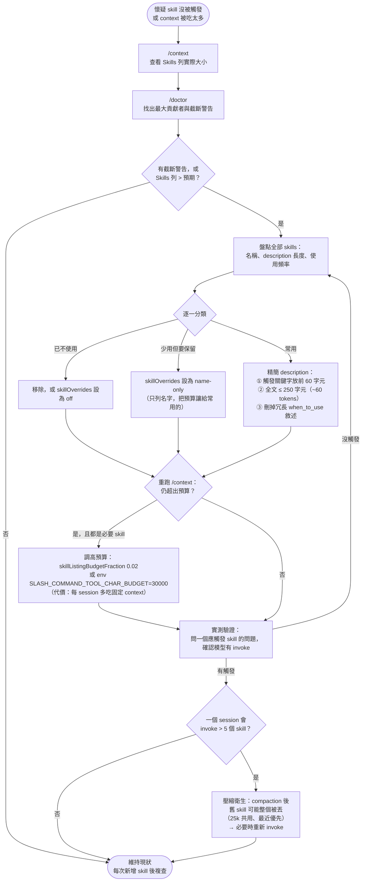

## 摘要（Summary）

當一個問題同時涉及多個 skill 時，Claude Code 到底會讀全部還是只讀一個？本文從**反編譯原始碼**（`src/tools/SkillTool/prompt.ts`、`src/services/compact/compact.ts`、`src/utils/attachments.ts`）與**官方文件**雙向核實，釐清 skill 的兩層載入機制（listing／invoke）與三個預算階段，並實際計算 200K 與 1M 上下文視窗（Context Window）在 100 個 skill 情境下的截斷數字。核心結論：**skill 清單預算 = context 的 1%**，在 200K + 100 skills 情境下**每個 description 只剩約 60 字元（~15 tokens）存活**；1M context 則完全不截斷。文末附一套可操作的「檢查與縮減流程」Mermaid 流程圖。

## 關鍵洞察（Key Insights）

- **多 skill 不是問題，description 被砍才是問題**：模型同一輪可多次呼叫 Skill tool 載入多個 skill 的完整內容，沒有「只能一個」的限制；實務上「怎麼只觸發一個／完全不觸發」幾乎都是清單預算截斷造成的——description 被砍 = 觸發關鍵字消失 = skill 對模型「失明」。
- **三個預算階段完全獨立**：發現階段（清單，1% context）→ invoke 階段（**無預算限制**，SKILL.md 整份進 context）→ 壓縮階段（每 skill 5,000 tokens、共用 25,000 tokens）。
- **200K context 掛 100 個 skill 是明顯超載**：每個 description 實際只有前 ~60 字元會被看到，因此**觸發關鍵字必須放在 description 的最前面**——參見 [[2026-01-18-STOP-BLOATING-YOUR-CLAUDE-MD-PROGRESSIVE-DISCLOSURE-AI-CODING-TOOLS]] 的漸進式揭露（Progressive Disclosure）同一原理。
- **反編譯版與官方現行版實作有差異**：單筆上限 250 vs 1,536 字元、均分截短 vs 從最少用的整筆砍——核實社群文章時要以官方文件為準。

## 詳細內容（Details）

### 兩層載入機制（Two-Layer Loading）

| 層 | 內容 | 何時進 context | 預算 |
|---|------|--------------|------|
| **清單層（listing）** | 所有 skill 的 `name` + `description`（+`when_to_use`） | Session 開始即以 `skill_listing` attachment 增量注入 | **context 的 1%**（字元計） |
| **內容層（content）** | 單一 skill 的完整 SKILL.md 本文 | 模型呼叫 `Skill` tool 當下 | **無限制**（原始碼註解：`claude-api` skill 高達 20KB） |

清單只是「目錄」，讓模型知道有哪些 skill、何時該用；完整內容 invoke 才載入。同一輪可以 invoke 多個 skill，唯一規則是不重複 invoke 執行中的 skill。

### 預算的原始碼（`src/tools/SkillTool/prompt.ts`）

```typescript
// Skill listing gets 1% of the context window (in characters)
export const SKILL_BUDGET_CONTEXT_PERCENT = 0.01
export const CHARS_PER_TOKEN = 4
export const DEFAULT_CHAR_BUDGET = 8_000 // Fallback: 1% of 200k × 4

// Per-entry hard cap. The listing is for discovery only — the Skill tool loads
// full content on invoke, so verbose whenToUse strings waste turn-1 cache_creation
// tokens without improving match rate.
export const MAX_LISTING_DESC_CHARS = 250

export function getCharBudget(contextWindowTokens?: number): number {
  if (Number(process.env.SLASH_COMMAND_TOOL_CHAR_BUDGET)) {
    return Number(process.env.SLASH_COMMAND_TOOL_CHAR_BUDGET)
  }
  if (contextWindowTokens) {
    return Math.floor(
      contextWindowTokens * CHARS_PER_TOKEN * SKILL_BUDGET_CONTEXT_PERCENT,
    )
  }
  return DEFAULT_CHAR_BUDGET
}
```

截斷演算法（`formatCommandsWithinBudget`）：先嘗試全文，放得下就結束。**超出預算時不是「後面的不載入」，而是三層扣除後把剩餘均分**——所有 skill 的名字永遠都在清單上，被犧牲的只有描述：

```
1% 預算（200K → 8,000 字元）
  ├─ 先扣：bundled（Anthropic 內建）skill 的完整描述（永不截斷，優先保留）
  ├─ 再扣：其餘所有 skill 的「名字＋格式」開銷（`- 名稱: ` 加換行，每筆約 20 字元）
  └─ 剩餘 → 均分給每個非 bundled skill 的 description（maxDescLen = 剩餘 ÷ 檔數）
```

兩個容易誤解的細節：均分出來的是**上限、不是配額**——描述本來就短於上限的維持原樣，但省下的空間不會回頭分給長描述的（一次性均分，無迭代重分配）；若均分後每筆分不到 `MIN_DESC_LENGTH = 20` 字元，非 bundled 全部退化成**只列名字（names-only）**。且這一切只影響「發現」不影響「執行」——被砍到只剩名字的 skill 一旦被 invoke（模型或手動 `/name`），完整 SKILL.md 照樣全文載入。

### 200K vs 1M × 100 skills 實算

預算公式：`context tokens × 4 字元/token × 1%`。假設 skill 名稱平均 15 字元（每筆格式 `- 名稱: 描述`，名稱開銷 ≈ 100 × 19 + 99 換行 ≈ 2,000 字元）：

| | 200K context | 1M context |
|---|---|---|
| 清單總預算 | 8,000 字元（~2,000 tokens） | 40,000 字元（~10,000 tokens） |
| 名稱與格式開銷 | ~2,000 字元 | ~2,000 字元 |
| 可分給描述 | 6,000 字元 | 38,000 字元 |
| **每個 skill 的 description** | **60 字元（~15 tokens）** | **不截斷**（頂到 250 字元上限，~63 tokens） |
| 若描述都寫滿 250 字元 | 需 ~27,000 字元 → **~76% 描述文字被砍** | 27,000 < 40,000 → 全數保留 |
| names-only 死線 | 超過 ~200 個 skills | 超過 ~1,000 個 skills |
| 開始截斷的 skill 數（250 字元滿載） | ~25 個 | ~148 個 |

> [!warning] 200K 的殘酷現實
> 100 個 skill 時，你精心寫的 250 字元 description 只有**前 60 字元**會被模型看到。第 61 字元以後的觸發關鍵字等於不存在。

### 官方現行版 vs 反編譯版差異

| 項目 | 反編譯版（本文分析的 codebase） | 官方現行版（skills.md 文件） |
|---|---|---|
| 單筆 description 上限 | 250 字元（寫死 `MAX_LISTING_DESC_CHARS`） | 1,536 字元（`skillListingMaxDescChars` 可調） |
| 超預算截斷策略 | 非 bundled 均分截短 | **整筆砍最少 invoke 的 skill**，常用的保留全文 |
| 預算比例設定 | 無（僅 env var） | `skillListingBudgetFraction`（如 `0.02` = 2%，v2.1.129+） |
| 固定字元覆寫 | `SLASH_COMMAND_TOOL_CHAR_BUDGET` env var | 同左 |
| 個別 skill 降級 | 無 | `skillOverrides` 可設 `"name-only"` / `"off"` |
| 多 skill 手動堆疊 | 不存在 | `/skill-a /skill-b args` 載入第一個＋最多 5 個（v2.1.199+） |

反編譯版另有使用頻率追蹤（7 天半衰期分數，`skillUsageTracking.ts`），但只用於 `/` 自動補全排序；官方新版顯然已把這個分數接進清單截斷邏輯。

### 壓縮階段預算（`src/services/compact/compact.ts`）

```typescript
export const POST_COMPACT_MAX_TOKENS_PER_SKILL = 5_000
export const POST_COMPACT_SKILLS_TOKEN_BUDGET = 25_000
```

Auto-compaction 後，已 invoke 的 skill 內容會重新附加在摘要後：每個 skill 保留**前 5,000 tokens**（保頭不保尾，因為安裝／用法說明通常在檔案開頭），全部共用 **25,000 tokens**，**從最近 invoke 的開始填**——一個 session invoke 超過 ~5 個 skill 時，較舊的會在壓縮後整個消失。

### 診斷工具

- `/context` — Skills 列顯示**套用預算後**的實際大小（v2.1.196 起；之前顯示的是未截斷全文，會虛高數倍）
- `/doctor` — 估算清單的 context 成本與最大貢獻者；超預算時寫入 debug log（`--debug` 可見）

### Description 撰寫目標數值（Actionable Targets)

> [!tip] 寫 description 的預算表
> | 你的情境 | 每筆 description 存活空間 | 撰寫策略 |
> |---|---|---|
> | 200K + ~25 skills 以下 | 完整 250 字元 | 正常寫，控制在 250 字元（~60 tokens）內 |
> | 200K + ~40 skills | ~180 字元（~45 tokens） | 精華放前 180 字元 |
> | 200K + 100 skills | **~60 字元（~15 tokens）** | **觸發關鍵字全部放前 60 字元** |
> | 1M + 148 skills 以下 | 完整 250 字元 | 正常寫；但清單固定吃 ~數千 tokens |
>
> 通用鐵律：**當作標題來寫**——「做什麼＋何時觸發」壓進第一句，關鍵字前置；長篇 when_to_use 對觸發率沒幫助（原始碼註解直言只是浪費 turn-1 的 cache_creation tokens）。

> [!important] 給 skill 作者的一句話
> **前 60 字元決定你的 skill 的生死。** 在使用者掛 100 個 skill 的 200K 環境裡，description 只有前 60 字元存活；就算環境寬鬆，前 60 字元也是模型掃描清單的第一印象。清單截斷你控制不了，第一句你控制得了。

### 突破預算限制的實戰策略（Mitigation Strategies）

社群與學術界對「工具／技能清單塞爆 context」已有收斂的解法譜系，依侵入性由低到高：

| # | 策略 | 做法 | 佐證 |
|---|------|------|------|
| 1 | 關鍵字前置 | description 前 60 字元寫滿觸發詞（見上表） | 本文實算 |
| 2 | 合併同質 skill | 只合併「總是一起被需要」的（如 rules-common + rules-server → 一個 server-development-standard）；單檔勿超過 ~500 行 | MindStudio 社群指南 |
| 3 | Router／百科全書模式 | 一類知識只留**一個入口 skill** 進清單，其餘內容做成 `references/` 子檔或 sub-skill，invoke 後按需載入——與官方 progressive disclosure 同構 | 社群 Router Pattern；skill-router 專案（自稱 90% routing 準確率）；AnyTool 論文（層級檢索，pass rate +35.4% vs ToolLLM） |
| 4 | 從模型清單下架 | frontmatter 設 `disable-model-invocation: true`（原始碼證實 `getSkillToolCommands` 直接過濾）或 `skillOverrides: "user-invocable-only"`——skill 仍可手動 `/name` 觸發，完全不吃清單預算 | 反編譯原始碼 `commands.ts:569` |
| 5 | 降級或停用 | `skillOverrides` 設 `"name-only"`（只列名）或 `"off"` | 官方文件 |
| 6 | 加大預算 | `skillListingBudgetFraction`、`SLASH_COMMAND_TOOL_CHAR_BUDGET`——代價是每 session 固定稅 | 官方文件 |
| 7 | 動態檢索（官方路線） | Claude Code 的 `EXPERIMENTAL_SKILL_SEARCH`（清單只留 bundled+MCP，其餘按需發現）；平台層 Tool Search Tool 已上線：`defer_loading: true` + BM25/regex 搜尋，Opus 4 工具選擇準確率 49%→74%，MCP 描述超過 10% context 自動延遲載入 | Anthropic 官方 |

**合併與百科全書兩法的可行性評註**：

- **合併（策略 2）可行但有邊界**：合併讓單一 description 要涵蓋更多觸發情境——觸發面太廣反而稀釋匹配強度，且 SKILL.md 過大會推高 invoke 後的 context 成本。社群共識是只合併「耦合緊密、總是同時需要」的 skill，不是按主題大雜燴。
- **百科全書／進入點（策略 3）可行，而且是官方認可的形狀**：Agent Skills 規格本來就把 SKILL.md 設計成入口點＋`references/` 漸進揭露（Progressive Disclosure）；學術界結論相同——靜態全列不可擴展，動態縮小候選集是主流。風險有二：整類知識掛在一個 router description 上，**router 沒觸發＝全類失明**（入口的 description 必須寫得夠廣）；以及兩跳載入（先 router 再子檔）的延遲與成本。

**學術界的平行結論**：大型工具庫研究一致指向同一件事——把全部工具描述硬塞 prompt 會吃光 token 預算並觸發 Lost in the Middle 效應：ToolLLM（16,000+ APIs，Top-K 神經檢索）、AnyTool（層級目錄樹漸進過濾）、Tool-to-Agent Retrieval（工具與 agent 的統一檢索層）。Claude Code 的 1% 清單預算是「靜態全列」時代的折衷；skill search／Tool Search 的動態檢索是它的下一站。

### 策略 3 實例：LLM Wiki／kb-search 工具生態

「百科全書進入點」最有名的實作是 **Karpathy 的 LLM Wiki**：一個 Obsidian vault，結構只有 `/raw`（不可變的原始素材：網頁剪藏、逐字稿）＋ `/wiki`（agent 生成的概念頁）＋ `agents.md`（行為規格，單一純文字檔控制 agent）＋ `index.md`（全站目錄）＋ `log.md`（審計軌跡）。查詢時 agent **先讀 index 再取頁**——index.md 就是 router，整個 wiki 只佔 agent 的一個進入點。每小時自動把 `/raw` 轉成互連的 wiki 頁並 commit。值得注意的是：**本知識庫的 INDEX.md／LOG.md 結構正是同一個形狀**，kb-create 流程等於手動版的 LLM Wiki。

把 KB 接給 agent 搜尋的工具光譜（由輕到重）：

| 工具 | 型態 | 特色 | 取捨 |
|------|------|------|------|
| 自建 kb-search skill | 一個 SKILL.md 進清單 | description 教 agent「先讀 INDEX.md 再 grep」，零依賴 | 全文檢索靠 grep，無語意搜尋 |
| Obsidian MCP servers | 本地 MCP server | 30+ 工具：導航／全文／語意搜尋、筆記管理 | 工具定義又吃 context（同一個預算問題換個地方發生；靠 Tool Search 延遲載入緩解） |
| Hjarni | 託管 Markdown KB＋內建 MCP | 跨 ChatGPT／Claude、可匯出 | 純文字導向、雲端託管 |
| mem0／OpenMemory | 開源記憶層 SDK | 給開發者嵌進 agent，非人類筆記工具 | 不是筆記系統 |
| MemCP | 時序知識圖譜 MCP | 專為 coding agent 設計 | 自架、非人類閱讀導向 |
| Khoj | 自架搜尋層 | 本地檔案語意搜尋 | 需自行維運 |

社群共識：**筆記給人看選 Obsidian 路線、記憶給 agent 用選 mem0 路線**；kb-search skill 是兩者之間成本最低的橋——只花一筆 description 預算就把整個知識庫變成可查詢的能力。

### 跨工具對照：Codex 的 skill 上下架機制走完全不同的路

同一個「skill 清單管理」問題，OpenAI Codex CLI 的設計哲學與 Claude Code 相反——**Claude Code 用彈性預算＋降級光譜（軟性擠壓），Codex 用硬上限＋顯式開關（布林上下架）**：

| 面向 | Claude Code | Codex CLI |
|------|-------------|-----------|
| 上架（discovery） | `~/.claude/skills`、project `.claude/skills`、plugin、bundled → 全部進 Skill tool 清單 | 6 條 root（bundled／user `~/.codex/skills`／project／admin `/etc/codex/skills`／plugin／cwd 向上每層的 `.agents/skills`），掃描深度上限 6 層、每 root 上限 2,000 個 |
| 清單注入 | `skill_listing` attachment，**1% context 動態預算**，超出就截斷描述 | runtime 的「## Skills」區段（name + description + 檔案路徑）；公開資料未見比例式預算，靠**硬上限**管控 |
| 單筆 description 上限 | 250 字元（反編譯版寫死）／1,536（官方 `skillListingMaxDescChars`） | **1,024 字元**（`MAX_DESCRIPTION_LEN`，載入時強制） |
| 下架（對模型隱藏） | `skillOverrides` 四態：`on`／`name-only`／`user-invocable-only`／`off`＋frontmatter `disable-model-invocation`；改完即時生效（hot reload） | `config.toml` 的 `[[skills.config]] path = ".../SKILL.md"` `enabled = false`；**需重啟 Codex** |
| 手動觸發 | `/name` | `$name` 前綴；`/skills` 列出清單 |
| 同名衝突 | `uniqBy(name)` 去重 | `scope_rank` 只決定排序與同路徑 dedupe，同名**不會**自動 override |

關鍵差異在「下架」的粒度：Claude Code 有 `name-only`（留名去描述）這種**中間態**，讓 skill 保持半可見以省預算；Codex 只有 enabled true/false 的二元開關，沒有降級光譜——但它的 description 上限（1,024）與 per-root 數量上限（2,000）從源頭限制了清單膨脹。詳見 [[2026-05-20-CODEX-HOOK-AND-SKILLS-PARAMETERS-DEEP-DIVE]] 的 6 root 路徑與 scope 優先級完整分析。

### 檢查與縮減流程（Check & Reduce Flow）



流程要點：**先量測（/context、/doctor）再動手**；縮減的優先順序是「刪除 > 降級 name-only > 精簡 description > 加預算」——加預算永遠是最後手段，因為那是每個 session 的固定稅。

## 我的心得（My Takeaways）

1. 「skill 越多越強」是錯覺——在 200K context 下，skill 數量超過 ~25 個之後每加一個都在稀釋所有 skill 的觸發能力。這是零和的預算分配，不是無限貨架。
2. description 的角色是**搜尋索引**，不是說明書。用寫 SEO 標題的心態寫前 60 字元。
3. 反編譯原始碼是好的「機制骨架」參考，但常數與策略會隨版本改動（250→1536、均分→按使用頻率），下結論前要跟官方文件互相核實——這與 [[2026-04-17-CLAUDEMD-MYTHS-DEBUNKED-SOURCE-CODE-VERIFICATION]] 的教訓一致。

---

## 知識層次分析（Bloom's Taxonomy Analysis）

> 以下從五個認知層次對本篇內容進行結構化分析，協助從記憶到評估逐層深化理解。

| 認知層次 | 核心目的 | 對本文的具體應用 |
|---------|---------|--------------|
| **記憶（被動）** | 確認資訊存在，確立基礎知識 | ① 清單預算 = context 的 1%（200K→8,000 字元，1M→40,000 字元）② 單筆上限 250（反編譯）／1,536（官方）字元 ③ names-only 死線 = 每筆 < 20 字元 ④ 壓縮預算 5,000/skill、25,000 共用 ⑤ invoke 階段無預算限制 |
| **理解（半被動）** | 串聯知識點，掌握核心邏輯 | 三階段預算是「目錄→內文→摘要重建」的生命週期：清單省 context 換發現能力，invoke 全量換執行品質，壓縮限量換長 session 存活。description 是模型的檢索索引，被截斷等於從索引中除名 |
| **分析（主動）** | 檢驗論點、拆解假設 | 計算表假設「名稱平均 15 字元、描述寫滿上限」——實際 skill 名稱更長（如 `superpowers:systematic-debugging`）會吃掉更多開銷，讓描述空間比估算更少；另外 1% 這個比例是拍腦袋常數，原始碼沒有任何實驗依據佐證 |
| **應用（主動）** | 將理論轉為行動 | ① 立即跑 `/context` + `/doctor` 量測自己的 Skills 列 ② 把最常用 5 個 skill 的 description 改寫成「關鍵字前置、≤250 字元」③ 把 3 個月沒用的 skill 設成 `name-only` 或移除 |
| **評估（主動）** | 判斷方案優劣與權衡 | 「加預算」vs「縮描述」：加預算立即見效但每 session 付固定稅且治標；縮描述費工但一次性投資、對所有 context 大小都有效。1M context 用戶可以偷懶不縮，200K 用戶沒有逃避空間 |

### 分析型追問（Socratic Follow-up）

> 以下問題供進一步反思，可用來與 AI 展開蘇格拉底式對話：

- **澄清**：「skill 被觸發」的精確定義是什麼——模型呼叫 Skill tool，還是 description 進入了 context？兩者失敗的診斷方式完全不同。
- **假設**：本文假設「description 含觸發關鍵字 → 觸發率提高」，但模型的語意匹配未必依賴字面關鍵字——這個假設有多少實證？
- **證據**：「前 60 字元存活」是數學推算，不是行為實驗——有沒有 A/B 測試證明前置關鍵字真的改善觸發率？
- **觀點**：Vercel 的立場（見 [[2026-01-27-VERCEL-AGENTS-MD-OUTPERFORMS-SKILLS-IN-AGENT-EVALS]]）是把指引全放 AGENTS.md 勝過 skills——若他們是對的，縮減 description 是不是在最佳化一個本來就不該用的機制？
- **後果**：若大家都把 description 壓成 60 字元的關鍵字堆，12 個月後 skill 生態會不會出現「description SEO 化」——為了搶觸發而寫誇大描述，反而讓模型誤觸發？

### 方案批判三問（Critical Evaluation）

1. **最大的風險是什麼？** — 過度縮減：把 description 砍到失去語意，模型反而更不會觸發；或把還在用的 skill 設成 `name-only` 後忘記，數週後以為「Claude 變笨了」。所有縮減都要配 Mermaid 流程中的「實測驗證」步驟。
2. **什麼情況下會失敗？** — ① 版本更新改變常數或策略（本文兩版本已出現 250 vs 1,536 的分歧），照舊數字最佳化會失準；② 團隊共用 skill 時，你的使用頻率 ≠ 同事的，按頻率砍會砍到別人的常用 skill；③ MCP skill 多的環境走 `filterToBundledAndMcp` 另一條路徑，本流程不完全適用。
3. **有沒有更好的替代方案？** — ① 官方 `EXPERIMENTAL_SKILL_SEARCH`（動態發現）：清單只留 bundled + MCP，其餘按需搜尋——GA 後可能整個取代手動預算管理；② 少而精策略：社群共識 5–8 個 skill 就好，根本不進截斷區；③ 把長尾知識放 CLAUDE.md/AGENTS.md 而非 skill（Vercel 路線），適合「always-on 指引」型內容。

## 待補充（Open Questions）

- 官方版「從最少 invoke 的開始砍」的具體實作：是否沿用 7 天半衰期分數？門檻與 tie-break 規則？（搜尋：`claude-code skillListingBudgetFraction least used truncation implementation`）
- 清單中 skill 的**排列順序**（先後位置）是否影響模型觸發率？LLM 對工具列表存在位置偏誤（position bias）的研究是否適用？（搜尋：`LLM tool selection position bias listing order`）
- `EXPERIMENTAL_SKILL_SEARCH` 動態發現機制何時 GA？屆時 1% 預算機制是否退役？（搜尋：`claude code skill search dynamic discovery GA`）
- 前置關鍵字 vs 自然語句的 description，實際觸發率差多少？有無公開 eval？（搜尋：`SkillsBench skill description triggering eval`）
- 1M context 下清單固定吃 ~10k tokens 的 cache_creation 成本，對高頻短 session 用戶是否划算？（搜尋：`claude code 1M context prompt caching skill listing cost`）
- 反編譯版的 250 字元上限與官方 1,536 的分歧，何者對應目前 stable channel？（搜尋：`claude code skillListingMaxDescChars default 1536 changelog`）

## 相關連結（Related）

- [[2026-04-16-CLAUDE-CODE-SKILL-FRONTMATTER-FORK-AGENT-HOOKS-SOURCE-DEEP-DIVE]] — 同為 skill 系統原始碼解析，涵蓋 frontmatter 與 fork 執行模式，與本文的預算機制互補
- [[2026-03-19-CLAUDE-CODE-SKILLS-DOCUMENTATION]] — 官方 skills 文件筆記，本文多項機制的官方出處
- [[2026-04-17-CLAUDEMD-MYTHS-DEBUNKED-SOURCE-CODE-VERIFICATION]] — 同方法論：以反編譯原始碼逐條核實社群流傳說法
- [[2026-04-29-CLAUDE-CODE-HOOK-API-SOURCE-DEEP-DIVE]] — 同一反編譯 codebase 的 Hook 系統解析
- [[2026-04-14-CLAUDE-CODE-CLAUDEMD-SKILLS-HOT-RELOAD-MECHANISM]] — skill 熱重載機制，與本文 `skill_listing` 增量注入／`resetSentSkillNames()` 直接相關
- [[2026-01-18-STOP-BLOATING-YOUR-CLAUDE-MD-PROGRESSIVE-DISCLOSURE-AI-CODING-TOOLS]] — 漸進式揭露（Progressive Disclosure）原理，skill 兩層載入即其實作
- [[2025-12-29-SKILLSBENCH-AGENT-SKILL-USE-BENCHMARK-CODE-ANALYSIS]] — skill 觸發率的量化評測框架，可驗證本文的 description 撰寫策略
- [[2026-01-27-VERCEL-AGENTS-MD-OUTPERFORMS-SKILLS-IN-AGENT-EVALS]] — 反方觀點：AGENTS.md 路線 vs skills 路線的取捨
- [[2026-03-07-CLAUDE-SKILL-EVAL-FRAMEWORK-3-SKILLS-ONE-AFTERNOON-REAL-DATA]] — 用 eval 實測 skill 表現的方法，可用來驗證縮減後的觸發率
- [[2026-05-20-CODEX-HOOK-AND-SKILLS-PARAMETERS-DEEP-DIVE]] — Codex skill 系統的 6 root 路徑、scope 優先級與硬上限，本文跨工具對照的一手來源

## References

- [Claude Code Skills 官方文件](https://code.claude.com/docs/en/skills)
- [Agent Skills — Claude Platform Docs](https://platform.claude.com/docs/en/agents-and-tools/agent-skills/overview)
- [v2.1.199 Release（多 skill 堆疊）](https://github.com/anthropics/claude-code/releases/tag/v2.1.199)
- GitHub Issues：[#17349 多 skill 觸發需求](https://github.com/anthropics/claude-code/issues/17349)、[#56710](https://github.com/anthropics/claude-code/issues/56710)、[#56966](https://github.com/anthropics/claude-code/issues/56966)、[#57599](https://github.com/anthropics/claude-code/issues/57599)、[#64606 截斷導致 routing 失敗](https://github.com/anthropics/claude-code/issues/64606)
- [Claude Code's Hidden Skill Budget Setting — claudefa.st](https://claudefa.st/blog/guide/mechanics/skill-listing-budget)
- 反編譯原始碼：`src/tools/SkillTool/prompt.ts`、`src/services/compact/compact.ts`、`src/utils/attachments.ts`、`src/utils/suggestions/skillUsageTracking.ts`、`src/commands.ts`
- 突破策略相關：[Skill Collaboration 指南 — MindStudio](https://www.mindstudio.ai/blog/claude-code-skill-collaboration-chaining-workflows)、[The Claude Code Router Pattern — Gabe Giro](https://gabegiro.com/blog/claude-code-router-pattern/)、[skill-router（GitHub）](https://github.com/hussi9/skill-router)、[Anthropic Tool Search 解析 — Growth Method](https://growthmethod.com/anthropic-tool-search/)、[MCP 的 context 問題 — DEV Community](https://dev.to/stevengonsalvez/anthropic-just-admitted-mcp-has-a-context-problem-1ona)
- 論文：[AnyTool（arXiv 2402.04253）](https://arxiv.org/abs/2402.04253)、[Tool-to-Agent Retrieval（arXiv 2511.01854）](https://arxiv.org/html/2511.01854)、[The Evolution of Tool Use in LLM Agents（arXiv 2603.22862）](https://arxiv.org/html/2603.22862v2)
- LLM Wiki／kb-search：[Karpathy 的 LLM Wiki 架構解析 — MindStudio](https://www.mindstudio.ai/blog/andrej-karpathy-llm-wiki-obsidian-codeex-second-brain)、[MCP 知識庫工具比較 — Hjarni](https://hjarni.com/best-mcp-knowledge-base)、[Obsidian vault vs 專用 workspace — Felo](https://felo.ai/blog/ai-agent-memory-obsidian-vault-vs-workspace/)、[Obsidian MCP servers 清單 — Glama](https://glama.ai/mcp/servers/integrations/obsidian)
- Codex skills：[官方 Build skills 文件](https://developers.openai.com/codex/skills)、[Skills in OpenAI Codex — fsck.com](https://blog.fsck.com/2025/12/19/codex-skills/)
