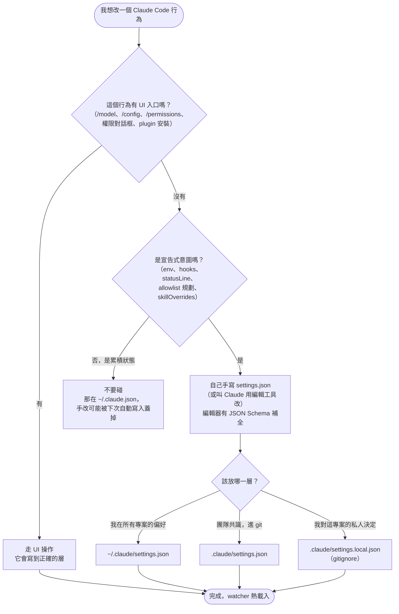

## 摘要（Summary）

settings.json 到底是設計給人改的，還是給 Claude Code 改的？本文追蹤反編譯原始碼中設定寫入函式 `updateSettingsForSource()`（`src/utils/settings/settings.ts:416`）的**全部呼叫點**，得出明確答案：**人是擁有者（owner），Claude Code 只是記錄員（recorder）**——它只在「使用者透過 UI 做了明確選擇」時代為寫入（權限對話框、/model、plugin 安裝），外加啟動時的版本遷移；每一筆寫入背後都有一個使用者動作，從不主動「幫你調整」設定。自由形態的機器狀態（使用計數、onboarding 旗標）則隔離到 `~/.claude.json`（global config），不污染 settings.json。原始碼中有四個「人是擁有者」的設計證據：合併不覆寫、JSON 壞了拒寫不摧毀、managed 層絕不寫、外部手動編輯被 file watcher 熱載入視為一級公民。

## 關鍵洞察（Key Insights）

- **分工線是「宣告式意圖 vs 累積性狀態」**：表達意圖與策略的欄位（`env`、`hooks`、`permissions` 規劃、`statusLine`）進 settings.json 給人寫；高頻累積的機器狀態（`skillUsage` 計數、啟動次數、tips 歷史）進 `~/.claude.json` 給程式寫——兩個檔案、兩種擁有權。
- **Claude Code 的每筆寫入都是「代錄使用者的明確選擇」**：按了「always allow」、選了模型、確認了風險對話框、裝了 plugin——沒有任何一條路徑是程式自發修改設定。
- **模型（Claude 本人）能改的範圍被白名單鎖死**：ConfigTool 的 `SUPPORTED_SETTINGS` 只開放 `model`、`alwaysThinkingEnabled`、`permissions.defaultMode`、`language` 等少數 key——LLM 不能透過工具亂寫任意欄位（但仍可用一般檔案編輯工具改，那屬於使用者指示的行為）。
- **寫入層級由使用者選**：權限對話框讓你選存到 user／project／local，程式尊重選擇——參見 [[2026-03-28-CLAUDE-CODE-USER-VS-PROJECT-LEVEL-CONFIG-GUIDE]] 的三層語意。

## 詳細內容（Details）

### 寫入情境全覽（追蹤 `updateSettingsForSource()` 全部呼叫點）

| 情境 | 寫入欄位 | 寫到哪一層 | 觸發者 |
|------|---------|-----------|--------|
| 權限對話框選擇（最大宗，`PermissionUpdate.ts`） | `permissions.allow` / `deny` / `ask`、`permissions.additionalDirectories`、`permissions.defaultMode` | 使用者在對話框選的層（user／project／local） | 使用者按「always allow」等 |
| UI 選擇器持久化 | `model`（/model）、`effort`、`alwaysThinkingEnabled`、`bypassPermissionsModeAccepted`、auto-mode 選擇加入 | 多為 userSettings | 使用者操作選擇器／對話框 |
| MCP 伺服器核准對話框 | `enabledMcpjsonServers` / `disabledMcpjsonServers` / `enableAllProjectMcpServers` | localSettings（個人信任決定，不進 git） | 使用者核准／拒絕 |
| Plugin／Marketplace 安裝 | `enabledPlugins`、`extraKnownMarketplaces` | user 或安裝時指定的層 | 使用者安裝指令 |
| 版本遷移（`src/migrations/`） | 模型名稱升級（sonnet-4.5→4.6 等）、`autoUpdates` 搬遷、廢棄欄位清除（`fastMode: undefined`） | userSettings | 啟動時自動（家務事） |
| ConfigTool（模型可呼叫） | 僅 `supportedSettings.ts` 白名單：`model`、`alwaysThinkingEnabled`、`permissions.defaultMode`、`language`、`autoMemoryEnabled` 等 | userSettings | 模型（受白名單限制） |
| Sandbox 信任 | sandbox 相關設定 | localSettings | 使用者確認 |

### 「人是擁有者」的四個原始碼證據

1. **合併不覆寫**：寫入時 `mergeWith` 現有檔案內容，只動目標欄位，手寫的其他欄位原封不動。
2. **壞了就不碰**：檔案有 JSON 語法錯誤時寫入直接失敗回報——原始碼註解明說 "return validation error **instead of overwriting**"（`settings.ts:456`）。寧可放棄記錄，也不摧毀手寫內容。
3. **managed 層絕不寫**：`policySettings`／`flagSettings`（IT 部署的 managed-settings.json）在寫入函式第一行就被擋掉（`settings.ts:420`）——管理員的地盤，程式與使用者都只能讀。
4. **外部編輯是一級公民**：`internalWrites.ts` 專門標記「這次是我自己寫的」讓 file watcher 忽略回音——反面意義是**人手改檔案會被 watcher 偵測並熱載入**，是設計內預期的正常操作。檔案還掛了 SchemaStore 的 JSON Schema（`constants.ts:202`）供編輯器自動補全——schema 是給人看的。

### 關鍵程式碼（Key Code Snippets）

寫入函式的防護（`src/utils/settings/settings.ts:416`）：

```typescript
export function updateSettingsForSource(
  source: EditableSettingSource,
  settings: SettingsJson,
): { error: Error | null } {
  if (
    (source as unknown) === 'policySettings' ||
    (source as unknown) === 'flagSettings'
  ) {
    return { error: null }   // managed 層：靜默拒寫
  }
  // ...
  if (rawData === null) {
    // JSON syntax error - return validation error instead of overwriting
    return {
      error: new Error(`Invalid JSON syntax in settings file at ${filePath}`),
    }
  }
```

ConfigTool 白名單節選（`src/tools/ConfigTool/supportedSettings.ts`）——注意 `source: 'global'` 與 `source: 'settings'` 的分流：

```typescript
export const SUPPORTED_SETTINGS: Record<string, SettingConfig> = {
  theme:            { source: 'global',   ... },  // → ~/.claude.json
  autoCompactEnabled: { source: 'global', ... },
  model:            { source: 'settings', ... },  // → settings.json
  alwaysThinkingEnabled: { source: 'settings', ... },
  'permissions.defaultMode': { source: 'settings', ... },
  language:         { source: 'settings', ... },
}
```

### 對照組：`~/.claude.json`（global config）才是機器的地盤

透過 `saveGlobalConfig()` 寫入的內容性質完全不同：`skillUsage` 使用計數（7 天半衰期排名用，見 [[2026-08-14-CLAUDE-CODE-SKILL-BUDGET-MECHANISM-AND-REDUCTION-FLOW]]）、啟動次數、onboarding 旗標、tips 顯示歷史、theme／editorMode 等 UI 狀態、各專案歷史。這個檔**高頻寫入、無 schema 文件、不設計給人編輯**。

### 使用者決策流程（我該自己改，還是讓 UI 改？）



> [!warning] 兩個手改注意事項
> ① 程式寫入時會重新序列化，你手排的格式可能被重排（JSON 也不支援註解）；② managed-settings.json 與 `~/.claude.json` 不要手改——前者會被 IT 覆蓋，後者會被程式覆蓋。

## 我的心得（My Takeaways）

1. 判斷一個設定檔「該不該手改」的通用方法：看程式**怎麼寫它**。merge＋壞檔拒寫＋掛 schema = 給人的；整檔重寫＋高頻＋無文件 = 給機器的。這個判別法適用於任何工具的設定檔。
2. Claude Code 把「意圖」與「狀態」拆成兩個檔案是值得抄的設計——很多工具把兩者混在一個檔裡，導致使用者手改被覆蓋、或機器狀態進了 git。
3. ConfigTool 白名單是「AI 自我修改權限」的一個保守範本：模型能改的 key 逐一登記、各有驗證器，而不是開放整份設定。

## 待補充（Open Questions）

- 官方現行版是否新增了更多寫入點（如 `/skills` UI 寫 `skillOverrides`）？反編譯快照可能落後。（搜尋：`claude code settings.json skillOverrides write UI`）
- `settings.local.json` 是誰負責加進 `.gitignore`？原始碼中未追到自動寫 gitignore 的邏輯。（搜尋：`claude code settings.local.json gitignore automatic`）
- 兩個程序同時寫 settings.json（兩個 session 同開）有無檔案鎖？`saveGlobalConfig` 有 lock，settings 路徑未確認。（搜尋：`claude code settings write lock concurrent sessions`）
- cowork 模式的 `cowork_settings.json`（`settings.ts:269`）的用途與生命週期？（搜尋：`claude code cowork_settings.json cowork mode`）
- managed settings 的 `managed-settings.d/*.json` drop-in 目錄合併順序對企業部署的實務影響？（搜尋：`claude code managed-settings.d drop-in precedence`）

## 相關連結（Related）

- [[2026-04-17-CLAUDE-CODE-SETTINGS-FILES-COMPLETE-GUIDE]] — settings 檔案體系完整指南，本文是其「寫入方」視角的原始碼補充
- [[2026-03-28-CLAUDE-CODE-USER-VS-PROJECT-LEVEL-CONFIG-GUIDE]] — user／project／local 三層語意，本文寫入層級選擇的背景
- [[2026-04-29-CLAUDE-CODE-HOOK-API-SOURCE-DEEP-DIVE]] — 同一反編譯 codebase 的 Hook 系統解析；hooks 正是「該手寫」的代表欄位
- [[2026-04-17-CLAUDEMD-MYTHS-DEBUNKED-SOURCE-CODE-VERIFICATION]] — 同方法論：以原始碼呼叫點追蹤核實機制
- [[2026-08-14-CLAUDE-CODE-SKILL-BUDGET-MECHANISM-AND-REDUCTION-FLOW]] — `skillOverrides`／`skillListingBudgetFraction` 等「該手寫」欄位的用途；`skillUsage` 進 global config 的實例

---

## 知識層次分析（Bloom's Taxonomy Analysis）

> 以下從五個認知層次對本篇內容進行結構化分析，協助從記憶到評估逐層深化理解。

| 認知層次 | 核心目的 | 對本文的具體應用 |
|---------|---------|--------------|
| **記憶（被動）** | 確認資訊存在，確立基礎知識 | ① 寫入函式 `updateSettingsForSource()` 與其 managed 層防護 ② 六類寫入情境（權限／UI 選擇器／MCP 核准／plugin／遷移／ConfigTool） ③ 意圖進 settings.json、狀態進 `~/.claude.json` ④ ConfigTool 白名單 `SUPPORTED_SETTINGS` |
| **理解（半被動）** | 串聯知識點，掌握核心邏輯 | 「人是 owner、程式是 recorder」：每筆程式寫入都對應一個使用者動作；merge＋拒寫壞檔＋schema 三件事共同構成「人的編輯優先」的契約 |
| **分析（主動）** | 檢驗論點、拆解假設 | 本文結論來自反編譯快照，官方現行版可能已增加寫入點；「從不主動修改」的例外其實存在——migrations 就是程式自發改值（雖然只是格式升級），嚴格說 owner 契約在版本升級時有豁免 |
| **應用（主動）** | 將理論轉為行動 | ① 把團隊共用的 permissions allowlist 移進 `.claude/settings.json` 進 git ② 檢查自己的 settings.local.json 是否累積了過時的「always allow」規則 ③ 用「程式怎麼寫它」判別法審視其他工具的設定檔 |
| **評估（主動）** | 判斷方案優劣與權衡 | 對比 VS Code（settings.json 混人機寫入、靠註解保留機制緩解）與 git（config 純人寫、狀態全在 .git/ 內部）：Claude Code 的雙檔案設計接近 git 哲學，代價是使用者要理解兩個檔案的分工——本文的決策流程圖就是在補這個學習成本 |

### 分析型追問（Socratic Follow-up）

> 以下問題供進一步反思，可用來與 AI 展開蘇格拉底式對話：

- **澄清**：「宣告式意圖」與「累積性狀態」的邊界怎麼劃？`model` 是意圖（放 settings）但 `theme` 是狀態（放 global config）——這條線的判準是什麼？
- **假設**：本文假設「有使用者動作背書的寫入就是安全的」——但「always allow」按太順手累積的規則，事後還算使用者的真實意圖嗎？
- **證據**：「外部編輯被熱載入」有 watcher 程式碼佐證，但熱載入的**範圍**（哪些欄位改了立即生效、哪些要重啟）本文未逐一驗證。
- **觀點**：反對者可以說雙檔案設計增加認知負擔——「為什麼 theme 不在 settings.json？」是新手常見困惑，單檔＋內部 `_state` 區塊會不會更好？
- **後果**：若未來 ConfigTool 白名單逐步擴大（AI 可改更多設定），「人是 owner」的契約會不會被溫水煮青蛙式侵蝕？

### 方案批判三問（Critical Evaluation）

1. **最大的風險是什麼？** — 手改與程式寫入的競態：你在編輯器開著 settings.json 未存檔，同時在 CLI 按了「always allow」，存檔時就會蓋掉程式剛寫的規則（程式是 merge，編輯器是整檔覆寫）。損失是安靜遺失一條權限規則。
2. **什麼情況下會失敗？** — ① 反編譯快照落後：官方新版寫入點可能已增加，本文清單非封閉集合；② 多 session 並發寫入的鎖機制未確認；③ 企業 managed 環境下，你手寫的欄位可能被 managed 層覆蓋而看似「沒生效」。
3. **有沒有更好的替代方案？** — 想避免手改風險可以全走 UI＋ConfigTool；想要可審計的設定管理可以把 `.claude/settings.json` 進 git 並用 PR 流程管理——後者對團隊比個人手改更穩，但犧牲了即時性。

## References

- 反編譯原始碼：`src/utils/settings/settings.ts`（寫入函式與防護）、`src/utils/settings/internalWrites.ts`（watcher 回音標記）、`src/utils/permissions/PermissionUpdate.ts`（權限寫入）、`src/tools/ConfigTool/supportedSettings.ts`（白名單）、`src/migrations/`（版本遷移）
- [Claude Code Settings 官方文件](https://code.claude.com/docs/en/settings)
- [claude-code-settings JSON Schema — SchemaStore](https://json.schemastore.org/claude-code-settings.json)
