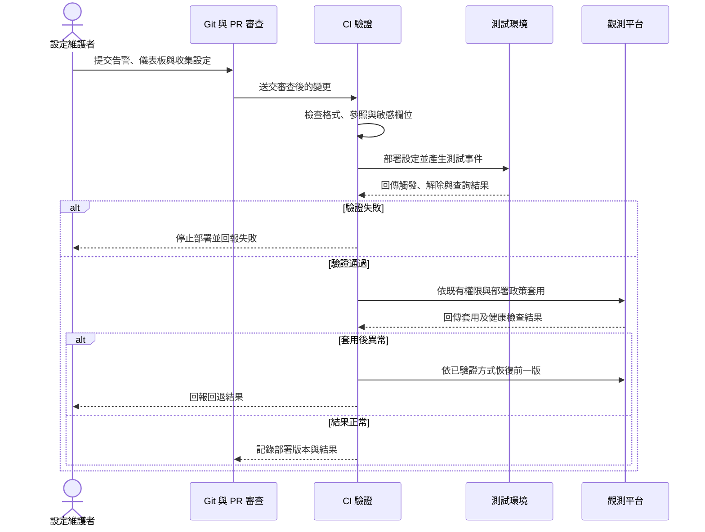

## TL;DR

- OaC 把觀測設定交給程式碼與版本控制管理，包括告警、儀表板與資料收集設定。
- 設定可審查、可追蹤，不等於信號有用或平台一定省錢。
- 先把一組告警與儀表板移入 PR 流程，確認能重建與回退，再擴大管理範圍。
- 原文是 2022 年概念介紹，沒有可執行範例或成效 benchmark。

## 摘要（Summary）

Joydip Kanjilal 將基礎設施即程式碼（Infrastructure as Code，IaC）的管理方式延伸到可觀測性即程式碼（Observability as Code，OaC）。本文摘錄概念重點，並加入研究者的採用與風險分析，非全文翻譯。

這張圖是概念照片，沒有設定欄位、架構元件或操作步驟，不能從中推導實作細節。與 Logz.io 的訪談封面相同，它提供識別與閱讀情境，技術資訊仍須從正文取得。

## 關鍵洞察（Key Insights）

作者主張以開發與測試已有的工具、流程管理觀測設定，使變更易追蹤、團隊易共享，並減少手動維護。文中舉 Terraform、Pulumi、CloudFormation 管理基礎設施，Puppet、Ansible 管理元件設定；平台選擇需考量擴充、彈性、可見度、告警與整合，也須設定資料留存。成本降低與更快擴充是文中的收益主張，未附量測證據。[原文](https://www.techtarget.com/it-infrastructure/tip/Observability-as-code-is-key-to-the-cloud-operating-model)

## 詳細內容（Details）

> [!note] 設定與資料要分開
> 本筆記的採用建議是版本化「收集與處理資料的設定」，而非把正式環境原始遙測、個資或憑證提交到 Git。原文沒有詳細說明這個治理邊界。

### 研究者提出的最小交付範圍

以下是新增的採用建議，未實際部署，也不代表原文指定的工具配置。

| 管理對象 | PR 中應檢查什麼 | 可觀察的驗證結果 |
|---|---|---|
| 資料收集設定 | 欄位、敏感資料、輸出位置與留存需求 | 測試事件到達指定後端，無非必要敏感欄位 |
| 告警 | 條件、責任人、路由與解除條件 | 測試事件會觸發，恢復事件會解除 |
| 儀表板 | 查詢、版本、服務識別與空資料狀態 | 測試環境能重建，連結到正確資料來源 |
| 部署流程 | 相依順序、權限與回退方式 | 設定失敗可被辨認，前一版可恢復 |

### 建議流程

這是研究者建議的流程。靜態檢查只能驗證部分設定，資料流、查詢、告警路由仍需要環境中的測試；本次僅建立知識筆記，未執行部署驗證。

### 與 ODD 與 CI/CD 的關係

[[2023-10-15-OBSERVABILITY-DRIVEN-DEVELOPMENT|ODD]] 決定功能要產生什麼信號；OaC 管理相應設定的變更；[[2023-07-10-CONTINUOUS-OBSERVABILITY-SHEDDING-LIGHT-ON-CICD-PIPELINES|CI/CD 可觀測性]] 則觀察這些變更如何被交付。三者合在一起才有機會回答「預期是什麼、部署了什麼、實際發生什麼」。這是本次綜合推論。

## 我的心得（My Takeaways）

我會先收斂手動改告警與儀表板造成的差異，再決定使用哪種 IaC 工具。可重建與可回退，比檔案格式本身更重要。把錯誤設定自動化，也可能讓錯誤傳播得更快，因此權限與分階段部署要一併設計。

## 待補充（Open Questions）

- 使用中的觀測平台有哪些可匯出或宣告式管理的物件？搜尋：`平台名稱 dashboard alert provisioning API`。
- 手動修改與 Git 宣告設定衝突時，以哪一個為準？搜尋：`observability configuration drift reconciliation`。
- 告警設定回退會如何影響已存在的事故狀態與通知？搜尋：`alert provisioning rollback incident state`。
- 目前的維護成本是否足以支持導入？需要比較手動變更時間、錯誤率與自動化維護時間。

## 相關連結（Related）

- [[2023-07-10-CONTINUOUS-OBSERVABILITY-SHEDDING-LIGHT-ON-CICD-PIPELINES]]：發布管線本身也需要觀測與失敗調查入口。
- [[2023-10-15-OBSERVABILITY-DRIVEN-DEVELOPMENT]]：先定義問題，再決定觀測設定。
- [[2026-04-11-CLAUDE-CODE-MONITORING-OPENTELEMETRY-TEAM-DATA]]：既有觀測堆疊筆記，可作為設定管理範圍的對照。

- [[2026-10-03-FREERTOS-RISCV-OBSERVABILITY-RESEARCH]]：FreeRTOS／RISC-V 的研究、證據與接續驗證，可對照本文的觀測方法。

## 知識層次分析（Bloom's Taxonomy Analysis）

| 認知層次 | 對本文的具體應用 |
|---|---|
| 記憶 | OaC、IaC、告警、儀表板、設定差異。 |
| 理解 | 把觀測設定放進審查與交付流程，讓其變更可追蹤。 |
| 分析 | 原文未證明省錢；自動部署與高品質觀測是不同成果。 |
| 應用 | 匯出一組告警與儀表板並建立 PR；在測試環境驗證觸發、解除與回退。 |
| 評估 | UI 手動設定快且門檻低；OaC 適合多人、多環境與高頻變更，但需要 API 支援與維護能力。 |

### 分析型追問（Socratic Follow-up）

- **澄清**：目前要版本化的是設定、查詢、儀表板還是資料本身？
- **假設**：若平台不能完整匯出設定，如何證明可重建？
- **證據**：哪些變更紀錄能驗證手動錯誤下降？
- **觀點**：低頻修改告警的小團隊，為何可能偏好 UI？
- **後果**：一年後誰處理 API 版本、provider 升級與設定差異？

### 方案批判三問

1. **最大風險**：共用錯誤設定一次影響多環境，導致告警失效或敏感資料外送。
2. **失敗條件**：平台 API 不完整、狀態管理不明確，或沒有可驗證的回退。
3. **替代方案**：先用 UI 管理並保留匯出快照與變更審查；適合物件少、變更低頻的環境。

## 六頂思考帽回饋（Six Thinking Hats Feedback）

### 藍帽：問題與範圍

選一組觀測設定，證明能審查、重建與回退。

### 白帽：事實與未知資訊

已核對作者、2022-07-25 發布日期與全文；原文沒有執行範例，使用者平台 API 能力未知。

### 紅帽：直覺與讀者反應

沿用既有 Git 流程容易理解；工具清單可能讓人誤以為所有工具都需要導入。

### 黃帽：價值與可保留內容

設定變更能保留審查與責任紀錄，有助於多環境協作。

### 黑帽：風險與限制

省錢、擴充與自動修復仍需驗證；版本控制不能取代資料治理。

### 綠帽：替代方案與新應用

先管理變更最頻繁的一組告警，保留 UI 操作作為受控的緊急途徑，再回填設定。

### 藍帽：修改項目與下一步

- 定義版本控制的物件與禁止提交的資料。
- 以一組設定驗證重建、觸發與回退。
- 明訂緊急手動修改後的回填責任。

## References

- [Joydip Kanjilal：Observability as code is key to the cloud operating model](https://www.techtarget.com/it-infrastructure/tip/Observability-as-code-is-key-to-the-cloud-operating-model)，2022-07-25。
