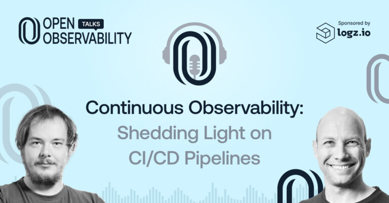
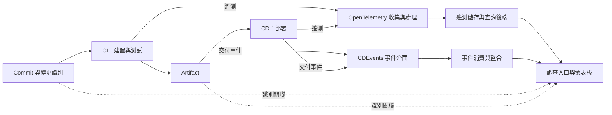

## TL;DR

- 發布管線本身也是需要觀測的系統；只監控正式環境，仍會漏掉建置與部署瓶頸。
- 先把一次 pipeline run 與各步驟的時間、結果、錯誤串起來，再處理跨工具關聯。
- OpenTelemetry 處理遙測；CDEvents 定義交付事件；OaC 管理設定；ODD 決定開發時要回答哪些問題。
- 影片談的是 2023 年提案。2026-10-03 查核的官方 CI/CD 語意規範已標示 Release Candidate，仍不代表每個工具都支援。

## 摘要（Summary）

Dotan Horovits 與 Jenkins 維護者 Oleg Nenashev 討論軟體交付流程的可觀測性（Observability）。Logz.io 同名文章是這次訪談的精簡整理，因此合併收錄，避免重複建立相同主題的孤立筆記。影片資訊、章節與英文自動字幕均已取得；本文為意譯摘要與研究分析，非逐字翻譯。

## 關鍵洞察（Key Insights）

### 交付流程也是產品的一部分

在 [01:00](https://www.youtube.com/watch?v=FEbyddZFNeo&t=60s) 的開場，主持人指出正式環境已有觀測能力，發布流程卻常被忽略。來賓在 [約 37:00](https://www.youtube.com/watch?v=FEbyddZFNeo&t=2220s) 強調：交付流程與營運基礎設施都影響產品。研究上的推論是，管線觀測的成效應連到失敗調查時間與交付等待時間，不能只計算新增幾張儀表板。

### 下鑽與全程關聯是兩個不同需求

主持人在 [約 35:30](https://www.youtube.com/watch?v=FEbyddZFNeo&t=2130s) 描述 Jenkins 與 Maven 的整合：原本看似單一的長步驟，可以拆出更細的建置階段。來賓接著談跨工具的交付鏈。前者需要足夠細的 instrumentation，後者需要一致的識別與事件語意；單一工具內有 trace，不保證整條交付鏈能串起來。

### 開放標準提供共同介面，實作仍需逐項驗證

Logz.io 的 2023-07-27 回顧指出，Jenkins、Tekton、Argo、Flux 等工具各有慣例，跨工具視野容易破碎；CDEvents 提供交付事件的共同語言，OpenTelemetry 提供廠商中立的遙測表示與傳送。文章提到的 CI/CD 擴充當時仍是提案。[文章來源](https://logz.io/blog/continuous-observability-cicd-pipelines/)

## 詳細內容（Details）

### 已核對的章節導覽

以下時間來自影片說明欄的 chapters；描述依字幕摘要。廣告與寒暄不逐句收錄。

| 時間 | 主題 | 閱讀重點 |
|---|---|---|
| [00:00](https://www.youtube.com/watch?v=FEbyddZFNeo&t=0s) | 節目開場 | 節目範圍與贊助資訊 |
| [01:00](https://www.youtube.com/watch?v=FEbyddZFNeo&t=60s) | 主題與來賓介紹 | 把發布流程納入觀測；來賓的硬體與自動化背景 |
| [10:08](https://www.youtube.com/watch?v=FEbyddZFNeo&t=608s) | Jenkins 近況 | 設定即程式碼、雲端部署、開發者體驗與遙測整合 |
| [15:46](https://www.youtube.com/watch?v=FEbyddZFNeo&t=946s) | Jenkins 是否雲端原生 | 來賓主張 cloud-friendly 已有價值；全面改寫控制器有相容與成本取捨 |
| [16:52](https://www.youtube.com/watch?v=FEbyddZFNeo&t=1012s) | CI/CD 工具版圖 | 多工具各司其職，工具之外還有組織政策與流程 |
| [21:54](https://www.youtube.com/watch?v=FEbyddZFNeo&t=1314s) | CDF 更新 | 交付涵蓋 artifact 分發；CDEvents 與互通性 |
| [27:00](https://www.youtube.com/watch?v=FEbyddZFNeo&t=1620s) | OpenTelemetry 的 CI/CD 支援 | 語意規範提案、跨工具關聯與逐步下鑽 |
| [40:31](https://www.youtube.com/watch?v=FEbyddZFNeo&t=2431s) | Backstage 開發者入口 | 把失敗線索帶到入口；可查詢後端或嵌入既有儀表板 |
| [47:47](https://www.youtube.com/watch?v=FEbyddZFNeo&t=2867s) | 聯絡來賓 | 社群交流與採用障礙 |
| [48:51](https://www.youtube.com/watch?v=FEbyddZFNeo&t=2931s) | State of CD 報告 | 講者討論速度停滯與品質投資；屬當時報告與個人解讀 |
| [52:32](https://www.youtube.com/watch?v=FEbyddZFNeo&t=3152s) | OTLP 1.0 | 回顧當年的協定里程碑 |
| [54:32](https://www.youtube.com/watch?v=FEbyddZFNeo&t=3272s) | 開發者活動 | 當年的 KubeCon 周邊活動資訊 |
| [55:55](https://www.youtube.com/watch?v=FEbyddZFNeo&t=3355s) | Jaeger 1.47 | 當年的 release 更新，非目前版本建議 |
| [57:30](https://www.youtube.com/watch?v=FEbyddZFNeo&t=3450s) | DevOps Pulse | 工具增加與調查成本的討論 |
| [58:55](https://www.youtube.com/watch?v=FEbyddZFNeo&t=3535s) | 結尾 | 節目與社群資訊 |

> [!warning] 自動字幕的限制
> 字幕會把 OpenTelemetry、Prometheus、Tekton、人名等辨識錯誤。專有名詞依影片說明與官方文件校正；未核實的版本號、數字及口誤不當成技術依據。來賓在訪談中也更正了當時的 CDF 職務，不能直接沿用開場頭銜作為現任職務。

### 影片中的具體案例

- **跨站點建置**：來賓早年管理跨站點工程自動化，說明建置系統同樣面對分散式系統的調查問題。
- **Jenkins → 建置工具**：Jenkins 呼叫 Maven 等工具；如果下游也提供遙測，調查者能再往內看，而非只知道整個 job 花很久。
- **Jenkins 搭配部署工具**：CI 與 CD 可以由不同工具負責，共同事件語意才有機會降低整合成本。
- **事件驅動測試環境**：約 [33:00](https://www.youtube.com/watch?v=FEbyddZFNeo&t=1980s) 討論 WireMock 可利用事件初始化測試或模擬 API；這是訪談中的應用構想，未提供可直接執行的範例。
- **Backstage 呈現調查入口**：約 [44:30](https://www.youtube.com/watch?v=FEbyddZFNeo&t=2670s) 討論查詢儲存後端、使用 Grafana 儀表板或嵌入既有介面，避免在入口網站重建整套查詢系統。

### 2026-10-03 官方查核

OpenTelemetry 官方 CI/CD 總覽與 spans 文件目前均標示 **Release Candidate**。官方已定義 pipeline run 與 pipeline task run 等語意；pipeline run 建議使用 `SERVER` span，並有結果等屬性。這補上了 2023 年「仍在提案」的時間差；不推論所有 Jenkins、GitHub Actions 或部署工具皆已支援。[CI/CD 總覽](https://opentelemetry.io/docs/specs/semconv/cicd/)、[CI/CD spans](https://opentelemetry.io/docs/specs/semconv/cicd/cicd-spans/)

### 四個來源的分工與整合

以下比較是本筆記的研究整理，並非任一作者提出的完整架構。

| 層次 | 要回答的問題 | 對應內容 |
|---|---|---|
| ODD | 功能上線後，如何知道符合預期？ | [[2023-10-15-OBSERVABILITY-DRIVEN-DEVELOPMENT]] |
| OaC | 如何審查、重建與部署觀測設定？ | [[2022-07-25-OBSERVABILITY-AS-CODE-IS-KEY-TO-THE-CLOUD-OPERATING-MODEL]] |
| CI/CD 可觀測性 | 程式從建置到部署，慢在哪裡、壞在哪裡？ | 本影片與 Logz.io 回顧 |
| OpenTelemetry／CDEvents | 不同工具如何交換與關聯資訊？ | 遙測規範與交付事件規範；需分別確認實作支援 |

### 綜合架構圖：事件與遙測各自的角色

以下是本筆記根據來源整理的概念架構，非影片中的實際部署圖。虛線表示跨系統需額外處理的識別關聯；此圖不宣稱 CDEvents 與 OTel 已自動互相轉換。

### 最小試點建議

以下為研究者建議，尚未在使用者的 CI/CD 環境執行。

1. 選一條常失敗或耗時的管線，列出排隊等待、建置、測試、部署的調查問題。
2. 記錄 run、attempt、commit、artifact 與 deployment 的關聯；高基數識別放在合適的事件或 trace 欄位，避免直接成為所有 metrics 的標籤。
3. 驗證一次失敗能從入口找到 job log 與對應 trace；重試、平行分支也要能分辨。
4. 把觀測設定納入 PR，量測調查時間與資料成本，再決定是否擴大。

## 我的心得（My Takeaways）

我會先證明「一個人能更快查清一次失敗」，再投資全公司跨工具標準化。[[2026-04-11-CLAUDE-CODE-MONITORING-OPENTELEMETRY-TEAM-DATA]] 的工具使用觀測，則可延伸思考開發工具與交付管線如何共同提供線索。兩者不能因都使用 OTel 就假定已經串接。

## 待補充（Open Questions）

- 目前使用的 Jenkins／Maven／部署工具版本，各支援哪些 CI/CD 語意與上下文傳播？搜尋：`Jenkins OpenTelemetry plugin Maven trace context`。
- 重試、平行工作與 merge train 如何關聯，才能避免把不同 attempt 當成同一次成功？搜尋：`CI CD span links retry pipeline run`。
- 團隊對管線調查時間、事件留存與遙測成本的可接受上限是多少？需要試點量測，外部來源無法代答。
- CDEvents 與 OTel 的映射是否滿足目前工具鏈需求？搜尋：`CDEvents OpenTelemetry mapping interoperability`。

## 相關連結（Related）

- [[2023-10-15-OBSERVABILITY-DRIVEN-DEVELOPMENT]]：先在設計時定義要回答的問題。
- [[2022-07-25-OBSERVABILITY-AS-CODE-IS-KEY-TO-THE-CLOUD-OPERATING-MODEL]]：觀測設定也應隨交付流程被審查與部署。
- [[2026-04-11-CLAUDE-CODE-MONITORING-OPENTELEMETRY-TEAM-DATA]]：開發工具遙測與團隊使用觀測的既有實戰筆記。
- [[2026-04-13-CLAUDE-CODE-TELEMETRY-OTEL-SOURCE-DEEP-DIVE]]：補充 instrumentation、匯出與上下文的實作視角。
- [[2026-04-07-GSTACK-TELEMETRY-ARCHITECTURE]]：對照輕量事件收集與 OTel 的適用邊界。

## 知識層次分析（Bloom's Taxonomy Analysis）

| 認知層次 | 對本文的具體應用 |
|---|---|
| 記憶 | CI/CD、pipeline run、span、CDEvents、OTLP；27:00 是語意規範討論章節。 |
| 理解 | 儀表板需要可關聯的資料；跨工具事件與工具內部 trace 解決不同尺度的問題。 |
| 分析 | 互通性仍依賴識別、工具支援與事件完整度；有共同協定不能保證完整因果鏈。 |
| 應用 | 立即畫出一條管線的失敗調查路徑；另選一次重試 run 驗證識別是否正確。 |
| 評估 | 單一工具內建頁面便宜且易上手；跨工具 OTel／事件整合提供更完整視野，但增加維護與儲存成本。 |

### 分析型追問（Socratic Follow-up）

- **澄清**：團隊所稱的「端到端」包含 commit、artifact、部署與使用者請求中的哪些邊界？
- **假設**：如果部署工具無法傳播上下文，還能用哪些識別建立可信關聯？
- **證據**：要用哪些調查時間與失敗案例，驗證統一遙測確實有益？
- **觀點**：單一 CI 工具的維護者，為何可能選擇先改善內建 log，而不導入事件匯流？
- **後果**：一年後，事件留存、高基數與 schema 升級會產生多少維護負擔？

### 方案批判三問

1. **最大風險**：不完整關聯讓儀表板看似完整，卻把錯誤 artifact 或重試結果連在一起。
2. **失敗條件**：事件遺漏、時鐘差異、缺少 attempt 識別，或工具版本不支援預期規範。
3. **替代方案**：先保留 job log 與 artifact metadata 的直接連結；工具少、問題單純時，這比全面整合更容易維護。

## 六頂思考帽回饋（Six Thinking Hats Feedback）

### 藍帽：問題與範圍

判斷哪一段交付流程最值得先觀測，不把全公司標準化當成試點前提。

### 白帽：事實與未知資訊

已取得英文自動字幕、影片章節與回顧文章；已核對官方 Release Candidate 狀態。使用者工具鏈與成效資料未知。

### 紅帽：直覺與讀者反應

把慢步驟拆開的案例容易理解；基金會與規範名稱密集，讀者可能不確定該從哪個工具開始。

### 黃帽：價值與可保留內容

保留真實時間點與 Jenkins／Maven 案例，能讓讀者直接回看，並把抽象規範連到具體調查。

### 黑帽：風險與限制

自動字幕不能支撐精確版本資訊；2023 年職務、報告與工具更新也不能當成現況。

### 綠帽：替代方案與新應用

將「每次失敗是否能找到原因」做成試點檢查，再決定入口網站、trace 與事件整合的次序。

### 藍帽：修改項目與下一步

- 先建立一條管線的識別與調查入口。
- 驗證失敗、重試與平行工作三種情境。
- 以調查時間和遙測成本決定擴大範圍。

## References

- [原始影片](https://www.youtube.com/watch?v=FEbyddZFNeo)，2023-07-10。
- [Dotan Horovits：同名回顧文章](https://logz.io/blog/continuous-observability-cicd-pipelines/)，2023-07-27。
- [OpenTelemetry CI/CD 語意規範](https://opentelemetry.io/docs/specs/semconv/cicd/)，2026-10-03 查核。
- [OpenTelemetry CI/CD spans](https://opentelemetry.io/docs/specs/semconv/cicd/cicd-spans/)。
- [CDEvents 官方文件](https://cdevents.dev/docs/)。
