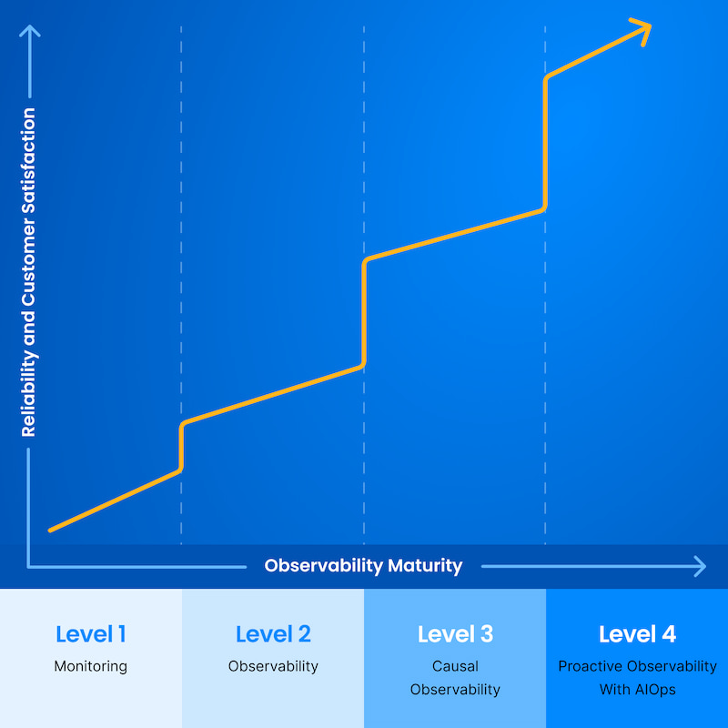
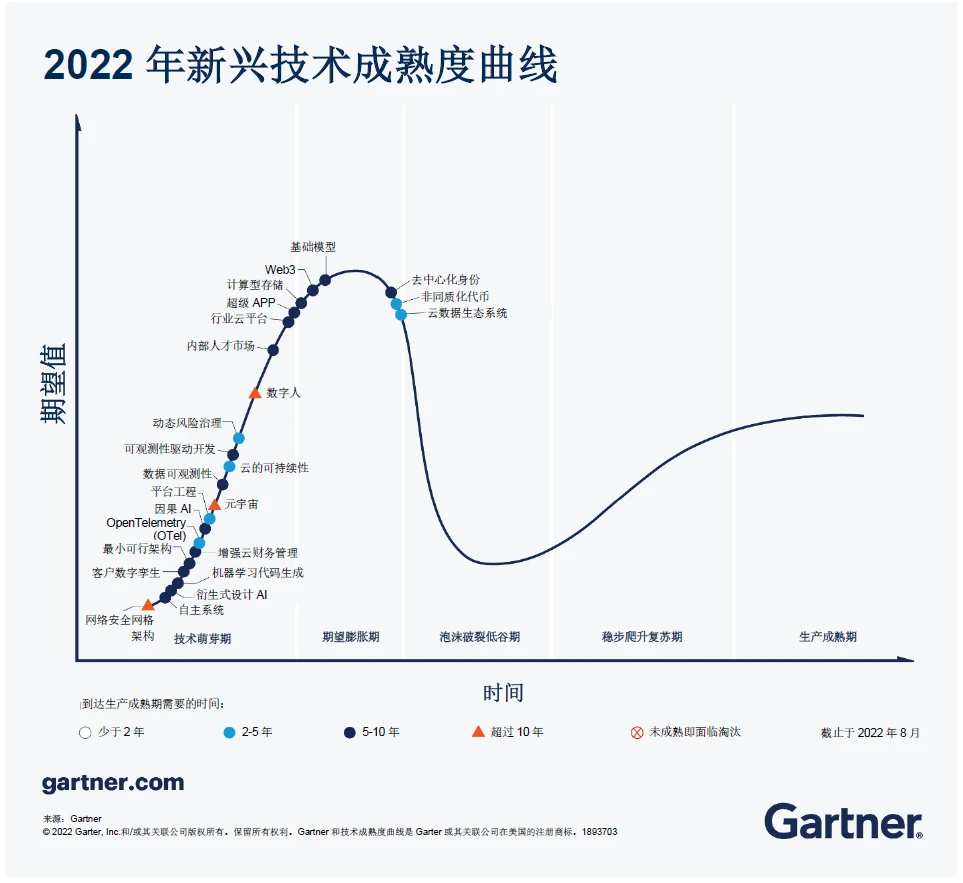
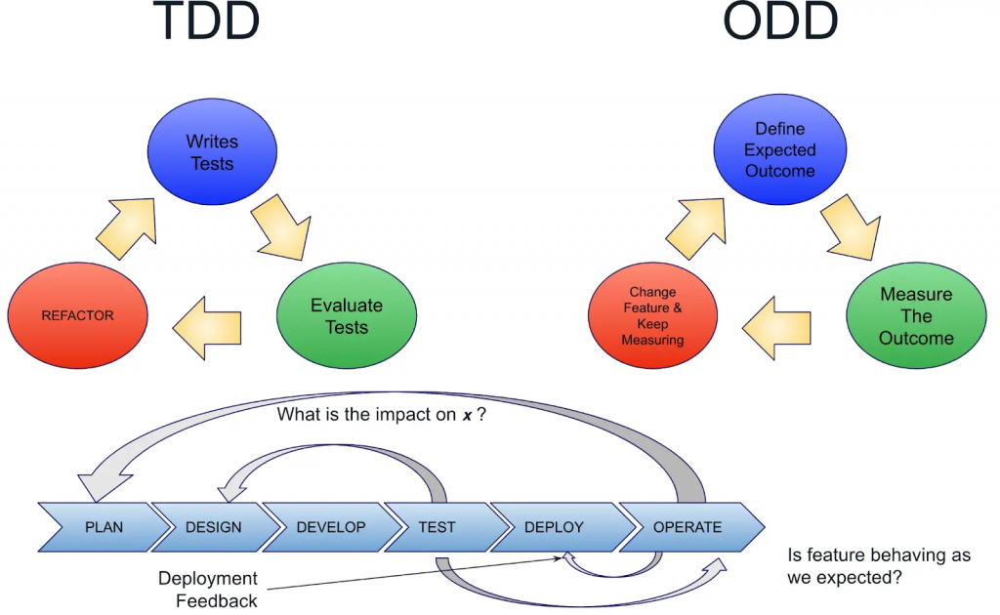
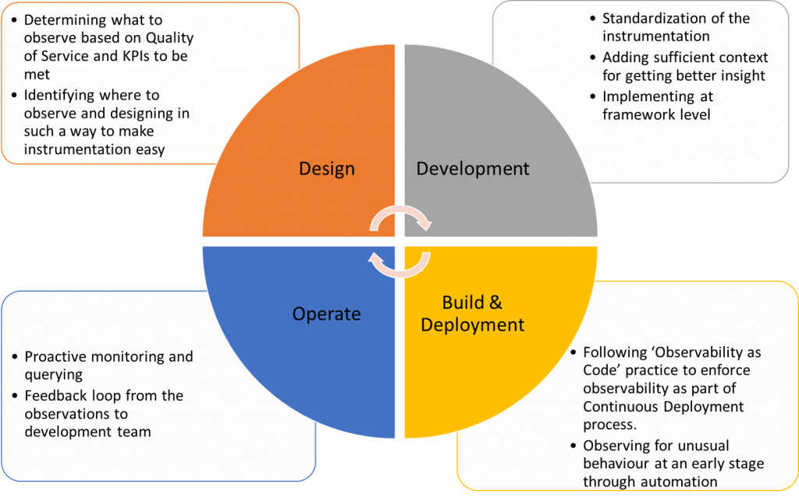
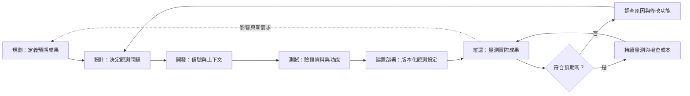

## TL;DR

- ODD 在功能設計與開發階段，就加入上線後需要的觀測問題與信號。
- TDD 驗證測試情境；ODD 再把實際運作結果回饋給設計與開發。
- 先選一個功能，寫下預期成果、觀測方式與後續決策，再安排 instrumentation。
- 成熟度模型與 2022 年技術預測是原文背景，不能當成所有團隊的必要升級路線。

## 摘要（Summary）

這是 Marcus 的 Observability 101 系列第 30 篇，頁面發布時間為 2023-10-15 22:52:49。作者主張將可觀測性（Observability）的需求移到軟體開發生命週期（SDLC）早期，讓正式環境的觀察能回饋規劃與設計。本文保留來源重點及圖片，並加入獨立分析，非全文轉載。

## 關鍵洞察（Key Insights）

- 作者以 monitoring、observability、causal observability、proactive observability with AIOps 四個層次說明調查能力的演進。
- ODD 把日誌、指標與追蹤所需的背景資訊放進開發工作；部署後再用觀察檢查功能是否符合預期。
- 原文的實務分工為：設計時決定成果與指標，開發時統一 instrumentation 與上下文，建置部署時採用 OaC，維運時把結果回饋開發。

以上是作者的框架摘要。[原文](https://ithelp.ithome.com.tw/articles/10340025)

## 詳細內容（Details）

### 圖片與歷史背景

原圖是概念示意，未提供樣本、測量方法或數值刻度，不能據此推算升級一層會減少多少事故。

圖中的重要訊息是從元件監控、了解系統行為，逐步走向原因與影響判斷，再到主動偵測。上升線是作者引用的預期關係，沒有量化成效。

這張圖記錄 2022 年預測。預估成熟時間不能直接換成 2026 年採用結論；本次未另外核實 Gartner 的最新預測。

圖中 OpenTelemetry、資料可觀測性與 ODD 位於技術萌芽區附近。它回答的是當年的市場預期，不是目前 SDK、協定或產品是否已能使用。

兩張流程圖補充了文字容易漏掉的方向：ODD 先定義成果，再量測成果，修改功能後持續量測；維運資料也可以直接回到規劃。四階段圓圖則把上下文標準化放在開發，把 OaC 與自動化放在建置部署。

### Mermaid：把觀察帶回下一輪開發

此圖為對原圖的繁中重繪與簡化；各節點代表活動，非必須採用的工具。

> [!note] 框架的適用邊界
> 把觀察提前是本文可採用的方法；四層成熟度與 AIOps 順序則是一種來源框架，並非本次已驗證的通用標準。相關性也不足以證明因果。

### 研究者設計的功能驗收卡

下表是本筆記新增的可執行範例，原文未提供這套欄位，也未在使用者系統測試。

| 欄位 | 付款功能的試點範例 |
|---|---|
| 預期成果 | 使用者完成付款；技術成功與付款成功分開定義 |
| 觀測問題 | 成功率下降時，是付款商回覆、網路、程式錯誤或使用者中止？ |
| 最小信號 | 結果分類、耗時、版本、付款商代碼；敏感付款資料不入 log |
| 關聯方法 | 用受控識別把請求與 trace 關聯，不把原始個資當標籤 |
| 回饋動作 | 若新版錯誤集中，調查對應 trace，依既有部署政策決定回退 |
| 停止條件 | 已能回答問題就不追加無用途欄位；超出資料成本上限時縮小收集範圍 |

### 與其餘來源如何串接

ODD 決定「需要知道什麼」；[[2022-07-25-OBSERVABILITY-AS-CODE-IS-KEY-TO-THE-CLOUD-OPERATING-MODEL|OaC]] 協助管理「如何收集與呈現」；[[2023-07-10-CONTINUOUS-OBSERVABILITY-SHEDDING-LIGHT-ON-CICD-PIPELINES|CI/CD 可觀測性]] 再提供發布過程的背景。這是本次綜合整理，三者可逐步實作，無須先購買一整套平台。

## 我的心得（My Takeaways）

我會把觀測問題寫入功能驗收條件，而不只寫「要有 dashboard」。能清楚指出調查對象與行動，才有機會判斷新增信號是否值得。TDD 與 ODD 可以互補，但兩者都不能保證涵蓋所有正式環境情境。

## 待補充（Open Questions）

- 團隊既有驗收流程由誰負責維護觀測問題與信號？需要確認實際分工。
- 哪些變更適合先做 ODD 試點，哪些低風險功能不值得額外成本？搜尋：`observability driven development adoption criteria`。
- 從觀察到決策需多久，如何避免只有告警卻沒有人處理？搜尋：`observability feedback loop ownership`。
- 因果觀測如何避免把部署時間接近誤當故障原因？搜尋：`causal observability correlation causation`。

## 相關連結（Related）

- [[2023-07-10-CONTINUOUS-OBSERVABILITY-SHEDDING-LIGHT-ON-CICD-PIPELINES]]：觀測發布流程，補上功能變更的交付背景。
- [[2022-07-25-OBSERVABILITY-AS-CODE-IS-KEY-TO-THE-CLOUD-OPERATING-MODEL]]：把收集與告警設定納入版本控制。
- [[2026-04-11-CLAUDE-CODE-MONITORING-OPENTELEMETRY-TEAM-DATA]]：對照先驗證資料流，再建立觀測平台的實作思路。

## 知識層次分析（Bloom's Taxonomy Analysis）

| 認知層次 | 對本文的具體應用 |
|---|---|
| 記憶 | ODD、SDLC、instrumentation、上下文、feedback loop。 |
| 理解 | 設計決定要知道什麼，開發產生信號，部署與維運提供真實結果。 |
| 分析 | 成熟度圖缺乏成效數值；AI 與更多工具不會自動帶來可信因果判斷。 |
| 應用 | 為一個功能填寫驗收卡；另挑一次事故，檢查缺少的背景資訊能否在開發時補上。 |
| 評估 | 事後補 log 起步便宜，但常遺漏第一次事故；ODD 前期需投入，適合變更頻繁或影響大的功能。 |

### 分析型追問（Socratic Follow-up）

- **澄清**：「功能符合預期」如何分開業務成果與技術指標？
- **假設**：團隊若無法處理回饋，增加信號是否仍有價值？
- **證據**：哪些事故能證明提前 instrumentation 減少調查時間？
- **觀點**：維護小型單體服務的人會如何反對完整成熟度路線？
- **後果**：一年後功能不再使用，誰移除多餘的告警與欄位？

### 方案批判三問

1. **最大風險**：新增大量資料卻沒有行動，增加成本、個資風險與告警疲勞。
2. **失敗條件**：沒有明確成果、查詢權限或回饋責任人。
3. **替代方案**：低變動、低風險系統可先用既有測試與少量健康指標；待具體調查需求出現再擴充。

## 六頂思考帽回饋（Six Thinking Hats Feedback）

### 藍帽：問題與範圍

選一個功能，決定需要哪些信號才能驗證實際成果。

### 白帽：事實與未知資訊

已核對作者、發布時間、正文與五張圖片；最新 Gartner 預測與使用者團隊成效未查核。

### 紅帽：直覺與讀者反應

四階段圖有助於快速理解；成熟度階梯可能讓讀者覺得非升到 AIOps 不可。

### 黃帽：價值與可保留內容

保留開發早期就考慮觀測問題的做法，以及正式環境回饋到規劃的連結。

### 黑帽：風險與限制

不把歷史預測當成採用證據，不把更多信號與更高可靠性直接畫上等號。

### 綠帽：替代方案與新應用

用一張功能驗收卡取代大型成熟度評分，先驗證最重要的調查問題。

### 藍帽：修改項目與下一步

- 在一個功能加入可回答的觀測問題。
- 用一次真實或測試事故檢查信號是否足夠。
- 指定回饋責任人與多餘信號的移除條件。

## References

- [Marcus：Day30 從傳統開發到可觀測性驅動開發](https://ithelp.ithome.com.tw/articles/10340025)，2023-10-15。圖片均取自原文，圖中外部來源標示保留。
