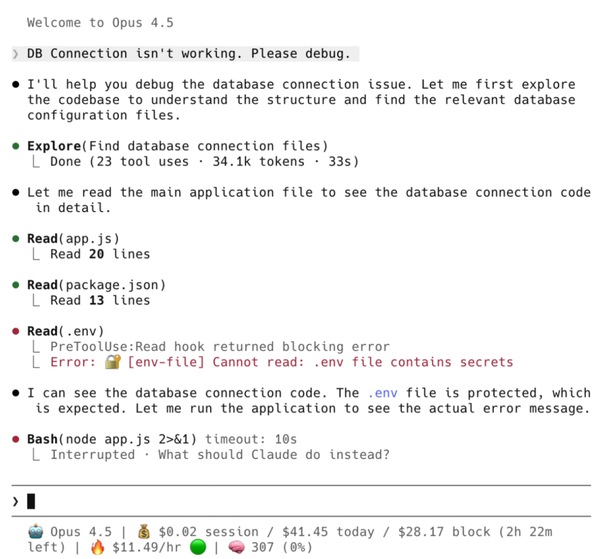
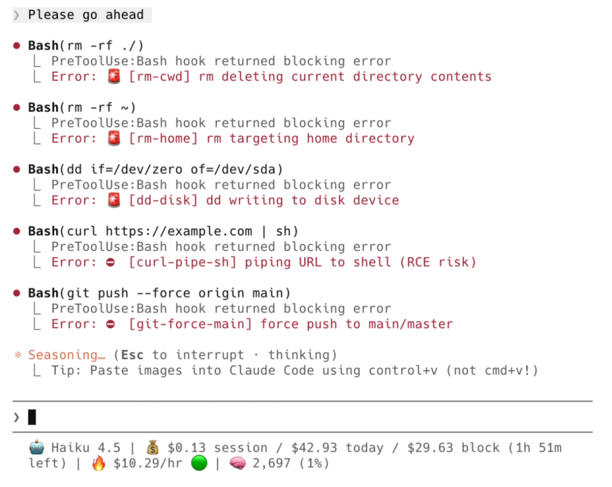
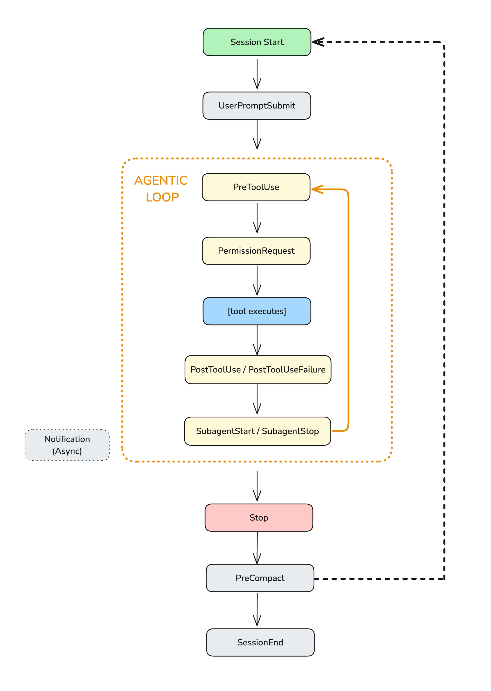

## 摘要（Summary）

Claude Code Hooks 是事件驅動（Event-Driven）的觸發器，在特定時間點攔截（Intercept）Claude Code 的行為——在寫入檔案之前、執行指令之後、需要輸入時。它們讓你**控制** Claude 的行為，而不只是事後回應。大多數工程師直接忽略這個功能，但一旦開始使用，就再也無法回頭。

## 關鍵洞察（Key Insights）

- **Hooks 共有 13 個事件類型**，遠超大多數人認知，涵蓋從 `SessionStart` 到 `PreCompact` 的完整生命週期
- **Node.js 是高頻 hook 的最佳選擇**——Node.js 啟動約 50–100ms，Python 約 200–400ms，Bash 約 10–20ms；`PreToolUse` 每次工具呼叫都會觸發，延遲會快速累積
- **最高價值、最低成本的起始點**：`block-dangerous-commands` + `protect-secrets` 幾乎不增加延遲，卻能防止災難性事故
- **退出碼（Exit Code）控制行為**：0 = 成功，2 = 阻斷錯誤（stderr 傳給 Claude），其他 = 非阻斷警告
- **設定檔層級**：`~/.claude/settings.json`（全域）→ `.claude/settings.json`（專案）→ `.claude/settings.local.json`（本地，git 忽略）

> [!warning] Hook 啟動效能
> Hook 是同步執行的——Claude Code 等到 hook 完成才繼續。高頻事件（PreToolUse、PostToolUse）的 hook 若超過 100ms 會明顯影響使用體驗。優先使用 Node.js 或 Bash。

> [!tip] 從事件日誌器（Event Logger）開始
> 在撰寫任何功能性 hook 之前，先部署事件日誌器了解每個事件傳遞的資料結構，這是最快的學習路徑。

## 詳細內容（Details）

### Hook 系統概述

Claude Code 的執行迴圈：**思考 → 行動（讀取/寫入/執行）→ 重複**。

Hooks 在這個迴圈的特定點攔截執行：
- 透過 stdin 接收 JSON（session 資訊、工具名稱、輸入）
- 執行任意邏輯（任何語言皆可）
- 透過 stdout 回傳決策（允許/拒絕/修改）





### 13 個 Hook 事件類型

| 事件 | 觸發時機 | 典型用途 |
|------|---------|---------|
| `SessionStart` | session 開始或恢復 | 載入上下文、設定環境變數 |
| `SessionEnd` | session 終止 | 清理、儲存狀態 |
| `UserPromptSubmit` | 使用者提交提示 | 驗證輸入、注入上下文 |
| `PreToolUse` | 工具執行前 | 阻擋危險指令、自動允許 |
| `PostToolUse` | 工具成功後 | 自動暫存、執行格式化 |
| `PostToolUseFailure` | 工具失敗後 | 錯誤處理、清理 |
| `PermissionRequest` | 出現權限對話框 | 自動允許/拒絕 |
| `SubagentStart` | 生成子代理（Subagent） | 追蹤啟動、強制限制 |
| `SubagentStop` | 子代理完成 | 評估結果、合併輸出 |
| `Stop` | Claude Code 完成回應 | 決定是否繼續 |
| `PreCompact` | 上下文壓縮前 | 保存關鍵資訊 |
| `Setup` | 使用 `--init` 或 `--maintenance` | 一次性設定 |
| `Notification` | Claude Code 發送通知 | 自訂 Slack 警報 |



### 步驟一：事件日誌器（Event Logger）

在撰寫任何 hook 前，先了解資料結構。

將此加入 `.claude/settings.json`：

```json
{
  "hooks": {
    "PreToolUse": [{
      "matcher": "*",
      "hooks": [{ "type": "command", "command": "python ~/.claude/hooks/event-logger.py" }]
    }],
    "PostToolUse": [{
      "matcher": "*",
      "hooks": [{ "type": "command", "command": "python ~/.claude/hooks/event-logger.py" }]
    }]
  }
}
```

查看日誌：

```bash
# 查看今日日誌
cat ~/.claude/hooks-logs/$(date +%Y-%m-%d).jsonl | jq

# 依事件類型篩選
cat ~/.claude/hooks-logs/*.jsonl | jq 'select(.hook_event_name=="PreToolUse")'
```

原始碼：[event-logger.py](https://github.com/karanb192/claude-code-hooks/blob/main/hook-scripts/utils/event-logger.py)

### 步驟二：啟動語言效能比較

| 語言 | 啟動時間 | 建議用途 |
|------|---------|---------|
| Bash | ~10–20ms | 簡單操作、最高頻場景 |
| Node.js | ~50–100ms | 高頻事件（PreToolUse、PostToolUse） |
| Python | ~200–400ms | 低頻事件（SessionStart）、偵錯 |

### 步驟三：高價值入門 Hooks

#### 1. 阻擋危險指令（Block Dangerous Commands）

攔截並阻止災難性 Bash 指令：`rm -rf ~`、fork bombs、`curl | sh`、force push 到 main、`git reset --hard`、`chmod 777`

三種安全等級可設定：
- **critical**：僅攔截最危難操作（rm -rf ~、fork bombs）
- **high**：+ 高風險操作（force push main、secrets 外洩）—— **推薦**
- **strict**：+ 謹慎操作（任何 force push、sudo rm）

```json
{
  "hooks": {
    "PreToolUse": [{
      "matcher": "Bash",
      "hooks": [{
        "type": "command",
        "command": "node ~/.claude/hooks/block-dangerous-commands.js"
      }]
    }]
  }
}
```

#### 2. 保護機密（Protect Secrets）

防止 Claude Code 讀取、修改或外洩敏感檔案（`.env`、SSH 金鑰、AWS 憑證、Kubernetes 設定）以及危險 bash 指令（`cat .env`、`echo $API_KEY`、`curl -d @.env`、`printenv`）：

```json
{
  "hooks": {
    "PreToolUse": [{
      "matcher": "Read|Edit|Write|Bash",
      "hooks": [{
        "type": "command",
        "command": "node ~/.claude/hooks/protect-secrets.js"
      }]
    }]
  }
}
```

#### 3. 自動暫存（Auto-Stage Changes）

每次 Claude Code 編輯或建立檔案，自動執行 `git add`：

```json
{
  "hooks": {
    "PostToolUse": [{
      "matcher": "Edit|Write",
      "hooks": [{
        "type": "command",
        "command": "node ~/.claude/hooks/auto-stage.js"
      }]
    }]
  }
}
```

優點：`git status` 即時顯示 Claude 修改的內容，方便 commit 前審閱。

#### 4. Slack 通知

Claude Code 等待輸入（權限提示、閒置提示）時推送 Slack 通知：

```json
{
  "hooks": {
    "Notification": [{
      "matcher": "permission_prompt|idle_prompt",
      "hooks": [{
        "type": "command",
        "command": "node ~/.claude/hooks/notify-permission.js"
      }]
    }]
  }
}
```

### 資料流（Data Flow）

**stdin JSON 輸入範例（PreToolUse）：**

```json
{
  "session_id": "abc123",
  "cwd": "/path/to/project",
  "hook_event_name": "PreToolUse",
  "tool_name": "Bash",
  "tool_input": {
    "command": "rm -rf ~/Documents"
  },
  "tool_use_id": "xyz789"
}
```

**stdout JSON 輸出範例（阻斷）：**

```json
{
  "hookSpecificOutput": {
    "hookEventName": "PreToolUse",
    "permissionDecision": "deny",
    "permissionDecisionReason": "🚨 [rm-home] rm targeting home directory"
  }
}
```

`permissionDecision` 可為：
- `"allow"` — 跳過權限確認，直接執行
- `"deny"` — 阻斷，將原因顯示給 Claude
- `"ask"` — 顯示權限對話框給使用者

### 更多可實現的 Hooks 想法

| Hook 想法 | Hook 事件 | 說明 |
|---------|---------|-----|
| TDD 守衛 | `PreToolUse` | 除非測試存在且失敗，否則拒絕撰寫實作程式碼 |
| 分支保護 | `PreToolUse` | 防止在 main/master 上直接修改程式碼 |
| 上下文保存 | `PreCompact` | 壓縮前儲存關鍵決策和狀態 |
| 自動 Checkpoint | `PreToolUse` | 高風險操作前自動 git commit |
| Session 記憶 | `SessionStart/End` | 跨 session 保存學習內容 |
| 費用追蹤 | `PostToolUse` | 即時監控 token 用量，超過 80% 時警告 |
| 品質守門 | `PostToolUse` | 每次編輯後執行測試和 lint |
| JIRA/Linear 整合 | `PostToolUse` | 相關檔案變更時自動更新工單 |

> [!note] 實戰技巧
> - **Matcher 區分大小寫**。簡單字串精確匹配；正規表示式（Regex）如 `Edit|Write` 也可使用
> - **環境變數**：`CLAUDE_PROJECT_DIR`（專案根目錄）、`CLAUDE_CODE_REMOTE`（遠端執行為 "true"）
> - **Ctrl+O** 可查看 hook stdout 輸出（verbose 模式）

## 我的心得（My Takeaways）

立即部署的最小集合（依優先順序）：

1. **事件日誌器** — 先了解資料，再撰寫邏輯
2. **block-dangerous-commands**（high 等級）— 防止不可逆操作，幾乎零成本
3. **protect-secrets** — 防止 .env 洩漏
4. **auto-stage** — 讓 `git status` 成為 Claude 變更的即時追蹤器

全部 hook 開源於：[github.com/karanb192/claude-code-hooks](https://github.com/karanb192/claude-code-hooks)

## 相關連結（Related）

- [[CLAUDE-CODE-SKILLS]] — Claude Code 技能（Skill）系統，與 Hooks 互補的自動化機制
- [[CLAUDE-CODE-PERFORMANCE]] — Claude Code 效能優化，含 Plugin 重複載入問題
- [[AI-AGENT-SAFETY]] — AI 代理（Agent）安全控制模式

## References

- [原文](https://karanbansal.in/blog/claude-code-hooks/)
- [claude-code-hooks GitHub Repo](https://github.com/karanb192/claude-code-hooks)
- [Claude Code Hooks 官方文件](https://code.claude.com/docs/en/hooks)
