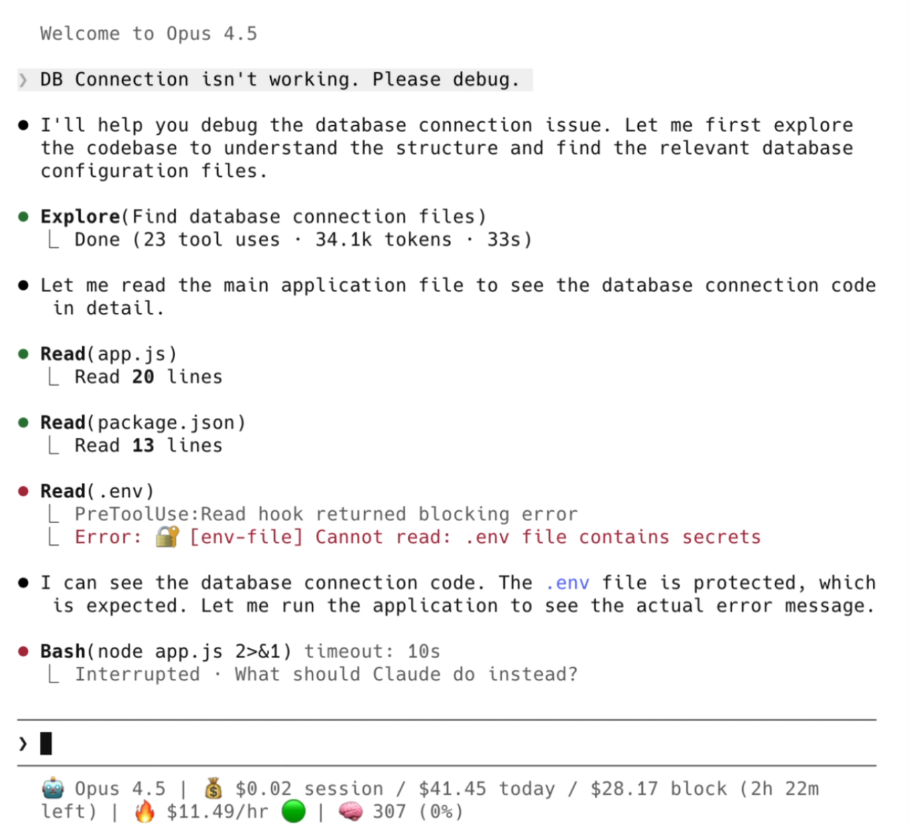
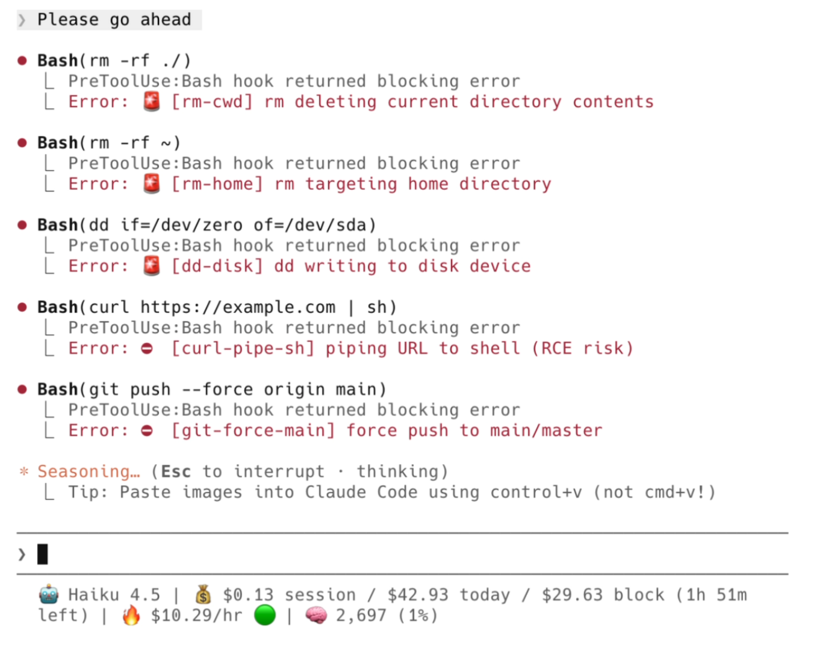
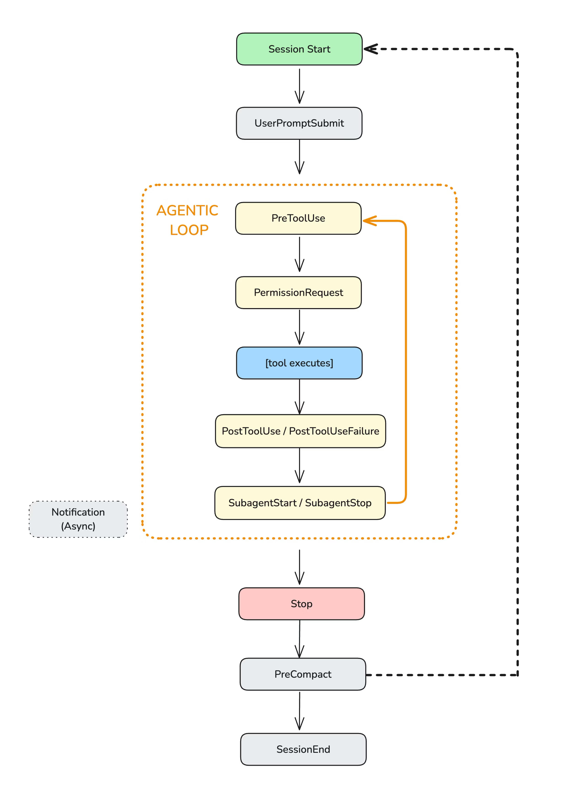

## 摘要（Summary）

Claude Code Hooks 是事件驅動（Event-Driven）的觸發器，在特定時間點攔截（Intercept）Claude Code 的行為——在寫入檔案之前、執行指令之後、需要輸入時。它們讓你**控制** Claude 的行為，而不只是事後回應。大多數工程師直接忽略這個功能，但一旦開始使用，就再也無法回頭。

## 關鍵洞察（Key Insights）

- **Hooks 共有 13 個事件類型**，遠超大多數人認知，涵蓋從 `SessionStart` 到 `PreCompact` 的完整生命週期
- **Node.js 是高頻 hook 的最佳選擇**——Node.js 啟動約 50–100ms，Python 約 200–400ms，Bash 約 10–20ms；`PreToolUse` 每次工具呼叫都會觸發，延遲會快速累積
- **最高價值、最低成本的起始點**：`block-dangerous-commands` + `protect-secrets` 幾乎不增加延遲，卻能防止災難性事故
- **退出碼（Exit Code）控制行為**：0 = 成功，2 = 阻斷錯誤（stderr 傳給 Claude），其他 = 非阻斷警告
- **設定檔層級**：`~/.claude/settings.json`（全域）→ `.claude/settings.json`（專案）→ `.claude/settings.local.json`（本地，git 忽略）

> [!warning] Hook 啟動效能
> Hook 是同步執行的——Claude Code 等到 hook 完成才繼續。高頻事件（PreToolUse、PostToolUse）的 hook 若超過 100ms 會明顯影響使用體驗。優先使用 Node.js 或 Bash。

> [!tip] 從事件日誌器（Event Logger）開始
> 在撰寫任何功能性 hook 之前，先部署事件日誌器了解每個事件傳遞的資料結構，這是最快的學習路徑。

## 詳細內容（Details）

### Hook 系統概述

Claude Code 的執行迴圈：**思考 → 行動（讀取/寫入/執行）→ 重複**。

Hooks 在這個迴圈的特定點攔截執行：
- 透過 stdin 接收 JSON（session 資訊、工具名稱、輸入）
- 執行任意邏輯（任何語言皆可）
- 透過 stdout 回傳決策（允許/拒絕/修改）





### 13 個 Hook 事件類型

| 事件 | 觸發時機 | 典型用途 |
|------|---------|---------|
| `SessionStart` | session 開始或恢復 | 載入上下文、設定環境變數 |
| `SessionEnd` | session 終止 | 清理、儲存狀態 |
| `UserPromptSubmit` | 使用者提交提示 | 驗證輸入、注入上下文 |
| `PreToolUse` | 工具執行前 | 阻擋危險指令、自動允許 |
| `PostToolUse` | 工具成功後 | 自動暫存、執行格式化 |
| `PostToolUseFailure` | 工具失敗後 | 錯誤處理、清理 |
| `PermissionRequest` | 出現權限對話框 | 自動允許/拒絕 |
| `SubagentStart` | 生成子代理（Subagent） | 追蹤啟動、強制限制 |
| `SubagentStop` | 子代理完成 | 評估結果、合併輸出 |
| `Stop` | Claude Code 完成回應 | 決定是否繼續 |
| `PreCompact` | 上下文壓縮前 | 保存關鍵資訊 |
| `Setup` | 使用 `--init` 或 `--maintenance` | 一次性設定 |
| `Notification` | Claude Code 發送通知 | 自訂 Slack 警報 |



### 步驟一：事件日誌器（Event Logger）

在撰寫任何 hook 前，先了解資料結構。

將此加入 `.claude/settings.json`：

```json
{
  "hooks": {
    "PreToolUse": [{
      "matcher": "*",
      "hooks": [{ "type": "command", "command": "python ~/.claude/hooks/event-logger.py" }]
    }],
    "PostToolUse": [{
      "matcher": "*",
      "hooks": [{ "type": "command", "command": "python ~/.claude/hooks/event-logger.py" }]
    }]
  }
}
```

查看日誌：

```bash
# 查看今日日誌
cat ~/.claude/hooks-logs/$(date +%Y-%m-%d).jsonl | jq

# 依事件類型篩選
cat ~/.claude/hooks-logs/*.jsonl | jq 'select(.hook_event_name=="PreToolUse")'
```

原始碼：[event-logger.py](https://github.com/karanb192/claude-code-hooks/blob/main/hook-scripts/utils/event-logger.py)

### 步驟二：啟動語言效能比較

| 語言 | 啟動時間 | 建議用途 |
|------|---------|---------|
| Bash | ~10–20ms | 簡單操作、最高頻場景 |
| Node.js | ~50–100ms | 高頻事件（PreToolUse、PostToolUse） |
| Python | ~200–400ms | 低頻事件（SessionStart）、偵錯 |

### 步驟三：高價值入門 Hooks

#### 1. 阻擋危險指令（Block Dangerous Commands）

攔截並阻止災難性 Bash 指令：`rm -rf ~`、fork bombs、`curl | sh`、force push 到 main、`git reset --hard`、`chmod 777`

三種安全等級可設定：
- **critical**：僅攔截最危難操作（rm -rf ~、fork bombs）
- **high**：+ 高風險操作（force push main、secrets 外洩）—— **推薦**
- **strict**：+ 謹慎操作（任何 force push、sudo rm）

```json
{
  "hooks": {
    "PreToolUse": [{
      "matcher": "Bash",
      "hooks": [{
        "type": "command",
        "command": "node ~/.claude/hooks/block-dangerous-commands.js"
      }]
    }]
  }
}
```

#### 2. 保護機密（Protect Secrets）

防止 Claude Code 讀取、修改或外洩敏感檔案（`.env`、SSH 金鑰、AWS 憑證、Kubernetes 設定）以及危險 bash 指令（`cat .env`、`echo $API_KEY`、`curl -d @.env`、`printenv`）：

```json
{
  "hooks": {
    "PreToolUse": [{
      "matcher": "Read|Edit|Write|Bash",
      "hooks": [{
        "type": "command",
        "command": "node ~/.claude/hooks/protect-secrets.js"
      }]
    }]
  }
}
```

#### 3. 自動暫存（Auto-Stage Changes）

每次 Claude Code 編輯或建立檔案，自動執行 `git add`：

```json
{
  "hooks": {
    "PostToolUse": [{
      "matcher": "Edit|Write",
      "hooks": [{
        "type": "command",
        "command": "node ~/.claude/hooks/auto-stage.js"
      }]
    }]
  }
}
```

優點：`git status` 即時顯示 Claude 修改的內容，方便 commit 前審閱。

#### 4. Slack 通知

Claude Code 等待輸入（權限提示、閒置提示）時推送 Slack 通知：

```json
{
  "hooks": {
    "Notification": [{
      "matcher": "permission_prompt|idle_prompt",
      "hooks": [{
        "type": "command",
        "command": "node ~/.claude/hooks/notify-permission.js"
      }]
    }]
  }
}
```

### 資料流（Data Flow）

**stdin JSON 輸入範例（PreToolUse）：**

```json
{
  "session_id": "abc123",
  "cwd": "/path/to/project",
  "hook_event_name": "PreToolUse",
  "tool_name": "Bash",
  "tool_input": {
    "command": "rm -rf ~/Documents"
  },
  "tool_use_id": "xyz789"
}
```

**stdout JSON 輸出範例（阻斷）：**

```json
{
  "hookSpecificOutput": {
    "hookEventName": "PreToolUse",
    "permissionDecision": "deny",
    "permissionDecisionReason": "🚨 [rm-home] rm targeting home directory"
  }
}
```

`permissionDecision` 可為：
- `"allow"` — 跳過權限確認，直接執行
- `"deny"` — 阻斷，將原因顯示給 Claude
- `"ask"` — 顯示權限對話框給使用者

### 更多可實現的 Hooks 想法

| Hook 想法 | Hook 事件 | 說明 |
|---------|---------|-----|
| TDD 守衛 | `PreToolUse` | 除非測試存在且失敗，否則拒絕撰寫實作程式碼 |
| 分支保護 | `PreToolUse` | 防止在 main/master 上直接修改程式碼 |
| 上下文保存 | `PreCompact` | 壓縮前儲存關鍵決策和狀態 |
| 自動 Checkpoint | `PreToolUse` | 高風險操作前自動 git commit |
| Session 記憶 | `SessionStart/End` | 跨 session 保存學習內容 |
| 費用追蹤 | `PostToolUse` | 即時監控 token 用量，超過 80% 時警告 |
| 品質守門 | `PostToolUse` | 每次編輯後執行測試和 lint |
| JIRA/Linear 整合 | `PostToolUse` | 相關檔案變更時自動更新工單 |

> [!note] 實戰技巧
> - **Matcher 區分大小寫**。簡單字串精確匹配；正規表示式（Regex）如 `Edit|Write` 也可使用
> - **環境變數**：`CLAUDE_PROJECT_DIR`（專案根目錄）、`CLAUDE_CODE_REMOTE`（遠端執行為 "true"）
> - **Ctrl+O** 可查看 hook stdout 輸出（verbose 模式）

## 我的心得（My Takeaways）

立即部署的最小集合（依優先順序）：

1. **事件日誌器** — 先了解資料，再撰寫邏輯
2. **block-dangerous-commands**（high 等級）— 防止不可逆操作，幾乎零成本
3. **protect-secrets** — 防止 .env 洩漏
4. **auto-stage** — 讓 `git status` 成為 Claude 變更的即時追蹤器

全部 hook 開源於：[github.com/karanb192/claude-code-hooks](https://github.com/karanb192/claude-code-hooks)

## 待補充（Open Questions）

- Hook 腳本是以 session user 的身份執行，還是有沙盒（sandbox）隔離？若 hook 腳本本身有 bug 或被惡意修改，能對系統造成什麼程度的破壞？（建議搜尋：`claude code hook security sandbox isolation privilege`）
- `PreToolUse` hook 返回 `deny` 時，Claude 會收到 stderr 作為理由並嘗試其他方式繞過。有沒有「硬性終止整個 session」的機制，讓某些危險操作完全無法繞過？（建議搜尋：`claude code hook hard block session terminate bypass`）
- 13 個 hook 事件中，`SubagentStart` 和 `SubagentStop` 在 Claude 使用 Task tool 生成子代理時是否也會觸發？子代理的 hooks 設定是否繼承自父 session？（建議搜尋：`claude code subagent hook inheritance task tool spawn`）
- 若多個 hook 同時訂閱同一個事件（例如 `PreToolUse` 同時有 `block-dangerous-commands` 和 `protect-secrets`），執行順序如何決定？任一 hook 返回 deny 就阻斷，還是要全部 deny 才阻斷？（建議搜尋：`claude code multiple hooks same event execution order`）
- Hook 腳本以 Node.js 執行約 50–100ms，在 CI/CD 遠端執行環境（`CLAUDE_CODE_REMOTE=true`）下是否也有同樣的行為？遠端環境是否有不同的 hook 執行限制？（建議搜尋：`claude code remote hooks CI execution environment`）

## 相關連結（Related）

- [[CLAUDE-CODE-SKILLS]] — Claude Code 技能（Skill）系統，與 Hooks 互補的自動化機制
- [[CLAUDE-CODE-PERFORMANCE]] — Claude Code 效能優化，含 Plugin 重複載入問題
- [[AI-AGENT-SAFETY]] — AI 代理（Agent）安全控制模式
- [[2026-02-28-2-MINUTE-CLAUDE-CODE-UPGRADE-LSP]] — 同作者 Karan Bansal 的另一篇 Claude Code 功能指南，LSP 與 Hooks 互補提升開發體驗
- [[SUPERPOWERS-OBRA]] — Superpowers 框架的技能自動觸發機制依賴 Hooks 系統
- [[2026-01-24-CLAUDE-CODE-HOOKS-CODE-ANALYSIS]] — claude-code-hooks 開源集合的程式碼分析，提供可直接使用的 hook 腳本
- [[2026-03-07-CLAUDE-MEMORY-ENGINE]] — Claude Memory Engine 以 hooks 實現記憶系統的程式碼分析
- [[2026-04-11-CLAUDE-CODE-MONITORING-OPENTELEMETRY-TEAM-DATA]] — Hooks 搭配 OpenTelemetry 事件可實現監控→自動響應的閉環
- [[2026-04-13-CLAUDE-CODE-TELEMETRY-OTEL-SOURCE-DEEP-DIVE]] — 透過 PostToolUse Hook 自訂 Skill 執行追蹤的具體方案，彌補原生遙測的 Skill 追蹤缺口
- [[2026-04-14-CLAUDE-CODE-CLAUDEMD-SKILLS-HOT-RELOAD-MECHANISM]] — Hooks/Skills 的載入機制對比：Skills 用 chokidar 熱載入，可對照理解 Hooks 的載入時機

## References

- [原文](https://karanbansal.in/blog/claude-code-hooks/)
- [claude-code-hooks GitHub Repo](https://github.com/karanb192/claude-code-hooks)
- [Claude Code Hooks 官方文件](https://code.claude.com/docs/en/hooks)

## 知識層次分析（Bloom's Taxonomy Analysis）

> 以下從五個認知層次對本篇內容進行結構化分析，協助從記憶到評估逐層深化理解。

| 認知層次 | 核心目的 | 對本文的具體應用 |
|---------|---------|--------------|
| **記憶（被動）** | 確認資訊存在，單純資訊檢索，確立基礎知識 | Hook 共有 13 個事件類型（SessionStart、PreToolUse、PostToolUse、PreCompact 等）；退出碼 0/2/其他的語意；設定檔三層路徑（~/.claude、.claude、.claude/settings.local.json）；Node.js 啟動約 50–100ms，Python 約 200–400ms |
| **理解（半被動）** | 解釋概念的含義及關聯，串聯知識點，掌握核心邏輯 | Hooks 是事件驅動的攔截器，在 Claude Code 的「思考→行動→重複」迴圈中插入自訂邏輯；它們透過 stdin 接收 JSON、執行任意語言的腳本、再透過 stdout 回傳決策（allow/deny/ask），從而讓使用者從「事後回應」進化為「主動控制」Claude 的行為。高頻事件（PreToolUse）應優先選用啟動快的 Node.js 或 Bash，避免延遲累積影響體驗。 |
| **分析（主動）** | 檢驗論點、拆解流程、找出假設，批判性思維 | 假設一：Hook 腳本本身被視為可信任的程式碼，但若 hook 被惡意竄改，攔截機制本身就成為攻擊向量；假設二：退出碼 2 能讓 Claude 接收 deny 理由，但文章未說明 Claude 是否會嘗試繞過 deny，安全閉環可能不完整；假設三：多個 hook 同訂一事件的執行順序與 deny 邏輯未明確定義，實際行為可能與預期不符。 |
| **應用（主動）** | 將知識套用情境，規劃執行方案 | 1. 立即在 `PreToolUse` 部署 `block-dangerous-commands`（high 等級）+ `protect-secrets`，防止不可逆操作與機密外洩；2. 在 `PostToolUse` 掛載 `auto-stage`，讓 `git status` 成為 Claude 修改的即時追蹤器；3. 先部署事件日誌器（event-logger.py）觀察各事件的 JSON 資料結構，再依需求撰寫功能性 hook。 |
| **評估（主動）** | 判斷多個方案的優劣，進行決策和權衡 | Hook 提供強大控制力，但同步執行的特性使高頻場景有延遲風險——Python hook 在 PreToolUse 每次約增加 200–400ms，大型專案中可能顯著影響流暢度，因此 Node.js/Bash 是更優選擇。與 Claude Code 的 Permission 對話框相比，hook 的優勢在於可自動化、可程式化，缺點是需要維護額外腳本；對於低頻安全需求，Permission 對話框可能已足夠，不必過度工程化 hook 系統。 |

### 分析型追問（Socratic Follow-up）

> 以下問題供進一步反思，可用來與 AI 展開蘇格拉底式對話：

- **澄清**：Hook 腳本以當前 session 使用者身份執行，與 Claude Code 進程本身的權限隔離程度如何？若 hook 腳本存取網路或寫入系統檔案，Claude Code 有辦法阻止嗎？
- **假設**：文章假設「block-dangerous-commands 幾乎零成本」，但在每次工具呼叫都觸發的 PreToolUse 中，即使是 10ms 的 Bash hook 在大量工具呼叫時累積效果是否仍可忽略？
- **證據**：Node.js 啟動約 50–100ms 的數字出自哪個量測環境？在不同作業系統或硬體下，這個基準值的變異幅度有多大？
- **觀點**：若從「最小信任原則」出發，使用者定義的 hook 腳本是否應該在沙盒環境中執行，而非完全信任？這樣的設計會如何改變 hook 的使用方式？
- **後果**：若 hook 生態系統（如 karanb192/claude-code-hooks）被廣泛採用，但其中某個常見 hook 被植入惡意邏輯，影響範圍與傳播速度會比傳統軟體供應鏈攻擊更快還是更慢？
