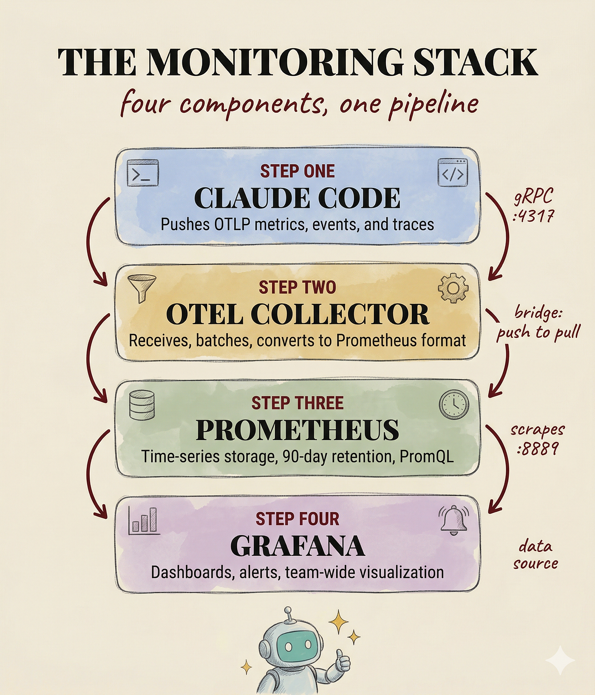
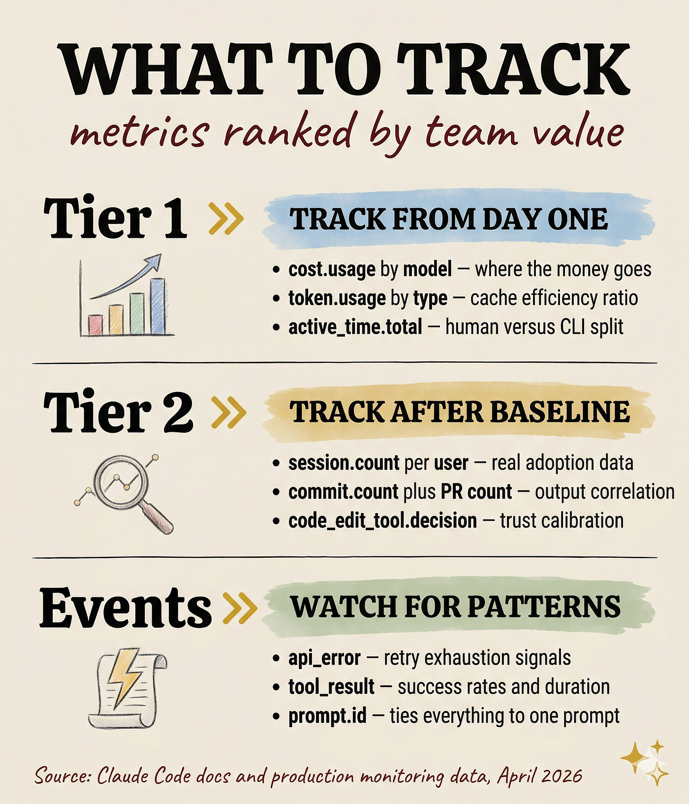

## 摘要（Summary）

一位柏林 HealthTech 新創公司的 CTO，在七人工程團隊上部署 OpenTelemetry 監控 Claude Code 的使用情況。兩週後數據揭示了驚人差異：三位開發者的快取讀取率（Cache Read Ratio）達 60% 以上，而其他四位低於 15%——唯一的差異是提示（Prompt）結構方式。本文涵蓋從 10 分鐘概念驗證到生產級 Docker Compose 堆疊的完整設定，以及 8 個內建指標的實際排名與誠實的限制說明。


## 關鍵洞察（Key Insights）

- **快取效率差異巨大** — 同一個 CLAUDE.md 檔案、同一個訂閱方案，但提示結構方式的不同，導致快取讀取率從 15% 到 60%+ 的天壤之別。透過 API 計費時，快取讀取令牌（Cache Read Token）成本比全新輸入令牌低 90%
- **採用率假象** — 作者原以為團隊均勻使用 Claude Code，但實際數據顯示兩人貢獻 80% 會話量，三人在第一個月後已停用。「直覺」與「數據」嚴重不符
- **10 分鐘驗證先行** — 先用 Console Exporter 確認遙測（Telemetry）資料正常流出，再投入基礎設施建設，避免同時除錯兩層問題
- **指標價值不均等** — 8 個內建指標中，成本（Cost）、令牌用量（Token Usage）、活躍時間（Active Time）是第一優先；會話數和 PR 數為第二優先
- **分散式追蹤（Distributed Tracing）是下一個前沿** — Beta 功能，透過 `TRACEPARENT` 環境變數自動傳播 W3C Trace Context，可串聯 CI/CD 管線

## 詳細內容（Details）

### 為什麼團隊監控 Claude Code 不是可選項

> [!warning] 三個無法忽視的問題
> 1. **令牌消耗不可見**：API 計費下成本靜默累積；Max 訂閱下速率限制在不可預測時刻觸發
> 2. **快取效率盲區**：`CLAUDE.md`、專案結構、提示模式都影響快取效率，但沒有指標就只能猜測
> 3. **採用率落差**：工程主管的「直覺」往往大幅偏離實際使用數據

### 10 分鐘概念驗證（Console Exporter）

```bash
# 啟用遙測（必要，不設定則無任何輸出）
export CLAUDE_CODE_ENABLE_TELEMETRY=1

# 輸出指標到終端
export OTEL_METRICS_EXPORTER=console

# 輸出事件/日誌到終端
export OTEL_LOGS_EXPORTER=console

# 縮短匯出間隔以加速反饋（預設 60 秒）
export OTEL_METRIC_EXPORT_INTERVAL=10000

# 啟動 Claude Code
claude
```

> [!tip] 先驗證再建設
> 10 秒內看到原始指標輸出即代表遙測正常運作。若無輸出，檢查 `CLAUDE_CODE_ENABLE_TELEMETRY` 是否設為 `1`——此功能預設停用。

### 生產級監控堆疊架構



生產架構包含四個元件，形成推送→轉換→拉取→視覺化的管線：

```
┌──────────────┐     OTLP Push      ┌────────────────────┐
│  Claude Code │ ──────────────────► │  OTel Collector    │
│  (各開發者)   │   gRPC / HTTP      │  (接收+批次處理)    │
└──────────────┘                     └─────────┬──────────┘
                                               │ Prometheus
                                               │ Scrape (Pull)
                                     ┌─────────▼──────────┐
                                     │    Prometheus       │
                                     │  (時序資料庫，90天)   │
                                     └─────────┬──────────┘
                                               │ Data Source
                                     ┌─────────▼──────────┐
                                     │     Grafana         │
                                     │  (視覺化+告警)       │
                                     └────────────────────┘
```

> [!note] 為何需要 OTel Collector？
> Prometheus 用拉取模型（Pull），Claude Code 用推送模型（Push）。OTel Collector 負責橋接：將推送的 OTLP 資料轉換為可被 Prometheus 抓取的格式。

### Docker Compose 完整配置

```yaml
version: '3.8'
services:
  otel-collector:
    image: otel/opentelemetry-collector:0.99.0
    container_name: otel-collector
    command: ["--config=/etc/otel-collector-config.yaml"]
    volumes:
      - ./config/otel-collector-config.yaml:/etc/otel-collector-config.yaml:ro
    ports:
      - "4317:4317"   # OTLP gRPC
      - "4318:4318"   # OTLP HTTP
      - "8889:8889"   # Prometheus scrape endpoint
      - "13133:13133" # Health check
    restart: unless-stopped

  prometheus:
    image: prom/prometheus:v3.8.0
    container_name: prometheus
    command:
      - "--config.file=/etc/prometheus/prometheus.yml"
      - "--storage.tsdb.path=/prometheus"
      - "--storage.tsdb.retention.time=90d"
      - "--web.enable-lifecycle"
    volumes:
      - ./config/prometheus.yml:/etc/prometheus/prometheus.yml:ro
      - ./data/prometheus:/prometheus
    ports:
      - "9090:9090"
    restart: unless-stopped

  grafana:
    image: grafana/grafana:11.0.0
    container_name: grafana
    environment:
      - GF_SECURITY_ADMIN_PASSWORD=changeme
    volumes:
      - ./data/grafana:/var/lib/grafana
    ports:
      - "3000:3000"
    restart: unless-stopped
```

### OTel Collector 配置

```yaml
receivers:
  otlp:
    protocols:
      grpc:
        endpoint: 0.0.0.0:4317
      http:
        endpoint: 0.0.0.0:4318

processors:
  batch:
    timeout: 10s

exporters:
  prometheus:
    endpoint: "0.0.0.0:8889"
    namespace: claude_code

service:
  pipelines:
    metrics:
      receivers: [otlp]
      processors: [batch]
      exporters: [prometheus]
```

### Prometheus 配置

```yaml
global:
  scrape_interval: 15s

scrape_configs:
  - job_name: 'otel-collector'
    static_configs:
      - targets: ['otel-collector:8889']
```

### Claude Code 端環境變數

```bash
export CLAUDE_CODE_ENABLE_TELEMETRY=1
export OTEL_METRICS_EXPORTER=otlp
export OTEL_LOGS_EXPORTER=otlp
export OTEL_EXPORTER_OTLP_PROTOCOL=grpc
export OTEL_EXPORTER_OTLP_ENDPOINT=http://localhost:4317
```

團隊統一配置（放入 [[2026-03-28-CLAUDE-CODE-USER-VS-PROJECT-LEVEL-CONFIG-GUIDE|managed settings file]]）：

```json
{
  "env": {
    "CLAUDE_CODE_ENABLE_TELEMETRY": "1",
    "OTEL_METRICS_EXPORTER": "otlp",
    "OTEL_LOGS_EXPORTER": "otlp",
    "OTEL_EXPORTER_OTLP_PROTOCOL": "grpc",
    "OTEL_EXPORTER_OTLP_ENDPOINT": "http://collector.your-company.com:4317"
  }
}
```

### 8 個指標與 5 種事件的優先級排名



> [!important] 指標優先級三層分類
> 作者根據一個月的實際使用經驗，將指標分為三個層級。

#### 第一層：從第一天就追蹤

| 指標 | 用途 | 關鍵屬性 |
|------|------|---------|
| `claude_code.cost.usage` | 費用流向，是否該用 Haiku 而非 Sonnet | `model` |
| `claude_code.token.usage` | 快取讀取率——專案配置有效性的最佳指標 | `type`（input / output / cache_read / cache_creation） |
| `claude_code.active_time.total` | Claude 工作時間 vs 開發者等待時間 | `user`（鍵盤互動）/ `cli`（工具執行+AI回應） |

#### 第二層：建立基線後追蹤

| 指標 | 用途 |
|------|------|
| `claude_code.session.count` | 每位使用者的實際採用趨勢（非自述） |
| `claude_code.commit.count` | 將 Claude Code 使用量連結到具體產出 |
| `claude_code.pull_request.count` | 同上 |
| `claude_code.code_edit_tool.decision` | 接受/拒絕比率——反映團隊對 Claude Code 建議的信任度。高拒絕率 = CLAUDE.md 需要調整 |

#### 事件層：值得關注

| 事件 | 說明 |
|------|------|
| `api_error` | 僅在所有重試用盡後觸發——你看到的是最終失敗，非瞬時異常 |
| `tool_result` | 含 `duration_ms` 和 `success` 欄位，可在慢執行成為模式前提前發現 |

> [!note] prompt.id 的概念
> 使用者提交一個提示，Claude Code 可能發起多個 API 呼叫和工具執行。所有事件共享同一個 `prompt.id`，可追溯到觸發源。這是「今天花了 $4.20」與「重構 auth 模組的提示花了 $0.87，含 3 次 API 呼叫和 2 次工具執行」之間的差別。

### 分散式追蹤（Beta）

```bash
export CLAUDE_CODE_ENHANCED_TELEMETRY_BETA=1
export OTEL_TRACES_EXPORTER=otlp
```

> [!tip] TRACEPARENT 傳播
> 啟用追蹤後，Claude Code 運行的每個 Bash 子進程都會收到 `TRACEPARENT` 環境變數（W3C Trace Context）。若子進程（建置腳本、測試、部署管線）也發出 OpenTelemetry Span，會自動附加到同一個 Trace——實現從提示到生產的端到端可視性。

注意事項：
- 提示文字與工具內容預設從 Span 中移除（正確的隱私預設）
- 追蹤配置增加額外複雜度，建議先穩定指標基礎設施再啟用

### 誠實的限制與踩坑

> [!warning] 生產環境踩坑記錄

1. **Delta vs. Cumulative 時間性** — Claude Code 預設使用 Delta Temporality。某些後端（特別是 VictoriaMetrics）會靜默丟棄 Delta 指標，無任何錯誤訊息。解法：設定 `OTEL_EXPORTER_OTLP_METRICS_TEMPORALITY_PREFERENCE=cumulative`。作者花了兩小時除錯才找到原因

2. **基數爆炸（Cardinality Explosion）** — 每個指標預設包含 `session.id` 屬性，每個會話產生唯一 ID = 新的時間序列。7 人團隊尚可，50 人團隊將拖垮 Prometheus 效能。大型團隊設定 `OTEL_METRICS_INCLUDE_SESSION_ID=false`

3. **成本指標是近似值** — 文件已明確說明。用於預算追蹤的方向性參考可以，但不可作為發票數據。實際帳單請查 Anthropic Console / AWS Bedrock / Google Vertex

4. **預設不擷取提示內容** — 遙測只記錄提示長度，無法關聯成本峰值與特定提示。啟用 `OTEL_LOG_USER_PROMPTS=1` 需謹慎（共享後端的隱私風險）

5. **儀表板才是真正的難點** — 讓遙測資料流動是簡單的 90%。建立有意義的 Grafana 面板（用 PromQL 查詢產出可操作洞察而非漂亮圖表）才是多數團隊卡關處。Anthropic 在 ROI 測量指南 Repo 中提供參考儀表板

> [!tip] 小型團隊替代方案
> Grafana Cloud 免費方案可直接接收 OTLP，跳過 OTel Collector。控制權較少，但零基礎設施維護。

## 我的心得（My Takeaways）

1. **監控不只是看成本** — 快取效率和採用率差異才是團隊管理 AI 輔助開發的核心數據，這兩項比成本更能驅動實質改善
2. **配置統一 ≠ 行為統一** — 即使 CLAUDE.md 檔案相同，提示結構方式的差異仍造成巨大的效能落差。這暗示需要「提示最佳實踐」的團隊培訓
3. **Delta vs. Cumulative 陷阱** — 值得記住。VictoriaMetrics 靜默丟棄 Delta 指標而不報錯，這類沉默失敗是最難除錯的
4. **`prompt.id` 是連結成本與行為的關鍵** — 從「今天花了多少」到「哪個操作最貴」的跨越，對成本優化至關重要
5. **TRACEPARENT 傳播設計精巧** — 將 AI 輔助編碼的 Trace 延伸到 CI/CD 管線，實現真正的端到端可觀測性。這對 [[2026-01-25-CLAUDE-CODE-MOST-UNDERRATED-FEATURE-HOOKS|Claude Code Hooks]] 的進階應用很有啟發

## 待補充（Open Questions）

- Claude Code 的 8 個指標中，`claude_code.lines_of_code_changed` 的具體計算邏輯是什麼？是按 diff 行數還是淨增行數？（建議搜尋：`claude code lines_of_code_changed metric definition`）
- Max 訂閱使用者的速率限制（Rate Limit）具體閾值是多少？是否可透過遙測指標預測即將觸及限制？（建議搜尋：`claude code max subscription rate limit threshold`）
- Anthropic 提供的 ROI 測量指南 Repo 中的參考 Grafana 儀表板，具體包含哪些 PromQL 查詢？（建議搜尋：`anthropic claude code roi measurement grafana dashboard`）
- 在 `OTEL_LOG_USER_PROMPTS=1` 啟用後，提示內容儲存在哪裡？有無自動脫敏（Redaction）機制？（建議搜尋：`opentelemetry prompt logging redaction privacy`）
- 作者提到高快取讀取率的開發者是因為「提示結構方式」不同，具體是什麼樣的提示模式能提高快取命中率？（建議搜尋：`claude code cache read ratio prompt pattern optimization`）

## 相關連結（Related）

- [[2026-04-07-GSTACK-TELEMETRY-ARCHITECTURE]] — 同樣探討 AI 開發工具的遙測架構設計，gstack 用 Supabase，本文用 OpenTelemetry + Prometheus
- [[2026-03-28-CLAUDE-CODE-USER-VS-PROJECT-LEVEL-CONFIG-GUIDE]] — Claude Code 配置層級管理，本文的團隊統一 `settings.json` 配置即屬此範疇
- [[2026-01-22-THE-LONGFORM-GUIDE-TO-EVERYTHING-CLAUDE-CODE]] — Token 經濟與快取策略的深度指南，與本文的快取效率監控互補
- [[2026-04-04-GSTACK-SECURITY-TELEMETRY-CONTROVERSY]] — 遙測資料的隱私爭議，本文的 `OTEL_LOG_USER_PROMPTS` 也涉及類似權衡
- [[2026-01-25-CLAUDE-CODE-MOST-UNDERRATED-FEATURE-HOOKS]] — Hooks 可搭配遙測事件做自動化響應，是監控 → 行動的下一步
- [[2026-04-08-CLAUDE-CODE-TEAM-MEMORY-DEEP-DIVE]] — 團隊層級的 Claude Code 管理，本文從監控角度，該文從記憶系統角度

---

## 知識層次分析（Bloom's Taxonomy Analysis）

> 以下從五個認知層次對本篇內容進行結構化分析，協助從記憶到評估逐層深化理解。

| 認知層次 | 核心目的 | 對本文的具體應用 |
|---------|---------|--------------|
| **記憶（被動）** | 確認資訊存在，單純資訊檢索，確立基礎知識 | `CLAUDE_CODE_ENABLE_TELEMETRY=1` 為啟動開關；8 個指標名稱（cost.usage、token.usage、active_time.total、session.count、commit.count、pull_request.count、code_edit_tool.decision、lines_of_code_changed）；OTel Collector 是 Push→Pull 橋接器 |
| **理解（半被動）** | 解釋概念的含義及關聯，串聯知識點，掌握核心邏輯 | 文章的核心論證鏈：遙測資料 → 發現快取效率/採用率差異 → 針對性優化。Push/Pull 模型不匹配需要 Collector 橋接。Delta vs. Cumulative 時間性影響後端相容性。`prompt.id` 將散落的 API 呼叫和工具執行串成一條因果鏈 |
| **分析（主動）** | 檢驗論點、拆解流程、找出假設，批判性思維 | 作者假設七人團隊的經驗可推廣至更大規模，但 50 人團隊的基數爆炸問題說明擴展性有限。文章未探討快取效率與程式碼品質的相關性——高快取率是否等於更好的輸出？另外，成本指標是「近似值」但未說明誤差範圍 |
| **應用（主動）** | 將知識套用情境，規劃執行方案，實戰決策力 | 1. 立即在團隊的 `.claude/settings.json` 中加入遙測環境變數，開始收集基線數據 2. 用 Console Exporter 做 10 分鐘概念驗證，確認遙測正常後再部署 Docker Compose 堆疊 3. 觀察 `token.usage` 中 `cache_read` 比例，識別低效開發者並分享高效者的提示模式 |
| **評估（主動）** | 判斷多個方案的優劣，進行決策和權衡 | 本文方案（自建 OTel + Prometheus + Grafana）vs. Grafana Cloud 免費方案：前者控制權高但維護成本大。vs. gstack 的 Supabase 遙測：gstack 更簡單但引發隱私爭議。對小型團隊（<10人），Grafana Cloud 免費方案可能是更務實的選擇；對大型團隊則需要自建以控制基數爆炸和資料保留策略 |

### 分析型追問（Socratic Follow-up）

- **澄清**：「快取讀取率」（Cache Read Ratio）具體如何計算？是 `cache_read / (cache_read + input)` 還是其他公式？不同計算方式會影響 60% vs 15% 差距的解讀
- **假設**：本文假設快取效率差異完全源於「提示結構方式」，但有無可能與不同開發者處理的任務類型相關？（新功能 vs. 除錯 vs. 重構可能天然有不同的快取命中率）
- **證據**：作者聲稱三人在第一個月後停用 Claude Code，但未說明停用原因。是工具問題還是開發者偏好？缺少定性數據來補充定量發現
- **觀點**：反對者可能認為監控開發者的 AI 工具使用是微管理（Micromanagement）。如何平衡「數據驅動優化」與「開發者自主權」？
- **後果**：若依照本文建議全面啟用遙測，12 個月後可能出現「指標焦慮」——團隊過度關注快取率數字而非實際產出品質，或開發者為了「好看的指標」而改變自然工作模式

### 方案批判三問（Critical Evaluation）

> [!warning] 適用於技術方案類內容

1. **最大的風險是什麼？** — 遙測資料本身成為攻擊面。若 `OTEL_LOG_USER_PROMPTS=1` 啟用，提示內容可能包含敏感程式碼或商業邏輯，儲存在 Prometheus/Grafana 中的這些資料若洩漏，後果嚴重
2. **什麼情況下會失敗？** — 當團隊規模超過 50 人、多個 Codebase、不同時區時，基數爆炸和時區對齊問題可能使 Prometheus 查詢超時。此外，若開發者對監控產生抗拒心理，可能故意不設定環境變數
3. **有沒有更好的替代方案？** — Anthropic Console 自身的使用量儀表板可能已足夠滿足成本追蹤需求，無需自建整套堆疊。Datadog 等商業 APM 工具的 OTLP 接收能力更成熟，適合已有監控基礎設施的團隊。權衡：自建堆疊適合需要高度客製化的團隊，商業方案適合希望減少維護的團隊

## References

- [The New Claude Code Monitoring: What Our Team Data Revealed — Medium](https://alirezarezvani.medium.com/the-new-claude-code-monitoring-what-our-team-data-revealed-e7f0424d738f)
