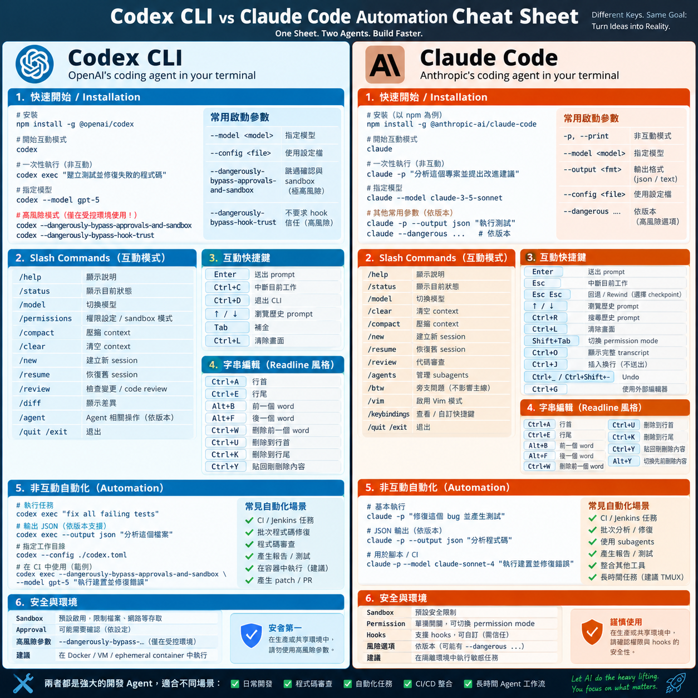

## 摘要（Summary）

這是一份面向 Terminal 使用者的 Codex CLI 與 Claude Code 操作、自動化與安全模型速查表。互動式啟動分別是 `codex` 與 `claude`；CI 或 Supervisor 等非互動式工作流則以 `codex exec` 與 `claude -p` 為核心。真正重要的差異不只在快捷鍵，而是如何把 Agent 放入有狀態管理（state management）、Git checkpoint、外層隔離（infrastructure sandbox）與 Human Approval Queue 的可靠執行環境。



> [!warning] 版本快照
> 本文在 2026-09-06 以本機 `codex --help`、`claude --help` 與 OpenAI Codex CLI reference 核對。Slash commands、快捷鍵與 flags 都可能變動；實際操作應以目前版本的 `/`、`--help` 與官方文件為準。

## 關鍵洞察（Key Insights）

- `Esc Esc` 是 Claude Code 的 Rewind／Checkpoint 概念；Codex 沒有完全等價操作，可靠回退應以 Git 或 worktree checkpoint 為基礎。
- `↑`／`↓` 只取回輸入歷史，`/resume` 恢復 session，兩者都不等於回復程式碼狀態。
- 自動化不要解析人類終端畫面。Codex 的 `codex exec --json` 會輸出 JSONL 事件；Claude Code 的 `claude -p --output-format json|stream-json` 可提供機器可讀輸出。
- Approval 回答「是否要問人」，Sandbox 回答「即使 Agent 想做，實際能碰什麼」；兩者不可混為一談。
- 無人值守的可靠性不應由單一 CLI 承擔，而應由 Supervisor、持久化狀態、Git、可觀測性（observability）及外層隔離共同提供。

## 詳細內容（Details）

### 最小操作矩陣

| 操作 | Codex CLI | Claude Code | 注意事項 |
|---|---|---|---|
| 互動模式 | `codex` | `claude` | 都是 TUI／互動 Agent |
| 非互動執行 | `codex exec "..."` | `claude -p "..."` | 適合 CI、腳本、Supervisor |
| 中止目前工作 | `Ctrl+C` | `Esc` | 以目前 TUI／終端設定為準 |
| 回退 | Git／checkpoint | `Esc Esc` | Claude 的 checkpoint 行為仍應先確認版本 |
| Prompt history | `↑`／`↓` | `↑`／`↓` | 不會回退檔案 |
| session 恢復 | `codex resume` 或 `/resume` | `claude --resume` 或 `/resume` | session 不等於 Git state |
| 壓縮 context | `/compact` | `/compact` | 不是 checkpoint，也不是 crash recovery |

```text
Claude Code
    Esc       = STOP
    Esc Esc   = REWIND / checkpoint

Codex CLI
    Ctrl+C    = STOP
    ↑ / ↓     = Prompt History
    Git       = Reliable code rollback layer
```

### 互動模式與輸入控制

```bash
codex
```

```bash
claude
```

兩者常見的 Readline／Emacs 風格輸入編輯：

| 功能 | 快捷鍵 |
|---|---|
| 跳到行首／行尾 | `Ctrl+A`／`Ctrl+E` |
| 前／後一個 word | `Alt+B`／`Alt+F` |
| 刪除前一個 word | `Ctrl+W` |
| 刪到行首／行尾 | `Ctrl+U`／`Ctrl+K` |
| 貼回剛刪除內容（yank） | `Ctrl+Y` |

```text
Ctrl+W    Cut previous word
Ctrl+U    Cut to beginning
Ctrl+K    Cut to end

Ctrl+Y    Paste / Yank
```

macOS 的 `Alt+B`／`Alt+F` 通常是 `Option+B`／`Option+F`。若沒有作用，Terminal 或 iTerm2 需要把 Option 設為 Meta／Esc+。

### Rewind、Session 與 Git 的邊界

```text
↑ / ↓
    = Prompt History

/resume
    = Session History

Esc Esc
    = Conversation / Code Checkpoint Rewind
```

Codex 的安全作法是把 Agent 視為 Git 工作流的一部分：

```bash
git status
git diff
```

```text
Git Worktree
    ↓
Codex Agent
    ↓
Changes
    ↓
Review
    ↓
Commit / Patch
```

這和 [[2026-03-31-CLAUDE-CODE-WORKTREE-X-REPO-MULTI-REPO-PARALLEL-DEVELOPMENT|Claude Code Worktree 的並行開發模式]]相容：每個 Agent 都應有可檢查、可隔離、可保存的工作目錄。

### 非互動自動化與結構化輸出

```bash
codex exec "analyze this repository and fix the failing tests"
```

```bash
claude -p "analyze this repository and fix the failing tests"
```

本機 Codex CLI 的目前行為：`codex exec --json` 輸出 newline-delimited JSON（JSONL）事件；Claude Code 的 `--output-format` 可選 `text`、`json`、`stream-json`。

```text
Agent
  ↓
Structured Events
  ↓
Supervisor
  ├── status
  ├── progress
  ├── tool call
  ├── error
  ├── approval
  └── final result
```

> [!tip] 自動化輸出
> 在 CI 中把 Codex 的 `--json` 搭配 `--output-last-message`，或讓 Claude Code 使用 `--output-format stream-json`。Supervisor 應讀取事件與最終結果，不應以 `grep terminal output` 當主要協定。

### Approval、Sandbox 與危險模式

```text
Approval
    = 要不要問人

Sandbox
    = 即使 Agent 想做，它實際可以碰什麼
```

```text
No Approval ≠ No Sandbox
```

Codex 的高風險選項：

```bash
--dangerously-bypass-approvals-and-sandbox
```

它跳過確認並取消 Codex sandbox，只應在已由 Docker、VM、短命 CI runner 等外層環境隔離的情境使用。

```bash
--dangerously-bypass-hook-trust
```

這只略過 Hook trust 檢查，和停用 approval／sandbox 是不同範圍的風險。最小權限（least privilege）優先順序是：先選 `workspace-write` 或加上明確 `--add-dir`，不要因為需要額外目錄就直接切至無 sandbox。

### Long-running Agent Runtime

```text
Jira / Jenkins
      │
      ▼
Supervisor
      │
      ▼
Disposable Container / VM
      ├── Git Worktree
      ├── Codex exec / Claude -p
      └── Build Environment
      │
      ▼
Structured Events → State Machine → Checkpoint / Artifact
      │
      ▼
Human Approval → Resume / Recovery
```

Supervisor 至少應區分：

```text
QUEUED
STARTING
RUNNING
WAITING_FOR_TOOL
WAITING_FOR_USER
WAITING_FOR_APPROVAL
IDLE
COMPLETED
FAILED
TIMED_OUT
INTERRUPTED
RECOVERING
```

保存資訊至少包含：

```text
Task ID
Agent Type
Session ID
PID
Repository / Git Branch / Git Worktree / Base Commit
Last Checkpoint
Current State
Start Time / Last Event Time
Approval State
Output Artifact
```

```text
Agent
   ↓
Needs Human
   ↓
WAITING_FOR_APPROVAL
   ↓
Persist State
   ↓
Notify Human
   ↓
Human Decision
   ↓
Resume Agent
```

這延伸了 [[2026-07-19-AGENT-HARNESS-VS-LOOP-VS-GRAPH-ENGINEERING-THREE-LAYERS|Harness／Loop／Graph 的分層]]：Harness 提供環境、權限、工具、記憶與可觀測性；Supervisor 則把長時間執行、停止條件與人類接手具體化。

## 我的心得（My Takeaways）

1. 把 Codex 的「沒有完全對等 Rewind」視為工作流設計訊號：Git diff、commit、worktree 才是跨 CLI、跨 crash 的可靠 rollback 層。
2. `codex exec` 與 `claude -p` 是 Agent Runtime 的 worker interface，不是完整的 orchestration system。
3. 真正的無人值守不是取消安全，而是把安全搬到可驗證的外層隔離，再由 Supervisor 處理 approval、timeout 與 recovery。

## 待補充（Open Questions）

- Claude Code 各個版本與不同 terminal 中 `Esc Esc` 可回復的範圍，是否包含每一類工具副作用？建議搜尋：`Claude Code rewind checkpoint limitations`。
- Codex JSONL event schema 在不同版本的向後相容保證為何？建議搜尋：`Codex exec JSONL event schema`。
- 如何用最少狀態欄位，安全地判斷中斷後的 agent 要 resume、reattach 還是從 Git checkpoint restart？建議搜尋：`agent supervisor crash recovery state machine`。
- Human Approval Queue 如何綁定 commit SHA、目標環境與 artifact，避免批准過期或 TOCTOU 問題？建議搜尋：`deployment approval TOCTOU artifact provenance`。
- Claude Code 的 stream-json 與 Codex JSONL 如何正規化為同一套跨供應商 event contract？建議搜尋：`coding agent unified event schema`。

---

## 知識層次分析（Bloom's Taxonomy Analysis）

| 認知層次 | 核心目的 | 對本文的具體應用 |
|---|---|---|
| **記憶（被動）** | 確立基礎知識 | `codex exec`、`claude -p`、`Esc Esc`、JSONL、approval、sandbox、worktree。 |
| **理解（半被動）** | 解釋關係 | Prompt history、session resume、checkpoint 與 Git rollback 處理的是四種不同狀態，不能互相替代。 |
| **分析（主動）** | 拆解假設 | 單一 CLI 只負責執行 Agent；長時間工作還需要外部狀態、隔離與可觀測性。無輸出不必然代表失敗，可能是 tool、user 或 approval 等待。 |
| **應用（主動）** | 轉為行動 | (1) CI 改讀 JSONL／stream-json；(2) 每個 Agent 指派獨立 worktree；(3) 對 approval 設定可持久化的等待狀態與 deadline。 |
| **評估（主動）** | 權衡取捨 | 快速本機任務可用互動 CLI；高風險或長時間工作應承受外層容器、事件收集與狀態機的成本，以換取可恢復性與審計能力。 |

### 分析型追問（Socratic Follow-up）

- **澄清**：團隊所稱的「完成」是 Agent 回覆完成、tests 通過、產出 patch，還是已被批准與合併？
- **假設**：Supervisor 假設 session ID 永遠可恢復；當 local state 遺失、模型切換或 worktree 被刪除時，替代路徑是什麼？
- **證據**：哪些 event 與指標可以區分真正卡死、長時間 tool call、等待人類與模型仍在推理？
- **觀點**：對低風險、短任務，完整 Supervisor 是否過度工程化？何時只需 `codex exec` 或 `claude -p`？
- **後果**：若團隊以 bypass flags 追求無人值守，外層隔離與 artifact cleanup 未同步建立，12 個月後最大的資安與成本風險是什麼？

### 方案批判三問（Critical Evaluation）

1. **最大的風險是什麼？** 把 approval bypass 與 sandbox bypass 當成同一件事，可能讓 Agent 在有網路、憑證與正式環境的 Host 上任意執行命令。
2. **什麼情況下會失敗？** Supervisor 沒有持久化 approval state、worktree 或 base commit 時，crash 後無法判斷應安全恢復還是重跑；只以靜默時間判斷失敗，也會誤殺正常工作。
3. **有沒有更好的替代方案？** 短任務採互動 CLI 或單次 `exec`；需要無人值守時，用短命容器＋受限 sandbox＋JSON event＋Git checkpoint。這比在個人主機直接開 danger mode 多了隔離與可追溯性。

## 相關連結（Related）

- [[2026-05-20-CODEX-CLI-VS-CLAUDE-CODE-DEEP-COMPARISON]] — 架構、權限與產品體驗的深度比較；本文聚焦可操作的 CLI 速查與自動化。
- [[2026-05-16-CLAUDE-CODE-HEADLESS-MODE-AUTO-MEMORY-DISABLE]] — `claude -p` 的 headless／非互動行為與記憶控制細節。
- [[2026-03-31-CLAUDE-CODE-WORKTREE-X-REPO-MULTI-REPO-PARALLEL-DEVELOPMENT]] — 將 Git Worktree 做成多 Agent 隔離與恢復邊界的實作指南。
- [[2026-07-19-AGENT-HARNESS-VS-LOOP-VS-GRAPH-ENGINEERING-THREE-LAYERS]] — 把 Supervisor 的 state、recovery 與 observability 放入完整 Agent engineering 分層。

## References

- [OpenAI Codex CLI reference](https://learn.chatgpt.com/docs/developer-commands)
- [OpenAI：Running Codex safely](https://openai.com/index/running-codex-safely/)
- [Claude Code CLI reference](https://code.claude.com/docs/en/cli-reference)
