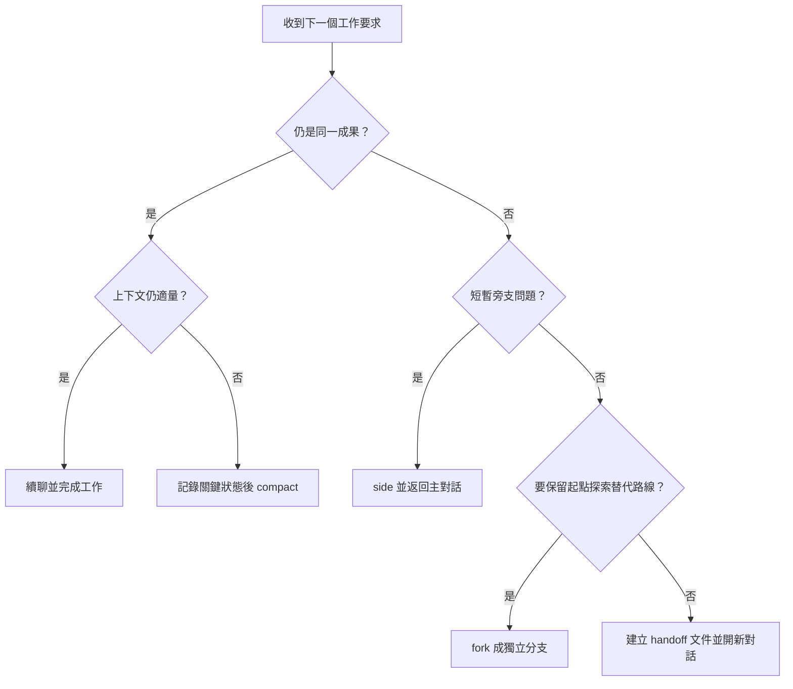
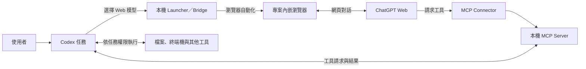
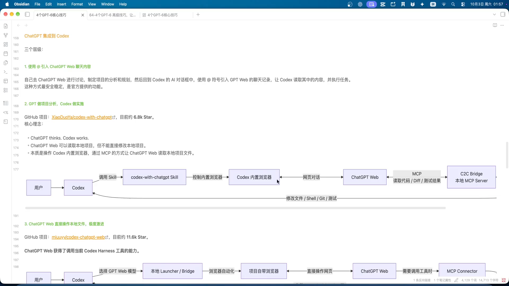
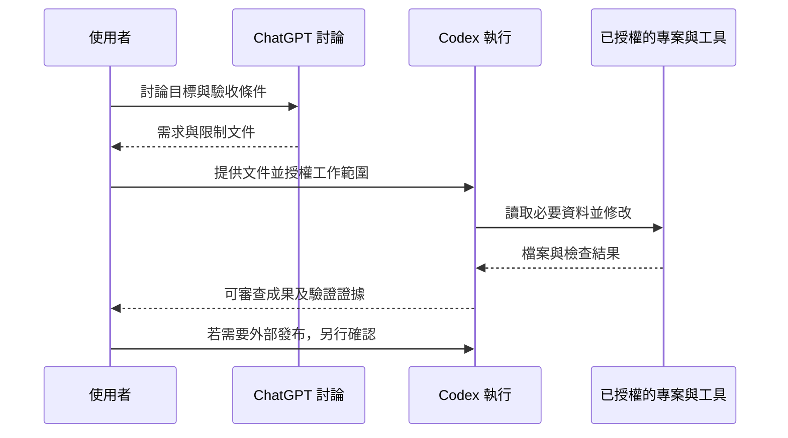
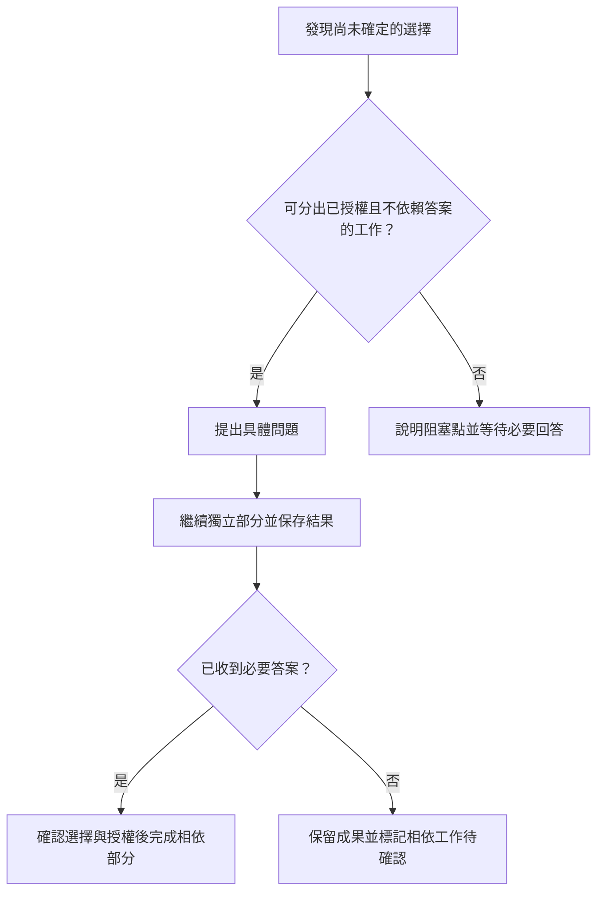

## TL;DR

- 把兩支影片合成一套工作流程：先定義成果，再管理上下文與成本，最後選工具、驗證並交付。
- 同一目標續聊；長對話用 `/compact`；短暫岔題用 `/side`；替代路線用 `/fork`；獨立新任務用交接文件加新對話。
- 快取依賴可重用的提示前綴。精簡指令、按任務選模型與技能，比一律升高推理強度更值得先做。
- Sites、Office 檔案、Appshots 與 Hooks 擴大可交付成果，也各有權限、隱私與驗證要求。
- 官方查核修正兩個關鍵限制：Astra 長輸入門檻是 **272K**；影片中的實驗性上下文設定目前不可用。不要把影片示範直接當成所有版本的操作規格。

## 摘要（Summary）

杰森的影片聚焦 GPT-6 時代的上下文、快取、模型分工、提示詞與自主執行；TechShrimp 的影片補上桌面介面、專案、網站、辦公檔案、應用程式快照與 Hooks。本文按工作流程整合重複論點，保留各自案例與回看位置；原稿於 2026-10-04 查核官方文件，2026-10-05 再比對使用者提供的杰森 Markdown 附檔，補充交接矩陣、兩種橋接架構、非阻塞澄清與九項流程檢查表。本次補充另查核相關官方文件及第三方專案公開說明，未重新實測所有既有工具。

| 來源 | 發布日／長度 | 取得與核對方式 | 在本文的分工 |
|---|---|---|---|
| A：杰森的效率工坊 | 2026-10-03／20:13 | 下載完整繁中字幕；檢視全片取樣畫面及協作架構圖 | 上下文、模型、快取、提示詞、技能與自主性 |
| B：TechShrimp | 2026-09-29／32:29 | 沒有人工或自動字幕；下載音訊，以 MLX Whisper small 轉錄全片，再搭配畫面核對 | 產品操作、省 token 實務及工具示範 |
| C：杰森 Markdown 附檔 | 原檔未標發布日；2026-10-05 比對 | 使用者提供下載稿；完整閱讀 340 行，記錄檔名及 SHA-256 | 補齊架構圖、交接表、原始參考資源與流程檢查；與字幕有差異時分別記錄 |

> [!note] 閱讀與證據範圍
> B 的輸入連結從 06:36 開始，本文仍整理全片。自動轉錄可能誤辨產品、模型及專案名稱；原始檔保留在本機，公開筆記使用意譯。本文分別標示講者經驗、官方查核與整理者建議；沒有實測影片所有工具，也沒有安裝第三方橋接程式、啟用 Hooks 或發布網站。

<!-- Separate callouts. -->

> [!important] 附檔也需要查核
> C 的頁尾標示作者為杰森的效率工坊，並註明未經允許禁止商用。公開本文使用自行整理的分析與重繪圖，不上傳整份原稿。附檔中的指令優先級範例有誤，部分快取、自主性與風險敘述也過於絕對；不能因為是講者的 Markdown 就直接當成操作規格。

## 關鍵洞察（Key Insights）

- **上下文容量、工作品質與快取命中是不同問題。** 能容納更多文字，不能直接推導出長對話的程式修改品質或費用。
- **常駐指令應承載專案限制與文件入口。** 任務型資料按需讀取，可與 [[2026-02-11-HARNESS-ENGINEERING-LEVERAGING-CODEX-IN-AN-AGENT-FIRST-WORLD|Harness Engineering 的文件導航]]一起理解。
- **技能越多，觸發描述越重要。** 應明確界定工作範圍；Claude Code 的設定名稱不可直接移植到 Codex。
- **增加自主性需要清楚的完成條件與授權範圍。** 本機可逆變更、正式環境部署與外部資料寫入應採不同決策規則。
- **交付標準取決於成果。** 程式要測行為，網站要檢查互動，試算表要核對公式，文件與簡報要檢查版面。

## 詳細內容（Details）

### 1. 先辨認工作環境，再談技巧

兩支影片大量使用桌面介面。桌面版、網頁、CLI 與 IDE 共用部分概念，但操作入口、檔案存取及內建工具不同。

| 環境 | 專案與檔案來源 | 適合的工作 | 需要留意 |
|---|---|---|---|
| ChatGPT 桌面版的 Work／Codex | 可連接本機資料夾，也可使用 ChatGPT 專案 | 程式、檔案、瀏覽器及視覺回饋 | 工具可用性與系統權限依裝置及組織設定 |
| ChatGPT 網頁版 | 上傳檔案、專案來源與連接工具 | 研究、文件與網站成果 | ChatGPT 專案本身不會直接取得本機資料夾 |
| Codex CLI | 啟動目錄或 `--cd` 指定目錄 | 終端機、程式修改及自動化 | 沒有桌面版的內建檔案預覽介面 |
| Codex IDE extension | 編輯器工作區與選取內容 | 邊寫程式邊操作代理人 | 多工作區要確認此次工作的根目錄 |

此表綜合官方 [Projects](https://learn.chatgpt.com/docs/projects) 與 [檔案成果](https://learn.chatgpt.com/docs/artifacts-viewer)說明。桌面 UI 的位置可能改變，辨認專案、模式、模型、權限與輸出位置，比記住按鈕座標更耐用。

B 在 00:41 示範 Chat、Work、Codex 的切換：Chat 用來討論；Work 聚焦一般成果；Codex 顯示較多 Git、終端機、檔案與程式變更細節。官方也說明 Work 與 Codex 能力重疊，主要差異包含介面與技術資訊的呈現。[Use ChatGPT](https://learn.chatgpt.com/docs/use-chatgpt)

影片以同一專案連接前端、後端兩個資料夾，再用 `@` 參考先前設計對話。實作前仍應確認此次可存取的目錄與引入內容；對話參考不代表其他專案的寫入授權。

### 2. 管理上下文：續聊、壓縮、岔題、分支與交接

#### 容量上限與「舒適區」

A 在 00:43 起提醒：大容量上下文在資訊檢索與長時間修改程式上的可靠程度不同。講者引用約 **150K token** 的工作舒適區，這是經驗值，影片未提供足以設定通用上限的對照實驗。

官方 Astra API 規格為 1,050,000 token 上下文，最大輸入 922,000、最大輸出 128,000。API 規格無法直接換算成每個 Codex 客戶端可保留的有效對話長度。[GPT-6 Astra 模型規格](https://developers.openai.com/api/docs/models/gpt-6-astra)

#### 根據目標選操作

| 情境 | 做法 | 保留與取捨 |
|---|---|---|
| 同一成果還沒完成，相關資訊仍適量 | 續聊 | 沿用當前決策、檔案與進度 |
| 同一成果，但歷史過長 | `/compact` | 摘要舊內容；重要細節仍應留在專案文件 |
| 只是想問短暫旁支問題 | `/side` | 旁支有獨立對話紀錄，不持續塞入主對話 |
| 想保留目前狀態並探索另一條路 | `/fork` | 複製歷史到新對話；原紀錄維持不變 |
| 前一成果完成，接著做另一個獨立成果 | 新對話＋`handoff.md` | 交接必要狀態，避免帶入全部歷史 |

這些 slash commands 以 CLI／IDE 的官方介面為準；不要假設網頁版也有相同指令。`/side` 在 CLI 的另一個 side chat 或 review mode 內不可用，IDE 的 `/fork` 用於本機對話。[Developer commands](https://learn.chatgpt.com/docs/developer-commands)

#### 哪些方式仍繼承舊對話？

以下依 C 的比較表重整，並以官方說明核對 Resume、Fork 與 Compact。此處的「新上下文」專指不帶入舊聊天歷史，仍可能載入系統指令、`AGENTS.md`、技能、記憶及此次提供的檔案。

| 方式 | 是否繼承舊聊天歷史 | 是否移除舊聊天負擔 | 適合場景 |
|---|---|---|---|
| Resume／Continue | 是，恢復或繼續同一會話 | 否 | 暫時退出後繼續同一工作 |
| Fork／Branch | 是，新分支沿用起點的歷史 | 否 | 保留共同起點，嘗試另一條主要路線 |
| Compact | 保留壓縮後的歷史與工作狀態 | 部分減少，仍沿用同一任務 | 同一成果的對話過長 |
| Handoff → New Session | 不自動繼承；帶入選定交接狀態 | 是，但交接內容仍占 token | 階段切換、獨立工作或需要重新整理背景 |

Fork 不能當成清空上下文的方法；Resume 也不會把工作樹回復成對話當時的版本。官方的建議是先看狀態，同一目標過長時壓縮，主要方向改變時分支。[遠端工程工作指南](https://developers.openai.com/blog/mastering-codex-remote-for-engineering)、[Developer commands](https://learn.chatgpt.com/docs/developer-commands)

以下是整理者依兩支影片重繪的決策流程：



A 的例子是開發健康管理軟體：飲食模組尚未完成就續聊；臨時問個人營養問題可用旁支；評估另一個功能方向可開分支。這是在說明任務邊界，不構成營養或醫療建議。

#### 交接文件放什麼？

以下為整理者自編範例，目的在保留能接續工作的狀態，並以路徑指向較長的文件：

```markdown
# Handoff：登入後導向修正

## 目標與範圍
修正登入後返回原頁面的行為；不更換登入服務。

## 已完成
- 已定位 frontend/auth/redirect.ts。
- 已確認失敗測試與重現步驟，見 docs/issues/login-redirect.md。

## 下一步
修正導向條件，跑受影響的登入測試，檢查返回路徑的安全性。

## 已知限制
目前尚未通過驗證；不要部署。保留使用者既有修改。
```

不要複製全部對話、API key 或個人資料到交接文件。新對話應先讀交接、確認目前工作樹與檔案，再繼續。

C 另指向 [Matt Pocock 的 handoff skill](https://github.com/mattpocock/skills/blob/main/skills/productivity/handoff/SKILL.md)。2026-10-05 核對時，該技能要求保存到作業系統暫存目錄、列出下一位代理人應選用的技能，並移除敏感資訊。可採用的文件編排原則是：把目前執行狀態寫短；已存在於規格、計畫、架構決策紀錄（ADR）、issue、commit 或 diff 的內容直接引用位置，避免重複維護兩份正文。上方自編範例只示範內容，沒有指定檔案一定要提交到專案。

整理者建議在交接中另外記錄目前 branch／commit、未提交變更、已執行檢查及結果、尚未解決的問題與下一步。接手者應重新核對 Git 與實際檔案；交接裡的「測試通過」只描述當時狀態，不代表後續修改也已驗證。

#### 實驗性上下文設定與 Memories 要分開

A 在 04:59 提到跨上下文結構化筆記，並展示：

```toml
[features.context_management]
experimental_mode = true
```

這是影片中的歷史設定，不是本文建議啟用的功能。官方目前明載 `features.context_management.experimental_mode` **不可用**。[Config reference](https://learn.chatgpt.com/docs/config-file/config-reference)

另外，官方 Memories 有自己的本機記憶儲存及控制方式；網頁 ChatGPT memory 與本機 Codex memory 也分開。強制適用的團隊規則仍應放在 `AGENTS.md` 或版本控制文件，不能只依賴生成記憶。[Memories](https://learn.chatgpt.com/docs/customization/memories)

### 3. 管理成本：快取、模型、推理強度與使用量

#### Prompt caching 的作用範圍

快取重用先前處理過的提示前綴；仍需要處理新增輸入與產生回答。同一個對話、同一個問題名稱或同一個專案，皆不能保證快取命中。

官方說明，工具名稱、描述、schema、順序及其他會改變前綴的設定，都可能影響重用。[Prompt caching](https://developers.openai.com/api/docs/guides/prompt-caching)

對使用者而言，可採取的做法是：同一工作避免無必要切換模型；先整理穩定的專案規則；減少重複載入的文件與大型工具描述。這些是降低無效工作量的建議，本文未量測其節省百分比。

#### 影片主張與官方查核

| 主張 | 本文處理 |
|---|---|
| 「150K 是舒適區」 | 保留為講者引用的經驗值，不當成硬上限 |
| A 字幕說「超過 227K 輸入會加價」；C 附檔寫 272K | 字幕在 01:24、01:27 寫 227K，附檔已寫 272K；本文依官方採 **超過 272K**。整個請求的輸入與快取費率乘 2，輸出費率乘 1.5；不要把數字錯誤歸給所有來源版本 |
| 「GPT-6 對話中換 reasoning effort 不破壞快取」 | 支援的 API 可透過追加 configuration update 保留前綴；不能推導成所有 Codex 客戶端與設定都保證命中 |
| 「換模型會丟快取」 | 不預期跨模型直接沿用相同快取；不能據此斷言每次一定變慢 |
| 「ChatGPT 額度比 Codex 好用」 | 保留為講者當時的使用經驗；訂閱 credits、使用限制與 API 費用須分開 |

長輸入門檻依 [Astra 模型頁](https://developers.openai.com/api/docs/models/gpt-6-astra)；effort 與前綴關係依 [Reasoning](https://developers.openai.com/api/docs/guides/reasoning)。官方目前也註明 Work 與 Codex 共用使用量，API 單價不能換算訂閱內含任務數。[Codex／Work pricing](https://learn.chatgpt.com/docs/pricing)

#### 模型分工

A 在 08:43 的畫面區分 Luna、Sol、Astra。以下改為官方查核後的用途表，不沿用影片的靜態單價：

| 模型 | 適合先試的任務 | 選用與升級理由 |
|---|---|---|
| GPT-6 Luna | 清楚、重複且範圍小的工作 | 先看是否能正確完成，再比較成本與速度 |
| GPT-6.1 Sol | 複雜程式與代理人工作流程 | 官方推薦用於複雜工作，較 Astra 低成本；須確認帳號可用性 |
| GPT-6 Astra | 困難推理、多步驟專業工作 | 在錯誤代價或判斷難度較高的任務中比較品質收益 |

影片口述的 Sol 與畫面的 GPT-6.1 Sol 應區分；官方於 2026-09-29 公布 GPT-6.1 Sol。模型是否可用也受方案、客戶端與組織設定影響。[Models](https://learn.chatgpt.com/docs/models)、[9 月 29 日更新](https://learn.chatgpt.com/docs/changelog)

推理強度從預設值開始，再按工作難度提高。官方 Ultra 還涉及多代理人工作，不能把它當成單一代理人的一般 effort 名稱。更換模型或提高 effort 前，先排除缺少來源、錯誤專案目錄或完成條件不清楚的問題。

#### B 的四種省額度方法：保留做法，也保留限制

| 方法／回看位置 | 影片示範 | 整合後的判斷 |
|---|---|---|
| 先用 Chat 規劃，03:23 | 調研 HTML 影片工作台，產生計畫文件，再切到 Codex 實作 | 需求討論與執行可以分開；影片帳號的額度顯示與「至少省一半」未經本文實測 |
| 小模型處理例行工作，07:29 | Luna 跑重複技能、排程與簡單瀏覽器工作 | 與 A 的任務分工一致；「近乎無限使用」不能當成方案承諾 |
| Plan mode＋釐清技能，08:20 | 規劃時多問問題，計畫確定後降低執行 effort | 可減少需求跑偏；不必為每個任務都選最高 effort 或問同樣數量的問題 |
| 清晨觸發時窗，11:01 | 排程每天 05:00 發簡單訊息，嘗試提早啟動五小時時窗 | 屬講者操作構想；不減少任務總 token，本文不建立此排程，也不保證重置效果 |

B 的時窗示意可用表格讀取：

| 假設首次觸發 | 講者推算的第一次重置 | 第二次重置 |
|---|---|---|
| 09:00 | 14:00 | 19:00 |
| 05:00 | 10:00 | 15:00 |

這張表保留影片的推算，**沒有驗證「開啟軟體就起算」或自動訊息一定有效**。即使能移動時窗，也無法據此推導增加週額度。

> [!warning] 方案與時窗已不能照影片概括
> 官方目前註明 Pro 沒有五小時限制，其他方案須看實際使用量與重置時間；本機與雲端工作共用方案額度，雲端可能耗用更多。B 說「雲端不消耗，無法激活」的概括不適用目前官方說明。[Pricing](https://learn.chatgpt.com/docs/pricing)

B 也示範第三方 **Remote Desktop Commander**，讓網頁 Chat 讀取本機目錄、審查未提交程式碼。這涉及遠端命令與本機讀寫，應與單純討論區分。本文未安裝或查核此插件，不能把「不扣影片中的 Codex 額度」理解成免費、安全或不限量。

### 4. 提示詞、AGENTS.md 與 Skills：分清各自要承載的內容

#### 任務提示詞：目標、背景、限制、驗收

A 在 13:07 建議用四個欄位交代工作。以下為整理者自編範例：

```text
Goal：修正登入後導向錯誤。
Context：重現步驟在 docs/issues/login-redirect.md，涉及 frontend/auth/。
Constraints：保留既有修改；不換登入服務；不部署；不輸出憑證。
Done when：受影響測試通過，原頁返回與無效返回路徑皆已檢查，附修改摘要。
```

寫清楚成果與限制；避免在每個任務都要求閱讀全專案、逐步念出思考，或每次小改都跑所有測試。官方也建議重新稽核舊指令，而非為新模型不停疊加規則。[重新檢視技能與提示詞](https://developers.openai.com/blog/rethinking-skills-and-prompts-for-gpt-6-astra)

#### AGENTS.md：穩定規則與文件入口

適合常駐的內容包括專案邊界、權威文件路徑、必要檢查及發布門檻。把詳細架構、資料庫或部署文件按工作類型導向，減少每次都全量讀取。

> [!warning] 附檔的指令優先級不能照搬
> C 的 `AGENTS.md` 範例將使用者指令置於系統安全規則之上，並泛稱可忽略造成暫停的外部技能。官方 API 說明明確指出，`system` 與 `developer` 指令優先於 `user`。官方所說「使用者指令優先於技能指南」，不能延伸成使用者可覆蓋系統或開發者限制，也不能用本機文件解除工具權限。[Responses API 的訊息層級](https://developers.openai.com/api/reference/java/resources/beta/subresources/responses)、[指令遵循指南](https://developers.openai.com/api/docs/guides/latest-model#instruction-following)

以下是整理者自編的替代規則，可依專案授權範圍調整，未寫入讀者的實際 `AGENTS.md`：

```markdown
### 工作邊界與規則衝突

- 遵守系統、開發者及執行環境的限制。
- 依使用者要求界定工作範圍；任務內已授權的讀取、可逆編輯與必要檢查可持續完成。
- 使用者明確要求與技能指南衝突時，在較高層限制內依使用者要求處理。
- 規則衝突若影響權限或正確性，說明衝突來源；繼續完成不受影響的已授權工作。
- 涉及正式部署、付款、重大刪除、權限變更或對外傳送，確認精確目標與相應授權。
```

[[2026-01-18-STOP-BLOATING-YOUR-CLAUDE-MD-PROGRESSIVE-DISCLOSURE-AI-CODING-TOOLS|漸進式揭露筆記]]有相似的資訊編排概念，但該篇的 Claude Code 路徑與欄位屬於另一產品；本文只連結概念，不移植設定。

#### Skills：精準觸發、完整執行、按需讀附件

初始技能清單會載入名稱與描述；選定技能後才讀完整 `SKILL.md`。大量冗長描述可能被縮短，甚至有部分技能不出現在初始清單，因此描述應把適用工作放前面。

例如資料庫 migration skill 的描述應限定「新增、修改 migration 或檢查 rollout」，不要用「所有資料庫、查詢、模型、持久化工作」把無關任務一併觸發。這個範圍差異來自 A 的示範及官方文章。

若昂貴技能只適合明確指定時使用，Codex 的選用政策放在技能目錄的 `agents/openai.yaml`：

```yaml
policy:
  allow_implicit_invocation: false
```

設為 `false` 會停用依描述自動選用；使用者明確呼叫 `$skill` 仍可使用。這項設定控制技能選用，不是安全權限或人工批准機制。[Build skills](https://learn.chatgpt.com/docs/build-skills)

> [!tip] 清理技能時保留必要程序
> 刪除重複指令與不適用流程；保留授權、來源核對、輸出契約及風險相稱的驗證。依技能允許的分支或使用者明確要求調整流程，同時遵守較高層限制；不用「省 token」作為忽略使用者指定技能的理由。

#### Plan mode 與釐清技能如何搭配？

B 在 08:20 起以 HTML 影片工作台示範：先讓強模型規劃，使用釐清技能多次詢問需求，再依計畫實作。講者當次得到 22 個問題；這是示範結果，不是必須達成的問題數量。

兩支影片都提到 Matt Pocock 的技能：A 使用 `grill-me` 名稱；B 畫面與口述提到 `grilling`。名稱與目錄會隨專案改版，應以取得時的 `SKILL.md` 為準。

B 使用把技能複製到 `~/.codex/skills` 的操作方式。官方目前列出的使用者技能位置是 `~/.agents/skills`，專案位置是 `.agents/skills`；選用與停用方式仍須確認目前客戶端。這裡不直接移植影片舊路徑。[Build skills](https://learn.chatgpt.com/docs/build-skills)

整合 A 與 B 的 effort 建議：複雜且未定案的問題值得增加規劃投入；已定案的例行執行可比較較低 effort。用錯誤率與返工量決定，無須把所有規劃都拉滿，也不能因為有計畫就省略驗證。

### 5. ChatGPT 與 Codex 協作：原生交接與第三方橋接

A 在 10:00 起展示三種連接深度：將 ChatGPT 討論帶到 Codex、以第三方橋接讓 ChatGPT 分析專案，以及讓網頁模型進入更完整的程式工作環境。

| 路線 | 影片示範用途 | 本文保留的邊界 |
|---|---|---|
| 參考 ChatGPT 對話 | 先討論需求，再交給 Codex 實作 | 確認內容是否真的可取用，必要時以文件交接；不要假設各客戶端入口一致 |
| [`codex-with-chatgpt`](https://github.com/XiaoDuoYa/codex-with-chatgpt) | ChatGPT 分析，Codex 修改；橋接中提供專案讀取 | 第三方專案；讀取仍可能傳出原始碼或秘密，不能因唯讀就視為無風險 |
| [`codex-chatgpt-web`](https://github.com/miuuyy/codex-chatgpt-web)／其他完整工具橋接 | 讓網頁模型與本機檔案、工具協作 | 權限及資料流更廣；本文只核對公開說明，未安裝、測試安全性或確認政策適用性與相容性 |

影片提到的星數與「額度更充裕」不是本文的選用依據；第三方橋接也不等同官方原生功能。

#### 兩種橋接的資料流與權限差異

以下依 C 的兩張 Mermaid 重繪，並於 2026-10-05 核對兩個專案的 README。圖示呈現講者及專案描述的設計，未執行程式碼安全稽核，亦未驗證部署後確實符合這些邊界。

**路線一：ChatGPT 分析、Codex 執行。** `codex-with-chatgpt` 的 README 描述以唯讀 MCP 供應專案資料，由 Codex 保留修改、Shell 與 Git 的執行權。README 另描述 Cloudflare tunnel 與 OAuth；「伺服器在本機」不表示資料只在本機流動。[專案說明](https://github.com/XiaoDuoYa/codex-with-chatgpt)


「唯讀」限制的是此橋接的寫入能力；傳給模型的程式碼、diff、測試輸出仍須審查。README 宣稱有路徑與敏感檔案防護，本文沒有驗證其完整性。

**路線二：網頁模型接入 Codex 工具。** `codex-chatgpt-web` 的 README 描述 launcher 與內嵌瀏覽器，Full harness mode 再以 MCP 連接當前任務的檔案、終端機、工具與批准流程。這比只供應唯讀資料的權限範圍更廣。[專案說明](https://github.com/miuuyy/codex-chatgpt-web)



| 比較面向 | `codex-with-chatgpt` | `codex-chatgpt-web` Full harness |
|---|---|---|
| 設計上的模型分工 | ChatGPT 規劃與審查，Codex 執行 | 網頁模型參與 Codex 任務與工具迴圈 |
| ChatGPT 的本機入口 | 以 MCP 讀取工作區資料 | 以 MCP 請求任務的工具 |
| 執行權 | 由 Codex 修改與執行 | 依實際 harness、批准與執行環境限制 |
| 選用前應核對 | 路徑範圍、資料傳出、tunnel、OAuth 與撤銷 | 可呼叫工具、讀寫範圍、批准、帳號登入與撤銷 |

#### 附檔引用的帳號風險：報告存在，因果未證實

C 引用 [`codex-chatgpt-web` issue #703](https://github.com/miuuyy/codex-chatgpt-web/issues/703)。2026-10-05 查核時，回報者稱密集自動使用後會話失效，且 Pro 訂閱被移除；維護者要求提供帳號通知或訂閱截圖，因未收到證據而以 `Closed as not planned` 關閉。

因此，本文把它列為**未獲充分證據支持的使用者回報**，不據此斷定 OpenAI 封號、專案必然導致訂閱移除，或某個請求頻率就是安全門檻。維護者的缺證說明也不能反向證明自動化沒有風險。

C 另外引用個人版使用條款，討論自動擷取輸出與規避限制。本文未查核最新條款版本、帳號所屬地區或這類工具的具體適用性，保留為待確認事項；能操作官方網頁、使用 MCP 或成功完成一次請求，都不足以證明特定自動化方式獲得官方認可。優先使用可明確界定來源與授權的原生交接；不要依星數或額度宣稱替代這些查核。



圖像來源為 [A 影片 11:05](https://www.youtube.com/watch?v=CDvWRa93Xdg&t=665s)，保留作為講者示範的證據，並非部署建議。上方架構圖讓資料流可搜尋與修改；以下時序圖另說明通用的交接責任，不代表任一第三方專案的完整協定：



### 6. 把成果擴展到應用程式、網站與辦公檔案

#### 6.1 自有專案與其他模型供應商

B 在 12:03 用 **pi-ai** 統一模型呼叫套件示範「你畫我猜」：使用者在畫板畫圖，在模型設定介面連接訂閱，讓模型猜圖。這是第三方整合示範，不能推導成訂閱可供所有自建服務使用，或是一般 API key 的替代方案。本文未查核此套件的現行認證方式與適用條款，也不提供擷取訂閱憑證的操作。

在 13:43，講者示範 **CC Switch** 設定 DeepSeek 的 API key，再切換 Codex 的供應商。官方確認 Codex 有自訂 provider 設定，但特定供應商的 API、工具呼叫及認證相容性仍要另行驗證；影片中一次成功回覆不足以驗證整個代理人工作流程。

官方目前會忽略專案 `.codex/config.toml` 中的 `model_provider`、`model_providers` 等機器層設定，供應商設定應放在使用者層，並可能受組織政策限制。[Config reference](https://learn.chatgpt.com/docs/config-file/config-reference)

#### 6.2 Sites：從本機成果到可存取的網站

B 的案例是「下班去爬山」：上傳照片、取得 EXIF 座標、辨識山峰、顯示地圖，將照片與打卡紀錄持久化，再設定自訂網域及分享範圍。這個案例把資料庫、檔案儲存、前後端及部署串成完整成果。

官方 Sites 支援建立及發布網站，且每個部署 URL 都是 production deployment。要先審查，就要求保存版本、不要部署；新 Site 的觀眾設定也須另行確認，不能因取得網址就當成公開。[Sites](https://learn.chatgpt.com/docs/sites)

整理者為此案例補上的驗收條件：

- 沒有 EXIF 座標時，要顯示清楚的替代輸入或錯誤。
- 照片與紀錄重新開啟後仍存在；使用者只能存取被授權的資料。
- 分享前檢查座標、照片與帳號資訊，避免洩露住處或活動軌跡。
- 自訂網域依平台實際提供的 DNS 值設定，不複製影片中的 CNAME／TXT 值。

「beta 期間含於符合條件方案」仍受方案、地區及組織設定影響，不能寫成永久零成本託管。[Sites pricing](https://learn.chatgpt.com/docs/pricing#how-much-does-sites-cost)

#### 6.3 Word、PDF、Excel、PowerPoint

B 在 17:44 示範以課程表與教案模板生成整學期的 Word 教案。課程表中的紅字用來辨認已上課程，模板用來保持每門課的表格格式；這也提醒讀取文件時要保留有語意的顏色與排版，不能只抽純文字。

| 成果 | 影片提到的能力／例子 | 整理者補上的驗收 |
|---|---|---|
| Word／Documents | 讀課程表及模板，生成完整教案，選取片段再修改 | 課程是否齊全、紅字是否正確辨認、表格與分頁是否完整 |
| PDF | 列為辦公檔案能力之一；未像 Word 案例逐步示範 | 字型、閱讀順序、頁面與文字是否缺漏 |
| Excel／Spreadsheets | 列為表格處理能力之一 | 公式、單位、參照及重新計算是否正確 |
| PowerPoint／Presentations | 使用模板產生簡報；另外展示第三方 PPT Master 成果 | 溢出、字級、圖片來源及投影片節奏 |

官方支援生成與檢視這些檔案；桌面版的預覽與註記，和 CLI 只提供檔案輸出的體驗不同。[Work with files](https://learn.chatgpt.com/docs/artifacts-viewer)

B 也將現有教案轉為可重用模板。講者認為內建簡報樣式較死板，建議搭配 PPT Master；這是美感評價及第三方工具介紹，不能據此判斷所有簡報品質或相容性。

#### 6.4 Appshots：把正在操作的視窗交給代理人理解

B 的例子是在 PowerPoint 想替文字加描邊，按快捷鍵附上當前視窗，再詢問操作方式。

官方 Appshots 取得前景視窗的影像與可存取文字。macOS 預設同時按兩個 Command，Windows 預設同時按兩個 Alt，也可自訂。Appshots 可能帶入畫面外可取得的文字，但不能保證取得每個應用程式的全文。[Appshots](https://learn.chatgpt.com/docs/appshots)

快照可以支援理解或指導，單次擷取本身不代表已授權後續操作應用程式。送出前需確認秘密、郵件內容、個人資料與其他不必要資訊。

#### 6.5 瀏覽器與 Computer Use：按任務選控制方式

B 在約 21:44 起比較內建瀏覽器與操作既有 Chrome／Edge 的擴充套件。官方內建瀏覽器使用獨立 profile，不會自動共用平常瀏覽器的分頁與登入狀態；若要使用既有 profile，應看支援的 browser extension 與實際權限。[Browser](https://learn.chatgpt.com/docs/browser)

不要因影片示範匯入 Cookie 就保證所有網站都已登入。Cookie、密碼與已登入分頁是敏感存取來源；使用哪個瀏覽器及哪些網站都應明確限定。

在 29:12，講者用 Computer Use 開啟 VS Code、安裝插件並統計程式行數，認為速度慢且耗用額度；「這次用了約 10%」是單次觀察，無法推算所有任務。Windows 會使用前景桌面、滑鼠與鍵盤，官方有相同限制說明。[Computer Use](https://learn.chatgpt.com/docs/computer-use)

整理者建議先看是否有範圍清楚、可驗證的 CLI、API 或 MCP；需要重現 GUI 問題或檢查視覺狀態時，再用 Computer Use。B 以 Blender 比較 Computer Use、MCP、CLI，表達的是工具選擇，本文未做效能對照實驗。

#### 6.6 其他介面與長期工作功能

以下保留 B 在 23:13 之後及結尾展示的其他功能，避免合併後遺漏工具案例。評價欄只代表講者當時的個人使用感受。

| 功能 | 影片例子或用途 | 講者觀察／本文限制 |
|---|---|---|
| Customize／Skills 管理 | 停用不需要的技能、減少清單 | 不等同刪除所有程序；來源與授權仍須保留 |
| 圖像與草圖 | 按手繪房屋輪廓生成寫實圖片 | 屬生成示範，沒有本文圖像品質測試 |
| Library | 搜尋檔案及圖片中的文字 | 影片觀察的檔案收錄範圍屬當時版本，不能當成永久限制 |
| Maps | 找洛杉磯三明治餐廳 | 講者桌面版遇到錯誤；不能推導所有帳號或國家都不可用 |
| Goal mode | 讓明確目標跨多輪持續推進 | 講者個人未找到優於普通提示的場景；官方仍提供此模式 |
| Mini／桌面寵物 | 快速開聊、語音入口、自訂寵物 | 講者偏好簡潔桌面，屬個人偏好 |
| Record & Replay，30:14 | 錄製領取每日積分流程，轉成技能 | 講者認為耗用偏高；官方支援 macOS，需 Computer Use 可用且啟用 |
| 專案分區，30:56 | 把兩個自媒體工具專案歸到同一群組 | 用於整理專案，不會自動合併它們的對話與權限 |
| Remote，31:22 | 手機操作本機 Codex；Windows 控制 Mac 上的專案 | 工作仍在指定主機執行，須配對、授權且主機可連線 |

Record & Replay 產生的技能可搭配可用的瀏覽器、插件或 Computer Use 執行，不能一概推論每次重播都只走滑鼠操作。[Record & Replay](https://learn.chatgpt.com/docs/extend/record-and-replay)

Goal mode 的價值在明確成果、限制與驗證，不是保證模型永不停止；與 A 提醒的「寫清楚 Done when」可以互補。[Long-running work](https://learn.chatgpt.com/docs/long-running-work)

Remote 使用連接主機的檔案、工具、憑證與權限。它擴大操作入口，沒有替遠端工作建立新的低風險資料副本。[Remote connections](https://learn.chatgpt.com/docs/remote-connections)

### 7. Hooks：讓規則在事件發生時執行

B 在 27:06 起用 `PreToolUse` 示範批量刪除防護：在命令執行前檢查、阻擋批量刪除、提示只處理明確檔案或交由人確認。影片引用的「整個 C 槽被刪」是論壇傳聞，本文沒有獨立查證該事件。

| 事件 | 適合放的檢查 | 邊界 |
|---|---|---|
| `PreToolUse` | 工具執行前檢查目標與命令 | 可阻止尚未執行的操作；需涵蓋真正使用的工具 |
| `PermissionRequest` | 需要批准時補充政策 | 不能取代 sandbox 的隔離 |
| `PostToolUse` | 檢查工具結果、記錄證據 | 工具副作用已發生，不能當成執行前防線 |
| `Stop` | 核對是否完成必要檢查 | 避免為同一成果無限重跑或自動續作 |
| `PreCompact`／`PostCompact` | 保存及檢查摘要前後狀態 | 文件不能帶入秘密；也不能保證摘要完整 |

表中用途為整理者建議；官方確認事件與命令、MCP 工具 handler 的支援。非受管理的 Hook 必須審查並信任；定義改變後要重新信任。多來源命中會合併執行，不能當成一般「高層覆蓋低層」設定。[Hooks](https://learn.chatgpt.com/docs/hooks)

> [!warning] Hook 不能當成唯一安全防線
> 單檔刪除仍可能造成重大損失；逐個刪除也能累積成批量損害。MCP Hook 的錯誤、逾時或格式錯誤可能不阻擋工具。應搭配明確授權、受限目錄、備份與 sandbox，並檢查工具的實際目標。本文沒有對真實檔案做刪除測試。

導入時先用拋棄式測試資料驗證允許、拒絕、例外、失敗及重複事件；保存可審查的執行結果。先以唯讀紀錄或範圍很小的檢查起步，確認可靠度後再提高防護責任。

### 8. 自主性、代理人分工與風險相稱的驗證

A 在 16:44 起提醒，Astra 可能比舊模型更常釐清問題，也可能完成第一版後就停下來。任務若包含啟動、檢查與修正，應直接寫進完成條件；只要求「寫出第一版」會得到另一種停止點。

#### 可繼續做什麼、何時應停下來？

| 工作 | 整理者建議 |
|---|---|
| 任務範圍內讀檔、修改及拋棄式測試 | 可以依既有授權持續完成，不需每步重問 |
| 需要不可推導的選擇，會明顯改變成果 | 先完成已確定的工作，再提出具體選項 |
| 刪除大量資料、正式部署、付款、改權限、傳出秘密 | 先確認精確目標與授權；「可逆」不足以取代這些門檻 |
| 使用者只要求診斷或研究 | 提供證據與說明，不自行改程式或啟用工具 |

操作權限有兩層：sandbox 限制可存取的檔案及網路，approvals 控制何時審查。調整批准方式不會自動擴大 sandbox。影片中減少中斷的建議，不能直接轉成一律開啟 Full access。[Permissions](https://learn.chatgpt.com/docs/permission-modes)

#### 非阻塞澄清：提問時繼續不依賴答案的工作

C 補充非同步澄清（Async Clarification）：遇到局部歧義時提出問題，同時推進不依賴答案的部分。官方指南支持模型在工作中提出非阻塞問題，但未保證每個 Codex 客戶端都提供相同操作介面，也未保證每個問題都能並行處理。[自主執行指南](https://developers.openai.com/api/docs/guides/latest-model#initiative-and-follow-through)

整理者自編例子：使用者要求製作報表，但圖表配色尚未確定。代理人可以先讀來源、核對欄位、計算數值，同時詢問配色；收到答案後再處理受影響的呈現。若缺的是收件人、正式部署目標或資料存取授權，先完成可審查成果，等待確認後才做對外操作。



可在任務提示中寫「局部選擇待確認時，先完成不依賴答案的已授權工作；必要權限未確認前不要執行相依操作」。這是流程建議，不能保證完全消除暫停，也不會新增工具或權限。沒有非同步提問介面的客戶端仍可先完成獨立部分，再一次提出具體問題。

#### 代理人分工要有獨立範圍

可以把來源查核、唯讀程式探索與獨立測試分開並行；不要讓多個代理人同時改同一段程式，也不要每個人都重讀全部歷史。官方提醒，子代理人會增加模型與工具用量，節省時間不等於節省 token。[Subagents](https://learn.chatgpt.com/docs/agent-configuration/subagents)

影片的「主代理 Sol、難題 Astra、例行工作 Luna」可作為任務分工構想，並非所有客戶端都可如此指定，亦無本文實測的品質或費用保證。

#### 驗證量依變更風險決定

| 變更或成果 | 應檢查什麼 | 何時擴大？ |
|---|---|---|
| 文字、排版或局部樣式 | 內容、渲染、溢出及受影響互動 | 修改也影響選取器、可及性或其他頁面時 |
| 登入、權限、付款或資料寫入 | 相關行為測試、失敗路徑與安全邊界 | 跨模組或共用元件受影響時 |
| 試算表、文件及簡報 | 數值、公式、來源、頁面或投影片版面 | 內容重組或資料來源變動時 |
| 網站或自動化 Hooks | 實際操作、權限、失敗處理與輸出副作用 | 工具、事件或執行環境改變時 |

這張表為整理者補充。官方支持跑與變更相稱的必要檢查；通過後，只有新修改、失敗或未解疑慮才需擴大或重跑。這不代表小修改一律免驗證。[Testing and verification](https://developers.openai.com/api/docs/guides/latest-model#testing-and-verification)

### 9. 一套可接續的工作流程

以下是整理者整合後的應用順序，沒有修改讀者的實際環境：

1. 確認這次成果、專案目錄、執行環境及必要授權。
2. 用 Goal／Context／Constraints／Done when 寫明任務。
3. 讀取必要規則與來源；選用有明確適用範圍的技能。
4. 選模型與推理強度；只在有品質或成本理由時調整。
5. 執行工作，按目標選續聊、旁支、分支或交接。
6. 檢查受影響行為、來源與成果版面，修正已發現問題。
7. 回報輸出位置、檢查結果及仍未驗證之處；涉及外部發布時依授權處理。


#### 九項既有工作流程檢查表

以下依 C 的遷移清單重新整理，供稽核現有專案使用；不是把所有模型直接改成 Astra，也不要求讀者一次變更全部設定。

| 項目 | 檢查與調整 | 保留的限制／驗收 |
|---|---|---|
| Prompt | 移除無必要的微操作，寫清 Goal、Context、Constraints、Done when | 必要重現步驟、輸出格式與授權不可刪 |
| AGENTS.md | 按工作類型指向架構、資料庫與部署文件 | 穩定限制仍常駐；文件不能覆蓋系統或開發者規則 |
| Skills | 讓描述與觸發範圍精確，附件按需讀取 | 選定技能要完整理解；依合法分支及明確要求調整流程 |
| Approval | 減少任務內已授權操作的重複詢問 | 正式環境、財務、重大刪除、權限與對外操作依實際授權處理 |
| Testing | 以變更與成果風險決定檢查範圍 | 新修改、失敗或未解疑慮才擴大；不把小修改當成免驗證 |
| Model | 比較 Luna、Sol、Astra 或分工方案 | 量測每個已驗收成果的時間、總用量與返工；確認帳號可用性 |
| Reasoning | 從模型支援的預設值起步，按難度調整 | 不把影片的 UI 名稱當成所有客戶端通用參數；不保證快取命中 |
| Context | 選擇續聊、Compact、Side、Fork 或交接新對話 | Fork 仍繼承歷史；容量上限不等於建議預載量 |
| Codex 實驗功能 | 查核版本、可用性與替代方案 | `features.context_management.experimental_mode` 目前不可用，不照原清單直接啟用 |

這張表的優先順序是先整理任務與文件，再比較模型與執行成本；授權與必要驗證始終保留。官方相關原則見[技能與提示詞稽核](https://developers.openai.com/blog/rethinking-skills-and-prompts-for-gpt-6-astra)、[模型工作指南](https://developers.openai.com/api/docs/guides/latest-model)與[設定參考](https://learn.chatgpt.com/docs/config-file/config-reference)。

## 我的心得（My Takeaways）

整理者最優先採用的順序是：**清楚的完成條件 → 上下文分流 → 精簡常駐指令 → 相稱驗證 → 工具擴充**。前四項不依賴第三方橋接，也較容易在既有工作中比較結果。

「省 token」應以每個已驗收成果的總耗用衡量：若便宜模型反覆失敗，或省略檢查造成返工，表面上每次請求便宜也未必划算。可先選一組代表性任務，記錄完成時間、總用量、返工次數與驗收結果，再決定是否調整模型或流程。

CLI 操作與自動化細節可接續 [[2026-09-06-CODEX-CLI-VS-CLAUDE-CODE-AUTOMATION-CHEAT-SHEET|Codex CLI 自動化速查表]]。本篇補上跨工具交付與新版工作方式，不改寫該篇原有版本快照。

## 待補充（Open Questions）

- 在同一批真實程式任務中，150K 經驗值、主動壓縮與交接新對話，各自如何影響遺漏率與返工量？搜尋：`Codex long context coding handoff compaction task success benchmark`。
- 各 Codex 客戶端變更 reasoning effort 時，實際如何更新前綴？能否用可觀測的用量欄位驗證，而非僅看速度？搜尋：`Codex reasoning effort configuration_update cached_tokens client behavior`。
- 同一個已驗收任務採 Luna、GPT-6.1 Sol、Astra 或混合代理人時，總用量與返工成本差多少？搜尋：`Codex GPT-6.1 Sol Astra Luna cost per successful task evaluation`。
- 影片的第三方橋接在目前版本中，能否可靠限制讀取範圍、阻止秘密外傳及撤銷連接？現有 README 描述與 issue #703 的缺證回報尚不足以完成安全或帳號風險評估；適用條款也仍待確認。搜尋：`codex-with-chatgpt C2C Bridge permissions secrets threat model ChatGPT automation terms`。
- 文件、簡報與試算表生成在繁中版面、字型與跨 Office 軟體相容性上，還有哪些系統性限制？搜尋：`Codex document presentation spreadsheet traditional Chinese font rendering compatibility`。
- Hooks 在事件失敗、重試與多來源合併時，如何避免重複副作用或漏掉檢查？搜尋：`Codex hooks idempotency merged sources fail open retry validation`。

## 相關連結（Related）

- [[2026-09-06-CODEX-CLI-VS-CLAUDE-CODE-AUTOMATION-CHEAT-SHEET]]：CLI 指令、sandbox／approval、長時間工作與恢復流程。
- [[2026-02-11-HARNESS-ENGINEERING-LEVERAGING-CODEX-IN-AN-AGENT-FIRST-WORLD]]：以專案文件、工具與驗證建立可持續的代理人環境。
- [[2026-01-18-STOP-BLOATING-YOUR-CLAUDE-MD-PROGRESSIVE-DISCLOSURE-AI-CODING-TOOLS]]：常駐指令與按需文件的編排；產品設定仍須分別查核。

## 知識層次分析（Bloom's Taxonomy Analysis）

| 認知層次 | 核心目的 | 對本文的具體應用 |
|---|---|---|
| 記憶 | 辨認關鍵概念 | 記住 `/compact`、`/side`、`/fork`、handoff、prompt caching 與 skill invocation policy 的分工 |
| 理解 | 解釋概念關係 | 專案提供工作來源，對話管理當前狀態，技能載入特定程序；輸入前綴與快取另有規則 |
| 分析 | 檢查假設與證據 | 區分 150K 經驗值、272K 計價門檻及實際客戶端容量；核對工具示範的授權前提 |
| 應用 | 把方法用在工作 | 自編四欄任務提示、加入交接文件、為生成檔案定義驗收檢查 |
| 評估 | 比較方案與取捨 | 以已驗收成果的總成本比較模型與代理人；第三方橋接收益須與資料傳出風險一起評估 |

### 分析型追問（Socratic Follow-up）

- **澄清**：說「省 token」時，是指單次請求、訂閱 credits，還是每個已驗收成果的總成本？
- **假設**：若組織禁止本機資料傳到第三方橋接，影片的 ChatGPT／Codex 分工還可以如何完成？
- **證據**：要支持 150K 工作舒適區，需要哪些任務、對照條件與錯誤指標？
- **觀點**：對維護關鍵系統的工程師而言，減少提示與測試指令最大的反對理由是什麼？
- **後果**：若一年內不斷增加 Skills、Hooks 與記憶，如何避免規則衝突、舊資料誤導及重複副作用？

### 方案批判三問（Critical Evaluation）

1. **最大的風險是什麼？** 為了減少中斷而擴大權限，加上網頁、第三方工具或快照帶入秘密，可能造成未授權寫入與資料外流。清楚的任務範圍不能取代工具隔離。
2. **什麼情況下會失敗？** 使用不同版本或客戶端、交接遺漏關鍵限制、模型無法完成任務，或 Hook 失敗仍放行時，流程可能表面完成卻未符合驗收。
3. **有沒有更好的替代方案？** 起步可只用原生專案、文件交接與必要檢查；工具能力較少，但資料流容易審查。再依實際重複工作導入特定技能或 Hook，成本與維護面較可控。

## 六頂思考帽回饋（Six Thinking Hats Feedback）

### 藍帽：問題與範圍

要回答的是「如何把兩支技巧影片組成可驗收的日常工作流程」。本文涵蓋上下文、成本、提示、工具與交付；不替讀者啟用權限或安裝第三方程式。

### 白帽：事實與未知資訊

A 有完整字幕；B 以本機 Whisper 全片轉錄，仍有辨識誤差；C 是使用者提供的講者 Markdown 附檔。字幕的 227K 與附檔的 272K 已分別記錄，本文採官方門檻。實驗性上下文功能目前不可用；第三方 README 只是設計宣稱，issue #703 因缺證關閉。150K 舒適區與省 token 幅度沒有本文實驗支持。

### 紅帽：直覺與讀者反應

整理者的閱讀感受是，工具展示容易讓人想一次全部裝上；同時出現多個模型、模式與權限，也容易混淆。這是主觀閱讀反應，不能當成一般使用者調查結果。

### 黃帽：價值與可保留內容

最值得保留的是目標式提示、對話分流、精準技能觸發與按成果驗證。這些方法在程式、研究與辦公檔案任務都能使用，不綁特定 UI 位置。

### 黑帽：風險與限制

靜態價格與介面很快過時；唯讀橋接仍會傳出資料；Appshots 可能包含畫面以外可取得的文字；Hooks 也可能漏檢或重複執行。C 的錯誤指令優先級與「完全消除暫停」不能照搬；缺證帳號回報也不能當成已證實因果。減少不必要程序時，必須保留授權與必要檢查。

### 綠帽：替代方案與新應用

可以把「工作成本」做成驗收紀錄：任務、模型、用量、時間、返工、檢查結果。先比較原生工具與文件交接，再決定是否需要橋接或 Hooks，避免依展示效果選工具。

### 藍帽：修改項目與下一步

- 已加入附檔來源與字幕版本差異，校正指令層級，保留實驗功能不可用及風險證據不足的標示。
- 已補上兩種橋接架構、非阻塞澄清流程、交接比較表與九項工作流程檢查表。
- 優先試清楚驗收與交接流程；模型成本及 Hook 可靠度的實測保留為 Open Questions。

## References

### 兩支影片

- [A：杰森的效率工坊，GPT-6 核心技巧](https://www.youtube.com/watch?v=CDvWRa93Xdg)，2026-10-03，20:13。
- [B：TechShrimp，Codex／ChatGPT 更新與省 token 技巧](https://www.youtube.com/watch?v=K9Ed7M_Cms0)，2026-09-29，32:29；[使用者指定的 06:36 起點](https://www.youtube.com/watch?v=K9Ed7M_Cms0&t=396s)。

### 講者附檔與第三方延伸資源

- C：`4 个必须学习的 GPT-6 核心技巧：让你把 Codex 发挥到极致.md`，使用者提供，頁尾署名杰森的效率工坊；2026-10-05 完整比對。未找到可核對的公開下載 URL，原稿不提交公開 KB；檔案指紋列於 frontmatter。
- [Matt Pocock：handoff skill](https://github.com/mattpocock/skills/blob/main/skills/productivity/handoff/SKILL.md)，2026-10-05 核對公開內容；使用前仍應讀取當時版本。
- [XiaoDuoYa：codex-with-chatgpt](https://github.com/XiaoDuoYa/codex-with-chatgpt)，2026-10-05 核對公開 README；架構與防護是專案宣稱，未安裝或實測。
- [miuuyy：codex-chatgpt-web](https://github.com/miuuyy/codex-chatgpt-web)，2026-10-05 核對公開 README；Full harness 能力不等於安全或條款適用性驗證。
- [codex-chatgpt-web issue #703](https://github.com/miuuyy/codex-chatgpt-web/issues/703)，2026-10-05 讀取回報及維護者回覆；因缺少必要證據而關閉，不能作為封號因果的已證實案例。

### 全部章節回看地圖

下列 20 個時間點來自兩支影片的發布者章節，供回看原論述；B 最後一章還包含 Computer Use、Record & Replay、分區及 Remote。

| A 時間點 | 原章節主題 | 本文位置 |
|---|---|---|
| [00:00](https://www.youtube.com/watch?v=CDvWRa93Xdg&t=0s) | GPT-6 四個核心技巧 | 摘要及整合流程 |
| [00:43](https://www.youtube.com/watch?v=CDvWRa93Xdg&t=43s) | 上下文管理與快取 | 第 2、3 節 |
| [04:59](https://www.youtube.com/watch?v=CDvWRa93Xdg&t=299s) | 跨上下文筆記 | 第 2 節，含不可用狀態 |
| [06:10](https://www.youtube.com/watch?v=CDvWRa93Xdg&t=370s) | 推理強度、快取、模型切換 | 第 3 節 |
| [08:43](https://www.youtube.com/watch?v=CDvWRa93Xdg&t=523s) | 模型選擇及資源分配 | 第 3、8 節 |
| [10:00](https://www.youtube.com/watch?v=CDvWRa93Xdg&t=600s) | ChatGPT 整合 | 第 5 節 |
| [13:07](https://www.youtube.com/watch?v=CDvWRa93Xdg&t=787s) | Prompt 與 AGENTS.md | 第 4 節 |
| [15:21](https://www.youtube.com/watch?v=CDvWRa93Xdg&t=921s) | Skills 設定 | 第 4 節 |
| [16:44](https://www.youtube.com/watch?v=CDvWRa93Xdg&t=1004s) | 權限、Subagent、測試 | 第 8 節 |
| [19:29](https://www.youtube.com/watch?v=CDvWRa93Xdg&t=1169s) | 專案遷移檢查 | 第 9 節及心得 |

| B 時間點 | 原章節主題 | 本文位置 |
|---|---|---|
| [00:00](https://www.youtube.com/watch?v=K9Ed7M_Cms0&t=0s) | 引言 | 摘要及來源分工 |
| [00:41](https://www.youtube.com/watch?v=K9Ed7M_Cms0&t=41s) | 與 ChatGPT 合併 | 第 1 節 |
| [03:23](https://www.youtube.com/watch?v=K9Ed7M_Cms0&t=203s) | 四種省 token 方法 | 第 3、4、5 節 |
| [12:03](https://www.youtube.com/watch?v=K9Ed7M_Cms0&t=723s) | 接入自有專案 | 第 6.1 節 |
| [13:43](https://www.youtube.com/watch?v=K9Ed7M_Cms0&t=823s) | 其他模型供應商 | 第 6.1 節 |
| [14:51](https://www.youtube.com/watch?v=K9Ed7M_Cms0&t=891s) | Sites | 第 6.2 節 |
| [17:44](https://www.youtube.com/watch?v=K9Ed7M_Cms0&t=1064s) | 辦公四大件 | 第 6.3 節 |
| [20:40](https://www.youtube.com/watch?v=K9Ed7M_Cms0&t=1240s) | Appshots 與瀏覽器 | 第 6.4、6.5 節 |
| [23:13](https://www.youtube.com/watch?v=K9Ed7M_Cms0&t=1393s) | UI 與其他工具 | 第 6.6 節 |
| [27:06](https://www.youtube.com/watch?v=K9Ed7M_Cms0&t=1626s) | Hooks 與結尾工具示範 | 第 7、6.5、6.6 節 |

### 官方查核來源

- [Responses API：系統／開發者與使用者指令的優先關係](https://developers.openai.com/api/reference/java/resources/beta/subresources/responses)
- [遠端工程工作指南：狀態、旁支、壓縮與分支](https://developers.openai.com/blog/mastering-codex-remote-for-engineering)
- [Use ChatGPT：Chat／Work／Codex 的分工](https://learn.chatgpt.com/docs/use-chatgpt)
- [Projects：專案與本機資料夾](https://learn.chatgpt.com/docs/projects)
- [Developer commands：CLI／IDE 指令](https://learn.chatgpt.com/docs/developer-commands)
- [GPT-6 Astra：容量與長輸入計價](https://developers.openai.com/api/docs/models/gpt-6-astra)
- [Prompt caching：提示前綴與快取](https://developers.openai.com/api/docs/guides/prompt-caching)
- [Reasoning：推理設定與 configuration update](https://developers.openai.com/api/docs/guides/reasoning)
- [Models：模型用途與客戶端可用性](https://learn.chatgpt.com/docs/models)
- [Changelog：GPT-6.1 Sol 更新紀錄](https://learn.chatgpt.com/docs/changelog)
- [Pricing：Work／Codex 共用使用量與 API 區別](https://learn.chatgpt.com/docs/pricing)
- [Config reference：實驗功能與 provider 設定](https://learn.chatgpt.com/docs/config-file/config-reference)
- [Memories：網頁與本機記憶](https://learn.chatgpt.com/docs/customization/memories)
- [重新檢視 GPT-6 Astra 的技能與提示詞](https://developers.openai.com/blog/rethinking-skills-and-prompts-for-gpt-6-astra)
- [Build skills：選用政策與完整載入](https://learn.chatgpt.com/docs/build-skills)
- [Sites：網站製作與部署](https://learn.chatgpt.com/docs/sites)
- [Work with files：生成檔案與預覽](https://learn.chatgpt.com/docs/artifacts-viewer)
- [Appshots：擷取內容與隱私](https://learn.chatgpt.com/docs/appshots)
- [Browser：內建瀏覽器與限制](https://learn.chatgpt.com/docs/browser)
- [Computer Use：GUI 操作與 Windows 限制](https://learn.chatgpt.com/docs/computer-use)
- [Record & Replay：錄製流程成技能](https://learn.chatgpt.com/docs/extend/record-and-replay)
- [Long-running work：Goal mode 與完成條件](https://learn.chatgpt.com/docs/long-running-work)
- [Remote connections：遠端主機的資源與權限](https://learn.chatgpt.com/docs/remote-connections)
- [Hooks：事件、信任與失敗行為](https://learn.chatgpt.com/docs/hooks)
- [Permissions：sandbox 與 approvals](https://learn.chatgpt.com/docs/permission-modes)
- [Subagents：分工與用量](https://learn.chatgpt.com/docs/agent-configuration/subagents)
- [GPT-6 指南：自主性、委派與驗證](https://developers.openai.com/api/docs/guides/latest-model)

### 本機來源保存說明

完整字幕、音訊、自動轉錄與 metadata 保留在工作區 `source-materials/CDvWRa93Xdg/`、`source-materials/K9Ed7M_Cms0/`。C 原稿保留在使用者的 Downloads，不移動、不修改，也不提交公開 KB。音訊、metadata 與第三方完整逐字內容不提交公開 KB。公開本文保留分析、時間點、一張必要架構畫面與六張 Mermaid；其中兩張依講者附檔重繪，其餘為整理者自編。
