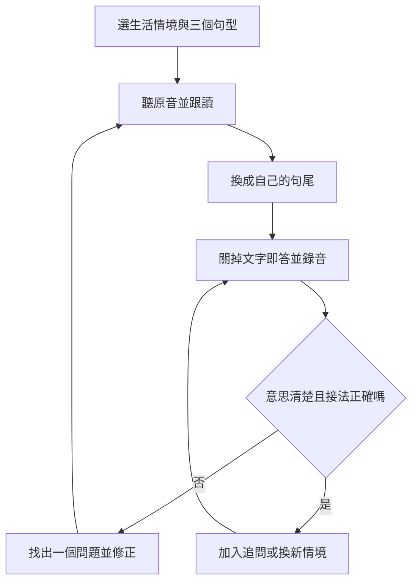

## TL;DR

- 影片用 15 個常用開頭，串起表達打算、感受、需求、邀約、提問與近況，降低每次從頭組句的負擔。
- 練習時把開頭當成一組熟悉的語塊（chunk），再替換後面的動作、事物或子句。
- 縮讀有助辨認自然口語，但清楚、文法正確與符合場合仍優先；`gonna`、`wanna` 不宜直接搬進正式書面表達。
- 先挑三個當天用得上的句型，跟讀後換詞，再關掉文字回答情境題。本文另提供自編例句與五分鐘練習流程。
- 「速度馬上翻倍」與僅靠 15 個開頭就能流利，是影片的宣傳性說法；片中未提供測量資料。

## 摘要（Summary）

Nate -Onion English 的這支教學，把日常英語口說拆成 15 個可反覆使用的句子開頭（sentence starters）。講者先示範意思、縮讀與生活情境，再用起床、出門吃飯、請人幫忙、聊天及休息等場景，把學過的句型串成一天。

它適合已認得一些單字，卻常在開口時停下來組句的學習者。實際可練的能力包括：快速啟動一句話、辨認縮讀、替換句尾，以及在沒聽懂時主動請求說明。這份清單涵蓋的主要是日常對話，無法直接代表完整英語能力。

> [!info] 來源與辨識範圍
> 影片發布於 2026-09-30，長度 13:45。檢查時沒有可用的人工字幕或自動字幕，因此下載音訊，以 MLX Whisper 的多語言 small 模型轉錄全片。辨識結果共 409 段，涵蓋 00:00 至約 13:44；英文句型及重點縮讀另以影片畫面核對。自動辨識仍可能漏字或誤認，沒有逐秒人工聽校。
>
> 下方時間點依轉錄定位，方便回看；影片 metadata 沒有章節資料。公開筆記保存意譯與分析，原始 TXT、SRT、JSON 留在本機工作區。

## 關鍵洞察（Key Insights）

1. **把「開始說」與「補上內容」拆開練。** 固定開頭能降低起句時的選擇量；後面的內容仍需要詞彙、文法與情境判斷。
2. **聽得懂縮讀與自己能說清楚是兩個目標。** 先辨認完整形式和口語聲音的關係，再決定自己要縮讀到什麼程度。
3. **修補對話本身就是可練的技能。** 請對方再說一次、放慢或解釋意思，能讓對話繼續；練習不必只追求一次聽懂所有內容。
4. **跟讀之後要加入無稿回答。** 影片結尾示範句型跨情境的組合；本文把這個想法延伸為換詞與情境即答，檢查能否獨立使用。這也可與 [[2026-09-18-HOW-TO-SPEAK-PATRICK-WINSTON-COMMUNICATION-METHODS|有目的的表達練習]] 一起思考。

## 詳細內容（Details）

### 一、15 個句型總表

句型與順序依影片；「接法」是文法整理，「練習例句」全部為本筆記自編，沒有逐句搬用影片示範。時間為約略起點。

| # | 回看時間 | 句型 | 用途與接法 | 自編練習例句 |
|---|---|---|---|---|
| 1 | [00:20](https://www.youtube.com/watch?v=lKTGTokarqI&t=20s) | `I'll...` | 我會／那我就；後接原形動詞，影片以當下決定為入門情境 | `I'll send you the address.` 我把地址傳給你。 |
| 2 | [01:22](https://www.youtube.com/watch?v=lKTGTokarqI&t=82s) | `I feel like...` | 後接子句可表達感覺或判斷；接名詞或動詞 `-ing` 可表達想要 | `I feel like taking a short walk.` 我想稍微散步一下。 |
| 3 | [02:18](https://www.youtube.com/watch?v=lKTGTokarqI&t=138s) | `Looks like...` | 看起來／好像；後接子句，完整開頭為 `It looks like...` | `Looks like the store is closed.` 看起來店關了。 |
| 4 | [02:58](https://www.youtube.com/watch?v=lKTGTokarqI&t=178s) | `I don't know...` | 不知道；可接子句，或 `what/where/how + to + 原形動詞` 等結構 | `I don't know which train to take.` 我不知道要搭哪班車。 |
| 5 | [03:45](https://www.youtube.com/watch?v=lKTGTokarqI&t=225s) | `I'm gonna...` | 我打算／我準備；`I'm going to` 的口語形式，後接原形動詞 | `I'm gonna charge my phone.` 我準備幫手機充電。 |
| 6 | [04:46](https://www.youtube.com/watch?v=lKTGTokarqI&t=286s) | `Let me...` | 我來；可主動接手、爭取思考時間或開始說明，後接原形動詞 | `Let me check the schedule.` 我來看一下行程。 |
| 7 | [05:38](https://www.youtube.com/watch?v=lKTGTokarqI&t=338s) | `I wanna...` | 我想做；`I want to` 的口語形式，後接原形動詞 | `I wanna learn this song.` 我想學這首歌。 |
| 8 | [06:17](https://www.youtube.com/watch?v=lKTGTokarqI&t=377s) | `I have to...` | 我得／我必須；後接原形動詞 | `I have to catch the last bus.` 我得趕上末班公車。 |
| 9 | [07:10](https://www.youtube.com/watch?v=lKTGTokarqI&t=430s) | `Can I get...?` | 請求取得某樣東西；後接名詞或名詞片語，影片以點餐與購物為例 | `Can I get a receipt, please?` 可以給我收據嗎？ |
| 10 | [07:51](https://www.youtube.com/watch?v=lKTGTokarqI&t=471s) | `Do you wanna...?` | 問對方想不想做；後接原形動詞，適合隨意邀約 | `Do you wanna join us for lunch?` 你想跟我們一起吃午餐嗎？ |
| 11 | [08:33](https://www.youtube.com/watch?v=lKTGTokarqI&t=513s) | `Could you...?` | 客氣請人協助；後接原形動詞 | `Could you write it down for me?` 可以幫我寫下來嗎？ |
| 12 | [09:33](https://www.youtube.com/watch?v=lKTGTokarqI&t=573s) | `What do you...?` | 問對方做什麼、想法或選擇；後接原形動詞與需要的補語 | `What do you usually cook?` 你通常煮什麼？ |
| 13 | [10:33](https://www.youtube.com/watch?v=lKTGTokarqI&t=633s) | `How do you...?` | 詢問做法；後接原形動詞與需要的補語 | `How do you pronounce this name?` 這個名字怎麼唸？ |
| 14 | [11:10](https://www.youtube.com/watch?v=lKTGTokarqI&t=670s) | `I've been...` | 描述一段與現在相關的狀態或活動；影片示範形容詞與動詞 `-ing` | `I've been practicing my presentation.` 我這陣子一直在練簡報。 |
| 15 | [11:54](https://www.youtube.com/watch?v=lKTGTokarqI&t=714s) | `I keep...` | 一再／持續做某事；這個用途後接動詞 `-ing` | `I keep leaving my keys at home.` 我老是把鑰匙忘在家裡。 |

### 二、影片特別提醒的意思與文法

#### `I'll` 與 `I'm gonna`

約 [04:24](https://www.youtube.com/watch?v=lKTGTokarqI&t=264s)，講者回到開頭留下的問題：以當下決定與事先打算，幫助初學者區分兩個開頭。講者也明說這個區分並非絕對規則。

練習時可以先用這個對比建立情境感，但不要把所有 `will` 或 `be going to` 的用法都縮成這一組差異。兩者還涉及預測、承諾等用途；完整形式與場合的配合也要保留。

#### `I feel like` 有不同接法

約 [02:00](https://www.youtube.com/watch?v=lKTGTokarqI&t=120s)，影片特別指出：後接一整句話時，可以表達自己的感覺或判斷；接食物、活動或動詞 `-ing` 時，則可能是在說想吃或想做。

例如本筆記自編的 `I feel like we need more time.` 是判斷；總表中的散步例句是意願。不能只記一個中文譯法，忽略句尾的結構。[Cambridge 的動詞接法說明](https://dictionary.cambridge.org/grammar/british-grammar/verb-infinitive-or-verb-ing) 也列出 `feel like` 後接動詞 `-ing` 的用法。

#### 完整問句、間接問句與口語省略要分開

- 影片約 [10:26](https://www.youtube.com/watch?v=lKTGTokarqI&t=626s) 提醒，直接問做法時要練完整問句 `How do you...?`。`how to + 動詞` 也能出現在標題、說明或更長的句子中，不能據此推成「`how to` 只能用在標題」。
- `I don't know` 後接間接問句時，要使用相應的陳述語序。本筆記自編例句：`I don't know where the station is.`
- `Looks like...` 是影片示範的口語省略。初學者仍應掌握完整的 `It looks like...`，避免把這種省略推廣到所有句子。

#### `I've been` 與 `I keep` 描述不同的時間關係

影片約 [11:10](https://www.youtube.com/watch?v=lKTGTokarqI&t=670s) 用 `I've been` 延伸「最近如何」的回答；約 [11:54](https://www.youtube.com/watch?v=lKTGTokarqI&t=714s) 用 `I keep + 動詞 -ing` 說一再發生的事。

補充文法：`I've been + 形容詞` 與 `I've been + 動詞 -ing` 的結構不同，只有後者屬於現在完成進行式（present perfect continuous）。它常用於與現在有關的一段活動，包含仍在進行或最近才停止的情況。[British Council 說明](https://learnenglish.britishcouncil.org/free-resources/grammar/b1-b2/present-perfect-simple-continuous)；`keep` 在持續做某事的用法後接動詞 `-ing`，可查 [Cambridge 動詞接法](https://dictionary.cambridge.org/grammar/british-grammar/verb-infinitive-or-verb-ing)。

### 三、縮讀先用來聽辨，再決定如何開口

影片把縮讀稱為「偷懶」。在本筆記中，將它理解為熟悉口語中聲音的連接與弱化，避免把省力誤解成任意省字或含糊帶過。

| 影片中的完整形式 | 口語或畫面提示 | 練習重點 |
|---|---|---|
| `I will` | `I'll` | 把代名詞與助動詞視為一組；影片也示範不同長短的唸法 |
| `going to` | `gonna` | 辨認談打算或預測時的口語形式，保留後面的動詞 |
| `want to` | `wanna` | 聽出意願與後續動作；不要直接把所有 `want + 名詞` 都套成這個接法 |
| `let me` | `lemme` | 影片約 04:59 的畫面顯示此拼法，作為聽辨提示 |
| `have to`／`have got to` | 前者示範弱化發音；另示範 `gotta` | 分清字面形式與聲音；`gotta` 的來源是 `have got to`，不把兩種寫法當作所有語境都能互換 |
| `could you` | `cudja` | 影片約 09:13 的畫面提示；保留禮貌請求的功能 |
| `what do you` | `whaddaya` | 影片約 09:40 的段落示範連讀；不要因聲音相近而寫成 `What are you` |

> [!warning] 口語拼法不是標準音標
> `lemme`、`cudja`、`whaddaya` 是本片的聲音提示，未提供完整的國際音標（IPA）或口音範圍。同一組字會因語速、重音與口音有不同讀法。先在正常語速下說清楚，再模仿縮讀；不用強求每個場合都說得最快。
>
> BBC 說明 `gonna`、`wanna` 常見於非正式口語，學習者應能辨認，但書面表達應使用完整形式。這與「所有時候都要縮讀」有明顯差別。[BBC Learning English](https://downloads.bbc.co.uk/learningenglish/englishyouneed/unit_13/170505_bbc_learners_questions_unit13.pdf)

### 四、影片如何把句型串成生活情境

約 [12:25](https://www.youtube.com/watch?v=lKTGTokarqI&t=745s)，講者用前面的句型串起一天。其順序可概括為：起床與準備活動、判斷天氣、邀人吃飯、思考選擇、觀察店家、詢問推薦與點餐、外帶及請人協助、說明自己必須做的事、聊精力與近況，最後表達要休息。

這段示範提供的是「熟悉開頭可以在不同場景重用」的教學例子。它是安排好的片段，沒有測試陌生問題、對方追問或即時聽力，因此不能單靠這一段就判定學習者已具備自然對話能力。

### 五、補充設計：五分鐘練習流程

以下是本筆記依影片句型自編的練習安排，時間分配與檢查標準未由影片提出，也沒有在此驗證學習成效。

1. **30 秒，選情境與三個開頭。** 例如今天要購物、問路或邀約，只挑能在這個情境用到的句型。
2. **90 秒，聽原音並跟讀。** 比較完整形式與口語聲音，模仿停頓和重音；先求可理解。
3. **60 秒，替換句尾。** 每個開頭換兩個與自己有關的內容，檢查原形動詞、動詞 `-ing` 與子句接法。
4. **90 秒，關掉文字即答並錄音。** 用三個不同提示回答，容許對方追加一個問題，檢查是否仍能表達原本的意思。
5. **30 秒，回聽一處並記錄。** 寫下起句是否卡住、句尾是否正確、哪個字聽不清楚；下一輪只重練一個問題。



可把每週錄音、當時的卡點與修改後例句整理成小型學習紀錄，與 [[2026-06-19-HIGH-SCHOOL-LEARNING-PORTFOLIO|自主學習與學習證據]] 的觀念相接。這裡只借用記錄方法，不代表符合任何校系的申請或認證規則。

> [!tip] AI 可以出情境題，但回饋要限制範圍
> 可以參照 [[2025-10-16-DESIGN-YOUR-SOCRATIC-AI-MENTOR-FRAMEWORK|蘇格拉底式追問]]，讓 AI 先問一題、等待回答，再指出一個可修改處。文字模式只能檢查文字；沒有音訊時，不能宣稱已核對發音。

自編練習提示語：

```text
請用餐廳、購物或邀約的情境陪我練英語，一次只給一題。
我回答後，先檢查意思、句型接法和禮貌程度，只指出一個最重要的修改。
接著給一個追問，讓我練習不看稿回應。
沒有收到音訊時，不要評分我的發音。
```

### 六、證據與適用範圍

- 片中有具體例句、發音示範與情境串接，足以辨認講者的教法。
- 片中沒有交代「幾千句」「開口速度馬上翻倍」「90% 的人第一次會錯」的資料來源、測試對象或測量方式，不把這些說法當作研究結果。
- 講者將 `I feel like` 描述為聊天中比 `I think` 更常用，但未提供語料統計；本筆記保留其用途，不主張普遍頻率排序。
- 禮貌與自然程度也受語調、關係、地區及情境影響。影片對點餐、問職業與邀約的比較，可作入門提示，不能當成所有說法的固定評分。
- 熟悉 15 個開頭之後，仍要處理詞彙選擇、句尾變化、聽力與意外追問。口說進步應用實際對話或錄音觀察，不只計算看過幾次影片。

## 我的心得（My Takeaways）

這份清單最適合拿來做起句練習：選幾個近期確實會用到的開頭，把句尾換成自己的生活。與影片同步唸得順，只能確認模仿那段內容；能在關掉文字後回答新問題，才提供另一種學習證據。

我會把「清楚、正確、能接住追問」列在速度之前，並同時保留完整形式與口語形式。這樣可以練聽辨，也能依場合調整說法。

## 待補充（Open Questions）

- 這 15 個開頭在不同英語口語語料庫中的頻率與場景分布如何？影片沒有交代選取依據。建議搜尋：`English spoken corpus sentence starters frequency gonna feel like`。
- 固定句型跟讀、換詞與無稿情境回答，哪種組合能改善陌生情境中的反應速度？建議搜尋：`formulaic sequences shadowing spontaneous speaking transfer study`。
- 影片的縮讀示範適用於哪些口音、語速與重音條件？建議搜尋：`connected speech reductions American British English could you what do you`。
- 初學者練到什麼程度，應加入其他時態、否定句與較正式的請求方式？建議搜尋：`formulaic language beginner speaking progression register CEFR`。
- 中英夾雜教學中，如何量化 Whisper 對英文例句及縮讀的漏字、替換與時間戳誤差？建議搜尋：`Whisper Mandarin English code switching transcription reduced speech evaluation`。

## 相關連結（Related）

- [[2026-09-18-HOW-TO-SPEAK-PATRICK-WINSTON-COMMUNICATION-METHODS]]：兩篇都能用來設計有目的的口頭表達練習；Winston 聚焦演講結構，本篇聚焦英語日常起句與聽辨，適用範圍不同。
- [[2026-06-19-HIGH-SCHOOL-LEARNING-PORTFOLIO]]：可借用自主學習記錄的方法，保存口說錄音、卡點與修改證據，避免只有練習時數。
- [[2025-10-16-DESIGN-YOUR-SOCRATIC-AI-MENTOR-FRAMEWORK]]：可借用一次一題、追問及具體回饋的互動方式，設計不看稿的情境練習；沒有音訊時不判定發音。

## 知識層次分析（Bloom's Taxonomy Analysis）

| 認知層次 | 核心目的 | 對本文的具體應用 |
|---|---|---|
| 記憶 | 找得到常用開頭與形式 | 記住 `I'll`、`I'm gonna`、`I feel like`、`Could you`、`I keep` 的用途，能辨認完整形式與口語聲音 |
| 理解 | 解釋接法與用途 | 說明固定開頭與可變句尾的分工；區分 `feel like` 接子句或動詞 `-ing`，以及 `I've been` 的兩種示範結構 |
| 分析 | 找出前提與證據缺口 | 分辨錄製示範與陌生對話；檢查快速縮讀是否犧牲可理解度；指出速度翻倍與使用頻率缺少測量 |
| 應用 | 做出可檢查的練習 | 今天選三個句型，各換兩個句尾；關掉文字回答新提示並錄音；回聽後只修正一處 |
| 評估 | 比較方法與場合 | 跟讀能直接模仿聲音，情境即答可檢查獨立使用；真人回饋較能觀察對方是否理解，但需要安排時間；正式表達保留完整形式 |

### 分析型追問（Socratic Follow-up）

- **澄清**：「流利」在這次練習中指起句快、少停頓，還是讓對方理解並能接續對話？準備觀察哪一項？
- **假設**：若學習者知道開頭，卻缺少句尾所需的單字，這份清單還能解決哪些問題？
- **證據**：要支持「速度翻倍」，前後測應如何控制題目難度、稿件熟悉度與文法正確率？
- **觀點**：聽者若偏好清楚完整的發音，縮讀應怎麼調整？
- **後果**：只反覆練相同的 15 個開頭半年，會不會限制說法與時態？應如何用新情境檢查？

### 方案批判三問（Critical Evaluation）

1. **最大的風險是什麼？** 把熟背範例與說得快當作完整能力，可能忽略文法、理解與禮貌；錯誤若一直重複，也會增加之後修改的成本。
2. **什麼情況下會失敗？** 缺少句尾詞彙、聽不懂追問、從未無稿回答，或把隨意縮讀搬進正式書面情境時，單靠熟悉開頭不足以完成溝通。
3. **有沒有更好的替代方案？** 可以合併短句跟讀、情境角色扮演與真人回饋。跟讀便於重複，角色扮演檢查遷移，真人回饋確認是否被理解；後兩者需要更多時間與回饋品質控制。

## 六頂思考帽回饋（Six Thinking Hats Feedback）

### 藍帽：問題與範圍

本輪討論如何把 15 個開頭變成日常口說練習，以及如何檢查能否獨立使用。不把這份清單延伸成完整英語課程或保證成效。

### 白帽：事實與未知資訊

可確認影片列出 15 個開頭，包含例句、縮讀與一天情境串接；無可用字幕，本次以語音辨識和畫面核對整理。未知資訊包括句型的語料頻率、學習者前後測、口音範圍與長期效果。

### 紅帽：直覺與讀者反應

可能的讀者反應是：少量開頭讓人較願意開始，但「突然流利」也可能引起期待。這是閱讀感受的推測，沒有做讀者調查。

### 黃帽：價值與可保留內容

可保留按功能選開頭的方式，以及請求協助、澄清和提問的句型。它們讓練習有明確情境，也方便比較完整形式與自然口語。

### 黑帽：風險與限制

缺少對照資料的速度與頻率主張不宜當作事實。語音辨識會誤寫英文縮讀；過度追求快也可能降低可理解度。固定句型無法涵蓋所有時態、場合及追問。

### 綠帽：替代方案與新應用

可把 15 個開頭分成功能卡，讓同一張卡配三個新情境；另設「完整形式」與「隨意口語」兩種回答版本。搭配無稿錄音與一次一題的追問，觀察能否換情境使用。

### 藍帽：修改項目與下一步

- 保留影片時間點、自編例句與來源界線，不把縮讀誤辨直接寫進教學表。
- 每輪先練三個近期會用到的開頭，完成一次無稿回答與回聽。
- 把頻率、成效與口音問題留在 Open Questions，取得資料後再調整判斷。

## References

- [YouTube 原始影片](https://www.youtube.com/watch?v=lKTGTokarqI)：Nate -Onion English，2026-09-30，13:45。
- [MLX Whisper 官方文件](https://github.com/ml-explore/mlx-examples/blob/main/whisper/README.md)：本次本機語音辨識的工具說明。
- [Whisper small MLX 模型](https://huggingface.co/mlx-community/whisper-small-mlx)：本次下載 revision `45f3915923c7a79a5a5b5a7d909d39aeb0e5630e`。
- [BBC Learning English：Gonna, wanna, gotta](https://downloads.bbc.co.uk/learningenglish/englishyouneed/unit_13/170505_bbc_learners_questions_unit13.pdf)：非正式口語與書面形式的界線。
- [Cambridge：Verb patterns](https://dictionary.cambridge.org/grammar/british-grammar/verb-infinitive-or-verb-ing)：`feel like`、`keep` 等動詞接法的補充。
- [British Council：Present perfect simple and continuous](https://learnenglish.britishcouncil.org/free-resources/grammar/b1-b2/present-perfect-simple-continuous)：現在完成式與現在完成進行式的補充。
