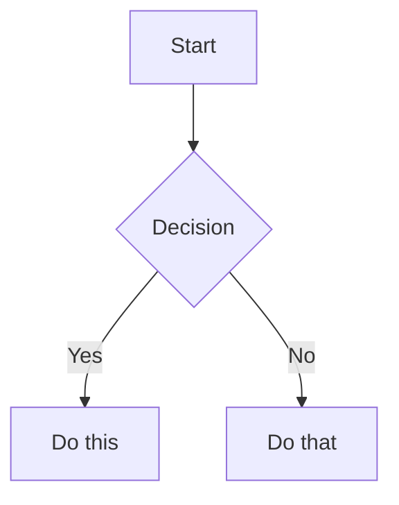

## Summary

A collection of power techniques for Obsidian drawn from kepano's obsidian-skills repo.
Covers five key areas: proper Obsidian Markdown, CLI automation, database views (Bases),
web content extraction (Defuddle), and visual knowledge maps (JSON Canvas).
Use these together to build a rich, interconnected knowledge graph.

## Key Insights

- Use wikilinks `[[Note Name]]` for all internal links — Obsidian auto-tracks renames
- `.base` files turn your notes into a searchable database with filters and formulas
- The Obsidian CLI lets you manage your vault from the terminal or scripts
- Defuddle extracts clean Markdown from any webpage — perfect for saving articles
- JSON Canvas (`.canvas`) creates visual mind maps linking notes together

---

## Details

### 1. Obsidian Flavored Markdown (OFM) — Core Syntax

Beyond standard Markdown, Obsidian has these key extensions:

**Internal Links (Wikilinks)**
```markdown
[[Note Name]]              # Link to a note
[[Note Name|Display Text]] # Custom display text
[[Note Name#Heading]]      # Link to a specific heading
[[#Heading in same note]]  # Link within the same file
```

**Embeds** — prefix any wikilink with `!` to embed content inline:
```markdown
![[Note Name]]           # Embed full note
![[image.png|300]]       # Embed image with width
![[document.pdf#page=3]] # Embed specific PDF page
```

**Callouts** — highlighted info boxes:
```markdown
> [!note]
> Basic callout.

> [!warning] Custom Title
> Callout with custom title.

> [!faq]- Collapsed by default
> Foldable callout (- = collapsed, + = expanded).
```

Common callout types: `note` `tip` `warning` `info` `example` `quote` `bug` `danger` `success` `todo`

**Properties (Frontmatter)**
```yaml
---
title: My Note
date: 2024-01-15
tags:
  - project
  - active
aliases:
  - Alternative Name
---
```

**Tags** — use `#tag` inline or in frontmatter. Nested tags: `#area/subtopic`

**Comments** — hidden in reading view: `%%hidden text%%`

**Math (LaTeX)** — inline: `$e^{i\pi} + 1 = 0$` / block: use `$$...$$`

**Mermaid diagrams**:


---

### 2. Obsidian Bases — Database Views of Your Notes

Create a `.base` file to turn any set of notes into a searchable, filterable database.
This is how to build a powerful knowledge graph overview.

**Basic structure** (YAML format):
```yaml
filters:
  and:
    - file.hasTag("project")
    - 'status != "done"'

formulas:
  days_left: 'if(due_date, (date(due_date) - today()).days, "")'

views:
  - type: table
    name: "Active Projects"
    order:
      - file.name
      - status
      - formula.days_left
```

**View types**: `table` | `cards` | `list` | `map`

**Key file properties**: `file.name` `file.path` `file.tags` `file.mtime` `file.backlinks`

**Useful formulas**:
```yaml
formulas:
  # Days until due date
  days_until_due: 'if(due, (date(due) - today()).days, "")'
  # Status icon
  status_icon: 'if(done, "✅", "⏳")'
  # Format file creation date
  created: 'file.ctime.format("YYYY-MM-DD")'
```

**Embed a base view inside any note**:
```markdown
![[MyBase.base]]
![[MyBase.base#View Name]]  # Specific view
```

---

### 3. Obsidian CLI — Automate Your Vault

The `obsidian` CLI lets you read, create, search, and manage notes from the terminal.
Requires Obsidian to be running.

```bash
# Install
# (see https://help.obsidian.md/cli for setup)

# Read a note
obsidian read file="My Note"

# Create a note from a template
obsidian create name="New Note" content="# Hello" template="Template" silent

# Append to today's daily note
obsidian daily:append content="- [ ] New task"

# Search across the vault
obsidian search query="knowledge graph" limit=10

# Set a property on a note
obsidian property:set name="status" value="done" file="My Note"

# List all tags sorted by count
obsidian tags sort=count counts

# Get backlinks for a note
obsidian backlinks file="My Note"
```

Useful flags: `--copy` (copy output to clipboard), `silent` (don't open the file), `total` (get count)

---

### 4. Defuddle — Extract Clean Web Content

Use Defuddle CLI to extract clean, ad-free Markdown from any webpage.
Much better than copy-pasting — removes navigation, sidebars, and clutter.

```bash
# Install
npm install -g defuddle

# Extract clean Markdown from a URL
defuddle parse https://example.com/article --md

# Save directly to a file
defuddle parse https://example.com/article --md -o content.md

# Get just the title or description
defuddle parse https://example.com -p title
defuddle parse https://example.com -p description
```

Output formats: `--md` (Markdown), `--json` (JSON with HTML + Markdown), no flag = HTML

**Workflow**: Defuddle → paste output → fill in frontmatter → save to `WebArticles/`

---

### 5. JSON Canvas — Visual Knowledge Maps

Create `.canvas` files for visual mind maps and concept diagrams that link to your notes.

**Basic structure**:
```json
{
  "nodes": [
    {
      "id": "6f0ad84f44ce9c17",
      "type": "text",
      "x": 0, "y": 0,
      "width": 400, "height": 200,
      "text": "# Main Concept\n\nCore idea here."
    },
    {
      "id": "a1b2c3d4e5f67890",
      "type": "file",
      "x": 500, "y": 0,
      "width": 400, "height": 300,
      "file": "AI/SOME-NOTE.md"
    }
  ],
  "edges": [
    {
      "id": "0123456789abcdef",
      "fromNode": "6f0ad84f44ce9c17",
      "toNode": "a1b2c3d4e5f67890",
      "toEnd": "arrow",
      "label": "relates to"
    }
  ]
}
```

**Node types**: `text` (Markdown content) | `file` (link to vault note) | `link` (external URL) | `group` (container)

**Colors**: preset `"1"`=Red `"2"`=Orange `"3"`=Yellow `"4"`=Green `"5"`=Cyan `"6"`=Purple, or hex `"#FF0000"`

**Layout tips**: x increases right, y increases down; space nodes 50-100px apart; use groups to cluster related nodes

---

## My Takeaways

- For daily capture: use **Defuddle** to save articles cleanly, then apply the ADD-ARTICLE SOP
- For knowledge overview: create `.base` files per category (e.g. one for all AI notes, one for all Videos)
- For visual thinking: use `.canvas` to map connections between concepts across categories
- For automation: the Obsidian CLI can batch-tag, batch-search, or auto-fill daily notes from scripts
- Best combo: Defuddle → note → wikilinks → Bases view → Canvas map

## Related

- [[ADD-ARTICLE-SOP]]
- [[YOUTUBE-KNOWLEDGE-GRAPH]]
