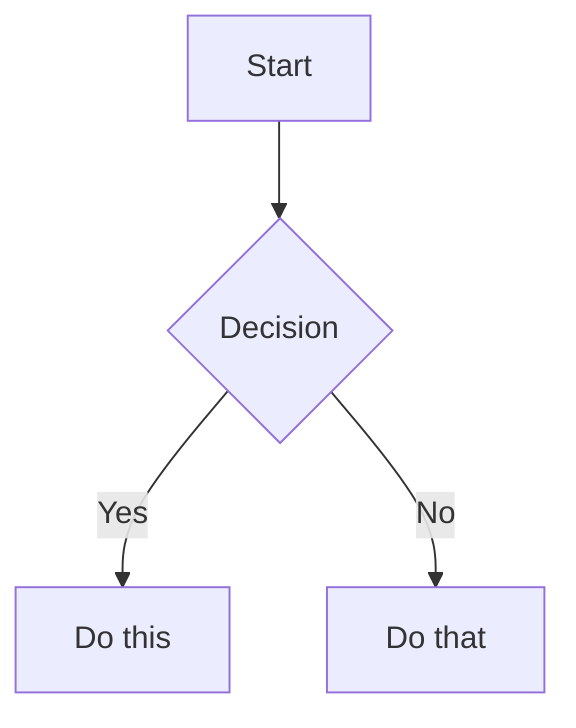

## Summary

A collection of power techniques for Obsidian drawn from kepano's obsidian-skills repo.
Covers five key areas: proper Obsidian Markdown, CLI automation, database views (Bases),
web content extraction (Defuddle), and visual knowledge maps (JSON Canvas).
Use these together to build a rich, interconnected knowledge graph.

## Key Insights

- Use wikilinks `[[Note Name]]` for all internal links — Obsidian auto-tracks renames
- `.base` files turn your notes into a searchable database with filters and formulas
- The Obsidian CLI lets you manage your vault from the terminal or scripts
- Defuddle extracts clean Markdown from any webpage — perfect for saving articles
- JSON Canvas (`.canvas`) creates visual mind maps linking notes together

---

## Details

### 1. Obsidian Flavored Markdown (OFM) — Core Syntax

Beyond standard Markdown, Obsidian has these key extensions:

**Internal Links (Wikilinks)**
```markdown
[[Note Name]]              # Link to a note
[[Note Name|Display Text]] # Custom display text
[[Note Name#Heading]]      # Link to a specific heading
[[#Heading in same note]]  # Link within the same file
```

**Embeds** — prefix any wikilink with `!` to embed content inline:
```markdown
![[Note Name]]           # Embed full note
![[image.png|300]]       # Embed image with width
![[document.pdf#page=3]] # Embed specific PDF page
```

**Callouts** — highlighted info boxes:
```markdown
> [!note]
> Basic callout.

> [!warning] Custom Title
> Callout with custom title.

> [!faq]- Collapsed by default
> Foldable callout (- = collapsed, + = expanded).
```

Common callout types: `note` `tip` `warning` `info` `example` `quote` `bug` `danger` `success` `todo`

**Properties (Frontmatter)**
```yaml
---
title: My Note
date: 2024-01-15
tags:
  - project
  - active
aliases:
  - Alternative Name
---
```

**Tags** — use `#tag` inline or in frontmatter. Nested tags: `#area/subtopic`

**Comments** — hidden in reading view: `%%hidden text%%`

**Math (LaTeX)** — inline: `$e^{i\pi} + 1 = 0$` / block: use `$$...$$`

**Mermaid diagrams**:

```mermaid
graph TD
  A[Start] --> B{Decision}
  B -->|Yes| C[Do this]
  B -->|No| D[Do that]
```

---

### 2. Obsidian Bases — Database Views of Your Notes

Create a `.base` file to turn any set of notes into a searchable, filterable database.
This is how to build a powerful knowledge graph overview.

**Basic structure** (YAML format):
```yaml
filters:
  and:
    - file.hasTag("project")
    - 'status != "done"'

formulas:
  days_left: 'if(due_date, (date(due_date) - today()).days, "")'

views:
  - type: table
    name: "Active Projects"
    order:
      - file.name
      - status
      - formula.days_left
```

**View types**: `table` | `cards` | `list` | `map`

**Key file properties**: `file.name` `file.path` `file.tags` `file.mtime` `file.backlinks`

**Useful formulas**:
```yaml
formulas:
  # Days until due date
  days_until_due: 'if(due, (date(due) - today()).days, "")'
  # Status icon
  status_icon: 'if(done, "✅", "⏳")'
  # Format file creation date
  created: 'file.ctime.format("YYYY-MM-DD")'
```

**Embed a base view inside any note**:
```markdown
![[MyBase.base]]
![[MyBase.base#View Name]]  # Specific view
```

---

### 3. Obsidian CLI — Automate Your Vault

The `obsidian` CLI lets you read, create, search, and manage notes from the terminal.
Requires Obsidian to be running.

```bash
# Install
# (see https://help.obsidian.md/cli for setup)

# Read a note
obsidian read file="My Note"

# Create a note from a template
obsidian create name="New Note" content="# Hello" template="Template" silent

# Append to today's daily note
obsidian daily:append content="- [ ] New task"

# Search across the vault
obsidian search query="knowledge graph" limit=10

# Set a property on a note
obsidian property:set name="status" value="done" file="My Note"

# List all tags sorted by count
obsidian tags sort=count counts

# Get backlinks for a note
obsidian backlinks file="My Note"
```

Useful flags: `--copy` (copy output to clipboard), `silent` (don't open the file), `total` (get count)

---

### 4. Defuddle — Extract Clean Web Content

Use Defuddle CLI to extract clean, ad-free Markdown from any webpage.
Much better than copy-pasting — removes navigation, sidebars, and clutter.

```bash
# Install
npm install -g defuddle

# Extract clean Markdown from a URL
defuddle parse https://example.com/article --md

# Save directly to a file
defuddle parse https://example.com/article --md -o content.md

# Get just the title or description
defuddle parse https://example.com -p title
defuddle parse https://example.com -p description
```

Output formats: `--md` (Markdown), `--json` (JSON with HTML + Markdown), no flag = HTML

**Workflow**: Defuddle → paste output → fill in frontmatter → save to `WebArticles/`

---

### 5. JSON Canvas — Visual Knowledge Maps

Create `.canvas` files for visual mind maps and concept diagrams that link to your notes.

**Basic structure**:
```json
{
  "nodes": [
    {
      "id": "6f0ad84f44ce9c17",
      "type": "text",
      "x": 0, "y": 0,
      "width": 400, "height": 200,
      "text": "# Main Concept\n\nCore idea here."
    },
    {
      "id": "a1b2c3d4e5f67890",
      "type": "file",
      "x": 500, "y": 0,
      "width": 400, "height": 300,
      "file": "AI/SOME-NOTE.md"
    }
  ],
  "edges": [
    {
      "id": "0123456789abcdef",
      "fromNode": "6f0ad84f44ce9c17",
      "toNode": "a1b2c3d4e5f67890",
      "toEnd": "arrow",
      "label": "relates to"
    }
  ]
}
```

**Node types**: `text` (Markdown content) | `file` (link to vault note) | `link` (external URL) | `group` (container)

**Colors**: preset `"1"`=Red `"2"`=Orange `"3"`=Yellow `"4"`=Green `"5"`=Cyan `"6"`=Purple, or hex `"#FF0000"`

**Layout tips**: x increases right, y increases down; space nodes 50-100px apart; use groups to cluster related nodes

---

## My Takeaways

- For daily capture: use **Defuddle** to save articles cleanly, then apply the ADD-ARTICLE SOP
- For knowledge overview: create `.base` files per category (e.g. one for all AI notes, one for all Videos)
- For visual thinking: use `.canvas` to map connections between concepts across categories
- For automation: the Obsidian CLI can batch-tag, batch-search, or auto-fill daily notes from scripts
- Best combo: Defuddle → note → wikilinks → Bases view → Canvas map

## 待補充（Open Questions）

- Obsidian Bases（`.base` 檔案）目前是否為正式功能還是仍在 Insider Build 階段？它與社群外掛 Dataview 的功能重疊程度如何，使用者應如何選擇？（建議搜尋：`Obsidian Bases vs Dataview official release comparison`）
- Defuddle CLI 對需要登入的頁面（如付費媒體、需要 cookie 的內容）效果如何？有沒有與 browser extension 結合的使用方式？（建議搜尋：`Defuddle CLI login required pages cookies authentication`）
- Obsidian CLI 的 `obsidian read`、`obsidian search` 等指令需要 Obsidian 正在執行，這在 headless server 環境（如 CI pipeline 或遠端機器）下是否有替代方案？（建議搜尋：`Obsidian CLI headless server automation alternative`）
- JSON Canvas 格式是否為 Obsidian 專屬還是有跨工具標準？其他工具（如 Logseq、Roam Research）是否支援或能匯入 `.canvas` 檔案？（建議搜尋：`JSON Canvas specification cross-tool compatibility standard`）
- Wikilink 自動追蹤重新命名的機制（Obsidian auto-tracks renames）在大型 vault（1000+ 筆記）中的效能如何？大量重新命名時是否有已知的效能問題？（建議搜尋：`Obsidian wikilink rename large vault performance`）

## Related

- [[ADD-ARTICLE-SOP]]
- [[YOUTUBE-KNOWLEDGE-GRAPH]]
- [[2026-04-02-KARPATHY-LLM-WIKI-PATTERN]] — Karpathy 用 Obsidian + LLM Agent 建構個人知識庫的模式，與本文的知識圖譜技巧互補
- [[2026-08-30-MARKDOWN-RENDERER-SPEC-RESEARCH-COMMONMARK-GFM-OBSIDIAN]] — Obsidian Flavored Markdown 的規格層研究（實作端視角），與本文的使用端技巧互補

## 知識層次分析（Bloom's Taxonomy Analysis）

> 以下從五個認知層次對本篇內容進行結構化分析，協助從記憶到評估逐層深化理解。

| 認知層次 | 核心目的 | 對本文的具體應用 |
|---------|---------|--------------|
| **記憶（被動）** | 確認資訊存在，單純資訊檢索，確立基礎知識 | Wikilink 語法（`[[Note Name]]`、`[[Note Name\|Display Text]]`、`[[Note Name#Heading]]`）、Embed 前綴符號 `!`、Callout 類型（note/tip/warning/info 等）、`.base` 檔案結構（filters/formulas/views）、四種 view 類型（table/cards/list/map）、Defuddle CLI 安裝與使用指令、JSON Canvas 的 node 類型（text/file/link/group）、Obsidian CLI 常用指令（read/create/search/daily:append/tags/backlinks） |
| **理解（半被動）** | 解釋概念的含義及關聯，串聯知識點，掌握核心邏輯 | 本文五個技術面向（OFM 語法、Bases 資料庫視圖、CLI 自動化、Defuddle 網頁擷取、JSON Canvas 視覺圖）圍繞同一個核心目標：讓 Obsidian 從純粹的文字編輯器升級為具備「搜尋、篩選、視覺化、自動化」能力的知識圖譜系統。Wikilink 是基礎連結層，Bases 是結構化查詢層，Canvas 是空間思維層，三者疊加形成從「單篇筆記」到「知識網絡」的演化路徑。 |
| **分析（主動）** | 檢驗論點、拆解流程、找出假設，批判性思維 | （1）Obsidian CLI 需要 Obsidian 正在執行，這個架構假設本地 GUI 應用程式永遠可用，在 headless 環境（CI/CD、遠端伺服器）下整個自動化方案失效；（2）`.base` 檔案對 Dataview 的替代關係尚未明朗，若 Bases 仍在 Insider Build 階段，在穩定版本中導入會有版本鎖定風險；（3）JSON Canvas 格式若為 Obsidian 專屬規格，遷移到其他工具時會造成資料鎖定（vendor lock-in）。 |
| **應用（主動）** | 將知識套用情境，規劃執行方案 | （1）建立「Defuddle → 自動填 frontmatter → 存入 WebArticles/ → 觸發 ADD-ARTICLE SOP」的全自動文章擷取流水線；（2）為每個知識分類建立對應的 `.base` 檔案，設定 status 和 tags 過濾器，讓待補充文章一目了然；（3）用 Obsidian CLI 的 `obsidian property:set` 指令批次更新大量筆記的 status 屬性，取代手動逐一修改。 |
| **評估（主動）** | 判斷多個方案的優劣，進行決策和權衡 | Bases vs. Dataview：Bases 是官方原生整合，長期維護更有保障，但功能目前仍有限制；Dataview 功能更成熟豐富，但屬社群外掛，有維護中斷風險。Defuddle vs. 手動複製貼上：Defuddle 去除廣告和側欄雜訊，輸出乾淨 Markdown，節省大量整理時間，但對需要登入的頁面效果未知。JSON Canvas vs. Mermaid 圖：Canvas 支援直接嵌入筆記節點，視覺化連結更直覺；Mermaid 則是純文字、版本控制友善，適合需要在非 Obsidian 環境渲染的場景。 |

### 分析型追問（Socratic Follow-up）

> 以下問題供進一步反思，可用來與 AI 展開蘇格拉底式對話：

- **澄清**：Obsidian Bases 和 Dataview 在功能重疊的部分（如 table view 加篩選條件）有什麼具體的語法或效能差異？兩者是否可以在同一個 vault 中混用？
- **假設**：本文假設「CLI 自動化」可以大幅提升知識管理效率，但 Obsidian CLI 依賴 GUI 應用程式執行的架構前提，是否讓這個假設在許多實際使用情境下站不住腳？
- **證據**：「Defuddle 可以從任何網頁提取乾淨的 Markdown」這個主張，在需要 JavaScript 渲染的 SPA（Single-Page Application）網站或付費牆（paywall）頁面上的實際表現如何？有沒有公開的測試資料？
- **觀點**：使用 JSON Canvas 在 Obsidian 內建立視覺知識地圖，相比使用獨立的思維導圖工具（如 Miro、Excalidraw）有什麼本質優勢？雙向連結到筆記的能力是否足以彌補工具功能上的差距？
- **後果**：若一個大型 vault（1000+ 筆記）完全依賴 Obsidian 專屬語法（wikilinks、OFM callouts、.base、.canvas），未來若需要遷移到其他平台，資料轉換的代價有多高？這是否會形成難以逆轉的工具依賴？
