# 評估 AGENTS.md 的真實效果：Repository 級上下文檔案對程式設計 Agent 到底有沒有幫助？——ETH Zurich 138 個實例的實證研究

## 摘要 (Summary)

ETH Zurich 的研究團隊針對「repository 級上下文檔案（如 AGENTS.md、CLAUDE.md）是否真的能提升程式設計 Agent 的表現」進行了首次大規模實證研究。他們建立了 **AGENTbench**——一個包含 12 個 Python repository、138 個實例、且每個 repo 都配有開發者撰寫之上下文檔案的新 benchmark，並在 **Claude Sonnet 4.5、GPT-5.2、GPT-5.1 Mini、Qwen3-30B-Coder** 四個模型上搭配 **Claude Code、Codex、Qwen Code** 三個 agent 框架進行測試。

核心發現令人意外：

- **LLM 自動生成的上下文檔案反而降低任務成功率約 3%**，同時增加 20% 以上的成本
- **開發者手寫的上下文檔案僅平均提升 4% 成功率**，但伴隨 19% 的成本增加
- 上下文檔案並未減少 agent 找到相關檔案所需的步驟數
- 當移除 repo 中既有的文件（如 README、CONTRIBUTING.md）後，LLM 生成的上下文檔案反而能提升 2.7%——暗示它們主要是在**複製既有文件中已有的資訊**

> [!important] 關鍵結論
> 上下文檔案（context files）的效果遠不如社群預期。它們讓 agent 執行更多測試、探索更多路徑、使用更多 repo 專屬工具，但這些額外行為未必轉化為更高的解題率。**最佳實踐是只提供最精簡、任務關鍵的資訊，而非全面性的概覽文件。**

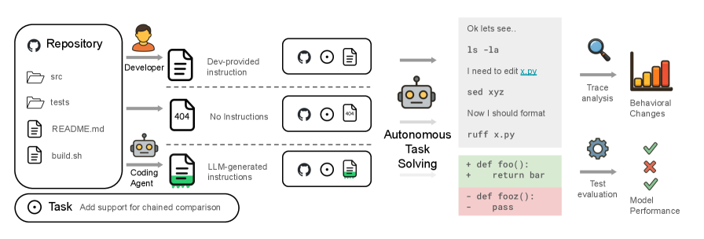

---

## 關鍵洞察 (Key Insights)

### 1. LLM 生成的上下文檔案有害無益

LLM 自動生成的 AGENTS.md 檔案在所有測試配置中，平均**降低**任務解決率約 3%，同時**增加** 20% 以上的執行成本。這直接挑戰了「讓 LLM 自己生成上下文檔案」這個常見做法的有效性。

### 2. 人類撰寫的檔案效果有限且昂貴

開發者手寫的上下文檔案確實帶來正向效果，但幅度很小（平均 +4%），且代價是 19% 的成本增加與 14-22% 的推理 token 增加。投資報酬率令人質疑。

### 3. 上下文檔案改變 agent 行為但不改善導航效率

有上下文檔案的 agent 會執行更多測試、使用更多 repo 專屬工具、消耗更多推理 token，但**找到相關檔案所需的步驟數並未減少**。換言之，agent 並沒有因為上下文檔案而更快地找到正確的切入點。

### 4. 上下文檔案主要複製既有文件

當研究者移除 repo 中的既有文件（README 等），LLM 生成的上下文檔案反而能提升 2.7% 成功率。這證明上下文檔案中的大部分資訊**已經存在於 repo 的既有文件中**，上下文檔案只是在做重複的事。

### 5. Agent 確實會遵循上下文檔案中的指令

當上下文檔案提到 `uv` 工具時，agent 平均每個實例使用 1.6 次 `uv`；沒有上下文檔案時，使用次數低於 0.01。這證明 agent 會忠實執行指令——問題不在於 agent 不聽，而在於這些指令是否真的有幫助。

---

## 詳細內容 (Detailed Content)

### 研究方法 (Methodology)

#### AGENTbench 的建構

研究團隊從 GitHub 上篩選出 12 個 Python repository，條件為：
1. 已有開發者撰寫的上下文檔案（AGENTS.md、CLAUDE.md 或類似格式）
2. 有足夠的 issue 與 pull request 可供建構測試實例
3. 有良好的測試覆蓋率

每個實例包含一個 GitHub issue 描述與對應的 pull request patch，agent 需要根據 issue 描述自動修復或實現功能，最終以測試通過率作為評估標準。

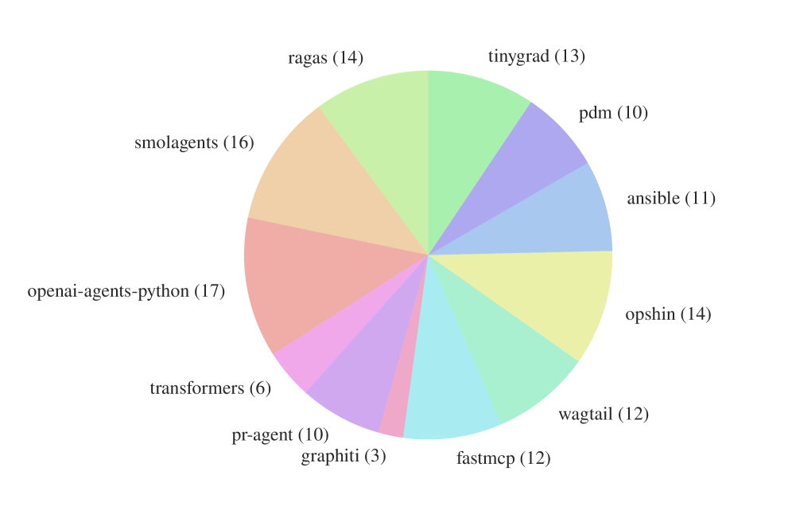

#### AGENTbench 統計數據

| 指標 (Metric) | 平均值 (Mean) | 最小值 (Min) | 最大值 (Max) |
|---|---|---|---|
| PR 描述字數 (PR body words) | 415.3 | 5 | 4961 |
| Issue 描述字數 (Issue description words) | 211.6 | 96 | 500 |
| 程式碼庫檔案數 (Codebase files) | 3337 | 151 | 26602 |
| PR 修改行數 (PR patch lines edited) | 118.9 | 12 | 1973 |
| PR 修改檔案數 (PR patch files edited) | 2.5 | 1 | 23 |
| 測試覆蓋率 (Test coverage) | 75% | 2.5% | 100% |
| 上下文檔案字數 (Context file words) | 641.0 | 24 | 2003 |
| 上下文檔案段落數 (Context file sections) | 9.7 | 1 | 29 |

> [!note] Benchmark 設計特色
> AGENTbench 與 SWE-Bench 的關鍵差異在於：所有 12 個 repo 都自帶開發者撰寫的上下文檔案，使得「人類撰寫 vs. LLM 生成 vs. 無上下文檔案」的三方比較成為可能。

#### 三種上下文檔案條件

1. **None（無上下文檔案）**：移除 repo 中所有上下文檔案
2. **LLM（LLM 生成）**：使用 LLM 根據 repo 內容自動生成上下文檔案
3. **Human（人類撰寫）**：使用 repo 中原本就有的開發者手寫上下文檔案

#### 測試模型與 Agent 框架

- **Claude Sonnet 4.5** + Claude Code
- **GPT-5.2** + Codex
- **GPT-5.1 Mini** + Codex
- **Qwen3-30B-Coder** + Qwen Code

### 實驗結果 (Results)

#### 解題率 (Resolution Rates)

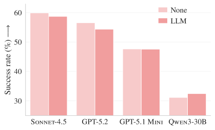

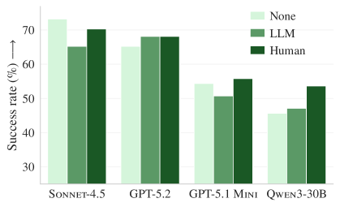

核心數據：

- **SWE-Bench Lite** 上，LLM 生成的上下文檔案在所有四個模型中都**降低**了解題率
- **AGENTbench** 上，人類撰寫的上下文檔案平均帶來約 4% 的提升，但 LLM 生成的上下文檔案仍然表現不佳
- 效果因模型而異——某些模型從上下文檔案獲益更多，某些則受害更深

> [!warning] LLM 生成的上下文檔案是有害的
> 在所有測試配置中，LLM 自動生成的上下文檔案平均降低約 3% 的任務成功率，同時增加超過 20% 的成本。這意味著目前流行的「用 AI 自動生成 AGENTS.md」做法可能弊大於利。

#### 步驟數與成本 (Steps and Costs)

| 資料集 | 模型 | 無上下文 步驟 | 無上下文 成本 | LLM 步驟 | LLM 成本 | 人類 步驟 | 人類 成本 |
|---|---|---|---|---|---|---|---|
| SWE-Bench Lite | Sonnet-4.5 | 54.4 | $1.30 | 57.2 | $1.51 | — | — |
| | GPT-5.2 | 12.5 | $0.32 | 12.7 | $0.43 | — | — |
| | GPT-5.1 Mini | 40.9 | $0.18 | 45.2 | $0.22 | — | — |
| | Qwen3-30B | 29.7 | $0.12 | 32.2 | $0.13 | — | — |
| AGENTbench | Sonnet-4.5 | 40.7 | $1.15 | 46.5 | $1.33 | 45.3 | $1.30 |
| | GPT-5.2 | 12.1 | $0.38 | 13.1 | $0.57 | 13.6 | $0.54 |
| | GPT-5.1 Mini | 40.6 | $0.18 | 46.9 | $0.20 | 46.6 | $0.19 |
| | Qwen3-30B | 31.5 | $0.13 | 34.2 | $0.15 | 32.8 | $0.15 |

> [!note] 成本增幅顯著
> 以 GPT-5.2 為例，LLM 生成的上下文檔案讓 AGENTbench 成本從 $0.38 增加到 $0.57（+50%），而人類撰寫的也增加到 $0.54（+42%）。在大規模部署中，這些成本差異會快速放大。

### 行為分析 (Behavioral Analysis)

#### 檔案導航效率未改善

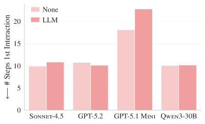

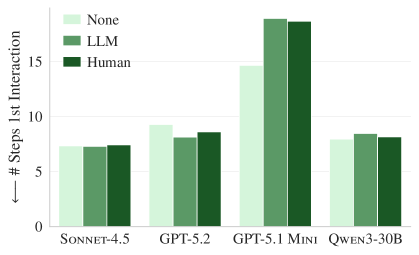

研究顯示，上下文檔案**並未減少 agent 找到相關檔案所需的步驟數**。這打破了一個常見假設——人們以為上下文檔案能幫助 agent 更快定位到需要修改的程式碼。事實上，agent 依然需要透過搜尋和探索來定位目標檔案。

#### 移除既有文件的影響

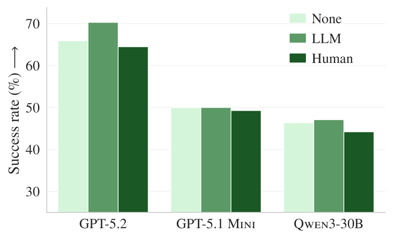

> [!important] 上下文檔案 = 重複資訊
> 當 repo 中的 README、CONTRIBUTING.md 等文件被移除後，LLM 生成的上下文檔案反而能提升 2.7% 的成功率。這強烈暗示上下文檔案中的資訊大多與既有文件重複——它們填補的是文件被移除後的空缺，而非提供新的、獨特的指引。

#### 工具使用模式變化

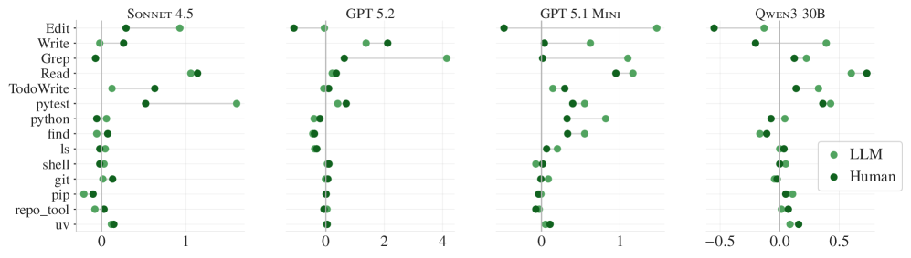

上下文檔案明顯改變了 agent 的工具使用模式：
- agent 執行更多測試
- 使用更多 repo 專屬的工具與命令
- 整體探索範圍增大

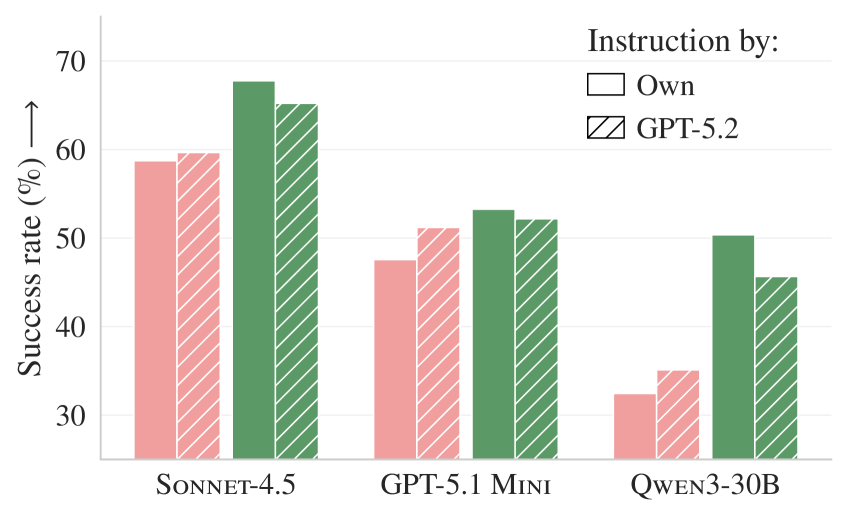

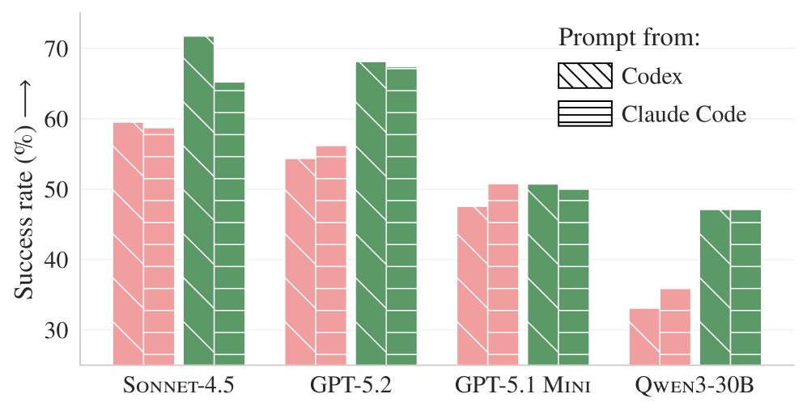

特別值得注意的是 agent 對指令的遵循程度：當上下文檔案提到 `uv` 工具時，agent 平均每個實例使用 1.6 次；沒有上下文檔案時使用次數低於 0.01。這證明 agent 確實在「聽話」——但問題在於這些額外行為不一定能提高成功率。

#### 推理 Token 消耗

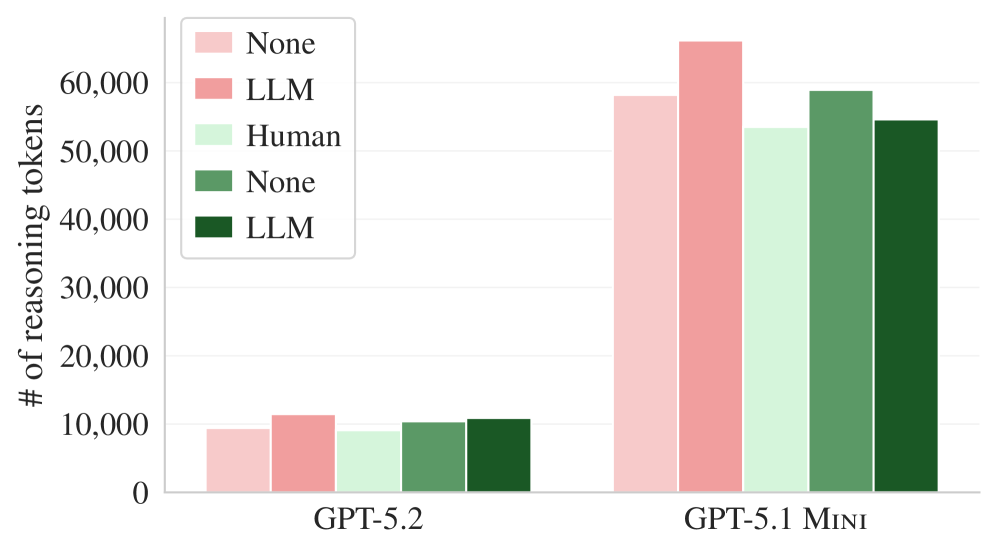

上下文檔案導致 agent 額外消耗 **14-22% 的推理 token**。更多的推理並不等於更好的結果——這些額外的「思考」可能反而讓 agent 過度分析或走入歧途。

#### 跨模型上下文檔案生成

研究也測試了用不同模型生成上下文檔案再交叉使用的效果，結果同樣不理想。

#### 各 Repository 的結果差異

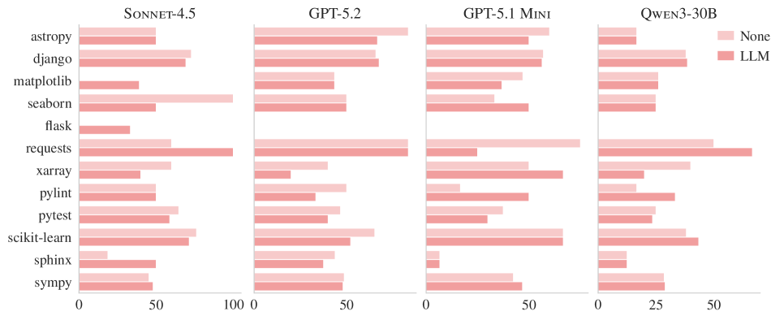

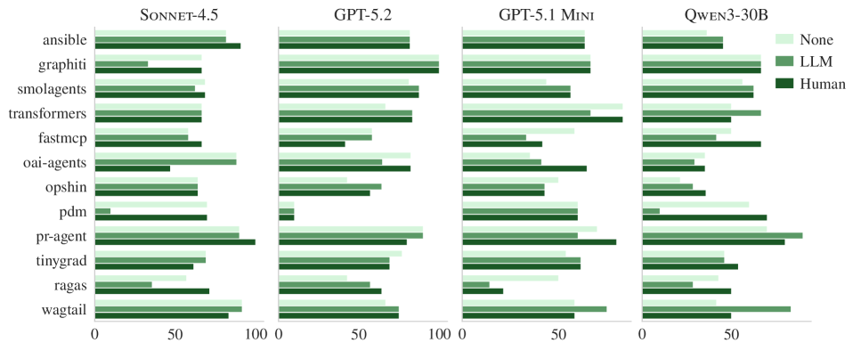

不同 repository 之間的結果差異很大，暗示上下文檔案的效果高度依賴於 repo 的特性（如程式碼複雜度、文件品質、測試覆蓋率等）。

### 研究建議 (Recommendations)

> [!tip] 論文的實務建議
> 1. **精簡至上**：上下文檔案應只包含最精簡、任務關鍵的資訊，而非全面性的概覽
> 2. **避免重複**：不要在上下文檔案中重述 README 或其他既有文件已涵蓋的內容
> 3. **避免 LLM 自動生成**：目前 LLM 生成的上下文檔案品質不足以帶來正向效果
> 4. **成本意識**：考量到 19-50% 的成本增加，應仔細評估上下文檔案的投資報酬率
> 5. **專注於知識缺口**：只在 agent 無法從程式碼本身推斷出的資訊才值得寫入上下文檔案

---

## 我的思考 (My Takeaways)

### 與 Vercel 實驗結果的調和

> [!quote] 看似矛盾的兩個結論
> Vercel 的實驗顯示 AGENTS.md 帶來 100% 的通過率提升，而 ETH Zurich 的研究卻顯示效果微乎其微甚至有害。這兩個結論看似矛盾，實則指向同一個原理。

這兩個研究的關鍵差異在於**任務類型**：

- **Vercel 測試的場景**：Agent 需要使用**全新的 API**（不在訓練資料中），存在真正的「知識缺口」（knowledge gap）。在這種情況下，AGENTS.md 提供了 agent 無法從其他來源獲得的關鍵資訊，效果自然顯著。
- **ETH Zurich 測試的場景**：Agent 處理的是**既有程式碼庫**中的 bug 修復與功能實現，repo 中已有完整的文件、程式碼、測試。Agent 本身就能從程式碼中「讀出」需要的資訊，上下文檔案只是在重複已知的事。

**調和結論**：AGENTS.md 在存在真正知識缺口時極為有效，但在資訊已可從程式碼推斷的情境下則效果有限甚至有害。

### 與先前 CLAUDE.md 研究的連結

這個發現與我們之前整理的「[[2026-01-18-STOP-BLOATING-YOUR-CLAUDE-MD-PROGRESSIVE-DISCLOSURE-AI-CODING-TOOLS]]」完全一致——**膨脹的上下文檔案反而有害**。漸進式揭露（progressive disclosure）的原則在這裡再次得到驗證：不是資訊越多越好，而是**在對的時機提供對的資訊**才是關鍵。

### 對日常實務的影響

1. **不要用 LLM 自動生成 AGENTS.md** — 這是目前很多團隊的做法，但數據顯示它有害
2. **上下文檔案應聚焦於「agent 無法自行發現」的資訊** — 例如：部署流程、安全限制、團隊特有的命名慣例、不在程式碼中體現的架構決策
3. **成本是真實的** — 每個上下文檔案都會增加 14-22% 的推理 token 消耗，在高頻使用場景下累積可觀
4. **上下文檔案的最大價值可能在 onboarding 新 API 或新工具**，而非日常的 bug 修復

> [!warning] 實務警告
> 如果你的 CLAUDE.md 或 AGENTS.md 超過 500 字，請重新審視其中有多少資訊是 agent 本來就能從程式碼中推斷的。根據本研究，大部分的「全面概覽」型上下文檔案只是在增加成本，而非提高成功率。

---

## 開放問題 (Open Questions)

1. **上下文檔案的最佳長度與內容密度為何？** 研究中的上下文檔案平均 641 字、9.7 個段落，但沒有測試更精簡的版本是否更有效。
   - 搜尋關鍵字：`context file optimal length agent performance`

2. **針對特定任務類型（如安全修復、效能優化）的上下文檔案是否更有效？** 本研究主要測試一般性的 bug 修復與功能實現。
   - 搜尋關鍵字：`task-specific context engineering agent evaluation`

3. **動態上下文檔案（根據任務自動選擇相關段落）是否能解決「資訊過多」的問題？** 類似 RAG 的概念應用於上下文工程。
   - 搜尋關鍵字：`dynamic context selection coding agent RAG`

4. **在多語言（non-Python）專案中，上下文檔案的效果是否不同？** 本研究僅涵蓋 Python repo。
   - 搜尋關鍵字：`multi-language repository agent context evaluation`

5. **上下文檔案對「組合型任務」（需要跨多個模組修改）的效果是否更顯著？** PR patch 平均只改 2.5 個檔案，較大規模的修改可能更需要全局指引。
   - 搜尋關鍵字：`cross-module code changes agent navigation context`

6. **上下文檔案中的「負面指令」（不要做什麼）是否比「正面指令」（要做什麼）更有效？** Agent 過度探索的行為暗示正面指令可能導致過多的額外動作。
   - 搜尋關鍵字：`negative instructions LLM agent constraint coding`

7. **隨著 LLM 能力提升，上下文檔案的邊際效用是否會持續下降？** GPT-5.2 已經展現較強的自主導航能力，未來模型可能更不需要外部指引。
   - 搜尋關鍵字：`LLM capability scaling context engineering diminishing returns`

---

## Bloom 分類法分析 (Bloom's Taxonomy)

### 記憶 (Remember)
- AGENTbench 包含 12 個 Python repository、138 個實例
- LLM 生成的上下文檔案降低成功率約 3%，增加成本 20%+
- 人類撰寫的上下文檔案提升約 4%，增加成本 19%
- 上下文檔案導致推理 token 增加 14-22%
- 測試使用了 Claude Sonnet 4.5、GPT-5.2、GPT-5.1 Mini、Qwen3-30B-Coder 四個模型

### 理解 (Understand)
- 上下文檔案讓 agent「做更多事」（跑更多測試、用更多工具），但不代表「做對的事」
- LLM 生成的上下文檔案效果不佳，因為它們主要複製 repo 中既有文件的資訊
- 移除既有文件後 LLM 上下文檔案才有正面效果，證明資訊重複是核心問題

### 應用 (Apply)
- 撰寫上下文檔案時，只納入 agent 無法從程式碼自行推斷的資訊
- 避免使用 LLM 自動生成上下文檔案
- 在評估上下文檔案價值時，同時考量成功率提升與成本增加

### 分析 (Analyze)
- Vercel 與 ETH Zurich 結果的差異源於任務性質不同：知識缺口 vs. 既有資訊
- agent 遵循上下文檔案指令（如使用 `uv`）但不代表這些指令對任務有幫助
- 各 repository 間的效果差異大，暗示上下文檔案效用高度情境依賴

### 評價 (Evaluate)
- 「全面概覽型」上下文檔案的投資報酬率偏低（+4% 成功率 / +19% 成本）
- 上下文檔案的價值主要來自於填補真正的知識缺口，而非提供冗餘資訊
- 目前的 LLM 生成上下文檔案技術尚未成熟，可能弊大於利

### 創造 (Create)
- 設計「漸進式揭露」的上下文檔案策略：根據任務類型動態載入不同段落
- 建立上下文檔案的品質指標：資訊密度、與既有文件的重複率、任務相關性
- 提出「知識缺口導向」的上下文工程框架：先識別 agent 的知識盲點，再針對性補充

---

## 蘇格拉底式追問 (Socratic Follow-up Questions)

1. **如果上下文檔案的價值在於填補知識缺口，那我們如何系統性地識別出 agent 在特定 repo 中的知識盲點？**

2. **上下文檔案導致 agent 「做更多事」——這是否暗示 agent 對指令過度敏感（overly compliant），而缺乏判斷「這個指令是否對當前任務有幫助」的能力？**

3. **14-22% 的推理 token 增加是否意味著上下文檔案在消耗 agent 的「認知頻寬」？如果 agent 的 context window 是有限的，那上下文檔案是否在排擠更重要的資訊？**

4. **既然 agent 會忠實遵循上下文檔案中的指令（如使用 `uv`），那是否有可能設計一種「反向上下文檔案」——告訴 agent「不要做什麼」——來抑制不必要的探索行為？**

5. **本研究只測試了 Python repo。在型別系統較弱的語言（如 JavaScript）或較強的語言（如 Rust）中，上下文檔案的效果是否會有系統性差異？**

---

## 相關筆記 (Related Notes)

- [[2026-01-27-VERCEL-AGENTS-MD-OUTPERFORMS-SKILLS-IN-AGENT-EVALS]]：Vercel 的實驗顯示 AGENTS.md 在「新 API 學習」場景下帶來 100% 通過率提升。與本研究看似矛盾，但實際上揭示了同一個原則：**上下文檔案的價值取決於是否存在真正的知識缺口**。Vercel 測試的是訓練資料中不存在的新 API（知識缺口明確），而 ETH Zurich 測試的是既有 repo 中的任務（agent 可自行推斷資訊）。
- [[2026-04-15-CLAUDE-MD-BEST-PRACTICES-EXPERT-GUIDE-SKILLS-VS-CLAUDEMD]]：CLAUDE.md 最佳實踐指南。本研究提供了實證數據支持「精簡至上」的原則——過多的資訊反而有害。
- [[2026-01-18-STOP-BLOATING-YOUR-CLAUDE-MD-PROGRESSIVE-DISCLOSURE-AI-CODING-TOOLS]]：漸進式揭露的原則與本研究高度一致。上下文檔案中的冗餘資訊不僅無效，還會增加成本與推理負擔。
- [[2026-04-02-SAS-OUTPERFORM-MAS-MULTI-HOP-REASONING-EQUAL-TOKEN-BUDGETS]]：單一 agent 在等量 token 預算下優於多 agent 系統。本研究的成本數據進一步強調了 token 效率的重要性——上下文檔案造成的 14-22% token 增加在 multi-agent 場景下會被放大。
- [[2026-04-15-AI-DEVELOPER-EVOLUTION-PRACTITIONER-GUIDE-PERE-VILLEGA]]：Pere Villega 系列第 5 章直接引用本研究，作為「自動生成 CLAUDE.md 傷害效能」的主要實證支柱。
- [[2026-05-20-CODEX-CLI-CODE-ANALYSIS]]：OpenAI Codex 也採用 `AGENTS.md` 約定（codex-rs/AGENTS.md 內含明確工程紀律與規範），本筆記的研究結論對 Codex 用戶同樣適用——AGENTS.md 的價值在於是否填補真正的知識缺口。

## 相關連結（Related）
- [[2026-05-24-WHY-AI-WEBSITE-CRASHES-AFTER-LAUNCH-BACKEND-SCALING]] — 補充把架構知識寫進 AGENTS.md / CLAUDE.md 時，應聚焦任務關鍵資訊，避免 context file 膨脹。
