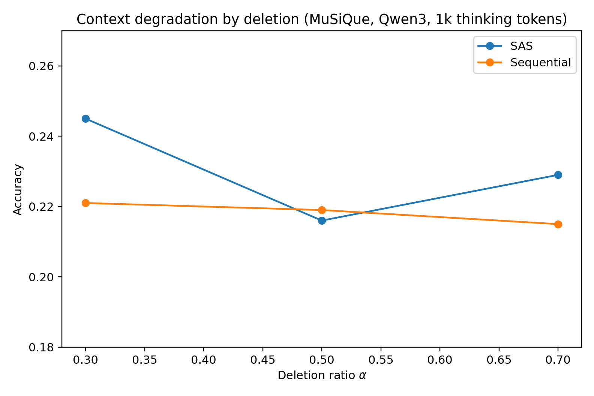
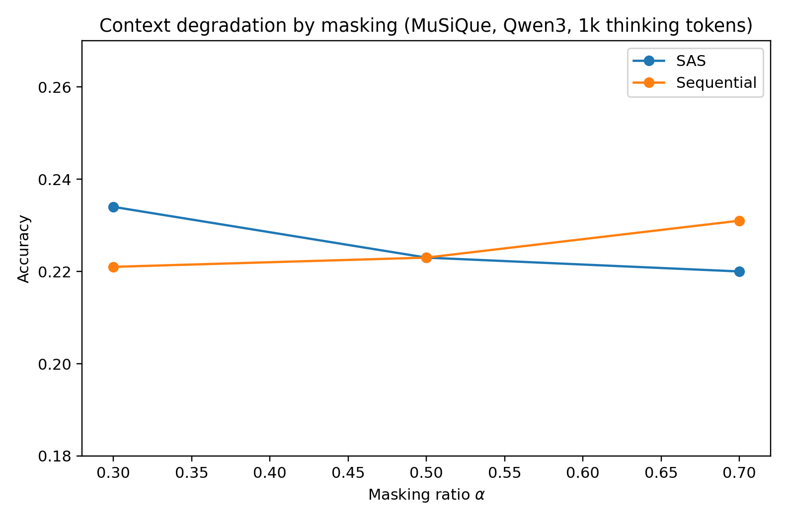
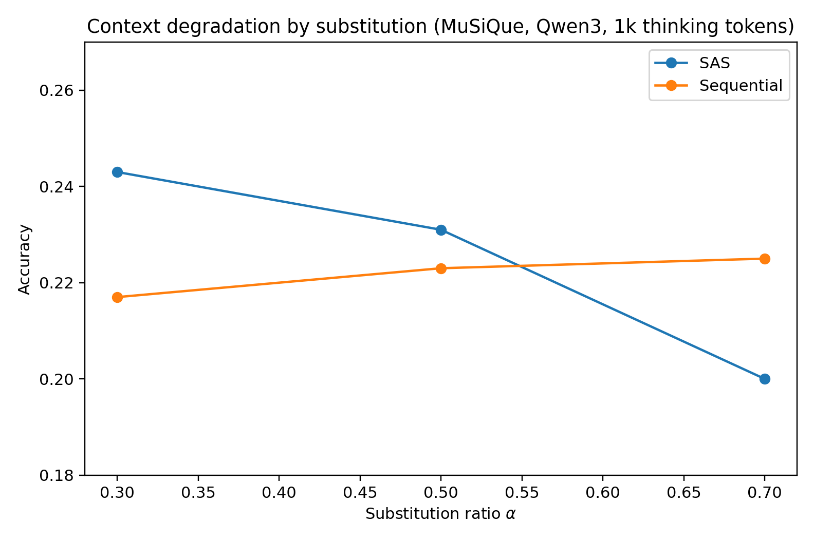
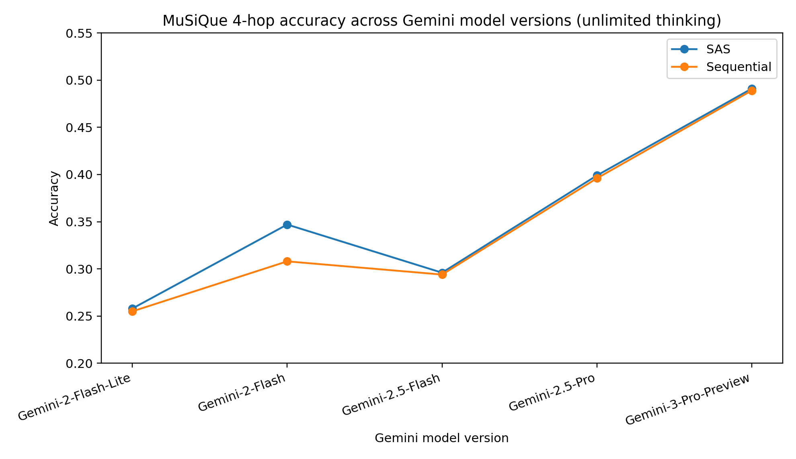

## 摘要（Summary）

Stanford 的 Dat Tran 與 Douwe Kiela 提出一個挑戰 Multi-Agent 敘事的研究：在控制思考令牌預算（Thinking Token Budget）的條件下，單一代理人系統（Single-Agent System, SAS）在多跳推理（Multi-Hop Reasoning）任務上一致地匹配或超越多代理人系統（Multi-Agent System, MAS）。論文從資訊理論（Information Theory）的資料處理不等式（Data Processing Inequality, DPI）出發，解釋為何 MAS 的中間通訊環節必然引入資訊損失，並透過三個模型家族（Qwen3、DeepSeek-R1、Gemini 2.5）在兩個資料集（FRAMES、MuSiQue）上的受控實驗驗證此理論。核心結論：**許多 MAS 的效能提升，實際上可由計算量與上下文效應（Compute and Context Effects）解釋，而非架構本身的優勢。**

## 關鍵洞察（Key Insights）

- **公平比較是關鍵** — 多數 MAS vs. SAS 比較未控制測試時計算量（Test-time Compute），MAS 因為有 Planner + 多個 Worker，天然消耗更多令牌。控制預算後優勢消失
- **DPI 提供理論下界** — 多代理人分解本質上是對完整上下文 `C` 的函數映射 `M = g(C)`，根據 DPI，`I(Y;C) ≥ I(Y;M)`，中間訊息永遠不會比原始上下文包含更多關於答案的資訊
- **上下文退化是 MAS 的翻盤條件** — 當單一代理人的有效上下文利用率（Effective Context Utilization）因雜訊、長度或複雜度而退化時，MAS（特別是 Sequential 架構）變得有競爭力
- **Debate 是最強 MAS 變體** — 在五種 MAS 架構中，Debate（兩個辯論者先獨立回答，再互相批評）最具競爭力，但仍不穩定超越 SAS
- **Gemini 的思考令牌會計有差異** — API 報告的 `thoughts_token_count` 與實際可見的思考文本不一致，導致跨模型的公平比較更加困難

## 詳細內容（Details）

### 理論基礎：資料處理不等式（DPI）

> [!note] 核心定理
> 令 `Y` 為正確答案，`C` 為 SAS 可存取的完整上下文，`M = g(C)` 為 MAS 從上下文提取的中間訊息。由 Markov Chain `Y ↔ C ↔ M`，根據 DPI：
> - `I(Y; C) ≥ I(Y; M)` — 單一代理人擁有的資訊量永遠不少於多代理人
> - `H(Y | M) ≥ H(Y | C)` — 多代理人的殘留不確定性更高
> - `P_e(M) ≥ P_e(C)` — 多代理人的最小可達錯誤率更高（Fano 不等式推論）

**含義**：在固定思考令牌預算且完美利用上下文的條件下，SAS 在資訊理論上保證優於或等於 MAS。

### 上下文退化（Context Degradation）預測

論文將退化程度參數化為 `α`，定義有效上下文 `C̃_α = T_α(C)`，其中 `T_α` 是退化操作。隨 `α` 增大：

- SAS 的有效上下文 `C̃_α` 資訊量下降
- 當 `I(Y; C̃_α)` 下降到接近 `I(Y; M_α)` 時，MAS 變得有競爭力
- **關鍵預測**：低退化 → SAS 勝；高退化 → MAS（特別是 Sequential）逐漸追上

### 實驗設計

**資料集**：
- **FRAMES** — 多跳世界知識問題，含簡明標準答案
- **MuSiQue**（4-hop）— 需要四跳推理的問題組合，明顯更困難

**模型**：
- Qwen3-30B（開源）
- DeepSeek-R1-Distill-Llama-70B（開源）
- Gemini 2.5 Flash / Pro（閉源 API）

**MAS 架構**（五種）：

| 架構 | 機制 |
|------|------|
| Sequential | Planner 分解為有序步驟 → 預算分配給 Worker → 逐步傳遞中間結果 → Aggregator 彙整 |
| Subtask-parallel | Planner 提出獨立子任務 → Worker 平行解題 → Aggregator 彙整 |
| Parallel-roles | 四個角色（Solver、Fact Extractor、Skeptic、Second Solver）平行處理同一問題 |
| Debate | 兩個辯論者先獨立回答 → 互相批評 → 分別最終回答 → Judge 裁定 |
| Ensemble | 多個 Worker 獨立回答（高溫度取樣）→ Judge 擇優 |

**令牌預算範圍**：100 → 500 → 1,000 → 2,000 → 5,000 → 10,000 thinking tokens

### 核心結果

> [!important] 主要發現
> 在匹配的思考令牌預算下（除了極小預算 100 tokens 基本不產生推理），**SAS 是多跳推理的最強預設架構**。SAS 消耗的思考令牌遠少於任何 MAS 變體，同時達到相同或更好的效能。

**效能摘要（1000 thinking tokens 平均值）**：

| 指標 | SAS | SAS-L | Sequential | Debate | Ensemble |
|------|-----|-------|-----------|--------|----------|
| 平均分數 | **0.418** | 0.397 | 0.379 | 0.388 | 0.333 |

- **SAS-L**（結構化提示變體）主要改善 Gemini 模型的效能
- **Debate** 是最一致的強力 MAS 變體
- 效能隨令牌預算增加而提升，在 1000–2000 tokens 後趨於平緩
- Gemini 2.5 Pro 是整體最強模型；MuSiQue 明顯更具挑戰性

### 上下文退化實驗結果

四種退化方法（刪除 / 遮蔽 / 替換 / 干擾物插入）在 Qwen3-30B 上以 1000 token 預算測試：

- **替換**（Substitution）產生最強證據：SAS 在 `α=0.3` 領先，但在 `α=0.5`–`0.7` 時 Sequential MAS 反超
- **遮蔽**（Masking）：SAS 在輕度退化領先，中度退化持平
- **刪除**（Deletion）：趨勢較弱，SAS 在輕度退化仍優
- **干擾物插入**（Distractor）：SAS 在 `α=0.3` 領先，`α=0.5` 持平，`α=0.7` Sequential MAS 追上

> [!warning] 重要前提
> 論文的主張**不是** SAS 在任何情況下都更好，而是：在匹配預算且上下文利用正常時，SAS 是最強預設選項。當上下文利用退化夠嚴重時，結構化的多代理人推理可以回補劣勢。

### Gemini 模型版本比較

跨多個 Gemini 版本的測試（無限思考令牌）顯示：效能隨模型能力單調遞增，且 SAS 在所有版本中持續與 Sequential MAS 相當或略強。

### Gemini 思考令牌會計問題

> [!warning] API 差異
> Gemini 的 `thinkingBudget` 參數與 API 報告的 `thoughts_token_count` 之間存在顯著且複雜的差異。論文發現三個關鍵問題：
> 1. 請求的預算與實際使用的令牌數不一致
> 2. 可見的思考文本長度與報告的令牌數不成比例
> 3. 這些差異使得基於令牌數的跨模型公平比較變得困難

論文開發了 SAS-L 變體來應對此問題：透過結構化提示引導 Gemini 產生更長的可見思考文本。

### 限制（Limitations）

1. 僅關注純文字多跳推理；MAS 在工具使用（Tool Use）、多模態、或安全約束場景可能有不同優勢
2. 控制的是「請求的」令牌預算，而非實際消耗的（特別是 Gemini 的會計差異）
3. 僅測試兩個 Benchmark，可能無法代表所有推理任務類型

## 我的心得（My Takeaways）

1. **對 Multi-Agent 架構的健康懷疑** — 在選擇 MAS 架構之前，先問「同樣的令牌預算給單一代理人會怎樣？」這個實驗極其簡單但很少人做。很多 [[2023-10-27-CREWAI-CODE-ANALYSIS|CrewAI]] 等框架的 Demo 效果可能只是「花了更多令牌」的結果
2. **DPI 是直覺的數學化** — 「中間人不會增加資訊」這個直覺終於有了形式化論證。這對 [[2026-03-17-CLAWTEAM-AGENT-SWARM-INTELLIGENCE|ClawTeam]] 這類蜂群架構的設計有直接啟示：只有當任務天然可分解且每個子任務所需上下文不重疊時，MAS 才可能有真正的結構性優勢
3. **上下文退化是真實場景的關鍵** — 實務中我們經常面對雜訊上下文（混亂的 Codebase、不完整的文件），這正是 MAS 可能有用的場景。結合 [[2026-04-07-AI-AGENT-PAINFUL-LESSONS-TUTORIALS-TO-REALITY|AI Agent 踩坑復盤]] 中的經驗，不是不該用 MAS，而是要知道什麼時候該用
4. **Token 預算意識** — 這篇論文強化了 [[2026-04-01-HARNESSING-CLAUDES-INTELLIGENCE|Anthropic 的 Harness 建議]]：選擇架構時，成本/效能的權衡不能只看最終準確率，還要看每個令牌的邊際價值

## 待補充（Open Questions）

- DPI 論證假設完美的解碼器，但現實中 LLM 的解碼器離完美很遠。是否存在 MAS 的中間分解步驟反而幫助「不完美解碼器」更好利用資訊的理論框架？（建議搜尋：`imperfect decoder multi-agent information theory LLM`）
- 論文測試的 MAS 架構都是相對簡單的設計。更先進的 MAS（如帶有共享記憶、工具使用、或 Reflection 循環的架構）在相同預算控制下表現如何？（建議搜尋：`multi-agent reflection loop budget controlled evaluation`）
- 上下文退化實驗用的是人工退化（刪除/遮蔽/替換），但真實世界的退化更微妙（如：相關性稀釋、矛盾資訊）。這些真實退化模式是否會產生不同的 SAS vs. MAS 動態？（建議搜尋：`real-world context degradation LLM retrieval noise`）
- Gemini 的思考令牌會計問題是否也存在於 Claude 的 Extended Thinking？Anthropic 的 `thinking` block 令牌計算與實際推理品質的關係為何？（建議搜尋：`claude extended thinking token accounting budget control`）
- 論文只測試了推理型任務。對於創意型任務（如寫作、設計），MAS 的多元觀點是否能提供 SAS 無法達到的品質？（建議搜尋：`multi-agent creative tasks diversity vs single agent`）

## 相關連結（Related）

- [[2026-04-07-AI-AGENT-PAINFUL-LESSONS-TUTORIALS-TO-REALITY]] — 實務中 Multi-Agent 架構的踩坑經驗，本論文為其提供理論解釋：Sub-Agent 冗餘可能只是浪費令牌
- [[2023-10-27-CREWAI-CODE-ANALYSIS]] — CrewAI 是典型的 MAS 框架，本論文暗示其效能提升可能部分來自更高的計算消耗而非架構優勢
- [[2026-03-17-CLAWTEAM-AGENT-SWARM-INTELLIGENCE]] — ClawTeam 蜂群智能架構，論文的 DPI 分析直接適用：蜂群的通訊瓶頸可能引入資訊損失
- [[2026-03-25-ENGINEERS-FUTURE-MULTI-AGENT-ERA-STEVE-YEGGE]] — Multi-Agent 時代展望，本論文為「什麼時候該用 MAS」提供了定量參考
- [[2026-04-01-HARNESSING-CLAUDES-INTELLIGENCE]] — Anthropic 的成本/智能權衡建議，與本論文的令牌預算控制思維一致
- [[2026-04-02-HARNESS-ENGINEERING-COMPLETE-GUIDE]] — Harness Engineering 的上下文工程，論文的上下文退化分析提供了理論補充
- [[2026-04-24-AGENT-HARNESS-12-MODULES-COMPLETE-GUIDE]] — 七大架構抉擇第一條「先榨乾單智能體」，引用本論文的結論作為佐證
- [[2026-02-12-EVALUATING-AGENTS-MD-CONTEXT-FILES-HELPFUL-FOR-CODING-AGENTS]] — 同為「控制變數後重新檢驗常見假設」的研究方法論，context file 版本的 DPI 對照
- [[2026-05-04-STANFORD-AUGMENTING-LLMS-FIVE-TECHNIQUES-AI-BUILDER-TOOLKIT]] — Stanford 課程的「能 Simple 就 Simple」Multi-Agent 原則，與本研究結論一致

---
- [[2026-05-17-GBRAIN-EVALS-VS-JARVIS-EVAL-METHODOLOGY]] — gbrain-evals 的「multi-adapter 對照組 + per-question-type breakdown」是另一種 agent 比較方法論，與本論文的 SAS vs MAS 對照可互補閱讀

## 知識層次分析（Bloom's Taxonomy Analysis）

> 以下從五個認知層次對本篇內容進行結構化分析，協助從記憶到評估逐層深化理解。

| 認知層次 | 核心目的 | 對本文的具體應用 |
|---------|---------|--------------|
| **記憶（被動）** | 確認資訊存在，單純資訊檢索，確立基礎知識 | DPI（Data Processing Inequality）：`I(Y;C) ≥ I(Y;M)`；五種 MAS 架構（Sequential / Subtask-parallel / Parallel-roles / Debate / Ensemble）；兩個資料集（FRAMES、MuSiQue 4-hop）；三個模型家族（Qwen3-30B、DeepSeek-R1-70B、Gemini 2.5 Flash/Pro）；SAS-L 是結構化提示變體 |
| **理解（半被動）** | 解釋概念的含義及關聯，串聯知識點，掌握核心邏輯 | 論文的核心論證鏈：DPI 保證完整上下文的資訊量 ≥ 中間訊息 → 因此固定預算下 SAS ≥ MAS → 但當上下文利用退化時，SAS 的「有效上下文」資訊量下降，MAS 的結構化分解可能補償此損失。Fano 不等式將資訊量差距轉化為錯誤率下界差距，完成理論到實務的橋接 |
| **分析（主動）** | 檢驗論點、拆解流程、找出假設，批判性思維 | 關鍵假設：(1) DPI 假設完美解碼器，但 LLM 遠非完美——MAS 的分解可能幫助不完美解碼器；(2) 令牌預算控制假設「令牌 = 計算量」，但不同架構的令牌效率可能不同（Planner 令牌 vs. Reasoning 令牌）；(3) 僅測試多跳推理，未涵蓋需要多元觀點的任務類型；(4) Gemini 的令牌會計問題削弱了跨模型比較的可信度 |
| **應用（主動）** | 將知識套用情境，規劃執行方案，實戰決策力 | 1. 在設計 AI Agent 系統時，先以 SAS 為基線，只有在明確識別出上下文退化問題後才引入 MAS 2. 在 connsys-jarvis 等多代理人專案中，為每個子任務測量「單一代理人 + 同等預算」的效能，確保 MAS 的額外複雜度帶來真正的效能提升而非僅僅花更多令牌 3. 把「令牌預算控制」納入 Agent 評估標準，不只看準確率還要看每令牌的邊際價值 |
| **評估（主動）** | 判斷多個方案的優劣，進行決策和權衡 | 論文觀點的限制：僅關注推理準確率，未考慮 MAS 在可解釋性、容錯性、模組化開發等面向的優勢。在生產環境中，MAS 的價值可能不只是準確率——例如 Sequential 架構讓每個步驟可獨立審計和除錯。替代觀點：Anthropic 的 [[2026-04-01-HARNESSING-CLAUDES-INTELLIGENCE|Harness 建議]] 強調「用對的工具而非更多的工具」，與本論文一致。但 [[2026-03-25-ENGINEERS-FUTURE-MULTI-AGENT-ERA-STEVE-YEGGE|Steve Yegge 的觀點]] 則認為 Multi-Agent 是不可避免的趨勢——或許問題不是「MAS vs. SAS」，而是「什麼任務適合什麼架構」 |

### 分析型追問（Socratic Follow-up）

- **澄清**：「思考令牌預算」（Thinking Token Budget）在 DPI 框架中的精確角色是什麼？DPI 本身不涉及計算量限制，那控制預算如何影響理論預測的適用性？
- **假設**：論文假設 MAS 的中間訊息 `M` 嚴格是 `C` 的函數。但如果 MAS 的 Worker 能存取外部工具（如搜尋引擎），`M` 可能包含 `C` 以外的資訊，此時 DPI 的前提是否仍成立？
- **證據**：論文使用 LLM-as-a-judge 評估，但未報告 Judge 模型本身的一致性或偏差。若 Judge 對較長回答（MAS 傾向產出更長的推理鏈）有系統性偏好或偏見，結果可信度如何？
- **觀點**：若 MAS 的支持者看到此論文，最可能的反駁是「你們測的 MAS 太簡單了」。這個批評是否公允？是否有更先進的 MAS 設計可能改變結論？
- **後果**：若業界廣泛接受此論文結論，12 個月後可能出現的副作用是：Multi-Agent 研究經費減少、框架開發停滯，但某些真正受益於 MAS 的應用場景（如安全審計、多角度驗證）也被連帶忽略

## References

- [Single-Agent LLMs Outperform Multi-Agent Systems on Multi-Hop Reasoning Under Equal Thinking Token Budgets — arXiv](https://arxiv.org/html/2604.02460v1)
- [arXiv 摘要頁](https://arxiv.org/abs/2604.02460v1)
