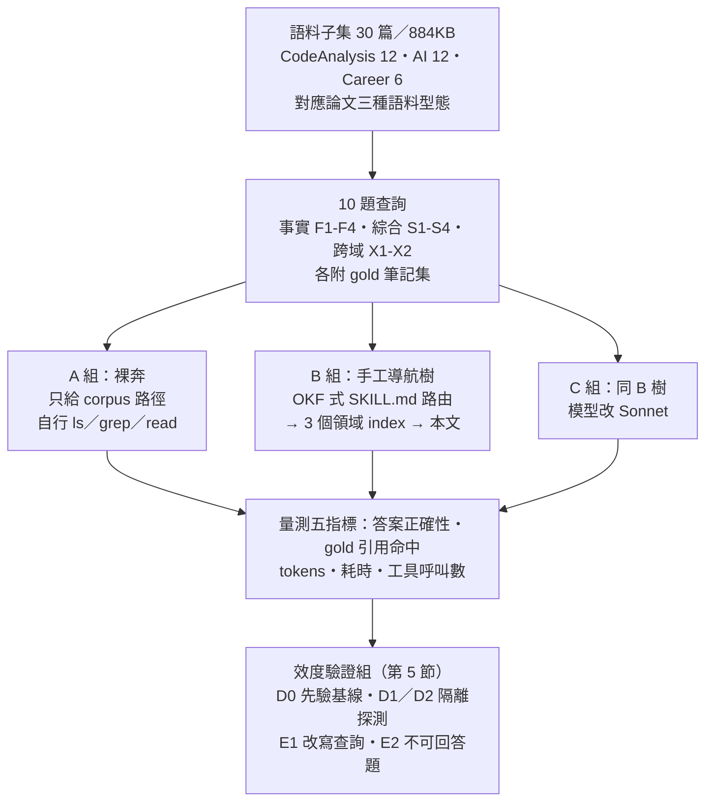
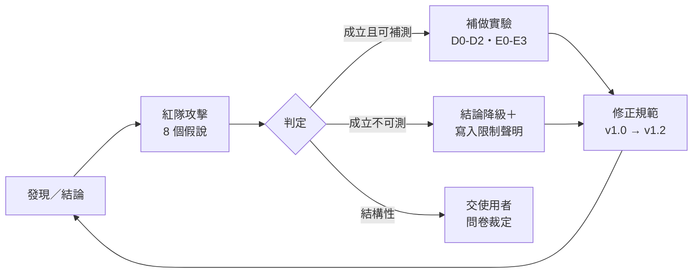
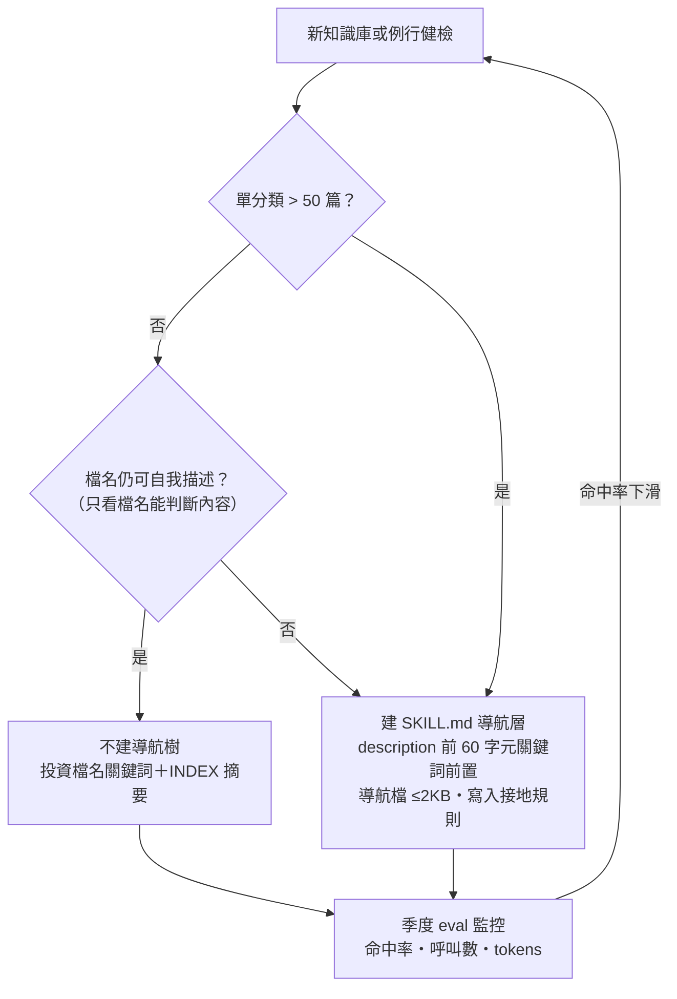

# 個人知識庫的導航層何時才有價值？——以 SKILL.md 治理 Markdown 知識庫的小規模實證研究

**作者**：swchen44 ＋ Claude（Fable 5）
**日期**：2026-08-18
**類型**：實證研究報告（單一受試知識庫、n=1 實驗，供內部決策用）

---

## 摘要（Abstract）

大型語言模型代理（LLM agent）查詢個人 Markdown 知識庫時，「預先編譯的導航層（SKILL.md／index 路由）」是否優於「裸奔式自由探索」，既有文獻僅在數千篇規模驗證過（Corpus2Skill，6,221 篇）。本研究在一個 141 篇的真實個人知識庫上抽取 30 篇子集，以 10 題三型態查詢（事實／綜合／跨域）對三組條件（A 裸奔、B 手工導航樹、C 同樹換 Sonnet 模型）執行 30 次 QA 實驗，並以三輪防禦性驗證（先驗基線、context 隔離探測、磁碟可及性探測、改寫查詢、不可回答題、沙箱硬隔離）檢驗效度。主要發現：（1）30 篇規模下三組正確率同為 10/10，導航層對正確率零貢獻——**描述式檔名本身就是最有效的索引**；（2）導航存在實測可見的固定成本（事實型查詢 +4k tokens「導航稅」），僅在跨域大範圍查詢開始回本（−25% tokens）；（3）換用低價模型正確率不變（+18% tokens），支持「表現由樹決定、不由導航者決定」假說；（4）代理在最強誘導下仍零幻覺，且能誠實回答「知識庫沒有」；（5）subagent 為「context 隔離但磁碟可及」，macOS 以 `sandbox-exec` 可達成硬隔離。研究產出一份 25 條、硬/軟分級、全條款可機器稽核的知識庫治理規範（v1.2），並經 8 項紅隊攻擊與兩輪補充實驗迭代。

**關鍵詞**：知識庫治理、agent 導航、progressive disclosure、SKILL.md、檢索評估、紅隊驗證

---

## 關鍵洞察（Key Insights）

- **檔名是第一檢索面**：30 篇規模下三組正確率同為 10/10，導航樹零貢獻——描述式檔名＋frontmatter 已構成充分索引，是投資報酬率最高的治理標的。參見 [[2026-08-14-CLAUDE-CODE-SKILL-BUDGET-MECHANISM-AND-REDUCTION-FLOW]] 的 description 預算研究。
- **導航稅實測存在**：事實型查詢多付約 4k tokens（讀 SKILL.md＋index 的固定成本）；僅跨域查詢回本（−25% tokens／−28% 耗時）——導航層應**閾值觸發**而非預先建置。
- **表現由樹決定、不由導航者決定**：Sonnet 與 Fable 正確率相同（+18% tokens），複現 Corpus2Skill 的 serving-LLM 消融——KB 問答可放心用低價模型。
- **零幻覺、誠實拒答**：連「corpus 內躺著 Codex 1024」的最強誘導都沒有張冠李戴；但**證無比證有貴 3 倍**（14 次呼叫 vs 3–9 次）。
- **隔離方法論**：subagent 為「context 隔離但磁碟可及」；指示級隔離的失效模式是「列舉輸出的被動可見性」而非違令——可靠做法＝物理分離＋transcript 稽核＋（嚴格時）sandbox-exec。

## 1. 緒論（Introduction)

### 1.1 研究問題

個人知識庫（Obsidian 式 Markdown 庫）要讓 LLM agent 高效查詢，社群存在兩派做法：把知識做成 skill（入口 SKILL.md ＋ references 漸進揭露）或讓 agent 直接在檔案系統裸奔探索。本研究回答三個具體問題：

- **RQ1**：在目前規模（~30–141 篇）下，手工導航層能否提升查詢正確率或效率？
- **RQ2**：導航式查詢對模型能力的依賴程度——換低價模型會掉多少？
- **RQ3**：以 subagent 執行 QA 評測時，實驗隔離性（session 對話、磁碟、先驗知識）能否成立？

### 1.2 動機

本研究起因於一連串機制分析：Claude Code 的 skill 清單有 1% context 預算與描述截斷機制（實測 200K context＋100 skills 時每筆描述僅存活約 60 字元），促使我們研究「知識放進 skill」的正確顆粒度；Corpus2Skill（Sun et al., 2026）證明在 6,221 篇企業語料上「導航勝於檢索」，但同時警告小語料與平面可辨識語料上平面檢索仍佔優——**本知識庫恰好落在未被驗證的小規模區間**。

### 1.3 貢獻

1. 首個在**個人規模**（30 篇）中文知識庫上的導航 vs 裸奔對照實驗，含完整成本量測。
2. 一套**防禦性驗證方法論**：先驗基線（D0）、context 隔離探測（D1）、磁碟可及性探測（D2）、改寫查詢（E1）、不可回答題（E2）、沙箱硬隔離配方（E0）。
3. 一份經紅隊迭代、硬/軟分級、可機器稽核的**知識庫治理規範 v1.2**（25 條）。

---

## 2. 相關工作（Related Work）

**導航式檢索**。Corpus2Skill（arXiv:2604.14572）把語料編譯為 SKILL.md／INDEX.md 階層樹，agent 以 2–3 跳導航取代 embedding 檢索，在 WixQA 上全指標領先（F1 0.456、幻覺 4.5% vs Agentic RAG 50%），但 10 個資料集中輸掉 3 個開放域／同質表格語料；其消融實驗顯示 serving 模型從 Sonnet 換 Haiku 保留 92% F1——本研究的 RQ2 即檢驗此結論的可遷移性。層級檢索另見 AnyTool（arXiv:2402.04253）與 RAPTOR。

**顆粒度研究**。Chunking 文獻指出顆粒度無普適最優解：事實型查詢偏好 ~128 tokens 小塊、聚合後不敏感（arXiv:2606.00881）；500 字元塊取得 Hit Rate 0.920 峰值（Knowledge-Based Systems, 2025）；語意分塊的計算成本換不到穩定增益；Mix-of-Granularity（arXiv:2406.00456）以 router 動態選粒度。

**Skill 機制與治理**。Anthropic 官方最佳實踐給出 SKILL.md <500 行、references 一層深、>100 行加 TOC 等規則，並示範知識庫型 skill（BI 路由表＋grep 提示）。跨工具對照：Claude Code 用 1% 彈性預算＋降級光譜、Codex 用硬上限（description ≤1,024）＋顯式開關、DeepSeek dsh 用 500 字元單筆上限＋整份替換 catalog 且明文要求 "Load all applicable skills"。Vercel 的 agent eval（AGENTS.md 100% vs Skills 53%）提供「被動常駐索引優於按需觸發」的反方證據。OKF v0.1（Google, 2026）把 LLM-wiki 模式標準化為 frontmatter＋index.md＋log.md 目錄格式，本知識庫天然符合八成。

---

## 3. 方法（Methodology）

### 3.1 研究流程


### 3.2 實驗設計



**語料**：從 141 篇真實知識庫抽 30 篇，涵蓋 Corpus2Skill 界定的三種語料型態（單領域連貫／主題較雜／跨域小分類）。**導航樹**：手工撰寫，遵循官方規則——SKILL.md 路由表＋接地規則，導航檔全部 ≤2KB（實測 1,023–2,004 bytes）。**執行**：每 run 一個獨立 subagent（fresh context），同組 10 題並行；量測取自 harness 回報的 usage 欄位。**評分**：對照預先定義的 gold 筆記集，答案正確性 0/0.5/1 三級。

### 3.3 各方法的檔案結構實貌（File Layout）

為便於想像各組實際「看到」的世界，以下列出實驗環境與各方法的目錄樹及內容節錄。

**（a）實驗環境總覽**

```
scratchpad/
├── kb-exp/                      ← 受測樹（agent 可及範圍，保持乾淨）
│   ├── corpus/                  ← 30 篇語料（三組共用的知識本體，884KB）
│   │   ├── CodeAnalysis/  (12 篇)
│   │   ├── AI/            (12 篇)
│   │   └── Career/         (6 篇)
│   └── tree-B/                  ← B／C 組專用的手工導航層
│       ├── SKILL.md             (1,625 B)
│       └── index/
│           ├── code-analysis.md (1,812 B)
│           ├── ai-engineering.md(2,004 B)
│           └── career.md        (1,023 B)
└── kb-exp-out/                  ← 產出樹（答案與報告，與受測樹物理分離）
    ├── results/                 ← arm-A/B/C.md、summary.md、red-team.md
    ├── governance-prompt.md     ← 治理規範 v1.2（26 條）
    └── paper-report.md          ← 本報告
```

> **方法論註記（攻擊 #9，由審查者發現）**：初版佈局把 `results/` 與 corpus 放在同一棵 kb-exp 樹下，且 B/C 組指示僅禁止「讀 kb-exp 以外」——構成真實洩漏通道（B 組開跑時 A 組答案檔已存在）。事後稽核全部 43 個 subagent transcript：**tool_use 輸入零讀取**（僅 1 個 agent 在檔案列表輸出中被動看見 `arm-B.md` 檔名，未開啟），實際污染=0；但通道成立，故改為上述平行目錄佈局並增訂規範 G26：**實驗產出絕不可與受測 corpus 同樹**，嚴格重跑另加 `sandbox-exec` deny。

**（b）A 組（裸奔）所見**——agent 只拿到 `corpus/` 路徑，檔名就是全部的索引：

```
corpus/
├── CodeAnalysis/
│   ├── 2026-05-20-CODEX-HOOK-AND-SKILLS-PARAMETERS-DEEP-DIVE.md
│   ├── 2026-04-13-CLAUDE-CODE-TELEMETRY-OTEL-SOURCE-DEEP-DIVE.md
│   ├── 2026-04-07-GSTACK-AI-AGENT-EVAL-ARCHITECTURE.md
│   └── …
├── AI/
│   ├── 2026-01-27-VERCEL-AGENTS-MD-OUTPERFORMS-SKILLS-IN-AGENT-EVALS.md
│   ├── 2026-04-25-CLAUDE-SKILLS-PLAYBOOK-DESCRIPTION-SUBAGENT-DEBUG-PROMPTS.md
│   └── …
└── Career/
    ├── 2026-03-30-STANFORD-STUDY-22YO-EMPLOYMENT-DROPS-20PCT-750-CFOS-AI-LAYOFFS-9X.md
    └── …
```

典型查詢軌跡（2–3 次工具呼叫）：`ls corpus/*/` 掃檔名 → 檔名直達（如查 telemetry 指標數，檔名 `…TELEMETRY-OTEL…` 已寫在臉上）→ 讀本文作答。發現 1（天花板效應）的機制在此一目了然：**檔名把答案位置寫在臉上**。

**（c）B／C 組（導航）所見**——先拿到 `tree-B/SKILL.md`，逐層下鑽：

SKILL.md 節錄（OKF 式 frontmatter＋路由表＋接地規則）：

```markdown
---
type: skill
name: kb-navigator
description: 查詢個人知識庫時使用——涵蓋 Claude Code/Codex 原始碼分析、
  AI agent/skill/CLAUDE.md 工程實踐、工程師職涯策略三大領域。…
---
| 領域 | 何時查 | Index 檔 |
|------|--------|----------|
| 程式碼分析 | Claude Code／Codex 內部機制：hook、telemetry、token 成本… | index/code-analysis.md |
| AI 工程   | skill 怎麼寫、CLAUDE.md 最佳實踐、agent harness…        | index/ai-engineering.md |
| 職涯      | 工程師定位、AI 對就業的衝擊、升遷卡關…                  | index/career.md |

3. 接地規則：答案中的每個事實必須出自筆記本文，不可只憑 index 摘要作答。
```

index 檔的一行（檔名＋特徵詞摘要＝路由單元）：

```markdown
| 2026-04-13-CLAUDE-CODE-TELEMETRY-OTEL-SOURCE-DEEP-DIVE.md | 三層 OTel 架構、指標數量與清單、Span 生命週期、團隊部署 |
```

典型查詢軌跡（3–4 次呼叫）：SKILL.md → 領域 index → 本文——比 A 組**多一跳**，即「導航稅」的來源。

**（d）對照：Corpus2Skill 機器編譯樹**（依論文與官方 repo，本輪未實跑）：

```
c2s_compiled/
├── .claude/skills/
│   ├── <cluster-1-label>/        ← embedding＋K-means 自動分群命名
│   │   ├── SKILL.md              ← 路由導向的群摘要
│   │   ├── INDEX.md              ← 每檔 ~20 個文件列、<2KB
│   │   └── <subgroup>/INDEX.md   ← 深度 O(log_p N)
│   └── …（root 群數 ≤ max-top 8）
├── documents.json                ← 全文庫（get_document 工具取用）
└── entity_index.json             ← 實體 → skill 路徑映射（橫向跳轉）
```

與手工樹（c）的三個差異：樹由分群**自動長出**（非人工領域分類）；文件本體離開檔案系統進 `documents.json`；多一層 entity 橫向跳轉。

**（e）治理規範 v1.2 建議的真實知識庫形貌**（141 篇現況）：

```
personal-kb-repo/
├── README.md                ← Recent Notes 清單
├── LOG.md                   ← append-only ingest 日誌
├── AI/                      (67 篇)
│   ├── INDEX.md             ← 路由層：| [[檔名]] | 前60字含獨有識別碼的摘要 | 日期 |
│   ├── 2026-04-25-CLAUDE-SKILLS-PLAYBOOK-DESCRIPTION-SUBAGENT-DEBUG-PROMPTS.md
│   └── assets/2026-04-25-…/ ← 圖片附件
├── CodeAnalysis/            (38 篇) ＋ INDEX.md
├── Career/                  (7 篇)  ＋ INDEX.md
├── …其他分類
└── skills/kb-create/        ← 工具備份（SKILL.md＋validate-mermaid 腳本）

（依規範 E16-17：閾值觸發前不新增 kb-navigator 導航 skill；
 現階段治理投資集中在檔名關鍵詞與 INDEX 摘要品質）
```

### 3.4 治理規範的形成

主實驗結果 → 規範 v1.0 → 紅隊 8 攻擊 → v1.1（硬/軟分級、F 節 shell 化、G 節 eval 規則）→ D/E 補充實驗 → v1.2（G23 先驗過濾、G24-25 隔離配方）。

---

## 4. 結果（Results）

### 4.1 主實驗（RQ1、RQ2）

| 指標 | A 裸奔 | B 導航(Fable) | C 導航(Sonnet) |
|------|--------|---------------|----------------|
| 正確率 | **10/10** | **10/10** | **10/10** |
| gold 引用完整命中 | **10/10** | 8/10 | 7/10 |
| 總 tokens | 527,506 | 508,631 | 599,087 |
| 事實型平均 tokens／耗時 | 26.2k／17.9s | 30.1k／18.9s | 39.7k／20.5s |
| 綜合型平均 tokens／耗時 | 73.1k／59.8s | 70.4k／59.9s | 78.1k／69.0s |
| 跨域型平均 tokens／耗時 | 65.2k／78.0s | **53.3k／61.5s** | 63.9k／68.0s |

**發現 1（天花板效應）**：三組正確率同為滿分——30 篇規模、描述式檔名健全時，**檔名＋frontmatter 已構成充分索引**，導航層對正確率零貢獻。
**發現 2（導航稅）**：事實型查詢 B 比 A 平均多付約 4k tokens（讀 SKILL.md＋index 的固定成本）。
**發現 3（回本區間）**：跨域查詢 X1 導航省 25% tokens、快 28%；查詢範圍越廣，免全庫掃描的價值越大。
**發現 4（導航窄化）**：B/C 各在 1–2 題漏抓 gold 引用而 A 全中——照 index 路由犧牲了暴力掃描的「意外發現」，index 描述品質構成覆蓋率上限。
**發現 5（模型可換性，RQ2）**：Sonnet 正確率不變、個別題品質更高（S2），代價僅 +17.8% tokens——與 Corpus2Skill 的 serving-LLM 消融一致：**表現由樹決定，不由導航者決定**。

### 4.2 紅隊與效度驗證（RQ3）

紅隊迭代閉環：



| 驗證實驗 | 結果 | 效度含意 |
|---------|------|---------|
| D0 先驗基線（無工具作答） | Sonnet 嚴格 0/10；Fable 約 1 題全對（公開研究類） | 7–8 題 KB 特有事實必須靠檢索；公開新聞型題目（F4）作廢級污染，催生規範 G23 |
| D1 context 隔離探測 | 3 題對話專屬事實全答「沒有此資訊」 | subagent 無被動污染；發現 MEMORY.md 索引為次要注入通道 |
| D2 磁碟可及性探測 | 成功讀取主 session transcript（5.1MB） | 隔離僅在 context 層——「context 隔離但磁碟可及」 |
| E0 沙箱硬隔離 | macOS 無 bwrap；`sandbox-exec` 拒讀 transcript、corpus 照常可讀 | 硬隔離配方確立（規範 G25） |
| E1 改寫查詢 ×4（避開檔名詞彙） | 4/4 全對、成本相當 | 「詞彙偏差」攻擊降級：agent 的語意推理能跨越詞彙鴻溝 |
| E2 不可回答題 ×4（含最強誘導） | 4/4 誠實答「知識庫沒有」、零幻覺 | 幻覺抵抗通過；新觀察：**證無比證有貴 3 倍**（14 次呼叫 vs 3–9 次） |
| E3 稽核腳本實跑（141 篇全庫） | 抓到檔名不合規 6 篇、超 400 行 8 篇（最大 1,716 行）、type 全缺 | 規範可執行性證實 |

8 項紅隊攻擊最終狀態：6 項經規範修正＋3 項實驗補測通過；1 項（規模外推）排入下輪；1 項（評分者偏差）為結構性、交由使用者問卷裁定。

### 4.3 成本

主實驗 30 runs 約 1.64M subagent tokens；D/E 驗證 13 runs 約 0.35M；合計約 2.0M tokens、單日完成。

---

## 5. 討論（Discussion）

### 5.1 導航層的決策準則

實驗支持「**閾值觸發、不預先建樹**」策略：



「50 篇」為推測閾值（非實測），依 G22 隨季度 eval 重校準。與 Corpus2Skill 的規模結論拼起來構成完整圖景：**小而可辨識 → 平面探索；大或不可辨識 → 導航**；本研究補上了小端的實證。

### 5.2 對知識庫作者的可操作結論

1. **檔名是第一檢索面**：日期＋全大寫＋專名＋關鍵詞＋代表性數字，是本實驗中投資報酬率最高的單一因素。
2. **INDEX 摘要前 60 字元放獨有識別碼**（數字、專名）——導航窄化的唯一防線。
3. **KB 問答可用低價模型**，把預算花在樹（索引品質）而非導航者。
4. eval 題目須先過「無工具先驗基線」過濾，否則公開知識型題目會虛報檢索能力。

### 5.3 隔離方法論

subagent 評測的隔離模型為「context 隔離＋磁碟可及＋指示約束」。日常 eval 以「引用接地檢查」即可；發表級實驗須 OS 層 sandbox（macOS：`sandbox-exec` deny file-read profile；Linux：bwrap）。

---

## 6. 限制（Threats to Validity）

1. **統計檢定力**：每格 n=1、共 10 題；所有 token/耗時差異為方向性觀察而非統計結論。
2. **評分者偏差（結構性）**：出題、建樹、評分同源；E1 的改寫查詢仍由同一作者撰寫。緩解中、未消除。
3. **規模外推**：結論限於 ≤141 篇、檔名健全的中文個人知識庫；不可外推到大語料（下輪以 Corpus2Skill headless adapter 驗證）。
4. **併發計時污染**：每組 10 agents 並行，絕對耗時不可比，組間相對比較保留方向性參考。
5. **題目型態覆蓋**：僅測「可回答檢索型＋不可回答型」；多跳推理與時效衝突（新舊筆記矛盾）未測。
6. **同樹污染通道（攻擊 #9，由審查者發現）**：QA 執行採指示級隔離而非 sandbox，初版佈局中答案檔與 corpus 同樹，洩漏通道成立。事後 transcript 稽核證實零實際讀取（污染=0），但教訓明確：**指示級隔離的失效模式不是 agent 違令，而是列舉輸出的被動可見性**——可靠做法是事前物理分離＋事後 transcript 稽核，發表級再加 OS sandbox。已修正佈局（§3.3a）並增訂規範 G26。

## 7. 未來工作（Future Work）

（1）Corpus2Skill 官方管線實跑：以 `claude -p --output-format json` headless adapter 免 API key 編譯機器樹，與手工樹對照（已規劃）；（2）大規模複驗：141 篇全庫＋合成擴充語料，實測 50 篇閾值；（3）多跳與矛盾偵測題型；（4）planted-fact 盲測消除評分者偏差；（5）季度 eval 管線自動化（規範 G21）。

## 8. 結論（Conclusion）

在 30 篇規模的真實個人知識庫上，導航層對查詢正確率零貢獻、對效率貢獻僅限跨域查詢，而描述式檔名＋索引摘要是最高投資報酬率的治理標的；模型可換性成立，幻覺抵抗與誠實拒答在引用接地約束下全數通過。研究同時確立了 subagent 評測的隔離邊界與硬隔離配方，並將全部發現固化為 25 條可機器稽核的治理規範。**建議：現階段不建導航樹，把治理投資放在命名層與索引層，以閾值觸發原則預留規模化路徑。**

---

## 我的心得（My Takeaways）

1. **反直覺的主結論**：花一下午想驗證「導航樹有多好」，結果證明「現階段不需要導航樹」——負結果比正結果更有行動價值，直接省掉一項基礎建設投資。
2. **治理投資排序被實驗改寫**：原以為重點是 SKILL.md 設計，實驗後排序變成 檔名關鍵詞 > INDEX 摘要前 60 字 > frontmatter type > 導航層（閾值觸發才做）。
3. **紅隊要真的補實驗，不能只寫對策**：8 個攻擊中 3 個用補充實驗實測後改變了判定（詞彙偏差從「最大威脅」降為「已緩解」）；審查者（使用者）親自抓到第 9 個攻擊（同樹污染），證明評分者偏差必須靠外部視角。
4. **方法論資產比結論長壽**：n=1 的數字會過期，但「先驗基線過濾出題」「transcript 稽核隔離」「sandbox-exec 配方」這三個方法可重複用於未來所有 agent 評測。

---

## 知識層次分析（Bloom's Taxonomy Analysis)

> 以下從五個認知層次對本篇內容進行結構化分析，協助從記憶到評估逐層深化理解。

| 認知層次 | 核心目的 | 對本文的具體應用 |
|---------|---------|--------------|
| **記憶（被動）** | 確認資訊存在，確立基礎知識 | ① 三組正確率 10/10（天花板效應）② 導航稅 ~4k tokens/事實題 ③ 跨域省 25% ④ Sonnet +18% tokens 正確率不變 ⑤ 治理規範 26 條硬/軟分級 ⑥ sandbox-exec deny 配方 |
| **理解（半被動）** | 串聯知識點，掌握核心邏輯 | 檢索價值鏈是三層遞進：命名層（免費、隨檔案存在）→ 索引層（一行成本、路由品質）→ 導航層（固定稅、規模才回本）；規模與檔名可辨識性共同決定該停在哪一層 |
| **分析（主動）** | 檢驗論點、拆解假設 | 天花板效應部分源自出題-建庫同源（評分者偏差）；n=1 使所有數字僅方向性有效；「50 篇閾值」是推測值——本文最弱的一環是外部效度，不是內部機制 |
| **應用（主動）** | 將理論轉為行動 | ① 立即修 6 個不合規檔名、補 141 篇的 type 欄位 ② 新筆記入庫跑「改寫查詢」驗證 ③ 拆分 8 篇超過 400 行的筆記 ④ 未來 agent 評測套用先驗基線＋transcript 稽核 |
| **評估（主動）** | 判斷方案優劣與權衡 | 不建樹 vs 建樹：現階段不建（實證）；與 Corpus2Skill（6,221 篇建樹勝）、Vercel（被動索引勝按需觸發）三角化後，結論是「規模與可辨識性決定形態」而非陣營之爭 |

### 分析型追問（Socratic Follow-up）

- **澄清**：「檔名可自我描述」的邊界怎麼精確定義？截圖庫、代號專案、多語混雜庫在哪一點失效？
- **假設**：實驗假設查詢者「知道知識庫大概有什麼」——完全陌生的第三方查詢者（或另一個 agent）還會有同樣命中率嗎？
- **證據**：「導航在跨域題回本」只有 2 題樣本——X 型查詢的母體分布是什麼？日常查詢有多少比例是跨域的？
- **觀點**：反對者可說「你的檔名文化本來就異常好，結論對命名隨性的庫毫無意義」——這其實是把結論反過來讀：治理的重點正是把命名文化變好。
- **後果**：若 12 個月後庫長到 300 篇仍不建樹，最先劣化的會是哪個指標？（預測：跨域查詢耗時，因為它是規模敏感度最高的型態）

### 方案批判三問（Critical Evaluation）

1. **最大的風險是什麼？** — 把 n=1 的數字（4k 導航稅、50 篇閾值）當成永久真理寫死在流程裡；規範 G22 的定期重校準是唯一保險。
2. **什麼情況下會失敗？** — ① 檔名文化不同的知識庫（隨性命名、非描述式）——A 組優勢直接消失；② 非中文/混語庫的 grep 命中率變化未測；③ 查詢者與建庫者不同人時，詞彙鴻溝可能遠大於 E1 測到的程度。
3. **有沒有更好的替代方案？** — ① Corpus2Skill 自動編譯（下輪實測，免手工維護樹）；② 等 Claude Code 官方 skill search／Tool Search 動態檢索成熟，整個問題可能被平台層吃掉；③ embedding 檢索層（Obsidian MCP 語意搜尋）適合詞彙鴻溝嚴重的場景。

## 待補充（Open Questions）

- 導航層的真實觸發閾值在哪裡？50 篇是推測值，需要 141 篇全庫＋合成擴充語料的複驗（搜尋：agent navigation threshold corpus size retrieval crossover）
- 「他人出題」情境下的詞彙偏差量化——出題者≠建庫者時命中率掉多少？（搜尋：inter-annotator query paraphrase retrieval eval）
- 多跳推理與新舊筆記矛盾（時效衝突）時 agent 的行為未測（搜尋：multi-hop KB QA temporal conflict resolution notes）
- Corpus2Skill 機器樹 vs 手工樹在相同 harness 下的品質差距（已排入下輪：headless adapter 免 API key 編譯）
- `sandbox-exec` 已被 Apple 標記 deprecated，長期的 agent 沙箱替代方案是什麼？（搜尋：macOS Endpoint Security sandbox agent containerization）
- 導航窄化能否用 entity index 橫向跳轉補償（Corpus2Skill 的 `## Related skills` 機制）而不加預算？（搜尋：entity index cross-branch navigation agent）

## 相關連結（Related）

- [[2026-08-14-CLAUDE-CODE-SKILL-BUDGET-MECHANISM-AND-REDUCTION-FLOW]] — 本研究的直接前篇：skill 清單 1% 預算與 description 截斷機制，引出「知識放進 skill 的顆粒度」問題
- [[2026-02-12-EVALUATING-AGENTS-MD-CONTEXT-FILES-HELPFUL-FOR-CODING-AGENTS]] — 同類型：context 檔案對 coding agent 幫助的實證評估
- [[2026-01-27-VERCEL-AGENTS-MD-OUTPERFORMS-SKILLS-IN-AGENT-EVALS]] — 「被動索引 vs 按需觸發」的關鍵反方證據，本研究 gold 題目來源之一
- [[2026-04-07-GSTACK-AI-AGENT-EVAL-ARCHITECTURE]] — 本研究 eval 方法論的參考（三層金字塔、planted-bug ground truth、KPI 設計）
- [[2026-05-20-CODEX-HOOK-AND-SKILLS-PARAMETERS-DEEP-DIVE]] — gold 題目來源＋跨工具 skill 機制對照的一手資料
- [[2026-04-09-AI-ONE-PERSON-COMPANY-KARPATHY-OBSIDIAN-KB-OPENCLI]] — 知識庫「憲法＋健檢」概念的出處，本研究治理規範的思想前身
- [[2026-04-25-CLAUDE-SKILLS-PLAYBOOK-DESCRIPTION-SUBAGENT-DEBUG-PROMPTS]] — description 撰寫規則（前置關鍵詞、does+when），規範 E18 的依據
- [[2026-03-07-CLAUDE-SKILL-EVAL-FRAMEWORK-3-SKILLS-ONE-AFTERNOON-REAL-DATA]] — 「一下午實測」的 skill eval 先例，本研究的方法論同路人


## 參考文獻（References）

1. Sun, Y., Wei, P., Hsieh, L. B. (2026). *Don't Retrieve, Navigate: Distilling Enterprise Knowledge into Navigable Agent Skills for QA and RAG*. arXiv:2604.14572.
2. Du, Y. et al. (2024). *AnyTool: Self-Reflective, Hierarchical Agents for Large-Scale API Calls*. arXiv:2402.04253.
3. Zhong, Z. et al. (2024). *Mix-of-Granularity: Optimize the Chunking Granularity for RAG*. arXiv:2406.00456.
4. *Chunking Methods on RAG — Effectiveness Evaluation Against Computational Cost*. arXiv:2606.00881.
5. Anthropic. *Agent Skills Best Practices*（skill 撰寫官方指南）；*Claude Code Skills 文件*. code.claude.com/docs/en/skills.
6. Google Cloud (2026). *How the Open Knowledge Format Can Improve Data Sharing*（OKF v0.1）.
7. Gao, J. / Vercel (2026). *AGENTS.md Outperforms Skills in Agent Evals*（知識庫筆記 2026-01-27）.
8. 本知識庫筆記：2026-08-14 Claude Code Skill 清單預算解析；2026-05-20 Codex Hook/Skills 參數；2026-04-07 gstack eval 架構。
9. 實驗原始資料：`kb-exp/results/`（arm-A/B/C、summary、red-team 含 D/E 系列）、`kb-exp/governance-prompt.md` v1.2、`kb-exp/tree-B/`。
