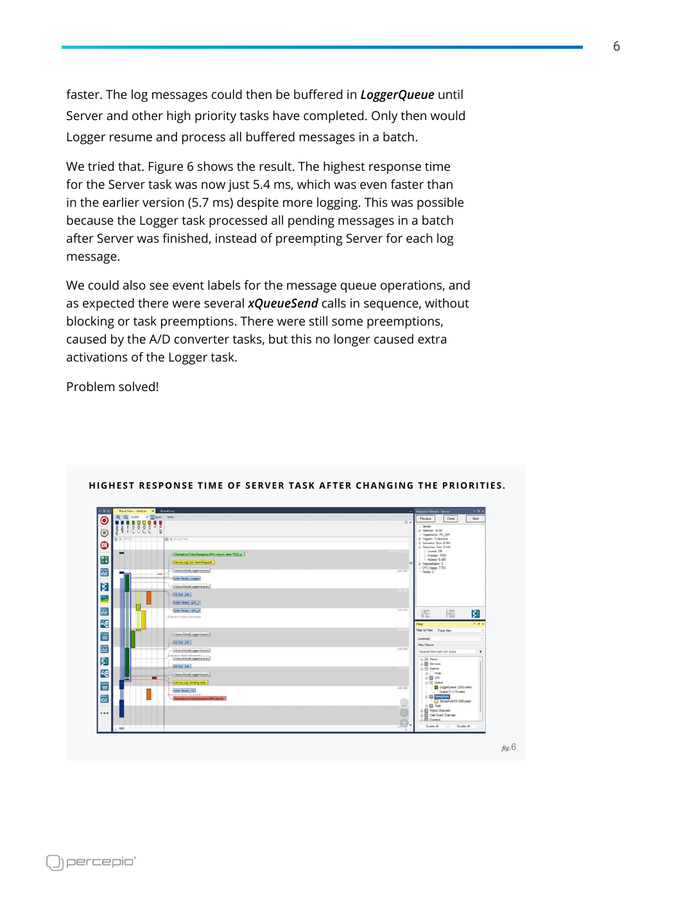
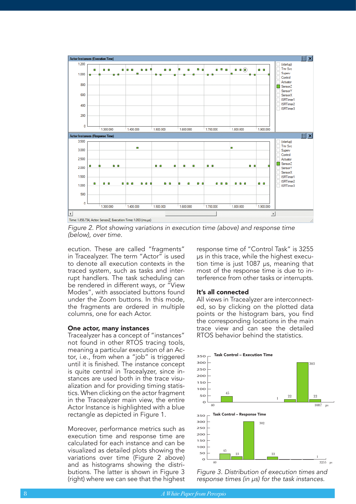
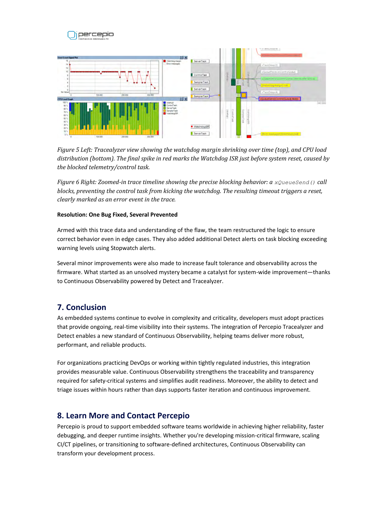
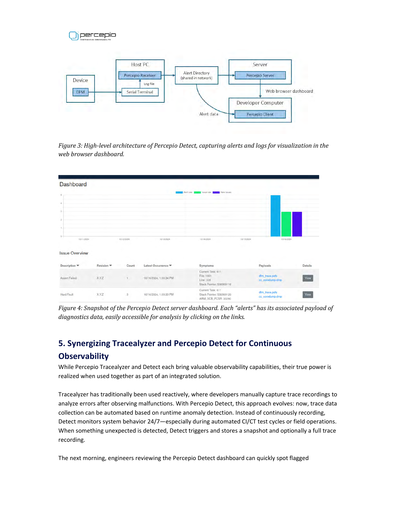
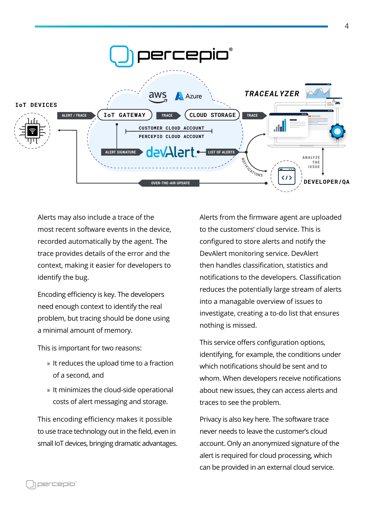
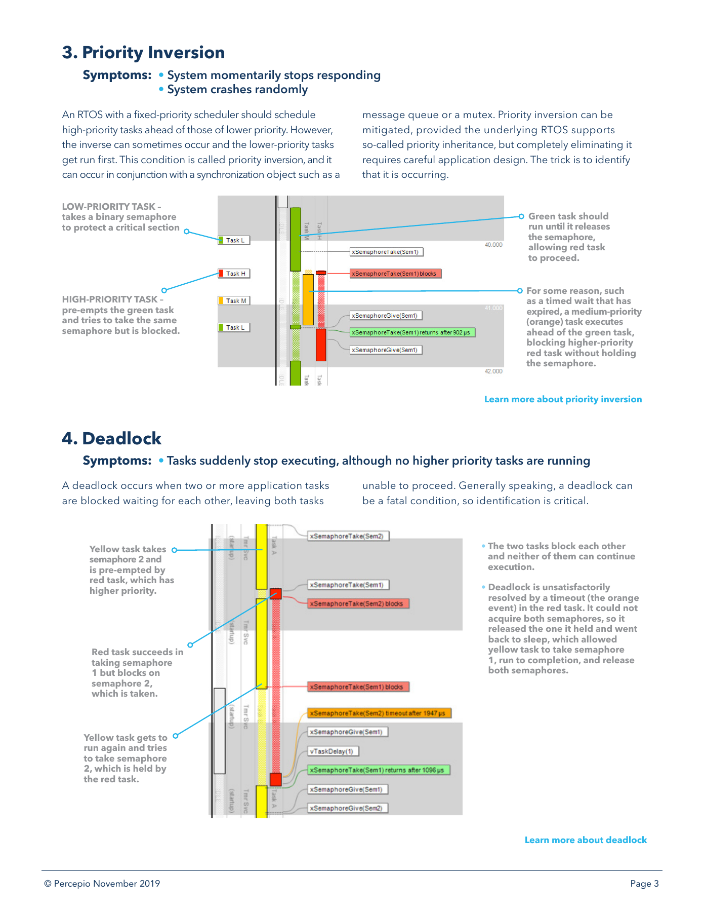
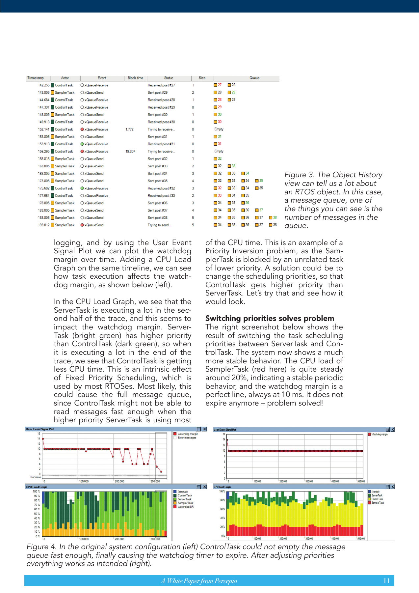
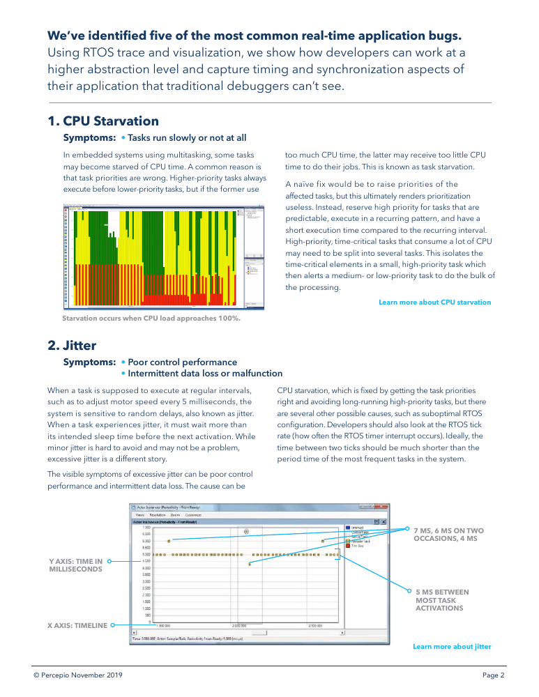
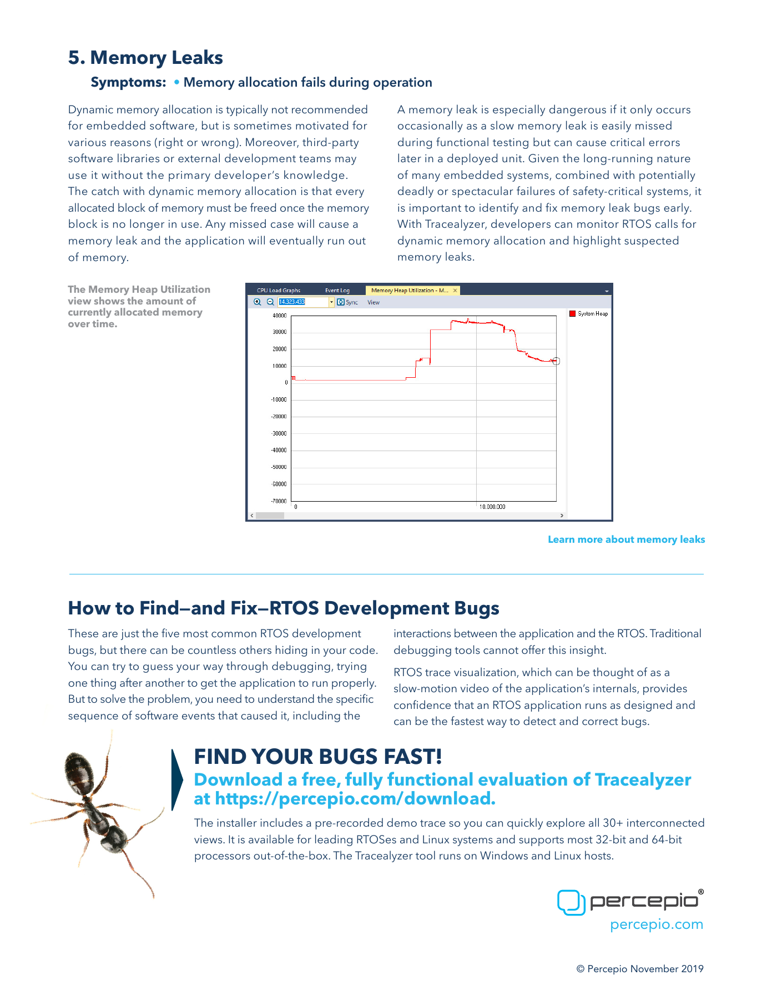
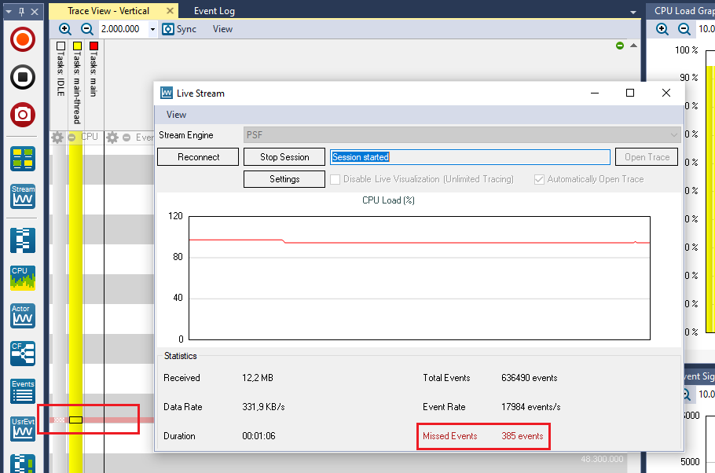

# FreeRTOS／RISC-V Observability 學習與研究報告

研究日期：2026-10-03  
研究範圍：本資料夾的 TraceRecorder、DFM、SDK／SWO demos、8 份 PDF、使用者提供的 YouTube 英文字幕，以及官方公開文件。  
版本基準：`percepio/TraceRecorder` 檔頭標示 v4.12.0；`percepio/DFM` 標示 v2.1.0。這是本地檔案版本，沒有宣稱是目前最新正式版。

> **建議：開發時用事件追蹤還原時間線；長期運作時保留每秒摘要與 RAM 環形 trace，異常才保存／上傳。UART 可以使用，但需要 binary、緩衝與批次傳輸。CPU overhead 必須按事件率與板上量測判斷。**

本報告把證據分成四種：**本地程式碼已確認、官方／PDF 描述、實際編譯／host 執行驗證、工程試算與建議**。試算與桌面模擬沒有被當成你們板子的實測。

## 0. 需求對照與閱讀方式

本表對照使用者明確提出的問題；第 19 節另外列出建議研究題目，不把補充建議視為既定產品需求。

| 原始研究問題 | 報告位置 |
|---|---|
| 每秒系統做了什麼、可以觀測哪些資料？ | [第 1、4、5 節](#section-1) |
| 資料夾在做什麼、提供哪些功能？ | [第 2 節](#section-2) |
| 想解決什麼問題、真的解決了嗎？ | [第 3、15 節](#section-3) |
| 原理是什麼？ | [第 4 節](#section-4) |
| 資料率、介面、bandwidth 是多少？ | [第 5～7、18 節](#section-5) |
| UART 能不能用、有什麼經驗？ | [第 7 節；原廠 UART 案例與工程試算分開標示](#section-7) |
| CPU loading 約多少、單一事件／行為增加多少？ | [第 8 節；條件試算與未完成板測分開標示](#section-8) |
| Code size、RAM 與其他效能代價？ | [第 8～11 節；第 9 節有可重現 RV32 object 編譯](#section-8) |
| 安裝、使用、SDK API？ | [第 12 節，含原始碼與官方 API 連結](#section-12) |
| SDK 如何 hook FreeRTOS、要不要修改 kernel source？ | [第 12.6 節，含巨集展開、建置路徑與需修改的檔案](#section-12) |
| 限制與 boundary？ | [第 1、10、11、13 節](#section-1) |
| 本地或雲端收集、有什麼不同、建議做法？ | [第 14、16、17 節](#section-14) |
| 可以動態裁剪嗎？ | [第 13 節；第 18 節補 host preview 的差異](#section-13) |
| 是否便宜、如何評估成本？ | [第 16 節；不填寫沒有來源的採購價格](#section-16) |
| 已下載 PDF 的文字與圖片有沒有用？ | [第 15 節，尤其第 15.4 節逐圖分析](#section-15) |
| YouTube 字幕有沒有幫助？ | [第 18 節，含時間點連結](#section-18) |
| 還有什麼主題值得研究？ | [第 19 節，含優先順序、方法與應產出證據](#section-19) |
| Markdown、Mermaid、圖片與後續內部研究 | [第 20 節；附來源版本、圖檔、可攜套件與比對方法](#section-20) |
| 哪些完成、哪些尚未驗證？ | [第 21 節](#section-21) |
| 交給有產品原始碼的內部 AI，還能完成哪些事、目的是什麼？ | [第 20.4 節與內部 AI 接續研究任務](內部AI-接續研究任務.md) |
| 有沒有案例？收集完 trace 後怎麼使用、判讀與確認改善？ | [第 22 節：案例操作手冊，含原圖、source 與桌面 demo 的實際輸出](#section-22) |
| 討論是否符合 MECE、有沒有重疊或缺口？ | [第 23 節：分類邊界、需求／待辦對照與完整性檢查](#section-23) |

想先知道「做完之後怎麼用」，讀第 22 節；評估可行性讀第 5～11 節；接入 SDK 讀第 12 節；交給內部 AI 讀第 20.4 節及交接任務檔。頁碼一律指 PDF 從第一頁起算的頁次，可能與文件內印刷頁碼不同。

## 1. 先回答：它能讓我們知道系統每秒做了什麼嗎？

可以觀測「何時是哪個 task 在執行、何時變成 ready／blocked、哪些 RTOS 操作與 ISR 介入、應用程式在哪些事件點做了什麼」。

**解析度可以細於一秒，但只涵蓋有 instrumentation 的事件。** 每秒 CPU 平均值能指出負載變化，詳細 trace 則能解釋同一秒內的排程、等待與延遲。只留每秒摘要，通常無法重建毫秒級的事件順序。

它不會自動記錄每條 RISC-V 指令、所有函式、所有變數，或所有硬體匯流排交易。需要這些資訊時，要補應用事件、硬體 trace、PMU／效能計數器或 core dump。

| 要回答的問題 | 可以使用的觀測資料 | 能力邊界 |
|---|---|---|
| CPU 被誰佔用？ | Task switch、ISR begin/end、CPU load | 沒有 ISR instrumentation 時，部分時間可能歸到被中斷的 task |
| 為什麼某個 task 很晚才跑？ | Ready、排程、queue／mutex／semaphore 事件 | 移除 ready 或相關同步事件會失去判讀依據 |
| 為什麼 request 很慢？ | Request ID、收到／開始／完成事件，搭配 RTOS trace | 業務 request 邊界需要自行記錄 |
| Queue 是否堆積？ | Queue send／receive／blocking／failure、物件歷史 | RTOS queue 記錄不等於完整 message payload |
| Heap 是否持續成長？ | 有 hooks 的 malloc／free、heap 狀態 | 自訂 allocator、其他記憶體池需自行接入 |
| Stack 是否夠用？ | Stack monitor／high-water mark | 填充值掃描屬歷史用量估測，無法涵蓋每種 stack corruption |
| 哪個函式最耗時？ | 自訂 interval／runnable／函式開始結束事件 | 沒加事件的函式不會自動列出 |
| 為什麼 crash？ | 異常前 trace，加暫存器／stack／core dump | 本地 CrashCatcher 範例是 Arm，需要 RISC-V port |
| Race condition 是否不存在？ | Trace 可協助發現可見的錯誤順序 | 無法以一次 trace 證明沒有競態或所有路徑都正確 |

依據：[FreeRTOS kernel hooks](../percepio/TraceRecorder/kernelports/FreeRTOS/include/trcKernelPort.h)、[ISR API](../percepio/TraceRecorder/include/trcISR.h)、[應用事件 API](../percepio/TraceRecorder/include/trcPrint.h)、[Stack monitor](../percepio/TraceRecorder/trcStackMonitor.c)。

## 2. 這個資料夾的資料分別在做什麼？

| 資料夾 | 內容與用途 | 對你們的適用性 |
|---|---|---|
| `percepio/TraceRecorder/` | 裝置端 C recorder；收集 timestamp、RTOS／ISR／自訂事件，寫入 buffer 或 streamport | FreeRTOS／RISC-V 的主要起點 |
| `percepio/DFM/` | DevAlert 裝置端程式碼；Alert type、Symptoms、Payload、儲存與傳送介面 | 異常回報可用；RISC-V crash／flash／網路介面需要整合 |
| `Tracealyzer-SDK-demos/` | 桌面與 IAR simulator 範例；展示自訂事件定義、XML、模擬 RTOS 行為 | 用來學習格式與擴充，無法代表你們的效能 |
| `Tracealyzer-STM32CubeIDE-SWO/` | STM32U5、Arm ITM／SWO、STLINK v3，再由 Python TCP bridge 接到 Tracealyzer | 架構概念可參考；SWO 硬體路徑不能直接用在 RISC-V |
| `data_from_web/whitepaper/` | 8 份排程、診斷、現場回報與 Continuous Observability 白皮書 | 解釋方法與案例；沒有你們板子的 benchmark |

資料夾裡沒有你們的完整 FreeRTOS 韌體、RISC-V BSP、linker map、板上 benchmark，也沒有完整 Tracealyzer 桌面軟體／Detect server／DevAlert 雲端服務。複製這些 source 並不會自動得到整套 observability 系統。

**TraceRecorder 與 Tracealyzer 的角色：** recorder 在裝置上建立二進位事件；Tracealyzer 在電腦上解析事件、計算統計並呈現時間線。Detect／DevAlert 再提供長期監測與異常回報流程。

~~~mermaid
flowchart LR
    subgraph Device["RISC-V 裝置"]
        App["應用程式 request、狀態、錯誤"]
        RTOS["FreeRTOS hooks 排程、queue、mutex"]
        ISR["ISR instrumentation"]
        Clock["時間戳來源 cycle 或獨立 timer"]
        Recorder["TraceRecorder"]
        Buffer["RAM buffer"]
        App --> Recorder
        RTOS --> Recorder
        ISR --> Recorder
        Clock --> Recorder
        Recorder --> Buffer
    end
    Buffer --> Local["本地收集端 UART、RTT、TCP 或 snapshot"]
    Local --> Viewer["Tracealyzer 時間線與統計"]
    Buffer --> Alert["異常觸發 保存 trace 與 dump"]
    Alert --> Store["本地儲存或自有後端"]
    Store --> Team["Detect／DevAlert 或自行建立的收集服務"]
    Team --> Viewer
~~~

圖中的異常保存、後端與自訂介面需要整合；本資料夾提供 recorder 與部分 port 範例。

## 3. 它想解決哪些問題？有沒有真的解決？

主要問題是：多工程式的「執行順序、等待關係、延遲來源」很難從 source 或 breakpoint 看出來。停住 CPU 也可能改變問題發生的條件。

| 問題 | 方法 | 評估 |
|---|---|---|
| Starvation／忙等 | CPU load 與排程時間線 | 能揭露高優先權 task 佔用與低優先權 task 延後 |
| Jitter／deadline miss | Ready、執行時間、回應時間、request interval | 能分析已捕捉到的延遲；需要定義 deadline |
| Priority inversion | 同步物件事件與 task 優先權／執行順序 | 能定位等待鏈；修正仍是韌體設計工作 |
| Deadlock／長時間 blocking | 物件歷史、task 活動、監測門檻 | 能協助發現；不保證自動辨識所有 deadlock |
| Memory leak | Allocation/free、heap 趨勢 | 有涵蓋 allocator 時可追蹤；未接入的分配不可見 |
| 偶發 crash／watchdog reset | 事件前史與 crash／reset 資料 | 有保存機制才有效；一般 RAM 在重啟／斷電時可能消失 |

**方法成立，但你們系統上的成效尚未驗證。** 本地 source 能證明事件收集、buffer、port、alert 等機制存在；PDF 案例提供供應商的使用經驗。這些證據無法代替你們的 workload、事件完整性、CPU overhead 與最差延遲驗收。

資料夾中的回應時間白皮書展示：Logger 的高優先權與頻繁喚醒增加 Server 的延遲。舊版最高回應約 5.7 ms，新版退化到約 7.5 ms；調整優先權與批次處理後約為 5.4 ms。工具協助找出設計問題；效能改善來自程式設計修正。見[該 PDF 第 3～6 頁](../data_from_web/whitepaper/Percepio-How-to-Visualize-Response-Times-in-FreeRToS-Whitepaper-final.pdf)。

## 4. 原理：一次軟體事件如何變成一筆 trace？

1. FreeRTOS hook、自訂 API 或 ISR instrumentation 呼叫 recorder。
2. Recorder 讀取時間戳，附加 event ID、序號與參數。
3. 進入 critical section，配置 buffer 空間、寫入並 commit 事件。
4. RingBuffer 留在 RAM；streamport 則直接或經背景 task 送出。
5. Host 使用物件名稱、事件定義與 timestamp 重建時間線。

本地 `trcEvent.c` 在建立事件時進入 critical section，commit 後才離開。**這是 CPU 成本與中斷延遲的重要來源。** 若自訂 write 直接等待 UART／網路，等待可能落在敏感路徑裡。

~~~mermaid
sequenceDiagram
    participant Work as Task 或 RTOS hook
    participant Rec as TraceRecorder
    participant Buf as RAM buffer
    participant Tx as 背景傳輸 task
    participant Host as 電腦
    Work->>Rec: 記錄 event ID 與參數
    Note over Rec: 短 critical section、時間戳
    Rec->>Buf: 寫入完整二進位事件
    Rec-->>Work: 返回，繼續原本工作
    Tx->>Buf: 取得已完成的資料區塊
    Tx->>Host: 批次送出或啟動 DMA
    Host->>Host: 保存、解析、計算統計
~~~

這張圖是建議的 buffered UART 整合流程，並非本資料夾已有完整 RISC-V UART driver。

**為什麼比一般 printf 輕？** recorder 可把 event ID、參數與格式資訊記下來，讓 host 完成顯示。固定／compact event 可降低字串處理；compact API 可能需要對應 ELF。一般 `xTracePrintF` 仍有格式掃描與資料編碼成本，無法把所有 logging 呼叫視為同一個耗時。

依據：[trcEvent.c](../percepio/TraceRecorder/trcEvent.c)、[trcPrint.c](../percepio/TraceRecorder/trcPrint.c)、[compact／fixed API 說明](../percepio/TraceRecorder/include/trcPrint.h)。

## 5. Observability 資料產生速率是多少？

### 5.1 單位先分清楚

- `KB/s` 在本報告的頻寬表採十進位：1 KB = 1,000 bytes。
- `KiB` 用於 RAM／編譯大小：1 KiB = 1,024 bytes。
- 1 byte = 8 bits。
- UART 8N1 每個 data byte 需要 10 個線路 bits，包含 start／stop bit。
- **事件 timestamp 解析度、事件產生速率、傳輸容量是三件不同的事。**

### 5.2 從本地事件格式計算

RV32、32-bit 參數下的固定事件：

~~~text
uint16 event ID       2 bytes
uint16 event count    2 bytes
uint32 timestamp     4 bytes
N 個 32-bit 參數      4 × N bytes

事件大小 = 8 + 4 × N bytes
~~~

| 參數數量 | 事件大小 |
|---:|---:|
| 0 | 8 bytes |
| 1 | 12 bytes |
| 2 | 16 bytes |
| 3 | 20 bytes |
| 4 | 24 bytes |
| 6 | 32 bytes |

字串、blob、自訂 payload、物件建立／名稱資訊可能更大。這裡的 16 bytes 是試算平均值，沒有代表所有事件。RV64 或不同 base type 需要重算。

依據：[trcEvent.h 中的事件結構](../percepio/TraceRecorder/include/trcEvent.h)、[trcTypes.h](../percepio/TraceRecorder/include/trcTypes.h)。

~~~text
資料率 R = 每秒事件數 E × 平均事件大小 S
多核資料率 = 各核心資料率總和 + 額外 metadata
~~~

| 事件率 | 假設平均大小 | Binary 資料率 | 純 payload bits | UART 8N1 最低線速 |
|---:|---:|---:|---:|---:|
| 1,000 events/s | 16 bytes | 16 KB/s | 128 kbit/s | 160 kbaud |
| 5,000 events/s | 16 bytes | 80 KB/s | 640 kbit/s | 800 kbaud |
| 10,000 events/s | 16 bytes | 160 KB/s | 1.28 Mbit/s | 1.6 Mbaud |
| 20,000 events/s | 16 bytes | 320 KB/s | 2.56 Mbit/s | 3.2 Mbaud |
| 50,000 events/s | 16 bytes | 800 KB/s | 6.4 Mbit/s | 8 Mbaud |

最低線速沒有留下封包、其他 console 資料、流量尖峰與接收端停頓的餘裕。

Percepio 在 2022 年的官方說明列出完整 RTOS trace 常見約 **20～200 KB/s**，並提到許多系統約需 100～150 KB/s。這可作規劃參考，不能當成上限或你們裝置的實測。[官方 RTOS tracing 說明](https://percepio.com/rtos-tracing/)

### 5.3 「每秒摘要」可以省多少？

以下是**建議資料設計的試算**，不是 recorder 內建固定輸出速率：

| 收集策略 | 假設 | 平均上傳資料率 |
|---|---|---:|
| 每秒摘要 | 每秒一包 500 bytes | 0.5 KB/s |
| 每秒較完整摘要 | 每秒一包 2,000 bytes | 2 KB/s |
| 異常 trace | 64 KiB／次，一小時一次 | 約 18.2 bytes/s |
| 持續完整 trace | 每秒 5,000 筆、每筆 16 bytes | 80 KB/s |

64 KiB 的異常 payload 仍然要在發生時送出 64 KiB，平均速率低不代表傳輸可以瞬間完成。摘要之外，RAM 內 recorder 持續產生事件，仍然會有 CPU 成本。

## 6. 可以用什麼介面？Bandwidth 是多少？

| 介面 | 本地支援狀況 | 頻寬／速度解讀 | RISC-V 評估 |
|---|---|---|---|
| RingBuffer snapshot | 有 | RAM 寫入；未讀取前不用線路頻寬 | 最容易開始，但歷史長度有限 |
| 真正 UART | 沒有通用 UART trace streamport；可自訂 | 8N1 約 `baud ÷ 10` bytes/s | 可行；建議 binary、buffer、DMA／批次 |
| J-Link RTT | 有 streamport | 依晶片背景 RAM 存取、debug clock、probe 與 host 決定 | 確認 RISC-V SBA／背景存取；stop mode 會暫停 CPU |
| USB CDC | 本地範例是 STM32 driver | USB Full-Speed 線速 12 Mbit/s；不能直接除以 8 當 payload 實測 | 需晶片 USB 與對應 driver；不能直接複製 STM32 HAL |
| TCP/IP | 有 lwIP 範例，TCP port 預設 8888 | 若 Ethernet 為 100 Mbit/s，raw 線速上限 12.5 MB/s；應用吞吐會更低 | 能沿用既有網路；buffer、stack／CPU 才可能是瓶頸 |
| UDP | 有 lwIP 範例 | 取決於同一實體網路；減少部分可靠性成本，但可能掉包／亂序 | 要處理失去事件後的分析有效性 |
| Arm ITM／SWO | 有 | 本地 demo 稱 8 MHz SWO 實驗可接近 800 KB/s | Arm 路徑，不能套在一般 RISC-V |
| File／SD card | 有 File 範例；嵌入式檔案系統需接入 | 寫入吞吐與最差寫入停頓都需要量測 | 可離線長期保存，但需處理 wear 與斷電 |
| SPI 到 gateway | 需要自訂 | 例如 10 MHz 單線 SPI，raw 上限 1.25 MB/s；協定降低 payload | 額外 bridge／host 邏輯；不是既有完整方案 |

USB Full-Speed 的 12 Mbit/s 與 High-Speed 的 480 Mbit/s 分類，可參考 [Intel USB 技術文件第 3 頁](https://www.intel.co.kr/content/dam/www/public/us/en/documents/articles/superspeed-usb-and-beyond-article.pdf)與 [USB-IF 規格入口](https://www.usb.org/document-library/usb-20-specification)。這是協定線速，沒有代表某顆 MCU 的 USB CDC 可達吞吐。

本地 SWO demo 的 TCP 是電腦上的橋接：**STM32 → SWO → STLINK → GDB server → Python → TCP → Tracealyzer**。看到 TCP 並不表示該裝置用 Ethernet 傳 trace。依據：[SWO demo README](../Tracealyzer-STM32CubeIDE-SWO/README.md)。

~~~mermaid
flowchart LR
    STM["STM32 的 Arm ITM"] --> SWO["SWO 實體輸出"]
    SWO --> Probe["STLINK v3"]
    Probe --> GDB["電腦上的 GDB server"]
    GDB --> Python["Python queue 與 bridge"]
    Python --> TCP["localhost TCP"]
    TCP --> TZ["Tracealyzer"]
~~~

對 RISC-V 使用 RTT，背景存取依晶片是否支援 SBA 等方式而定。沒有背景存取時，RTT stop mode 會停住 CPU 讀 RAM，可能影響即時行為。[SEGGER RTT 的 RISC-V 說明](https://kb.segger.com/RTT#RISC-V_specifics)

## 7. UART 的實務評估

### 7.1 可以使用，而且有原廠文件案例

Renesas 在 2021 年的 RA6M3／FreeRTOS 10.4.3／Tracealyzer 4.4.2 application note，提供 UART 整合範例：**921600 baud、8 data bits、無 parity、1 stop bit、無 handshake**，搭配 FTDI USB-to-TTL cable。

這證明 UART tracing 有具體整合案例；它是 Arm RA 的範例，沒有證明你們 RISC-V 板子或 200 KB/s workload 能順利傳輸。文件第 10、25 頁有裝置／host 設定，第 15～17 頁有自訂 UART port。[Renesas 原廠 application note](https://www.renesas.com/us/en/document/apn/renesas-ra-family-tracealyzer-freertos-debugging-application-note)

**經驗的證據邊界：** 本次沒有在你們板子上執行 UART；下列建議依官方案例、本地 source 與頻寬計算提出。

### 7.2 Baud rate 換算

| UART 設定，8N1 | Binary payload 理論上限 | 規劃值：先用上限的 70% | 平均 16 bytes 時的理論事件率 |
|---:|---:|---:|---:|
| 115200 baud | 11.52 KB/s | 8.06 KB/s | 720 events/s |
| 460800 baud | 46.08 KB/s | 32.26 KB/s | 2,880 events/s |
| 921600 baud | 92.16 KB/s | 64.51 KB/s | 5,760 events/s |
| 1 Mbaud | 100 KB/s | 70 KB/s | 6,250 events/s |
| 2 Mbaud | 200 KB/s | 140 KB/s | 12,500 events/s |
| 3 Mbaud | 300 KB/s | 210 KB/s | 18,750 events/s |

70% 是本報告提出的初始設計餘裕，**不是原廠規格或實測有效率**。實際可用值由 UART 時脈誤差、線路、USB bridge、driver、封包與 host 停頓決定。

80 KB/s trace 在 921600 baud 下會用掉約 86.8% 理論容量，雖可能工作，尖峰餘裕有限。若要承接接近 200 KB/s 的持續 trace，2 Mbaud 已沒有理論餘裕，應考慮 3 Mbaud 或更快介面。

### 7.3 建議整合方式

~~~mermaid
flowchart LR
    Events["Task／ISR／RTOS events"] --> Rec["TraceRecorder"]
    Rec --> RAM["事件用 RAM buffer"]
    RAM --> TzCtrl["TzCtrl 或傳輸 task 取得完整資料區塊"]
    TzCtrl --> DMA["UART DMA／FIFO 批次傳送"]
    DMA --> Bridge["USB-UART bridge"]
    Bridge --> Capture["電腦 binary collector"]
    Capture --> File["PSF trace file"]
    Capture --> View["Tracealyzer 串流"]
    Capture --> Upload["後續上傳自有後端"]
~~~

1. 在事件熱路徑只寫入 RAM；傳輸由 recorder buffer 配合傳輸 task 處理。
2. 傳 raw binary，避免逐 byte 格式化成十六進位文字。
3. 有 DMA 時批次傳送；沒有 DMA 時以硬體 FIFO／區塊中斷傳輸，避免每 byte 一次 IRQ。
4. 自訂 streamport 回報實際已接受／送出的 bytes，處理 partial write。DMA 完成前，傳送記憶體必須保持有效且不可被覆蓋。
5. 用獨立 UART，或由 gateway 可靠分流；直接混入 printf、boot log、shell 文字可能破壞 PSF stream。
6. Buffer 滿、host 中斷或接收端變慢時，要明確決定丟棄完整事件／停止收集／保存 snapshot，並留下 loss 計數。

若自行增加 framing／CRC／sequence number，host collector 必須先移除 framing，再把原始 recorder stream 交給 Tracealyzer。CRC 只能發現傳輸破損，無法補回 recorder 已丟棄的事件。

本地主要 recorder 有 RingBuffer、RTT、TCP/IP、UDP 等 port，UART 要另做 port。`DFM/cloudports/Serial` 雖然使用 UART 輸出，但用途是 alert／payload，不能直接等同 TraceRecorder 的 binary streaming。

### 7.4 特別注意：本地 DFM Serial 是 hex text

`prvPrintDataAsHex` 使用 `" %02X"`，每個 binary byte 變成約 3 個字元，加上行標記與 header／footer。

| UART 設定 | Raw binary 理論上限 | DFM hex 形式的原始資料上限，尚未扣其他標記 |
|---:|---:|---:|
| 115200 baud | 11.52 KB/s | 小於 3.84 KB/s |
| 921600 baud | 92.16 KB/s | 小於 30.72 KB/s |
| 2 Mbaud | 200 KB/s | 小於 66.67 KB/s |

所以如果先前量到的 UART 比預期慢，應先確認是否傳 hex text。依據：[DFM Serial 原始碼](../percepio/DFM/cloudports/Serial/dfmCloudPort.c)。

### 7.5 UART 115200 仍然適合什麼？

適合每秒低量摘要，以及低頻、延遲可接受的 snapshot 上傳。

64 KiB binary snapshot 在 115200 baud 的理論傳送時間為：

~~~text
65536 ÷ 11520 = 5.69 秒
~~~

使用 hex text 時，光資料就要約 17.1 秒，實際還有額外標記。因此要區分「可以慢慢上傳一份 snapshot」與「可以跟上完整連續 trace」。

## 8. CPU loading：到底增加百分之多少？

### 8.1 證據、假設、未知值

| 類型 | 可以說什麼 |
|---|---|
| PDF 原文的量級 | 回應時間白皮書第 7 頁稱每事件耗時為幾個 µs；StopGuessing 第 7 頁描述常見 CPU overhead 為幾個百分點 |
| 本地 source 確認 | 事件涉及 critical section、時間戳、buffer 寫入；字串、物件 lookup、buffer wrap、streamport 路徑可能增加成本 |
| 本次已做的實測 | RV32 object-file 編譯大小，見第 9 節 |
| 本次沒有的實測 | 你們晶片上的每事件 cycles、總 CPU loading、ISR worst-case latency、UART 吞吐 |
| 本報告試算 | 使用 0.5／2／5 µs 每事件，展示對事件率的敏感度；不視為 RISC-V benchmark |

不能從編譯成功、binary 大小或官方「低 overhead」宣傳推導你們裝置一定低於 1%。

### 8.2 整體 CPU loading

若每事件額外 CPU 時間為 `t` µs：

~~~text
Recorder 額外 CPU 百分比 = E × t ÷ 1,000,000 × 100
                       = E × t ÷ 10,000
~~~

| 事件率 | 0.5 µs／事件 | 2 µs／事件 | 5 µs／事件 |
|---:|---:|---:|---:|
| 1,000 events/s | 0.05% | 0.2% | 0.5% |
| 5,000 events/s | 0.25% | 1% | 2.5% |
| 10,000 events/s | 0.5% | 2% | 5% |
| 20,000 events/s | 1% | 4% | 10% |
| 50,000 events/s | 2.5% | 10% | 25% |
| 100,000 events/s | 5% | 20% | 50% |

這張表只有事件記錄成本。還要加入 TzCtrl、傳輸、IRQ／DMA callback、stack scan、anomaly monitor、壓縮、TLS 等工作。多核時，先依核心各自計算，並釐清百分比的分母是一個核心或所有核心總容量。

**一秒內工作項目增加，不只 task switch 增加：**一個 `xQueueSend` 若讓另一個 task ready 並觸發切換，可能伴隨多個事件。不能用「API calls/s」直接代替「events/s」。

### 8.3 一個行為本身變慢多少？

~~~text
單一行為額外耗時比例 = 該行為新增的 trace CPU 時間 ÷ 原本行為 CPU 時間 × 100%
~~~

假設每新增事件耗時 2 µs：

| 原本行為耗時 | 加 1 筆事件：2 µs | 加 begin／end 共 2 筆：4 µs |
|---:|---:|---:|
| 5 µs | 增加 40% | 增加 80% |
| 10 µs | 增加 20% | 增加 40% |
| 100 µs | 增加 2% | 增加 4% |
| 1 ms | 增加 0.2% | 增加 0.4% |

**整體 CPU 只增加 1%，仍可能讓短 ISR 明顯變慢。** 例如每秒觸發 1,000 次、原本執行 5 µs 的 ISR，加入兩筆各 2 µs 的事件，總 CPU 增加 0.4 個百分點，但該 ISR 的 CPU 執行時間增加 80%。

這裡計算的是 instrumentation 增加的 CPU time。真正的 response time 還會受到排程、中斷與等待影響，不能直接把這個比例當成 end-to-end latency 的實測。

### 8.4 UART 傳送會不會讓 CPU loading 更高？

**Wire duty cycle 不等於 CPU loading。**

以 80 KB/s trace、1 Mbaud／8N1 為例，UART 線路佔用約 80%。用 DMA 時 CPU 不需要整段等待；逐 byte busy-poll 等待時，CPU 可能耗掉大量時間。

| 傳輸方式 | 成本來源 | 試算／評估 |
|---|---|---|
| 每事件 blocking UART | CPU 等待每筆 bytes 送出 | 16 bytes 在 1 Mbaud 需要 160 µs 線路時間，遠大於 2 µs 的記錄假設 |
| 每 byte 一次 IRQ | IRQ entry／exit、driver、通知 | 100 KB/s、每 IRQ 1 µs 的假設，就增加約 10% CPU |
| 每 512 bytes 一次 DMA completion IRQ | DMA setup、copy、callback、task 喚醒 | 100 KB/s 約 195.3 個區塊/s；若每次 callback 額外 2 µs，僅 callback 約 0.039% CPU |
| Buffer／批次 UART | memcpy、buffer 管理、批次傳送 | 通常降低等待／中斷次數，仍須量測包含 setup 與 copy 的總成本 |

DMA 那個 0.039% **只算 callback 假設**，沒有包含 DMA setup、copy、driver、其他中斷與傳輸 task。不能把它宣稱為整套 UART trace overhead。

### 8.5 哪些功能較可能增加成本？

| 功能／行為 | 成本型態 | 降低成本的方法 |
|---|---|---|
| Task switch／ready | 高頻固定事件，加部分物件查找 | 優先保留，因為是排程分析骨架 |
| User event 字串 | 格式掃描、字串 copy、較大 payload | 用固定格式、預先註冊字串、數值／ID，降低重複長字串 |
| ISR begin/end | 每個 ISR 至少加兩個 instrumentation 點 | 先追關鍵 ISR；高頻微小 ISR 避免全開 |
| OS tick | 可能每秒額外數百至數千筆 | 已有可靠 timestamp 時，評估關閉 tick「事件」 |
| Stack monitor | High-water mark 掃描，可能與 stack 大小相關 | 低頻、低優先權、每輪少量 task |
| Task monitor | 切換時累積資訊，定期 poll 與門檻判斷 | 只監測必要 tasks，配置正確 TLS |
| Buffer overwrite | 處理 wrap／覆寫既有事件 | 同時量測正常寫入與 buffer 滿時的 worst case |
| 網路／TLS／壓縮 | CPU、heap、stack、暫時 burst | 優先由 gateway 處理；利用既有連線批次上傳 |
| Flash 保存 | erase／program latency，可能阻塞 CPU／bus | 僅異常保存，使用獨立儲存區與平台合適機制 |

### 8.6 真正的 RISC-V overhead 要怎麼量？

用相同 compiler、最佳化、clock 與 workload，比較：

| 組態 | 要隔離的成本 |
|---|---|
| A：Trace facility 關閉 | 原始 firmware baseline |
| B：Recorder 已編入、recording disabled | Hooks／bookkeeping 的殘餘成本 |
| C：Recorder 啟用、只寫 RAM | 事件建立與 buffer 成本 |
| D：Recorder 啟用、UART／RTT／TCP 傳輸 | 完整收集成本 |
| E：加 stack／task monitor | 自動監測成本 |
| F：Buffer 滿、host 離線、最高事件率 | 最差行為與丟事件政策 |

每事件 microbenchmark 至少分開量：固定事件、user event、ISR begin/end、task switch、queue success／blocking、buffer wrap。以板子的 `cycle／mcycle` 或獨立高解析 timer 讀取前後差，扣除讀 counter 的 baseline。

~~~text
每事件時間 µs = 新增 cycles ÷ counter_frequency_Hz × 1,000,000
總 CPU overhead = 各類事件率 × 各類事件 CPU 時間
                + 背景 task／傳輸／IRQ 等額外 CPU 時間
~~~

若測試受其他 IRQ 打斷，wall duration 與 recorder 自身 CPU time 會混在一起。需分別報告平均、分布與最大 critical-section／IRQ delay，必要時用 GPIO 與 logic analyzer 交叉確認。切勿把 emulator 的 host 執行時間當作晶片的 CPU overhead。

**建議初始驗收門檻：**先以 recorder 與傳輸合計低於 1～3% CPU 作為 PoC 目標，另外以你們的 deadline 限制驗收最差延遲。這是專案建議，沒有代表原廠保證；若每事件 2 µs、希望 recorder 本身低於 1%，事件率應低於約 5,000 events/s，且還要另留傳輸餘裕。

## 9. Code size／RAM：本次實際編譯結果

為提供可重現的量級，本次對本地 TraceRecorder 做 RV32 交叉編譯探測：

| 項目 | 設定／結果 |
|---|---|
| Compiler | Homebrew clang 23.1.1 |
| Target | `riscv32-unknown-elf`，`rv32imac`，`ilp32` |
| 最佳化 | `-Os -ffreestanding -ffunction-sections -fdata-sections` |
| Kernel port | BareMetal |
| Streamport | RingBuffer |
| Buffer | 10,240 bytes，10 KiB |
| 來源 | 根目錄 26 個 C 檔，加 BareMetal／RingBuffer port，共 28 個 object files |
| Symbol slots | 設定 50，依對齊規則實際配置 56 slots；名稱長度 28 |
| User events／ISR tracing | 開啟 |
| Stack／task monitor | 關閉 |
| Object text 合計 | **12,633 bytes，約 12.34 KiB** |
| Object data 合計 | **0 bytes** |
| Object BSS 合計 | **13,880 bytes，約 13.55 KiB** |
| BSS 扣掉事件 buffer | 3,640 bytes，約 3.55 KiB 的其他 recorder 狀態 |

這裡的 LLVM size `text` 欄位包含程式與唯讀資料的 object 統計，**不是最終 FreeRTOS firmware 的新增 Flash 大小**。

測量邊界：

- 沒有 link 成可在板上執行的 firmware，也沒有最終 linker garbage collection／LTO。
- 標準 C 函式只有宣告，沒有把 `memcpy／memset／strlen` 等 libc 實作算進去。
- 沒有 FreeRTOS kernel port／hook call-site 成長、TzCtrl stack／TCB、UART driver／DMA buffers。
- 沒有 DFM、CrashCatcher、flash driver、TCP/IP、MQTT、TLS。
- 未使用的函式可能在最終 link 被移除；新增依賴可能增加大小，不能把此數字當成上限或下限。

**可以據此判斷 recorder 核心是約十多 KiB 的程式規模；最終新增成本仍以你們 firmware 的 A/B link map 為準。** Buffer 增加 64 KiB 不會自動增加同等 code size，主要增加 RAM。

本地 FreeRTOS port `xTraceKernelPortEnable` 會建立 TzCtrl。預設 stack depth 256 是 `StackType_t` 個數，RV32 常見為 1,024 bytes，另有 TCB。即使選 RingBuffer，也應以這份 source 的實際行為估算，不能套用舊版「snapshot 完全沒有控制 task」的假設。

可重現資料：[編譯探測腳本](measure_objects.py)、[結果 JSON](measurements/rv32-object-size.json)、[各 object 的 size](measurements/rv32-object-sizes.txt)。腳本只產生暫存物件，不修改原本 recorder source。

## 10. RAM buffer 可以保留多久？能不能連續觀察每一秒？

### 10.1 Snapshot 歷史長度

~~~text
可保留歷史時間 ≈ 事件 buffer bytes ÷ 實際事件資料率 bytes/s
~~~

假設 trace 是 80,000 bytes/s，忽略 metadata 與安全餘裕：

| 事件 buffer | 可保留歷史 |
|---:|---:|
| 本地預設 10 KiB | 約 0.128 秒 |
| 64 KiB | 約 0.819 秒 |
| 128 KiB | 約 1.638 秒 |
| 256 KiB | 約 3.277 秒 |
| 1 MiB | 約 13.107 秒 |

**預設 10 KiB 可能連一秒前都留不住。** 要保留 5 秒、80 KB/s 的事件，光事件區就需 400,000 bytes，約 390.6 KiB。

若只有每秒取一個 10 KiB snapshot，而資料每 0.128 秒就被覆寫，兩次 snapshot 之間的大多數事件將無法留下。要完整記錄每秒內的順序，應使用可持續跟上的串流，或能覆蓋完整窗口的足夠大 buffer。

RingBuffer 的「一直運作」表示舊資料持續被覆寫，並不代表無限保存。

### 10.2 Streaming 的 buffer 要吸收尖峰與停頓

~~~text
傳輸完全停頓 T 秒時：
最低 backlog buffer ≥ R × T

流量尖峰大於傳輸能力時：
新增 backlog ≈ (尖峰資料率 − 實際傳輸率) × 尖峰持續時間
~~~

例如資料率 100 KB/s，host 可能停頓 50 ms，至少會累積 5,000 bytes。若尖峰 300 KB/s、UART 有效傳輸 140 KB/s，持續 100 ms，額外 backlog 約 16,000 bytes。還需扣出既有 backlog、metadata 與餘裕。

只加大 buffer 可以吸收短暫尖峰；若長期平均資料率大於傳輸能力，任何有限 buffer 最後都會滿。

### 10.3 丟資料和阻塞的代價不同

| Buffer／傳輸政策 | 好處 | 代價 |
|---|---|---|
| Overwrite oldest | 保留最近事件 | 太早發生的原因可能已被覆寫 |
| Stop when full | 保存開始時的事件 | 後續事件不會繼續保存 |
| Non-blocking skip | 保護原本即時工作 | 有事件缺口，時間線／統計可能失真 |
| Blocking transmit | 可減少事件丟失 | 增加 CPU 等待、deadline miss 與 IRQ 延遲風險 |

本地 RTT 預設採 `SEGGER_RTT_MODE_NO_BLOCK_SKIP`。看到 missed events 時，應把該區間視為證據不完整，不能直接拿來保證 CPU load／排程分析正確。依據：[RTT config](../percepio/TraceRecorder/streamports/Jlink_RTT/config/trcStreamPortConfig.h)。

## 11. FreeRTOS／RISC-V 整合的限制與 boundary

### 11.1 本地 RISC-V port 有需要修正的硬體假設

[trcHardwarePort.h 的 RV32I 分支](../percepio/TraceRecorder/include/trcHardwarePort.h) 第 624 行起：

~~~c
/* 片段：本地內建 RISC-V port */
#define TRC_HWTC_TYPE TRC_FREE_RUNNING_32BIT_INCR
/* TRC_HWTC_COUNT 透過 rdcycle 讀取 */
#define TRC_HWTC_FREQ_HZ 16000000
~~~

**16 MHz 是寫死的值。** 要依實際 timestamp counter 的頻率修正；如果 counter 實際 100 MHz，解析端誤用 16 MHz，時間尺度會變成約 6.25 倍。本版本也提供 `xTraceTimestampSetFrequency()`，可在 `xTraceInitialize()` 後、開始 recording 前設定正確頻率；不要直接套用 header 舊註解中的 `vTraceSetFrequency()` 名稱。這只修正時間換算，無法讓會停走或變頻的 counter 自動變成穩定 wall clock。

此外，該分支使用 `mstatus` 關閉／恢復 machine interrupt，並使用 RV32 的 `rdcycle`。所以至少要確認：

| 邊界 | 應確認事項 |
|---|---|
| XLEN／compiler | 這個 port 對應 RV32，不能直接假設適用所有 RV64／RV32E |
| Privilege mode | FreeRTOS 與 instrumentation 是否在允許操作 `mstatus` 的 mode |
| Counter 支援／權限 | `rdcycle` 是否可讀、會否 trap |
| 時脈／DVFS | Cycle counter 頻率是否變動；固定頻率常數是否仍有效 |
| Sleep／tickless | Timestamp clock 在 sleep 是否繼續走 |
| IRQ controller | PLIC／CLIC／廠商 controller 的 nesting 與 critical-section 語意 |
| SMP | 每核心 buffer、共享物件同步、core ID 與 timestamp 對齊 |

RISC-V 規格說明 cycle counter 的速率與執行環境有關，整個 core 被 clock-gate 時 cycle 不應繼續增加。若要量 wall time、sleep 長度與跨核心時間線，**優先評估固定頻率、持續運作且跨核心一致的 timer**；`mtime`／`time` 的實際介面與解析度仍由平台確認。[RISC-V counter 規格](https://docs.riscv.org/reference/isa/v20260120/unpriv/counters.html)、[Machine-level timer 規格](https://docs.riscv.org/reference/isa/priv/machine.html)

32-bit counter 的 wrap 時間為 `2^32 ÷ 頻率`：100 MHz 約 42.95 秒，1 GHz 約 4.29 秒。Recorder 有 wrap bookkeeping；但若取樣間隔跨過多次 wrap，或 sleep／clock 語意不一致，仍應驗證時間重建。

本地 recorder 支援多核資料結構，不代表這份 RV32 port 自動完成所有 SMP 同步。**只關本核心中斷，無法阻止其他核心同時寫共享狀態。**

### 11.2 Crash dump：本地實作是 Cortex-M

`dfmCrashCatcher.c` 讀取 `0xE000ED28` 的 Cortex-M CFSR，使用 CrashCatcher 類型與 Arm fault 資訊。一般 RISC-V 不存在相同 fault register。

RISC-V 需要在你們的 trap／exception 處理機制裡保存合適的 `mcause／mepc／mtval`、general registers、stack 與 reset reason。若運作在別的 privilege mode，需使用該 mode 的對應機制。Trace 可以作為 payload，core dump 要另整合與對應 debugger 格式。

**Crash 當下不應依賴可能已經故障的網路與正常 RTOS task 才能保存證據。** 可以使用可保存的 RAM／nonvolatile 區域，復原或重啟後才上傳。實際 trap handler 中可呼叫哪些 API，必須由平台驗證。

### 11.3 Flash／retained RAM 不是已完成的 RISC-V 解決方案

本地 `DFM/storageports/FLASH` 包含 `stm32l4xx_hal.h` 與 STM32 flash API。註解也說其 flash pages 應專供 DFM 使用。RISC-V 要做自己的 storageport、保留區、斷電完整性與 wear 策略。

`DFM_CFG_RETAINED_MEMORY` 預設為 0；`DFM_CFG_STORAGE_STRATEGY` 預設為 IGNORE。預設設定沒有提供你們需要的「重啟之後仍有證據」。

`.noinit` 只是在初始化流程中保留 RAM 的一種方法；能否跨 watchdog reset 保存，要看硬體、bootloader 與 startup code。它通常不能跨斷電保存。

### 11.4 授權與主機邊界

Recorder source 採 Apache-2.0，DFM 檔頭也標示 Apache-2.0。Tracealyzer、Detect 與 DevAlert 是另外的產品／服務，不能從 recorder 開源推導整套分析服務免費。

官方目前列出 Tracealyzer／Detect 年度訂閱方式，DevAlert 需依需求報價；本報告沒有可靠的固定費用可填。[官方 licensing](https://percepio.com/tracealyzer/licensing/)

本地 SWO README 與查閱到的 Tracealyzer 安裝文件以 Windows／Linux 為主；官方另有 macOS 原生版的開發預告。本次沒有找到足以確認 macOS 正式版支援狀態的文件，所以在你們這台 Mac 上應先以 Windows／Linux 分析主機規劃，不把未確認的原生 macOS 支援當作前提。[官方安裝入口](https://percepio.com/tracealyzer/gettingstarted/)、[官方 macOS 預告文字](https://percepio.com/why-runtime-visualization-is-the-missing-link/)

## 12. 安裝與使用方式

以下是研究出的整合程序；本次沒有改動你們的產品韌體，也沒有安裝或啟動付費服務。

### 12.1 建議先做 RAM snapshot，確認資料正確

1. 在 FreeRTOS firmware 納入 `percepio/TraceRecorder` 根目錄 C 檔、`include`、`config`，以及 `kernelports/FreeRTOS` 的 source／headers／config。
2. 選一套 source 與 config。避免混用 SDK demo 的舊版 recorder、SWO demo 的特製 copy 與主目錄 v4.12.0。
3. 選 `streamports/RingBuffer` 的 source／headers／config。一次只選一個正式使用的 streamport。
4. 設定 FreeRTOS 版本、硬體 port、timer 頻率與 critical sections；移除範本配置中的 `#error` 提醒。若內建 RV32 port 不符合平台，用 application-defined hardware port。
5. 在 `FreeRTOSConfig.h` 開啟 trace facility，於配置檔末端接入 recorder。若 assembly 也 include 該檔，加入 compiler 適用的 guard。
6. Hardware clock／timer 可用後初始化並啟動 recorder，且在建立 RTOS 物件前完成必要初始化。
7. 保留 scheduling／ready，增加少量關鍵業務事件與 ISR begin/end。
8. 停止 recording 或 halt 裝置，匯出正確的 recorder snapshot，使用相容版本 Tracealyzer 開啟。先確認名稱、時間尺度與事件完整性。

範例：

~~~c
/* FreeRTOSConfig.h 中，示意 GCC 的 assembly guard */
#define configUSE_TRACE_FACILITY 1

#ifndef __ASSEMBLER__
#include "trcRecorder.h"
#endif
~~~

本地 `trcKernelPortConfig.h` 支援列表涵蓋多個 FreeRTOS 版本，含 `TRC_FREERTOS_VERSION_11_1_0` 這個「11.1.0 或更新」選項。**遇到 fork、SMP 或未驗證的新 kernel，仍要確認實際 hooks 相容，不把版本選項當作全部相容性保證。**

啟動順序示意：

~~~c
board_init();
timestamp_timer_init();

/* xTraceEnable 會進行 recorder 初始化；檢查回傳結果 */
if (xTraceEnable(TRC_START) != TRC_SUCCESS) {
    /* 交由你們的啟動錯誤處理流程處理 */
}

create_application_tasks();
vTaskStartScheduler();
~~~

若有物件在 timer 初始化之前建立，可先 `xTraceInitialize()`，timer 可用後再 enable。部分 timestamp／platform 初始化時序需依 BSP 調整。

**這份主目錄 recorder 的重點是選 streamport。** 官方舊版指南把 legacy snapshot mode 與 streaming mode 分開介紹；新整合不要為了 RAM snapshot 就套用舊 demo 的 legacy snapshot 巨集。官方也推薦用 RingBuffer 做 snapshot。[官方 FreeRTOS 整合指南](https://percepio.com/getstarted/latest/html/freertos.html)

### 12.2 用法：增加能解釋業務行為的事件

~~~c
static TraceStringHandle_t request_channel;

/* Recorder 初始化之後執行；範例省略個別回傳值處理 */
xTraceStringRegister("Request", &request_channel);

/* 在實際業務邊界記錄相同 request ID */
xTracePrintF(request_channel, "request_received id=%u",
             (TraceUnsignedBaseType_t)request_id);
/* ... */
xTracePrintF(request_channel, "request_done id=%u",
             (TraceUnsignedBaseType_t)request_id);
~~~

對高頻熱路徑，進一步選預先註冊格式／固定參數或 compact API，並評估事件量。不要每次迴圈記一段長字串。

適合先加的事件包括 request ID、收到／完成、state transition、error code、queue 滿、deadline miss、watchdog margin。這些事件讓「task 在跑」連到「系統當時正在處理什麼」。

### 12.3 再加入 UART／RTT／TCP streaming

RAM snapshot 驗證通過後，換成有 buffer 的 transport streamport。UART 可參考既有 port 介面實作 write/read；TzCtrl／傳輸 task 送完整區塊，DMA 完成前保護資料生命週期。

Host 用 binary collector 保存有效 PSF stream，或透過相容 serial／TCP 介面送入 Tracealyzer。若 recorder snapshot 已包含 ringbuffer／headers／物件表，保留整個快照結構；不能任意把 raw event bytes 改副檔名就宣稱是有效 trace。

`TRC_START_AWAIT_HOST` 會等待 host 命令而阻塞；RingBuffer 沒有收命令的實體通道，應使用 `TRC_START`。部署裝置也要避免開機無限等分析主機。

### 12.4 SDK API 導覽：用途、連結與必要條件

官方 [TraceRecorder API Reference](https://percepio.github.io/TraceRecorderSource/) 查閱時標示 **v4.11.0**，本地 source 標示 **v4.12.0**；[整合指南入口](https://percepio.com/getstarted/latest/html/)甚至顯示另一個文件版本。網址含 `latest` 不足以保證與手上的 SDK 完全一致。**以下 API 名稱、型別與範例以本地 headers 為準，線上文件提供查閱入口。**

| 用途 | 本地 API／用法 | 本地定義與實作 | 官方文件 |
|---|---|---|---|
| 初始化 | `xTraceInitialize()`；必要時接 `xTraceTimestampSetFrequency()` | [trcRecorder.h](../percepio/TraceRecorder/include/trcRecorder.h)、[trcStreamingRecorder.c](../percepio/TraceRecorder/trcStreamingRecorder.c) | [Recorder APIs](https://percepio.github.io/TraceRecorderSource/group__trace__recorder__apis.html) |
| 開始／停止 recording | `xTraceEnable(TRC_START)`、`xTraceDisable()`；停止後尚有物件 bookkeeping 成本 | 同上 | [Recorder APIs](https://percepio.github.io/TraceRecorderSource/group__trace__recorder__apis.html) |
| 設定 timestamp 頻率 | `xTraceTimestampSetFrequency(actual_counter_hz)`；初始化後、recording 前 | [trcTimestamp.h](../percepio/TraceRecorder/include/trcTimestamp.h)、[trcTimestamp.c](../percepio/TraceRecorder/trcTimestamp.c) | [Timestamp APIs](https://percepio.github.io/TraceRecorderSource/group__trace__timestamp__apis.html) |
| 通道／固定格式註冊 | `xTraceStringRegister(text, &handle)`；保留 handle | [trcString.h](../percepio/TraceRecorder/include/trcString.h) | [String APIs](https://percepio.github.io/TraceRecorderSource/group__trace__string__apis.html) |
| 一般應用事件 | `xTracePrint()`、`xTracePrintF()`；須開 user events | [trcPrint.h](../percepio/TraceRecorder/include/trcPrint.h)、[trcPrint.c](../percepio/TraceRecorder/trcPrint.c) | [Print APIs](https://percepio.github.io/TraceRecorderSource/group__trace__print__apis.html) |
| 高頻固定事件 | `xTracePrintF0`～`xTracePrintF4`；先註冊 channel／format | 同上 | [Print APIs](https://percepio.github.io/TraceRecorderSource/group__trace__print__apis.html) |
| Compact 事件 | `xTracePrintCompactF*`；分析端需要正確 ELF／字串位址 | [trcPrint.h](../percepio/TraceRecorder/include/trcPrint.h)、[trcDependency.h](../percepio/TraceRecorder/include/trcDependency.h) | [Print APIs](https://percepio.github.io/TraceRecorderSource/group__trace__print__apis.html) |
| ISR 區間 | `xTraceISRRegister()`、`xTraceISRBegin()`、`xTraceISREnd()` | [trcISR.h](../percepio/TraceRecorder/include/trcISR.h)、[trcISR.c](../percepio/TraceRecorder/trcISR.c) | [ISR APIs](https://percepio.github.io/TraceRecorderSource/group__trace__isr__apis.html) |
| 業務處理區間 | `xTraceIntervalChannelSetCreate()`、`xTraceIntervalChannelCreate()`、`xTraceIntervalStart/Stop()` | [trcInterval.h](../percepio/TraceRecorder/include/trcInterval.h) | [Interval APIs](https://percepio.github.io/TraceRecorderSource/group__trace__interval__apis.html) |
| 狀態轉移 | `xTraceStateMachineCreate()`、`xTraceStateMachineStateCreate()`、`xTraceStateMachineSetState()` | [trcStateMachine.h](../percepio/TraceRecorder/include/trcStateMachine.h) | [State Machine APIs](https://percepio.github.io/TraceRecorderSource/group__trace__state__machine__apis.html) |
| Runnable 執行區間 | `xTraceRunnableRegister()`、`xTraceRunnableStart/Stop()`；不是自動追全部函式 | [trcRunnable.h](../percepio/TraceRecorder/include/trcRunnable.h) | [Runnable APIs](https://percepio.github.io/TraceRecorderSource/group__trace__runnable__apis.html) |
| RAM snapshot 位址／大小 | `xTraceGetEventBuffer(&ptr, &size)`；依 RingBuffer 結構保存完整資料 | [trcRecorder.h](../percepio/TraceRecorder/include/trcRecorder.h)、[RingBuffer port](../percepio/TraceRecorder/streamports/RingBuffer/trcStreamPort.c) | [Recorder APIs](https://percepio.github.io/TraceRecorderSource/group__trace__recorder__apis.html) |
| Task CPU 門檻 | `xTraceTaskMonitorRegister(task, low_percent, high_percent)`、`xTraceTaskMonitorSetCallback()`、`xTraceTaskMonitorPoll()` | [trcTaskMonitor.h](../percepio/TraceRecorder/include/trcTaskMonitor.h)、[trcTaskMonitor.c](../percepio/TraceRecorder/trcTaskMonitor.c) | 本地 headers；線上 API 版本未列出相同 monitor 分組 |
| Stack 監測 | 按 kernel 支援與配置啟用，不要直接套用其他 port 的 task 資料 | [trcStackMonitor.h](../percepio/TraceRecorder/include/trcStackMonitor.h) | [Stack Monitor APIs](https://percepio.github.io/TraceRecorderSource/group__trace__stack__monitor__apis.html) |
| DevAlert／DFM 回報 | 初始化、alert／symptom／payload、storage／cloud port；與 recorder 分開整合 | [DFM API](../percepio/DFM/include/dfm.h)、[DFM README](../percepio/DFM/README.txt) | [DevAlert 官方說明](https://percepio.com/devalert/) |

`xTracePrintF` 不等於完整 libc `printf`：本地 header 列出的格式為整數、hex 與已註冊字串 handle；資料參數須使用 `TraceUnsignedBaseType_t／TraceBaseType_t`。不要直接把 `%s` 的一般指標或 `%f` 的 double 當成受支援格式。格式與參數長度也有限制，以 [trcPrint.h](../percepio/TraceRecorder/include/trcPrint.h) 的當前說明為準。

固定事件範例，降低熱路徑反覆掃描格式字串的工作：

~~~c
static TraceStringHandle_t io_channel;
static TraceStringHandle_t io_format;

/* 初始化階段：正式整合應檢查各 API 回傳結果。 */
xTraceStringRegister("IO", &io_channel);
xTraceStringRegister("bytes=%u", &io_format);

/* 熱路徑：仍會產生一筆事件，並非零成本。 */
xTracePrintF1(io_channel, io_format,
              (TraceUnsignedBaseType_t)byte_count);
~~~

ISR 用法示意：先註冊名稱與硬體 priority，再在實際進出邊界呼叫 begin/end。`xTraceISREnd(1)` 表示 ISR 要求 task switch，`0` 表示返回原上下文；需要按你們 FreeRTOS port 的 yield 流程放在正確位置。

~~~c
static TraceISRHandle_t uart_isr;

/* 啟用 recorder 後、開啟 UART IRQ 前： */
xTraceISRRegister("UART", uart_irq_priority, &uart_isr);

/* ISR 內的概念順序，並非完整 UART driver： */
xTraceISRBegin(uart_isr);
/* 清除 IRQ、處理 FIFO／DMA、執行原本的 FromISR 操作。 */
xTraceISREnd(task_switch_required ? 1 : 0);
/* 接你們 port 的 ISR yield／return。 */
~~~

Task monitor 的 low/high 是百分比，不是每事件 CPU 成本。啟用需要 `TRC_CFG_ENABLE_TASK_MONITOR=1`、足夠的 FreeRTOS TLS slots，且選定的 TLS index 不得與應用使用衝突。要定期 poll 才能執行門檻檢查；callback 額外工作本身會干擾被觀測的 CPU load，不能在其中無限制執行大型 dump／upload。

### 12.5 主機安裝與第一次資料確認

本資料夾提供 SDK source，沒有桌面 installer。從[官方 Tracealyzer 安裝入口](https://percepio.com/tracealyzer/gettingstarted/)取得適用版本與授權，在支援的主機上安裝；先確認 recorder 格式與分析工具相容，再使用付費功能。

第一次收集建議依序確認：物件名稱可解析、timestamp 尺度正確、ISR/task 上下文合理、沒有 loss、snapshot 或 stream 可重複開啟。UART 還需配置裝置與 host 一致的 baud／8N1、bridge driver 與讀取權限。自訂 TCP bridge 可沿用本地 collector 架構，不能把 SWO demo 的 script 直接當成 UART driver。

### 12.6 它如何內嵌 hook 到 FreeRTOS？要改 kernel source 嗎？

**標準且 hooks 相容的 FreeRTOS，通常不用手動修改 `tasks.c／queue.c`；需要修改的是 `FreeRTOSConfig.h`、建置設定、recorder 配置與應用初始化。** ISR、timestamp／critical section、UART driver 則是應用／BSP 的整合工作。你們使用的 kernel 版本、fork 與 BSP 尚未提供，因此無法保證完全不需要相容性修改。

#### 接合點是既有的 C 巨集

FreeRTOS kernel 本來就有 `traceTASK_SWITCHED_IN()`、`traceTASK_CREATE()`、`traceQUEUE_SEND()` 等呼叫點。一般配置未定義時，`FreeRTOS.h` 把它們設成空巨集。Recorder 的 FreeRTOS port 用 `#undef／#define` 將這些巨集改成事件 API；重新編譯 kernel 時，呼叫點就展開成 recorder 操作。

本次另外查閱官方 **FreeRTOS-Kernel V11.1.0** 作為機制範例：

- [FreeRTOS.h](https://github.com/FreeRTOS/FreeRTOS-Kernel/blob/V11.1.0/include/FreeRTOS.h)第 64 行載入 `FreeRTOSConfig.h`；第 617 行起為尚未定義的 switch-in hook 提供空巨集。
- [tasks.c](https://github.com/FreeRTOS/FreeRTOS-Kernel/blob/V11.1.0/tasks.c)含 scheduler 中的 `traceTASK_SWITCHED_IN()` 呼叫。
- [queue.c](https://github.com/FreeRTOS/FreeRTOS-Kernel/blob/V11.1.0/queue.c)第 969 行含成功 send 路徑的 `traceQUEUE_SEND(pxQueue)`。

這是固定 tag 的官方來源，不代表你們產品使用 V11.1.0。比對自己的 kernel 時，應確認對應位置與語意，而非沿用本報告行號。

~~~mermaid
flowchart TD
    Kernel["編譯 FreeRTOS tasks.c／queue.c"] --> FH["FreeRTOS.h"]
    FH --> FC["你的 FreeRTOSConfig.h configUSE_TRACE_FACILITY = 1"]
    FC --> Recorder["末端 include trcRecorder.h"]
    Recorder --> Port["FreeRTOS trcKernelPort.h 重新定義 trace 巨集"]
    Port --> Expand["Kernel 原有 trace 呼叫點 在預處理時展開"]
    Expand --> API["xTraceTaskSwitch／event API"]
    API --> Buffer["RAM event buffer"]
    Buffer --> Transport["選定 streamport／snapshot"]
~~~

此圖描述編譯與執行的接合關係。它不是 runtime 動態注入，不會在已編譯的 kernel binary 裡自動插入追蹤點。

本地 [trcKernelPort.h](../percepio/TraceRecorder/kernelports/FreeRTOS/include/trcKernelPort.h)第 797 行起的實際定義：

~~~c
#undef traceTASK_SWITCHED_IN
#define traceTASK_SWITCHED_IN() \
    (void)xTraceTaskSwitch(pxCurrentTCB, pxCurrentTCB->uxPriority)
~~~

`pxCurrentTCB` 是 kernel 當下的內部變數。巨集雖定義在 recorder header，真正展開是在 `tasks.c` 中，所以能取得該上下文；不是要應用程式直接存取 TCB。Queue hook 同理，可取得 `pxQueue`、queue 類型與訊息數等 kernel 當下資訊。

#### 最小接入需要改哪些地方？

| 位置 | 需要做的事 | 是否修改 kernel 實作？ |
|---|---|---|
| 產品的 `FreeRTOSConfig.h` | 開啟 `configUSE_TRACE_FACILITY`；在完整設定之後、include guard 結束前載入 `trcRecorder.h` | 設定檔變更 |
| CMake／Make／IDE project | 加入 recorder 根目錄 C、FreeRTOS kernel port C、所選 streamport C；設定 include paths | 建置設定變更 |
| `trcConfig.h` | 硬體 port、事件功能、buffer／控制 task 等配置 | SDK 配置變更 |
| FreeRTOS `trcKernelPortConfig.h` | 指定實際 FreeRTOS 版本；需要 monitor 才配 TLS 等條件 | SDK 配置變更 |
| 所選 `trcStreamPortConfig.h` | Buffer／transport 配置；UART port 另實作 | SDK／driver 變更 |
| `main`／啟動流程 | Timer ready 後 initialise／enable，檢查結果，再建立應用 RTOS 物件 | 應用變更 |
| 需要觀測的 ISR | 註冊與 begin/end，對齊 yield 與 nesting | BSP／driver 變更 |
| 需要觀測的業務邊界 | 增加 request、interval、state／error 事件 | 應用變更 |
| 原有 `tasks.c／queue.c` 等 | Hooks 相容時保持原來呼叫點，**重新編譯** | 通常不需要手動 patch |

示意目錄，只加入一套 kernel port 與一套 streamport：

~~~text
編譯 source：
  TraceRecorder/*.c
  TraceRecorder/kernelports/FreeRTOS/trcKernelPort.c
  TraceRecorder/streamports/RingBuffer/trcStreamPort.c

Include directories：
  TraceRecorder/include
  TraceRecorder/config
  TraceRecorder/kernelports/FreeRTOS/include
  TraceRecorder/kernelports/FreeRTOS/config
  TraceRecorder/streamports/RingBuffer/include
  TraceRecorder/streamports/RingBuffer/config
  你原有的 FreeRTOS／BSP／FreeRTOSConfig.h 路徑
~~~

`FreeRTOSConfig.h` 範例位置：

~~~c
#ifndef FREERTOS_CONFIG_H
#define FREERTOS_CONFIG_H

/* 原有 configCPU_CLOCK_HZ、tick、priority、allocation 等設定 */
#define configUSE_TRACE_FACILITY 1

/* 放在所有設定之後；避免 assembler 載入 C 型別與宣告。 */
#ifndef __ASSEMBLER__
#include "trcRecorder.h"
#endif

#endif /* FREERTOS_CONFIG_H */
~~~

這是結構示意，不是完整產品配置；不要在原檔重複定義已存在的巨集。Kernel、app 與 recorder 必須看到同一份 config。若 RISC-V assembly 也載入此設定檔，guard 名稱需配合實際 compiler／BSP。

#### 什麼情況才需要處理 kernel／port 相容性？

1. 廠商 fork 刪除、改名、移動 hooks，或修改其參數／局部變數語意。
2. Recorder 所選版本分支與真正 kernel 不一致；單核 port 對 SMP 結構不相容。
3. Kernel 已以 library 形式預先編譯。只讓 application include recorder **不會**改變那個 library；要取得可重編 source 或相容的 instrumented library。
4. 已有另一套 profiler／trace 定義同名巨集。本地 port 會 `#undef` 多個 hooks，需要明確合併／選擇實作，而不是假設兩套都會收到事件。
5. BSP ISR／scheduler switch 路徑沒有經過預期 hook；需按平台實作接入。

應先比對與調整 recorder／BSP adapter，證明不相容的位置後再決定是否需要 kernel patch，避免盲目到所有 RTOS API 手動加 logging。

#### 怎麼確認真的接上，而不是只有編進去？

用既有 build 的預處理輸出或 compiler include trace，確認 kernel 編譯單元拿到正確 `FreeRTOSConfig.h／trcKernelPort.h`，且原 `traceTASK_SWITCHED_IN()` 展開為 recorder 呼叫。再觀察建立兩個 tasks、固定 delay 與一個 queue send/receive 的已知序列。

確認 trace 有對應名稱、create、ready、switch、queue 與 timestamp；核對 loss 計數。**只看到 `xTracePrintF` 的應用事件，不能證明 kernel hooks 已接上。** 只看最終 symbol 也可能受 inline／LTO 影響，應以實際事件與預處理結果一起確認。

### 12.7 DFM／DevAlert SDK：如何把異常與 trace 接在一起？

本地 DFM 的 public APIs 與 recorder 是兩套介面，見 [dfm.h](../percepio/DFM/include/dfm.h)、[dfmAlert.h](../percepio/DFM/include/dfmAlert.h)與 [dfmSession.h](../percepio/DFM/include/dfmSession.h)。使用前需配置產品 ID／firmware version、device／session ID callbacks、kernel／cloud／storage ports。

| 步驟 | API | 必須確認 |
|---|---|---|
| 初始化 | `xDfmInitialize(session_id_callback, device_id_callback)` | Device ID 與每次開機 session ID 組合要唯一；常數 dummy ID 可能讓後端忽略重複 alert |
| 建立異常 | `xDfmAlertBegin(type, description, &alert)` | Type／symptom ID 與解析端對齊 |
| 加入數值症狀 | `xDfmAlertAddSymptom(alert, symptom_id, value)` | 數值意義、單位與敏感資料範圍 |
| 加入 trace／dump | `xDfmAlertAddPayload(alert, data, size, description)` | 本地只保存 payload 指標；資料生命週期與一致性要由整合處理 |
| 結束與提交 | `xDfmAlertEnd(alert)` 或 `xDfmAlertEndCustom()` | 依序嘗試送出、儲存、retained memory；不是完整 payload 的可靠交付保證 |
| 指定離線保存 | `xDfmAlertEndOffline()`／`xDfmAlertEndRetainedMemory()` | Storage／retained RAM port 要真的可用 |
| 後續取回與送出 | `xDfmAlertGetAll()`／`xDfmAlertSendAll()` | 失敗、重送、去重、刪除時機需驗證 |

典型流程是 trigger → 停止或一致地複製 recorder snapshot → 附版本與症狀 → 交給已驗證的保存／傳送策略。`xTraceGetEventBuffer()` 取得的資料必須按所選 RingBuffer 格式完整保存；不能在背景上傳尚未完成時就讓 buffer 被覆寫。

**本地 `xDfmAlertAddPayload()` 沒有複製整份 payload**，後續 chunk 處理才讀取該指標。`xDfmAlertEnd()` 可能進行傳輸／storage 工作，因此不應在未知 trap／ISR 安全性的情況下直接呼叫它。先在正常 task context 驗證，再設計 crash 專用保存與復原後回報。

## 13. 可以動態裁剪資料嗎？

可以設計，但要區分「編譯時排除、runtime 控制、host 顯示過濾」；這三者節省的資源不同。

| 做法 | 可減少 code size | 可減少記錄 CPU | 可減少線路／儲存量 |
|---|---|---|---|
| Compile-time 排除事件功能 | 通常可以 | 可以 | 可以 |
| Runtime 不呼叫某些應用事件 | 原本程式仍在 | 可以降低該事件的建立成本；判斷條件仍有成本 | 可以 |
| `xTraceDisable／Enable` | 不會移除程式 | 降低 recording 成本，但不是所有 hook bookkeeping 歸零 | 可以 |
| Runtime object／event filter | 取決於實作位置 | 若在建立事件前過濾，才省主要記錄成本 | 可以 |
| Host view filter | 裝置程式不變 | 裝置成本不變 | 裝置傳輸量不變 |
| Cloud retention／time crop | 裝置程式不變 | 裝置成本不變 | 減少後端留存；不補回已刪事件 |

### 13.1 本地已存在的 compile-time 選項

| 巨集 | 本地預設 | 裁剪的代價 |
|---|---:|---|
| `TRC_CFG_SCHEDULING_ONLY` | 0 | 設 1 減少 kernel API 細節；只看 scheduling 很難判斷「為什麼等待」 |
| `TRC_CFG_INCLUDE_OSTICK_EVENTS` | 1 | 設 0 減少 tick 事件；應驗證時間戳，不等於取消 FreeRTOS tick |
| `TRC_CFG_INCLUDE_READY_EVENTS` | 1 | 移除後影響 ready latency／response 分析 |
| `TRC_CFG_INCLUDE_USER_EVENTS` | 1 | 減少應用事件與相應 code；也影響 recorder 的 user-event 警告 |
| `TRC_CFG_INCLUDE_ISR_TRACING` | 1 | 完整 ISR 名稱與執行區間需開啟並插入 API |
| `TRC_CFG_INCLUDE_MEMMANG_EVENTS` | 1 | 關閉後減少 allocator 觀測 |
| `TRC_CFG_INCLUDE_TIMER_EVENTS` | 0 | 需要軟體 timer 細節時才開 |
| `TRC_CFG_INCLUDE_EVENT_GROUP_EVENTS` | 0 | 需要 event group 細節時才開 |
| `TRC_CFG_INCLUDE_STREAM_BUFFER_EVENTS` | 0 | 需要 stream／message buffer 細節時才開 |
| `TRC_CFG_ENABLE_STACK_MONITOR` | 0 | 開啟需要額外掃描／CPU |
| `TRC_CFG_ENABLE_TASK_MONITOR` | 0 | 開啟後需配置 TLS、註冊 tasks、callback 與定期 poll |

Task monitor 這裡的 TLS 是 **thread-local storage**。第 14 節網路 TLS 則是 **Transport Layer Security**，用途不同。

### 13.2 這個資料夾存在新舊 API 差異

舊 SDK demo 的 recorder 有 `vTraceSetFilterGroup／vTraceSetFilterMask`，主目錄這份 v4.12.0 沒有找到相同 public API／實作。

主目錄雖定義 `TRC_ENTRY_OPTION_EXCLUDED`，本次搜尋只找到定義，沒有找到使用它來過濾事件的實作。因此**不能宣稱設置 excluded option 就會完整排除某個 task 或 queue**，也不要從舊版文件複製 filter API 到新版配置。

`vTraceExcludeTask` 在主目錄 `trcRecorder.h` 只出現在 recorder disabled 的 no-op 分支；它不是此版本可直接使用的 filtering 解法。

依據：[新版 trcDefines.h](../percepio/TraceRecorder/include/trcDefines.h)、[新版 trcRecorder.h](../percepio/TraceRecorder/include/trcRecorder.h)、[舊 SDK demo API](../Tracealyzer-SDK-demos/GCC_MinGW_x86_64/TraceRecorder/include/trcRecorder.h)。

### 13.3 我建議的動態收集策略

以下是**需另外整合的策略**，不是此 source 已提供完整的一鍵模式：

~~~mermaid
stateDiagram-v2
    state "常態：摘要與關鍵事件" as Normal
    state "詳細：開啟指定應用事件" as Detail
    state "異常：凍結或複製 snapshot" as Capture
    state "保存／排隊上傳" as Store

    [*] --> Normal
    Normal --> Detail: 經授權的命令或早期警訊
    Detail --> Normal: 詳細窗口結束
    Normal --> Capture: 異常觸發
    Detail --> Capture: 異常觸發
    Capture --> Store: 完整 snapshot 保存成功
    Store --> Normal: 恢復收集或重啟後恢復
~~~

建議保留 scheduling、必要 ISR、ready、物件建立／刪除與關鍵業務邊界。可降低高頻 sensor raw data 的採樣率，只留摘要、threshold crossing 或變化事件。

**不要隨機丟 task switch 或只保留某一個 task 的排程事件。** 這容易失去執行上下文，CPU attribution 與原因分析也會受影響。刪除一端的 begin/end 事件，會讓 duration 無法配對。

錯誤已發生後才開詳細模式，無法補回錯誤發生前的資料。需要前史時，常態就要保留足夠的 RAM trace。前後窗口、雙 buffer、copy 後立即恢復等策略，需要額外 RAM 與平台驗證。

## 14. 本地與雲端：哪些工作應放在哪裡？

### 14.1 收集位置與分析位置可以不同

**可以先在裝置 RAM 收集，再經本地 PC／gateway 上傳雲端；裝置不一定要直接連雲端。** Percepio 目前把 Detect 定位為自有伺服器上的測試／CI observability；DevAlert 提供部署裝置的雲端回報流程。DevAlert 的 trace、core dump 等敏感 payload 可留在客戶自有儲存，由桌面 Dispatcher 開啟對應分析工具。[Detect 官方說明](https://percepio.com/detect/)、[DevAlert 官方說明](https://percepio.com/devalert/)

~~~mermaid
flowchart TB
    Dev["FreeRTOS／RISC-V RAM trace、摘要、異常偵測"]
    Dev --> Direct["裝置已有網路 應用層與 TLS"]
    Dev --> Gateway["UART／其他介面 本地 gateway"]
    Gateway --> Private["自有伺服器或物件儲存"]
    Direct --> Private
    Private --> Index["告警索引與去重 Detect／DevAlert 或自建"]
    Index --> User["工程師"]
    Private --> Payload["按需下載 trace／core dump"]
    Payload --> TZ["本地 Tracealyzer／debugger"]
    User --> TZ
~~~

圖表示可行部署方式；不是宣稱本資料夾含有可直接部署的整套 server。

### 14.2 本地與雲端比較

| 面向 | 本地 PC／實驗室 server | 雲端／遠端後端 |
|---|---|---|
| 即時開發診斷 | 直接串流、延遲短 | 網路延遲不影響裝置 timestamp，但增加傳輸不確定性 |
| 長期收集 | PC／server 需持續運作與容量管理 | 容易集中多裝置資料，仍需 retention／索引 |
| 資料主權 | 可限制在開發網路內 | 可用自有 cloud account；需明確權限與保留政策 |
| 裝置 CPU 成本 | UART／RTT 可避開新增 TLS | 直連需要 stack／TLS；已有連線時增量可能較小 |
| 失聯 | PC 斷線同樣可能丟資料 | 需本地 backlog、重送與離線保存 |
| 診斷方式 | Tracealyzer 在本地主機 | 可集中告警，trace 仍可下載到桌面分析 |
| 成本 | 儲存與 collector 維運、probe／gateway | 儲存、請求、網路、服務訂閱與維運 |

**雲端不會消除裝置端的 recorder 成本。** 只把資料放到遠端，事件記錄仍發生在 CPU／RAM；壓縮若在 gateway 做，才避免把壓縮成本再加回裝置。

Tracealyzer 的「雲端 license server」是授權管理，與把 trace 上傳雲端是不同功能。

### 14.3 本地 AWS MQTT port 的實際 boundary

本地 `DFM/kernelports/FreeRTOS/cloudports/AWS_MQTT` 使用 coreMQTT、secure sockets 與 AWS credential／network headers。這些依賴沒有在這個資料夾內完成所有 BSP／網路配置。

其中 publish 使用 `MQTTQoS0`。可以送出不等於已可靠保存到後端；若產品需要「一定能拿到 crash 證據」，還需離線持久化、確認、重送、去重與容量策略。一般 recorder TCP／UART source 也沒有因為傳送就自動得到 cloud authentication／完整 fleet 管理。

可以保留自有 backend，自行接收有效 PSF／snapshot 與 metadata；使用 DevAlert 的分類服務時，則需要其服務整合與授權。

**本地 payload 錯誤處理還有一個具體限制：** [dfmAlert.c](../percepio/DFM/dfmAlert.c)的 `prvSendPayloadChunk／prvStorePayloadChunk` 會忽略底層函式失敗並回傳 `DFM_SUCCESS`；retained-memory payload wrapper 也有相同行為。`xDfmAlertEndCustom()` 在處理被認為成功後重設 alert；即使所有提交方式失敗，最後也會重設當次 alert。這是以 alert 為主的 best-effort 處理，不能只檢查一個 success 就認定完整 trace／dump 已保存。

此外，本地 `prvDfmAlertCalculateChecksum()` 目前直接回傳 0，不能把這個欄位當成已實作的完整性檢查。正式要求完整證據時，要另外驗證每個 chunk、完整 payload 的校驗、後端確認與保存策略；本次只指出 source 行為，沒有改動 DFM 實作。

### 14.4 雲端資料量試算

假設未壓縮、24 小時連續串流，1 天 = 86,400 秒：

| 連續資料率 | 單裝置每日資料量 |
|---:|---:|
| 0.5 KB/s 摘要 | 43.2 MB |
| 1 KB/s 摘要 | 86.4 MB |
| 20 KB/s trace | 1.728 GB |
| 80 KB/s trace | 6.912 GB |
| 100 KB/s trace | 8.64 GB |
| 200 KB/s trace | 17.28 GB |

1,000 台裝置持續上傳 100 KB/s，各自每天產生 8.64 GB，合計 **8.64 TB/day**。這還不包含副本、metadata、index、重送與其他網路成本。

相較之下，單裝置一天 10 次、每次 64 KiB 異常快照，payload 約 0.655 MB/day。但你必須定義能捕捉問題的 trigger，並保留足夠前史。

**建議：開發時持續 trace；CI／長測常態摘要＋異常 trace；正式裝置以 trigger／按需取回為主。**

## 15. 逐份 PDF 解析：哪些內容對我們有用？

本次解析了 **8 份 PDF、合計 61 個 PDF pages**。兩份 Continuous Observability 的文字抽取結果 SHA-256 完全相同，內容上重複，因此不是兩份獨立證據。扣除此重複後是 7 組不同文字內容。

PDF 採 `pdftotext -layout` 抽取文字，`pypdf` 確認頁數／關鍵內容；另將全部 61 頁渲染成圖片，逐份檢查頁面縮圖，並放大重要圖表。文字抽取保留供應商原文；圖表細節以原 PDF 為準。本報告提供解析與評估，不把所有行銷敘述當作已驗證的工程數字。

| PDF | 頁數 | 主題／研究用途 | 重要限制 |
|---|---:|---|---|
| [WP-RTOS-101.pdf](../data_from_web/whitepaper/WP-RTOS-101.pdf) | 12 | Task／priority、同步、priority inversion、CPU execution time 與 response time、watchdog 案例 | RTOS 教學；未提供你們 RISC-V 的成本 |
| [TopFiveBugs.pdf](../data_from_web/whitepaper/TopFiveBugs.pdf) | 5 | Starvation、jitter、priority inversion、deadlock、memory leak | 示範如何看見問題，沒有保證全部自動偵測 |
| [StopGuessing-2021.pdf](../data_from_web/whitepaper/StopGuessing-2021.pdf) | 8 | 為何 source／breakpoint 不足；software trace 與 hardware trace 的差異 | 幾個百分點 overhead 是泛用描述，沒有 benchmark 條件 |
| [回應時間白皮書](../data_from_web/whitepaper/Percepio-How-to-Visualize-Response-Times-in-FreeRToS-Whitepaper-final.pdf) | 7 | Server／Logger 的互相干擾；以事件定位排程問題，批次 logging 改善回應 | 每事件幾 µs 是量級描述；案例硬體是 Arm |
| [Improving the Reliability of the IoT](../data_from_web/whitepaper/63001-Percepio-Improving-the-Reliability-of-the-IoT-April-2022-Final.pdf) | 5 | 異常告警＋trace 前史＋customer cloud storage＋分類服務＋OTA | 沒有完整 server 部署、費用、RISC-V crash port |
| [5 Tips for Fast Debugging](../data_from_web/whitepaper/63022-Percepio-5tips-Whitepaper-r01.pdf) | 8 | 保存證據、自動 alerts、KPI、視覺診斷與 OTA 的搭配 | 產品流程建議；不能由此推導低 CPU／低費用 |
| [Continuous Observability](../data_from_web/whitepaper/Percepio-Continuous-Observability.pdf) | 8 | Tracealyzer＋Detect，長期監測，異常快照，CI／watchdog 分析 | 文件案例為供應商敘述；沒有可重現 workload／RISC-V benchmark |
| [Continuous Observability 第二份檔案](../data_from_web/whitepaper/Percepio_Continuous_Observability_In_Embedded_Systems.pdf) | 8 | 文字抽取與上一份相同 | 不重複當作額外驗證 |

各份原文文字檔都保存在 [pdf-text](pdf-text/)，並有 [PDF manifest](pdf-manifest.json) 記錄頁數與雜湊。

### 15.1 從 PDF 提煉出的學習重點

**Execution time 與 response time 分開看。** Task 真正使用 CPU 的時間變化不大，但等待高優先權 tasks、ISR 或 queue／mutex 的時間增加，request 仍可能變慢。單純把 task 程式碼最佳化，不一定改善問題。

**同步物件是原因線索。** 只記錄 task switch 能看到誰在跑；加 queue／mutex／semaphore，才能看到「它在等什麼、誰釋放它」。

**Trace 是保留下來的證據。** Breakpoint 可以看到停止當下的狀態；trace 能顯示到達當下之前的事件順序。但 recorder 本身仍會改變時序，所以需要測量 probe effect。

**長期觀測不等於長期上傳所有資料。** 白皮書反覆採用在裝置上監測、保存最近事件、異常才回報的方式，重點是保留足夠上下文並減少平常傳輸量。

**Detector 必須有定義。** Watchdog／task CPU／blocking／deadline／stack 門檻都需要應用的期望行為。只把 SDK 編進去，不會自動知道所有「不正常」。

### 15.2 PDF 案例圖與解讀

圖取自使用者已下載的[回應時間白皮書第 6 頁](../data_from_web/whitepaper/Percepio-How-to-Visualize-Response-Times-in-FreeRToS-Whitepaper-final.pdf)。該頁說明 Logger 改為較晚批次處理，減少對 Server 的反覆搶佔。

~~~mermaid
sequenceDiagram
    participant Sensor as Sensor tasks
    participant Server as Server task
    participant Queue as Logger queue
    participant Logger as Logger task
    Sensor->>Queue: 新增 log
    Server->>Queue: 新增 log
    Note over Server,Logger: Logger 高優先權時，頻繁搶佔 Server
    Logger->>Queue: 逐筆取出並處理
    Note over Server,Logger: 修正優先權與批次處理後
    Server->>Server: 先完成 request
    Logger->>Queue: 後續批次處理累積 log
~~~

這張 Mermaid 是對 PDF 案例的簡化解釋，沒有聲稱是你們目前系統的實際事件序列。

### 15.3 PDF 沒有回答的問題

8 份 PDF 都不足以給出你們平台的：

- Recorder 加入產品 firmware 之後的最終 Flash／RAM 差值。
- 每筆事件在該 RISC-V core 上的 cycles／平均與 worst-case 耗時。
- 真正 UART 2／3 Mbaud 的板上有效吞吐與 error rate。
- 多核 trace 的時間同步、IRQ mask 與共享資料安全性。
- 可跨重啟／斷電保存的可靠度，以及 backpressure／loss 規則。
- Tracealyzer／Detect／DevAlert 與後端的完整採購／維運費用。

因此本報告補上 source 檢查、RV32 交叉編譯與事件／頻寬／CPU 試算，仍保留「尚未板上驗證」的邊界。

### 15.4 PDF 圖片解析：有用，而且不能只讀抽取文字

本次檢查涵蓋封面、正文圖表、架構圖與軟體畫面。封面插圖、作者照片與裝飾圖案沒有提供效能證據；以下列出對研究有用的圖。**圖中的工作負載、task 名稱與百分比都是白皮書案例，不是你們產品的實測。**

#### A. 統計表：CPU 執行時間與 response time 分開判讀

[Server 統計完整原生表格](images/response-statistics-page3.md)

[回應時間白皮書第 3 頁](../data_from_web/whitepaper/Percepio-How-to-Visualize-Response-Times-in-FreeRToS-Whitepaper-final.pdf)的兩張表，提供正文沒有逐一列出的統計值。依圖表與正文的時間尺度換算：

| Server 指標 | 舊版 Figure 1A | 新版 Figure 1B | 解讀 |
|---|---:|---:|---|
| CPU usage | 6.655% | 7.964% | 增加 1.309 個百分點，相對增加約 19.7% |
| 平均 execution time | 約 1.034 ms | 約 1.106 ms | 增加約 7.0% |
| 平均 response time | 約 1.842 ms | 約 2.771 ms | 增加約 50.4% |
| 最大 response time | 約 5.777 ms | 約 7.483 ms | 更差的尾端延遲，後續修正後文中稱約 5.4 ms |

**這不是「SDK 佔 7.964% CPU」的證據。** 圖在比較兩版應用中的 Server task，沒有提供相同韌體 trace on/off 的 SDK 成本對照。Task CPU usage 也與該段期間的呼叫次數、執行密度有關，不能直接等同單次操作增加比例。

第 4 頁的 [Communication Flow](images/response-flow-page4.png)顯示多個 task 送訊息到 Logger；第 5 頁的 [Object History](images/response-object-history-page5.png)再列出特定 LoggerQueue 的操作。這形成「統計變差 → 找到干擾 tasks → 找到共同 queue → 修改優先權與批次處理」的證據鏈。只保留 CPU 摘要會缺少中間的原因。

#### B. 散點圖與分布：平均值會隱藏長尾

[RTOS 101 第 8 頁](../data_from_web/whitepaper/WP-RTOS-101.pdf)上方把 execution time 與 response time 畫在同一段時間，後者有較大的跳動；下方 histogram 顯示任務時間的分布。正文列出的 Control task 最大 response 為 3,255 µs，而最大 execution 為 1,087 µs。

圖的用途是提醒我們同時收集 **平均值、分位數、最大值與對應事件窗口**。兩個最大值不一定來自同一個 instance，不能直接相減就聲稱某個 request 等待 2,168 µs。若要算一次 request 的等待時間，必須先對齊同一個 request／instance。

#### C. Watchdog：要把 margin、CPU 與 queue blocking 對齊

[Continuous Observability 第 7 頁](../data_from_web/whitepaper/Percepio-Continuous-Observability.pdf)左側把 watchdog margin 與 task CPU load 放在同一時間尺度；右側放大 queue send blocking 與 watchdog error。畫面有 SamplerTask、ControlTask、ServerTask 與 WatchdogISR 等角色。

可用資料是：margin 持續縮小、哪些 tasks 取得 CPU、queue call 何時 blocked、最後何時觸發 watchdog。**看到 reset 事件只能知道結果；加入 queue／排程前史才有機會定位原因。** 文中對負責餵 watchdog 的 task 有概括描述；沒有原始 trace／案例 source，不能把圖片角色直接對應成你們產品的 task 設計。

[RTOS 101 第 11 頁](images/watchdog-before-after-page11.png)另提供 queue object history 與調整優先權前後的比較：原先 queue 累積到容量 5 後 send blocking；修正後 watchdog margin 維持約 10 ms，SamplerTask 的 CPU 約 20%。這裡的 20% 同樣是應用 task 負載，沒有代表 recorder overhead。

~~~mermaid
sequenceDiagram
    participant Producer as 需要定期完成工作的 task
    participant Q as 有限容量 queue
    participant Consumer as 負責取出資料的 task
    participant W as Watchdog
    Producer->>Q: 送出資料
    Note over Q,Consumer: Consumer 執行不足，queue 累積
    Producer->>Q: 下一次 send
    Q-->>Producer: Queue 滿，進入 blocking
    Note over Producer,W: 需要完成的工作延後，margin 縮小
    W-->>Producer: Timeout／reset
    Note over Producer,Consumer: 分析時對照 ready、switch、queue 與 margin
~~~

這是說明 queue blocking 與 deadline 風險的概念圖，不宣稱你們 task 或任一白皮書的全部實作都依此順序。

#### D. Detect 架構與 dashboard：可先走本地收集

[Continuous Observability 第 5 頁](../data_from_web/whitepaper/Percepio-Continuous-Observability.pdf)的架構圖明確畫出：Device DFM → Host PC Serial Terminal → Receiver → 網路共享的 Alert Directory → Server／Client。**這補充「不一定要裝置直接連雲端」的答案。** 圖中的 server 可以是組織管理的後端；這張圖沒有提供 UART baud rate 或吞吐 benchmark。

Dashboard 的欄位包含 revision、count、last occurrence、symptoms、payloads，且連結 trace／core dump。後續內部研究可採用相同資料關聯方式：告警不能只有一行文字，也要能找回正確版本的證據與 symbols。畫面還有 Arm fault 資訊，不能因此宣稱現有 crash port 已適用 RISC-V。

#### E. DevAlert 架構：完整 payload 與 signature 有不同邊界

[IoT reliability 白皮書第 4 頁](../data_from_web/whitepaper/63001-Percepio-Improving-the-Reliability-of-the-IoT-April-2022-Final.pdf)把 customer cloud account 與 Percepio cloud account 分開，完整 trace 走 customer cloud storage，alert signature 送分類服務，再通知工程師分析。

這提供可以採用的資料分工，不是說所有資料會自動留在內網，也不是現有 DFM 預設已完成相同部署。仍需檢查實際送出的 symptoms／signature 是否包含敏感內容、payload 儲存位置與存取方式。圖上的 AWS／Azure 標誌也不等於有對每個平台完成並驗證的 SDK port。

#### F. Priority inversion 與 deadlock：不能只看 CPU 有沒有很忙

[TopFiveBugs 第 4 頁](../data_from_web/whitepaper/TopFiveBugs.pdf)上圖顯示低優先權 task 持有 semaphore，高優先權 task 等待它，而中優先權 task 先跑；下圖顯示兩個 tasks 互等不同 semaphore，直到 timeout 才解除其中一次等待。

CPU 可能仍然有 task 在跑，重要工作卻無法完成。這些圖支持保留同步物件事件、priority 與 ready/switch 的做法。Binary semaphore 不等於帶 priority inheritance 的 mutex，不能只改稱 mutex 就假設問題已消失；要依實際物件與 kernel 語意驗證。

#### G. CPU／heap 圖：提供趨勢，還需要事件證據

[StopGuessing 第 5 頁的 CPU 圖](images/cpu-load-page5.png)把不同 task 的 CPU 時間堆疊，能看到負載集中在哪個 task、何時變化。它不是 recorder on/off 的比較，因此沒有補上 SDK 的精確 CPU overhead。

[TopFiveBugs 第 5 頁的 heap 圖](images/heap-trend-page5.png)有分配上升與釋放下降，說明如何看記憶體使用。**上升曲線本身不能證明 memory leak**：可能是 cache、正常批次工作或刻意持有資源，還需對應 allocation/free、物件生命週期與長測趨勢。

5 Tips 白皮書第 6 頁的時間線補充「應用事件與 RTOS calls 放在一起分析」的操作概念，沒有新的線速／CPU benchmark。兩份 Continuous Observability 的圖表與文字內容也相同，不重複計算為獨立驗證。

**圖片解析的結論：** 有用的新資料包括統計表數值、同步物件的因果順序、本地 collector 的位置、signature／payload 的分流，以及 dashboard 的版本關聯。沒有任何一張圖補上你們 RISC-V 板子的 SDK overhead、UART 實測或最終 Flash／RAM 增量。

## 16. 這種做法是否便宜？如何選最小成本方案？

要分別看 **裝置資源、傳輸／儲存、授權、工程整合**。開源 recorder 可以降低元件取得成本，整套系統仍有整合與維運成本。

| 需求 | 建議起點 | 成本與取捨 |
|---|---|---|
| 只想每秒知道各 task CPU 用量、heap／stack 餘裕 | FreeRTOS runtime statistics＋少量自訂 counters | 輸出可以很小；通常比較簡單，無法還原完整等待鏈 |
| 開發時追排程／queue／mutex 問題 | TraceRecorder＋RAM snapshot，再加 UART／RTT | 更完整的事件證據；付出 recorder CPU／RAM 與分析工具成本 |
| 夜間測試／CI 找偶發問題 | RingBuffer＋門檻 trigger＋自有 server／Detect | 常態傳輸量低；需 monitor、保存與上傳可靠性 |
| 大量正式裝置 | 每秒／低頻摘要＋錯誤 signature＋異常 snapshot | 避免全面持續傳 trace；trigger 定義與前史保留很重要 |
| 需要每條指令或無 instrumentation 的函式分析 | 硬體 trace／PMU／sampling／其他平台工具 | 超過此軟體事件 SDK 的直接 boundary |

若第一步只需要 task CPU 摘要，可以使用 `configGENERATE_RUN_TIME_STATS` 與 `uxTaskGetSystemState` 取得數值，以每秒增量計算比例，避免持續格式化成長字串。`uxTaskGetSystemState` 本身還需要 `configUSE_TRACE_FACILITY=1`；這是 kernel 功能開關，不代表一定要接入 Percepio。該 API 與 runtime counter 也有成本，需要低頻呼叫並以 kernel 版本確認對 scheduler 的影響。這類 task runtime 統計沒有自動提供所有 ISR 的獨立時間分類；不要直接把它當作完整 ISR／task trace。[FreeRTOS 官方 Kernel Book runtime statistics](https://github.com/FreeRTOS/FreeRTOS-Kernel-Book/blob/main/ch12.md)

**本報告的選擇：**你們要知道「到底做了什麼以及為什麼」，應保留事件 trace；先用 RAM＋本地 UART 開發收集，長測改用摘要＋異常快照。若裝置沒有網路，先讓 gateway 上傳，通常能避開在裝置新增 MQTT／TLS 的程式與 RAM 成本。

若將來真的需要採購或精確雲端費用，先有裝置數、事件量、payload 大小、保存天數、alert 頻率與存取次數，才能比較報價；本次沒有拿未經驗證的固定價錢證明「很便宜」。

## 17. 給你們的建議配置與驗收

### 17.1 第一階段：先證明時間線與 CPU 成本可信

建議先用這份 recorder 主目錄、FreeRTOS port、RingBuffer：

- 校正 RISC-V timestamp 與 critical sections；單核先驗證，多核另驗。
- 保留 scheduling／ready 與必要 queue／mutex 事件。
- 加 request ID、關鍵 state transition、error／timeout 事件。
- 只對關鍵 ISR 插入 begin/end；暫時維持 stack／task monitor 關閉，隔離基本 recorder 成本。
- 先量實際 events/s、bytes/s、每事件 cycles 與 worst-case critical section。
- 根據需要的異常前史，用 `buffer ≥ bytes/s × 秒數` 決定 RAM。

若每秒 5,000 events、平均 16 bytes，資料量約 80 KB/s。若板上量到每事件 2 µs，recorder 本身約增加 1 個百分點的 CPU loading，還需加入監測與傳輸成本。此處的 2 µs 是條件假設，本次沒有板上量測。

### 17.2 第二階段：UART 持續收集

建議在硬體確認支援後試 2～3 Mbaud、8N1、binary、DMA／批次與 16～64 KiB 級傳輸緩衝，最終容量由停頓試驗決定。

這是規劃起點，不是保證。16 KiB 可以吸收約 100 ms、差額 160 KB/s 的流量尖峰，但未包含既有 backlog。64 KiB 也無法持續承受 host 離線。

量測與驗收項目：

| 指標 | 驗收意義 |
|---|---|
| 平均／峰值 bytes/s、events/s | 確認產生率與傳輸容量 |
| 無 recorder／RAM-only／streaming 的 CPU 差值 | 分清 recorder 與傳送成本 |
| 最差 IRQ 延遲、關鍵 task response／deadline | 平均 CPU 低仍須滿足即時性 |
| Buffer high-water、loss／missed events | 事件證據是否完整 |
| Host 斷線／忙碌／UART 錯誤 | loss／stop／恢復行為是否符合要求 |
| 同一 workload 重複執行 | 確認可重現，而非只在理想條件通過 |

### 17.3 第三階段：長期觀測

~~~mermaid
flowchart TD
    Run["裝置正常執行"] --> Metrics["每秒或低頻摘要"]
    Run --> Ring["RAM 保留近期事件"]
    Metrics --> Check{"是否超過門檻？"}
    Check -->|否| Run
    Check -->|是| Capture["保存一致的 snapshot 附 firmware 與裝置識別"]
    Ring --> Capture
    Capture --> Persist["離線保存或可靠排隊"]
    Persist --> Send["低優先權批次上傳"]
    Send --> Analyze["集中告警 按需下載 trace 分析"]
~~~

推薦 trigger 包括 watchdog margin 太低、關鍵 request 超過 deadline、queue 滿持續過久、task CPU 超過預期、stack 餘裕過小與 assert／trap。

每份資料至少附 firmware build ID、device ID、boot/session ID、timestamp 來源／頻率、收集配置、event-loss 計數與相關 ELF／symbols 的版本資訊。這樣後續才知道分析的是哪個程式與哪個收集窗口。

## 18. YouTube 字幕解析：對本次研究有什麼幫助？

**有幫助，主要補充串流設定、供應商示範的事件率，以及 host 處理大量事件的限制。** 影片是 Percepio AB 的 [Tracealyzer streaming with STM32CubeIDE and STLINK v3](https://www.youtube.com/watch?v=3g2kV2eTKwk)，發布於 2025-02-05，長度 6 分 20 秒，與本資料夾 SWO README 的連結相同。本次下載並閱讀影片提供的英文字幕 `en`，不是由中文自動翻譯字幕推導技術數字。

### 18.1 字幕中的實用重點

| 影片時間 | 字幕內容摘要 | 對研究的用途 |
|---|---|---|
| [00:15](https://www.youtube.com/watch?v=3g2kV2eTKwk&t=15s) | 需要 STM32、STLINK v3、STM32CubeIDE、Tracealyzer、Python；範例已整合 recorder | 明確辨識 Arm 示範所需工具 |
| [01:05](https://www.youtube.com/watch?v=3g2kV2eTKwk&t=65s) | 建議 SWO 設為 8 MHz 或更低，以改善可靠性 | 速度設定還需考量整條鏈路穩定度 |
| [02:20](https://www.youtube.com/watch?v=3g2kV2eTKwk&t=140s) | GDB server 啟動失敗可能是 port 被佔用；配置兩側都要同步修改 | 補充本地 bridge 的排錯方式 |
| [03:08](https://www.youtube.com/watch?v=3g2kV2eTKwk&t=188s) | 開 ITM port 1；Tracealyzer 連 `127.0.0.1:5000` | 證實 TCP 位於 host，不是 MCU Ethernet |
| [04:23](https://www.youtube.com/watch?v=3g2kV2eTKwk&t=263s) | 高資料率下建議關閉 live visualization | Host UI 也可能影響收集可靠性 |
| [04:49](https://www.youtube.com/watch?v=3g2kV2eTKwk&t=289s) | 壓力測試變數設為 0；口述約 44,000 events/s | 提供該示範的事件率，不能當作 RISC-V benchmark |
| [05:11](https://www.youtube.com/watch?v=3g2kV2eTKwk&t=311s) | 大型 trace 載入約一分鐘；以 Open File Preview 選取片段，可減少載入時間與 host RAM | 補充大型檔案的分析方式 |

以上是字幕內容的摘要。影片沒有提供 CPU loading、每事件 cycles、UART 吞吐、事件丟失率或完整 benchmark 條件。

### 18.2 44,000 events/s 對 UART 與 CPU 代表什麼？

以下是本報告的**工程試算**，不是影片量測結果：

~~~text
假設平均事件大小為 16 bytes：
44,000 × 16 = 704,000 bytes/s = 704 KB/s
UART 8N1 無額外封包時至少需要 7.04 Mbaud
若只用理論容量的 70%，規劃線速約為 10.06 Mbaud

假設每事件耗時 2 µs：
44,000 × 2 ÷ 10,000 = 8.8% 單核心 CPU
此數字未包含傳輸、monitor 等成本
~~~

這說明「事件率高」同時會增加 RAM 寫入量、頻寬與 CPU 成本。第 17 節提出的 2～3 Mbaud 是中等資料率的起點，無法承接這個 704 KB/s 假設情境。**影片中的 8 MHz SWO 也不能直接換成 8 Mbaud UART**：SWO 編碼、封包與裝置 driver 都不同。

字幕還口述約一分半的收集時間與接近六百萬筆事件。這些近似值未提供完全一致的統計窗口，不能反推精確平均事件大小或無損吞吐。本地 README 另述接近 800 KB/s 的實驗；兩者應分別引用，不把 `44,000 events/s` 當成 `800 KB/s` 的等價數字。

### 18.3 可沿用的經驗與不能沿用的能力

對你們的 RISC-V 可沿用：確認 collector port、收集前建立 host 連線、以高事件率壓測整條傳輸鏈、高速收集時降低 host UI 工作，再以 preview 選取有問題的時間區段。**Preview 是 host 端分段載入，沒有減少裝置先前記錄的 CPU、線路資料量或完整檔案大小。** 這也補充第 13 節「動態裁剪」的區別。

ITM port、SWO、STLINK 與 STM32CubeIDE 的配置屬這個 Arm 示範。RISC-V 應另選 UART、自訂 streamport，或經平台確認能背景存取 RAM 的 RTT。影片沒有提供 RISC-V timestamp、critical section 或 trap／crash 的解法。

字幕來源、發布日期與摘要時間點另記於 [YouTube evidence](youtube-evidence.json)；報告未附完整字幕轉錄。

## 19. 建議進一步研究的主題：按證據可信度與部署階段排序

這是根據本次 source／PDF 發現的研究缺口，不是在猜使用者尚未說明的產品需求。**P0 是採用量測結果前應先確認的事項；P1 是整合與長測事項；P2 則依產品是否真的有該功能決定。** 未知的晶片、clock、FreeRTOS 版本、RAM、core 數、網路與 deadline，應記為待確認，不能預先填入假設規格。

| 優先 | 研究問題 | 為什麼值得研究 | 方法與應產出的證據 |
|---|---|---|---|
| P0 | 我們要回答的「每秒做什麼」需要哪些事件？ | Task CPU、request latency、函式時間、crash 是不同問題 | 建立問題→事件→分析欄位對照，定義 request／instance 邊界；先用小型已知 workload 驗證 |
| P0 | Timestamp 真的可信嗎？ | 本地 RV32 port 有 16 MHz 固定值；sleep／DVFS／wrap 會影響換算 | 以已知外部時間／GPIO 對照 counter；測固定時脈、長時間、sleep；保存 counter 來源與頻率 |
| P0 | 資料遺失後哪些分析還有效？ | 少一筆 switch、ready 或 begin/end 可能讓 CPU／延遲結論失真 | 故意讓 buffer 滿、host 停頓、斷線；以 sequence／loss counters／已知事件數對照，標出無效區間 |
| P0 | 總 CPU 成本和最差延遲是多少？ | 平均低 overhead 不能保證短 ISR 或 deadline 不受影響 | 執行第 8.6 節 A～F；每類事件 cycles、平均／分布、最大 IRQ mask 時間、關鍵 request deadline |
| P0 | SDK 和 FreeRTOS hooks 版本真的相容嗎？ | 本地主目錄、SDK demos、線上文件版本不同 | 固定 source hash、kernel 版本、config 與 compiler；以 task/queue/ISR 已知序列檢查 decode |
| P1 | 事件 burst 與 transport 最差服務速度？ | 平均 bytes/s 足夠，尖峰仍會丟資料 | 量 1 ms／10 ms／1 s 窗口峰值、buffer high-water、DMA 接受量與真正完成量；記錄 host 停頓 |
| P1 | Trace 傳輸會不會又產生大量 trace？ | UART ISR、driver RTOS 操作與 collector task 自身也可能被追蹤 | 量 transport 前後事件率，檢查遞迴、feedback 與 buffer 滿時路徑；讓 event write 保持短且不等待 |
| P1 | Snapshot 保存、停止、恢復之間有沒有空窗？ | Freeze/copy/restart 可能覆寫前史或漏掉下一個異常 | 用已知 marker 對照捕捉窗口、copy 時間、重啟收集時刻；定義連續多次 alert 的政策 |
| P1 | Trigger 門檻有沒有用、會不會告警風暴？ | SDK 不會自動知道應用何時不正常 | 對已知 timeout、queue backlog、CPU 異常測偵測率／誤報率；定義 debounce、去重、限制頻率 |
| P1 | Trace 怎麼對回正確 firmware／source？ | 錯 ELF、錯字串位址或錯 config 會讓分析誤導 | 每份資料綁 build ID、source hash、ELF/symbols、boot/session ID、port／filter 配置；做可重播案例 |
| P1 | 長測如何判斷 regression？ | 一個平均值或單次最大值不足以比較版本 | 相同 workload、clock、編譯配置，多次重跑；保留分布、request ID 與異常 trace；將 baseline 納入 CI |
| P2：需 UART／DMA | DMA buffer、cache 與主機斷線行為？ | DMA 不可使用已釋放／覆寫的記憶體；部分平台需 cache maintenance | 按實際 DMA/cache 架構驗證 ownership、對齊、可存取 RAM、必要 barrier；測 partial write、錯誤與 reconnect |
| P2：需 crash 診斷 | Trap／reset／斷電能留下什麼？ | 本地 Arm CrashCatcher 與 STM32 flash port 無法直接使用 | RISC-V trap 資料、reset reason、retained RAM／storage 一致性、wear；驗證上傳成功前不刪除證據 |
| P2：需雲端／fleet | 後端確實收到、版本可追、成本可控嗎？ | 本地 MQTT QoS0 不提供完整保存保證 | 驗證持久化、確認與重送、去重、retention、權限；按實際裝置數／alert 量算每日容量與總費用 |
| P2：需 SMP | IRQ masking、共享資料與時間軸可跨核嗎？ | 只關本核心 IRQ 不等於跨核 lock；counter 也未必同步 | 檢查 kernel SMP port、core ID、跨核鎖與 lock ordering、跨核 timer；多核同時產生事件壓測 |
| P2：有省電需求 | Recorder／debug link 會不會妨礙 sleep？ | CPU 百分比不等於電量；週期 poll／debug 接入可能改變 sleep | 分 trace off／RAM／transport 量電流、sleep residency 與喚醒次數；校正 sleep timestamp |

### 19.1 必須分清楚的四種百分比

~~~text
Task CPU usage         = 該 task 的 CPU 時間 ÷ 觀察窗口
Recorder CPU overhead  = 新增記錄／相關工作的 CPU 時間 ÷ 觀察窗口
單次行為變慢比例        = instrumentation 額外時間 ÷ 該行為原本時間
UART 線路佔用率         = 資料所需線路時間 ÷ 觀察窗口
~~~

它們的分子與分母不同。不要把 PDF 的 Server 7.964%、SamplerTask 約 20%、試算 recorder 1%，或 UART 86.8% 放在一起當成同一種負載。

### 19.2 與你們原始碼比對時，先找這些位置

| 你們 firmware 的位置 | 本資料夾的比對起點 | 要確認什麼 |
|---|---|---|
| `FreeRTOSConfig.h`／kernel fork | [FreeRTOS kernel port](../percepio/TraceRecorder/kernelports/FreeRTOS/include/trcKernelPort.h) | Hook 覆蓋、版本、scheduler、TLS slots、靜態配置 |
| Clock、timer、tickless／sleep | [硬體 port](../percepio/TraceRecorder/include/trcHardwarePort.h)、[timestamp](../percepio/TraceRecorder/trcTimestamp.c) | Counter 頻率、權限、wrap、sleep 與 mode |
| ISR entry／exit、yield | [ISR API](../percepio/TraceRecorder/include/trcISR.h) | Nesting、priority、task switch flag、尚未涵蓋的 IRQ |
| UART driver、DMA、buffer | [streamport 介面範例](../percepio/TraceRecorder/streamports/Jlink_RTT/include/trcStreamPort.h) | 非阻塞、partial write、ownership、completion、loss |
| Linker script、heap、task stack | [recorder 配置](../percepio/TraceRecorder/config/trcConfig.h)、[FreeRTOS TzCtrl](../percepio/TraceRecorder/kernelports/FreeRTOS/trcKernelPort.c) | Flash/RAM 增量、buffer／stack 空間、記憶體區域 |
| Trap handler、reset、startup | [本地 Arm crash 範例](../percepio/DFM/dfmCrashCatcher.c) | RISC-V 替代實作、保留區、復原後上傳 |
| Error paths、request 與狀態機 | [Print](../percepio/TraceRecorder/include/trcPrint.h)、[Interval](../percepio/TraceRecorder/include/trcInterval.h)、[State Machine](../percepio/TraceRecorder/include/trcStateMachine.h) | ID／業務邊界、格式、採樣與可解釋性 |
| 現有網路／儲存 | [DFM cloud port](../percepio/DFM/cloudports/Serial/include/dfmCloudPort.h)、[storage port](../percepio/DFM/storageports/FLASH/include/dfmStoragePort.h) | 是否要直接連網；保存、確認、重送與持久化 |

這張表提供後續研究的閱讀順序，沒有宣稱已檢查你們尚未提供的產品原始碼。

## 20. 放到內部網路與持續研究的方式

### 20.1 報告、圖片與原始碼連結要一起保留

Markdown 本體不是單一嵌入所有圖片的檔案。分享時建議使用本次產出的 `percepio-observability-research.zip`：保留以下相對目錄，避免圖片與 source links 失效。

~~~text
percepio-observability-research/
├── README.md
├── research/
│   ├── FreeRTOS-RISC-V-Observability-研究報告.md
│   ├── images/                   PDF 圖片與 Mermaid 備用圖
│   ├── pdf-text/                 原始 PDF 文字抽取
│   ├── measurements/             RV32 object size 原始結果
│   ├── measure_objects.py        可重現編譯腳本
│   ├── source-manifest.json      研究來源的檔案 hash
│   ├── 內部AI-接續研究任務.md     目的、依賴、驗收與可直接貼給 AI 的指令
│   ├── cases/                    桌面 demo 的 PSF 與編譯／執行證據
│   ├── pdf-manifest.json
│   ├── youtube-evidence.json
│   └── verification.json
├── percepio/                     本次 recorder／DFM 原始碼快照
├── data_from_web/whitepaper/      8 份原始 PDF
├── Tracealyzer-SDK-demos/         完整 GCC 桌面 demo 與其自帶 recorder
└── Tracealyzer-STM32CubeIDE-SWO/   引用的 README 與 15 張原始附圖
~~~

可攜套件含主要 recorder／DFM、完整 `GCC_MinGW_x86_64` 桌面 demo，以及報告引用的 SWO README 與原始附圖；未收錄完整 STM32 專案或 IAR demo。桌面 demo 的 recorder 為不同版本，學習與產品整合要分開。PDF 與 source 保留原有授權／著作權資訊。本次沒有執行內部網路上傳。

### 20.2 Mermaid 顯示與閱讀

報告以 Mermaid 原始碼保留架構、流程、狀態與時序圖；支援 Mermaid 的 Markdown 平台可直接顯示。不支援時，參考 [Mermaid 圖片索引](images/mermaid/README.md)的備用 SVG／PNG。圖文解讀仍在各章，不需要讀者自己猜箭頭。

### 20.3 保留可以比較的研究基準

[Source manifest](source-manifest.json)記錄本次 recorder／DFM 與引用檔案的 SHA-256。由於這個工作目錄本身不是 Git repository，沒有可據以填寫的 root commit ID；不能捏造版本 commit。

後續與產品比較時，同時固定產品 commit／build ID、compiler／flags、FreeRTOS／BSP 版本、clock、core 數、recorder config、streamport 與工作負載。新增量測另外保存日期與條件，別把原先假設值改成未說明來源的「實測」。

建議建立一個內部對照表：`研究結論 → 產品檔案／行號 → 相同／不同 → 驗證結果 → 尚待確認事項`。例如本報告確認 SDK 預設 counter 為 16 MHz，產品欄位應填真正 counter source 與頻率，而不是只把 CPU clock 抄進去。

### 20.4 交給有產品原始碼的內部 AI，接著做什麼？

已另備 [內部 AI 接續研究任務](內部AI-接續研究任務.md)。它把 README 的 U01～U16 展開成「目的、讀哪些產品檔案、能先完成哪些 source／build 工作、需要什麼設備、輸出與驗收」。原始碼可讓 AI 確認整合位置並完成實際 firmware 建置；板上 CPU、UART、電流、reset 等結果，仍需要可操作的設備或既有實測資料。

建議產出順序如下。門檻數值須依產品既有要求或量測預算決定，沒有替你們預設產品 deadline。

~~~mermaid
flowchart TD
    A["固定產品版本與建置條件 盤點 task、ISR、driver 與問題"] --> B["對照 FreeRTOS hooks 校正 timestamp／critical section"]
    B --> C["RAM-only 最小整合 已知事件序列可正確解讀"]
    C --> D["相同 workload 做 A/B Flash、RAM、CPU、最差延遲"]
    D --> E{"符合產品預算？"}
    E -->|否| F["減少非必要事件 調整收集策略後重測"]
    F --> C
    E -->|是| G["UART／collector 壓測 loss、斷線、重連與完整性"]
    G --> H["用產品真實問題驗證 案例分析與修正前後比較"]
    H --> I["依需求加入異常保存 內部後端、CI 或 fleet 回報"]
~~~

新增的接續研究缺口有四項：**U13 trace 解碼／分析可重現、U14 證據格式與版本對應、U15 收集生命週期與控制、U16 有省電需求時的電量驗證**。原先 U01～U12 保留原編號，避免後續 AI 與 README 對不上。

## 21. 研究證據與尚未驗證事項

| 已完成 | 證據 |
|---|---|
| 資料夾角色、功能與 port 檢查 | README、C source、config、headers |
| 8 份 PDF 解析與頁數確認 | `pdf-text/` 與 `pdf-manifest.json` |
| PDF 圖片與圖表解析 | 全部 61 頁渲染檢查、13 張重點頁面圖；見 `pdf-visual-review.json` |
| 重複 PDF 文字確認 | 兩份文字抽取結果 SHA-256 相同 |
| RISC-V timestamp 與 crash port boundary | `trcHardwarePort.h`、`dfmCrashCatcher.c` |
| UART binary／hex、buffer／DMA 成本模型 | 原始碼、公式、Renesas application note |
| RV32 code／RAM 量級 | 28 個 objects 編譯成功，LLVM size 原始結果 |
| 本地／雲端產品角色與授權模式 | Percepio 官方頁面 |
| FreeRTOS hooks 的接合機制 | 本地 `trcKernelPort.h` 與官方 kernel V11.1.0 的既有 hook 呼叫點 |
| SDK API 連結 | 本地 headers、官方 API Reference、`api-link-check.json` |
| YouTube 英文字幕解析 | `youtube-evidence.json` 與第 18 節時間點 |
| Markdown 引用與圖表檢查 | 見 `verification.json` |
| 案例操作流程與原圖再核對 | 第 22 節；桌面 demo 實際輸出見 `cases/desktop-demo-evidence.json` |
| 內部 AI 接續任務與 MECE 對照 | `內部AI-接續研究任務.md`、第 23 節、`requirements-audit.json` |

| 尚未完成的產品實測 | 原因／需要的資料 |
|---|---|
| 最終 FreeRTOS code／RAM 差值 | 本資料夾沒有產品 firmware／BSP／linker 配置 |
| 板上 CPU loading／每事件 cycles／IRQ 延遲 | 沒有指定晶片、時脈、實體板與 workload |
| UART 有效吞吐與穩定性 | 沒有板上 UART／bridge 與實際線速配置 |
| 重啟後保存／SMP 資料正確性 | 需要平台 reset／memory／multicore 整合 |

完整未完成事項另見[內部 AI 接續研究任務](內部AI-接續研究任務.md)的 U01～U16，包含實際整合、解碼、裁剪／trigger、後端交付、正式費用、產品案例、證據格式、收集控制及條件式電量量測，並列出目的與驗收。

本次研究沒有把上述未完成量測包裝成實測結果；報告中的建議參數均以實際平台驗收為準。

## 22. 案例操作手冊：它做了之後，怎麼用？

**資料夾與 PDF 都有案例。SDK 負責留下事件；接著用 Tracealyzer 的時間線、統計、物件歷史與應用事件判讀原因，再修改產品並重收 trace，確認問題是否改善。** 案例分成客戶問題的供應商重現、教學示意、可執行 demo 與部署示範。只有桌面 demo 在本次實際編譯、執行；本次沒有重跑白皮書的產品 workload，也沒有操作 Tracealyzer 桌面 UI。

### 22.1 先依你想回答的問題選案例

| 案例 | 你想回答的問題 | 提供的素材 | 證據性質 |
|---|---|---|---|
| C01 Server／Logger | 回應變慢，是自己做太久，還是在等其他 task？ | 回應時間 PDF 第 2～6 頁、統計與 queue 原圖 | 客戶問題的供應商重現，含修正前後 |
| C02 Watchdog reset | 高優先權 task 有執行，為何仍餵不到 watchdog？ | RTOS 101 第 10～11 頁、Continuous 第 7 頁 | 客戶問題重現／同類示範；兩份描述不當成獨立產品驗證 |
| C03 Priority inversion／deadlock | 為何低 CPU 下工作還是卡住？誰在等誰？ | TopFiveBugs 第 4 頁，兩種同步問題的時間線 | 教學示意，沒有產品 source 或前後 benchmark |
| C04 Starvation／jitter | 週期工作何時 ready、何時真正跑？ | TopFiveBugs 第 3 頁，CPU 與 activation 間隔圖 | 教學示意 |
| C05 Heap | 分配／釋放是否符合生命週期？ | TopFiveBugs 第 5 頁 heap 圖 | 教學示意，圖本身不足以證明 leak |
| C06 桌面 SDK demo | 自訂事件如何變成 `.psf` 與 RTOS 視圖？ | `main.c`、XML、Makefile、本次產生的 PSF | 本次編譯／執行成功；模擬 RTOS，UI 尚未驗證 |
| C07 Runnable example | 只想觀測某段函式／處理區間，如何加開始與結束？ | 主 SDK 的 `RunnableExample/source/main.c` | API 骨架；原範例沒有實際工作負載 |
| C08 本地異常收集 | 沒有 MCU 網路，如何保留異常並交給工程師？ | Continuous 第 5 頁架構與 dashboard | 部署流程示範；本次未部署服務 |
| C09 傳輸示範 | 如何把串流接到分析端？UART 有文件案例嗎？ | 本地 SWO 專案 README、影片、Renesas UART note | Arm 案例；見第 7、18 節，未移植到 RISC-V |

共通的使用流程如下。每個案例都要保留「已確認的事件」與「待驗證的原因」的差別。

~~~mermaid
flowchart LR
    Q["定義問題與完成邊界"] --> P["選事件 加 ID／必要應用值"]
    P --> R["相同條件收 trace 確認時鐘與 loss"]
    R --> S["統計／趨勢找異常窗口"]
    S --> T["時間線與物件歷史 找等待或搶佔關係"]
    T --> H["對回產品 source 提出可檢驗原因"]
    H --> F["修改後重收 比較分布與 deadline"]
~~~

### 22.2 C01：網路 Server 變慢，原因是 Logger 搶佔

**來源：**[回應時間白皮書](../data_from_web/whitepaper/Percepio-How-to-Visualize-Response-Times-in-FreeRToS-Whitepaper-final.pdf)第 2～6 頁。案例為 Arm Cortex-M4、TCP/IP、flash file system 與 RTOS；沒有附完整案例 source。

| 步驟 | 案例怎麼做 | 要看什麼／對我們的用途 |
|---|---|---|
| 1. 定義慢在哪裡 | 在 Server 加收到／回答 request 的 User Events | 保留特定 service 的起訖；產品多筆重疊 request 應補 request ID |
| 2. 比較兩版 | 用類似 workload 各收一份 trace，打開 Statistics Report | 新版平均 response 約多 50%，execution 約多 7%；優先查等待與排程 |
| 3. 找對應時間線 | 從極值跳到 Main Trace；兩版用同一縮放尺度 | 特定示例中 Logger 對 Server 的搶佔由 6 次增為 11 次 |
| 4. 追共同物件 | 開 Communication Flow，再開 LoggerQueue 的 Kernel Object History | 五個 task 都送 log；Logger 高優先權，逐筆醒來處理 |
| 5. 修改與驗證 | 把 Server 的相對優先權調到 Logger 之上，讓 Logger 之後批次處理 | PDF 說明最高 response 修正後約 5.4 ms；較早版本約 5.7 ms，惡化版本約 7.483 ms |

**怎麼讀這張圖：**先找 Actor／Event／Block time，再對照 queue 是空的還是累積。頻繁收一筆就 blocked，搭配 Server 時間線才能確認 Logger 的啟動模式。完整[修正後原圖](images/response-time-page6.png)及[兩版統計原圖](images/response-statistics-page3.md)可一起開啟。

**移到我們產品時：**先找 request handler、logging producer／consumer、queue 與優先權。調整優先權後，也要檢查 log 是否延遲太久、queue 是否溢位、flash 工作與其他 deadline 是否受影響。供應商案例的優先權修改不能直接當成所有產品的修正方案。

### 22.3 C02：SamplerTask 有跑，仍然 watchdog reset

**來源：**[RTOS 101](../data_from_web/whitepaper/WP-RTOS-101.pdf)第 10～11 頁；[Continuous Observability](../data_from_web/whitepaper/Percepio-Continuous-Observability.pdf)第 7 頁補充 watchdog／queue 分析畫面。以 RTOS 101 的角色與敘述解讀，不混用其他圖片的角色。

問題路徑是：SamplerTask 先送 ControlQueue；ControlTask 的執行被 ServerTask 排擠，queue 累積；最後一次 `xQueueSend` 因滿而 blocked，SamplerTask 沒有走到餵 watchdog 的位置。

1. 在餵 watchdog 的位置記下剩餘 margin，在過期位置記 error；保留相關 task／queue／ready／switch 事件。
2. 從 reset 前的 trace 找 SamplerTask 最後一個 kernel call，再開 ControlQueue 的 Object History。
3. 對齊 margin Signal Plot 與 CPU Load Graph，核對 ControlTask 得不到 CPU 的時間是否與 queue 累積一致。
4. 案例把 ControlTask 的相對優先權提高到 ServerTask 之上，重收同樣情境。PDF 顯示 margin 約維持 10 ms，SamplerTask 約占 20% CPU。

**學到什麼：**「task 曾被排到」與「task 完成餵狗路徑」是不同觀察結果。20% 是案例中的應用 task 用量；SDK overhead 需另做 A/B。若只保存 reset reason，會失去 queue 滿之前的排程證據。

**內部 AI 要確認：**餵狗實際在哪裡、前面有哪些可能阻塞的 API、各 queue 容量、timeout 與優先權。驗收需包含 Server deadline 與 ControlQueue 的上限；不能只把 watchdog timeout 拉長就宣稱找到了原因。

### 22.4 C03：Priority inversion 與 deadlock，要追「持有／等待」

**來源：**[TopFiveBugs 第 4 頁](../data_from_web/whitepaper/TopFiveBugs.pdf)。同一頁有兩個教學示例。

| 問題 | 圖中的事件順序 | 分析端怎麼用 | Source 比對與驗收 |
|---|---|---|---|
| Priority inversion | L 取得 binary semaphore；H 嘗試取得而 blocked；M 先執行，延後 L 釋放 | 找 H 的 blocking，沿物件 history 找持有者 L，再看 M 的介入與 priority | 確認物件真的是 binary semaphore 或 mutex、持有期間、priority inheritance 及最長等待；保留同一情境的修正前後 trace |
| Deadlock | Yellow 持有 Sem2；Red 持有 Sem1 並等 Sem2；Yellow 接著等 Sem1 | 畫出 task→等待物件→持有者的關係，確認是否形成循環；對照 timeout 後的釋放 | 確認所有路徑的 lock order、timeout／error cleanup；重跑反向取得的情境，觀察工作完成 |

原 PDF 下圖左側最後一段文字把 Yellow 要取得的物件寫為 semaphore 2，但時間線事件標籤是 `xSemaphoreTake(Sem1) blocks`，且 Sem2 已由 Yellow 持有。本報告依圖上事件標籤與前後持有關係解讀為等待 Sem1，保留這個圖說不一致，避免照抄造成錯誤。

FreeRTOS 的 binary semaphore 與 mutex 語意不同。Priority inheritance 也無法直接修復反向 lock order 造成的循環等待；兩個子案例要用不同的原因與驗收證據。

### 22.5 C04：週期 jitter／starvation，平均 CPU 不夠用

**來源：**[TopFiveBugs 第 3 頁](../data_from_web/whitepaper/TopFiveBugs.pdf)。示例以 5 ms 周期工作說明 activation 間隔有 7、6、4 ms 的變動。

收集時保留「預期觸發／實際 ready／開始執行／完成」的對應點。分析時先分清楚輸入本來就晚、ready 後排不到 CPU、task 自己執行太久，或同步／I/O 等待。白皮書圖提供觀察方向；實際 tick、timer、`vTaskDelayUntil`、ISR 與優先權，需對產品 source 確認。

產品驗收使用 activation 間隔、ready→start、response 分布及 deadline miss，搭配對應事件窗口。單一秒的 CPU 平均值無法說明某次幾毫秒的失約。

### 22.6 C05：Heap 圖的用途是查分配生命週期

**來源：**[TopFiveBugs 第 5 頁](../data_from_web/whitepaper/TopFiveBugs.pdf)。

1. 確認產品 allocator 是否走已接入的 malloc／free hooks；獨立 memory pool 或第三方 allocator 需另補事件。
2. 收多輪相同 request，查看 Memory Heap Utilization；從異常增加的窗口追 allocation／free，必要時補 object／request ID。
3. 對照 source 的成功、失敗、timeout 與 cancel 路徑，檢查 ownership 何時轉移、何時應釋放。
4. 修正後重跑長測，確認合法存活物件可被解釋、完成的 request 不再遺留未預期 allocation，並檢查配置失敗。

這張圖沒有給出已定位的 memory leak source、分配呼叫 stack 或修正後數字。應把它當成操作示意，不能僅憑某段上升就斷定 leak。

### 22.7 C06：桌面 SDK demo，先練習「事件→檔案→分析」

**來源：**[demo README](../Tracealyzer-SDK-demos/GCC_MinGW_x86_64/README.md)、[main.c](../Tracealyzer-SDK-demos/GCC_MinGW_x86_64/main.c)、[實際 XML](../Tracealyzer-SDK-demos/GCC_MinGW_x86_64/my_krnl-v1.0.0.xml)。這個程式模擬 task ready／switch、mutex lock／unlock 與 User Events；FILE port 用 `fwrite` 產生 `trace.psf`。

| 項目 | 本次結果 |
|---|---|
| 執行環境 | macOS 15.7.7 arm64、Apple clang 17.0.0；使用 Build-Linux 的 POSIX 路徑 |
| 做法 | 複製完整 demo 到暫存目錄，`make -j4`，再執行程式；原始 demo 未修改 |
| 編譯／執行 | exit code 都為 0；編譯有 1 個 `uiAttempts` set-but-unused warning |
| 輸出 | [本次實際產生的 PSF](cases/desktop-demo.psf)，7,152 bytes；50 輪模擬事件 |
| 證據 | [執行紀錄](cases/desktop-demo-evidence.json)、[編譯 log](cases/desktop-demo-build.log) |
| 尚未做 | Tracealyzer GUI 載入、XML decode、事件／時間線顯示驗收 |

在 Linux 的副本中可依原專案結構操作：

~~~sh
cd Tracealyzer-SDK-demos/GCC_MinGW_x86_64/Build-Linux
make -j4
cd ..
./tz-sdk-demo
~~~

接著在 Tracealyzer：

1. 依 demo README 檢查是否有合適的 SDK／BareMetal 授權選項。
2. 在 `File → Settings → Project Settings → Definition File Paths` 加入 XML 所在目錄。**本資料夾實際是 `my_krnl-v1.0.0.xml`**；原 README 仍寫 `EXAMPLE-v1.0.1.xml`，請以[本地 `trcKernelPort.h`](../Tracealyzer-SDK-demos/GCC_MinGW_x86_64/TraceRecorder/include/trcKernelPort.h)中的 `my_krnl`／1.0.0 為準。
3. 以 `File → Open → Open File` 開啟 `trace.psf` 或本次提供的 PSF；實際選單依安裝版本確認。
4. 檢查 IDLE／Task2、mutex1、Logging channel 與 `Counter: 0` 到 `Counter: 49`。記錄 unknown events、decode error、遺失及 priority 的解讀；source 的模擬優先權值與 XML 的 direction 也要一起核對。

**限制：**這裡的 `sleep_ms()` 是為了拉開時間線，task switch 與 mutex 事件是手動建立，critical section 函式是 placeholder；這些行為不能當成真正 FreeRTOS、mutex 互斥或 RISC-V CPU 成本。Demo 自帶 recorder 的檔頭 v989.878.767 也不是主目錄 v4.12.0。移到產品時使用主 SDK 的 FreeRTOS port 與正確 critical section，避免混用整個 demo port。

### 22.8 C07：主 SDK 的 Runnable example，觀測一段處理

**來源：**[RunnableExample main.c](../percepio/TraceRecorder/extras/RunnableExample/source/main.c)與[本地 Runnable API](../percepio/TraceRecorder/include/trcRunnable.h)。範例先初始化 recorder、開始收集，再示範三種 handle 註冊法，逐一產生 start／stop。

其原理可簡化成下列接入片段；`process_sample()` 是產品自行提供的工作，這段不是完整獨立程式。

~~~c
static TraceRunnableHandle_t sample_runnable = 0;

/* Recorder 初始化之後註冊，確認成功才啟用這個 trace point。 */
traceResult register_sample_runnable(void)
{
    return xTraceRunnableRegister("ProcessSample",
        TRC_RUNNABLE_REGISTER_METHOD_USE_ENTRY_TABLE, &sample_runnable);
}

void process_sample_observed(void)
{
    if (sample_runnable == 0) {
        process_sample();
        return;
    }
    (void)xTraceRunnableStart(sample_runnable);
    process_sample();
    (void)xTraceRunnableStop();
}
~~~

分析時找到這段 runnable，對照 task／ISR 的搶佔與等待。實際查看 elapsed、CPU execution 或 instance interval，需先確認分析端的該視圖定義；start→stop 的牆鐘時間包含期間的搶佔／等待。

原範例的三段工作都是註解，無限迴圈只產生 start／stop，因此沒有可沿用的函式 benchmark。產品需保證 early return／error 路徑仍有結束事件，驗證 nesting／並行使用，並檢查 loss 是否破壞配對。多筆非同步 request 可先用 request ID 的 User Events，依第 12 節評估 Interval API。

### 22.9 C08：本地異常收集，工程師取得告警後怎麼處理？

**來源：**[Continuous Observability 第 5 頁](../data_from_web/whitepaper/Percepio-Continuous-Observability.pdf)的架構與 dashboard。

| 階段 | 做了什麼 | 工程師接著怎麼用 |
|---|---|---|
| 裝置 | DFM 建立 alert／symptoms，保存相關 trace／dump | 先確認 trigger 與捕捉窗口涵蓋問題 |
| Host／Receiver | 收 serial 資料，整理成後端能使用的 alert 資料 | 核對接收完整性、裝置、session／build ID |
| Server／Client | Dashboard 呈現類型、次數、版本、最近時間及 payload | 從同類重複告警挑一份完整證據，下載 trace |
| 分析與修正 | Tracealyzer 開 payload；按前述案例追時間線與 source | 重現、修正、重測，確認症狀與原 deadline 都改善 |

這是有用的本地收集流程；圖沒有提供可直接部署的 server 原始碼、UART 速率或交付成功保證。本地 DFM 的錯誤處理／checksum 限制見第 14.3 節，正式接續任務為 U06／U10／U14。Crash dump 的 RISC-V 替代實作則屬 U07。

### 22.10 C09：既有 SWO／UART 傳輸案例如何沿用？

SWO 影片與本地 README 已在[第 18 節](#section-18)整理。它示範配置 recorder→ITM／SWO→STLINK→GDB server／Python→Tracealyzer，並說明先存檔再 preview；沒有產品原因分析的修正前後案例。

這張原廠畫面的欄位顯示 `Data Rate 331.9 KB/s`、`Event Rate 17,984 events/s` 與 `Missed Events 385 events`。它提供「收集時要看哪些欄位」的具體例子；rate 的統計窗口、完整設定與遺失原因未提供，不能用截圖推定可持續無損 bandwidth、計算精確遺失率，或推定 SDK CPU loading。畫面的 CPU load 也沒有 trace on/off 對照。

同份 README 的[PSF Streaming Settings 原圖](../Tracealyzer-STM32CubeIDE-SWO/img/psf_settings.png)顯示 `127.0.0.1:5000`、TCP 與 `Data is ITM encoded`。這些設定適用該 SWO host bridge；自訂 raw binary UART 接入時，要依實際 collector 的 framing 與 decoder 配置，不能沿用 ITM 編碼勾選。

UART 的 Renesas RA6M3 application note 已在[第 7 節](#section-7)列出 921600、8N1 等條件。它提供 Arm 平台的可行部署經驗；你們的 RISC-V 應先驗證自訂 port、DMA、實際有效吞吐，再使用同樣的 host 分析流程。這兩組證據不能提供你們的 CPU／UART 實測。

### 22.11 最短的學習路徑與完成判準

**沒有產品板時：**先開 C06 的 PSF，確認 XML 與事件能正確解讀；再按 C01／C02 的原圖練習從統計回到時間線／物件。**有產品 source 時：**由內部 AI 完成 U01／U08 的整合與校時，挑一個已知小型工作，用 RAM trace 驗證事件序列，再測成本與傳輸。

一個產品案例完成，要能交出：問題與 workload、source／build 版本、收集配置、完整性與 timestamp 檢查、原始 trace、標註的異常窗口、可檢驗的原因、修正 diff，以及相同條件的修正前後結果。SDK 不會自動修改排程、修好 memory leak，或證明所有競態不存在；修正與驗收仍是產品工程工作。

## 23. MECE 檢查：討論夠完整嗎、分類互不重複嗎？

**原先題目涵蓋很廣，但不算嚴格 MECE。** 功能、UART 介面、效能成本、雲端部署、限制、文件形式與使用階段混在同一層，CPU／資料率／UART／裁剪也有交叉。本次保留原問題，另用八個有明確邊界的主要分類管理需求與待辦，並補上案例操作、交接驗收、版本關聯、收集生命週期及條件式省電量測。

### 23.1 互斥分類：每個需求與待辦只有一個主要歸屬

分類對象是 **本次已提出的研究要求與後續驗證任務**。章節和案例可跨領域引用；同一項待辦只在主要分類計一次。以下 R 編號對應[根 README](../README.md)，U 編號對應[內部 AI 任務檔](內部AI-接續研究任務.md)。

| 分類 | 主要問題與邊界 | 需求主要歸屬 | 待辦主要歸屬 |
|---|---|---|---|
| M1 觀測目的與機制 | 要回答什麼、事件提供什麼證據、能力到哪裡；具體編譯／port 放 M2 | R01、R02、R03、R11 | 無獨立新增待辦；事件清單的實作歸平台接合與案例驗收 |
| M2 平台與 SDK 接合 | Hooks、API、版本、timer、IRQ／SMP；整合完成後的成本放 M3 | R08、R09、R10 | U01、U08 |
| M3 裝置資源與即時性 | Flash／RAM、CPU、每行為成本、deadline、條件式電量；線路容量放 M4，金額放 M7 | R04、R05 | U02、U03、U04、U16 |
| M4 資料產生與傳輸 | Events/s、bytes/s、baud、driver、DMA、host 接收；捕捉證據是否有效放 M5 | R06、R07 | U05 |
| M5 捕捉與資料完整性 | Ring／snapshot、裁剪／trigger、loss 對分析的影響、reset／crash 保存；後端部署放 M7 | R13 | U06、U07、U09 |
| M6 分析、案例與問題改善 | PDF／影片、decode、如何判讀、對回 source、修正與 regression 結果 | R15、R16、R17、R26 | U12、U13 |
| M7 部署與金額成本 | 本地／gateway／cloud、可靠後端、存取與 retention、授權／採購／維運金額 | R12、R14 | U10、U11 |
| M8 研究交接與運作管理 | Markdown／圖、過程、可重現性、版本證據格式、收集控制與交接追蹤 | R18、R19、R20、R21、R22、R23、R24、R25、R27 | U14、U15 |

R02 同時問功能與解決問題，主要歸 M1；資料夾／port 細節交叉連到 M2。U12 同時涉及問題改善與 regression，主要歸 M6；CI 的版本與證據保存引用 M8。**互斥的是主要登記位置；技術依賴仍需保留。**

### 23.2 完整性檢查：三種角度檢查缺口

| 檢查角度 | 已涵蓋內容 | 還要由內部研究確認 |
|---|---|---|
| 要回答的問題 | Task／ISR CPU、ready／blocked／等待、request latency、queue／mutex、heap／stack、fault／reset、應用狀態與傳輸負載 | 產品實際 task／ISR／allocator／I/O 是否走已接入路徑；沒被 hook 的位置需標明 |
| 資料生命週期 | 問題定義→hook／timestamp→buffer→transport→保存→decode／分析→修正→重新驗收 | 啟動／停止、觸發競爭、重啟、offline、版本變更、loss／無效窗口、過期證據處理 |
| 使用階段 | 桌面學習、開發 RAM trace、UART 收集、CI／長測、本地後端、按需 fleet／cloud | 分階段採用；網路、SMP、DVFS、低功耗與 crash 功能依產品確認，未要求一律實作 |

確認的缺口已登記 U01～U16。R01～R27 全部都有主要歸屬，U01～U16 沒有重複計入；詳見 [requirements-audit.json](requirements-audit.json)。這能檢查本次討論的涵蓋與分類，無法替代尚未提供的產品 source／板上證據。

### 23.3 採用前應具備的證據

| 決策 | 需具備的結果 | 目前狀態 |
|---|---|---|
| SDK 能接入本產品嗎？ | U01／U08／U13：建置、hooks、校時、已知事件可解讀 | 接合原理完成；產品未驗證 |
| 效能與資源是否可接受？ | U02～U04：最終 ELF／map、板上成本、最差延遲 | RV32 object 探測與模型完成；產品未量測 |
| UART 能承接實際工作嗎？ | U05／U06：平均／峰值、有效吞吐、buffer、loss 與斷線行為 | 文件案例與試算完成；產品未量測 |
| 能用它解決我們的問題嗎？ | U12／U13：真正案例的可重現分析與修正前後證據 | 白皮書分析、桌面事件產生完成；產品成效未驗證 |
| 長期收集是否可靠且負擔得起？ | 視需求完成 U07／U09～U11／U14～U16 | 架構與交接條件完成；部署、報價與平台實測未完成 |

後續 AI 應以這些可檢查的輸出更新結論。文件研究完成、source 靜態確認、編譯成功、host 模擬、板上量測與產品驗收，分別記錄狀態。
